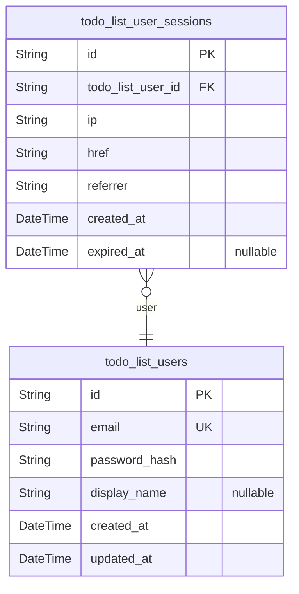
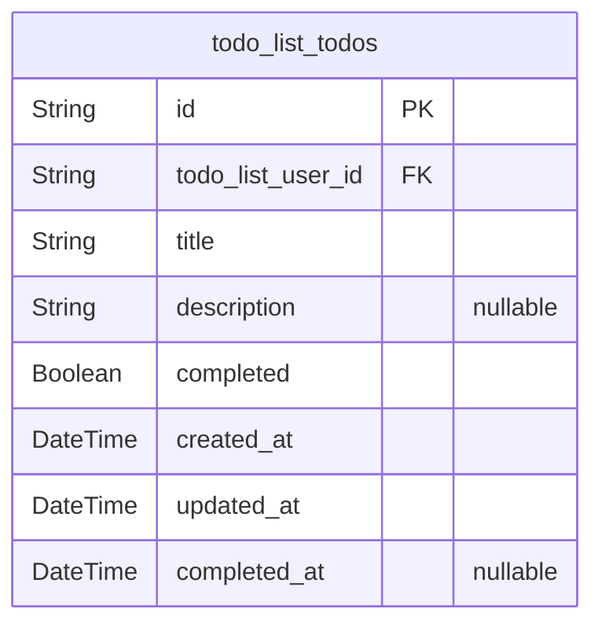

# Prisma Markdown

> Generated by [`prisma-markdown`](https://github.com/samchon/prisma-markdown)

- [Actors](#actors)
- [Todos](#todos)

## Actors

```mermaid
erDiagram
"todo_list_users" {
  String id PK
  String email UK
  String password_hash
  String display_name "nullable"
  DateTime created_at
  DateTime updated_at
}
"todo_list_user_sessions" {
  String id PK
  String todo_list_user_id FK
  String ip
  String href
  String referrer
  DateTime created_at
  DateTime expired_at "nullable"
}
"todo_list_user_sessions" }o--|| "todo_list_users" : user
```

### `todo_list_users`

Registered users for the Todo List application and core system
authentication entity.

This table stores all individual user identities including their email,
password hash for authentication, and timestamps for registration and
account changes. Each user account is uniquely identified by its email
address, which must be globally unique across all users. Passwords are
securely stored as cryptographic hashes. Users are the sole owners of
their Todos and may create, update, or delete their own tasks
exclusively. No soft delete or status field is present; users are
permanently removed upon deletion as per business requirement. Account
creation and update times are recorded for audit and analytics purposes.

Properties as follows:

- `id`: Primary Key.
- `email`
  > User email address for authentication and communication. Must be unique
  > and comply with business email validation.
- `password_hash`
  > Cryptographic hash of user's password, never stored in plain text. Used
  > for authentication only.
- `display_name`
  > Optional display name for the user profile. Displayed in UI for
  > personalization; may be null if not set.
- `created_at`: Timestamp when this user account was created.
- `updated_at`: Timestamp of the user's last profile/update action.

### `todo_list_user_sessions`

User session audit and authentication tracking for users in the Todo List
system.

Each record represents a single login or active user session, associated
with the owning user via foreign key. This table records essential
context for security auditing: IP address, originating URL, referrer,
creation and expiration times. No additional per-session business fields
are present per the prescribed session pattern. Supports multiple
concurrent sessions per user for use across devices. Sessions are used
for login, token validation, and activity tracing, and managed through
identity flows. Deletion is permanent and not recoverable.

Properties as follows:

- `id`: Primary Key.
- `todo_list_user_id`
  > Reference to the owning user of this session. Links each session to a
  > registered user. [todo_list_users.id](#todo_list_users).
- `ip`: IP address of user connection for this session audit.
- `href`: URL where the session was originated (e.g., login or API endpoint).
- `referrer`
  > Referrer URL present at session initiation; may be used for additional
  > auditing or context.
- `created_at`: Session creation timestamp. Used for session audit and sorting.
- `expired_at`
  > Session end/expiration timestamp; null if active. Set when session
  > terminated by user/logout or expiry.

## Todos

```mermaid
erDiagram
"todo_list_todos" {
  String id PK
  String todo_list_user_id FK
  String title
  String description "nullable"
  Boolean completed
  DateTime created_at
  DateTime updated_at
  DateTime completed_at "nullable"
}
```

### `todo_list_todos`

A user's individual Todo task with tracked status and strict private
ownership.

Each row represents a single Todo created and managed by a registered
user. Todos contain a required title, an optional multi-line description,
a completion status, and precise audit timestamps recording creation,
last update, and completion events. Ownership is enforced: only the
creating user can access, modify, or delete each Todo. The table provides
full history for business reporting and supports independent CRUD
operations, real-time task updates, and secure privacy boundaries. No
Todo can exist without a valid user owner (linked through a required
foreign key). Business rules ensure no duplicate titles per user among
active (incomplete) Todos. Permanent deletion aligns with business
requirements (no soft-delete). All user interactions and modifications
are logged via timestamps for accountability and metrics.

Properties as follows:

- `id`: Primary Key. Unique identifier for the Todo item.
- `todo_list_user_id`
  > Owner of this Todo. Foreign key; strict privacy enforcement. References
  > [todo_list_users.id](#todo_list_users).
- `title`
  > Required task summary. 1–100 chars. Business-validated; must not be empty
  > or blank.
- `description`
  > Optional longer detail or notes. Up to 500 chars. May be null if not
  > provided by user.
- `completed`
  > Whether this Todo is finished (true) or still pending (false). Business
  > logic ensures only owner can update.
- `created_at`: Creation timestamp. Records exact moment the Todo was created.
- `updated_at`
  > Last modification timestamp; always reflects current and accurate Todo
  > data.
- `completed_at`: Moment when Todo was marked completed; null if still pending.
