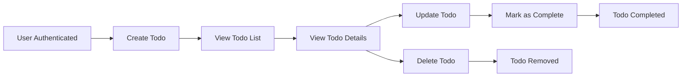

# Functional Requirements for Todo List Application

## Introduction
The Todo List application enables users to manage their personal tasks digitally with a focus on ease of use and minimal required functionality. The core vision is to allow a registered user to securely manage only their own tasks (Todos) in a private, authenticated space. The product's business value is to help users track, complete, and organize their everyday tasks efficiently. Requirements in this document provide the definitive source of truth for backend implementation, written using EARS (Easy Approach to Requirements Syntax) for absolute clarity and enforceability in English.

## Core Functionalities for Todos
- Users SHALL be able to create new Todos for their personal list.
- Users SHALL view a list of their own Todos and inspect details of each Todo.
- Users SHALL update properties of a Todo (title, optional description, status).
- Users SHALL mark any Todo as completed when a task is done.
- Users SHALL delete Todos that are no longer needed.
- All Todo operations must be available only to authenticated users, with no public access.
- Each Todo SHALL have the following fields: title (required), description (optional), status (completed/not completed), creation timestamp, last modification timestamp, completion timestamp (if completed).

## Requirement Statements using EARS Format
All requirements use EARS format for precision and developer testability.

### Authentication & User Management
- THE system SHALL require every user to register an account with a unique identifier (e.g., email).
- THE system SHALL require valid authentication (e.g., JWT token) for any access to Todo features.
- WHILE unauthenticated, THE system SHALL restrict access to all Todo operations (create, view, update, delete, complete).
- WHEN a user’s session expires or token is invalid, THE system SHALL deny Todo access and prompt reauthentication.
- WHEN a user logs out, THE system SHALL terminate their session and restrict further access until login.

### Core Todo Operations
- WHEN a user submits valid registration information, THE system SHALL create a new user account and enable Todo access.
- WHEN an authenticated user creates a new Todo with all required fields, THE system SHALL add the Todo to their personal list and return its details.
- WHEN an authenticated user requests their Todo list, THE system SHALL return only those Todos belonging to that user, ordered by newest first.
- WHEN a user requests details for a specific Todo, THE system SHALL display complete information for that Todo only if it belongs to the requesting user.
- WHEN a user updates any field of a Todo, THE system SHALL persist the changes, update the modification timestamp, and return the updated Todo.
- WHEN a user marks a Todo as completed, THE system SHALL update the completion status and store the completion timestamp.
- WHEN a user deletes a Todo, THE system SHALL permanently remove it from their list and confirm removal.

### Data Isolation & Authorization
- THE system SHALL prevent users from accessing or modifying Todos owned by other users.
- IF a user attempts any operation on another user’s Todo, THEN THE system SHALL deny the request and return an authorization error.

### Input Validation & Error Handling
- IF a user’s request to create or update a Todo is missing the required title, THEN THE system SHALL reject the request and return a clear error message specifying the missing field.
- IF a user attempts any Todo operation while unauthenticated, THEN THE system SHALL deny the request and return an authentication error.
- IF a user tries to update or delete a Todo that does not exist, THEN THE system SHALL return a not-found error.

### Optional and Field Rules
- WHERE a user provides an optional description for a Todo, THE system SHALL save and display it; otherwise, the field may be empty.

## Acceptance Criteria
- All Todo features (create, list, view, update, complete, delete) are available only to users with valid authentication.
- Users cannot see or modify any Todos owned by other users.
- On all Todo operations, the system enforces ownership, input validation, and error scenario handling as described above using EARS statements.
- All error responses must be clear, actionable, and reference the triggering business rule (e.g., missing field, unauthorized, unauthenticated, not found).
- Session management and authentication align with the requirements for isolation, security, and simplicity as described.

## Supplementary Diagram

## Glossary
- **Todo:** A single task or activity managed by a user, with required title, optional description, and status (completed or not).
- **User:** An individual account registered in the system, authenticated for personal Todo management.
- **Authentication:** The process and result of verifying a user's identity for secure system access.
- **Completed:** The status of a Todo once the user marks it finished; system records the completion time.
- **Session:** The active, authenticated state of a user, during which all Todo operations are permitted. Ends upon logout or token expiration.
