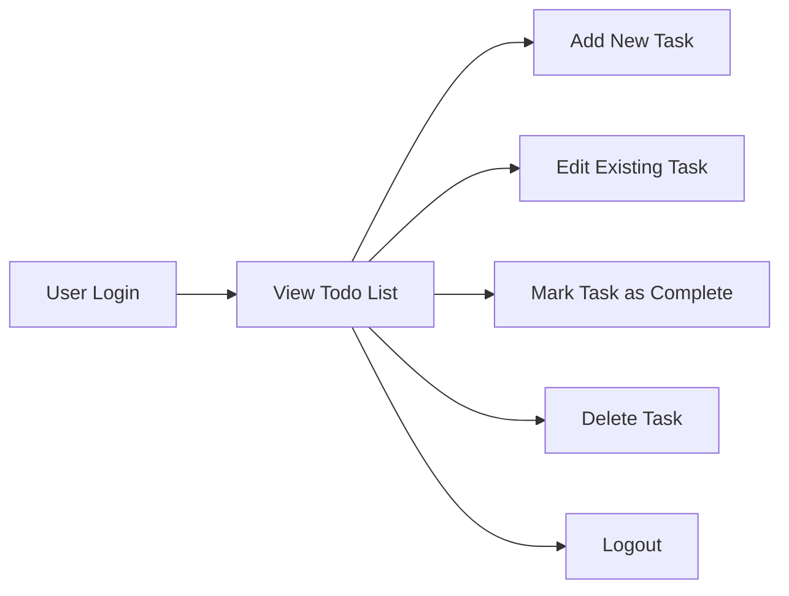

# Todo List Application Requirement Specification

## Service Purpose & Vision
The Todo list application exists to increase individual productivity and reduce stress by providing a digital space for users to record, organize, and manage their daily personal tasks. The system is designed to be minimal, distraction-free, and intuitive, allowing users to focus their attention on task completion and progress tracking without unnecessary clutter or cognitive overhead. The vision is to empower every user—regardless of technical expertise—with an organizing tool that fits seamlessly into their lifestyle and enables frequently reviewing, updating, and checking off tasks.

## Target Users
Target users are self-motivated individuals who value organization, privacy, and simple digital experiences. Personas include professionals, students, household managers, freelancers, and anyone seeking clear and reliable personal task management. All users require:
- Private task visibility (no public lists)
- Intuitive navigation and editing
- Minimal cognitive load to manage daily routines
- Accessibility across devices

## Business Model
The application is deployed free of charge in its initial form to maximize adoption. The business model may evolve to include freemium upgrades, integrations (e.g., with calendars), or non-intrusive contextual advertising. There are no social, group, or public features; all user data remains private by default. The value is primarily in user satisfaction and retention; no monetization features are present in the MVP.

## Key Features
- WHEN a user creates an account, THE system SHALL create a private, personal todo list accessible only by that user.
- WHEN a user is authenticated, THE user SHALL be able to add a new task specifying a required title and an optional description or due date.
- WHEN a user views their todo list, THE system SHALL display all tasks in a logical order (by creation time or due date).
- WHEN a user marks a task as completed, THE system SHALL visually indicate task completion and move the task out of the incomplete view.
- WHEN a user edits a task, THE system SHALL update the task details as per user input.
- WHEN a user deletes a task, THE system SHALL remove the corresponding task from the user’s list.
- WHEN a user logs in, THE system SHALL ensure only the user’s private tasks are accessible and prevent access to other users’ data.
- WHEN a user logs out, THE system SHALL securely terminate the session and ensure no task data is leaked or retained in session data.
- WHEN a user attempts an action on a task not owned by them, THE system SHALL deny access and return an appropriate error message.
- The system SHALL not expose any endpoints for group, public, or collaborative tasks in the MVP.

## Core Value Proposition
The Todo list application provides:
- Simplicity—users can instantly benefit with zero learning curve
- Reliability—actions are consistent and predictable
- Privacy—no data is shared, all lists are private by design
- Accessibility—responsive design ensures use on desktop and mobile
- Fast interaction—add, complete, or edit tasks with minimal latency

## Authentication and Actor Model
- The system supports a single user actor: 'User'.
- WHEN a new user registers, THE system SHALL require unique credentials (email and strong password).
- WHEN a user logs in, THE system SHALL authenticate credentials securely and provide a session token.
- WHEN entering any app feature, THE user SHALL be authorized exclusively for their own data and actions.
- WHEN an unauthenticated user attempts any operation, THE system SHALL require authentication and prompt login or registration.
- No admin, public, or group-level actors are present in the MVP scope.

## Visual User Workflow

## Success Criteria
- WHEN a user can consistently create, update, complete, delete, and list their tasks with no data corruption or data leak, THE application SHALL be considered functionally complete.
- WHEN any unauthorized operation is attempted, THE system SHALL enforce data isolation and provide clear, user-facing error messages.
- Task creation, update, completion, and deletion SHALL not exceed 1 second for the user interface to respond under normal load.

All requirements follow EARS format to ensure clarity and testability.

## Out-of-Scope (MVP)
- No group or shared task lists
- No recurring or scheduled reminders
- No integrations (calendar, file upload)
- No premium features, ads, or monetization flows

## Project Integration Reference
For related technical details, see complementary documents on scenarios, actors/authentication, and error handling.