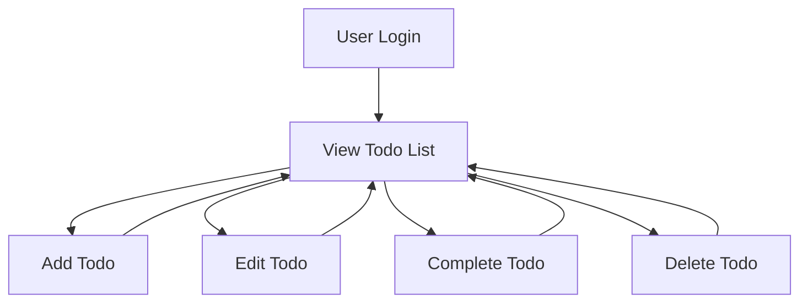

# Minimal Todo List Requirements

## Introduction / Background
The Minimal Todo List is designed to solve everyday problems related to personal task management for individuals seeking simplicity, clarity, and focus. Modern users are burdened by increasing mental loads: family, work, and personal commitments must be tracked, reviewed, and completed amidst constant information overload. Many existing solutions are either too cluttered or too sparse to be truly useful.

Based on our analysis of user pain points and the deficiencies in current offerings, we focus on ease of use, speed, privacy, and rewarding task completion, providing just the essential features for personal todo management.

## Actors and Roles

- **User**: Any individual registered and authenticated on the platform. Users are the sole owners and managers of their todo lists and associated actions. Each user's data is private and cannot be accessed by other users under any circumstances.

## Business Requirements

All requirements are stated using the EARS (Easy Approach to Requirements Syntax) template for clarity and testability.

- WHEN a user registers or logs in, THE SYSTEM SHALL ensure the user can only access and manage their own todos.
- WHEN a user chooses to add a todo, THE SYSTEM SHALL request task content and optional due date, THEN create a new todo item that is only visible to that user.
- WHEN adding a todo, THE SYSTEM SHALL reject todos with empty or whitespace-only content and return an error message.
- WHEN a user views their todo list, THE SYSTEM SHALL display all pending and completed todos in clear, chronological order and indicate completion status visually.
- WHEN a user marks a todo as complete, THE SYSTEM SHALL update its status and move it to a "completed" state in the user’s todo list.
- WHEN a user deletes a todo, THE SYSTEM SHALL permanently remove the todo after a deletion confirmation flow.
- WHEN a user edits a todo, THE SYSTEM SHALL provide an edit function to change the title, description, or due date, and reflect the changes immediately.
- WHEN there are no todos present, THE SYSTEM SHALL display an encouraging empty state message to maintain usability and motivation.
- WHEN a user attempts to access or modify a todo created by another user, THE SYSTEM SHALL deny access and inform the user that operation is not permitted.

## User Authentication and Permissions

- User authentication is required to access any todo management features.
- Users SHALL register via a standard registration flow using email and password with confirmation.
- All subsequent access must be authenticated with secure session-based or token-based mechanisms, ensuring only the owner has access to their data.
- Passwords SHALL be securely hashed and never displayed or transmitted in plain text.
- Sessions SHALL expire after 30 days of inactivity or immediately upon explicit logout.
- No user SHALL be able to view, create, edit, or delete todos belonging to another user.
- In all endpoints, system SHALL verify user identity and todo ownership before any modification, retrieval, or deletion is processed.

## User Scenarios

### Adding a Todo
WHEN a user chooses to add a todo, THE SYSTEM SHALL display a form for the todo details (content; due date optional), validate inputs, and, if valid, add the item to the user’s todo list as pending.

### Completing a Todo
WHEN the user marks a todo as complete, THE SYSTEM SHALL update its status and timestamp appropriately, moving it to the "completed" section.

### Editing a Todo
WHEN the user edits a todo, THE SYSTEM SHALL provide immediate editing capability, validate updated content, and save changes with effect visible to the user.

### Deleting a Todo
WHEN the user chooses to delete a todo, THE SYSTEM SHALL display a confirmation prompt. Upon confirmation, the todo is deleted and removed from user’s list.

### Reviewing Todos
WHEN the user views their todo list, THE SYSTEM SHALL list all todos (pending and completed), display due dates (if any), and clearly differentiate between statuses.

## Error Handling & Edge Cases

- WHEN input data fails validation (empty content, excessive length, or invalid date), THE SYSTEM SHALL notify the user with a specific, helpful error message within 2 seconds.
- WHEN a user attempts to operate on another user’s todo (view, update, or delete), THE SYSTEM SHALL return an error indicating insufficient permissions within 2 seconds.
- WHEN an internal error occurs during any operation, THE SYSTEM SHALL display a user-friendly error message and suggest retrying.
- WHEN a user tries to create a todo with only whitespace or forbidden characters, THE SYSTEM SHALL reject input and instruct the user to enter valid text.

## Non-Functional (Business) Requirements

- Privacy SHALL be enforced as a primary business requirement: THE SYSTEM SHALL ensure that todos are strictly private and never disclosed to third parties.
- Usability SHALL be a core focus: all operations SHALL be possible within 2 clicks or taps from the main list screen, minimizing cognitive effort.
- System WILL NOT include any non-essential features such as collaboration, file attachments, tagging, prioritization, or notifications in this version.
- All user data SHALL be retained for at least 12 months after account inactivity unless deleted by the user.

## Completion and Success Metrics

- System success SHALL be measured by user retention, specifically the frequency of repeat usage over a 30-day period.
- Task completion rates and reduction in user-reported friction SHALL be tracked and used as quality metrics.
- System SHALL support exporting and anonymizing data for user-initiated requests in compliance with privacy best practices.

## Example Minimal Use Case Flow (Mermaid)

