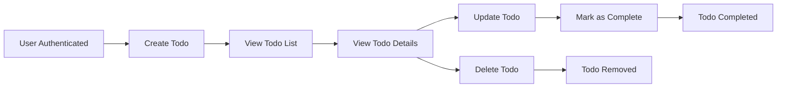

# Functional Requirements for Todo List Application

## Introduction
The Todo List application enables individuals to manage their personal list of tasks efficiently. This requirements specification outlines the minimum necessary business functionalities, interfaces, and rules so that developers can implement a reliable, user-friendly service. The primary goal is to support user productivity by providing private, authenticated Todo tracking.

## Core Functionalities for Todos
- User registration and login to enable private, authenticated access for each user.
- Secure personal Todo list management for creating, reading, updating, completing, and deleting Todo items.
- Each Todo must include a title (required), an optional description, completion status, timestamps for creation and last update, and (when applicable) completed time.
- Error handling for all invalid input, unauthorized behavior, and access to non-existent or non-owned resources.
- Session management: user-initiated logout, token expiration, and revocation of access upon session end.

## Requirement Statements (EARS Format)
### Ubiquitous Requirements
- THE service SHALL require every user to register an account and authenticate BEFORE using TODO functionality.
- THE service SHALL maintain a private Todo list, isolated per user: users SHALL NOT view or manipulate data of others.
- THE service SHALL track creation date and last updated date per Todo item.

### Event-driven Requirements
- WHEN valid registration data is submitted, THE service SHALL create a new user account and associate an empty Todo list.
- WHEN successful authentication occurs, THE service SHALL enable access to the user's private Todos only.
- WHEN an authenticated user submits a valid new Todo (with title), THE service SHALL add it to the user's Todo list and return relevant details.
- WHEN a user requests their Todo list, THE service SHALL return all Todos belonging to the authenticated user, ordered newest-to-oldest.
- WHEN a user requests details for a specific Todo, THE service SHALL display its title, optional description, status, and timestamps.
- WHEN a user updates any Todo field, THE service SHALL persist the new value and set the appropriate updated timestamp.
- WHEN a user marks a Todo as completed, THE service SHALL update the Todo's status to 'complete' and record the completed time.
- WHEN a user deletes a Todo, THE service SHALL permanently remove it from their list.
- WHEN a user logs out, THE service SHALL invalidate their session token and prevent further Todo access until re-authentication.

### State-driven Requirements
- WHILE a user is unauthenticated, THE service SHALL restrict all Todo management endpoints and reject requests.
- WHILE a user's authentication token is expired or invalid, THE service SHALL deny all Todo API access and require login.

### Unwanted Behavior Requirements
- IF a Todo input is missing required fields (e.g., title), THEN THE service SHALL reject the creation/update and return a clear validation error message.
- IF a user attempts to access, edit, or delete another user's Todo, THEN THE service SHALL deny access and provide an authorization error with no data leakage.
- IF a user attempts any Todo operation without valid authentication, THEN THE service SHALL reject with an authentication-required error.
- IF a user attempts to update or delete a Todo that does not exist, THEN THE service SHALL respond with a resource not found error.
- IF a user tries to access service features after logout, THEN THE service SHALL require new authentication for all further actions.

### Optional Acceptance Requirements
- WHERE a Todo includes an optional description, THE service SHALL store and allow user to retrieve, edit, or remove the description. WHERE omitted, no blank description is stored or returned in the Todo data.

## Acceptance Criteria
- All users must be registered and authenticated before accessing any Todo functionality.
- Each user can only interact with their own Todos.
- Complete CRUD and status update operations are available for Todos—only by authenticated users, affecting their records.
- Every Todo includes at minimum: title (string), completion status (boolean), creation and update timestamps, and (if completed) completion timestamp. Description is optional but accepted and preserved where provided.
- The system returns actionable, user-friendly error messages for: invalid input, unauthorized access, unauthenticated use attempts, and attempts to access or operate on non-existent or unowned Todos.
- User sessions conclude on logout, with all protected endpoints inaccessible until re-authentication.

## Supplementary Diagram

## Glossary
- **Todo:** A discrete task or activity managed by an individual user.
- **User:** A registered and authenticated account owner with private, exclusive access to their Todo list and related actions.
- **Authenticated:** State in which the user's identity has been verified and authorized; grants access to protected functions.
- **Completed:** Status reflecting that a user has finished a Todo task, with the service recording this explicitly.