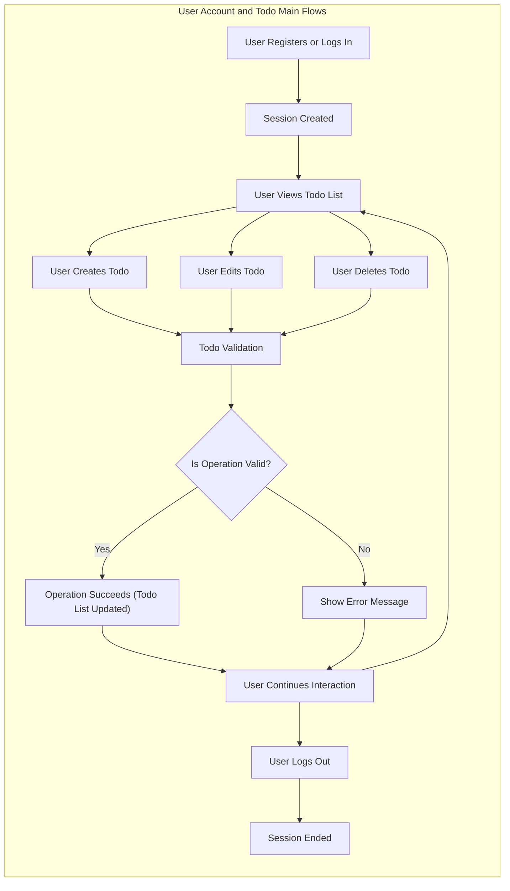

# User Scenarios for Todo List Application

## Scenario Overview

"TodoList" enables a single actor, the user, to maintain a personal todo list. Users can register, log in, manage their tasks, and ensure data privacy and their own security. All user actions, normal and exceptional, are documented to support robust backend logic.

## Step-by-Step User Journeys

### 1. Account Registration and Authentication

**Registration**
- WHEN a visitor submits valid registration information, THE system SHALL create an account and allow login.
- IF invalid information is provided (missing fields, bad format, duplicate email), THEN THE system SHALL show precise errors and require correction.
- WHEN registration succeeds, THE system SHALL create a secure session for the user.

**Login**
- WHEN a user submits valid credentials, THE system SHALL authenticate and establish a session.
- IF login credentials are incorrect or missing, THEN THE system SHALL deny access with the message: "Invalid email or password."
- IF a user account is locked or disabled, THEN THE system SHALL deny login and display the reason.

**Logout and Session Expiry**
- WHEN a user requests logout, THE system SHALL terminate their session and restrict access to personal data.
- WHEN the user’s session is idle or the token has expired, THE system SHALL require re-authentication.

**Password Recovery**
- WHEN a user requests a password reset, THE system SHALL email a secure reset link to the registered address.
- IF a reset link is used after it has expired, THEN THE system SHALL deny the request and prompt for a new reset.

### 2. Todo CRUD Operations

**Create Todo**
- WHEN a user submits a new Todo with valid data, THE system SHALL add the Todo to the user’s list.
- IF title is missing/blank/too long, due date is in the past, or data is not valid, THEN THE system SHALL deny creation and show specific error messages.
- THE system SHALL prevent duplicate titles for a user’s active (incomplete) Todos.

**Read Todos**
- WHEN a user requests their todo list, THE system SHALL return all their Todos, sorted newest first by default.
- WHEN the user applies a filter by completion status or date, THE system SHALL return the filtered Todos.
- WHEN a sort order is specified (due date, priority), THE system SHALL return Todos in that order.

**Update Todo**
- WHEN a user edits a Todo, THE system SHALL validate and apply the changes.
- IF new data is invalid or breaks business rules (duplicate title), THEN THE system SHALL refuse the update and explain why.
- THE system SHALL restrict editing to only the owner’s Todos.
- IF a user attempts to edit a Todo that does not exist or does not belong to them, THEN THE system SHALL deny access and show a suitable message.

**Delete Todo**
- WHEN a user requests deletion of a Todo, THE system SHALL mark it as deleted if and only if it belongs to them.
- IF the Todo is already deleted or does not exist, THEN THE system SHALL return a resource unavailable error.

**Mark as Complete/Incomplete**
- WHEN a user marks a Todo as complete, THE system SHALL update its status and set a completion timestamp.
- WHEN a user marks an already-completed Todo as complete, THE system SHALL make no change and notify the user.
- WHEN a user marks a completed Todo as incomplete, THE system SHALL update the status and remove the completion date.

### 3. Todo List Management

- WHEN a user toggles filters, THE system SHALL display only completed or incomplete Todos as requested.
- WHEN reading archived/deleted Todos, THE system SHALL show them in a separate view.
- WHILE the session is active, THE system SHALL persist all user Todo changes immediately.

**Sort/Filter**
- WHEN the user applies sorting or filtering on their Todo list (by status, date, priority), THE system SHALL deliver the adjusted results without delay.

### 4. Session, Security, and Permissions

- WHEN a session expires or JWT is invalid, THE system SHALL prompt for login and block further protected actions.
- IF a user attempts unauthorized actions (edit/delete others’ Todos), THEN THE system SHALL deny the action and show an appropriate unauthorized error.
- WHEN sensitive operations are attempted (e.g., password or email change), THE system SHALL require ownership verification.

## Edge Cases and Alternatives

### Registration & Login Edge Cases
- IF an attempt is made to register with a used email, THEN THE system SHALL reject it and show "Email already used."
- IF a password is too weak (fails length or format rules), THEN THE system SHALL prevent registration and list each unmet requirement.
- WHEN multiple failed login attempts occur, THE system SHALL enforce a lockout or delay to defend against brute-force attacks.

### Todo Management Edge Cases
- IF maximum number of Todos (if such a limit is defined) is exceeded, THEN THE system SHALL block creation and notify the user.
- IF a Todo is empty (only whitespace), THEN THE system SHALL return a generic validation error.
- WHEN a user tries to update or mark a deleted/missing Todo, THE system SHALL notify them that the item does not exist.
- IF several conflicting Todo actions happen at once (rapid update/delete), THEN THE system SHALL ensure only one valid state is saved (idempotency).

### Duplicate & Authorization Edges
- IF a user tries to create an active Todo with a duplicate title, THEN THE system SHALL block it and explain the problem.
- IF a user attempts to view or modify another user’s Todo (by ID or direct access), THEN THE system SHALL deny it and log the event.

## Mermaid Flow Diagram Example

## Security and Abuse Prevention Scenarios

- WHEN a user session is suspected of being hijacked or a token stolen, THE system SHALL revoke or invalidate it, notify the account owner, and require re-login.
- IF many failed login attempts are detected from the same source, THEN THE system SHALL throttle further attempts and may show CAPTCHA.
- WHEN abnormal usage is detected (bulk deletion, spikes of activity), THE system SHALL trigger rate limits or additional verification (e.g., email confirmation, multifactor authentication).

## Summary Table: User Journey Checklist

| Scenario                               | Normal Flow | Edge/Alt Flows |
|----------------------------------------|-------------|----------------|
| Registration                           | ✅          | Email used, weak pw    |
| Login                                  | ✅          | Wrong pw, locked acct  |
| Logout                                 | ✅          | Expired session        |
| Create Todo                            | ✅          | Duplicate, invalid     |
| Read/View Todos                        | ✅          | None                  |
| Update Todo                            | ✅          | Bad data, unauthorized |
| Delete Todo                            | ✅          | Not found, unauthorized|
| Mark as Complete/Incomplete            | ✅          | Already set            |
| Filter/Sort                            | ✅          | Invalid params         |
| Password Recovery                      | ✅          | Expired/invalid link   |

## Closing Notes

All flows are actionable and measurable for backend development. Each scenario and rule is presented in EARS format, directly reflecting business and user needs, addressing all edge and security cases. No database schema or API definitions are presented; the focus remains solely on unambiguous, business-driven requirements.