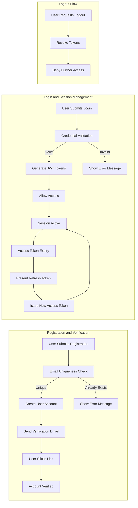

# User Actors and Authentication

## User Actor Definition

The Todo List application is designed for individual registered users to securely manage their own Todos and account settings. All actors, their business capabilities, and boundaries are delineated as follows:

| Actor | Description |
|-------|-------------|
| User  | A registered individual who can manage their own Todo items. This includes creating, viewing, updating, and deleting their Todos, marking items as complete/incomplete, and managing personal account settings. No user has access to any other user’s data. |

### Actor Permission Boundaries
- THE user SHALL access only their own Todo items and account data at all times.
- THE user SHALL NOT view or modify Todo items or account data belonging to any other user under any circumstances.
- THE user SHALL perform account management actions (such as changing password, updating email, or deleting their own account) solely on their own account.
- THE user SHALL have equal access to all core Todo management features detailed herein, with no administrative privileges, escalation, or superuser options.
- THE system SHALL enforce these boundaries on every API endpoint, workflow, and database operation, and SHALL ensure that attempted violations are blocked and logged for auditing.

## Authentication Flows

Secure authentication is fundamental to ensure privacy and data protection. All flows support business needs for real-world user onboarding, session, and security requirements.

### Registration
- WHEN a new individual wishes to use the Todo List application, THE system SHALL allow user registration using a valid email address and password.
- WHEN the registration form is submitted, THE system SHALL verify that the provided email is not already associated with an active user account.
- WHEN registration is successful, THE system SHALL store the new user securely and SHALL initiate an email verification step before enabling login or access to any business features.

### Login
- WHEN a user enters valid credentials (email and password), THE system SHALL authenticate the user and start an authenticated session by issuing JWT tokens.
- IF the user provides invalid credentials, THEN THE system SHALL deny access and show a clear error message stating the problem.
- WHEN an account’s email address has not yet been verified, THE system SHALL prevent any login until verification is complete.

### Email Verification
- WHEN registration occurs, THE system SHALL immediately send a verification email with a secure link.
- WHEN the user clicks the verification link, THE system SHALL activate their account and allow subsequent login.

### Password Management
- WHEN a user forgets a password, THE system SHALL provide a password reset process via a confirmed email link.
- WHEN a user requests a change to their password, THE system SHALL require the correct current password and enforce strong new-password rules as defined by the business.

### Session & JWT Token Management
- THE system SHALL maintain authenticated sessions using JWT (JSON Web Tokens) with the following requirements:
  - Access tokens SHALL expire after 30 minutes of inactivity (configurable by business).
  - Refresh tokens SHALL expire after 30 days regardless of session continuity.
  - WHEN an access token expires, THE system SHALL permit session renewal with a valid refresh token.
  - WHEN a refresh token is used, THE system SHALL issue new tokens and invalidate the previous refresh token unless concurrent sessions are specifically allowed by business rules.
  - JWT payloads SHALL always include userId and role claims as essential business attributes.
  - JWT secret key management SHALL meet enterprise-grade confidentiality standards.
- WHEN a user logs out (from any device), THE system SHALL immediately revoke the associated tokens, denying future access.
- WHEN a user requests to log out of all sessions (all-device logout), THE system SHALL invalidate all authentication tokens issued to that user.

### Security Requirements
- THE system SHALL store user passwords with strong, one-way cryptographic hashing only.
- THE system SHALL prohibit successful login for accounts whose email address has not been verified.
- IF suspicious login behavior (such as brute force, location change, or rapid session reuse) is detected, THEN THE system SHALL require additional verification or multi-factor authentication as an extensible business requirement.

#### Mermaid Business-Process Diagram: Authentication and Session Flow

## Permission Matrix

Comprehensive requirements for user action permissions, role restrictions, and edge scenarios:

| Action                              | User |
|-------------------------------------|------|
| Register account                    | ✅   |
| Verify email                        | ✅   |
| Login                               | ✅   |
| Logout                              | ✅   |
| View own Todos                      | ✅   |
| Create Todo                         | ✅   |
| Update own Todo                     | ✅   |
| Delete own Todo                     | ✅   |
| Mark Todo as complete/incomplete    | ✅   |
| Change own password                 | ✅   |
| Reset password via email            | ✅   |
| Change own account settings         | ✅   |
| Delete own account                  | ✅   |
| View Todos of other users           | ❌   |
| Modify Todos of other users         | ❌   |
| Administrative actions              | ❌   |

### Permission Boundary EARS Requirements
- THE user SHALL only have access to resources that they personally own.
- THE user SHALL NOT be able to access, view, or modify any resources owned by any other user.
- THE system SHALL strictly enforce permission boundaries via business logic and authentication at every endpoint and workflow.
- IF a user attempts any action on a Todo or account resource that does not belong to them, THEN THE system SHALL deny the action and return an appropriate error.

## JWT Payload Structure & Session Rules
- THE JWT payload for authenticated sessions SHALL include:
  - userId: Unique identifier of the logged-in user
  - role: Always set to "user"
  - issued-at time (iat): For business auditing and security
  - session identifier (optional): For concurrent session tracking if enabled by business

- THE system SHALL allow concurrent user sessions unless or until a business requirement prohibits this
- THE user SHALL be able to review and revoke all open sessions from their own account management (future business enhancement)

## Summary

All user actors, authentication processes, permission boundaries, and session-handling rules described herein are non-negotiable business requirements. Every authenticated workflow in the Todo List system must strictly enforce self-ownership, privacy, and business access control without exception. Security, privacy, and usability are paramount, and backend implementation SHALL guarantee these requirements at every level.