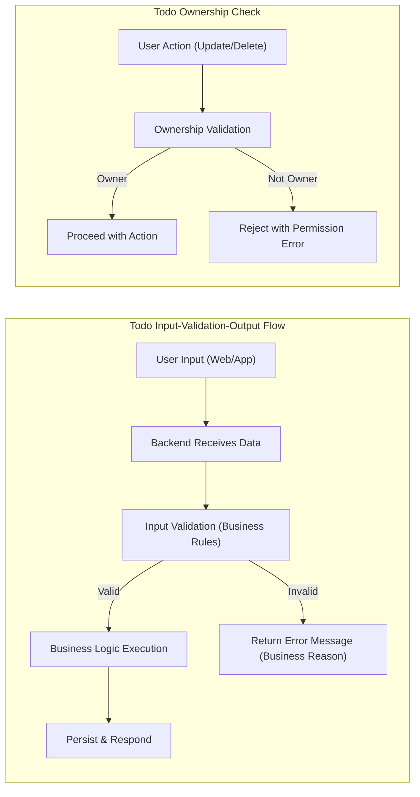

# Input and Validation Requirements for Todo List Application

## Introduction

Data validation is essential for delivering a robust and user-friendly Todo List application. Every user input—whether during registration, login, or managing Todos—MUST follow strict business rules to ensure application integrity and a secure, reliable user experience. This document explains all input types, required validations, expected outputs, and error management processes. These requirements are written for backend developers, using natural language and the EARS format (e.g., WHEN, THE, SHALL, IF, THEN) to remove ambiguity and support production-quality implementation.

## Input Data Types

### 1. User Management

- **Registration:**
  - **Email:** Required. WHEN a user enters email, THE system SHALL accept only formats matching business email conventions (e.g., user@example.com).
  - **Password:** Required. WHEN a user submits a password, THE system SHALL enforce a length of 8–50 characters and require at least one letter and one digit.
  - **Display name:** Optional. WHEN present, THE system SHALL verify display names are 1–30 characters, and SHALL filter out profanity or banned language.

- **Login:**
  - **Email:** Required. WHEN a user attempts to login, THE system SHALL require email in valid format.
  - **Password:** Required. SHALL meet registration standards.

- **Account Update:**
  - **Display name:** Optional. WHEN present, THE system SHALL check for length (1–30), profanity, and duplication of previous names.
  - **Password:** Optional. WHEN a change is requested, THE system SHALL require current password confirmation.
  - **Deactivate/Reactivate Account:** Required. WHEN a user chooses this, THE system SHALL demand positive confirmation.

- **Account Deletion:**
  - **Confirmation:** Explicit user confirmation required. WHEN a user attempts deletion, THE system SHALL require re-entry of password or a specific code word (such as ‘delete’).

### 2. Todo Management

- **Create Todo:**
  - **Title:** Required. WHEN a Todo is created, THE system SHALL enforce 1–100 characters (no line breaks), prohibit profanity or offensive content, and reject blank titles.
  - **Description:** Optional. WHEN present, THE system SHALL ensure it’s 0–500 characters and free of banned content.
  - **Due date:** Optional. WHEN present, THE system SHALL check for valid ISO 8601 date string and SHALL reject dates before today.
  - **Priority:** Optional. WHEN omitted, THE system SHALL default to ‘medium.’ All values SHALL be one of ['low', 'medium', 'high'].

- **Update Todo:**
  - Any field may be updated, following all creation validations. Only the Todo owner can update. Title remains required (cannot be blanked).

- **Mark as Complete/Incomplete:**
  - WHEN a user toggles completion, THE system SHALL accept only if the user is owner and Todo is not deleted.

- **Delete Todo:**
  - WHEN a deletion is requested, THE system SHALL allow only the owner to delete, and SHALL treat repeated deletions idempotently (no error for already deleted Todos).

- **List Todos:**
  - **Pagination:** pageNumber (>=1; default: 1), pageSize (>=1; default: 20, max: 100)
  - **Filter:** Optional; allowed filters are status (‘complete’, ‘incomplete’) or priority. Invalid values are rejected with actionable errors.

## Validation Rules

- Email must match business-compliant format (‘foo@bar.com’), and duplication is not permitted.
- Passwords are 8–50 characters, must include at least one letter and digit.
- Display names are checked for length and banned words, and may not repeat old display names for that account.
- WHEN a registration occurs, THE system SHALL reject any duplicated or invalid email, or weak password.
- WHEN login fails, THE system SHALL return user-friendly error for invalid credentials.
- WHEN a user submits a new Todo, THE system SHALL verify that:
  - Title is 1–100 characters and clear of banned/blank input
  - Description (if present) is 0–500 characters and free of inappropriate content
  - Due date (if present) is ISO 8601 and not in the past
  - Priority is one of the allowed set (‘low’, ‘medium’, ‘high’)
- Only the Todo’s owner may update, complete, or delete Todos. Unauthorized actions MUST be denied with a permission error.
- Pagination and filter fields MUST be positive integers and approved filter values; reject invalid inputs with clear business errors.
 
### EARS Example Requirements
- WHEN a user submits registration, THE system SHALL:
  - verify the email is unique and properly formatted
  - enforce password strength
  - screen display names for prohibited content
  - return clear errors on invalid input
- WHEN a Todo is created, THE system SHALL:
  - enforce title length/content
  - handle optional description and due date appropriately
  - reject violations with actionable error messages
- WHEN a non-owner acts on a Todo, THE system SHALL deny and inform user
- WHEN filter or pagination input is invalid, THE system SHALL respond with precise error and actionable guidance

## Output Expectations

- WHEN all user fields pass validation, THE system SHALL process the request and confirm success.
- WHEN input fails any rule, THE system SHALL return a user-facing error that specifies the failing field and how to fix it.
- WHEN partial updates are attempted, THE system SHALL reject and require all submitted changes to be valid (all-or-nothing principle).
- Error responses SHALL never leak technical codes—always plain, actionable guidance in user’s locale.
- Realistic error message example: "Title must be 1–100 characters and free of banned words. Try a title like 'Buy groceries.'"

## Edge Cases, Error Handling, and Recovery

- Repeated delete or completion requests MUST be idempotent—no error if item is already deleted/completed.
- WHEN a user supplies invalid input for pagination, status, or priority filters, THE system SHALL offer correction guidance.
- WHEN expired or incorrect due dates are submitted, THE system SHALL reject with a message like "Due date cannot be in the past; please choose today or later."
- WHEN ownership is violated, THE system SHALL provide a permission error with "You cannot modify this Todo."

### Comprehensive Error Table

| Error Scenario                    | Condition                                         | Business Response                                             |
|-----------------------------------|---------------------------------------------------|--------------------------------------------------------------|
| Email format error                | Email invalid                                     | Reject registration; explain requirement                     |
| Password too short/weak           | Fails length/complexity                           | Reject; actionable guidance                                  |
| Duplicate email                   | Already in use                                    | Reject; explain uniqueness                                   |
| Display name error                | Too short/long, profanity, banned, duplicate      | Reject with specific hint                                    |
| Title error                       | Empty, whitespace, >100 chars, profanity, banned  | Reject with message: "Title must be 1–100 chars; no banned." |
| Description too long              | >500 chars, banned content                        | Reject update/create                                         |
| Due date invalid                  | Bad format, before today                          | Reject; clear message                                        |
| Bad priority value                | Not in allowed set                                | Reject explain allowed values                                |
| Non-owner tries to modify Todo    | Not owner                                         | Reject with permission error                                 |
| Bad pagination/filter             | Values out of accepted range                      | Reject; business guidance                                    |
| Duplicate operation               | Already completed or deleted                      | No error; success                                            |

## User Guidance and Recovery

- Every error SHALL supply actionable, friendly messages in the user’s locale.
- Provide positive examples where it will help users fix errors (e.g., suggest a correct title format).
- Errors MUST NOT expose technical codes or stack traces.

## Visual Workflow: Input → Validation → Output

## Conclusion

Business-driven input validation is the backbone of effective backend implementation. By rigorously applying the above requirements, backend developers guarantee data integrity, business security, and a user experience that earns trust. All logic described here SHALL be followed precisely during both development and future audits.