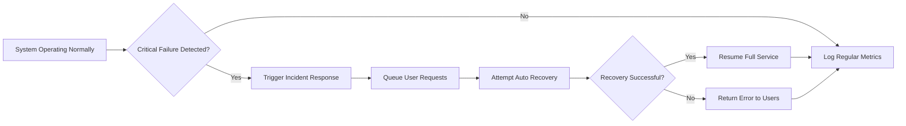

# Non-Functional Requirements for Todo List Backend Service

## Performance Expectations

### General Performance Goals
WHEN a user performs an operation to create, read, update, mark as complete, or delete a Todo item, THE system SHALL respond in under 1 second for 95% of requests under standard load.
WHEN concurrent usage rises to 1,000 users, THE system SHALL maintain a 95th percentile response time below 1.5 seconds.
WHEN users across all accounts together create up to 500 Todo items per minute, THE system SHALL sustain operations with no functional degradation.
WHEN a user requests to fetch up to 100 Todos in bulk, THE system SHALL provide the response in under 2 seconds during normal system load.
WHEN system health/status is queried, THE system SHALL provide real-time information including uptime, average response time, and system error rates through a status API endpoint.

### Peak Load and Scalability
WHEN active usage exceeds 300% of baseline average, THE system SHALL retain at least 90% of its normal read performance and 80% of normal write performance, with no full service interruptions.

### Responsiveness and User Feedback
WHEN a user submits any action (create, update, delete, mark complete), THE system SHALL immediately present a clear and unambiguous success or error message confirming the outcome.
IF an action cannot complete within 5 seconds, THEN THE system SHALL return a descriptive timeout error message and log the incident for future review.

### Resource Management
WHEN system resource usage (CPU, memory, or storage) exceeds 80% of defined thresholds, THE application SHALL alert system administrators and queue non-urgent background activities to maintain user-facing speed and responsiveness.

## Uptime and Reliability

### Service Continuity
THE system SHALL achieve a minimum of 99.5% uptime (excluding pre-scheduled maintenance) as measured monthly.
WHEN maintenance is scheduled, THE system SHALL proactively provide notice through a maintenance endpoint and, where possible, continue offering read-only access for at least 80% of the maintenance window duration.

### Failure Handling
WHEN a user-initiated data change (create, update, delete) occurs, THE system SHALL persist all changes immediately to prevent loss of any user work.
IF persistent data storage becomes temporarily unavailable, THEN THE system SHALL queue incoming user requests for up to 5 seconds and attempt retries; unserved requests SHALL result in an explanatory error being returned promptly to users.
WHEN expected infrastructure errors occur (e.g., connection failures), THE system SHALL attempt auto-recovery and preserve any unprocessed user requests for later fulfillment.
WHEN a critical service-side error is detected, THE system SHALL log the error with a full timestamp and preserve records for at least 90 days to support audit trails and investigation.

### Backup and Disaster Recovery
THE system SHALL back up all Todo list data a minimum of once every 24 hours.
WHEN disaster recovery is required, THE system SHALL meet an RTO (Recovery Time Objective) of under 15 minutes and an RPO (Recovery Point Objective) of under 1 hour, ensuring fast and reliable restoration of service and data.

## Security and Privacy

### Security Controls
WHEN any user attempts to change any Todo data, THE system SHALL strictly enforce secure authentication.
WHEN an unauthenticated or unauthorized user attempts to access or modify data, THE system SHALL prevent access and log the attempt.
WHEN authenticated, a user SHALL only access their own Todo items; access to any other user’s data SHALL be impossible at all times.
WHEN data is sent or received, THE system SHALL encrypt all information in transit according to industry standards (HTTPS, TLS 1.2 or above).
WHEN issuing or refreshing authentication tokens (e.g., JWT), THE system SHALL ensure expiry is enforced and tokens are stored securely.
IF failed login attempts are repeated beyond a safe threshold, THE system SHALL temporarily lock the account and reject further attempts to prevent brute-force attacks.
IF a possible or confirmed security breach occurs, THE system SHALL immediately log the event and inform all affected users within 48 hours.

### User Data Privacy
WHEN storing personal user information, THE system SHALL retain only the minimum required for core Todo functionality.
WHEN a user requests account deletion, THE system SHALL fully erase all personal and Todo data for that user within 24 hours, unless otherwise required by law.
WHEN requested, THE system SHALL provide users with a way to download or export all their personal and Todo data in a standardized format (JSON or CSV).
WHEN users or auditors request it, THE system SHALL maintain and provide logs of all major user actions.

## Compliance Considerations

### Regulatory Obligations
WHERE GDPR applies, THE system SHALL provide users with appropriate controls to request, rectify, or erase personal data and to receive breach notifications as per regulation.
WHEN operating in regions with local data privacy or security requirements (such as South Korea), THE system SHALL adhere to all applicable laws and publish a privacy policy and terms easily accessible to all users.

### Auditability and Policy Adherence
WHEN authentication, access, or modification events occur, THE system SHALL log and audit these for reporting to administrators as required.
WHEN data expires or is deleted, THE system SHALL comply with regulatory data retention minimums and SHALL never retain more user data than is legally or operationally necessary.

## System Uptime and Incident Response Flow

## Acceptance Criteria
- Each non-functional requirement above SHALL be testable and verifiable before production release and on an ongoing basis.
- The backend SHALL NOT be considered complete until all these requirements are demonstrably met under both normal and exceptional circumstances.

## References
- For business rules and functional requirements, see the Business Rules Guide (./08-business-rules.md) and Functional Requirements Document (./03-functional-requirements.md).
- For authentication specifications, refer to the User Actors and Authentication Guide (./05-user-actors-and-authentication.md).
- For error handling processes, consult the Error Handling Guide (./09-error-handling.md).
- For launch and evaluation criteria, review Success Metrics and Evaluation (./10-success-metrics-and-evaluation.md).

*This document sets forth business requirements only. All implementation decisions reside with the development team. These requirements define WHAT the backend must achieve, not HOW it is to be implemented.*