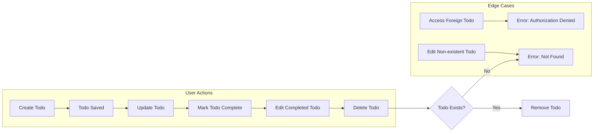
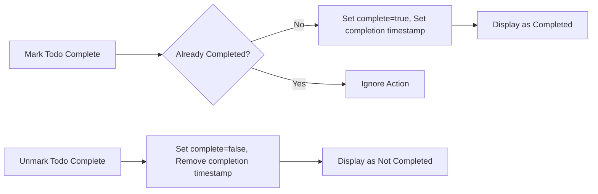

# Todo List Application: Minimum Business and Logic Requirements

## Introduction

The purpose of this document is to define the minimum operational and business rules required for a backend Todo list application. The intention is to enable developers to implement a production-ready application that covers all user and business needs, error and permission handling, and process logic for managing a basic list of Todos per user.

## Core Business Rules

- EACH user SHALL have a private Todo list, with Todos inaccessible to any other user.
- EACH Todo SHALL possess:
  - a non-empty title (required)
  - an optional description
  - a completion status
  - timestamps for creation, update, and, where applicable, completion
  - a unique identifier assigned at creation
- CRUD (Create, Read, Update, Delete) operations SHALL be permitted ONLY on Todos owned by the authenticated user.
- WHEN a user creates a Todo, THE system SHALL enforce that the title is non-empty and provided by the user at the time of creation.
- WHEN a user attempts to read, update, or delete a Todo, THE system SHALL first verify Todo ownership and deny the operation if the user does not own the Todo.
- WHEN a user marks a Todo as completed, THE system SHALL set the completion timestamp and flag the Todo as complete.
- WHEN a completed Todo is edited by its owner, THE system SHALL update the updated timestamp, retaining the original completion timestamp unless the completion status is reverted.
- WHEN a Todo is deleted, THE system SHALL permanently remove it from the user's list with NO recovery or undo feature.

## Completion Criteria

- A Todo SHALL be considered completed IF AND ONLY IF the completed status is true AND there is a non-null completion timestamp.
- WHEN a user marks a Todo as completed:
  - IF the Todo is already marked completed, THE system SHALL ignore repeated completion attempts.
  - IF the Todo is not completed, THE system SHALL set the completion status to true and populate the completion timestamp with the current time.
- WHEN a user reverts a Todo to unfinished:
  - THE system SHALL clear the completion timestamp and set the completion status to false.
- Todos with no completion timestamp SHALL ALWAYS be treated as unfinished, regardless of UI presentation.

## Edge Handling Logic

- WHEN an operation targets a Todo that does not exist, THE system SHALL respond with a not found error and perform NO further action.
- WHEN a user attempts to access or perform any operation on a Todo they do not own, THE system SHALL respond with an authorization error and take NO further action.
- WHEN an operation is performed on a reference to a deleted Todo (e.g. due to a stale client), THE system SHALL respond with a not found error.
- WHEN a user submits a Todo creation or update with an empty title, THE system SHALL return a validation error and SHALL NOT create or update the Todo.
- WHEN unsupported fields are present in a request, THE system SHALL ignore these fields unless they correspond to an existing updatable field.

## Performance and User Feedback

- WHEN a user creates, updates, completes, or deletes a Todo, THE system SHALL confirm success or failure within one second in the normal case.
- WHEN the system requires more than 2 seconds to respond, THE system SHALL present a message indicating temporary unavailability and advise a retry.

## Authentication and Permissions

- ONLY authenticated users SHALL be able to access any Todo functionality. THERE SHALL be no guest access.
- EVERY user SHALL perform actions strictly within their own set of Todos; permission checks SHALL be enforced on every operation.
- Authentication SHALL use secure session/token mechanisms as defined by the system’s authentication provider; credentials SHALL be validated before granting any access to Todo operations.

## Mermaid Diagrams

### Todo Operation Lifecycle

### Completion Status Logic

## Error and Validation Examples

- WHEN a user tries to delete a Todo they don't own, THE system SHALL respond with an authorization error within 1 second.
- WHEN a user tries to create a Todo without a title, THE system SHALL respond with a validation error explaining the missing required field, and no Todo is created.
- WHEN a Todo referenced by an update or delete operation no longer exists, THE system SHALL report a not found error.

## Summary

These requirements define the absolute minimum implementation to support a secure, private, and business-correct Todo list for each user. Developers must ensure that all requirements specified here are implemented exactly, so that every action, error, and workflow is consistent, predictable, and meets core user needs without unnecessary bloat or feature creep. No API or database schemas are included; all requirements are in business logic for backend implementation.