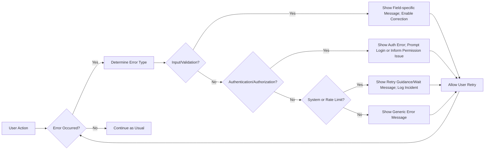

# Error and Exception Handling – Todo List Application

## Introduction
Comprehensive business requirements detailing error and exception handling policies are provided for the Todo List application, focusing exclusively on the user experience and business recovery logic. Requirements are specified in Easy Approach to Requirements Syntax (EARS) format and drive consistent backend implementation. The goal is to guarantee a user-friendly, resilient, and secure Todo system where error conditions are handled gracefully, all business rules are enforced, and users are never left uncertain about outcomes or next steps.

## Common Error Scenarios and Requirements

### 1. Authentication and Authorization Failures
- WHEN a user is unauthenticated and attempts to view, create, update, or delete a Todo item, THE system SHALL prevent the operation and present a message: "Please log in to continue."
- WHEN a session token is expired, invalid, or malformed, THE system SHALL immediately terminate the session and display: "Your session has expired. Please log in again."
- WHEN attempting to access, update, or delete a Todo item not owned by the user, THE system SHALL prevent the action and present: "You do not have permission to access this Todo."

### 2. Validation and Input Errors
- WHEN required fields (e.g., title) are empty or missing in create/update requests, THE system SHALL reject the request and report: "The title field is required."
- WHEN any field (e.g., title) exceeds allowed length or violates formatting/business rules, THE system SHALL return: "The xx field is invalid" with specific feedback for each erroneous field.
- WHEN duplicate Todo creation is attempted (e.g., identical titles in rapid succession), THE system SHALL block the duplicate and report: "The Todo already exists."

### 3. Data Integrity and Business Rule Violations
- IF the Todo targeted for update or delete is already deleted or does not exist, THEN THE system SHALL respond: "The requested Todo could not be found."
- IF a user attempts an invalid transition (e.g., marking a complete Todo as complete or deleting it again), THE system SHALL return: "The requested operation is not allowed."

### 4. System, Connectivity, and Infrastructure Failures
- WHEN internal backend errors or infrastructure issues (e.g., DB down, service crash) occur, THE system SHALL present: "An unexpected error occurred. Please try again." and log details for internal review.
- WHEN a timeout or connectivity issue blocks processing, THE system SHALL present: "The service is temporarily unavailable. Please try again in a moment."

### 5. Rate Limiting and Abuse Prevention
- IF a user exceeds the allowed number of operations in a defined time (e.g., rapid repeated Todo creation/modify/delete), THEN THE system SHALL block further requests for a period and notify: "Too many requests. Please try again later."

## User-Facing Error Messages
- All error/warning messages SHALL be concise, clear, and actionable, in English (US).
- THE system SHALL avoid technical jargon, system codes, and internal trace details in UI-facing messages.
- WHERE possible, THE system SHALL suggest corrective actions (e.g., "Please check and correct the highlighted fields.").
- Error messages for field validation SHALL include the field name(s) and nature of problem.
- When temporary/unexpected issues occur, the user SHALL be informed of the temporary nature and encouraged to retry.

| Scenario                      | User Message                                      |
|-------------------------------|--------------------------------------------------|
| Not logged in                 | Please log in to continue.                       |
| Invalid session/token         | Your session has expired. Please log in again.   |
| Unauthorized Todo access      | You do not have permission to access this Todo.  |
| Todo not found                | The requested Todo could not be found.           |
| Duplicate Todo creation       | The Todo already exists.                         |
| Missing required field        | The title field is required.                     |
| Business rule violation       | The requested operation is not allowed.          |
| Rate limit exceeded           | Too many requests. Please try again later.       |
| System/internal error         | An unexpected error occurred. Please try again.  |
| Connectivity/server timeout   | The service is temporarily unavailable. Please try again in a moment. |

## Business Recovery Flows
- THE system SHALL always enable user recovery by suggesting actionable next steps after errors.
- WHEN input validation fails, THE user SHALL be able to correct input fields and re-submit without losing progress.
- WHEN a session expires, THE system SHALL redirect to login, optionally preserving the email field for convenience.
- WHERE a resource (Todo) is missing after attempted update/delete, THE system SHALL allow navigation back to the Todo list.
- Rate limit lockouts SHALL indicate duration and permit retry after expiry.
- For backend/system errors, THE system SHALL maintain workflow context when possible, and allow easy resubmission after resolution.

## Mermaid: Error Handling and Recovery Flow

## Performance, Logging, and Compliance
- THE system SHALL return error responses within 2s for typical errors and 3s for infrastructure failures (under normal load).
- Error and recovery workflows SHALL preserve any user-entered data so it can be resubmitted where feasible after correction or backend recovery.
- THE system SHALL log all unexpected/internal errors, including non-sensitive context, user/session info, and timestamps for support and auditing. No PII or credentials may ever be logged.
- THE system SHALL comply with incident response and escalation policies for severe or repeated failures.

## Summary
All error situations in the Todo List application are described from a business perspective to ensure actionable, clear, and recoverable user experience. The document provides a foundational reference for backend developers to implement consistent and user-friendly error handling for all minimum-viable Todo features. No technical stack traces or database status logic are revealed at the business requirement level – all error management is for user experience, transparency, and recovery guidance.