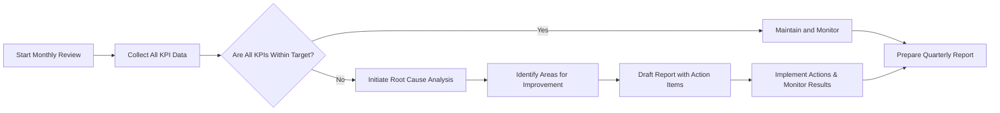

# Requirement Analysis for Todo List Application

## Introduction
The Todo List Application enables end users to reliably manage and track their personal or work-related tasks. This service is designed as a minimal, intuitive solution for the core management of todo items, focused on simplicity and productivity without unnecessary complexity.

## Actors and Primary Users
- **End User**: Any individual who creates, views, updates, completes, or deletes todo items in their own list.
- **Administrator** (Optional/Advanced): Responsible for user management and KPI monitoring, typically not part of minimal feature set but included for metrics oversight in future extensions.

## Use Case Overview
- Create and manage a personal list of todo items
- Update the title and completion status of each todo
- Delete unneeded todos
- View all current and completed todos in a simple interface
- Track basic productivity and completion statistics

## Business Requirements (EARS Format)
- WHEN a registered user accesses the application, THE system SHALL allow them to view their current todo list.
- THE user SHALL be able to create a new todo item by providing a title (and optional description).
- WHEN a user creates a new todo, THE system SHALL add it to the user's list and display the updated list immediately.
- THE user SHALL be able to mark an existing todo item as complete.
- THE user SHALL be able to update the title (and description, if applicable) of any todo they own.
- WHEN a user deletes a todo item, THE system SHALL remove it from their list and display the updated list.
- IF a user attempts to modify or delete a todo not owned by them, THEN THE system SHALL prevent the action and show an explanatory error message.
- WHEN a user completes a todo, THE system SHALL show it as completed and update relevant statistics.
- WHEN a user logs in, THE system SHALL display all unfinished and completed todos separately, with incomplete todos prioritized in the UI.
- THE system SHALL log all actions related to todos for basic usage analysis and improvement.

## User-Centric Success Criteria
- WHEN a new user completes registration, THE system SHALL present a guided onboarding to help them create their first todo.
- THE user SHALL be able to create, view, update, or complete a todo within 2 minutes of first use, ensuring quick onboarding.
- IF a user does not create a todo within 24 hours, THEN THE system SHALL send a friendly notification to encourage engagement.
- THE user SHALL be able to intuitively manage at least 10 todos in a single session without workflow bottlenecks.
- WHEN a user interacts with a todo (create, update, delete, complete), THE system SHALL provide a confirmation/status message within 1 second.
- IF a user attempts an invalid operation (e.g., complete a todo twice), THEN THE system SHALL display a clear, actionable error message.

## Key Performance Indicators (KPIs)
KPIs are tracked to measure service adoption, usability, and reliability:

| KPI Name                        | Description                                                          | Frequency     | Target                  |
|----------------------------------|----------------------------------------------------------------------|---------------|-------------------------|
| Daily Active Users (DAU)         | Unique users per day                                                  | Daily         | >= 30% registered users |
| Todo Completion Rate             | % of todos marked complete by users                                   | Weekly/Monthly| >= 70%                  |
| Average Todos Created per User   | Average # of todos created per user                                   | Weekly        | >= 5/week per user      |
| Average Todo Completion Time     | Mean time from creation to completion                                 | Weekly        | <= 24 hours             |
| Error Rate                       | Share of failed actions (e.g., invalid updates)                       | Monthly       | <= 0.5%                 |
| System Uptime                    | Availability of service                                               | Monthly       | >= 99.5%                |

### KPI Requirements (EARS Format)
- THE system SHALL record daily and weekly active users.
- WHEN a user creates, updates, or completes a todo, THE system SHALL log the event for metrics computation.
- THE system SHALL provide KPIs to administrators for performance evaluation.

## Business Impact and Evaluation
### Strategic Objectives
- Provide a frictionless tool for individuals to track and complete tasks efficiently.
- Increase daily user engagement and task completion rates as core indicators of service value.

### Impact Review Workflow

### Impact Requirements (EARS Format)
- THE business owner SHALL review all KPIs monthly to assess service health.
- IF a KPI falls below 80% of its benchmark for two months, THEN THE business team SHALL initiate a root cause analysis and act within 14 days.
- WHEN new features are released, THE team SHALL evaluate impact on KPIs within one month.

## Acceptance Criteria
- The system SHALL enable a user to create, complete, and delete todos with no errors under normal conditions.
- User actions SHALL be responded to within 1 second in typical usage.
- All user-facing error messages SHALL be clear and guide the user on next steps.
- All business logic SHALL protect users from modifying or viewing others’ todos.
- The application SHALL maintain at least 99.5% uptime.
- The service SHALL meet or exceed the defined KPIs over the first quarter after launch.

## Appendix: Metrics and Feedback Loops
- A dashboard SHALL be available for reviewing KPIs and generating periodic reports for administrators if such roles are enabled later.
- Feedback from users SHALL be collected for ongoing improvement.
- KPIs SHALL be regularly recalibrated based on real usage data and user feedback to ensure continued alignment with actual user needs and business goals.
