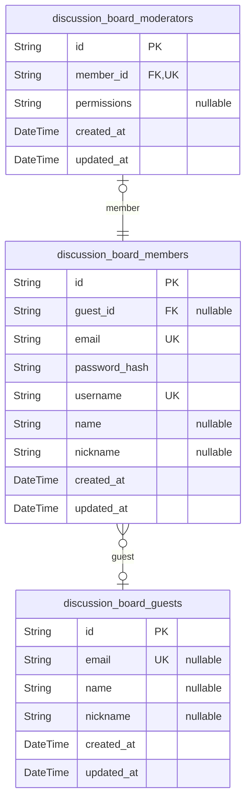
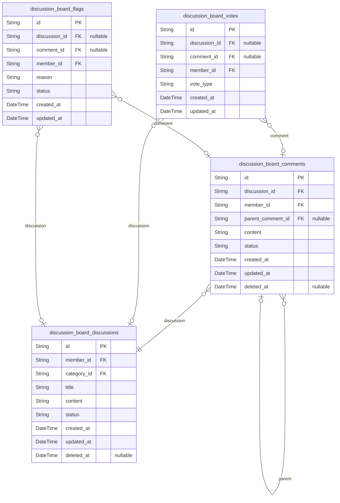
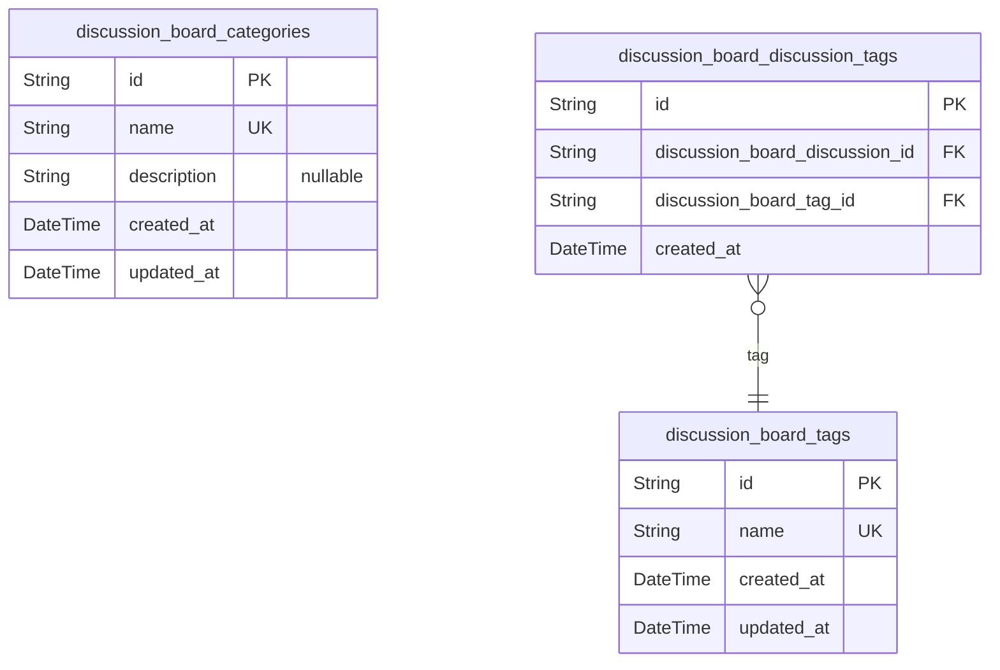
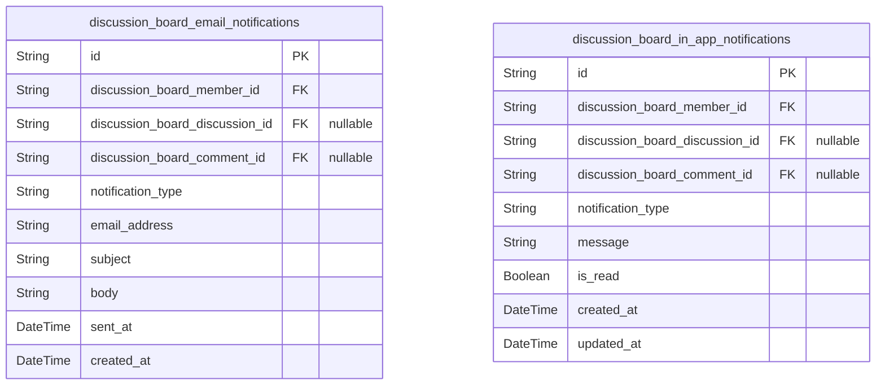
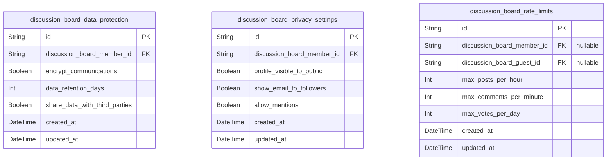

# Prisma Markdown

> Generated by [`prisma-markdown`](https://github.com/samchon/prisma-markdown)

- [Actors](#actors)
- [DiscussionBoard](#discussionboard)
- [ContentOrganization](#contentorganization)
- [Notifications](#notifications)
- [Security](#security)

## Actors

### `discussion_board_guests`

Guest users who have not registered or logged in. They can view public
discussions and have limited functionality. This table stores basic
information about unauthenticated users who may later register to become
members.

Properties as follows:

- `id`: Primary Key.
- `email`
  > Email address for potential registration. Nullable as guests may not
  > provide email.
- `name`: Guest's name if provided.
- `nickname`: Guest's nickname if provided.
- `created_at`: Timestamp when the guest record was created.
- `updated_at`: Timestamp when the guest record was last updated.

### `discussion_board_members`

Registered users who have logged in. Members can create discussions,
comment, vote, and follow other users. This table stores authentication
information and user profiles.

Properties as follows:

- `id`: Primary Key.
- `guest_id`
  > Reference to the guest record if this member was previously a guest.
  > [discussion_board_guests.id](#discussion_board_guests).
- `email`: Member's email address for authentication. Must be unique.
- `password_hash`: Hashed password for authentication. Never stored in plain text.
- `username`: Member's unique username. Must be unique across the system.
- `name`: Member's real name if provided.
- `nickname`: Member's display nickname.
- `created_at`: Timestamp when the member account was created.
- `updated_at`: Timestamp when the member account was last updated.

### `discussion_board_moderators`

Users with elevated permissions to manage content and enforce community
guidelines. Moderators can delete inappropriate content, manage reports,
and ban users. This table stores moderator-specific information and
references the member account.

Properties as follows:

- `id`: Primary Key.
- `member_id`
  > Reference to the member account that has moderator privileges. {@link
  > discussion_board_members.id}.
- `permissions`: JSON string representing moderator permissions and capabilities.
- `created_at`: Timestamp when the moderator privileges were granted.
- `updated_at`: Timestamp when the moderator privileges were last updated.

## DiscussionBoard

### `discussion_board_discussions`

Discussion threads created by users on the discussion board. Contains the
main content and metadata for each discussion topic.

Properties as follows:

- `id`: Primary Key.
- `member_id`: Member who created the discussion. [discussion_board_members.id](#discussion_board_members).
- `category_id`
  > Category this discussion belongs to. {@link
  > discussion_board_categories.id}.
- `title`: Title of the discussion thread.
- `content`: Main content of the discussion.
- `status`: Status of the discussion (active, pending, deleted, etc.).
- `created_at`: When the discussion was created.
- `updated_at`: When the discussion was last updated.
- `deleted_at`: When the discussion was soft deleted, if applicable.

### `discussion_board_comments`

Comments on discussion threads. Supports nested replies through
parent_comment_id.

Properties as follows:

- `id`: Primary Key.
- `discussion_id`
  > Discussion this comment belongs to. {@link
  > discussion_board_discussions.id}.
- `member_id`: Member who created the comment. [discussion_board_members.id](#discussion_board_members).
- `parent_comment_id`
  > Parent comment for nested replies (self-reference). {@link
  > discussion_board_comments.id}.
- `content`: Content of the comment.
- `status`: Status of the comment (active, pending, deleted, etc.).
- `created_at`: When the comment was created.
- `updated_at`: When the comment was last updated.
- `deleted_at`: When the comment was soft deleted, if applicable.

### `discussion_board_votes`

Votes on discussions and comments. Tracks upvotes and downvotes.

Properties as follows:

- `id`: Primary Key.
- `discussion_id`: Discussion being voted on. [discussion_board_discussions.id](#discussion_board_discussions).
- `comment_id`: Comment being voted on. [discussion_board_comments.id](#discussion_board_comments).
- `member_id`: Member who cast the vote. [discussion_board_members.id](#discussion_board_members).
- `vote_type`: Type of vote: 'upvote' or 'downvote'.
- `created_at`: When the vote was cast.
- `updated_at`: When the vote was last updated.

### `discussion_board_flags`

Flags for inappropriate content on discussions and comments.

Properties as follows:

- `id`: Primary Key.
- `discussion_id`: Discussion being flagged. [discussion_board_discussions.id](#discussion_board_discussions).
- `comment_id`: Comment being flagged. [discussion_board_comments.id](#discussion_board_comments).
- `member_id`: Member who flagged the content. [discussion_board_members.id](#discussion_board_members).
- `reason`: Reason for flagging the content.
- `status`: Status of the flag (pending, reviewed, etc.).
- `created_at`: When the content was flagged.
- `updated_at`: When the flag was last updated.

## ContentOrganization

### `discussion_board_categories`

Categories for organizing discussions by topic. Users can categorize
discussions into different topics like economics, politics, etc. This
table represents the main discussion categories that help organize
content.

Properties as follows:

- `id`: Primary Key.
- `name`: Name of the category (e.g., 'Economics', 'Politics', 'General').
- `description`: Description of the category's purpose and scope.
- `created_at`: Timestamp when the category was created.
- `updated_at`: Timestamp when the category was last updated.

### `discussion_board_tags`

Tags for categorizing and searching discussions. Users can apply multiple
tags to discussions for better organization and discovery. This table
represents the tag entities that can be applied to discussions.

Properties as follows:

- `id`: Primary Key.
- `name`: Name of the tag (e.g., 'Tax Policy', 'Election 2024', 'Inflation').
- `created_at`: Timestamp when the tag was created.
- `updated_at`: Timestamp when the tag was last updated.

### `discussion_board_discussion_tags`

Junction table connecting discussions and tags. This table enables the
many-to-many relationship between discussions and tags, allowing multiple
tags to be applied to each discussion and each tag to be used on multiple
discussions.

Properties as follows:

- `id`: Primary Key.
- `discussion_board_discussion_id`
  > The discussion this tag is applied to. {@link
  > discussion_board_discussions.id}.
- `discussion_board_tag_id`: The tag applied to the discussion. [discussion_board_tags.id](#discussion_board_tags).
- `created_at`: Timestamp when the tag was applied to the discussion.

## Notifications

### `discussion_board_email_notifications`

Email notifications for discussion board activities. Tracks notifications
sent via email for user activities like replies, mentions, and moderation
alerts.

Properties as follows:

- `id`: Primary Key.
- `discussion_board_member_id`: Member who receives the notification. [discussion_board_members.id](#discussion_board_members).
- `discussion_board_discussion_id`
  > Discussion related to the notification. {@link
  > discussion_board_discussions.id}.
- `discussion_board_comment_id`: Comment related to the notification. [discussion_board_comments.id](#discussion_board_comments).
- `notification_type`: Type of notification (reply, mention, moderation, etc.).
- `email_address`: Email address where notification was sent.
- `subject`: Email subject line.
- `body`: Email body content.
- `sent_at`: Timestamp when notification was sent.
- `created_at`: Timestamp when notification record was created.

### `discussion_board_in_app_notifications`

In-app notifications for discussion board activities. Tracks
notifications displayed within the application for user activities like
replies, mentions, and moderation alerts.

Properties as follows:

- `id`: Primary Key.
- `discussion_board_member_id`: Member who receives the notification. [discussion_board_members.id](#discussion_board_members).
- `discussion_board_discussion_id`
  > Discussion related to the notification. {@link
  > discussion_board_discussions.id}.
- `discussion_board_comment_id`: Comment related to the notification. [discussion_board_comments.id](#discussion_board_comments).
- `notification_type`: Type of notification (reply, mention, moderation, etc.).
- `message`: Notification message content.
- `is_read`: Whether the notification has been read by the user.
- `created_at`: Timestamp when notification was created.
- `updated_at`: Timestamp when notification was last updated.

## Security

### `discussion_board_data_protection`

Stores data protection settings for users in the discussion board.
Contains security-related preferences and configurations to protect user
data. References [discussion_board_members.id](#discussion_board_members) for user-specific
settings.

Properties as follows:

- `id`: Primary Key.
- `discussion_board_member_id`
  > User who owns these data protection settings. {@link
  > discussion_board_members.id}.
- `encrypt_communications`: Whether to encrypt communications with this user.
- `data_retention_days`: Number of days to retain user data before deletion.
- `share_data_with_third_parties`: Whether user allows data sharing with third parties.
- `created_at`: When this data protection setting was created.
- `updated_at`: When this data protection setting was last updated.

### `discussion_board_privacy_settings`

Stores privacy settings for users in the discussion board. Contains user
preferences for profile visibility and content sharing. References {@link
discussion_board_members.id} for user-specific settings.

Properties as follows:

- `id`: Primary Key.
- `discussion_board_member_id`: User who owns these privacy settings. [discussion_board_members.id](#discussion_board_members).
- `profile_visible_to_public`: Whether user profile is visible to public.
- `show_email_to_followers`: Whether to show email address to followers.
- `allow_mentions`: Whether to allow mentions by other users.
- `created_at`: When this privacy setting was created.
- `updated_at`: When this privacy setting was last updated.

### `discussion_board_rate_limits`

Stores rate limiting configurations for users and guests. Contains
settings to prevent abuse of the discussion board system. References
[discussion_board_members.id](#discussion_board_members) for user-specific limits and {@link
discussion_board_guests.id} for guest-specific limits.

Properties as follows:

- `id`: Primary Key.
- `discussion_board_member_id`: User who this rate limit applies to. [discussion_board_members.id](#discussion_board_members).
- `discussion_board_guest_id`: Guest who this rate limit applies to. [discussion_board_guests.id](#discussion_board_guests).
- `max_posts_per_hour`: Maximum number of posts allowed per hour.
- `max_comments_per_minute`: Maximum number of comments allowed per minute.
- `max_votes_per_day`: Maximum number of votes allowed per day.
- `created_at`: When this rate limit configuration was created.
- `updated_at`: When this rate limit configuration was last updated.
