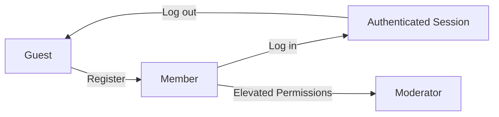
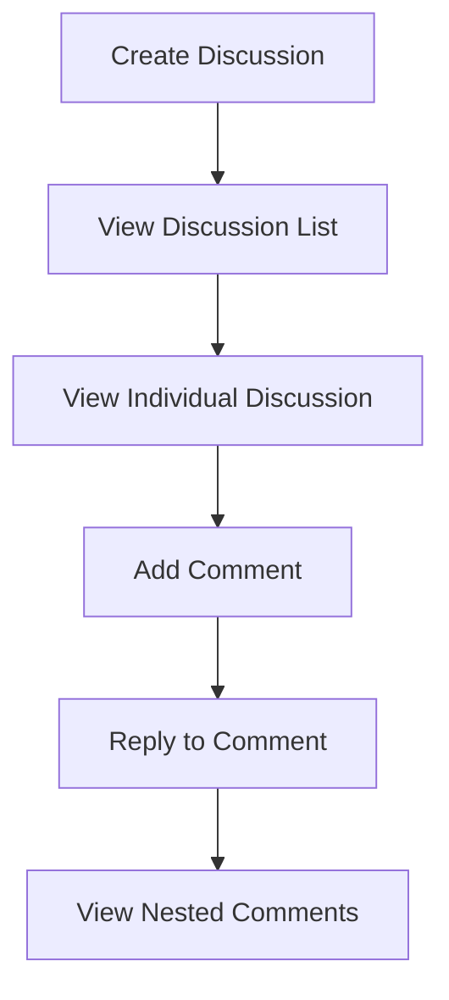
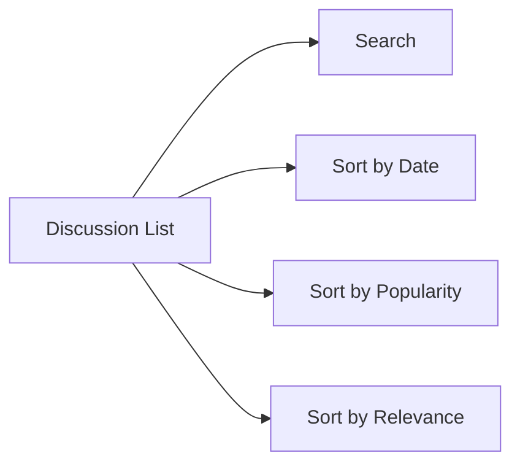
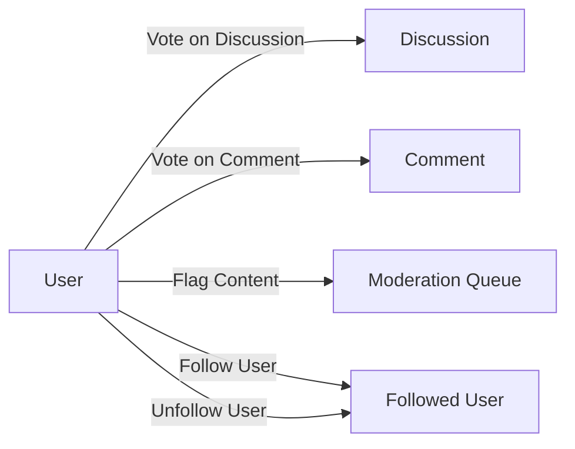
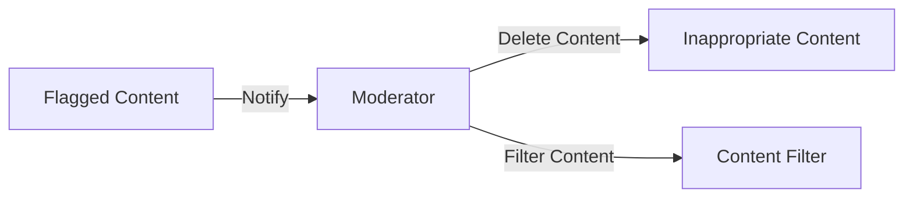
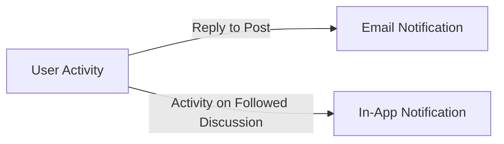
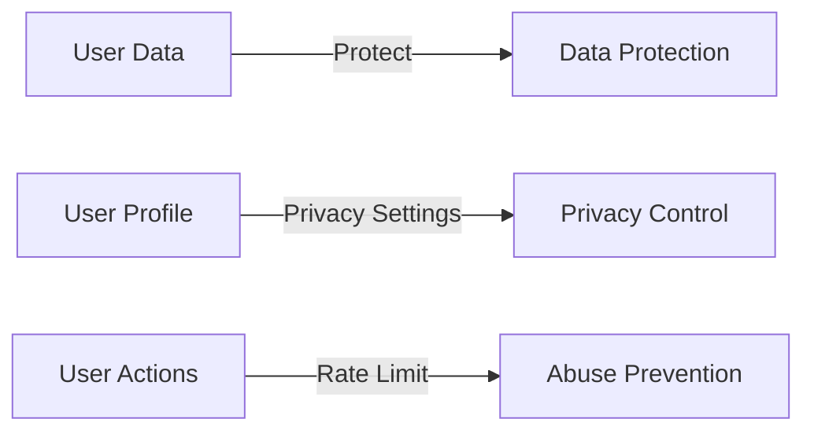

# Discussion Board Functional Requirements

## Introduction

This document defines the functional requirements for a simple economic/political discussion board. The system will facilitate civil discussions on economic and political topics, with features for user authentication, content creation, organization, interaction, moderation, notifications, and security.

## User Registration and Authentication

### User Roles

The system will support the following user roles:

- **Guest**: Unauthenticated users who can view public discussions
- **Member**: Authenticated users who can create discussions, comment, vote, and follow other users
- **Moderator**: Users with elevated permissions who can manage content and enforce community guidelines

### Authentication Requirements

**WHEN** a user wants to register, **THE** system **SHALL** allow registration with email and password.
**WHEN** a user wants to log in, **THE** system **SHALL** authenticate with email and password.
**WHEN** a user wants to log out, **THE** system **SHALL** terminate the session.
**THE** system **SHALL** maintain user profiles with username and email.

## Discussion Board Features

### Discussion Creation

**WHEN** a member wants to create a discussion, **THE** system **SHALL** allow creation with title and content.
**WHEN** a discussion is created, **THE** system **SHALL** display it in the list of discussions.
**WHEN** a user views a discussion, **THE** system **SHALL** display the title, content, and all comments.

### Commenting System

**WHEN** a member wants to comment on a discussion, **THE** system **SHALL** allow adding comments.
**WHEN** a member wants to reply to a comment, **THE** system **SHALL** allow nested replies.
**WHEN** a user views a discussion, **THE** system **SHALL** display comments in a hierarchical structure.

## Content Organization

### Categorization

**THE** system **SHALL** allow categorizing discussions by topics (economics, politics, etc.).
**WHEN** a user searches for discussions, **THE** system **SHALL** provide basic search functionality.
**WHEN** a user views discussions, **THE** system **SHALL** allow sorting by date, popularity, or relevance.

### Search and Sorting

**WHEN** a user searches for discussions, **THE** system **SHALL** return relevant results.
**WHEN** a user sorts discussions, **THE** system **SHALL** display them in the selected order.

## User Interaction

### Voting System

**WHEN** a member wants to vote on a discussion, **THE** system **SHALL** allow upvoting or downvoting.
**WHEN** a member wants to vote on a comment, **THE** system **SHALL** allow upvoting or downvoting.

### Content Flagging

**WHEN** a member encounters inappropriate content, **THE** system **SHALL** allow flagging for moderation.

### User Following

**WHEN** a member wants to follow another user, **THE** system **SHALL** allow following.
**WHEN** a member wants to unfollow a user, **THE** system **SHALL** allow unfollowing.

## Moderation

### Moderator Capabilities

**WHEN** a moderator encounters inappropriate content, **THE** system **SHALL** allow deletion.
**WHEN** a moderator needs to manage content, **THE** system **SHALL** provide tools for content filtering.

### Content Management

**THE** system **SHALL** provide basic content filtering for profanity or spam.
**WHEN** content is flagged, **THE** system **SHALL** notify moderators.

## Notifications

### Email Notifications

**WHEN** a user's post or comment receives a reply, **THE** system **SHALL** send email notifications.

### In-App Notifications

**WHEN** there is activity on followed discussions, **THE** system **SHALL** provide in-app notifications.

## Security and Privacy

### Data Protection

**THE** system **SHALL** implement basic data protection measures.
**THE** system **SHALL** provide privacy settings for user profiles.

### Abuse Prevention

**THE** system **SHALL** implement rate limiting to prevent abuse.
**THE** system **SHALL** enforce content guidelines to maintain civil discussion.

## Business Model

### Purpose and Justification

The discussion board exists to provide a platform for civil economic and political discussions. It fills the market gap for structured, moderated political discourse online. The system differentiates from competitors by focusing on civil discussion and content organization.

### Revenue Strategy

The initial revenue model will focus on user growth and engagement, with potential future monetization through sponsored discussions or premium features.

### Growth Plan

User acquisition will focus on organic growth through SEO and social sharing. Retention will be driven by quality discussions and community engagement.

### Success Metrics

Key performance indicators include:
- Monthly Active Users (MAU)
- Daily Active Users (DAU)
- User retention rate
- Average time spent on platform
- Number of discussions created per day

## Conclusion

This document provides a comprehensive overview of the functional requirements for the economic/political discussion board. The system will support user authentication, discussion creation, content organization, user interaction, moderation, notifications, and security features to create a platform for civil political discourse.

> *Developer Note: This document defines **business requirements only**. All technical implementations (architecture, APIs, database design, etc.) are at the discretion of the development team.*