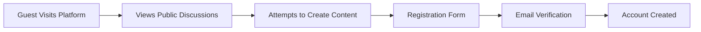
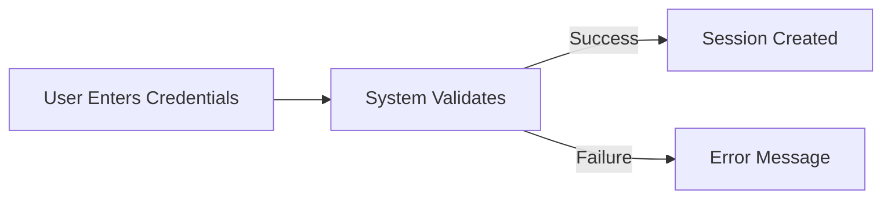
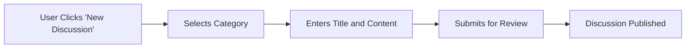
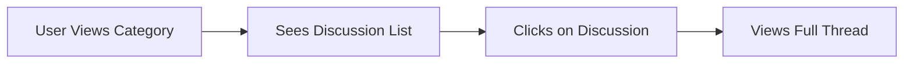
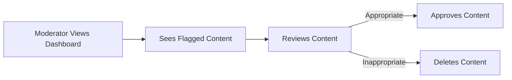

# User Journey and Scenarios for Discussion Board

## Introduction

### Purpose of the Document
This document provides a comprehensive overview of the user journey and scenarios for the Discussion Board platform. It outlines how different types of users interact with the system, from initial registration through participation in discussions and moderation activities.

### Overview of the Discussion Board
The Discussion Board is a platform designed to facilitate civil discussions on economic and political topics. It supports user registration, content creation, commenting, voting, and moderation features to ensure a productive and respectful environment.

### Target Audience
- Product managers
- Backend developers
- Quality assurance teams
- Business analysts

## User Registration Journey

### Guest User Experience
Guests can view public discussions without authentication but have limited functionality.

**WHEN** a guest visits the platform, **THE** system **SHALL** display public discussions.
**WHEN** a guest attempts to create content, **THE** system **SHALL** prompt for registration.

### Registration Process

1. **WHEN** a guest clicks "Register", **THE** system **SHALL** display a registration form.
2. **THE** registration form **SHALL** require: email, username, password.
3. **WHEN** the form is submitted, **THE** system **SHALL** send a verification email.
4. **WHEN** the user verifies their email, **THE** system **SHALL** activate the account.

### Authentication Flow

1. **WHEN** a user submits login credentials, **THE** system **SHALL** validate within 2 seconds.
2. **IF** credentials are valid, **THEN THE** system **SHALL** create a user session.
3. **IF** credentials are invalid, **THEN THE** system **SHALL** return an error.

### Account Verification

**WHEN** a user registers, **THE** system **SHALL** send a verification email.
**WHEN** the user clicks the verification link, **THE** system **SHALL** activate the account.

## Creating a Discussion

### Starting a New Thread

1. **WHEN** a member clicks "New Discussion", **THE** system **SHALL** display the creation form.
2. **THE** form **SHALL** require: title, content, category.
3. **WHEN** submitted, **THE** system **SHALL** publish the discussion.

### Categorizing Discussions

**THE** system **SHALL** support categories: Economics, Politics, General.
**WHEN** creating a discussion, **THE** user **SHALL** select one category.

### Initial Post Creation

**WHEN** a discussion is created, **THE** system **SHALL** display it in the selected category.
**THE** system **SHALL** allow 500-5000 characters for discussion content.

## Participating in Discussions

### Viewing Discussion Threads

1. **WHEN** a user selects a category, **THE** system **SHALL** display all discussions.
2. **WHEN** a discussion is selected, **THE** system **SHALL** show all comments.

### Commenting on Discussions

**WHEN** a user clicks "Comment", **THE** system **SHALL** display a comment form.
**THE** comment form **SHALL** require 10-1000 characters.
**WHEN** submitted, **THE** system **SHALL** add the comment to the discussion.

### Replying to Comments

**WHEN** a user clicks "Reply" on a comment, **THE** system **SHALL** display a reply form.
**THE** reply form **SHALL** require 10-500 characters.
**WHEN** submitted, **THE** system **SHALL** add the reply as a nested comment.

### Voting on Content

**WHEN** a user clicks upvote, **THE** system **SHALL** increment the vote count.
**WHEN** a user clicks downvote, **THE** system **SHALL** decrement the vote count.
**THE** system **SHALL** prevent multiple votes from the same user.

### Flagging Inappropriate Content

**WHEN** a user clicks "Flag", **THE** system **SHALL** mark content for moderator review.
**THE** system **SHALL** notify moderators of flagged content.

## Moderation Workflow

### Moderator Authentication

**WHEN** a moderator logs in, **THE** system **SHALL** grant elevated permissions.
**THE** system **SHALL** display moderation tools.

### Content Review Process

1. **WHEN** a moderator views the dashboard, **THE** system **SHALL** show flagged content.
2. **WHEN** content is reviewed, **THE** moderator **SHALL** approve or delete it.

### Deletion of Inappropriate Content

**WHEN** a moderator deletes content, **THE** system **SHALL** remove it permanently.
**THE** system **SHALL** notify the content creator.

### User Management

**THE** moderator **SHALL** be able to ban users for repeated violations.
**THE** system **SHALL** prevent banned users from creating new content.

## Notification Scenarios

### Email Notifications

**WHEN** a user receives a reply, **THE** system **SHALL** send an email notification.
**WHEN** content is flagged, **THE** system **SHALL** notify moderators via email.

### In-app Notifications

**WHEN** a followed discussion has new activity, **THE** system **SHALL** show an in-app notification.
**WHEN** a user is mentioned, **THE** system **SHALL** notify them in the app.

### Notification Triggers

| Event | Notification Type | Recipient |
|-------|-------------------|-----------|
| New reply to user's post | Email, In-app | Post author |
| Content flagged | Email | Moderators |
| Followed discussion updated | In-app | Following users |
| User mentioned | In-app | Mentioned user |

## Conclusion

This document outlines the complete user journey for the Discussion Board platform, covering all user roles and their interactions with the system. From registration through content creation, participation, and moderation, each scenario is designed to ensure a productive and respectful discussion environment.

For detailed functional requirements, refer to the [Functional Requirements Document](./01-functional-requirements.md).
For user roles and authentication details, see the [User Roles Documentation](./02-user-roles.md).

> *Developer Note: This document defines **business requirements only**. All technical implementations (architecture, APIs, database design, etc.) are at the discretion of the development team.*