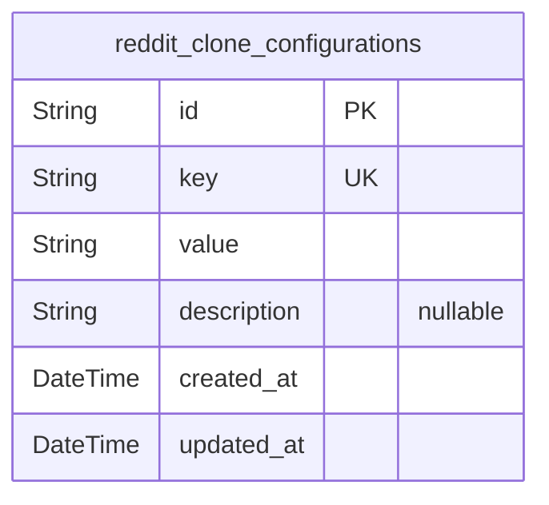
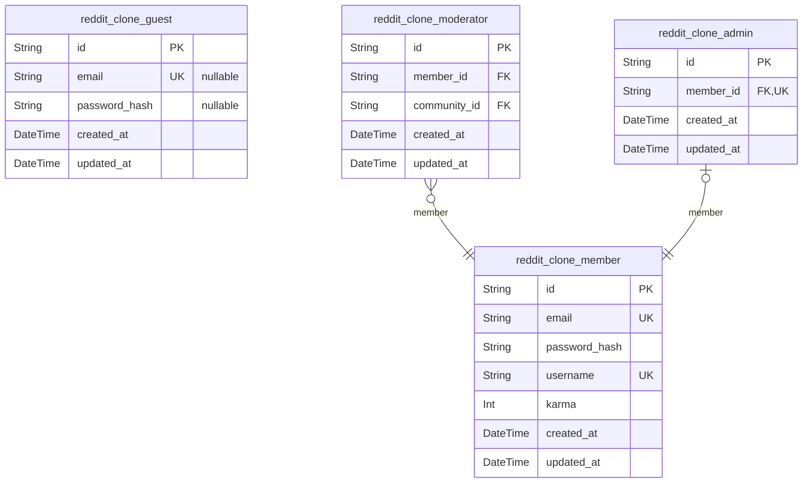
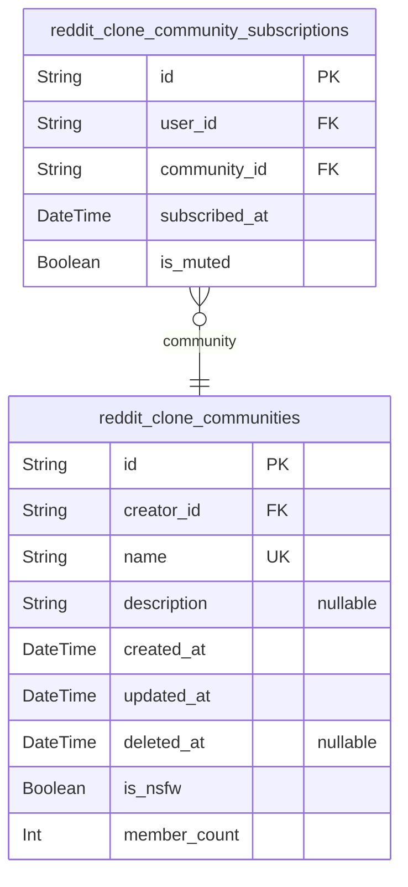
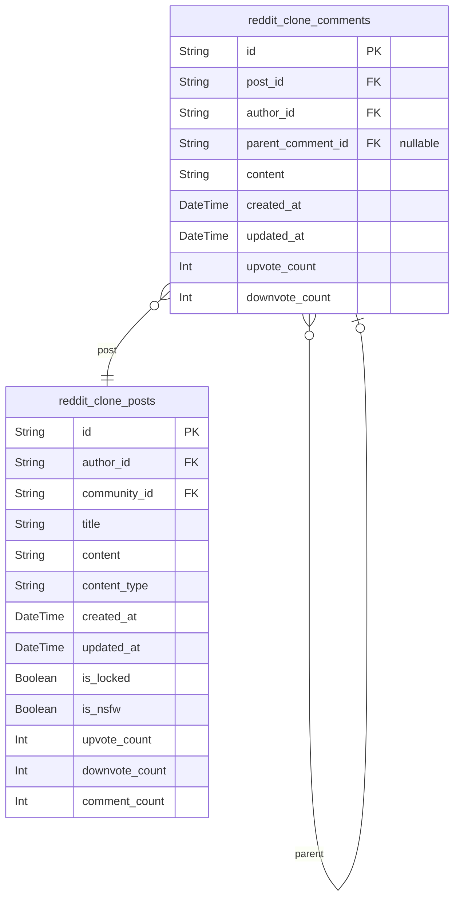
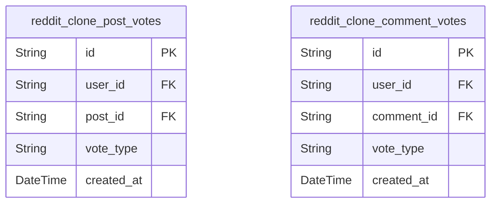

# Prisma Markdown

> Generated by [`prisma-markdown`](https://github.com/samchon/prisma-markdown)

- [Systematic](#systematic)
- [Actors](#actors)
- [Communities](#communities)
- [Content](#content)
- [Voting](#voting)

## Systematic

### `reddit_clone_configurations`

System configuration settings for the Reddit-like community platform.
Stores platform-wide settings, feature flags, and system parameters that
control platform behavior.

Properties as follows:

- `id`: Primary Key.
- `key`: Configuration key identifier.
- `value`: Configuration value.
- `description`: Description of the configuration setting.
- `created_at`: Timestamp when the configuration was created.
- `updated_at`: Timestamp when the configuration was last updated.

## Actors

### `reddit_clone_guest`

Guest users who can view public content and register/login. This table
stores temporary session information for unauthenticated users.

Properties as follows:

- `id`: Primary Key.
- `email`: Email address for registration (optional for guests).
- `password_hash`: Password hash for login (optional for guests).
- `created_at`: Timestamp when the guest session was created.
- `updated_at`: Timestamp when the guest session was last updated.

### `reddit_clone_member`

Authenticated members who can create content, vote, and manage their
profile. This table stores all regular user accounts.

Properties as follows:

- `id`: Primary Key.
- `email`: Unique email address for authentication.
- `password_hash`: Secure password hash for login.
- `username`: Unique username for display.
- `karma`: User's karma score based on votes.
- `created_at`: Timestamp when the account was created.
- `updated_at`: Timestamp when the account was last updated.

### `reddit_clone_moderator`

Users with moderation privileges in specific communities. This table
stores moderator-specific information.

Properties as follows:

- `id`: Primary Key.
- `member_id`: Reference to the member account. [reddit_clone_member.id](#reddit_clone_member).
- `community_id`
  > Community where the user is a moderator. {@link
  > reddit_clone_communities.id}.
- `created_at`: Timestamp when moderator privileges were granted.
- `updated_at`: Timestamp when moderator privileges were last updated.

### `reddit_clone_admin`

System administrators with full access to manage all users and
communities. This table stores admin-specific information.

Properties as follows:

- `id`: Primary Key.
- `member_id`: Reference to the member account. [reddit_clone_member.id](#reddit_clone_member).
- `created_at`: Timestamp when admin privileges were granted.
- `updated_at`: Timestamp when admin privileges were last updated.

## Communities

### `reddit_clone_communities`

Core community entity representing subreddit-like communities where users
can post content, subscribe, and interact. This table stores all
community metadata and serves as the central hub for community
operations.

Properties as follows:

- `id`: Primary Key.
- `creator_id`: The member who created this community. [reddit_clone_member.id](#reddit_clone_member).
- `name`: Unique name of the community (e.g., 'programming', 'gaming').
- `description`: Detailed description of the community's purpose and topics.
- `created_at`: Timestamp when the community was created.
- `updated_at`: Timestamp when the community was last updated.
- `deleted_at`: Timestamp when the community was soft deleted, if applicable.
- `is_nsfw`: Flag indicating if the community contains adult content.
- `member_count`: Current number of subscribers to this community.

### `reddit_clone_community_subscriptions`

Junction table representing the many-to-many relationship between users
and communities. Tracks which users are subscribed to which communities
and manages subscription metadata.

Properties as follows:

- `id`: Primary Key.
- `user_id`
  > The user who is subscribed to the community. {@link
  > reddit_clone_member.id}.
- `community_id`: The community being subscribed to. [reddit_clone_communities.id](#reddit_clone_communities).
- `subscribed_at`: Timestamp when the user subscribed to the community.
- `is_muted`: Flag indicating if the user has muted notifications from this community.

## Content

### `reddit_clone_posts`

Represents user-created posts in the Reddit-like community platform.
Posts are the primary content entities that users create, edit, and
manage. Each post belongs to a community and has an author. Posts can be
text, links, or images and support voting functionality.

Properties as follows:

- `id`: Primary Key.
- `author_id`: The author who created the post. [reddit_clone_member.id](#reddit_clone_member).
- `community_id`
  > The community where the post was created. {@link
  > reddit_clone_communities.id}.
- `title`: The title of the post.
- `content`: The content of the post.
- `content_type`: The type of content (text, link, image).
- `created_at`: When the post was created.
- `updated_at`: When the post was last updated.
- `is_locked`: Whether the post is locked (no new comments allowed).
- `is_nsfw`: Whether the post contains NSFW (Not Safe For Work) content.
- `upvote_count`: The number of upvotes the post has received.
- `downvote_count`: The number of downvotes the post has received.
- `comment_count`: The number of comments on the post.

### `reddit_clone_comments`

Represents user comments on posts in the Reddit-like community platform.
Comments are primary content entities that users create, edit, and
manage. Each comment belongs to a post and has an author. Comments
support nested replies and voting functionality.

Properties as follows:

- `id`: Primary Key.
- `post_id`: The post this comment belongs to. [reddit_clone_posts.id](#reddit_clone_posts).
- `author_id`: The author who created the comment. [reddit_clone_member.id](#reddit_clone_member).
- `parent_comment_id`
  > The parent comment ID for nested replies (null for top-level comments).
  > [reddit_clone_comments.id](#reddit_clone_comments).
- `content`: The content of the comment.
- `created_at`: When the comment was created.
- `updated_at`: When the comment was last updated.
- `upvote_count`: The number of upvotes the comment has received.
- `downvote_count`: The number of downvotes the comment has received.

## Voting

### `reddit_clone_post_votes`

Tracks user votes on posts in the Reddit-like community platform. This
table records each user's vote (upvote or downvote) on specific posts,
ensuring data integrity through composite primary keys and enforcing that
users can only vote once per post. The table supports the core voting
functionality and enables features like vote counting, user vote history,
and content ranking.

Properties as follows:

- `id`: Primary Key.
- `user_id`: User who cast the vote. [reddit_clone_member.id](#reddit_clone_member).
- `post_id`: Post that received the vote. [reddit_clone_posts.id](#reddit_clone_posts).
- `vote_type`: Type of vote (upvote or downvote).
- `created_at`: Timestamp when the vote was cast.

### `reddit_clone_comment_votes`

Tracks user votes on comments in the Reddit-like community platform. This
table records each user's vote (upvote or downvote) on specific comments,
ensuring data integrity through composite primary keys and enforcing that
users can only vote once per comment. The table supports nested comment
voting and enables features like comment ranking, user vote history, and
reputation systems.

Properties as follows:

- `id`: Primary Key.
- `user_id`: User who cast the vote. [reddit_clone_member.id](#reddit_clone_member).
- `comment_id`: Comment that received the vote. [reddit_clone_comments.id](#reddit_clone_comments).
- `vote_type`: Type of vote (upvote or downvote).
- `created_at`: Timestamp when the vote was cast.
