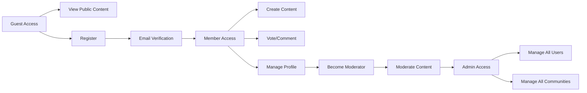
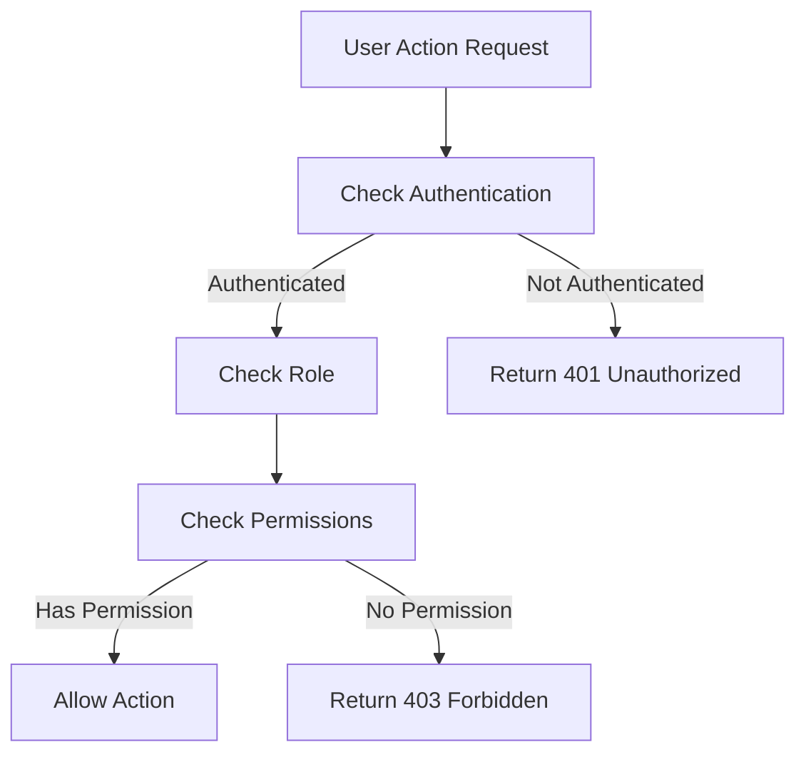

# Reddit-like Community Platform: User Roles and Authentication System

## User Roles Overview

The Reddit-like community platform requires a robust user role system to manage access control and permissions. The platform will support the following user roles:

### Guest
- **Description**: Unauthenticated users who can view public content and register/login
- **Permissions**: View public posts, view public communities, register for an account, login
- **Restrictions**: Cannot create content, cannot vote, cannot comment

### Member
- **Description**: Authenticated users who can create posts, comment, vote, and manage their profile
- **Permissions**: Create posts, comment on posts, upvote/downvote content, create and join communities, subscribe to communities, manage profile
- **Restrictions**: Cannot moderate content, cannot manage other users

### Moderator
- **Description**: Users who can manage content in specific communities, including removing posts and comments
- **Permissions**: All member permissions plus: remove posts, remove comments, manage community settings, approve/remove content
- **Restrictions**: Limited to specific communities they moderate

### Admin
- **Description**: System administrators with full access to manage all users, communities, and system settings
- **Permissions**: All permissions plus: manage all users, manage all communities, configure system settings, view all content
- **Restrictions**: None

## Authentication System

The authentication system will follow industry best practices with the following components:

### Registration
- **EARS**: WHEN a user submits registration information, THE system SHALL validate the email format
- **EARS**: WHEN a user submits registration information, THE system SHALL check for password strength
- **EARS**: WHEN registration is successful, THE system SHALL send verification email

### Login
- **EARS**: WHEN a user submits login credentials, THE system SHALL validate email and password
- **EARS**: WHEN login is successful, THE system SHALL generate JWT with 15-minute expiration
- **EARS**: WHEN login fails, THE system SHALL return an appropriate error message

### Password Management
- **EARS**: WHEN a user requests password reset, THE system SHALL send a reset email
- **EARS**: WHEN a user submits password change, THE system SHALL validate the new password strength

### Email Verification
- **EARS**: WHEN a user clicks verification link, THE system SHALL activate the account
- **EARS**: WHEN email verification fails, THE system SHALL show an error message

## Role Permissions

### Permission Matrix

| Action | Guest | Member | Moderator | Admin |
|--------|-------|--------|-----------|-------|
| View public posts | ✅ | ✅ | ✅ | ✅ |
| Create post | ❌ | ✅ | ✅ | ✅ |
| Comment on post | ❌ | ✅ | ✅ | ✅ |
| Vote | ❌ | ✅ | ✅ | ✅ |
| Create community | ❌ | ✅ | ✅ | ✅ |
| Moderate content | ❌ | ❌ | ✅ | ✅ |
| Manage users | ❌ | ❌ | ❌ | ✅ |
| Manage all communities | ❌ | ❌ | ❌ | ✅ |

### Role-Based Access Control
- **EARS**: THE system SHALL enforce role-based access control for all operations
- **EARS**: WHEN a user attempts an action, THE system SHALL check role permissions
- **EARS**: WHEN a user lacks permission, THE system SHALL return a 403 Forbidden error

## JWT Implementation

### Token Structure
- **EARS**: THE JWT token SHALL contain userId, role, and expiration
- **EARS**: THE JWT token SHALL be signed with a secure secret
- **EARS**: THE JWT token SHALL have an expiration time of 1 hour

### Token Lifecycle
- **EARS**: WHEN a user logs in, THE system SHALL generate a new JWT token
- **EARS**: WHEN a token expires, THE system SHALL require re-authentication
- **EARS**: WHEN a user logs out, THE system SHALL invalidate the token

### Security Considerations
- **EARS**: THE system SHALL use HTTPS for all authentication requests
- **EARS**: THE system SHALL store tokens securely (httpOnly cookies)
- **EARS**: THE system SHALL implement token refresh mechanism

## User Session Management

### Session Persistence
- **EARS**: THE system SHALL maintain user sessions across page reloads
- **EARS**: THE system SHALL allow session persistence for 30 days

### Session Expiration
- **EARS**: THE system SHALL expire sessions after 30 days of inactivity
- **EARS**: THE system SHALL allow users to manually end sessions

### Multi-Device Support
- **EARS**: THE system SHALL support concurrent sessions on multiple devices
- **EARS**: THE system SHALL allow users to view and manage active sessions

## Authentication Flow Diagram



## Permission Flow Diagram



## Business Rules

### Content Moderation

```ears
WHEN content is reported, THE system SHALL notify moderators
WHEN content is removed, THE system SHALL hide from public view
WHEN user is banned, THE system SHALL restrict community access
```

### Karma System

```ears
WHEN post is upvoted, THE system SHALL increment author karma
WHEN post is downvoted, THE system SHALL decrement author karma
WHEN comment is upvoted, THE system SHALL increment author karma
```

### Community Management

```ears
WHEN community is created, THE system SHALL assign creator as moderator
WHEN user subscribes, THE system SHALL add to feed
WHEN user unsubscribes, THE system SHALL remove from feed
```

## Error Handling

### Common Error Scenarios
- Invalid authentication credentials
- Duplicate content submission
- Rate limit exceeded
- Insufficient permissions
- Content not found

### Error Recovery

```ears
WHEN authentication fails, THE system SHALL provide password reset option
WHEN duplicate content is detected, THE system SHALL suggest editing
WHEN rate limit is exceeded, THE system SHALL show cooldown timer
```

## Performance Requirements

### Response Times

```ears
THE system SHALL load content feeds within 2 seconds
THE system SHALL handle 10,000 concurrent users
THE system SHALL process votes instantly
```

### User Experience

```ears
THE system SHALL provide real-time vote updates
THE system SHALL show instant comment posting
THE system SHALL update karma immediately
```

## Security Requirements

```ears
THE system SHALL encrypt all user passwords
THE system SHALL implement CSRF protection
THE system SHALL use secure cookies for token storage
THE system SHALL implement account lockout after 5 failed attempts
```

## Related Documents

- [Project Overview](./00-toc.md)
- [Functional Requirements](./01-functional-requirements.md)
- [API Structure](./06-api-structure.md)
- [Database Schema](./07-database-schema.md)

## Developer Note

> *Developer Note: This document defines **business requirements only**. All technical implementations (architecture, APIs, database design, etc.) are at the discretion of the development team.*