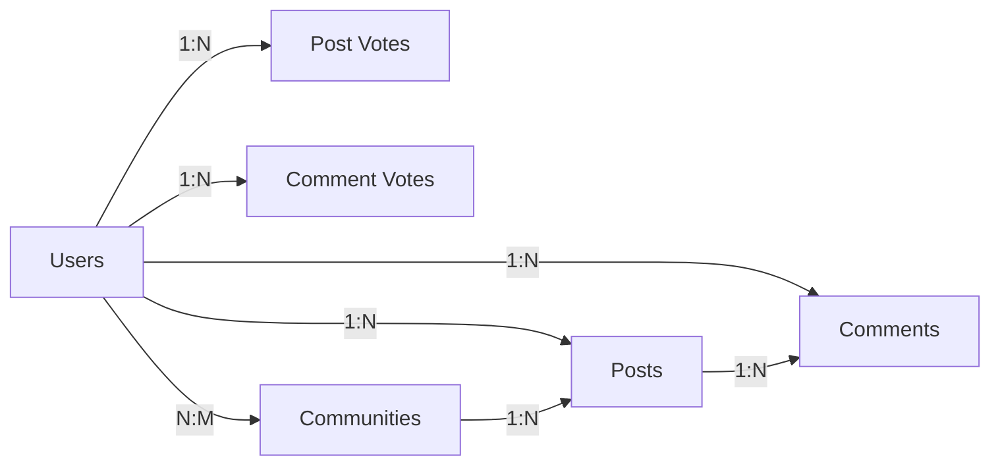

# Database Schema Requirements for Reddit-like Community Platform

## 1. User Tables

### 1.1 Users Table
- **user_id**: UUID (Primary Key)
- **username**: VARCHAR(50) UNIQUE NOT NULL
- **email**: VARCHAR(255) UNIQUE NOT NULL
- **password_hash**: VARCHAR(255) NOT NULL
- **karma**: INTEGER DEFAULT 0
- **created_at**: TIMESTAMP DEFAULT CURRENT_TIMESTAMP
- **updated_at**: TIMESTAMP DEFAULT CURRENT_TIMESTAMP ON UPDATE CURRENT_TIMESTAMP
- **is_active**: BOOLEAN DEFAULT TRUE
- **role**: ENUM('guest', 'member', 'moderator', 'admin') DEFAULT 'member'

### 1.2 User Profiles Table
- **user_id**: UUID (Foreign Key to Users)
- **bio**: TEXT
- **avatar_url**: VARCHAR(255)
- **website**: VARCHAR(255)
- **location**: VARCHAR(100)

## 2. Community Tables

### 2.1 Communities Table
- **community_id**: UUID (Primary Key)
- **name**: VARCHAR(100) UNIQUE NOT NULL
- **description**: TEXT
- **created_at**: TIMESTAMP DEFAULT CURRENT_TIMESTAMP
- **updated_at**: TIMESTAMP DEFAULT CURRENT_TIMESTAMP ON UPDATE CURRENT_TIMESTAMP
- **creator_id**: UUID (Foreign Key to Users)
- **is_nsfw**: BOOLEAN DEFAULT FALSE
- **member_count**: INTEGER DEFAULT 0

### 2.2 Community Subscriptions Table
- **user_id**: UUID (Foreign Key to Users)
- **community_id**: UUID (Foreign Key to Communities)
- **subscribed_at**: TIMESTAMP DEFAULT CURRENT_TIMESTAMP
- **is_muted**: BOOLEAN DEFAULT FALSE
- **PRIMARY KEY (user_id, community_id)**

## 3. Content Tables

### 3.1 Posts Table
- **post_id**: UUID (Primary Key)
- **author_id**: UUID (Foreign Key to Users)
- **community_id**: UUID (Foreign Key to Communities)
- **title**: VARCHAR(300) NOT NULL
- **content**: TEXT
- **content_type**: ENUM('text', 'link', 'image') DEFAULT 'text'
- **created_at**: TIMESTAMP DEFAULT CURRENT_TIMESTAMP
- **updated_at**: TIMESTAMP DEFAULT CURRENT_TIMESTAMP ON UPDATE CURRENT_TIMESTAMP
- **is_locked**: BOOLEAN DEFAULT FALSE
- **is_nsfw**: BOOLEAN DEFAULT FALSE
- **upvote_count**: INTEGER DEFAULT 0
- **downvote_count**: INTEGER DEFAULT 0
- **comment_count**: INTEGER DEFAULT 0

### 3.2 Comments Table
- **comment_id**: UUID (Primary Key)
- **post_id**: UUID (Foreign Key to Posts)
- **author_id**: UUID (Foreign Key to Users)
- **parent_comment_id**: UUID (NULL for top-level comments, self-referencing)
- **content**: TEXT NOT NULL
- **created_at**: TIMESTAMP DEFAULT CURRENT_TIMESTAMP
- **updated_at**: TIMESTAMP DEFAULT CURRENT_TIMESTAMP ON UPDATE CURRENT_TIMESTAMP
- **upvote_count**: INTEGER DEFAULT 0
- **downvote_count**: INTEGER DEFAULT 0

## 4. Voting Tables

### 4.1 Post Votes Table
- **user_id**: UUID (Foreign Key to Users)
- **post_id**: UUID (Foreign Key to Posts)
- **vote_type**: ENUM('upvote', 'downvote') NOT NULL
- **voted_at**: TIMESTAMP DEFAULT CURRENT_TIMESTAMP
- **PRIMARY KEY (user_id, post_id)**

### 4.2 Comment Votes Table
- **user_id**: UUID (Foreign Key to Users)
- **comment_id**: UUID (Foreign Key to Comments)
- **vote_type**: ENUM('upvote', 'downvote') NOT NULL
- **voted_at**: TIMESTAMP DEFAULT CURRENT_TIMESTAMP
- **PRIMARY KEY (user_id, comment_id)**

## 5. Relationships

## 6. Indexing Strategy

### 6.1 Performance Indexes
- **Users**: INDEX on (username), INDEX on (email)
- **Communities**: INDEX on (name)
- **Posts**: INDEX on (community_id, created_at), INDEX on (author_id, created_at)
- **Comments**: INDEX on (post_id, created_at), INDEX on (parent_comment_id)
- **Votes**: INDEX on (user_id, post_id), INDEX on (user_id, comment_id)

### 6.2 Full-Text Search Indexes
- **Posts**: FULLTEXT INDEX on (title, content)
- **Comments**: FULLTEXT INDEX on (content)

## 7. Business Rules

### 7.1 Data Integrity
- **THE system SHALL prevent duplicate usernames and emails**
- **THE system SHALL ensure community names are unique**
- **THE system SHALL maintain referential integrity between all tables**

### 7.2 Voting Constraints
- **WHEN a user votes on a post, THE system SHALL prevent duplicate votes**
- **WHEN a user votes on a comment, THE system SHALL prevent duplicate votes**
- **WHEN a user changes their vote, THE system SHALL update the existing vote record**

### 7.3 Content Moderation
- **WHEN content is reported, THE system SHALL track the report status**
- **WHEN content is removed, THE system SHALL maintain a record of the action**

## 8. Future Considerations

### 8.1 Scalability
- **THE system SHALL support horizontal scaling through sharding**
- **THE system SHALL implement read replicas for high traffic scenarios**

### 8.2 Analytics
- **THE system SHALL track user engagement metrics**
- **THE system SHALL maintain historical data for trend analysis**

## 9. Developer Note

> *Developer Note: This document defines business requirements only. All technical implementations (architecture, APIs, database design, etc.) are at the discretion of the development team.*