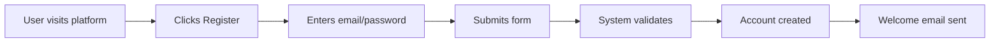
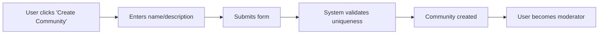
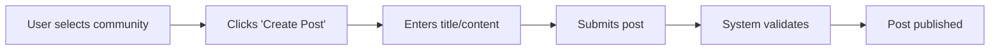

# Reddit-like Community Platform Requirements Analysis

## Project Overview

This document provides a comprehensive requirements analysis for building a Reddit-like community platform. The platform will allow users to create communities, post content, vote on posts, comment with nested replies, and manage user profiles with a karma system.

## Key Features

The platform will include the following core features:

1. **User Registration and Login** - Secure authentication system
2. **Community Management** - Create and manage subreddit-like communities
3. **Content Creation** - Post text, links, and images
4. **Voting System** - Upvote/downvote posts and comments
5. **Commenting System** - Nested comment replies
6. **User Karma System** - Reputation tracking
7. **Content Sorting** - Hot, new, top, controversial filters
8. **User Profiles** - Show user activity and contributions
9. **Content Moderation** - Reporting and management tools

## User Roles and Authentication

The platform will support the following user roles:

### Guest (Unauthenticated)
- View public content
- Register for an account
- Login to existing account

### Member (Authenticated)
- Create and manage posts
- Comment on posts
- Vote on content
- Manage profile
- Create and subscribe to communities

### Moderator
- Manage content in specific communities
- Remove inappropriate posts/comments
- Manage community settings

### Admin
- Full system access
- Manage all users and communities
- System configuration

## Functional Requirements

### User Registration and Login

**EARS Format Requirements:**
- WHEN a user submits registration, THE system SHALL validate email uniqueness
- WHEN a user logs in, THE system SHALL verify credentials and create session
- THE system SHALL support password reset functionality

**Business Rules:**
- Email must be unique across the platform
- Passwords must meet complexity requirements
- Sessions expire after 30 days of inactivity

### Community Management

**EARS Format Requirements:**
- WHEN a member creates a community, THE system SHALL validate unique name
- WHEN a user subscribes to a community, THE system SHALL add to subscription list
- THE system SHALL display community-specific content to subscribers

**Business Rules:**
- Community names must be unique
- Users can subscribe to unlimited communities
- Community creators become default moderators

### Content Creation and Management

**EARS Format Requirements:**
- WHEN a member creates a post, THE system SHALL validate content type
- WHEN a post is created, THE system SHALL assign unique identifier
- THE system SHALL support text, link, and image post types

**Business Rules:**
- Posts can contain text (max 40,000 characters)
- Links must be validated URLs
- Images must meet size and format requirements

### Voting System

**EARS Format Requirements:**
- WHEN a member upvotes content, THE system SHALL increment vote count
- WHEN a member downvotes content, THE system SHALL decrement vote count
- THE system SHALL prevent duplicate votes from same user

**Business Rules:**
- Users can change their vote (upvote → downvote or vice versa)
- Vote counts update in real-time
- Vote history is tracked for each user

### Commenting System

**EARS Format Requirements:**
- WHEN a member comments on a post, THE system SHALL create nested reply
- WHEN a comment is replied to, THE system SHALL create thread structure
- THE system SHALL support unlimited nesting depth

**Business Rules:**
- Comments can be edited within 5 minutes
- Deleted comments show as [deleted]
- Comment length maximum: 10,000 characters

### User Karma System

**EARS Format Requirements:**
- WHEN content receives upvotes, THE system SHALL increment author karma
- WHEN content receives downvotes, THE system SHALL decrement author karma
- THE system SHALL display karma on user profiles

**Business Rules:**
- Karma is calculated as net upvotes minus downvotes
- Karma affects posting limits and privileges
- Negative karma may trigger moderation

### Content Sorting and Filtering

**EARS Format Requirements:**
- THE system SHALL support sorting by hot, new, top, controversial
- WHEN a user selects a sort option, THE system SHALL reorder content
- THE system SHALL provide time-based filters (hour, day, week, month, year, all-time)

**Business Rules:**
- "Hot" algorithm: (upvotes - downvotes) / (time since post)^gravity
- "Top" shows highest vote content for selected time period
- "Controversial" shows content with balanced up/down votes

### User Profiles

**EARS Format Requirements:**
- THE system SHALL display user posts and comments on profile
- THE system SHALL show user karma and activity statistics
- WHEN a user edits profile, THE system SHALL validate changes

**Business Rules:**
- Profiles show last 100 posts and comments
- Users can set profile visibility preferences
- Profile edits require re-authentication

### Content Moderation

**EARS Format Requirements:**
- WHEN content is reported, THE system SHALL flag for moderator review
- WHEN a moderator removes content, THE system SHALL hide from public view
- THE system SHALL track moderation actions for audit

**Business Rules:**
- Reported content requires 3 reports before auto-hiding
- Moderators can reinstate removed content
- Users can appeal moderation decisions

## Non-Functional Requirements

### Performance
- Page loads under 2 seconds
- API responses under 500ms
- Support 10,000 concurrent users

### Security
- HTTPS encryption for all traffic
- Password hashing with bcrypt
- Rate limiting on API endpoints

### Scalability
- Horizontal scaling capability
- Database sharding for large datasets
- CDN for static content delivery

## User Scenarios and Use Cases

### New User Registration

### Creating a Community

### Posting Content

## Business Model and Value Proposition

### Why This Platform Exists
- Fill the gap for niche community discussions
- Provide better moderation tools than existing platforms
- Offer enhanced user engagement features

### Revenue Strategy
- Targeted advertising based on community topics
- Premium memberships for advanced features
- Sponsored communities and posts

### Growth Plan
- SEO optimization for community content
- Integration with social media platforms
- Influencer partnerships for community growth

### Success Metrics
- Monthly Active Users (MAU)
- Daily Active Users (DAU)
- Average Time Spent per User
- Community Growth Rate
- Advertising Click-Through Rate (CTR)

## Technical Considerations

### Architecture
- Microservices for core functionality
- API-first design for frontend flexibility
- Event-driven architecture for real-time features

### Database Design
- Relational database for structured data
- NoSQL for content and activity streams
- Caching layer for high-performance access

### Infrastructure
- Cloud-based hosting (AWS/Azure/GCP)
- Containerization with Docker
- Orchestration with Kubernetes

## Conclusion and Next Steps

This requirements analysis provides a comprehensive foundation for building the Reddit-like community platform. The next steps include:

1. Detailed technical specification
2. Database schema design
3. API endpoint definition
4. UI/UX design planning
5. Development roadmap creation

## Developer Note

This document defines business requirements only. All technical implementations (architecture, APIs, database design, etc.) are at the discretion of the development team.