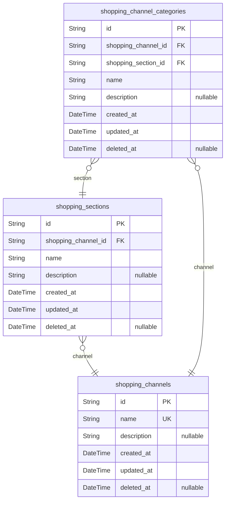
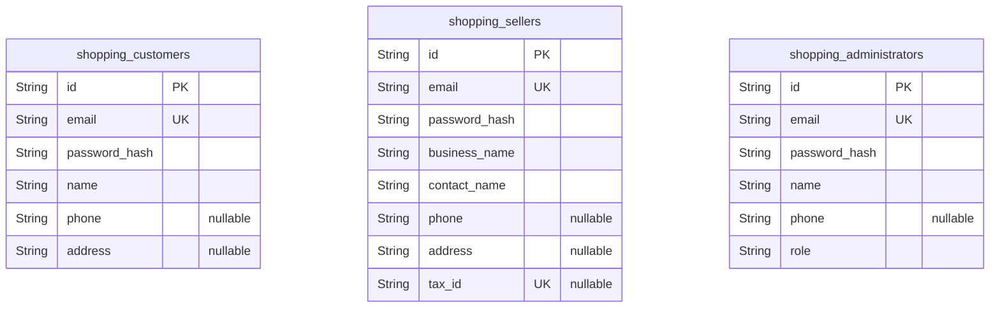
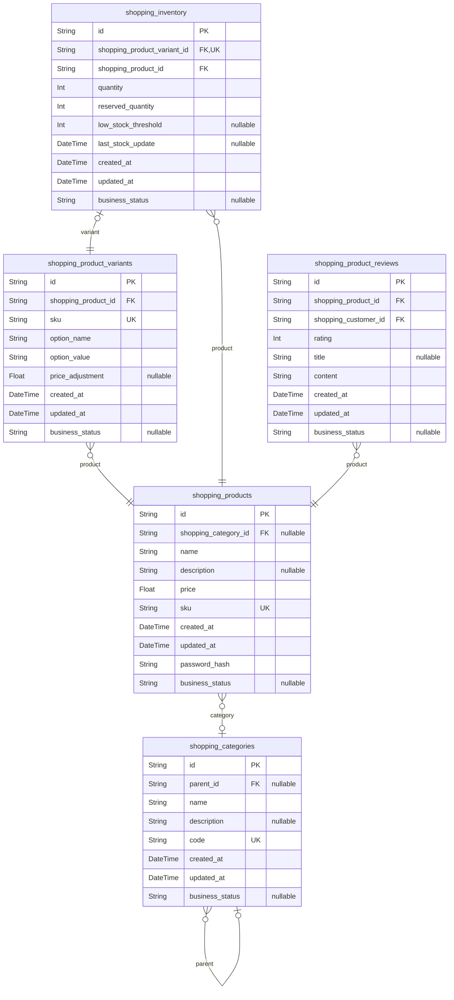
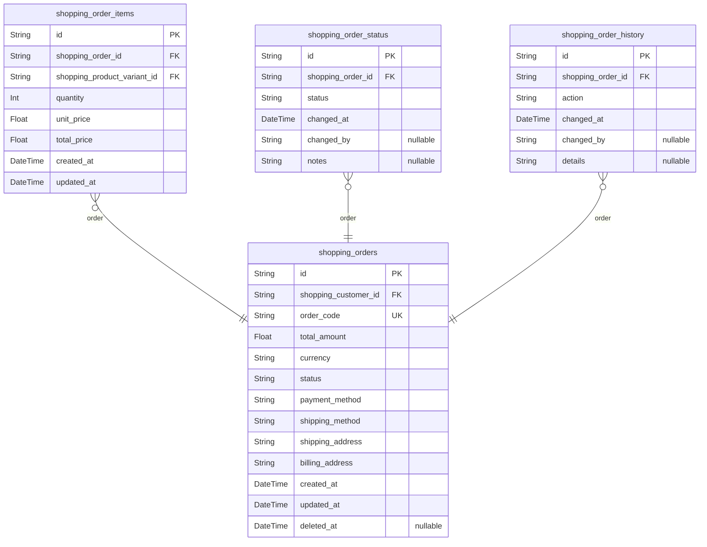
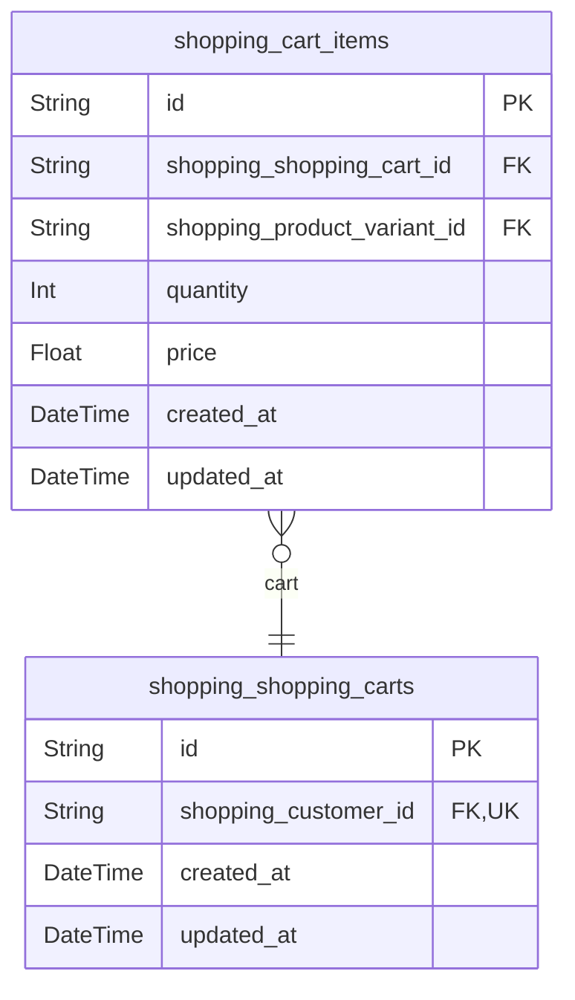
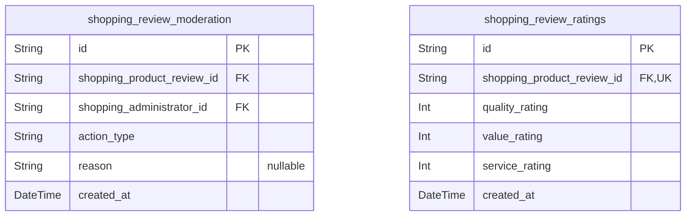
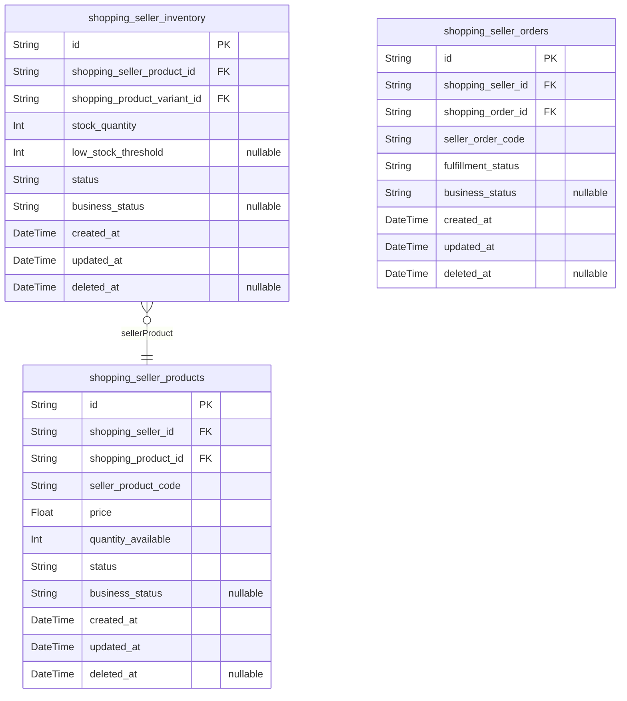
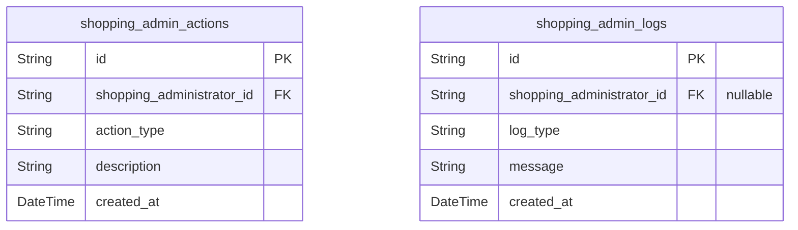
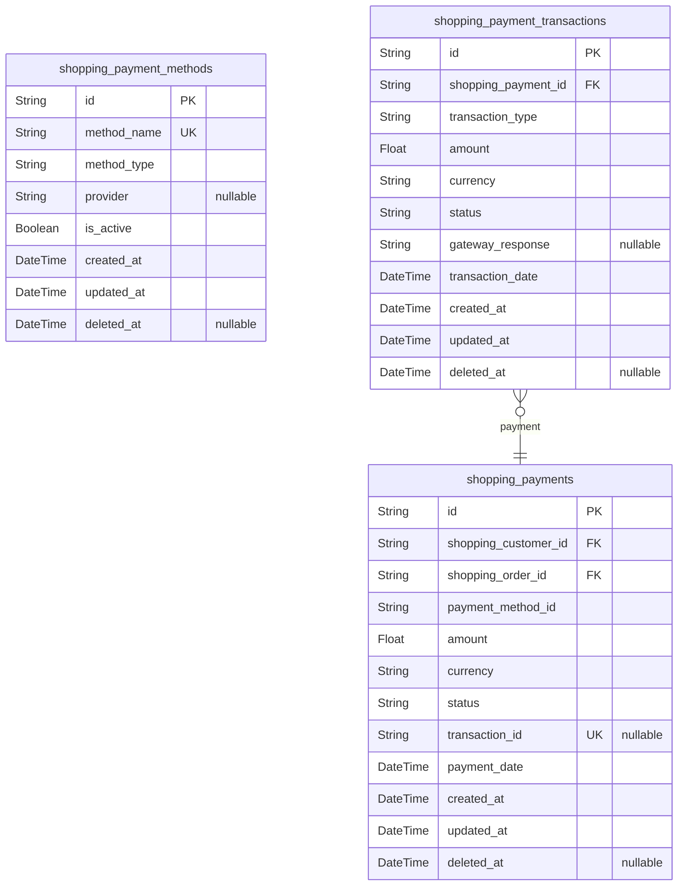
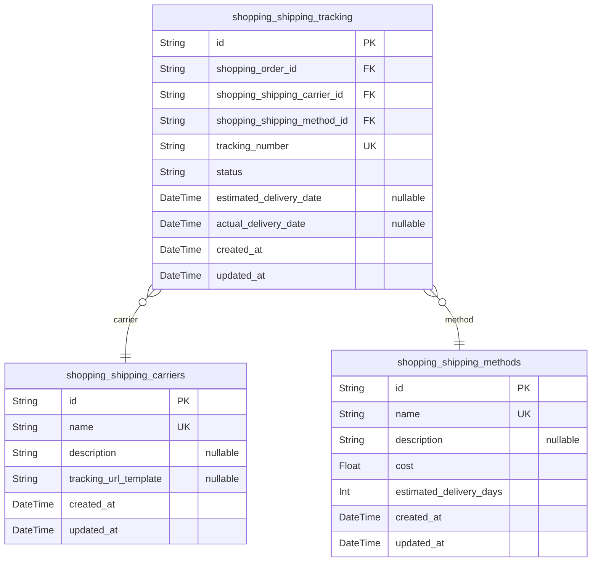

# Prisma Markdown

> Generated by [`prisma-markdown`](https://github.com/samchon/prisma-markdown)

- [Systematic](#systematic)
- [Actors](#actors)
- [Sales](#sales)
- [Orders](#orders)
- [Carts](#carts)
- [Reviews](#reviews)
- [Sellers](#sellers)
- [Admin](#admin)
- [Payments](#payments)
- [Shipping](#shipping)

## Systematic

### `shopping_channels`

Represents the channels through which products are sold in the shopping
mall platform. Each channel can have multiple sections and categories,
forming the foundation of the platform's organizational structure.

Properties as follows:

- `id`: Primary Key.
- `name`: The name of the shopping channel.
- `description`: A detailed description of the shopping channel.
- `created_at`: The timestamp when the channel was created.
- `updated_at`: The timestamp when the channel was last updated.
- `deleted_at`: The timestamp when the channel was soft deleted, if applicable.

### `shopping_sections`

Represents the sections within shopping channels. Each section belongs to
a specific channel and can contain multiple categories.

Properties as follows:

- `id`: Primary Key.
- `shopping_channel_id`: The channel to which this section belongs. [shopping_channels.id](#shopping_channels).
- `name`: The name of the shopping section.
- `description`: A detailed description of the shopping section.
- `created_at`: The timestamp when the section was created.
- `updated_at`: The timestamp when the section was last updated.
- `deleted_at`: The timestamp when the section was soft deleted, if applicable.

### `shopping_channel_categories`

Represents the categories within shopping channel sections. Each category
belongs to a specific section and channel, forming the hierarchical
structure of the platform's product organization.

Properties as follows:

- `id`: Primary Key.
- `shopping_channel_id`: The channel to which this category belongs. [shopping_channels.id](#shopping_channels).
- `shopping_section_id`: The section to which this category belongs. [shopping_sections.id](#shopping_sections).
- `name`: The name of the shopping category.
- `description`: A detailed description of the shopping category.
- `created_at`: The timestamp when the category was created.
- `updated_at`: The timestamp when the category was last updated.
- `deleted_at`: The timestamp when the category was soft deleted, if applicable.

## Actors

### `shopping_customers`

Customer information, but not a person but a **connection** basis. This
is the main entity for customer identity management. Contains
authentication credentials and basic profile information.

Properties as follows:

- `id`: Primary Key.
- `email`: Customer's email address. Used for login and communication.
- `password_hash`: Securely hashed password for authentication.
- `name`: Customer's full name.
- `phone`: Customer's phone number.
- `address`: Customer's primary address.

### `shopping_sellers`

Seller information for marketplace vendors. Contains authentication
credentials and business profile information.

Properties as follows:

- `id`: Primary Key.
- `email`: Seller's email address. Used for login and communication.
- `password_hash`: Securely hashed password for authentication.
- `business_name`: Seller's business name.
- `contact_name`: Primary contact person's name.
- `phone`: Seller's phone number.
- `address`: Seller's business address.
- `tax_id`: Seller's tax identification number.

### `shopping_administrators`

Administrator information for platform management. Contains
authentication credentials and admin profile information.

Properties as follows:

- `id`: Primary Key.
- `email`: Admin's email address. Used for login and communication.
- `password_hash`: Securely hashed password for authentication.
- `name`: Admin's full name.
- `phone`: Admin's phone number.
- `role`: Admin's role or permission level.

## Sales

### `shopping_products`

Core product information for the e-commerce platform. Contains all
essential details about products including name, description, pricing,
and categorization. Serves as the primary entity for product management
and is referenced by variants, inventory, and reviews.

Properties as follows:

- `id`: Primary Key.
- `shopping_category_id`: Category this product belongs to. [shopping_categories.id](#shopping_categories).
- `name`: Name of the product.
- `description`: Detailed description of the product.
- `price`: Base price of the product.
- `sku`: Stock Keeping Unit - unique identifier for the product.
- `created_at`: Timestamp when the product was created.
- `updated_at`: Timestamp when the product was last updated.
- `password_hash`: Securely hashed password for authentication.
- `business_status`: Business-specific status for workflow management.

### `shopping_product_variants`

Product variants representing different options (colors, sizes,
materials) for products. Each variant has its own SKU and inventory
tracking. References the main product and contains variant-specific
details.

Properties as follows:

- `id`: Primary Key.
- `shopping_product_id`: Main product this variant belongs to. [shopping_products.id](#shopping_products).
- `sku`: Stock Keeping Unit - unique identifier for this variant.
- `option_name`: Name of the variant option (e.g., Color, Size).
- `option_value`: Value of the variant option (e.g., Red, Large).
- `price_adjustment`: Price adjustment for this variant from base price.
- `created_at`: Timestamp when the variant was created.
- `updated_at`: Timestamp when the variant was last updated.
- `business_status`: Business-specific status for workflow management.

### `shopping_categories`

Product categorization hierarchy for organizing products. Categories can
have parent-child relationships to create a hierarchical structure.
Products are assigned to categories for better organization and
filtering.

Properties as follows:

- `id`: Primary Key.
- `parent_id`: Parent category if this is a subcategory. [shopping_categories.id](#shopping_categories).
- `name`: Name of the category.
- `description`: Description of the category.
- `code`: Unique code for the category.
- `created_at`: Timestamp when the category was created.
- `updated_at`: Timestamp when the category was last updated.
- `business_status`: Business-specific status for workflow management.

### `shopping_inventory`

Inventory tracking for product variants. Monitors stock levels,
reservations, and availability status for each product variant. Critical
for order fulfillment and stock management.

Properties as follows:

- `id`: Primary Key.
- `shopping_product_variant_id`
  > Product variant this inventory tracks. {@link
  > shopping_product_variants.id}.
- `shopping_product_id`: Product this inventory belongs to. [shopping_products.id](#shopping_products).
- `quantity`: Current available quantity.
- `reserved_quantity`: Quantity reserved for pending orders.
- `low_stock_threshold`: Threshold for low stock alerts.
- `last_stock_update`: Timestamp of last stock update.
- `created_at`: Timestamp when the inventory record was created.
- `updated_at`: Timestamp when the inventory record was last updated.
- `business_status`: Business-specific status for workflow management.

### `shopping_product_reviews`

Customer reviews for products. Contains rating, text, and metadata about
customer feedback on products. Critical for building trust and providing
social proof.

Properties as follows:

- `id`: Primary Key.
- `shopping_product_id`: Product this review is for. [shopping_products.id](#shopping_products).
- `shopping_customer_id`: Customer who left the review. [shopping_customers.id](#shopping_customers).
- `rating`: Rating score (1-5).
- `title`: Title of the review.
- `content`: Main content of the review.
- `created_at`: Timestamp when the review was created.
- `updated_at`: Timestamp when the review was last updated.
- `business_status`: Business-specific status for workflow management.

## Orders

### `shopping_orders`

Main order table containing all order information. Represents customer
orders with status tracking and payment information. This is the primary
entity for order management.

Properties as follows:

- `id`: Primary Key.
- `shopping_customer_id`: Customer who placed the order. [shopping_customers.id](#shopping_customers).
- `order_code`: Unique order code for business identification.
- `total_amount`: Total order amount including all items and taxes.
- `currency`: Currency used for the order (e.g., USD, KRW).
- `status`
  > Current order status (e.g., pending, processing, shipped, delivered,
  > cancelled).
- `payment_method`: Payment method used for the order.
- `shipping_method`: Selected shipping method for the order.
- `shipping_address`: Shipping address for the order.
- `billing_address`: Billing address for the order.
- `created_at`: Timestamp when the order was created.
- `updated_at`: Timestamp when the order was last updated.
- `deleted_at`: Timestamp when the order was soft deleted (if applicable).

### `shopping_order_items`

Order line items representing individual products in an order. Each item
references a product variant and tracks quantity and price.

Properties as follows:

- `id`: Primary Key.
- `shopping_order_id`: Order this item belongs to. [shopping_orders.id](#shopping_orders).
- `shopping_product_variant_id`: Product variant being ordered. [shopping_product_variants.id](#shopping_product_variants).
- `quantity`: Number of units ordered.
- `unit_price`: Price per unit at time of order.
- `total_price`: Total price for this line item (quantity × unit_price).
- `created_at`: Timestamp when the order item was created.
- `updated_at`: Timestamp when the order item was last updated.

### `shopping_order_status`

Order status tracking table. Records all status changes for an order with
timestamps.

Properties as follows:

- `id`: Primary Key.
- `shopping_order_id`: Order this status belongs to. [shopping_orders.id](#shopping_orders).
- `status`: Order status at this point in time.
- `changed_at`: Timestamp when this status was set.
- `changed_by`: User or system that changed the status.
- `notes`: Additional notes about the status change.

### `shopping_order_history`

Historical record of all order changes. Captures snapshots of order
states for audit trails and change tracking.

Properties as follows:

- `id`: Primary Key.
- `shopping_order_id`: Order this history record belongs to. [shopping_orders.id](#shopping_orders).
- `action`: Action performed on the order (e.g., created, updated, cancelled).
- `changed_at`: Timestamp when this action occurred.
- `changed_by`: User or system that performed the action.
- `details`: JSON object containing order state at time of action.

## Carts

### `shopping_shopping_carts`

Represents a customer's shopping cart containing items they intend to
purchase. Each cart belongs to a specific customer and can contain
multiple cart items. This is a primary business entity that users manage
independently through their shopping experience.

Properties as follows:

- `id`: Primary Key.
- `shopping_customer_id`: Customer who owns this shopping cart. [shopping_customers.id](#shopping_customers).
- `created_at`: Timestamp when the shopping cart was created.
- `updated_at`: Timestamp when the shopping cart was last updated.

### `shopping_cart_items`

Represents individual items in a shopping cart. Each item references a
specific product variant and belongs to a specific shopping cart. This is
a subsidiary entity managed through the parent shopping cart.

Properties as follows:

- `id`: Primary Key.
- `shopping_shopping_cart_id`: Shopping cart that contains this item. [shopping_shopping_carts.id](#shopping_shopping_carts).
- `shopping_product_variant_id`
  > Product variant referenced by this cart item. {@link
  > shopping_product_variants.id}.
- `quantity`: Quantity of this product variant in the cart.
- `price`: Price of the product variant at the time it was added to the cart.
- `created_at`: Timestamp when the cart item was added.
- `updated_at`: Timestamp when the cart item was last updated.

## Reviews

### `shopping_review_moderation`

Tracks moderation actions taken on product reviews. This table records
each moderation event, including the administrator who performed the
action, the type of action, reason, and timestamp. It supports the review
approval workflow and audit trail.

Properties as follows:

- `id`: Primary Key.
- `shopping_product_review_id`: The review being moderated. [shopping_product_reviews.id](#shopping_product_reviews).
- `shopping_administrator_id`
  > The administrator who performed the moderation action. {@link
  > shopping_administrators.id}.
- `action_type`: Type of moderation action (approve, reject, flag).
- `reason`: Reason for the moderation action.
- `created_at`: When the moderation action was performed.

### `shopping_review_ratings`

Stores detailed rating breakdowns for product reviews. This table
captures individual rating dimensions (quality, value, etc.) that
contribute to the overall rating. It allows for granular analysis of
review ratings across different aspects.

Properties as follows:

- `id`: Primary Key.
- `shopping_product_review_id`: The review this rating belongs to. [shopping_product_reviews.id](#shopping_product_reviews).
- `quality_rating`: Rating for product quality (1-5).
- `value_rating`: Rating for product value (1-5).
- `service_rating`: Rating for service experience (1-5).
- `created_at`: When the rating was created.

## Sellers

### `shopping_seller_products`

Products managed by sellers, including product details and
seller-specific information. This table represents the products that
sellers offer on the platform, with a relationship to the main products
table.

Properties as follows:

- `id`: Primary Key.
- `shopping_seller_id`
  > Reference to the seller who owns this product. {@link
  > shopping_sellers.id}.
- `shopping_product_id`
  > Reference to the main product in the catalog. {@link
  > shopping_products.id}.
- `seller_product_code`: Seller-specific product code for internal management.
- `price`: Seller's price for the product.
- `quantity_available`: Current available quantity for this product.
- `status`: Status of the product (e.g., active, draft, archived).
- `business_status`: Business-specific status for workflow management.
- `created_at`: Timestamp when the seller product was created.
- `updated_at`: Timestamp when the seller product was last updated.
- `deleted_at`: Timestamp when the seller product was soft deleted, if applicable.

### `shopping_seller_inventory`

Inventory tracking for seller products, including stock levels and
management details. This table represents the inventory information that
sellers manage for their products.

Properties as follows:

- `id`: Primary Key.
- `shopping_seller_product_id`: Reference to the seller product. [shopping_seller_products.id](#shopping_seller_products).
- `shopping_product_variant_id`
  > Reference to the specific product variant. {@link
  > shopping_product_variants.id}.
- `stock_quantity`: Current stock quantity for this inventory item.
- `low_stock_threshold`: Threshold for low stock alerts.
- `status`: Status of the inventory item (e.g., in_stock, low_stock, out_of_stock).
- `business_status`: Business-specific status for workflow management.
- `created_at`: Timestamp when the inventory record was created.
- `updated_at`: Timestamp when the inventory record was last updated.
- `deleted_at`: Timestamp when the inventory record was soft deleted, if applicable.

### `shopping_seller_orders`

Orders managed by sellers, including order details and seller-specific
information. This table represents the orders that sellers need to
fulfill and manage.

Properties as follows:

- `id`: Primary Key.
- `shopping_seller_id`: Reference to the seller who owns this order. [shopping_sellers.id](#shopping_sellers).
- `shopping_order_id`: Reference to the main order. [shopping_orders.id](#shopping_orders).
- `seller_order_code`: Seller-specific order code for internal management.
- `fulfillment_status`
  > Current fulfillment status of the order (e.g., pending, processing,
  > shipped, delivered).
- `business_status`: Business-specific status for workflow management.
- `created_at`: Timestamp when the seller order was created.
- `updated_at`: Timestamp when the seller order was last updated.
- `deleted_at`: Timestamp when the seller order was soft deleted, if applicable.

## Admin

### `shopping_admin_actions`

Records of actions performed by administrators. Tracks all administrative
activities for audit and accountability purposes. Each action is linked
to a specific administrator.

Properties as follows:

- `id`: Primary Key.
- `shopping_administrator_id`
  > Administrator who performed the action. {@link
  > shopping_administrators.id}.
- `action_type`
  > Type of action performed (e.g., 'user_management', 'product_approval',
  > 'order_update').
- `description`: Detailed description of the action performed.
- `created_at`: Timestamp when the action was performed.

### `shopping_admin_logs`

System logs recording important events and changes. Tracks system-level
events that may be initiated by administrators or system processes.

Properties as follows:

- `id`: Primary Key.
- `shopping_administrator_id`
  > Administrator associated with the log entry (if applicable). {@link
  > shopping_administrators.id}.
- `log_type`: Type of log entry (e.g., 'system_event', 'security_event', 'data_change').
- `message`: Detailed log message describing the event.
- `created_at`: Timestamp when the log entry was created.

## Payments

### `shopping_payments`

Payment records for all transactions in the shopping mall platform. This
table stores information about each payment made by customers, including
payment method, amount, status, and related order information. It serves
as the central record for all financial transactions in the system.

Properties as follows:

- `id`: Primary Key.
- `shopping_customer_id`: Customer who made the payment. [shopping_customers.id](#shopping_customers).
- `shopping_order_id`: Order associated with this payment. [shopping_orders.id](#shopping_orders).
- `payment_method_id`
  > Payment method used for this transaction. {@link
  > shopping_payment_methods.id}.
- `amount`: Total amount paid in this transaction.
- `currency`: Currency used for the payment (e.g., USD, EUR).
- `status`
  > Current status of the payment (e.g., pending, completed, failed,
  > refunded).
- `transaction_id`: External transaction ID from payment gateway.
- `payment_date`: Date and time when the payment was processed.
- `created_at`: Record creation timestamp.
- `updated_at`: Record last update timestamp.
- `deleted_at`: Soft delete timestamp.

### `shopping_payment_methods`

Available payment methods in the shopping mall platform. This table
defines all supported payment methods that customers can use to make
purchases, including credit cards, digital wallets, bank transfers, etc.

Properties as follows:

- `id`: Primary Key.
- `method_name`: Name of the payment method (e.g., Credit Card, PayPal, Apple Pay).
- `method_type`: Type of payment method (e.g., card, digital_wallet, bank_transfer).
- `provider`: Payment provider name (e.g., Stripe, PayPal, Visa).
- `is_active`: Whether this payment method is currently active and available.
- `created_at`: Record creation timestamp.
- `updated_at`: Record last update timestamp.
- `deleted_at`: Soft delete timestamp.

### `shopping_payment_transactions`

Detailed records of individual payment transactions. This table captures
all the detailed information about each payment transaction, including
authorization, capture, refund, and chargeback information.

Properties as follows:

- `id`: Primary Key.
- `shopping_payment_id`: Payment record this transaction belongs to. [shopping_payments.id](#shopping_payments).
- `transaction_type`: Type of transaction (e.g., authorization, capture, refund, chargeback).
- `amount`: Amount involved in this transaction.
- `currency`: Currency used for this transaction.
- `status`: Current status of this transaction.
- `gateway_response`: Raw response from payment gateway.
- `transaction_date`: Date and time when this transaction occurred.
- `created_at`: Record creation timestamp.
- `updated_at`: Record last update timestamp.
- `deleted_at`: Soft delete timestamp.

## Shipping

### `shopping_shipping_methods`

Shipping methods available for order fulfillment. Contains information
about different shipping options, their costs, and delivery time
estimates.

Properties as follows:

- `id`: Primary Key.
- `name`: Name of the shipping method (e.g., Standard, Express, Overnight).
- `description`: Detailed description of the shipping method.
- `cost`: Base cost of the shipping method.
- `estimated_delivery_days`: Estimated number of days for delivery.
- `created_at`: Timestamp when the shipping method was created.
- `updated_at`: Timestamp when the shipping method was last updated.

### `shopping_shipping_carriers`

Shipping carriers that handle order deliveries. Contains information
about different shipping companies and their services.

Properties as follows:

- `id`: Primary Key.
- `name`: Name of the shipping carrier (e.g., UPS, FedEx, DHL).
- `description`: Detailed description of the shipping carrier.
- `tracking_url_template`: URL template for tracking shipments with this carrier.
- `created_at`: Timestamp when the shipping carrier was created.
- `updated_at`: Timestamp when the shipping carrier was last updated.

### `shopping_shipping_tracking`

Tracking information for shipped orders. Contains details about shipment
status, tracking numbers, and carrier information.

Properties as follows:

- `id`: Primary Key.
- `shopping_order_id`: The order being tracked. [shopping_orders.id](#shopping_orders).
- `shopping_shipping_carrier_id`: The carrier handling the shipment. [shopping_shipping_carriers.id](#shopping_shipping_carriers).
- `shopping_shipping_method_id`
  > The shipping method used for this shipment. {@link
  > shopping_shipping_methods.id}.
- `tracking_number`: Tracking number provided by the carrier.
- `status`: Current status of the shipment (e.g., Processing, Shipped, Delivered).
- `estimated_delivery_date`: Estimated delivery date for the shipment.
- `actual_delivery_date`: Actual delivery date when the shipment was delivered.
- `created_at`: Timestamp when the tracking information was created.
- `updated_at`: Timestamp when the tracking information was last updated.
