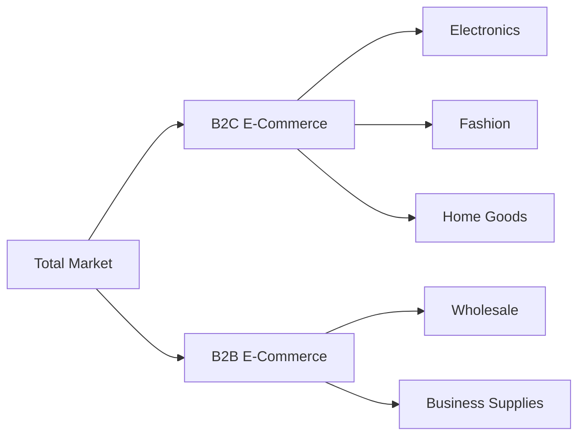
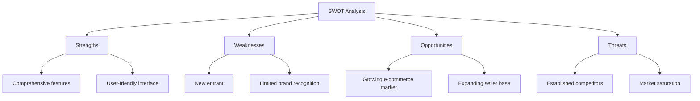

# E-Commerce Shopping Mall Platform Business Model Analysis

## Business Model

### Platform Overview

The e-commerce shopping mall platform is a comprehensive online marketplace that connects buyers and sellers, offering a wide range of products across various categories. The platform provides a seamless shopping experience with features such as user registration, product catalog, shopping cart, order placement, payment processing, order tracking, product reviews, seller accounts, inventory management, and admin dashboard.

### Key Features

- **User Registration and Login**: Secure user authentication with address management
- **Product Catalog**: Organized product listings with categories and search functionality
- **Product Variants**: Support for different colors, sizes, and options with SKU management
- **Shopping Cart and Wishlist**: Item management for purchase and future consideration
- **Order Placement and Payment**: Secure payment processing with multiple methods
- **Order Tracking**: Real-time shipping status updates
- **Product Reviews**: User-generated ratings and feedback
- **Seller Accounts**: Product and inventory management for vendors
- **Admin Dashboard**: Comprehensive system management and analytics

### Business Strategy

The platform aims to provide a user-friendly, secure, and efficient shopping experience. By offering a wide range of products and robust features, the platform attracts both buyers and sellers, creating a thriving marketplace ecosystem.

## Value Proposition

### Unique Selling Points

- **Comprehensive Product Range**: Wide variety of products across multiple categories
- **User-Friendly Interface**: Intuitive design for easy navigation and shopping
- **Secure Transactions**: Robust payment processing and data protection
- **Seller Empowerment**: Tools for sellers to manage products and inventory effectively
- **Customer Support**: Responsive service for order tracking and issue resolution

### Customer Benefits

- **Convenience**: Shop from anywhere at any time
- **Choice**: Access to a wide range of products and sellers
- **Security**: Safe transactions and data protection
- **Support**: Assistance with orders and product information
- **Personalization**: Tailored recommendations and user profiles

### Market Differentiation

- **Integrated Seller Tools**: Comprehensive management features for vendors
- **Advanced Search and Filtering**: Efficient product discovery
- **Real-Time Order Tracking**: Transparent shipping status updates
- **Community Features**: Product reviews and ratings for informed decisions

## Revenue Streams

### Sales Commissions

- **Transaction Fees**: Percentage of each sale charged to sellers
- **Listing Fees**: Charges for product listings and promotions
- **Featured Placements**: Premium positioning for higher visibility

### Subscription Fees

- **Seller Subscriptions**: Monthly or annual fees for advanced seller tools
- **Premium Memberships**: Enhanced features for buyers (e.g., free shipping, exclusive deals)

### Advertising Revenue

- **Banner Ads**: Display advertisements from third-party brands
- **Sponsored Products**: Promoted listings within search results
- **Email Marketing**: Targeted promotions to registered users

### Additional Services

- **Shipping Services**: Integrated logistics and delivery options
- **Payment Processing**: Transaction fees for payment gateway usage
- **Data Analytics**: Insights and reports for sellers and partners

## Target Market

### Customer Segments

- **Individual Consumers**: General public looking for everyday products
- **Business Buyers**: Companies purchasing in bulk or for resale
- **Sellers**: Individuals and businesses offering products for sale

### Market Size and Growth

- **Total Addressable Market**: Global e-commerce market valued at $4.9 trillion (2021)
- **Growth Rate**: Projected CAGR of 14.7% from 2020 to 2027
- **Target Regions**: North America, Europe, Asia-Pacific

### Customer Personas

- **Tech-Savvy Shoppers**: Age 18-35, frequent online buyers, value convenience
- **Bargain Hunters**: Price-sensitive, look for deals and discounts
- **Small Business Owners**: Sell products online, need management tools
- **Corporate Buyers**: Purchase in bulk, require invoicing and support

## Competitive Advantage

### Technology and Innovation

- **Advanced Search Algorithms**: Efficient product discovery
- **AI-Driven Recommendations**: Personalized shopping experience
- **Mobile Optimization**: Seamless shopping on all devices

### Customer Experience

- **Intuitive Interface**: Easy navigation and product browsing
- **Responsive Support**: Quick resolution of customer inquiries
- **Transparent Processes**: Clear order tracking and communication

### Operational Efficiency

- **Automated Inventory Management**: Real-time stock tracking
- **Streamlined Order Processing**: Efficient fulfillment workflows
- **Data-Driven Insights**: Analytics for continuous improvement

### Strategic Partnerships

- **Logistics Providers**: Reliable shipping and delivery services
- **Payment Gateways**: Secure and diverse payment options
- **Technology Partners**: Integration with leading e-commerce solutions

## Market Analysis

### Market Segmentation

### Competitive Landscape

| Competitor | Market Share | Strengths | Weaknesses |
|-----------|--------------|-----------|------------|
| Amazon | 38% | Wide selection, fast shipping | High competition among sellers |
| eBay | 12% | Auction format, diverse products | Older interface, less mobile-friendly |
| Walmart | 8% | Low prices, broad inventory | Limited marketplace features |
| Etsy | 5% | Unique handmade items | Niche market, higher fees |

### SWOT Analysis

## Financial Projections

### Revenue Projections

| Year | Total Revenue | Growth Rate |
|------|---------------|-------------|
| 2023 | $500,000 | - |
| 2024 | $1,200,000 | 140% |
| 2025 | $2,500,000 | 108% |
| 2026 | $4,000,000 | 60% |

### Cost Structure

- **Technology Development**: Platform maintenance and updates
- **Marketing and Advertising**: Customer acquisition and retention
- **Operational Costs**: Customer support, logistics, and partnerships
- **Compliance and Security**: Data protection and regulatory adherence

## Implementation Roadmap

### Phase 1: MVP Launch

- **Core Features**: User registration, product catalog, shopping cart, order placement
- **Initial Market**: Focus on tech-savvy shoppers and small business sellers
- **Revenue Focus**: Transaction fees and basic subscriptions

### Phase 2: Feature Expansion

- **Enhanced Features**: Advanced search, seller analytics, mobile optimization
- **Market Expansion**: Broader customer segments and geographic regions
- **Revenue Diversification**: Advertising, premium services, and partnerships

### Phase 3: Market Leadership

- **Innovative Features**: AI recommendations, augmented reality shopping, voice search
- **Global Reach**: International expansion and localization
- **Sustainable Growth**: Balanced revenue streams and operational efficiency

## Conclusion

The e-commerce shopping mall platform offers a comprehensive solution for online shopping, with a robust business model that includes multiple revenue streams, a clear value proposition, and strategic competitive advantages. By focusing on user experience, seller empowerment, and operational efficiency, the platform is well-positioned to capture a significant share of the growing e-commerce market.

## References

- [Service Overview Document](./00-toc.md)
- [User Authentication Requirements](./02-user-authentication.md)
- [Product Catalog Requirements](./03-product-catalog.md)
- [Shopping Cart Requirements](./04-shopping-cart.md)
- [Order Placement Requirements](./05-order-placement.md)
- [Order Tracking Requirements](./06-order-tracking.md)
- [Product Reviews Requirements](./07-product-reviews.md)
- [Seller Accounts Requirements](./08-seller-accounts.md)
- [Admin Dashboard Requirements](./09-admin-dashboard.md)
- [User Flow Documentation](./10-user-flow.md)
- [Technical Requirements](./11-technical-requirements.md)

> *Developer Note: This document defines **business requirements only**. All technical implementations (architecture, APIs, database design, etc.) are at the discretion of the development team.*