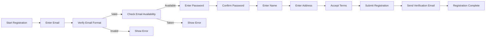

# User Authentication Requirements for Shopping Mall Platform

## 1. Introduction

### 1.1 Purpose
This document specifies the functional requirements for user registration, authentication, and profile management for the Shopping Mall e-commerce platform.

### 1.2 Scope
This document covers all aspects of user authentication including registration, login, profile management, address management, and security measures.

### 1.3 Definitions
- **User**: Any individual who interacts with the platform
- **Customer**: A user who purchases products
- **Seller**: A user who sells products
- **Admin**: A user who manages the platform
- **Authentication**: The process of verifying user identity
- **Authorization**: The process of granting access based on user roles

## 2. User Roles and Permissions

### 2.1 Customer
- **Description**: Standard users who can browse products, add to cart, place orders, and manage their profile.
- **Permissions**:
  - Browse and search products
  - Add items to cart and wishlist
  - Place and track orders
  - Manage profile and addresses
  - Leave product reviews

### 2.2 Seller
- **Description**: Users who can manage their own products, inventory, and orders.
- **Permissions**:
  - All customer permissions
  - Manage product listings
  - Manage inventory
  - Process orders
  - View sales analytics

### 2.3 Admin
- **Description**: System administrators who can manage all users, products, and orders.
- **Permissions**:
  - All customer and seller permissions
  - Manage all user accounts
  - Manage all product listings
  - Manage all orders
  - Access system analytics
  - Configure platform settings

## 3. User Registration

### 3.1 Registration Process

### 3.2 Required Information
- Email address (unique identifier)
- Password (secure storage)
- Full name
- Primary address
- Phone number (optional)
- Date of birth (optional)

### 3.3 Validation Rules
- **Email**: Must be unique and valid format
- **Password**: Minimum 8 characters, with uppercase, lowercase, number, and special character
- **Name**: Must not contain numbers or special characters
- **Address**: Must include street, city, state, zip code, and country
- **Phone**: Must be valid format if provided

## 4. User Login

### 4.1 Authentication Methods
- **Email and Password**: Standard login method
- **Social Media**: Optional integration with Google, Facebook, etc.
- **Two-Factor Authentication**: Optional for enhanced security

### 4.2 Session Management
- **Session Timeout**: 30 minutes of inactivity
- **Persistent Login**: Optional "Remember Me" feature
- **Concurrent Sessions**: Maximum of 5 active sessions per user

### 4.3 Password Recovery
- **Forgot Password**: Email-based reset link
- **Account Lockout**: After 5 failed attempts, 15-minute lockout
- **Password Reset**: Requires current password confirmation

## 5. Profile Management

### 5.1 Profile Information
- **Basic Information**: Name, email, phone, date of birth
- **Preferences**: Language, currency, notification settings
- **Security**: Password, two-factor authentication settings

### 5.2 Profile Editing
- **WHEN** a user updates their profile, **THE** system **SHALL** validate all changes before saving.
- **WHEN** a user changes their email, **THE** system **SHALL** send a verification email to the new address.
- **WHEN** a user updates their password, **THE** system **SHALL** require current password confirmation.

### 5.3 Profile Security
- **WHEN** a user enables two-factor authentication, **THE** system **SHALL** require verification code for login.
- **WHEN** a user attempts to access sensitive information, **THE** system **SHALL** require password re-entry.

## 6. Address Management

### 6.1 Address Storage
- **WHEN** a user adds a new address, **THE** system **SHALL** validate the address format.
- **WHEN** a user sets a default address, **THE** system **SHALL** use it for all future orders.

### 6.2 Address Validation
- **WHEN** a user enters an address, **THE** system **SHALL** verify it against a standard address format.
- **WHEN** a user enters an invalid address, **THE** system **SHALL** display an error message.

### 6.3 Address Usage
- **WHEN** a user places an order, **THE** system **SHALL** use the default address unless specified otherwise.
- **WHEN** a user updates their default address, **THE** system **SHALL** apply it to all future orders.

## 7. Authentication Security

### 7.1 Password Requirements
- **WHEN** a user creates a password, **THE** system **SHALL** enforce minimum complexity rules.
- **WHEN** a user changes their password, **THE** system **SHALL** require the current password.

### 7.2 Account Protection
- **WHEN** a user fails to log in 5 times, **THE** system **SHALL** lock the account for 15 minutes.
- **WHEN** a user enables two-factor authentication, **THE** system **SHALL** require a verification code for login.

### 7.3 Security Measures
- **WHEN** a user is inactive for 30 minutes, **THE** system **SHALL** automatically log them out.
- **WHEN** a user attempts to access sensitive information, **THE** system **SHALL** require password re-entry.

## 8. Error Handling

### 8.1 Common Error Scenarios
- **WHEN** a user enters an invalid email format, **THE** system **SHALL** display an error message.
- **WHEN** a user enters a weak password, **THE** system **SHALL** display password requirements.
- **WHEN** a user enters an incorrect password, **THE** system **SHALL** display an error message.

### 8.2 Error Recovery
- **WHEN** a user fails to log in, **THE** system **SHALL** provide a password reset option.
- **WHEN** a user encounters an error, **THE** system **SHALL** provide clear instructions for resolution.

## 9. Performance Requirements

### 9.1 Response Times
- **WHEN** a user submits a registration form, **THE** system **SHALL** respond within 2 seconds.
- **WHEN** a user logs in, **THE** system **SHALL** respond within 1 second.

### 9.2 System Availability
- **WHEN** a user attempts to access the platform, **THE** system **SHALL** be available 99.9% of the time.

## 10. Compliance and Legal

### 10.1 Data Protection
- **WHEN** a user provides personal information, **THE** system **SHALL** store it securely.
- **WHEN** a user requests data deletion, **THE** system **SHALL** comply within 30 days.

### 10.2 Privacy Policies
- **WHEN** a user registers, **THE** system **SHALL** require acceptance of privacy policies.
- **WHEN** a user updates their profile, **THE** system **SHALL** require re-acceptance of privacy policies if they have changed.

## Related Documents
- [Service Overview](./00-toc.md)
- [Business Model](./01-business-model.md)
- [Product Catalog](./03-product-catalog.md)
- [Shopping Cart](./04-shopping-cart.md)
- [Order Placement](./05-order-placement.md)
- [Order Tracking](./06-order-tracking.md)
- [Product Reviews](./07-product-reviews.md)
- [Seller Accounts](./08-seller-accounts.md)
- [Admin Dashboard](./09-admin-dashboard.md)
- [User Flow](./10-user-flow.md)
- [Technical Requirements](./11-technical-requirements.md)