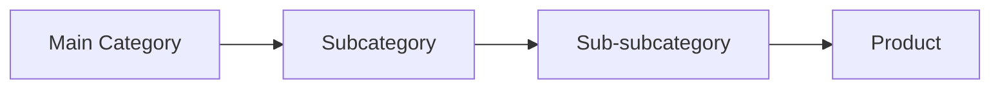
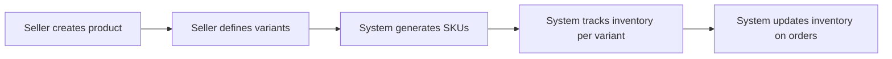

# Product Catalog Requirements Specification

## 1. Introduction

### 1.1 Purpose
This document specifies the requirements for the product catalog system of the e-commerce shopping mall platform. It defines how products are categorized, searched, displayed, and managed within the system.

### 1.2 Scope
This specification covers all aspects of product catalog functionality including:
- Product categorization and hierarchy
- Product search and filtering
- Product detail display
- Product variant management
- Inventory tracking and management

### 1.3 Definitions
- **SKU**: Stock Keeping Unit - a unique identifier for each product variant
- **Product Variant**: Different versions of the same product (e.g., different colors, sizes)
- **Category**: A grouping of similar products
- **Inventory**: The stock level of available products

## 2. Product Categories

### 2.1 Category Structure

**EARS Requirement**: THE system SHALL support a hierarchical category structure with at least 3 levels (main category, subcategory, sub-subcategory).

### 2.2 Category Management

**EARS Requirement**: WHEN an admin creates a new category, THE system SHALL validate that the category name is unique within its parent level.

**EARS Requirement**: THE system SHALL allow admins to assign products to multiple categories.

## 3. Product Search

### 3.1 Search Functionality

**EARS Requirement**: WHEN a user enters a search query, THE system SHALL return products matching the query in the product name, description, or category.

**EARS Requirement**: THE system SHALL support autocomplete suggestions as the user types their search query.

### 3.2 Search Filters

**EARS Requirement**: THE system SHALL provide the following search filters:
- Price range
- Brand
- Rating
- Availability
- Category
- Color
- Size

**EARS Requirement**: WHEN a user applies multiple filters, THE system SHALL return products that match ALL selected filters.

### 3.3 Search Results

**EARS Requirement**: THE system SHALL display search results with pagination, showing 20 products per page.

**EARS Requirement**: THE system SHALL allow sorting of search results by:
- Relevance
- Price (low to high)
- Price (high to low)
- Rating
- Newest

## 4. Product Details

### 4.1 Product Information

**EARS Requirement**: THE system SHALL display the following information on each product detail page:
- Product name
- Product description
- Price
- Available variants (colors, sizes)
- Current inventory status
- Average rating
- Number of reviews

### 4.2 Product Images

**EARS Requirement**: THE system SHALL support multiple product images (minimum 5 images per product).

**EARS Requirement**: THE system SHALL allow users to zoom in on product images.

### 4.3 Product Descriptions

**EARS Requirement**: THE system SHALL support rich text formatting for product descriptions.

**EARS Requirement**: THE system SHALL allow sellers to include technical specifications in a structured format.

## 5. Product Variants

### 5.1 Variant Types

**EARS Requirement**: THE system SHALL support the following variant types:
- Color
- Size
- Material
- Custom options (defined by seller)

### 5.2 Variant Management

**EARS Requirement**: WHEN a seller creates a new product, THE system SHALL allow them to define multiple variants.

**EARS Requirement**: THE system SHALL track inventory separately for each product variant.

### 5.3 SKU Management

**EARS Requirement**: THE system SHALL automatically generate a unique SKU for each product variant.

**EARS Requirement**: THE system SHALL prevent duplicate SKUs.

## 6. Inventory Management

### 6.1 Inventory Tracking

**EARS Requirement**: THE system SHALL track inventory levels in real-time for each product variant.

**EARS Requirement**: WHEN inventory reaches 0 for a variant, THE system SHALL mark it as "out of stock".

### 6.2 Low Stock Alerts

**EARS Requirement**: THE system SHALL notify sellers when inventory for any variant falls below a configurable threshold.

### 6.3 Inventory Updates

**EARS Requirement**: WHEN a seller updates inventory levels, THE system SHALL validate that the new quantity is a positive integer.

**EARS Requirement**: THE system SHALL update inventory levels automatically when orders are placed or canceled.

## 7. Business Rules

**EARS Requirement**: THE system SHALL prevent sellers from creating products without at least one variant.

**EARS Requirement**: THE system SHALL require all products to have a minimum of one image.

**EARS Requirement**: THE system SHALL validate that product prices are positive numbers.

## 8. Error Handling

**EARS Requirement**: WHEN a user searches for a product that doesn't exist, THE system SHALL display a "No products found" message.

**EARS Requirement**: WHEN a seller tries to create a duplicate SKU, THE system SHALL display an error message and prevent creation.

## 9. Performance Requirements

**EARS Requirement**: THE system SHALL return search results within 2 seconds for common queries.

**EARS Requirement**: THE system SHALL load product detail pages within 1 second.

## 10. User Roles and Permissions

**EARS Requirement**: THE system SHALL allow customers to view all product information.

**EARS Requirement**: THE system SHALL allow sellers to create, edit, and delete their own products.

**EARS Requirement**: THE system SHALL allow admins to manage all products and categories.

## 11. Integration Requirements

**EARS Requirement**: THE system SHALL integrate with the shopping cart system to provide real-time inventory validation.

**EARS Requirement**: THE system SHALL integrate with the order system to update inventory levels upon order placement.

## 12. Future Considerations

**EARS Requirement**: THE system SHOULD support product recommendations based on user browsing history.

**EARS Requirement**: THE system SHOULD support bulk product upload for sellers.

## 13. Mermaid Diagrams

### Product Search Flow

### Product Variant Management

## 14. Related Documents

- [Service Overview](./00-toc.md)
- [User Authentication](./02-user-authentication.md)
- [Shopping Cart](./04-shopping-cart.md)
- [Order Placement](./05-order-placement.md)

## 15. Conclusion

This document provides a comprehensive specification for the product catalog system of the e-commerce shopping mall platform. It defines all aspects of product management, search, display, and inventory tracking to ensure a robust and user-friendly shopping experience.

> *Developer Note: This document defines **business requirements only**. All technical implementations (architecture, APIs, database design, etc.) are at the discretion of the development team.*