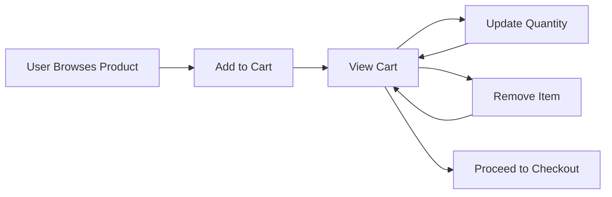
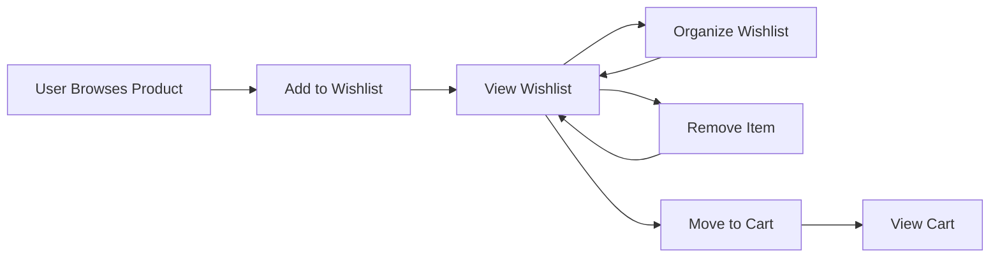

# Shopping Cart and Wishlist Functional Requirements

## 1. Introduction

This document specifies the functional requirements for the shopping cart and wishlist features of the shoppingMall e-commerce platform. These features are critical for user experience and conversion optimization.

## 2. Shopping Cart Functionality

### 2.1 Adding Items to Cart

**EARS Format:**
- WHEN a user selects a product, THE system SHALL allow adding the product to the shopping cart.
- WHEN a user adds a product to the cart, THE system SHALL display a confirmation message.
- WHEN a product has variants (SKU), THE system SHALL require the user to select a specific variant before adding to cart.

**Business Rules:**
- Users can add multiple quantities of the same product
- Products must be in stock to be added to cart
- Product variants must be selected before adding to cart

### 2.2 Removing Items from Cart

**EARS Format:**
- WHEN a user removes an item from the cart, THE system SHALL update the cart total immediately.
- WHEN the last item is removed, THE system SHALL display an empty cart message.

**Business Rules:**
- Removed items should be available for re-addition
- Cart total must reflect changes immediately

### 2.3 Updating Item Quantities

**EARS Format:**
- WHEN a user changes the quantity of an item, THE system SHALL update the cart total immediately.
- WHEN a user exceeds available inventory, THE system SHALL display an error message.

**Business Rules:**
- Quantity changes must respect inventory limits
- Price updates must be real-time

### 2.4 Cart Persistence

**EARS Format:**
- WHEN a user logs in, THE system SHALL restore their previous cart contents.
- WHEN a user is inactive for 30 days, THE system SHALL clear their saved cart.

**Business Rules:**
- Cart contents persist across sessions for logged-in users
- Guest carts are session-based

### 2.5 Cart Abandonment Handling

**EARS Format:**
- WHEN a user abandons a cart with items, THE system SHALL send a reminder email after 24 hours.
- WHEN a user abandons a cart, THE system SHALL save the cart contents for 30 days.

**Business Rules:**
- Abandoned cart reminders should include product images
- Cart contents expire after 30 days

### 2.6 Cart Sharing

**EARS Format:**
- WHEN a user shares their cart, THE system SHALL generate a shareable link.
- WHEN a shared cart is accessed, THE system SHALL display the cart contents without user-specific information.

**Business Rules:**
- Shared carts should not expose personal information
- Shared carts should be accessible without login

## 3. Wishlist Functionality

### 3.1 Adding Items to Wishlist

**EARS Format:**
- WHEN a user selects a product, THE system SHALL allow adding the product to the wishlist.
- WHEN a user adds a product to the wishlist, THE system SHALL display a confirmation message.

**Business Rules:**
- Users can add products regardless of stock status
- Wishlist items should be sortable

### 3.2 Removing Items from Wishlist

**EARS Format:**
- WHEN a user removes an item from the wishlist, THE system SHALL update the wishlist display immediately.
- WHEN the last item is removed, THE system SHALL display an empty wishlist message.

**Business Rules:**
- Removed items should be available for re-addition
- Wishlist should update in real-time

### 3.3 Wishlist Organization

**EARS Format:**
- WHEN a user organizes their wishlist, THE system SHALL save the organization preferences.
- WHEN a user creates a new wishlist, THE system SHALL allow naming and categorizing the wishlist.

**Business Rules:**
- Users can create multiple wishlists
- Wishlists can be private or public

### 3.4 Wishlist Sharing

**EARS Format:**
- WHEN a user shares their wishlist, THE system SHALL generate a shareable link.
- WHEN a shared wishlist is accessed, THE system SHALL display the wishlist contents without user-specific information.

**Business Rules:**
- Shared wishlists should not expose personal information
- Shared wishlists should be accessible without login

### 3.5 Wishlist Notifications

**EARS Format:**
- WHEN a wishlist item goes on sale, THE system SHALL notify the user via email.
- WHEN a wishlist item is back in stock, THE system SHALL notify the user via email.

**Business Rules:**
- Notifications should be configurable
- Notifications should include direct links to products

## 4. Cart and Wishlist Integration

### 4.1 Moving Items Between Cart and Wishlist

**EARS Format:**
- WHEN a user moves an item from wishlist to cart, THE system SHALL update both lists immediately.
- WHEN a user moves an item from cart to wishlist, THE system SHALL update both lists immediately.

**Business Rules:**
- Moving items should preserve quantity information
- Moving items should respect inventory limits

### 4.2 Wishlist to Cart Conversion

**EARS Format:**
- WHEN a user converts wishlist items to cart, THE system SHALL check inventory availability.
- WHEN inventory is insufficient, THE system SHALL notify the user of unavailable items.

**Business Rules:**
- Conversion should respect current inventory
- Conversion should preserve wishlist organization

### 4.3 Synchronization Between Devices

**EARS Format:**
- WHEN a user accesses their account from a different device, THE system SHALL synchronize cart and wishlist contents.
- WHEN a user makes changes on one device, THE system SHALL reflect those changes on all devices.

**Business Rules:**
- Synchronization should be real-time
- Synchronization should preserve organization

## 5. Business Rules and Constraints

### 5.1 Inventory Management

**EARS Format:**
- WHEN a product goes out of stock, THE system SHALL remove it from active carts.
- WHEN a product goes out of stock, THE system SHALL notify users who have it in their wishlist.

**Business Rules:**
- Out-of-stock items should be clearly marked
- Users should be notified of restocking

### 5.2 Out-of-Stock Handling

**EARS Format:**
- WHEN a user attempts to add an out-of-stock item to cart, THE system SHALL display an error message.
- WHEN a user attempts to add an out-of-stock item to cart, THE system SHALL offer to add it to the wishlist instead.

**Business Rules:**
- Out-of-stock items should be clearly marked
- Users should be notified of restocking

### 5.3 Price Updates

**EARS Format:**
- WHEN a product price changes, THE system SHALL update the price in active carts.
- WHEN a product price changes, THE system SHALL notify users who have it in their cart or wishlist.

**Business Rules:**
- Price changes should be reflected immediately
- Users should be notified of price changes

### 5.4 Promotions and Discounts

**EARS Format:**
- WHEN a promotion is applied, THE system SHALL update the cart total immediately.
- WHEN a promotion expires, THE system SHALL remove the discount from the cart total.

**Business Rules:**
- Promotions should be clearly marked
- Discounts should be applied in real-time

## 6. User Interface Considerations

### 6.1 Cart Summary Display

**EARS Format:**
- THE system SHALL display a summary of cart contents on every page.
- THE system SHALL display the total number of items and total price in the cart summary.

**Business Rules:**
- Cart summary should be accessible from any page
- Cart summary should update in real-time

### 6.2 Wishlist Display

**EARS Format:**
- THE system SHALL display wishlist items with images and prices.
- THE system SHALL allow sorting and filtering of wishlist items.

**Business Rules:**
- Wishlist should be easily accessible
- Wishlist should be sortable

### 6.3 Mobile Responsiveness

**EARS Format:**
- THE system SHALL be fully responsive on mobile devices.
- THE system SHALL provide a simplified cart and wishlist interface on mobile devices.

**Business Rules:**
- Mobile interface should be intuitive
- Mobile interface should preserve all functionality

## 7. Performance Requirements

### 7.1 Load Times

**EARS Format:**
- THE system SHALL load cart and wishlist contents within 2 seconds.
- THE system SHALL update cart and wishlist contents in real-time.

**Business Rules:**
- Load times should be optimized
- Updates should be immediate

### 7.2 Real-time Updates

**EARS Format:**
- THE system SHALL update cart and wishlist contents in real-time.
- THE system SHALL reflect changes immediately across all devices.

**Business Rules:**
- Updates should be immediate
- Changes should be reflected across devices

### 7.3 Scalability

**EARS Format:**
- THE system SHALL support up to 10,000 concurrent users.
- THE system SHALL handle up to 1,000,000 cart and wishlist operations per day.

**Business Rules:**
- System should be scalable
- System should handle high traffic

## 8. Security Considerations

### 8.1 Data Privacy

**EARS Format:**
- THE system SHALL encrypt all cart and wishlist data.
- THE system SHALL comply with GDPR and CCPA regulations.

**Business Rules:**
- Data should be encrypted
- System should comply with regulations

### 8.2 Authentication Requirements

**EARS Format:**
- THE system SHALL require authentication for accessing cart and wishlist.
- THE system SHALL allow guest users to create temporary carts.

**Business Rules:**
- Authentication should be required
- Guest users should have limited functionality

### 8.3 Payment Information Security

**EARS Format:**
- THE system SHALL encrypt all payment information.
- THE system SHALL comply with PCI-DSS regulations.

**Business Rules:**
- Payment information should be encrypted
- System should comply with regulations

## 9. User Flow Diagrams

### 9.1 Cart Management Flow

### 9.2 Wishlist Management Flow

### 9.3 Cart and Wishlist Integration Flow

## 10. Business Rules Summary

| Rule | Description | Implementation Requirement |
|------|-------------|---------------------------|
| Inventory Management | Products must be in stock to be added to cart | Real-time inventory check |
| Out-of-Stock Handling | Out-of-stock items cannot be added to cart | Error message and wishlist suggestion |
| Price Updates | Price changes must be reflected in cart | Real-time price update |
| Promotions and Discounts | Promotions must be applied to cart | Real-time discount application |
| Cart Persistence | Cart contents must persist across sessions | Session-based storage for guests, account-based for users |
| Wishlist Organization | Users can create multiple wishlists | Wishlist categorization and naming |
| Cart and Wishlist Integration | Items can be moved between cart and wishlist | Real-time synchronization |
| Notifications | Users must be notified of price changes and restocking | Email and in-app notifications |
| Mobile Responsiveness | System must be fully responsive | Mobile-optimized interface |
| Performance | System must handle high traffic | Scalable architecture |
| Security | Data must be encrypted | Encryption and compliance with regulations |

## 11. Conclusion

This document provides a comprehensive specification for the shopping cart and wishlist functionality of the shoppingMall e-commerce platform. These features are critical for user experience and conversion optimization. The requirements are designed to ensure a seamless and secure shopping experience for users.

## 12. References

- User Authentication: [02-user-authentication.md](./02-user-authentication.md)
- Product Catalog: [03-product-catalog.md](./03-product-catalog.md)
- Order Placement: [05-order-placement.md](./05-order-placement.md)
- Technical Requirements: [11-technical-requirements.md](./11-technical-requirements.md)

> *Developer Note: This document defines **business requirements only**. All technical implementations (architecture, APIs, database design, etc.) are at the discretion of the development team.*