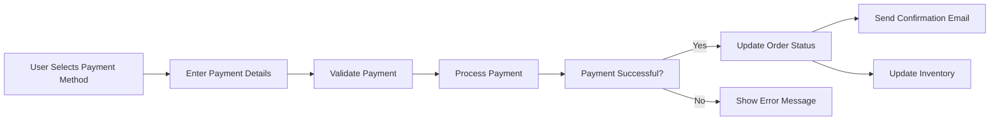
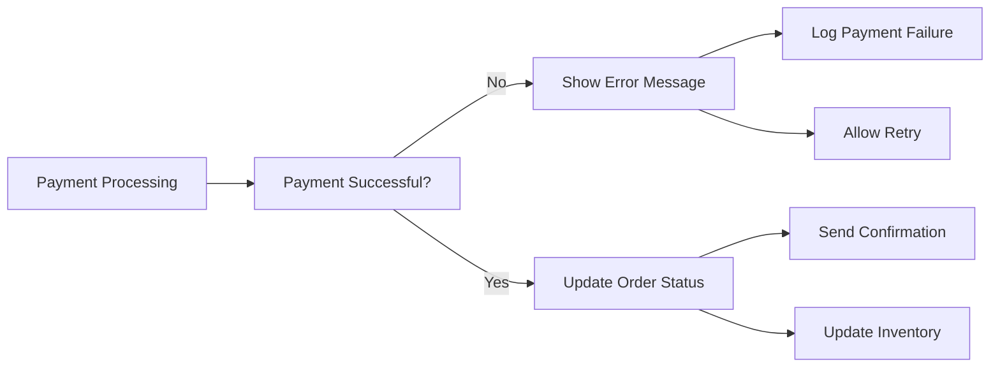

# Order Placement and Payment Processing Requirements

## 1. Introduction

### Purpose of the Document
This document defines the complete requirements for order placement and payment processing in the e-commerce shopping mall platform. It specifies the workflow from cart submission to order confirmation, including all payment methods, error handling, security requirements, and integration points.

### Scope
This document covers:
- Order placement workflow
- Payment processing with all supported methods
- Order confirmation and notifications
- Error handling and edge cases
- Security and compliance requirements
- Integration with external systems
- Performance expectations

## 2. Order Placement Workflow

### User Initiation

**EARS Format**:
- WHEN a user clicks "Place Order" from the cart, THE system SHALL validate the cart contents
- WHEN the cart is valid, THE system SHALL display the order summary page

### Cart Validation

**EARS Format**:
- THE system SHALL verify that all items in the cart are still available
- THE system SHALL check that quantities are within inventory limits
- THE system SHALL validate shipping and billing addresses

### Order Summary

**EARS Format**:
- THE order summary page SHALL display all items with quantities and prices
- THE order summary page SHALL show shipping and billing addresses
- THE order summary page SHALL display selected shipping method
- THE order summary page SHALL show order total with tax and shipping

### Order Submission

**EARS Format**:
- WHEN the user confirms the order, THE system SHALL create an order record
- THE system SHALL generate a unique order ID
- THE system SHALL transition the order to "Pending Payment" status

## 3. Payment Processing

### Supported Payment Methods

**EARS Format**:
- THE system SHALL support credit/debit card payments
- THE system SHALL support PayPal payments
- THE system SHALL support bank transfer payments
- THE system SHALL support digital wallet payments (Apple Pay, Google Pay)

### Payment Gateway Integration

**EARS Format**:
- THE system SHALL integrate with Stripe for credit card processing
- THE system SHALL integrate with PayPal API for PayPal payments
- THE system SHALL support manual verification for bank transfers

### Payment Validation

**EARS Format**:
- WHEN a payment is submitted, THE system SHALL validate payment details
- THE system SHALL check for sufficient funds
- THE system SHALL verify payment security (CVV, expiration, etc.)

### Payment Confirmation

**EARS Format**:
- WHEN payment is successful, THE system SHALL update order status to "Processing"
- THE system SHALL send order confirmation email to the user
- THE system SHALL update inventory levels

## 4. Order Confirmation

### Order Status Updates

**EARS Format**:
- WHEN payment is confirmed, THE system SHALL update order status to "Processing"
- THE system SHALL log the order confirmation timestamp
- THE system SHALL record payment transaction details

### User Notifications

**EARS Format**:
- THE system SHALL send order confirmation email with order details
- THE system SHALL send SMS notification for high-value orders
- THE system SHALL update the user's order history

### Inventory Updates

**EARS Format**:
- THE system SHALL deduct ordered quantities from inventory
- THE system SHALL update product availability status
- THE system SHALL trigger low stock alerts if needed

## 5. Error Handling and Edge Cases

### Payment Failures

**EARS Format**:
- WHEN payment fails, THE system SHALL display error message to user
- THE system SHALL log payment failure details
- THE system SHALL allow user to retry payment

### Inventory Shortages

**EARS Format**:
- WHEN inventory is insufficient, THE system SHALL prevent order submission
- THE system SHALL notify user of stock availability
- THE system SHALL suggest alternative products

### Order Cancellation

**EARS Format**:
- WHEN user cancels order before payment, THE system SHALL release inventory
- WHEN user cancels order after payment, THE system SHALL initiate refund process

## 6. Security and Compliance

### Payment Data Security

**EARS Format**:
- THE system SHALL encrypt all payment data in transit and at rest
- THE system SHALL comply with PCI DSS standards
- THE system SHALL use tokenization for payment data

### PCI Compliance

**EARS Format**:
- THE system SHALL never store full credit card numbers
- THE system SHALL use PCI-compliant payment gateways
- THE system SHALL undergo regular PCI compliance audits

### Fraud Detection

**EARS Format**:
- THE system SHALL implement fraud detection algorithms
- THE system SHALL flag suspicious transactions for review
- THE system SHALL use address verification (AVS) and CVV checks

## 7. Integration Requirements

### Third-party Payment Gateways

**EARS Format**:
- THE system SHALL integrate with Stripe API
- THE system SHALL integrate with PayPal API
- THE system SHALL support additional gateways as needed

### Shipping Carriers

**EARS Format**:
- THE system SHALL integrate with major shipping carriers (UPS, FedEx, DHL)
- THE system SHALL support real-time shipping rate calculation
- THE system SHALL provide tracking information

### Inventory Systems

**EARS Format**:
- THE system SHALL integrate with inventory management system
- THE system SHALL support real-time inventory updates
- THE system SHALL handle multi-warehouse inventory

## 8. Performance Requirements

### Response Times

**EARS Format**:
- THE order placement process SHALL complete within 5 seconds
- THE payment processing SHALL complete within 3 seconds
- THE order confirmation SHALL be sent within 1 minute

### Throughput

**EARS Format**:
- THE system SHALL handle 1000 orders per minute during peak times
- THE payment gateway SHALL support 500 transactions per second

### Scalability

**EARS Format**:
- THE system SHALL scale horizontally to handle increased load
- THE database SHALL support sharding for order data
- THE payment system SHALL handle distributed processing

## 9. Business Rules

### Order Validation

**EARS Format**:
- THE system SHALL validate that order total matches cart total
- THE system SHALL check that shipping address is complete
- THE system SHALL verify that payment method is supported

### Payment Authorization

**EARS Format**:
- THE system SHALL authorize payments before order confirmation
- THE system SHALL capture payments only after order fulfillment
- THE system SHALL handle partial authorizations for split shipments

### Inventory Management

**EARS Format**:
- THE system SHALL reserve inventory during order placement
- THE system SHALL release inventory if payment fails
- THE system SHALL update inventory across all channels

## 10. User Scenarios

### Successful Order Placement

**EARS Format**:
- WHEN a user places an order with valid payment, THE system SHALL confirm the order
- THE system SHALL send confirmation to the user
- THE system SHALL update inventory levels

### Failed Payment Recovery

**EARS Format**:
- WHEN payment fails, THE system SHALL allow user to retry
- THE system SHALL maintain cart contents during retry
- THE system SHALL provide alternative payment methods

### Order Cancellation

**EARS Format**:
- WHEN a user cancels an order, THE system SHALL update order status
- THE system SHALL process refund if payment was made
- THE system SHALL restore inventory levels

## 11. Related Documents

For complete understanding of the e-commerce platform, refer to:
- [User Authentication Requirements](./02-user-authentication.md)
- [Product Catalog Requirements](./03-product-catalog.md)
- [Shopping Cart Requirements](./04-shopping-cart.md)
- [Order Tracking Requirements](./06-order-tracking.md)

## 12. Conclusion

This document provides comprehensive requirements for order placement and payment processing in the e-commerce shopping mall platform. It covers all aspects from order initiation to confirmation, including payment methods, error handling, security, and integration requirements.

> *Developer Note: This document defines **business requirements only**. All technical implementations (architecture, APIs, database design, etc.) are at the discretion of the development team.*