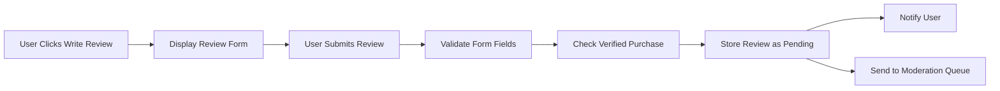
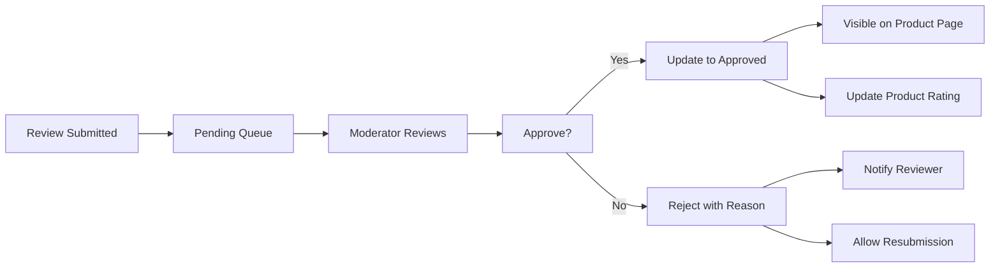
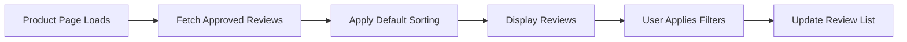
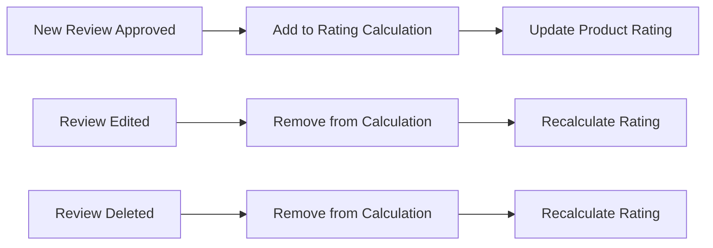
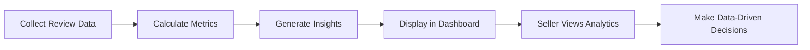

# Product Reviews and Ratings System Requirements

## Table of Contents
1. [Review Submission](#review-submission)
2. [Review Moderation](#review-moderation)
3. [Review Display](#review-display)
4. [Rating System](#rating-system)
5. [Review Analytics](#review-analytics)

## Review Submission

### User Interface for Submitting Reviews

**EARS Requirement**: 
WHEN a user views a product detail page, THE system SHALL display a "Write a Review" button if the user has purchased the product.

**EARS Requirement**: 
WHEN a user clicks the "Write a Review" button, THE system SHALL display a review submission form with the following fields:
- Rating (1-5 stars)
- Review title (optional)
- Review text (required, max 1000 characters)
- Photos (optional, max 5 images)
- Video (optional, max 1 minute)

### Required Fields and Validation

**EARS Requirement**: 
THE review submission form SHALL validate that:
- Rating is between 1 and 5 stars
- Review text is between 10 and 1000 characters
- Photos are in JPG/PNG format and under 5MB each
- Video is in MP4 format and under 50MB

**EARS Requirement**: 
WHEN a user submits a review, THE system SHALL check if the user has verified purchase of the product.

### Review Submission Process

**EARS Requirement**: 
WHEN a user submits a review, THE system SHALL:
1. Validate all form fields
2. Check for verified purchase
3. Store the review in "pending" status
4. Notify the user that their review is under moderation
5. Send the review to the moderation queue

## Review Moderation

### Moderation Workflow

**EARS Requirement**: 
THE review moderation system SHALL allow admin and seller users to:
- View pending reviews in a queue
- Approve or reject reviews
- Flag reviews for further investigation
- View review history and moderation actions

**EARS Requirement**: 
WHEN a moderator approves a review, THE system SHALL:
1. Update the review status to "approved"
2. Make the review visible on the product page
3. Update the product's average rating
4. Notify the reviewer that their review is now visible

**EARS Requirement**: 
WHEN a moderator rejects a review, THE system SHALL:
1. Update the review status to "rejected"
2. Notify the reviewer with the reason for rejection
3. Allow the reviewer to edit and resubmit the review

### Approval and Rejection Criteria

**EARS Requirement**: 
THE system SHALL automatically flag reviews that contain:
- Profanity or offensive language
- Personal information (emails, phone numbers)
- Suspicious patterns (same text submitted multiple times)

**EARS Requirement**: 
THE system SHALL provide moderators with guidelines for:
- Approving constructive criticism
- Rejecting off-topic or irrelevant reviews
- Handling reviews with mixed feedback

### Flagging and Reporting System

**EARS Requirement**: 
WHEN a user views a review, THE system SHALL display a "Report" button.

**EARS Requirement**: 
WHEN a user reports a review, THE system SHALL:
1. Collect the report reason
2. Flag the review for moderator attention
3. Notify moderators of the reported review

## Review Display

### Review Listing and Sorting

**EARS Requirement**: 
WHEN a user views a product page, THE system SHALL display approved reviews sorted by:
- Most helpful (default)
- Most recent
- Highest rating
- Lowest rating

**EARS Requirement**: 
THE system SHALL display the following for each review:
- User avatar and name
- Rating (stars)
- Review title
- Review text
- Photos/videos (if any)
- Date of review
- Verified purchase badge

### Review Filtering Options

**EARS Requirement**: 
THE system SHALL provide filtering options for reviews by:
- Rating (1-5 stars)
- Verified purchases only
- With photos/videos
- Most recent

**EARS Requirement**: 
WHEN a user applies filters, THE system SHALL update the review list in real-time.

### Review Display Format

**EARS Requirement**: 
THE system SHALL display reviews in a responsive format that includes:
- User information section (avatar, name, date)
- Rating display (stars)
- Review content (title, text)
- Media gallery (photos/videos)
- Helpfulness voting (thumbs up/down)
- Report button

## Rating System

### Rating Calculation Methodology

**EARS Requirement**: 
THE product rating SHALL be calculated as the average of all approved review ratings.

**EARS Requirement**: 
THE system SHALL update the product rating in real-time when:
- A new review is approved
- An existing review is edited and re-approved
- A review is deleted

**EARS Requirement**: 
THE system SHALL display the product rating with:
- Average star rating (to 1 decimal place)
- Total number of reviews
- Rating distribution (number of each star rating)

### Rating Display and Aggregation

**EARS Requirement**: 
WHEN a user views a product page, THE system SHALL display:
- The average product rating prominently
- The rating distribution chart
- The total review count

**EARS Requirement**: 
THE system SHALL allow users to filter products by rating range in search results.

### Rating Updates and Recalculations

**EARS Requirement**: 
WHEN a review is edited, THE system SHALL:
1. Place the review back in moderation queue
2. Temporarily exclude the review from rating calculation
3. Recalculate the product rating without the pending review

**EARS Requirement**: 
WHEN a review is deleted, THE system SHALL:
1. Remove the review from the database
2. Recalculate the product rating excluding the deleted review

## Review Analytics

### Review Metrics and Statistics

**EARS Requirement**: 
THE system SHALL track the following review metrics:
- Total number of reviews
- Average review rating
- Number of reviews by rating (1-5 stars)
- Number of reviews with photos/videos
- Number of verified purchase reviews

**EARS Requirement**: 
THE system SHALL provide sellers with analytics on their product reviews including:
- Review count over time
- Average rating trends
- Most common keywords in reviews
- Review sentiment analysis

### Review Trends and Insights

**EARS Requirement**: 
THE system SHALL generate insights such as:
- Most reviewed products
- Highest rated products
- Lowest rated products
- Products with most improved ratings
- Products with declining ratings

**EARS Requirement**: 
THE system SHALL allow sellers to compare their review performance against category averages.

### Review Performance Indicators

**EARS Requirement**: 
THE system SHALL calculate the following performance indicators:
- Review response rate (reviews per sale)
- Review approval rate
- Average time to moderation
- Review helpfulness score (upvotes/downvotes)

**EARS Requirement**: 
THE system SHALL display review performance indicators in the seller dashboard.

## Integration Requirements

**EARS Requirement**: 
THE review system SHALL integrate with:
- User authentication system for verified purchases
- Product catalog for review association
- Order history for purchase verification
- Notification system for review status updates

**EARS Requirement**: 
THE review system SHALL support localization for:
- Review submission in multiple languages
- Review display in user's preferred language
- Moderation interface in admin's language

## Performance Requirements

**EARS Requirement**: 
THE review system SHALL:
- Load reviews within 2 seconds on product pages
- Support up to 10,000 reviews per product
- Handle 100 concurrent review submissions
- Update ratings in real-time (within 1 second of approval)

## Security Requirements

**EARS Requirement**: 
THE review system SHALL:
- Prevent duplicate reviews from the same user for the same product
- Sanitize review text to prevent XSS attacks
- Validate all uploaded media for malicious content
- Require authentication for all review actions

## Accessibility Requirements

**EARS Requirement**: 
THE review system SHALL:
- Support screen readers for review submission and display
- Provide keyboard navigation for all review features
- Ensure color contrast meets WCAG standards for review components

## Future Considerations

**EARS Requirement**: 
THE system SHOULD support:
- AI-powered review summarization
- Automated sentiment analysis
- Review translation between languages
- Enhanced media support (360° images, AR previews)

## Developer Note

> *Developer Note: This document defines **business requirements only**. All technical implementations (architecture, APIs, database design, etc.) are at the discretion of the development team.*

## Related Documents

For complete understanding of the e-commerce platform, refer to:
- [Service Overview](./00-toc.md)
- [User Authentication](./02-user-authentication.md)
- [Product Catalog](./03-product-catalog.md)
- [Shopping Cart](./04-shopping-cart.md)
- [Order Placement](./05-order-placement.md)
- [Order Tracking](./06-order-tracking.md)
- [Seller Accounts](./08-seller-accounts.md)
- [Admin Dashboard](./09-admin-dashboard.md)

## Conclusion

This document provides comprehensive requirements for the product reviews and ratings system. It covers the complete review lifecycle from submission to display, including moderation, rating calculation, and analytics. Developers should use this as the primary reference for implementing the review system, ensuring all business requirements are met while maintaining flexibility in technical implementation.