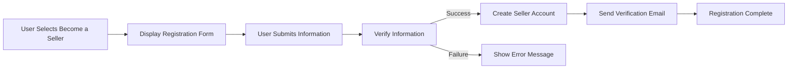
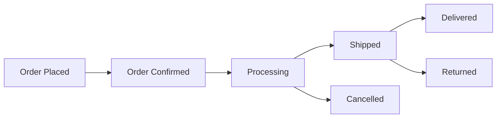

# Seller Accounts Requirements Specification

## 1. Introduction

### Purpose
This document specifies the complete requirements for seller accounts in the e-commerce shopping mall platform. It defines how sellers register, manage products, process orders, track inventory, and access analytics.

### Scope
This document covers all aspects of seller account functionality, including:
- Seller registration and verification
- Product management capabilities
- Order processing and fulfillment
- Inventory tracking and management
- Analytics and reporting features
- Security and access control measures

### Definitions
- **Seller**: A user who registers to sell products on the platform
- **SKU**: Stock Keeping Unit - a unique identifier for each product variant
- **Inventory**: The stock of products available for sale
- **Order Fulfillment**: The process of preparing and shipping orders to customers

## 2. Seller Registration

### Registration Process

**EARS Format**: WHEN a user selects "Become a Seller", THE system SHALL display the seller registration form.

**Required Information**:
- Business name
- Contact email
- Phone number
- Business address
- Tax identification number
- Bank account information for payments

**Verification Process**:
- Email verification
- Phone number verification
- Business license validation (if applicable)

**EARS Format**: WHEN a seller submits registration, THE system SHALL verify all provided information and create a seller account IF all validations pass.

### Registration Workflow

## 3. Product Management

### Product Creation

**EARS Format**: WHEN a seller selects "Add New Product", THE system SHALL display the product creation form.

**Required Product Information**:
- Product name
- Product description
- Category selection
- Price
- Product images (minimum 3)
- Product variants (color, size, material)
- Initial inventory quantity

**EARS Format**: WHEN a seller submits a new product, THE system SHALL validate all information and create the product listing IF all validations pass.

### Product Editing

**EARS Format**: WHEN a seller selects "Edit Product", THE system SHALL display the product editing form with current product information.

**EARS Format**: WHEN a seller submits product edits, THE system SHALL update the product listing with the new information.

### Product Deletion

**EARS Format**: WHEN a seller selects "Delete Product", THE system SHALL prompt for confirmation and delete the product IF confirmed.

### Product Variants Management

**EARS Format**: WHEN a seller manages product variants, THE system SHALL allow adding, editing, and deleting of variants with separate SKU tracking.

### Inventory Tracking

**EARS Format**: THE system SHALL track inventory levels for each product variant separately.

**EARS Format**: WHEN inventory reaches the low stock threshold, THE system SHALL notify the seller.

## 4. Order Management

### Order Processing

**EARS Format**: WHEN a new order is placed for a seller's product, THE system SHALL notify the seller and display the order in their dashboard.

**Order Status Workflow**:

### Order Fulfillment

**EARS Format**: WHEN a seller marks an order as "Shipped", THE system SHALL update the order status and notify the customer.

**EARS Format**: THE system SHALL provide shipping label generation and carrier integration options.

### Order History

**EARS Format**: THE system SHALL maintain a complete history of all orders for each seller.

**EARS Format**: WHEN a seller views order history, THE system SHALL display all past orders with current status.

### Return and Refund Management

**EARS Format**: WHEN a customer requests a return, THE system SHALL notify the seller and create a return request in the seller dashboard.

**EARS Format**: WHEN a seller processes a return, THE system SHALL update the order status and initiate the refund process.

## 5. Inventory Management

### Stock Level Tracking

**EARS Format**: THE system SHALL track inventory levels in real-time for each product variant.

**EARS Format**: WHEN a product is sold, THE system SHALL decrement the inventory count for the specific variant.

### Low Stock Alerts

**EARS Format**: WHEN inventory reaches the low stock threshold (configurable per seller), THE system SHALL send a notification to the seller.

**EARS Format**: THE system SHALL allow sellers to set custom low stock thresholds for each product.

### Inventory Adjustments

**EARS Format**: WHEN a seller adjusts inventory levels, THE system SHALL update the inventory count and log the adjustment.

**EARS Format**: THE system SHALL support bulk inventory updates via CSV upload.

## 6. Seller Analytics

### Sales Performance

**EARS Format**: THE system SHALL provide sellers with sales performance reports including:
- Total sales
- Sales by product
- Sales by time period
- Average order value

### Product Performance

**EARS Format**: THE system SHALL provide product performance analytics including:
- Best-selling products
- Low-performing products
- Product views vs. sales conversion
- Customer reviews and ratings

### Customer Insights

**EARS Format**: THE system SHALL provide customer insights including:
- Repeat customer rate
- Customer demographics
- Customer purchase history

### Financial Reports

**EARS Format**: THE system SHALL generate financial reports including:
- Total revenue
- Revenue by product category
- Payout history
- Tax calculations

## 7. Security and Access Control

### Authentication

**EARS Format**: THE system SHALL require secure authentication for all seller account access.

**EARS Format**: THE system SHALL support two-factor authentication for seller accounts.

### Authorization

**EARS Format**: THE system SHALL implement role-based access control for seller functionalities.

**EARS Format**: THE system SHALL restrict access to seller-specific data and operations.

### Data Protection

**EARS Format**: THE system SHALL encrypt all sensitive seller data at rest and in transit.

**EARS Format**: THE system SHALL comply with data protection regulations (GDPR, CCPA, etc.).

## 8. Integration Requirements

### Payment Gateway Integration

**EARS Format**: THE system SHALL integrate with multiple payment gateways for order processing.

**EARS Format**: THE system SHALL support automatic payouts to seller bank accounts.

### Shipping Carrier Integration

**EARS Format**: THE system SHALL integrate with major shipping carriers for label generation and tracking.

**EARS Format**: THE system SHALL provide real-time shipping rates calculation.

### Third-Party Services

**EARS Format**: THE system SHALL support integration with accounting software for financial management.

**EARS Format**: THE system SHALL support integration with marketing platforms for product promotion.

## 9. Error Handling and Notifications

### Common Error Scenarios

**EARS Format**: WHEN a seller encounters an error during product creation, THE system SHALL display a clear error message and preserve entered data.

**EARS Format**: WHEN inventory levels are insufficient for an order, THE system SHALL notify both seller and customer.

### Notification System

**EARS Format**: THE system SHALL provide real-time notifications for:
- New orders
- Low inventory alerts
- Return requests
- Payment processing status

**EARS Format**: THE system SHALL support multiple notification channels (email, SMS, in-app).

### User Support

**EARS Format**: THE system SHALL provide sellers with access to customer support for technical issues.

**EARS Format**: THE system SHALL maintain a knowledge base of common issues and solutions.

## Related Documents

For more information on user authentication, refer to the [User Authentication Requirements](./02-user-authentication.md).

For product catalog management, see the [Product Catalog Requirements](./03-product-catalog.md).

Order placement and tracking details can be found in the [Order Placement Requirements](./05-order-placement.md) and [Order Tracking Requirements](./06-order-tracking.md).

Admin dashboard functionality is described in the [Admin Dashboard Requirements](./09-admin-dashboard.md).

## Conclusion

This document provides a comprehensive specification of all seller account functionality for the e-commerce shopping mall platform. It serves as the foundation for backend development, ensuring all seller-related features are properly implemented to support a robust and scalable e-commerce ecosystem.