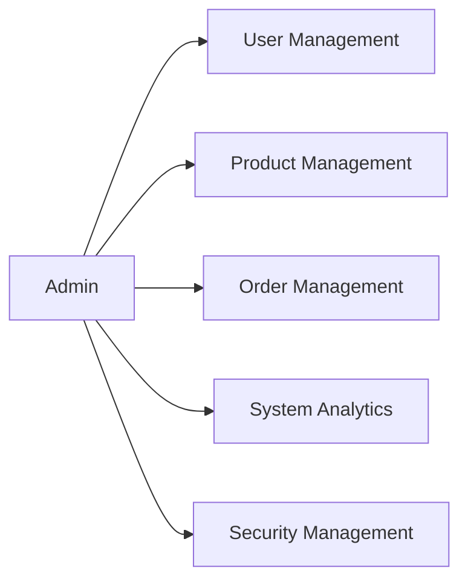
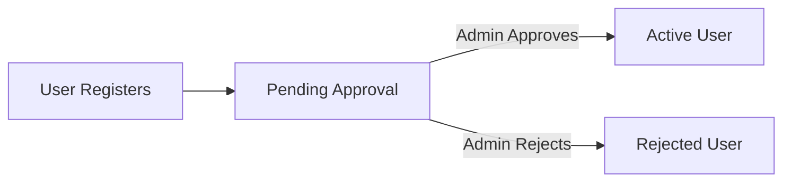
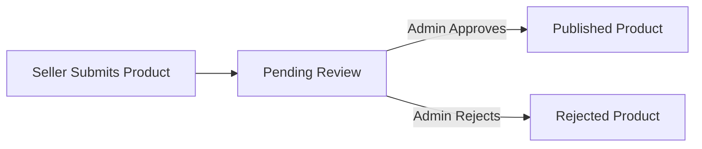
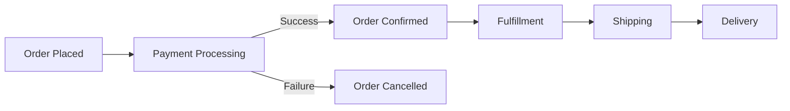

# Admin Dashboard Requirements Analysis

## 1. Introduction

### 1.1 Document Purpose
This document defines the comprehensive requirements for the admin dashboard of the shopping mall e-commerce platform. The admin dashboard serves as the central control panel for platform administrators to manage users, products, orders, and system performance.

### 1.2 Scope
This document covers all functional and non-functional requirements for the admin dashboard, including:
- User management and permissions
- Product catalog oversight
- Order processing and tracking
- System analytics and monitoring
- Security and compliance measures

### 1.3 Target Audience
- Backend developers implementing admin features
- System architects designing the platform
- Project managers overseeing development
- QA engineers testing admin functionality

## 2. User Management

### 2.1 User Roles and Permissions

#### 2.1.1 Admin Role Definition

#### 2.1.2 Permission Matrix

| Action | Admin | Seller | Customer |
|--------|-------|--------|-----------|
| Manage Users | ✅ | ❌ | ❌ |
| Manage Products | ✅ | ✅ (own) | ❌ |
| Manage Orders | ✅ | ✅ (own) | ✅ (own) |
| View Analytics | ✅ | ✅ (limited) | ❌ |
| System Settings | ✅ | ❌ | ❌ |

### 2.2 User Account Management

#### 2.2.1 User Registration Approval

#### 2.2.2 User Profile Management
- **THE system SHALL allow admins to view and edit user profiles**
- **THE system SHALL enable admins to suspend or deactivate user accounts**
- **THE system SHALL provide search functionality for user accounts**

### 2.3 User Activity Monitoring
- **THE system SHALL log all user actions for audit purposes**
- **THE system SHALL provide activity reports for user accounts**
- **THE system SHALL alert admins of suspicious user activity**

## 3. Product Management

### 3.1 Product Catalog Management

#### 3.1.1 Product Approval Workflow

#### 3.1.2 Product Editing and Deletion
- **THE system SHALL allow admins to edit any product details**
- **THE system SHALL enable admins to delete products from the catalog**
- **THE system SHALL maintain version history of product changes**

### 3.2 Product Moderation
- **THE system SHALL flag inappropriate product content**
- **THE system SHALL allow admins to review flagged products**
- **THE system SHALL provide bulk moderation tools**

### 3.3 Inventory Oversight
- **THE system SHALL display inventory levels across all products**
- **THE system SHALL alert admins of low stock items**
- **THE system SHALL provide inventory adjustment tools**

## 4. Order Management

### 4.1 Order Processing Workflow

### 4.2 Order Status Tracking
- **THE system SHALL display real-time order status updates**
- **THE system SHALL allow admins to update order status manually**
- **THE system SHALL provide order search and filtering**

### 4.3 Order Analytics
- **THE system SHALL generate order volume reports**
- **THE system SHALL track order fulfillment metrics**
- **THE system SHALL analyze order cancellation reasons**

## 5. System Analytics

### 5.1 Sales Performance Metrics
- **THE system SHALL display daily/weekly/monthly sales data**
- **THE system SHALL track revenue by product category**
- **THE system SHALL monitor sales trends over time**

### 5.2 User Engagement Analytics
- **THE system SHALL track user registration and retention rates**
- **THE system SHALL monitor user activity and engagement**
- **THE system SHALL analyze user purchase patterns**

### 5.3 System Health Monitoring
- **THE system SHALL monitor server performance metrics**
- **THE system SHALL track system uptime and availability**
- **THE system SHALL alert admins of system anomalies**

## 6. Admin Security

### 6.1 Access Control
- **THE system SHALL implement role-based access control**
- **THE system SHALL require multi-factor authentication for admins**
- **THE system SHALL log all admin actions for audit**

### 6.2 Data Protection
- **THE system SHALL encrypt sensitive user data**
- **THE system SHALL implement data backup procedures**
- **THE system SHALL comply with data protection regulations**

### 6.3 Audit Logging
- **THE system SHALL maintain comprehensive audit logs**
- **THE system SHALL provide audit log search functionality**
- **THE system SHALL generate audit reports**

## 7. Integration and Extensibility

### 7.1 Third-Party Integrations
- **THE system SHALL support payment gateway integrations**
- **THE system SHALL enable shipping carrier integrations**
- **THE system SHALL provide marketing tool integrations**

### 7.2 API Access Management
- **THE system SHALL provide secure API endpoints for integrations**
- **THE system SHALL implement API rate limiting**
- **THE system SHALL monitor API usage and performance**

### 7.3 Plugin/Module Support
- **THE system SHALL support plugin architecture for extensions**
- **THE system SHALL provide module installation and management**
- **THE system SHALL ensure plugin compatibility and security**

## 8. Error Handling and Recovery

### 8.1 Common Error Scenarios
- **WHEN a product approval fails, THE system SHALL notify the admin with error details**
- **WHEN an order processing error occurs, THE system SHALL log the error and alert admins**
- **WHEN user data cannot be loaded, THE system SHALL display appropriate error messages**

### 8.2 Recovery Procedures
- **THE system SHALL provide data recovery tools for accidental deletions**
- **THE system SHALL implement transaction rollback for failed operations**
- **THE system SHALL maintain backup and restore functionality**

## 9. Performance Requirements

### 9.1 Dashboard Responsiveness
- **THE system SHALL load dashboard metrics within 2 seconds**
- **THE system SHALL update real-time data within 5 seconds**
- **THE system SHALL support concurrent admin users without performance degradation**

### 9.2 Data Processing
- **THE system SHALL process bulk operations efficiently**
- **THE system SHALL handle large datasets without performance issues**
- **THE system SHALL optimize database queries for admin operations**

## 10. Business Rules and Constraints

### 10.1 User Management Rules
- **THE system SHALL prevent admin accounts from being deleted by non-admins**
- **THE system SHALL require admin approval for seller account creation**
- **THE system SHALL limit admin accounts to authorized personnel only**

### 10.2 Product Management Rules
- **THE system SHALL enforce product quality standards**
- **THE system SHALL prevent duplicate product listings**
- **THE system SHALL require complete product information for approval**

### 10.3 Order Management Rules
- **THE system SHALL prevent order modification after shipment**
- **THE system SHALL enforce order cancellation policies**
- **THE system SHALL require admin approval for large order refunds**

## 11. Future Considerations

### 11.1 Scalability
- **THE system SHALL support horizontal scaling for admin operations**
- **THE system SHALL handle increased data volume efficiently**
- **THE system SHALL maintain performance with growing user base**

### 11.2 Internationalization
- **THE system SHALL support multiple languages for admin interface**
- **THE system SHALL handle currency conversions for international sales**
- **THE system SHALL comply with international data regulations**

### 11.3 Advanced Analytics
- **THE system SHALL integrate machine learning for predictive analytics**
- **THE system SHALL provide AI-driven insights for business decisions**
- **THE system SHALL support custom report generation**

## 12. Conclusion

This document provides a comprehensive analysis of the admin dashboard requirements for the shopping mall e-commerce platform. The admin dashboard is critical for platform management, user oversight, and system monitoring. By implementing these requirements, the platform will provide administrators with the tools needed to effectively manage the e-commerce ecosystem.

## 13. References

- [User Authentication Requirements](./02-user-authentication.md)
- [Product Catalog Requirements](./03-product-catalog.md)
- [Order Placement Requirements](./05-order-placement.md)
- [Technical Requirements](./11-technical-requirements.md)

> *Developer Note: This document defines **business requirements only**. All technical implementations (architecture, APIs, database design, etc.) are at the discretion of the development team.*