# User Flow Diagram for E-Commerce Shopping Mall Platform

## Introduction

### Purpose of the User Flow Diagram
This document provides a comprehensive visual representation of how users interact with the e-commerce shopping mall platform. The user flow diagrams illustrate the complete journey of different user types (customers, sellers, admins) as they navigate through the platform's features.

### Importance of User Flow in E-commerce
User flow diagrams are critical for:
- Understanding user behavior and expectations
- Identifying key interaction points
- Designing intuitive navigation
- Ensuring all user scenarios are covered
- Guiding development and testing efforts

## User Registration Flow

### New User Registration

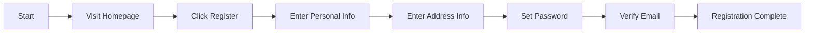

### Existing User Login

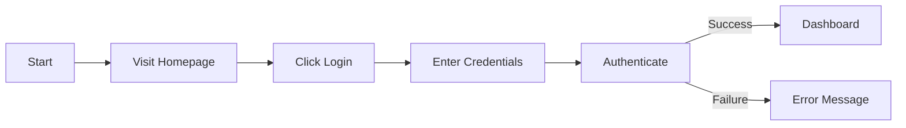

### Account Management

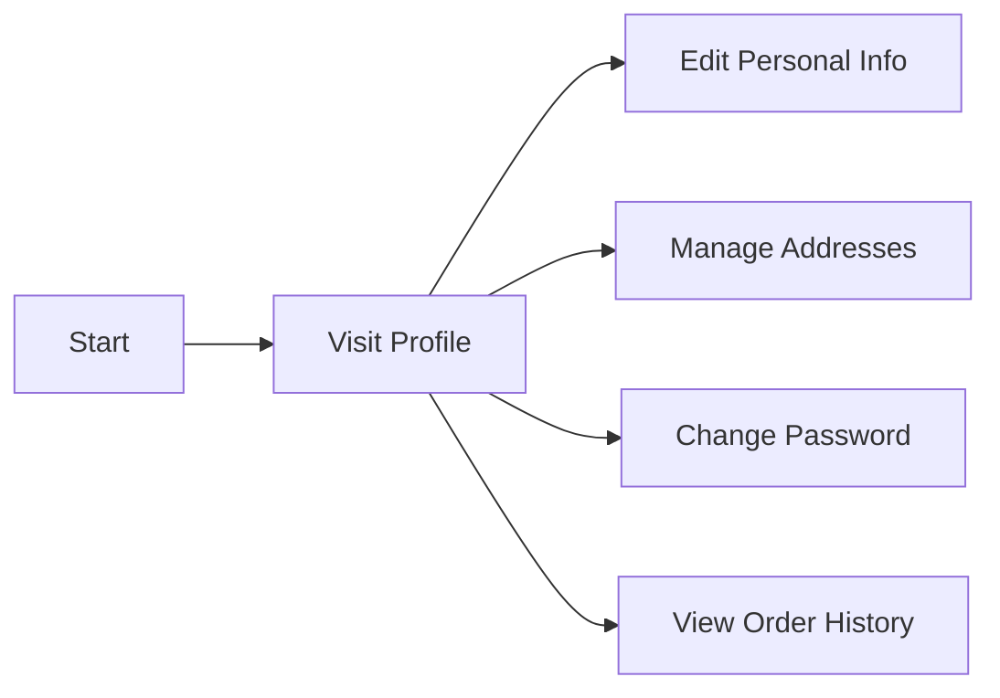

## Product Browsing Flow

### Homepage Navigation

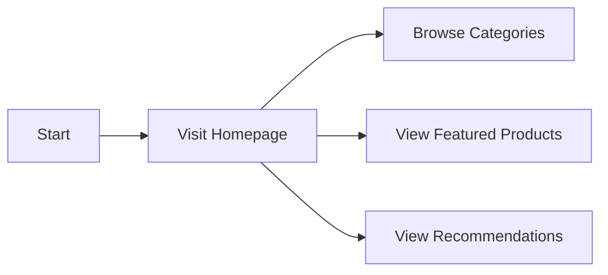

### Category Browsing

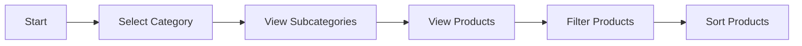

### Product Search

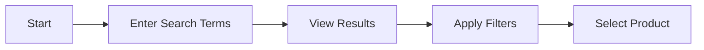

### Product Detail View

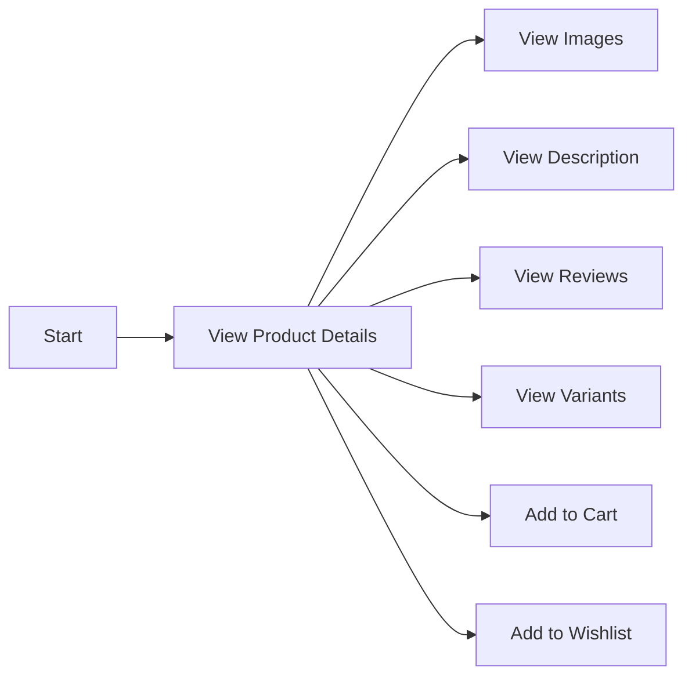

## Order Placement Flow

### Adding Items to Cart

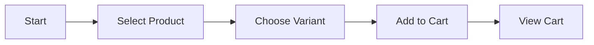

### Cart Management

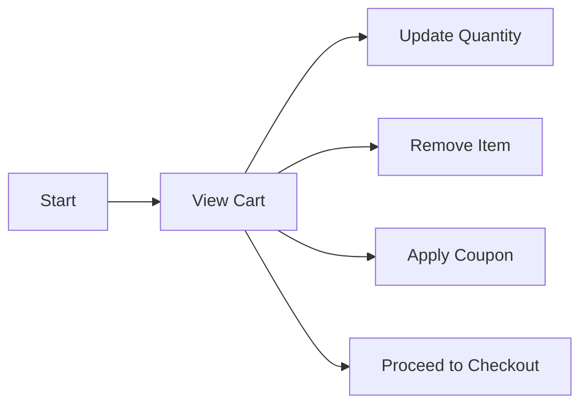

### Checkout Process

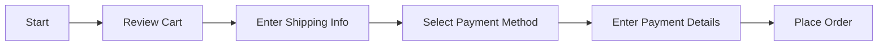

### Payment Processing

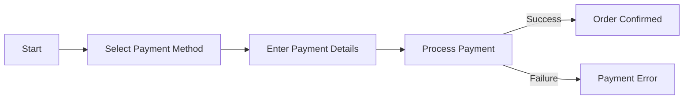

### Order Confirmation

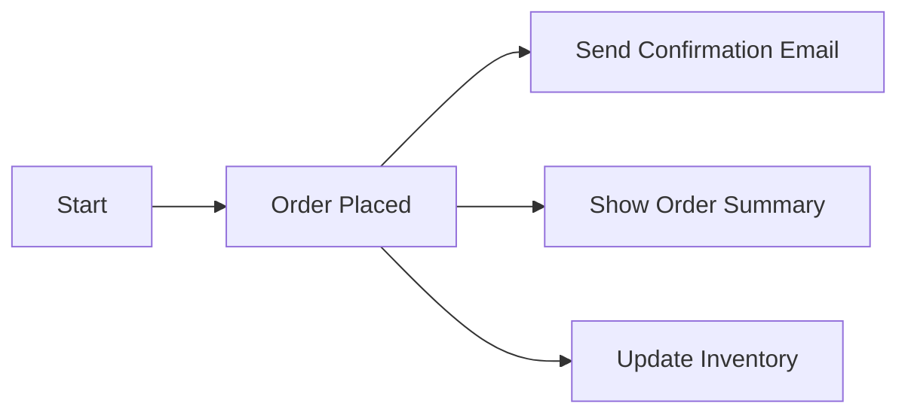

## Order Tracking Flow

### Order History View

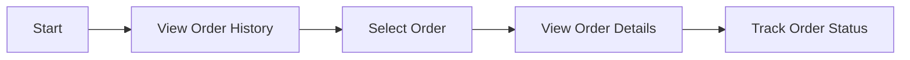

### Order Status Tracking

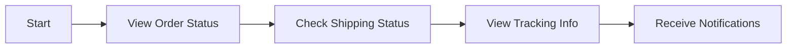

### Shipping Information

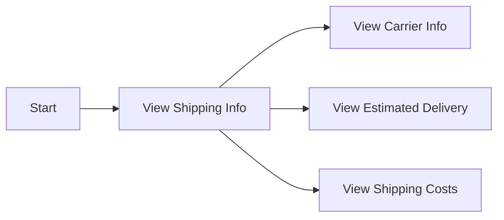

### Return/Refund Process

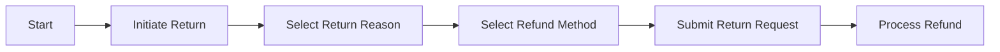

## Review Submission Flow

### Product Review Submission

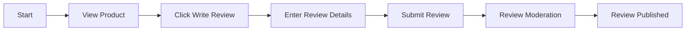

### Review Moderation

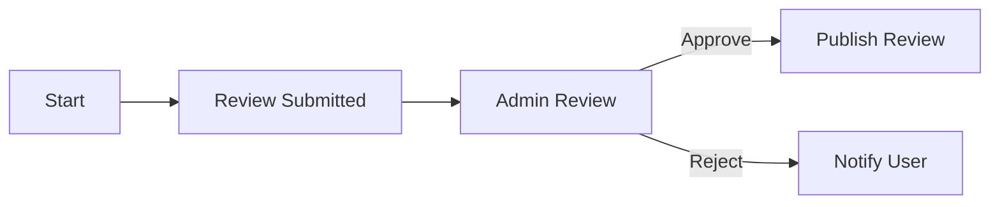

### Review Display

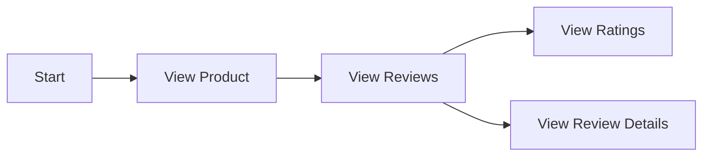

## Seller Account Flow

### Seller Registration

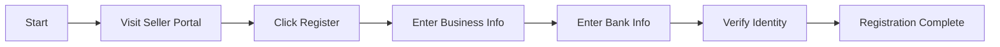

### Product Management

```mermaid
graph LR
    A["Start"] --> B["Visit Seller Dashboard"]
    B --> C["Add Product"]
    B --> D["Edit Product"]
    B --> E["Delete Product"]
    B --> F["Manage Inventory"]
```

### Order Management

```mermaid
graph LR
    A["Start"] --> B["View Orders"]
    B --> C["View Order Details"]
    B --> D["Update Order Status"]
    B --> E["Process Refunds"]
```

### Inventory Management

```mermaid
graph LR
    A["Start"] --> B["View Inventory"]
    B --> C["Update Stock Levels"]
    B --> D["Set Low Stock Alerts"]
    B --> E["View Inventory Reports"]
```

## Admin Dashboard Flow

### User Management

```mermaid
graph LR
    A["Start"] --> B["Visit Admin Dashboard"]
    B --> C["View Users"]
    B --> D["Edit User Info"]
    B --> E["Suspend User"]
    B --> F["View User Activity"]
```

### Product Management

```mermaid
graph LR
    A["Start"] --> B["View Products"]
    B --> C["Edit Product Info"]
    B --> D["Remove Product"]
    B --> E["View Product Analytics"]
```

### Order Management

```mermaid
graph LR
    A["Start"] --> B["View Orders"]
    B --> C["View Order Details"]
    B --> D["Update Order Status"]
    B --> E["Process Refunds"]
```

### System Analytics

```mermaid
graph LR
    A["Start"] --> B["View Dashboard"]
    B --> C["View Sales Reports"]
    B --> D["View User Growth"]
    B --> E["View Inventory Levels"]
    B --> F["View System Health"]
```

## Conclusion

This user flow diagram provides a comprehensive overview of all user interactions with the e-commerce shopping mall platform. Each flow is designed to ensure a seamless user experience, covering all key functionalities from registration to order management.

The diagrams use Mermaid syntax for clear visualization and follow proper syntax rules with double quotes for all labels. This document serves as a critical reference for backend developers, UI/UX designers, and quality assurance teams to ensure all user scenarios are properly implemented and tested.

> *Developer Note: This document defines **business requirements only**. All technical implementations (architecture, APIs, database design, etc.) are at the discretion of the development team.*