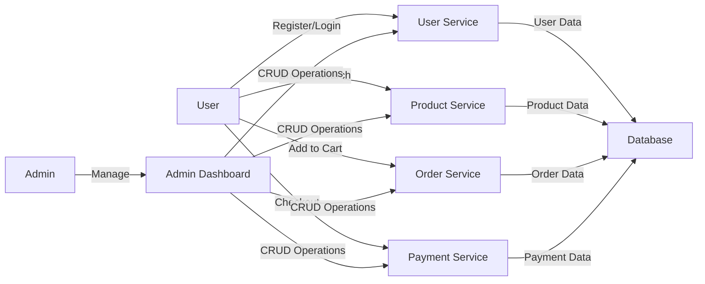

# Technical Requirements Analysis Report

## 1. System Architecture

### Overview
The e-commerce shopping mall platform will be designed as a scalable, secure, and high-performance system to support a wide range of features including user registration, product catalog management, order processing, and payment handling.

### Architecture Approach
- **Microservices Architecture**: The system will be built using a microservices approach to ensure scalability, maintainability, and flexibility. Each core function (user management, product catalog, order processing, etc.) will be a separate service.
- **API Gateway**: A central API gateway will manage all incoming requests, providing a single entry point for clients and handling authentication, authorization, and rate limiting.
- **Service Communication**: Services will communicate using RESTful APIs and asynchronous messaging (e.g., Kafka) for event-driven interactions.

### Key Components
- **User Service**: Handles user registration, authentication, and profile management.
- **Product Service**: Manages product catalog, categories, and inventory.
- **Order Service**: Processes orders, manages shopping carts, and handles order tracking.
- **Payment Service**: Integrates with payment gateways and processes transactions.
- **Notification Service**: Sends emails, SMS, and push notifications for order updates.
- **Admin Dashboard**: Provides administrative tools for managing users, products, and orders.

### Data Flow Diagram

## 2. Performance Requirements

### Response Time Expectations
- **Page Load Time**: All pages should load within 2 seconds under normal conditions.
- **API Response Time**: API endpoints should respond within 500ms for 95% of requests.
- **Search Results**: Product search results should be displayed within 1 second.

### Throughput Requirements
- **Concurrent Users**: The system should support at least 10,000 concurrent users.
- **Requests Per Second**: The system should handle at least 1,000 requests per second during peak times.

### Load Handling Capabilities
- **Peak Load**: The system should maintain performance during peak load times (e.g., Black Friday sales).
- **Graceful Degradation**: The system should degrade gracefully under extreme load, prioritizing critical functions.

### Caching Strategies
- **Content Delivery Network (CDN)**: Use CDN for static assets (images, CSS, JavaScript).
- **API Caching**: Implement caching for frequently accessed API endpoints.
- **Database Caching**: Use in-memory caching (e.g., Redis) for database queries.

### Performance Testing Approach
- **Load Testing**: Regular load testing to simulate peak traffic.
- **Stress Testing**: Stress testing to identify breaking points.
- **Monitoring**: Continuous performance monitoring and alerting.

## 3. Security Requirements

### Authentication and Authorization
- **User Authentication**: Implement secure user authentication using JWT (JSON Web Tokens).
- **Role-Based Access Control (RBAC)**: Define roles (customer, seller, admin) with specific permissions.
- **Multi-Factor Authentication (MFA)**: Optional MFA for enhanced security.

### Data Encryption
- **Data in Transit**: Use HTTPS for all data transmission.
- **Data at Rest**: Encrypt sensitive data (e.g., payment information) in the database.

### Secure Payment Processing
- **PCI Compliance**: Ensure compliance with Payment Card Industry (PCI) standards.
- **Tokenization**: Use tokenization for payment data to avoid storing sensitive information.

### Vulnerability Management
- **Regular Audits**: Conduct regular security audits and penetration testing.
- **Patch Management**: Implement a patch management system for dependencies.

### Compliance Requirements
- **GDPR Compliance**: Ensure compliance with General Data Protection Regulation (GDPR).
- **CCPA Compliance**: Ensure compliance with California Consumer Privacy Act (CCPA).

## 4. Scalability Requirements

### Horizontal vs. Vertical Scaling
- **Horizontal Scaling**: Prefer horizontal scaling (adding more servers) over vertical scaling (upgrading existing servers).
- **Auto-Scaling**: Implement auto-scaling policies to handle varying loads.

### Database Scaling Strategies
- **Database Sharding**: Implement database sharding for large datasets.
- **Read Replicas**: Use read replicas to offload read operations from the primary database.

### Load Balancing
- **Load Balancer**: Use a load balancer to distribute traffic evenly across servers.
- **Health Checks**: Implement health checks to ensure traffic is only routed to healthy instances.

### Auto-Scaling Policies
- **Thresholds**: Define auto-scaling thresholds based on CPU, memory, and request rates.
- **Cool-Down Periods**: Implement cool-down periods to prevent rapid scaling.

### Performance Monitoring
- **Real-Time Monitoring**: Implement real-time performance monitoring.
- **Alerting**: Set up alerting for performance degradation.

## 5. Integration Requirements

### Third-Party Service Integrations
- **Payment Gateways**: Integrate with multiple payment gateways (e.g., Stripe, PayPal).
- **Shipping Carriers**: Integrate with shipping carriers for real-time tracking.
- **Email Services**: Integrate with email services for notifications.

### API Design Principles
- **RESTful APIs**: Design RESTful APIs for all services.
- **Versioning**: Implement API versioning to ensure backward compatibility.
- **Documentation**: Provide comprehensive API documentation.

### Payment Gateway Integration
- **Multiple Gateways**: Support multiple payment gateways.
- **Secure Transactions**: Ensure secure transactions with encryption and tokenization.

### Shipping Carrier Integration
- **Real-Time Tracking**: Provide real-time tracking information.
- **Shipping Rates**: Calculate shipping rates based on carrier APIs.

### Analytics and Reporting Tools
- **User Analytics**: Implement user analytics to track behavior and preferences.
- **Sales Analytics**: Implement sales analytics to track revenue and performance.

## 6. Technology Stack

### Frontend Technologies
- **React.js**: Use React.js for building the user interface.
- **Redux**: Use Redux for state management.
- **Material-UI**: Use Material-UI for UI components.

### Backend Technologies
- **Node.js**: Use Node.js for the backend server.
- **Express.js**: Use Express.js for building RESTful APIs.
- **GraphQL**: Consider GraphQL for efficient data fetching.

### Database Technologies
- **MongoDB**: Use MongoDB for the primary database.
- **Redis**: Use Redis for caching.

### DevOps and Infrastructure
- **Docker**: Use Docker for containerization.
- **Kubernetes**: Use Kubernetes for orchestration.
- **AWS**: Use AWS for cloud infrastructure.

## 7. Deployment and Maintenance

### Deployment Strategy
- **CI/CD Pipeline**: Implement a CI/CD pipeline for automated deployment.
- **Blue-Green Deployment**: Use blue-green deployment for zero-downtime updates.

### Continuous Integration/Continuous Deployment (CI/CD)
- **Automated Testing**: Implement automated testing for all deployments.
- **Rollback Mechanism**: Implement a rollback mechanism for failed deployments.

### Monitoring and Logging
- **Centralized Logging**: Implement centralized logging for all services.
- **Monitoring Tools**: Use monitoring tools (e.g., Prometheus, Grafana) for performance tracking.

### Backup and Disaster Recovery
- **Regular Backups**: Implement regular backups for all data.
- **Disaster Recovery Plan**: Develop a disaster recovery plan.

## 8. Compliance and Legal

### Data Privacy Regulations
- **GDPR Compliance**: Ensure compliance with GDPR.
- **CCPA Compliance**: Ensure compliance with CCPA.

### Payment Card Industry (PCI) Compliance
- **PCI Standards**: Ensure compliance with PCI standards for payment processing.

### Accessibility Standards
- **WCAG Compliance**: Ensure compliance with Web Content Accessibility Guidelines (WCAG).

### Terms of Service and Privacy Policy
- **Legal Documents**: Provide clear terms of service and privacy policy.

## 9. Future Considerations

### Internationalization and Localization
- **Multi-Language Support**: Implement support for multiple languages.
- **Currency Conversion**: Implement currency conversion for international users.

### Mobile Application Support
- **Responsive Design**: Ensure the platform is responsive for mobile devices.
- **Mobile App**: Consider developing a mobile app for iOS and Android.

### Voice and AI Integration
- **Voice Search**: Implement voice search for product discovery.
- **AI Recommendations**: Implement AI-driven product recommendations.

### Augmented Reality (AR) for Product Visualization
- **AR Integration**: Consider AR integration for product visualization.

## Conclusion

This technical requirements analysis report outlines the key architectural, performance, security, scalability, and integration requirements for the e-commerce shopping mall platform. By adhering to these requirements, the development team can build a robust, scalable, and secure platform that meets the needs of customers, sellers, and administrators.

## Next Steps

1. **Review and Approval**: Review the technical requirements with stakeholders and obtain approval.
2. **Detailed Design**: Proceed with detailed system design based on these requirements.
3. **Implementation**: Begin implementation of the system architecture and components.
4. **Testing**: Conduct thorough testing to ensure all requirements are met.
5. **Deployment**: Deploy the system and monitor performance.

## References

- [Service Overview Document](./00-toc.md)
- [Business Model Document](./01-business-model.md)
- [User Authentication Document](./02-user-authentication.md)
- [Product Catalog Document](./03-product-catalog.md)
- [Shopping Cart Document](./04-shopping-cart.md)
- [Order Placement Document](./05-order-placement.md)
- [Order Tracking Document](./06-order-tracking.md)
- [Product Reviews Document](./07-product-reviews.md)
- [Seller Accounts Document](./08-seller-accounts.md)
- [Admin Dashboard Document](./09-admin-dashboard.md)
- [User Flow Document](./10-user-flow.md)

## Developer Note

> *Developer Note: This document defines **business requirements only**. All technical implementations (architecture, APIs, database design, etc.) are at the discretion of the development team.*