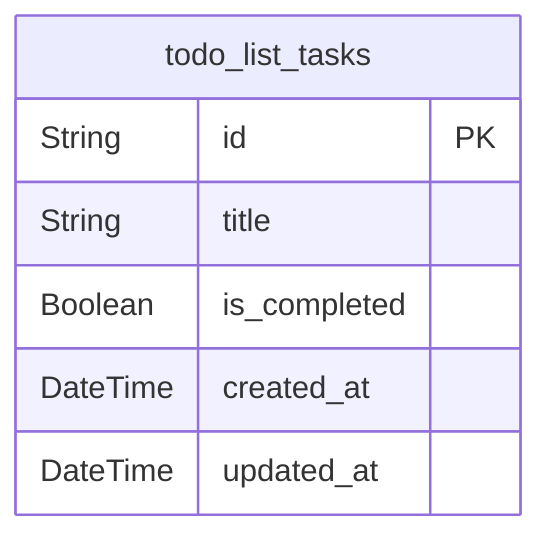

# Prisma Markdown

> Generated by [`prisma-markdown`](https://github.com/samchon/prisma-markdown)

- [TaskManagement](#taskmanagement)

## TaskManagement

### `todo_list_tasks`

Stores individual tasks for the Todo list application. This table
contains all task information including title, completion status, and
timestamps for creation and updates.

Properties as follows:

- `id`: Primary Key.
- `title`: Title of the task.
- `is_completed`: Whether the task is completed or not.
- `created_at`: Timestamp when the task was created.
- `updated_at`: Timestamp when the task was last updated.
