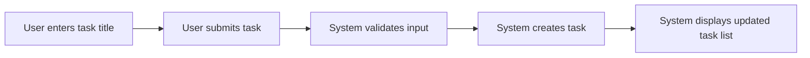
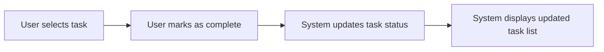
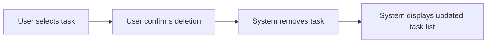
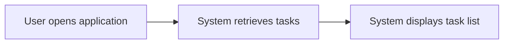

# Todo List Application Functional Requirements

## 1. Introduction

### 1.1 Purpose of the Document
This document defines the functional requirements for a basic Todo list application with minimum functionality. It serves as a comprehensive guide for backend developers to understand what needs to be built, why it's being built, and how it should function.

### 1.2 Scope and Objectives
The Todo list application will provide core functionality for managing personal tasks:
- Add new tasks with a title
- Mark tasks as complete/incomplete
- Delete tasks
- View a list of all tasks

The application focuses on simplicity and ease of use, without additional complexity like user accounts, categories, or reminders.

## 2. Core Functional Requirements

### 2.1 Task Management Overview
The system shall provide basic task management functionality with the following operations:
- Task creation
- Task completion (mark as done/undone)
- Task deletion
- Task listing

### 2.2 Task Creation

#### 2.2.1 Create Task
**EARS Format**: WHEN a user submits a new task title, THE system SHALL create a new task with that title.

**Requirements**:
- The system shall allow users to create new tasks
- Each task must have a title (required field)
- Task creation date should be automatically recorded
- Tasks should be initially marked as incomplete

**Validation Rules**:
- Task title must be between 1-255 characters
- Task title cannot be empty

#### 2.2.2 Task Creation Flow

### 2.3 Task Completion

#### 2.3.1 Mark Task as Complete
**EARS Format**: WHEN a user marks a task as complete, THE system SHALL update the task status to complete.

**Requirements**:
- Users can mark tasks as complete
- Users can mark tasks as incomplete (undo completion)
- Completed tasks should be visually distinct in the list

#### 2.3.2 Task Completion Flow

### 2.4 Task Deletion

#### 2.4.1 Delete Task
**EARS Format**: WHEN a user deletes a task, THE system SHALL remove the task from the system.

**Requirements**:
- Users can delete individual tasks
- Deleted tasks cannot be recovered
- System should confirm deletion to prevent accidents

#### 2.4.2 Task Deletion Flow

### 2.5 Task Listing

#### 2.5.1 View Task List
**EARS Format**: WHEN a user views the task list, THE system SHALL display all tasks with their current status.

**Requirements**:
- The system shall display all tasks in a list
- Tasks should be sorted by creation date (newest first)
- Completed tasks should be visually distinct
- The list should show task title and status

#### 2.5.2 Task Listing Flow

## 3. User Roles and Authentication

### 3.1 User Role Definition
The system will have a single user role:

**User**: Standard user who can perform all basic Todo list operations
- Create tasks
- Mark tasks as complete/incomplete
- Delete tasks
- View task list

### 3.2 Authentication Requirements
**EARS Format**: THE system SHALL NOT require user authentication for basic functionality.

**Requirements**:
- No user accounts or login required
- All functionality available immediately
- Data persists locally on the device

## 4. Business Requirements

### 4.1 Business Rules and Constraints
- The system shall focus on minimum functionality
- The system shall be simple and intuitive
- The system shall not include user accounts, categories, or reminders
- The system shall store data locally on the user's device

### 4.2 Performance Expectations
- Task operations should be instantaneous
- Task list should load immediately
- All actions should provide immediate visual feedback

## 5. User Scenarios

### 5.1 Typical User Workflow
1. User opens the application
2. User sees the task list (empty if no tasks)
3. User adds a new task by entering a title and submitting
4. User marks tasks as complete when finished
5. User deletes tasks when no longer needed
6. User views the updated task list

### 5.2 Edge Cases and Error Handling
- **Empty task title**: System should prevent submission and show error
- **Duplicate tasks**: System should allow duplicate task titles
- **Offline usage**: System should work without internet connection
- **Data persistence**: Tasks should persist between sessions

## 6. Technical Constraints

### 6.1 Data Storage
- Tasks should be stored locally on the device
- No cloud synchronization required
- Data should persist between application restarts

### 6.2 User Interface
- Interface should be clean and minimal
- Focus on core functionality
- No unnecessary features or complexity

## 7. Future Considerations

### 7.1 Potential Enhancements
- User accounts for cloud synchronization
- Task categories or tags
- Due dates and reminders
- Priority levels for tasks

### 7.2 Scalability
- The system should be designed to easily add future features
- Core architecture should support extensions

## 8. Glossary

- **Task**: A single item in the Todo list with a title and completion status
- **Completion Status**: Whether a task is marked as complete or incomplete
- **Local Storage**: Data storage on the user's device without cloud synchronization

## 9. References

- [Service Overview](./00-toc.md)
- [User Flow Documentation](./02-user-flow.md)
- [User Roles Documentation](./03-user-roles.md)

> *Developer Note: This document defines **business requirements only**. All technical implementations (architecture, APIs, database design, etc.) are at the discretion of the development team.*