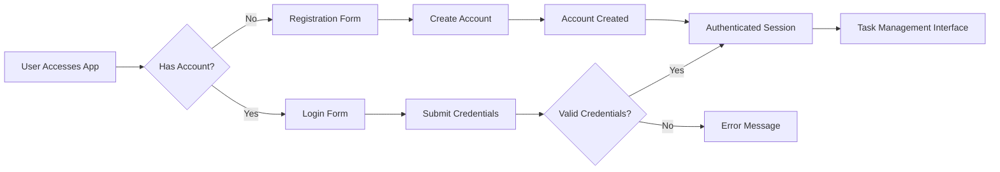

# User Roles and Permissions for Todo List Application

## 1. Introduction

### Purpose of this Document
This document defines the user roles, permissions, and authentication requirements for the Todo list application. It provides backend developers with clear specifications for implementing user management and access control.

### Scope and Objectives
- Define the single user role for this minimal Todo list application
- Specify all permissions associated with task management operations
- Describe the authentication flow and requirements
- Provide business requirements in EARS format
- Ensure the system meets minimum functionality requirements

## 2. User Roles

### Standard User Role

**Role Name**: User
**Description**: Standard user who can perform all basic Todo list operations
**Kind**: Member

#### Role Responsibilities
- Create new tasks with titles
- Mark tasks as complete or incomplete
- Delete tasks
- View a list of all tasks
- Manage their own session (login/logout)

#### Role Constraints
- Cannot access or modify other users' tasks
- Cannot perform administrative operations
- Limited to basic task management functionality

## 3. Permissions

### Task Management Permissions

| Operation | User Role | Permission | Description |
|-----------|-----------|------------|-------------|
| Create Task | User | ✅ | Can create new tasks with titles |
| Read Tasks | User | ✅ | Can view list of all their tasks |
| Update Task | User | ✅ | Can mark tasks as complete/incomplete |
| Delete Task | User | ✅ | Can delete their own tasks |
| Access Other Users' Tasks | User | ❌ | Cannot access other users' data |

### Authentication Permissions

| Operation | User Role | Permission | Description |
|-----------|-----------|------------|-------------|
| Register | User | ✅ | Can create a new account |
| Login | User | ✅ | Can authenticate to access tasks |
| Logout | User | ✅ | Can end their session |
| Change Password | User | ✅ | Can update their password |

## 4. Authentication

### Authentication Flow

### Session Management
- User sessions are maintained using JWT (JSON Web Tokens)
- Access tokens expire after 30 minutes of inactivity
- Refresh tokens are used to maintain long-term sessions
- Tokens are stored securely (httpOnly cookies or localStorage)

### Security Considerations
- Passwords are hashed using bcrypt or similar algorithm
- All communications use HTTPS
- Sensitive operations require re-authentication
- Rate limiting on authentication endpoints

## 5. Business Requirements (EARS Format)

### User Authentication Requirements

**EARS-001**: THE system SHALL allow users to register with email and password.
**EARS-002**: THE system SHALL allow users to login with their credentials.
**EARS-003**: THE system SHALL allow users to logout and end their session.
**EARS-004**: THE system SHALL allow users to change their password.
**EARS-005**: WHEN a user submits login credentials, THE system SHALL validate them within 2 seconds.
**EARS-006**: IF login credentials are invalid, THEN THE system SHALL return error code AUTH_INVALID_CREDENTIALS.
**EARS-007**: THE system SHALL use JWT for session management.
**EARS-008**: THE system SHALL expire access tokens after 30 minutes of inactivity.
**EARS-009**: THE system SHALL use refresh tokens to maintain long-term sessions.

### Task Management Requirements

**EARS-010**: THE system SHALL allow authenticated users to create new tasks.
**EARS-011**: THE system SHALL allow users to view their list of tasks.
**EARS-012**: THE system SHALL allow users to mark tasks as complete or incomplete.
**EARS-013**: THE system SHALL allow users to delete their own tasks.
**EARS-014**: THE system SHALL prevent users from accessing other users' tasks.
**EARS-015**: WHEN a user creates a task, THE system SHALL store it with current timestamp.
**EARS-016**: WHEN a user marks a task as complete, THE system SHALL update the completion status.
**EARS-017**: WHEN a user deletes a task, THE system SHALL remove it permanently.

### Error Handling Requirements

**EARS-018**: IF a user tries to access another user's tasks, THEN THE system SHALL return error code ACCESS_DENIED.
**EARS-019**: IF a user tries to perform an operation without authentication, THEN THE system SHALL return error code UNAUTHENTICATED.
**EARS-020**: IF a task creation fails, THEN THE system SHALL return error code TASK_CREATION_FAILED.
**EARS-021**: IF a task deletion fails, THEN THE system SHALL return error code TASK_DELETION_FAILED.

## 6. Relationship with Other Documents

### Connection to Functional Requirements
This document complements the [Functional Requirements Document](./01-functional-requirements.md) by specifying who can perform each operation and how authentication is handled.

### Connection to User Flow
This document provides the authentication foundation for the user flows described in the [User Flow Document](./02-user-flow.md).

## 7. Conclusion

This document provides a complete specification of user roles, permissions, and authentication requirements for the Todo list application. It ensures that:

- The system has a single, well-defined user role
- All task management operations have clear permissions
- Authentication is secure and straightforward
- Business requirements are clearly specified in EARS format
- The system meets minimum functionality requirements

Backend developers can use this document to implement a secure, functional authentication and authorization system for the Todo list application.

> *Developer Note: This document defines business requirements only. All technical implementations (architecture, APIs, database design, etc.) are at the discretion of the development team.*