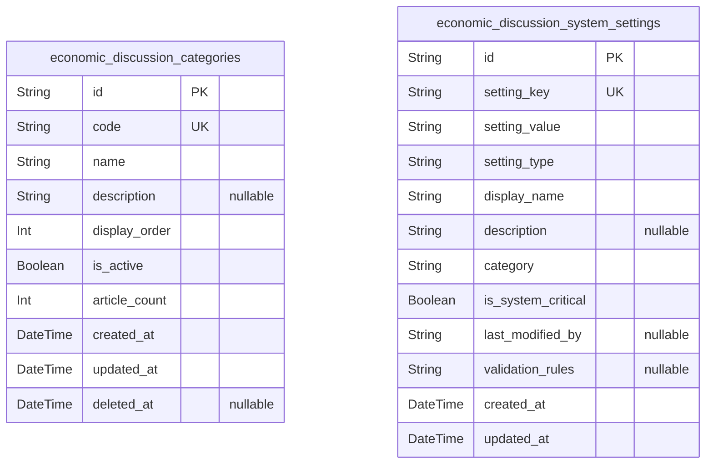
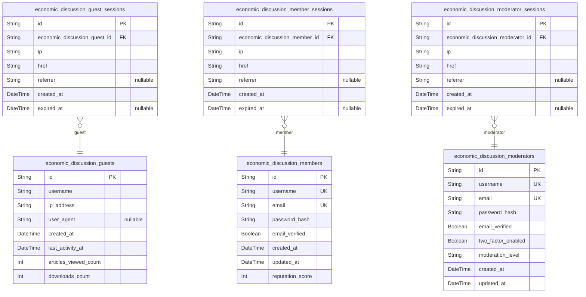
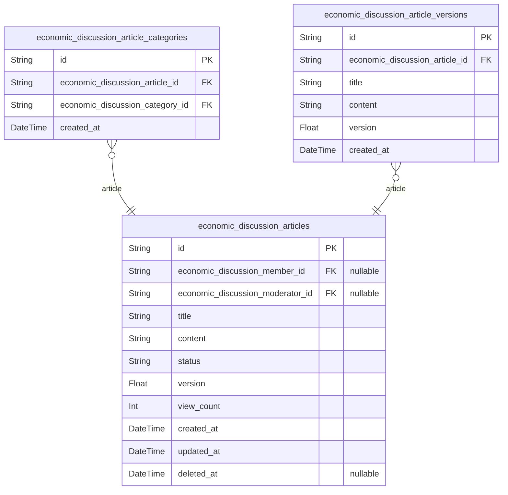
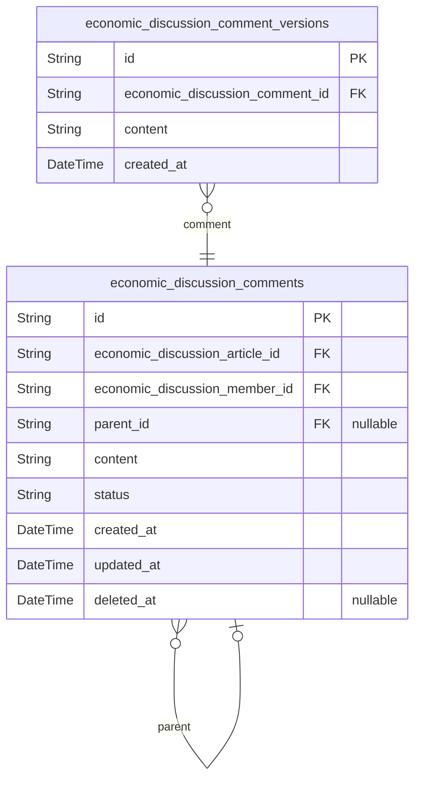
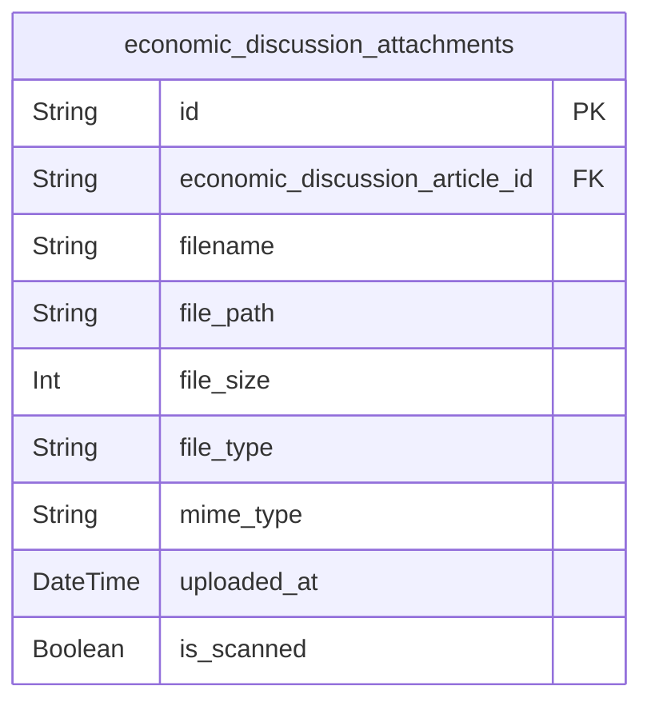
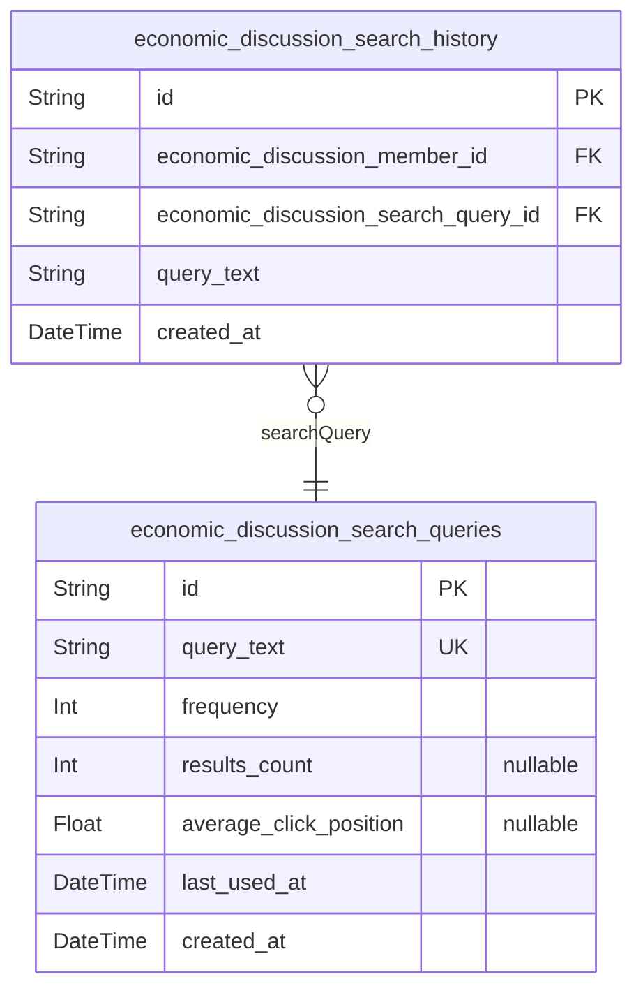

# Prisma Markdown

> Generated by [`prisma-markdown`](https://github.com/samchon/prisma-markdown)

- [Systematic](#systematic)
- [Actors](#actors)
- [Articles](#articles)
- [Comments](#comments)
- [Attachments](#attachments)
- [Search](#search)

## Systematic

### `economic_discussion_categories`

Article categories for organizing economic and political discussions.

Categories serve as the primary taxonomy system for content organization
within the discussion board.
They enable users to filter and find relevant discussions based on topic
areas and maintain content discoverability across the platform.

Each category represents a specific field of economic or political
discourse, allowing users to browse discussions within their areas of
interest.
The categories are predefined by the system administrators and remain
consistent across the platform to ensure standardized content
organization.

Properties as follows:

- `id`: Primary Key.
- `code`: Unique category code used for identification and URL generation.
- `name`: Display name for the category shown to users in navigation and filters.
- `description`
  > Optional detailed description explaining the scope and purpose of this
  > category.
- `display_order`
  > Numerical order position for displaying categories in user interfaces and
  > menus.
- `is_active`
  > Whether this category is currently active and available for new article
  > creation.
- `article_count`: Cached count of articles in this category for performance optimization.
- `created_at`: Timestamp when this category was first created in the system.
- `updated_at`: Timestamp when this category was last modified or updated.
- `deleted_at`: Soft deletion timestamp when this category was removed from active use.

### `economic_discussion_system_settings`

System-wide configuration settings for the Economic/Political Discussion
Board platform.

This table stores platform-wide configuration parameters that affect all
users and operations across the discussion board.
Settings control behavior such as posting limits, file upload
restrictions, security policies, moderation rules, and performance
parameters.

Each setting represents a specific configuration parameter identified by
a unique key, with type-appropriate values that determine system
behavior.
The settings provide administrators with flexible control over platform
behavior without requiring code changes or system restarts.

Properties as follows:

- `id`: Primary Key.
- `setting_key`
  > Unique identifier key for this system setting used for programmatic
  > access.
- `setting_value`
  > The value of this setting as a string, may contain serialized data for
  > non-string types.
- `setting_type`
  > Data type of the setting value: string, integer, boolean, json, or float
  > for validation purposes.
- `display_name`
  > Human-readable display name for this setting shown in administration
  > interfaces.
- `description`
  > Detailed explanation of what this setting controls and its impact on
  > platform behavior.
- `category`
  > Logical grouping category for organizing related settings in the
  > administration interface.
- `is_system_critical`
  > Whether this setting is critical to system operation and should not be
  > modified without administrator approval.
- `last_modified_by`
  > Identifier of the administrator or system process that last modified this
  > setting for audit purposes.
- `validation_rules`
  > Optional JSON-serialized validation rules for this setting value
  > including allowed ranges or values.
- `created_at`
  > Timestamp when this system setting was first established in the
  > configuration system.
- `updated_at`
  > Timestamp when this system setting was last modified or its value was
  > changed.

## Actors

### `economic_discussion_guests`

Guest users who can browse and read content without registration.

Guests have read-only access to articles, comments, and file attachments.
They can search and filter content but cannot create, edit, or upload.
Guest sessions are tracked for analytics and download limits.

Properties as follows:

- `id`: Primary Key.
- `username`: Guest display name for personalization.
- `ip_address`: IP address for session tracking and download limits.
- `user_agent`: Browser user agent string for session identification.
- `created_at`: Guest session creation timestamp.
- `last_activity_at`: Timestamp of last activity for session management.
- `articles_viewed_count`: Count of articles viewed in current session.
- `downloads_count`: Count of file downloads in current session.

### `economic_discussion_members`

Registered community members with full participation privileges.

Members can create articles, post comments, upload files, and access all
community features. They undergo email verification and authentication
process for community participation.

Properties as follows:

- `id`: Primary Key.
- `username`
  > Unique member display name chosen during registration.
  > Between 3-30 characters with letters, numbers, underscores, and hyphens
  > only.
- `email`
  > Email address for authentication and notifications.
  > Must be unique across all members.
- `password_hash`
  > Encrypted authentication credential for secure login.
  > Required for member authentication per requirements.
- `email_verified`: Email verification status for account activation.
- `created_at`: Account registration timestamp.
- `updated_at`: Last profile update timestamp.
- `reputation_score`: Community participation score based on activity.

### `economic_discussion_moderators`

Community moderators with elevated permissions for content management.

Moderators have additional privileges including editing any content, user
management, content moderation, and access to administration tools while
maintaining authentication security.

Properties as follows:

- `id`: Primary Key.
- `username`: Unique moderator identifier for community management.
- `email`: Administrator email address for secure communications.
- `password_hash`: Advanced authentication credential with enhanced security.
- `email_verified`: Verification status for administrative account security.
- `two_factor_enabled`: Two-factor authentication requirement for moderator access.
- `moderation_level`: Authorization level for different moderation scopes.
- `created_at`: Moderator appointment timestamp.
- `updated_at`: Last access timestamp for activity monitoring.

### `economic_discussion_guest_sessions`

Session tracking for guest user access and activity monitoring.

Guest sessions track browsing activity, download limits, and provide
audit trails while maintaining privacy protections for unregistered
users.

Properties as follows:

- `id`: Primary Key.
- `economic_discussion_guest_id`: Associated guest user's [economic_discussion_guests.id](#economic_discussion_guests).
- `ip`: Session IP address for security and audit purposes.
- `href`: Connection URL for session tracking.
- `referrer`: Referrer URL for navigation tracking.
- `created_at`: Session creation timestamp.
- `expired_at`: Session expiration time for cleanup.

### `economic_discussion_member_sessions`

Authentication sessions for community member access.

Member sessions handle login authentication with JWT tokens, refresh
tokens, and session management for registered users to access community
features.

Properties as follows:

- `id`: Primary Key.
- `economic_discussion_member_id`: Associated member account's [economic_discussion_members.id](#economic_discussion_members).
- `ip`: Session IP address for security verification.
- `href`: Login connection URL for context.
- `referrer`: Referral source for member acquisition tracking.
- `created_at`: Login session creation timestamp.
- `expired_at`: JWT token expiration time for session cleanup.

### `economic_discussion_moderator_sessions`

Secure sessions for community moderator administrative access.

Moderator sessions provide enhanced security tracking for administrative
actions, with mandatory audit logging and elevated permission management.

Properties as follows:

- `id`: Primary Key.
- `economic_discussion_moderator_id`: Associated moderator account's [economic_discussion_moderators.id](#economic_discussion_moderators).
- `ip`: Administrative session IP address for audit requirements.
- `href`: Administrative panel access URL for activity tracking.
- `referrer`: Referrer for administrative access monitoring.
- `created_at`: Admin session creation timestamp.
- `expired_at`: Administrative access expiration for security.

## Articles

### `economic_discussion_articles`

Core content entities representing economic and political discussion
articles.

Articles serve as the primary content type where members and moderators
share economic insights, political analysis, and policy discussions. Each
article contains the main discussion content along with metadata for
organization and moderation.

Articles support file attachments, categorization, and have complete
version history tracking through the associated versions table. The
content goes through moderation workflow with status tracking.

Properties as follows:

- `id`: Primary Key.
- `economic_discussion_member_id`: Author member's [economic_discussion_members.id](#economic_discussion_members)
- `economic_discussion_moderator_id`: Author moderator's [economic_discussion_moderators.id](#economic_discussion_moderators)
- `title`: Article title displaying the main topic or question
- `content`: Main article content body with discussion text
- `status`: Current workflow status: pending, approved, rejected
- `version`: Current article version number for tracking edits
- `view_count`: Number of times the article has been viewed
- `created_at`: Creation timestamp
- `updated_at`: Last update timestamp
- `deleted_at`: Soft deletion timestamp for moderation

### `economic_discussion_article_categories`

Junction table managing many-to-many relationships between articles and
categories.

This subsidiary table connects articles to their assigned categories,
allowing articles to be tagged with multiple categories for better
organization and discovery. Categories help users filter and browse
content by topic areas like Economics, Politics, Business, etc.

The junction table maintains referential integrity while supporting
efficient querying for category-based content discovery.

Properties as follows:

- `id`: Primary Key.
- `economic_discussion_article_id`: Associated article's [economic_discussion_articles.id](#economic_discussion_articles)
- `economic_discussion_category_id`: Associated category's [economic_discussion_categories.id](#economic_discussion_categories)
- `created_at`: Association creation timestamp

### `economic_discussion_article_versions`

Historical snapshots capturing article states at specific points in time.

This snapshot table preserves complete article versions whenever
significant changes occur, supporting audit trails and content recovery.
Each version captures the full article state including content, title,
and metadata at the time of the edit.

Version history enables rollback capabilities and provides transparency
for content evolution tracking required in discussion forums.

Properties as follows:

- `id`: Primary Key.
- `economic_discussion_article_id`: Original article's [economic_discussion_articles.id](#economic_discussion_articles)
- `title`: Article title at time of version creation
- `content`: Article content at time of version creation
- `version`: Version number for this snapshot
- `created_at`: Version creation timestamp

## Comments

### `economic_discussion_comments`

User comments on economic and political discussion articles.

Comments enable community discussion and debate around posted articles,
supporting nested replies up to 3 levels deep for organized conversation
threads. Each comment maintains relationships with both the parent
article and the commenting member, ensuring proper content organization
and user accountability.

The comment system supports moderation workflows with status tracking,
allowing for content review before public visibility. Edit history is
preserved through version snapshots, maintaining transparency while
allowing users to correct typos or clarify statements within the
permitted time window.

Properties as follows:

- `id`: Primary Key.
- `economic_discussion_article_id`
  > The article this comment belongs to. {@link
  > economic_discussion_articles.id}
- `economic_discussion_member_id`: Member who created this comment. [economic_discussion_members.id](#economic_discussion_members)
- `parent_id`: Parent comment for nested replies. [economic_discussion_comments.id](#economic_discussion_comments)
- `content`: Comment text content. Minimum 10 characters, maximum 1000 characters.
- `status`: Moderation status: pending, approved, or rejected.
- `created_at`: Comment creation timestamp.
- `updated_at`: Last modification timestamp.
- `deleted_at`: Soft deletion timestamp for content moderation.

### `economic_discussion_comment_versions`

Historical snapshots of comment content for audit trail and edit tracking.

This table preserves the complete edit history of comments, storing
point-in-time snapshots whenever users modify their comments within the
allowed edit window. Each version captures the exact content state,
modification timestamp, and editor information for transparency.

The versioning system ensures accountability while allowing users to
correct errors or clarify their statements. All versions remain
accessible for moderation purposes and provide a complete audit trail of
discussion evolution over time.

Properties as follows:

- `id`: Primary Key.
- `economic_discussion_comment_id`
  > Original comment this version belongs to. {@link
  > economic_discussion_comments.id}
- `content`: Comment content at the time of snapshot.
- `created_at`: Snapshot creation timestamp when version was saved.

## Attachments

### `economic_discussion_attachments`

File attachments associated with discussion articles supporting images,
documents, and spreadsheets.

Stores file metadata and references for attachments uploaded to articles.
Files inherit visibility permissions from their parent article. Supports
multiple attachment types with strict size and format validation.

Attachments are automatically removed when the associated article is
deleted. All files undergo security scanning before approval. The system
supports up to 5 attachments per article with combined size limits.

Properties as follows:

- `id`: Primary Key.
- `economic_discussion_article_id`: Associated article's [economic_discussion_articles.id](#economic_discussion_articles)
- `filename`: Original filename provided during upload
- `file_path`: Storage path for the uploaded file
- `file_size`: File size in bytes
- `file_type`: File type category: image, document, or spreadsheet
- `mime_type`: MIME type for proper file handling
- `uploaded_at`: Timestamp when file was uploaded
- `is_scanned`: Whether the file has completed security scanning

## Search

### `economic_discussion_search_history`

Personal search history tracking for logged-in members.

Stores individual search queries performed by registered members,
enabling them to review their search history, find previously viewed
content, and maintain personal search patterns. Supports the requirement
for logged-in users to have personalized search history retention.

Search history entries are automatically created when members perform
searches and can be cleared by users at any time.

Properties as follows:

- `id`: Primary Key.
- `economic_discussion_member_id`: Member who performed the search. [economic_discussion_members.id](#economic_discussion_members)
- `economic_discussion_search_query_id`
  > Associated search query for reference. {@link
  > economic_discussion_search_queries.id}
- `query_text`: Actual search query text entered by the user.
- `created_at`: When this search was performed.

### `economic_discussion_search_queries`

Master table for tracking all unique search queries across the platform.

Maintains a centralized list of individual search queries to avoid
duplication, track frequency, and enable analytics for understanding what
content and topics are most commonly searched by the community.

Each unique search query is stored once with frequency tracking, allowing
efficient aggregation of search patterns and popular content discovery.

Properties as follows:

- `id`: Primary Key.
- `query_text`: Unique search query text.
- `frequency`: Number of times this query has been used across all users.
- `results_count`: Average result count for this query.
- `average_click_position`: Average position of clicked results. Helps measure search quality.
- `last_used_at`: Most recent time this query was executed.
- `created_at`: When this query was first recorded.
