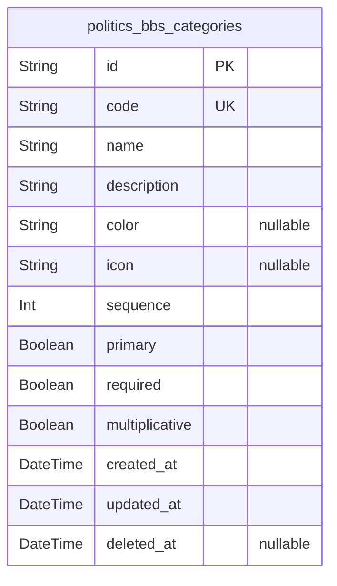
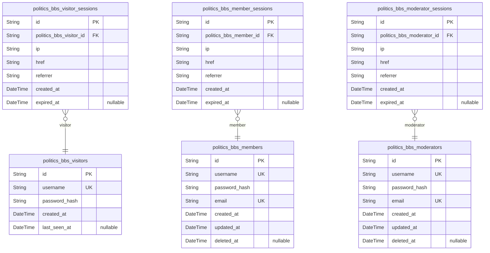
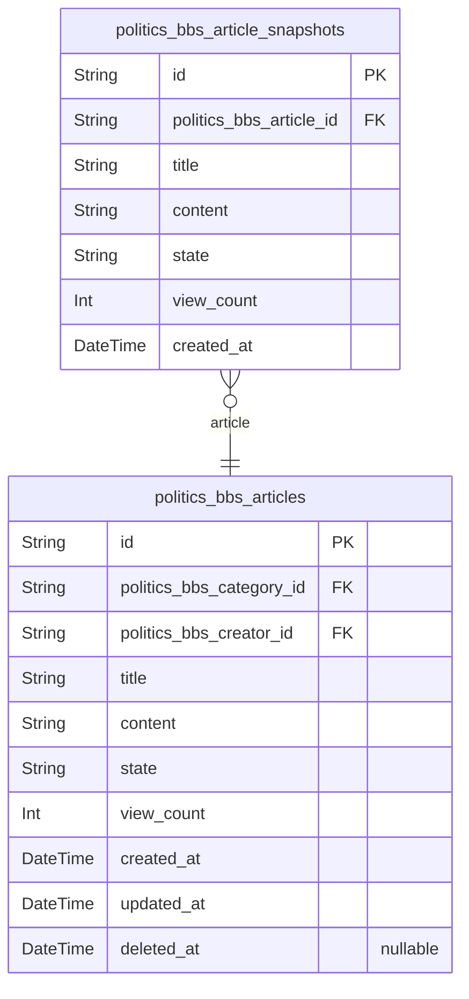
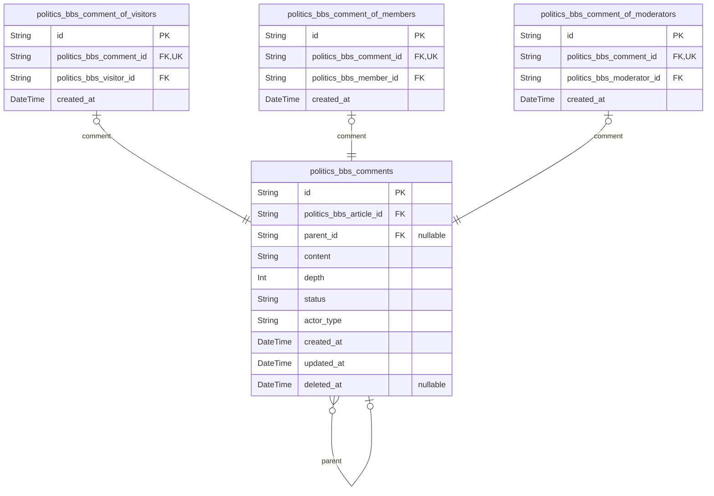
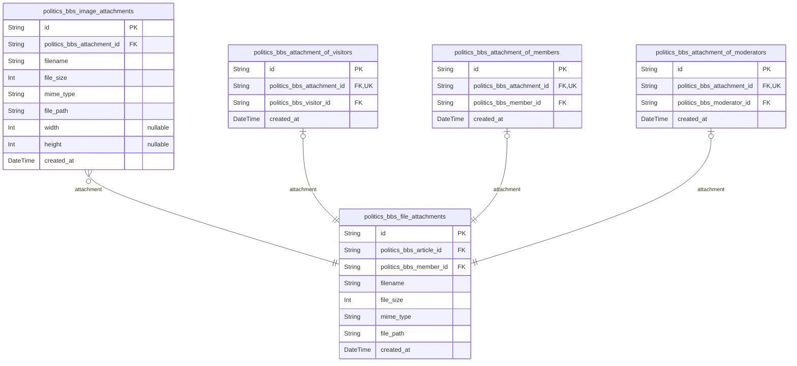

# Prisma Markdown

> Generated by [`prisma-markdown`](https://github.com/samchon/prisma-markdown)

- [Systematic](#systematic)
- [Actors](#actors)
- [Content](#content)
- [Discussion](#discussion)
- [Attachments](#attachments)

## Systematic

### `politics_bbs_categories`

Predefined categories for organizing politicsBBS articles and
discussions. Categories facilitate content discoverability and filtering,
focusing on economic and political topics as specified in the
requirements. Categories are created and managed by moderators through
the system interface.

Properties as follows:

- `id`: Primary Key.
- `code`: Unique category code for internal reference and URL generation
- `name`: Display name for the category shown to users
- `description`: Detailed description of the category's purpose and scope
- `color`: CSS color code for visual identification of the category
- `icon`: Icon identifier for visual representation
- `sequence`: Display order for category sorting in lists
- `primary`: Whether this is a primary featured category
- `required`: Whether this category is required to be assigned
- `multiplicative`: Whether multiple categories can be assigned to content
- `created_at`: Category creation timestamp
- `updated_at`: Last modification timestamp
- `deleted_at`: Soft delete timestamp

## Actors

### `politics_bbs_visitors`

Visitor accounts with read-only access to published content. Visitors can
browse articles, view attachments, and search content without
authentication requirements.

Properties as follows:

- `id`: Primary Key.
- `username`
  > Unique username for display purposes, 3-20 characters using letters,
  > numbers, and hyphens only.
- `password_hash`
  > Hashed password for visitor authentication using secure algorithms with
  > appropriate salting.
- `created_at`: Timestamp when the visitor account was created.
- `last_seen_at`: Timestamp of the visitor's last activity on the platform.

### `politics_bbs_members`

Member accounts with content creation privileges including article
creation, commenting, and file uploads. Members can manage their own
content within 24-hour editing window.

Properties as follows:

- `id`: Primary Key.
- `username`
  > Unique username for member identification, 3-20 characters using letters,
  > numbers, and hyphens only.
- `password_hash`
  > Hashed password for member authentication using secure algorithms with
  > appropriate salting.
- `email`
  > Email address for account recovery and notifications, must be unique
  > across the system.
- `created_at`: Timestamp when the member account was registered.
- `updated_at`: Timestamp of the most recent profile update.
- `deleted_at`: Soft delete timestamp for member account suspension.

### `politics_bbs_moderators`

Moderator accounts with enhanced permissions for content review, approval
workflows, and community management. Moderators can review all content
and manage user violations.

Properties as follows:

- `id`: Primary Key.
- `username`
  > Unique username for moderator identification, 3-20 characters using
  > letters, numbers, and hyphens only.
- `password_hash`
  > Hashed password for moderator authentication using secure algorithms with
  > appropriate salting.
- `email`
  > Email address for moderator communications and account recovery, must be
  > unique across the system.
- `created_at`: Timestamp when the moderator account was created.
- `updated_at`: Timestamp of the most recent moderator profile update.
- `deleted_at`: Soft delete timestamp for moderator account suspension.

### `politics_bbs_visitor_sessions`

Authentication sessions for visitor users to track activity and provide
session-based functionality. These sessions support audit tracing of
visitor actions on the platform.

Properties as follows:

- `id`: Primary Key.
- `politics_bbs_visitor_id`: Visitor's [politics_bbs_visitors.id](#politics_bbs_visitors) who owns this session.
- `ip`: IP address of the visitor for security and audit tracking.
- `href`: Connection URL or current page location for session context.
- `referrer`: Referrer URL showing how the visitor arrived at the site.
- `created_at`: Timestamp when the visitor session was initiated.
- `expired_at`: Session expiration time, nullable to allow ongoing sessions.

### `politics_bbs_member_sessions`

Authentication sessions for member users to maintain secure access. These
sessions support audit tracing of member actions across the platform.

Properties as follows:

- `id`: Primary Key.
- `politics_bbs_member_id`: Member's [politics_bbs_members.id](#politics_bbs_members) who owns this session.
- `ip`: IP address of the member for security and audit tracking.
- `href`: Connection URL or current page location for session context.
- `referrer`: Referrer URL showing how the member arrived at the site.
- `created_at`: Timestamp when the member session was initiated.
- `expired_at`: Session expiration time, nullable to allow extended member sessions.

### `politics_bbs_moderator_sessions`

Authentication sessions for moderator users to support administrative
activities. These sessions provide secure access to moderation tools with
audit tracking capabilities.

Properties as follows:

- `id`: Primary Key.
- `politics_bbs_moderator_id`: Moderator's [politics_bbs_moderators.id](#politics_bbs_moderators) who owns this session.
- `ip`: IP address of the moderator for security and audit tracking.
- `href`: Connection URL or current page location for session context.
- `referrer`: Referrer URL showing how the moderator arrived at the site.
- `created_at`: Timestamp when the moderator session was initiated.
- `expired_at`: Session expiration time, nullable to allow extended moderator sessions.

## Content

### `politics_bbs_articles`

Core article entity for the politics discussion board, managing the
complete article lifecycle from creation through publication. Articles
support title and content with state management, view tracking, and
attachment capabilities.

Properties as follows:

- `id`: Primary Key.
- `politics_bbs_category_id`: Belonged category's [politics_bbs_categories.id](#politics_bbs_categories)
- `politics_bbs_creator_id`
  > Creator's [politics_bbs_members.id](#politics_bbs_members) or {@link
  > politics_bbs_moderators.id} based on actor type
- `title`
  > Article title displayed to users, limited to 5-150 characters as per
  > business rules
- `content`
  > Main article content body with 50-10,000 character limit for substantive
  > discussions
- `state`
  > Article lifecycle state: draft, pending, approved, or rejected for
  > moderation workflow
- `view_count`: Number of times the article has been viewed for popularity tracking
- `created_at`: Timestamp when the article was first created
- `updated_at`: Last modification timestamp for the article
- `deleted_at`: Soft delete timestamp for article removal

### `politics_bbs_article_snapshots`

Historical snapshots of articles capturing point-in-time states for audit
trails and version tracking. Snapshots preserve complete article content
when articles are modified.

Properties as follows:

- `id`: Primary Key.
- `politics_bbs_article_id`: Source article's [politics_bbs_articles.id](#politics_bbs_articles)
- `title`: Snapshot of article title at this point in time
- `content`: Snapshot of article content at this point in time
- `state`: Snapshot of article state when this snapshot was created
- `view_count`: View count snapshot for historical tracking
- `created_at`: Timestamp when this snapshot was created for audit trail

## Discussion

### `politics_bbs_comments`

Core comment entity for the politics discussion board, supporting
threaded discussions for articles. Comments maintain state, moderation
status, and support polymorphic ownership through subtypes for visitors,
members, and moderators.

Properties as follows:

- `id`: Primary Key.
- `politics_bbs_article_id`: Belonged article's [politics_bbs_articles.id](#politics_bbs_articles)
- `parent_id`: Parent comment's [politics_bbs_comments.id](#politics_bbs_comments) for threading
- `content`
  > Comment content text supporting rich text formatting, 20-1000 characters
  > for meaningful dialogue.
- `depth`
  > Nesting level for threaded comments (0, 1, or 2) enforcing 3-level thread
  > limit.
- `status`: Comment moderation status: pending, approved, rejected, or flagged.
- `actor_type`: Type of actor who created this comment: visitor, member, or moderator.
- `created_at`: Comment creation timestamp for audit trail.
- `updated_at`: Last modification timestamp.
- `deleted_at`: Soft delete timestamp.

### `politics_bbs_comment_of_visitors`

Subtype entity for comments created by visitor users. Maintains the
polymorphic ownership relationship with proper referential integrity and
audit tracking.

Properties as follows:

- `id`: Primary Key.
- `politics_bbs_comment_id`: Comment's [politics_bbs_comments.id](#politics_bbs_comments) this subtype belongs to.
- `politics_bbs_visitor_id`: Visitor's [politics_bbs_visitors.id](#politics_bbs_visitors) who created this comment.
- `created_at`: Visitor-specific creation timestamp.

### `politics_bbs_comment_of_members`

Subtype entity for comments created by member users. Maintains the
polymorphic ownership relationship with proper referential integrity and
audit tracking.

Properties as follows:

- `id`: Primary Key.
- `politics_bbs_comment_id`: Comment's [politics_bbs_comments.id](#politics_bbs_comments) this subtype belongs to.
- `politics_bbs_member_id`: Member's [politics_bbs_members.id](#politics_bbs_members) who created this comment.
- `created_at`: Member-specific creation timestamp.

### `politics_bbs_comment_of_moderators`

Subtype entity for comments created by moderator users. Maintains the
polymorphic ownership relationship with proper referential integrity and
audit tracking.

Properties as follows:

- `id`: Primary Key.
- `politics_bbs_comment_id`: Comment's [politics_bbs_comments.id](#politics_bbs_comments) this subtype belongs to.
- `politics_bbs_moderator_id`: Moderator's [politics_bbs_moderators.id](#politics_bbs_moderators) who created this comment.
- `created_at`: Moderator-specific creation timestamp.

## Attachments

### `politics_bbs_image_attachments`

Image attachments for articles using polymorphic ownership pattern. Image
attachments support metadata extraction and image processing for display
optimization.

Properties as follows:

- `id`: Primary Key.
- `politics_bbs_attachment_id`: Main attachment entity's [politics_bbs_file_attachments.id](#politics_bbs_file_attachments)
- `filename`: Original filename of the uploaded image
- `file_size`: Size of the image file in bytes. Maximum 5MB allowed
- `mime_type`: MIME type of the image
- `file_path`: Storage path or URL reference to the image file
- `width`: Image width in pixels for display optimization
- `height`: Image height in pixels for display optimization
- `created_at`: Timestamp when the image was uploaded

### `politics_bbs_file_attachments`

Document file attachments for articles supporting up to 10MB per file and
5 files per article. Manages document uploads with format validation for
PDF, DOC, DOCX, and TXT formats.

Properties as follows:

- `id`: Primary Key.
- `politics_bbs_article_id`: Attached article's [politics_bbs_articles.id](#politics_bbs_articles).
- `politics_bbs_member_id`: Uploading member's [politics_bbs_members.id](#politics_bbs_members).
- `filename`: Original filename of the uploaded document.
- `file_size`: Size of the document file in bytes. Maximum 10MB allowed.
- `mime_type`
  > MIME type of the document (application/pdf, application/msword,
  > application/vnd.openxmlformats-officedocument.wordprocessingml.document,
  > text/plain).
- `file_path`: Storage path or URL reference to the document file.
- `created_at`: Timestamp when the file was uploaded.

### `politics_bbs_attachment_of_visitors`

Association table for visitor-created image attachments implementing
polymorphic ownership pattern. Visitors can upload images for validation
through proper subtype relationship.

Properties as follows:

- `id`: Primary Key.
- `politics_bbs_attachment_id`: Attachment's [politics_bbs_file_attachments.id](#politics_bbs_file_attachments)
- `politics_bbs_visitor_id`: Visitor uploader's [politics_bbs_visitors.id](#politics_bbs_visitors)
- `created_at`: Timestamp when visitor uploaded this attachment

### `politics_bbs_attachment_of_members`

Association table for member-created image attachments implementing
polymorphic ownership pattern. Members can upload images and files for
their articles through proper subtype relationship.

Properties as follows:

- `id`: Primary Key.
- `politics_bbs_attachment_id`: Attachment's [politics_bbs_file_attachments.id](#politics_bbs_file_attachments)
- `politics_bbs_member_id`: Member uploader's [politics_bbs_members.id](#politics_bbs_members)
- `created_at`: Timestamp when member uploaded this attachment

### `politics_bbs_attachment_of_moderators`

Association table for moderator-created image attachments implementing
polymorphic ownership pattern. Moderators can upload images for
moderation and administrative content.

Properties as follows:

- `id`: Primary Key.
- `politics_bbs_attachment_id`: Attachment's [politics_bbs_file_attachments.id](#politics_bbs_file_attachments)
- `politics_bbs_moderator_id`: Moderator uploader's [politics_bbs_moderators.id](#politics_bbs_moderators)
- `created_at`: Timestamp when moderator uploaded this attachment
