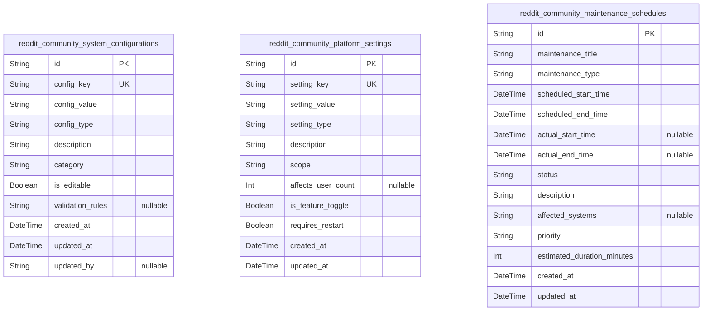
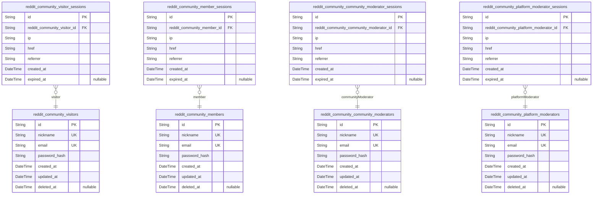
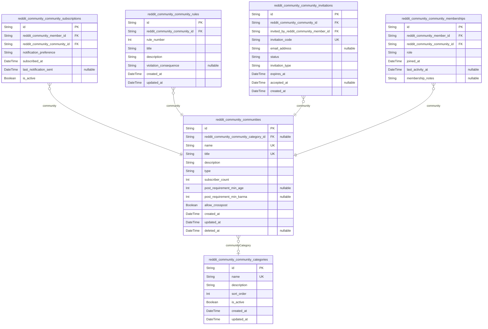
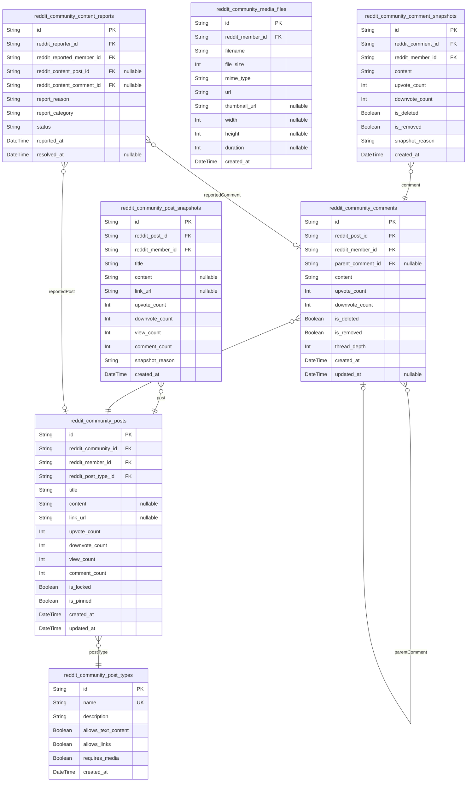
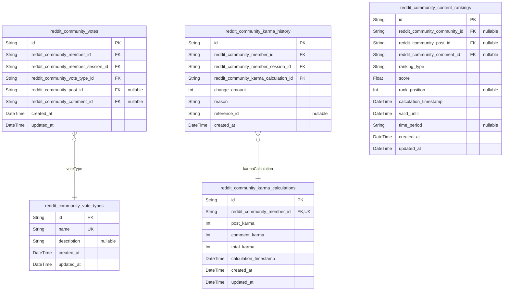
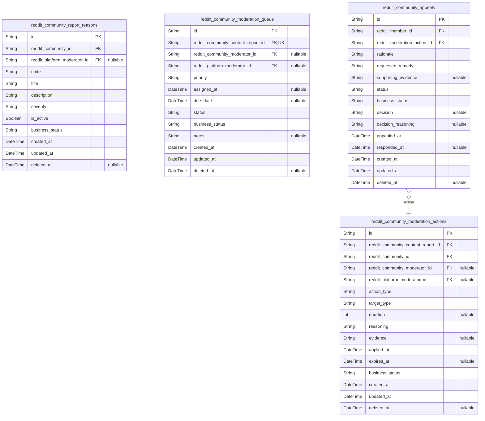
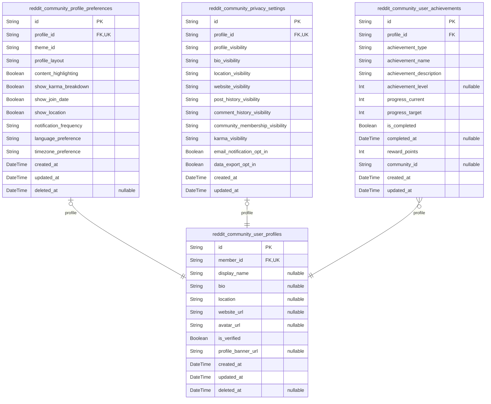
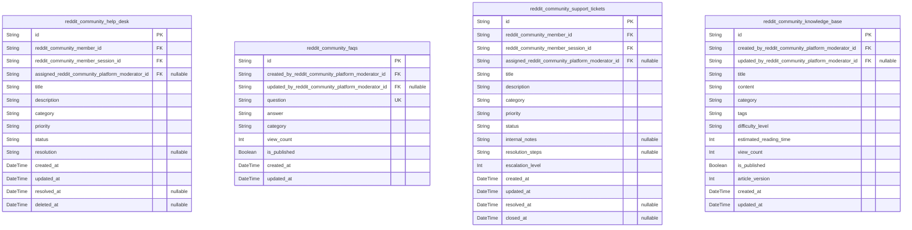

# Prisma Markdown

> Generated by [`prisma-markdown`](https://github.com/samchon/prisma-markdown)

- [Systematic](#systematic)
- [Actors](#actors)
- [Community](#community)
- [Content](#content)
- [Voting](#voting)
- [Moderation](#moderation)
- [Profile](#profile)
- [Inquiries](#inquiries)

## Systematic

### `reddit_community_system_configurations`

Core system configuration parameters that control platform-wide
functionality and operational settings. Stores system-wide configuration
values including feature flags, operational parameters, and
infrastructure settings that affect the entire platform operation.

This table serves as the central repository for system-level
configuration data that administrators can modify to adjust platform
behavior, enable/disable features, and manage operational parameters
across all communities and user interactions.

Properties as follows:

- `id`: Primary Key.
- `config_key`
  > Unique configuration key identifier used for system lookups and API
  > access. Must be unique across the platform.
- `config_value`
  > Configuration value stored as string for flexibility across different
  > data types. Can contain JSON, numbers, or text values.
- `config_type`
  > Data type classification for the configuration value (string, number,
  > boolean, json) to enable proper parsing and validation.
- `description`
  > Human-readable description explaining the purpose, impact, and usage of
  > this configuration parameter for documentation.
- `category`
  > Configuration category for grouping related settings (features,
  > performance, security, integrations).
- `is_editable`
  > Whether this configuration value can be modified through the admin
  > interface or requires system-level access.
- `validation_rules`
  > JSON string containing validation rules, constraints, and acceptable
  > value ranges for configuration values.
- `created_at`
  > Timestamp when this configuration parameter was first created and added
  > to the system.
- `updated_at`: Timestamp when this configuration parameter was last modified or updated.
- `updated_by`
  > UUID reference to the user or system process that last updated this
  > configuration parameter.

### `reddit_community_platform_settings`

Platform-wide operational settings that govern user experience, community
behavior, and system-wide features. Contains settings that affect how the
platform operates across all communities and user interactions.

This table stores operational parameters such as user limits, posting
rules, feature enablement, and platform-wide behaviors that can be
configured by administrators to adjust the overall user experience and
platform policies.

Properties as follows:

- `id`: Primary Key.
- `setting_key`
  > Unique setting key identifier for platform-wide configuration options
  > affecting user experience and community behavior.
- `setting_value`
  > Platform setting value that controls operational behavior, user limits,
  > or feature configurations across the entire platform.
- `setting_type`
  > Data type of the platform setting (numeric, boolean, text, json) for
  > proper validation and processing.
- `description`
  > Description explaining the platform setting's purpose, expected impact,
  > and usage guidelines for administrators.
- `scope`
  > Application scope of the setting (user, community, platform) indicating
  > what level of the system it affects.
- `affects_user_count`
  > Estimated number of users affected by this platform setting change, used
  > for impact assessment.
- `is_feature_toggle`
  > Whether this setting controls feature enablement/disablement that can be
  > toggled on/off during runtime.
- `requires_restart`
  > Whether changing this setting requires platform restart or system-level
  > configuration updates.
- `created_at`
  > When this platform setting was first created and added to the system
  > configuration.
- `updated_at`
  > When this platform setting was last modified or updated by system
  > administrators.

### `reddit_community_maintenance_schedules`

System maintenance schedules and downtime planning that coordinate
platform updates, system maintenance, and scheduled outages. Manages
operational maintenance tasks that require system downtime or impact user
access.

This table tracks planned maintenance windows, system updates, emergency
responses, and operational activities that require coordination across
the platform infrastructure while minimizing impact on community
activities and user engagement.

Properties as follows:

- `id`: Primary Key.
- `maintenance_title`
  > Descriptive title for the maintenance activity that clearly identifies
  > the purpose and scope of planned work.
- `maintenance_type`
  > Type of maintenance activity (scheduled_update, emergency_fix,
  > routine_maintenance, security_patch) for categorization and planning.
- `scheduled_start_time`
  > Planned start time for the maintenance activity, coordinated across time
  > zones to minimize user impact.
- `scheduled_end_time`
  > Planned end time for the maintenance activity with buffer time for
  > completion and testing.
- `actual_start_time`
  > Actual timestamp when maintenance work began, recorded for audit and
  > duration tracking.
- `actual_end_time`
  > Actual timestamp when maintenance work was completed and systems returned
  > to full operation.
- `status`
  > Current status of the maintenance activity (scheduled, in_progress,
  > completed, cancelled, postponed) for tracking and display.
- `description`
  > Detailed description of maintenance work including scope, expected
  > impact, affected systems, and user communication details.
- `affected_systems`
  > JSON array listing platform systems and services that will be affected or
  > unavailable during maintenance window.
- `priority`
  > Maintenance priority level (low, medium, high, critical) determining
  > scheduling precedence and resource allocation.
- `estimated_duration_minutes`
  > Estimated maintenance duration in minutes used for scheduling
  > coordination and user notification planning.
- `created_at`
  > When this maintenance schedule was created and added to the operational
  > planning system.
- `updated_at`
  > When this maintenance schedule was last updated with status changes or
  > modified timing.

## Actors

### `reddit_community_visitors`

Unauthenticated guest users who can browse public communities and content
without creating accounts. Visitors have limited access to basic platform
features while maintaining full browsing capabilities across public areas
of the platform.

Properties as follows:

- `id`: Primary Key.
- `nickname`: Display name for the visitor. Must be unique across all visitor accounts.
- `email`
  > Email address for visitor account. Required for potential account upgrade
  > and communication.
- `password_hash`
  > Hashed password for visitor account authentication. Required for account
  > security and login functionality.
- `created_at`: Timestamp when the visitor account was created.
- `updated_at`: Timestamp when the visitor account was last updated.
- `deleted_at`
  > Timestamp when the visitor account was soft deleted. Used for account
  > recovery and audit trails.

### `reddit_community_members`

Authenticated users with full platform privileges including community
participation, content creation, voting, and commenting. Members form the
core user base with comprehensive access to all community features and
engagement tools.

Properties as follows:

- `id`: Primary Key.
- `nickname`: Unique display name for the member across the platform.
- `email`: Verified email address for member authentication and notifications.
- `password_hash`: Securely hashed password for member login authentication.
- `created_at`: Timestamp when the member account was created.
- `updated_at`: Timestamp when the member account was last updated.
- `deleted_at`: Soft deletion timestamp for account management and auditing.

### `reddit_community_community_moderators`

Community-level administrators with elevated privileges for managing
specific communities. Community moderators have authority to enforce
rules, remove content, manage memberships, and maintain community
standards within their assigned communities.

Properties as follows:

- `id`: Primary Key.
- `nickname`: Unique display name for the community moderator.
- `email`: Verified email address for moderator communications and authentication.
- `password_hash`: Hashed password for secure moderator account authentication.
- `created_at`: Timestamp when the community moderator account was created.
- `updated_at`: Timestamp when the community moderator account was last updated.
- `deleted_at`: Soft deletion timestamp for account recovery and audit tracking.

### `reddit_community_platform_moderators`

System-wide administrators with comprehensive platform management
authority. Platform moderators oversee community health, enforce
platform-wide policies, handle escalated issues, and maintain overall
platform integrity across all communities.

Properties as follows:

- `id`: Primary Key.
- `nickname`: Unique display name for the platform moderator across the entire platform.
- `email`
  > Verified email address for platform moderator communications and secure
  > authentication.
- `password_hash`: Securely hashed password for platform moderator account authentication.
- `created_at`: Timestamp when the platform moderator account was created.
- `updated_at`: Timestamp when the platform moderator account was last updated.
- `deleted_at`
  > Soft deletion timestamp for account management and administrative
  > auditing.

### `reddit_community_visitor_sessions`

User session records for visitor accounts tracking authentication state
and connection details. Session data enables secure, persistent access
for visitor users while maintaining audit trails for security and
administrative purposes.

Properties as follows:

- `id`: Primary Key.
- `reddit_community_visitor_id`: Belonged visitor's [reddit_community_visitors.id](#reddit_community_visitors)
- `ip`
  > IP address of the visitor session for connection tracking and security
  > monitoring.
- `href`
  > Connection URL for the visitor session to track navigation and access
  > sources.
- `referrer`
  > Referrer URL for the visitor session to understand traffic sources and
  > user journeys.
- `created_at`: Timestamp when the visitor session was created.
- `expired_at`
  > Timestamp when the visitor session expires. Used for session lifecycle
  > management.

### `reddit_community_member_sessions`

User session records for member accounts tracking authentication state
and connection details. Session data enables secure, persistent access
for member users while maintaining audit trails for security and
administrative oversight.

Properties as follows:

- `id`: Primary Key.
- `reddit_community_member_id`: Belonged member's [reddit_community_members.id](#reddit_community_members)
- `ip`
  > IP address of the member session for security monitoring and access
  > tracking.
- `href`
  > Connection URL for the member session to track navigation patterns and
  > access sources.
- `referrer`
  > Referrer URL for the member session to understand traffic sources and
  > user behavior.
- `created_at`: Timestamp when the member session was created.
- `expired_at`
  > Timestamp when the member session expires for lifecycle management and
  > security purposes.

### `reddit_community_community_moderator_sessions`

User session records for community moderator accounts tracking
authentication state and connection details. Session data enables secure,
persistent access for community moderator users while maintaining audit
trails for security and administrative oversight.

Properties as follows:

- `id`: Primary Key.
- `reddit_community_community_moderator_id`
  > Belonged community moderator's {@link
  > reddit_community_community_moderators.id}
- `ip`
  > IP address of the community moderator session for security tracking and
  > access monitoring.
- `href`
  > Connection URL for the community moderator session to track navigation
  > and access patterns.
- `referrer`
  > Referrer URL for the community moderator session to understand traffic
  > sources and user journeys.
- `created_at`: Timestamp when the community moderator session was created.
- `expired_at`
  > Timestamp when the community moderator session expires for lifecycle
  > management.

### `reddit_community_platform_moderator_sessions`

User session records for platform moderator accounts tracking
authentication state and connection details. Session data enables secure,
persistent access for platform moderator users while maintaining
comprehensive audit trails for security and administrative oversight.

Properties as follows:

- `id`: Primary Key.
- `reddit_community_platform_moderator_id`
  > Belonged platform moderator's {@link
  > reddit_community_platform_moderators.id}
- `ip`
  > IP address of the platform moderator session for security monitoring and
  > access tracking.
- `href`
  > Connection URL for the platform moderator session to track navigation and
  > access sources.
- `referrer`
  > Referrer URL for the platform moderator session to understand traffic
  > sources and user behavior patterns.
- `created_at`: Timestamp when the platform moderator session was created.
- `expired_at`
  > Timestamp when the platform moderator session expires for security and
  > lifecycle management.

## Community

### `reddit_community_communities`

Core community entities representing thematic forums where users share
content and engage in discussions.

Communities function as independent forums dedicated to specific topics,
interests, or purposes while maintaining seamless integration with
platform-wide features including posting, voting, and commenting
functionality. Each community has unique identity, rules, and membership
management systems to foster focused discussions around shared interests.

Properties as follows:

- `id`: Primary Key.
- `reddit_community_community_category_id`: Associated category's [reddit_community_community_categories.id](#reddit_community_community_categories)
- `name`
  > Unique community identifier used in URLs (3-21 characters, alphanumeric
  > and underscores only)
- `title`: Community display title shown to users (up to 100 characters)
- `description`: Community overview explaining purpose and focus (up to 500 characters)
- `type`: Community access type: public, restricted, or private
- `subscriber_count`: Current number of community subscribers
- `post_requirement_min_age`: Minimum account age in days required for posting (community-specific)
- `post_requirement_min_karma`: Minimum karma required for posting in this community
- `allow_crosspost`: Whether crossposting from other communities is allowed
- `created_at`: Community creation timestamp
- `updated_at`: Last modification timestamp
- `deleted_at`: Soft deletion timestamp for removed communities

### `reddit_community_community_categories`

Community categories for organizing thematic forums into logical groupings.

Categories provide a hierarchical organization system that helps users
discover communities with similar themes and enables platform-level
content organization. Categories are managed by platform administrators
and assigned to communities during creation or editing.

Properties as follows:

- `id`: Primary Key.
- `name`: Category name displayed to users (e.g., Technology, Sports, Entertainment)
- `description`: Category description explaining the types of communities included
- `sort_order`: Display order for category sorting (lower numbers appear first)
- `is_active`: Whether the category is active and available for assignment
- `created_at`: Category creation timestamp
- `updated_at`: Last modification timestamp

### `reddit_community_community_subscriptions`

User subscription relationships to communities for personalized feed
customization.

Community subscriptions enable users to customize their main feed by
joining communities of interest. The subscription system manages user
preferences, notification settings, and provides comprehensive
subscription management capabilities for personalized content discovery.

Properties as follows:

- `id`: Primary Key.
- `reddit_community_member_id`: Subscribing member's [reddit_community_members.id](#reddit_community_members)
- `reddit_community_community_id`: Subscribed community's [reddit_community_communities.id](#reddit_community_communities)
- `notification_preference`: Notification level: none, popular, hot, all, or keywords
- `subscribed_at`: Subscription creation timestamp
- `last_notification_sent`: Last notification sent to user about community activity
- `is_active`: Whether the subscription is currently active

### `reddit_community_community_rules`

Community-specific rules and guidelines that govern acceptable content
and behavior.

Community rules define the behavioral expectations and content standards
for each community, allowing moderators to maintain quality discussions
and enforce community guidelines. Rules are customized per community
while adhering to platform-wide policies.

Properties as follows:

- `id`: Primary Key.
- `reddit_community_community_id`: Community these rules belong to [reddit_community_communities.id](#reddit_community_communities)
- `rule_number`: Sequential rule number for display ordering (1-15)
- `title`: Brief rule title (up to 100 characters)
- `description`: Detailed rule explanation and examples (up to 1000 characters)
- `violation_consequence`: Consequence for violating this rule (warning, removal, ban)
- `created_at`: Rule creation timestamp
- `updated_at`: Last modification timestamp

### `reddit_community_community_invitations`

Community invitation management for private or restricted community
access control.

Invitation system enables community moderators to grant access to
specific users for private communities or to manage membership in
restricted communities. Invitations can be sent via email links or
through generated invitation codes.

Properties as follows:

- `id`: Primary Key.
- `reddit_community_community_id`: Community being invited to [reddit_community_communities.id](#reddit_community_communities)
- `invited_by_reddit_community_member_id`: Member who sent the invitation [reddit_community_members.id](#reddit_community_members)
- `invitation_code`: Unique invitation code for redeeming access
- `email_address`: Email address for invitation delivery (optional)
- `status`: Invitation status: pending, accepted, declined, expired
- `invitation_type`: Invitation type: email_link, generated_code, direct_invite
- `expires_at`: Invitation expiration timestamp
- `accepted_at`: Timestamp when invitation was accepted
- `created_at`: Invitation creation timestamp

### `reddit_community_community_memberships`

Community membership tracking for participation and role management.

Membership records track user participation within communities including
join dates, roles, and activity levels. Essential for community
governance, membership analytics, and participation-based feature access
control.

Properties as follows:

- `id`: Primary Key.
- `reddit_community_member_id`: Community member's [reddit_community_members.id](#reddit_community_members)
- `reddit_community_community_id`: Community membership [reddit_community_communities.id](#reddit_community_communities)
- `role`: Member role: member, moderator, banned, or suspended
- `joined_at`: When the user joined the community
- `last_activity_at`: Last recorded activity in this community
- `membership_notes`: Moderator notes about membership (for bans, warnings, etc.)

## Content

### `reddit_community_posts`

Core content entries created by community members including text posts,
link posts, and image posts. Posts serve as the primary discussion
starters and content sharing mechanism within communities, supporting the
platform's community-driven content ecosystem.

Properties as follows:

- `id`: Primary Key.
- `reddit_community_id`
  > Community where the post was created. \n{@link
  > reddit_community_communities.id}
- `reddit_member_id`: Member who created the post. \n[reddit_community_members.id](#reddit_community_members)
- `reddit_post_type_id`
  > Post type classification (text, link, image). \n{@link
  > reddit_community_post_types.id}
- `title`
  > Post title displayed in community feeds. Maximum length follows platform
  > standards for post titles.
- `content`
  > Main content body for text posts. Nullable to accommodate link and image
  > posts that don't require body text.
- `link_url`
  > External URL for link posts. Nullable since not all post types include
  > links.
- `upvote_count`: Current number of upvotes received. Updated in real-time as users vote.
- `downvote_count`: Current number of downvotes received. Updated in real-time as users vote.
- `view_count`: Number of times the post has been viewed. Used for engagement metrics.
- `comment_count`: Number of comments on the post. Maintained for performance optimization.
- `is_locked`
  > Whether the post is locked and cannot receive new comments.
  > Moderator-controlled.
- `is_pinned`
  > Whether the post is pinned to the top of the community.
  > Moderator-controlled feature.
- `created_at`: When the post was first created. Uses standard creation timestamp pattern.
- `updated_at`: When the post was last modified. Updated automatically on post edits.

### `reddit_community_post_snapshots`

Historical snapshots of post content and metadata. Captures point-in-time
states of posts for audit trails, content moderation history, and
preserving community discussions even when posts are edited.

Properties as follows:

- `id`: Primary Key.
- `reddit_post_id`
  > Original post that this snapshot represents. \n{@link
  > reddit_community_posts.id}
- `reddit_member_id`
  > Member state when the snapshot was created. \n{@link
  > reddit_community_members.id}
- `title`
  > Snapshot of post title at creation time. Preserves historical title
  > information.
- `content`
  > Snapshot of post content at creation time. May be null for link/image
  > posts.
- `link_url`
  > Snapshot of link URL if present at creation time. Preserves external link
  > references.
- `upvote_count`: Posted vote count at snapshot time. Captures community reaction metrics.
- `downvote_count`
  > Posted downvote count at snapshot time. Preserves vote differential
  > history.
- `view_count`: View count at snapshot time. Records audience engagement metrics.
- `comment_count`: Comment count at snapshot moment. Tracks discussion activity levels.
- `snapshot_reason`
  > Snapshot trigger cause (edit, moderation, scheduled). Documents why the
  > snapshot was created.
- `created_at`: Snapshot creation timestamp. Standard creation timestamp pattern.

### `reddit_community_post_types`

Classification system for different post formats. Defines the available
posting types (text posts, link posts, image posts) that community
members can create within the platform.

Properties as follows:

- `id`: Primary Key.
- `name`
  > Post type identifier used throughout the platform (text, link, image).
  > Defines the display and interaction model.
- `description`
  > Human-readable description of the post type purpose. Explains when to use
  > each format.
- `allows_text_content`
  > Whether posts of this type can contain text bodies. Determines title-only
  > vs title+content display.
- `allows_links`
  > Whether posts of this type can include external URLs. Controls link
  > submission capabilities.
- `requires_media`
  > Whether posts of this type must include media files. Used for
  > image/video-only post types.
- `created_at`: When this post type was defined. System configuration timestamp.

### `reddit_community_comments`

User-generated responses to posts and other comments. Comments enable
threaded discussions and community dialogue, supporting the platform's
core engagement mechanism through nested replies and voting.

Properties as follows:

- `id`: Primary Key.
- `reddit_post_id`: Post that this comment responds to. \n[reddit_community_posts.id](#reddit_community_posts)
- `reddit_member_id`: Member who created the comment. \n[reddit_community_members.id](#reddit_community_members)
- `parent_comment_id`
  > Parent comment for nested replies. Nullable for top-level comments.
  > Enables threading. \n[reddit_community_comments.id](#reddit_community_comments)
- `content`
  > Comment text content submitted by the user. Minimum 1 character, maximum
  > 10,000 characters for meaningful discussions.
- `upvote_count`
  > Current number of upvotes. Updated in real-time as users vote on the
  > comment.
- `downvote_count`
  > Current number of downvotes. Updated in real-time for vote differential
  > calculation.
- `is_deleted`
  > Whether the comment has been soft deleted by the author. Maintains thread
  > structure while hiding content.
- `is_removed`
  > Whether the comment has been removed by moderators. Community enforcement
  > tracking without author deletion.
- `thread_depth`
  > Nesting level in comment thread (0 for top-level, increments for
  > replies). Controls display formatting and hierarchy.
- `created_at`: Comment creation timestamp. Standard creation timestamp pattern.
- `updated_at`
  > Comment last update timestamp. Nullable since many comments are never
  > edited.

### `reddit_community_comment_snapshots`

Historical snapshots of comment content. Preserves comment editing
history and provides audit trails for content moderation while
maintaining discussion integrity throughout comment lifecycle changes.

Properties as follows:

- `id`: Primary Key.
- `reddit_comment_id`
  > Original comment that this snapshot represents. \n{@link
  > reddit_community_comments.id}
- `reddit_member_id`
  > Member state when the snapshot was created. \n{@link
  > reddit_community_members.id}
- `content`
  > Snapshot of comment content at creation time. Preserves historical text
  > information.
- `upvote_count`
  > Posted upvote count at snapshot time. Captures community reaction at
  > moment.
- `downvote_count`: Posted downvote count at snapshot time. Preserves voting ratio history.
- `is_deleted`: Deletion status at snapshot time. Tracks comment lifecycle state.
- `is_removed`: Removal status at snapshot time. Records moderation action history.
- `snapshot_reason`
  > Snapshot trigger cause (edit, moderation, scheduled). Documents why the
  > snapshot was created.
- `created_at`: Snapshot creation timestamp. Standard creation timestamp pattern.

### `reddit_community_media_files`

Media attachments for posts and comments supporting multiple file types.
Manages images, videos, and other media content uploaded by community
members to enhance their posts and discussions.

Properties as follows:

- `id`: Primary Key.
- `reddit_member_id`: Member who uploaded the media file. \n[reddit_community_members.id](#reddit_community_members)
- `filename`
  > Original filename when uploaded. Preserves user-provided naming for
  > identification.
- `file_size`
  > File size in bytes. Tracks storage usage and helps with bandwidth
  > optimization.
- `mime_type`
  > File MIME type (image/jpeg, video/mp4, etc.). Enables proper browser
  > rendering and security validation.
- `url`
  > CDN URL for accessing the media file. Provides distributed access to
  > uploaded content.
- `thumbnail_url`
  > Thumbnail URL for preview generation. Nullable for file types that don't
  > support thumbnails.
- `width`: Image/video width in pixels. Nullable for non-visual media types.
- `height`: Image/video height in pixels. Nullable for non-visual media types.
- `duration`: Video/audio duration in seconds. Nullable for static media types.
- `created_at`: Media file upload timestamp. Standard creation timestamp pattern.

### `reddit_community_content_reports`

User-generated reports about inappropriate or policy-violating content.
Enables community-driven moderation by allowing members to flag posts,
comments, and other content for review by moderators and administrators.

Properties as follows:

- `id`: Primary Key.
- `reddit_reporter_id`: Member who submitted the report. \n[reddit_community_members.id](#reddit_community_members)
- `reddit_reported_member_id`
  > Member whose content was reported. Used for audit trails and user safety
  > monitoring. \n[reddit_community_members.id](#reddit_community_members)
- `reddit_content_post_id`
  > Post being reported if applicable. Nullable since reports can target
  > comments or other content. \n[reddit_community_posts.id](#reddit_community_posts)
- `reddit_content_comment_id`
  > Comment being reported if applicable. Nullable since reports can target
  > posts or other content. \n[reddit_community_comments.id](#reddit_community_comments)
- `report_reason`
  > Brief explanation of why the content was reported. Summarizes the
  > violation or concern identified.
- `report_category`
  > Classification of reported violation (harassment, spam, hate speech,
  > misinformation, etc.). Enables moderation routing.
- `status`
  > Report processing status (submitted, under_review, resolved, dismissed).
  > Tracks moderation workflow progression.
- `reported_at`
  > When the report was submitted. Standard creation timestamp for tracking
  > report timing.
- `resolved_at`
  > When the report was resolved or dismissed. Nullable for reports still
  > under review.

## Voting

### `reddit_community_votes`

Individual user votes on posts and comments that drive content ranking
and karma calculations.

This table records every upvote and downvote cast by users on platform
content, forming the foundation of the content curation system. Votes are
used with appropriate anti-manipulation measures and contribute directly
to user karma calculations according to the platform's voting algorithms.

All votes are permanent records that cannot be deleted, only updated
through the voting mechanism (changing upvote to downvote or vice versa).

Properties as follows:

- `id`: Primary Key.
- `reddit_community_member_id`: Voter member. [reddit_community_members.id](#reddit_community_members)
- `reddit_community_member_session_id`
  > Session during which the vote was cast. {@link
  > reddit_community_member_sessions.id}
- `reddit_community_vote_type_id`: Type of vote (upvote or downvote). [reddit_community_vote_types.id](#reddit_community_vote_types)
- `reddit_community_post_id`
  > Target post being voted on (if voting on a post). {@link
  > reddit_community_posts.id}
- `reddit_community_comment_id`
  > Target comment being voted on (if voting on a comment). {@link
  > reddit_community_comments.id}
- `created_at`: Timestamp when the vote was cast.
- `updated_at`: Timestamp when the vote was last modified.

### `reddit_community_vote_types`

Reference data defining the types of votes available on the platform.

This table contains the classification system for different types of
votes that users can cast. Currently supports upvotes and downvotes but
provides extensibility for future voting mechanisms like awards or
specialized community rating systems.

Vote types are used throughout the platform for filtering, analytics, and
algorithmic content ranking to ensure fair and consistent voting behavior
management.

Properties as follows:

- `id`: Primary Key.
- `name`: Name of the vote type (e.g., 'upvote', 'downvote').
- `description`: Detailed description of this vote type and its purpose.
- `created_at`: Timestamp when this vote type was created.
- `updated_at`: Timestamp when this vote type was last updated.

### `reddit_community_karma_calculations`

System for calculating and tracking user karma scores based on voting
activity.

This table represents the core karma calculation engine that processes
voting data to generate user reputation scores. It implements the
platform's karma algorithms including vote weighting, time-decay factors,
and community-specific adjustments while maintaining transparency and
fairness across all user activities.

Karma calculations are performed periodically to balance real-time
responsiveness with system performance, and provide the foundation for
user privilege systems and content ranking algorithms throughout the
platform.

Properties as follows:

- `id`: Primary Key.
- `reddit_community_member_id`
  > Member whose karma is being calculated. {@link
  > reddit_community_members.id}
- `post_karma`: Karma earned from post votes.
- `comment_karma`: Karma earned from comment votes.
- `total_karma`: Total combined karma score.
- `calculation_timestamp`: Timestamp of the last calculation.
- `created_at`: Timestamp when karma record was created.
- `updated_at`: Timestamp when karma was last updated.

### `reddit_community_karma_history`

Historical record of karma changes for audit and transparency purposes.

This table maintains a complete audit trail of all karma modifications
providing transparency in reputation building and supporting dispute
resolution when necessary. It records the source events that contribute
to karma changes, enabling users to understand how their reputation is
built and changed over time.

The karma history serves as the authoritative record for addressing user
concerns about reputation calculations and supports analytics for
understanding platform engagement patterns while maintaining
comprehensive audit capabilities.

Properties as follows:

- `id`: Primary Key.
- `reddit_community_member_id`: Member whose karma changed. [reddit_community_members.id](#reddit_community_members)
- `reddit_community_member_session_id`
  > Session during which the karma change occurred. {@link
  > reddit_community_member_sessions.id}
- `reddit_community_karma_calculation_id`
  > Associated karma calculation record. {@link
  > reddit_community_karma_calculations.id}
- `change_amount`: Amount of karma change (positive or negative).
- `reason`: Reason for the karma change (vote_received, post_removal, etc.).
- `reference_id`: Reference to the source event that caused this change.
- `created_at`: Timestamp when the karma change occurred.

### `reddit_community_content_rankings`

Calculated rankings of content based on voting, age, and engagement metrics.

This table stores the computed rankings that power the platform's content
discovery algorithms including Hot, Top, New, and Controversial sorting
mechanisms. It maintains cached results of complex ranking calculations
to provide fast and consistent content presentation across all user
interfaces.

Content rankings are recalculated periodically based on platform
algorithms and serve as the foundation for content discovery, community
navigation, and trending content identification throughout the platform
environment.

Properties as follows:

- `id`: Primary Key.
- `reddit_community_community_id`
  > Community scope for this ranking (if community-specific). {@link
  > reddit_community_communities.id}
- `reddit_community_post_id`
  > Target post being ranked (if ranking posts). {@link
  > reddit_community_posts.id}
- `reddit_community_comment_id`
  > Target comment being ranked (if ranking comments). {@link
  > reddit_community_comments.id}
- `ranking_type`: Type of ranking (hot, top, new, controversial).
- `score`: Calculated ranking score for sorting purposes.
- `rank_position`: Calculated ranking position within the ranking type.
- `calculation_timestamp`: Timestamp when this ranking was calculated.
- `valid_until`: Timestamp when this ranking expires and should be recalculated.
- `time_period`
  > Time period for this ranking (past_hour, past_day, past_week, past_month,
  > all_time).
- `created_at`: Timestamp when the ranking record was created.
- `updated_at`: Timestamp when the ranking was last updated.

## Moderation

### `reddit_community_report_reasons`

Predefined violation categories for content reporting system.

Report reasons provide standardized categories for users to classify
content violations, ensuring consistent reporting across communities.
Reasons can be system-wide defaults or community-specific based on local
guidelines. The categorization helps moderators efficiently triage
reports and apply appropriate sanctions based on violation type.

Each reason includes a unique code for internal reference and a
user-friendly title with clear violation description. Community
moderators can customize reasons for their specific needs while
maintaining alignment with platform-wide policies.

Properties as follows:

- `id`: Primary Key.
- `reddit_community_id`
  > Community where this report reason applies. {@link
  > reddit_community_communities.id}
- `reddit_platform_moderator_id`
  > Platform moderator who created this reason. {@link
  > reddit_community_platform_moderators.id}
- `code`: Unique identifier for this violation category across communities.
- `title`: User-friendly name of the violation category displayed to reporters.
- `description`: Detailed explanation of what constitutes this type of violation.
- `severity`: Default severity level: low, medium, high, critical.
- `is_active`: Whether this reason is currently available for reporting.
- `business_status`: Approval status of this reason: draft, approved, retired.
- `created_at`: Timestamp when this report reason was created.
- `updated_at`: Timestamp when this reason was last modified.
- `deleted_at`: Soft deletion timestamp for audit trail maintenance.

### `reddit_community_moderation_queue`

Moderator review queue for processing reported content.

The moderation queue acts as the central intake system for all content
reports requiring moderator attention. Reports are prioritized based on
severity, community impact patterns, and queue management policies.
Moderators are assigned to specific reports based on expertise areas,
workload balancing, and community familiarity ensuring efficient review
processes.

Queue entries include assignment tracking, status monitoring, and
workflow progression management. The system supports both
community-specific moderation by community moderators and platform-level
review by platform moderators for cross-community issues or escalation
scenarios.

Properties as follows:

- `id`: Primary Key.
- `reddit_community_content_report_id`
  > Report being processed in this queue entry. {@link
  > reddit_community_content_reports.id}
- `reddit_community_moderator_id`
  > Community moderator assigned to review. {@link
  > reddit_community_community_moderators.id}
- `reddit_platform_moderator_id`
  > Platform moderator assigned to review. {@link
  > reddit_community_platform_moderators.id}
- `priority`
  > Processing priority: critical, high, medium, low based on violation
  > severity.
- `assigned_at`: Timestamp when report was assigned to a moderator.
- `due_date`: Deadline for completing review based on community policies.
- `status`: Queue status: pending, assigned, in_review, reviewed, escalated.
- `business_status`: Moderation workflow status: new, assigned, reviewing, completed.
- `notes`: Internal moderator notes about review progress and findings.
- `created_at`: Timestamp when queue entry was created.
- `updated_at`: Timestamp when queue entry was last updated.
- `deleted_at`: Soft deletion timestamp for audit purposes.

### `reddit_community_moderation_actions`

Moderator actions taken on reported content and user behavior.

Moderation actions represent the concrete steps taken to address content
violations, user misconduct, or community safety concerns identified
through the reporting system. Actions range from minor warnings to severe
penalties including permanent bans from communities or the entire
platform. The action system provides graduated responses based on
violation severity, user history, and community impact assessment.

Each action includes detailed documentation of the moderator's reasoning
and supporting evidence for transparency and accountability. Actions are
automatically logged with user history tracking for appeal processes and
pattern analysis. Platform administrators can review moderation actions
across communities to ensure consistent standards and identify potential
bias or policy misapplication.

Properties as follows:

- `id`: Primary Key.
- `reddit_community_content_report_id`: Report this action addresses. [reddit_community_content_reports.id](#reddit_community_content_reports)
- `reddit_community_id`: Community where action was taken. [reddit_community_communities.id](#reddit_community_communities)
- `reddit_community_moderator_id`
  > Community moderator who performed this action. {@link
  > reddit_community_community_moderators.id}
- `reddit_platform_moderator_id`
  > Platform moderator who performed this action. {@link
  > reddit_community_platform_moderators.id}
- `action_type`
  > Type of action: warning, post_removal, comment_removal,
  > temporary_suspension.
- `target_type`: What was affected: post, comment, user, community.
- `duration`: Duration in minutes (null for permanent actions).
- `reasoning`: Detailed explanation of why this action was taken.
- `evidence`: Supporting links, screenshots, or documentation.
- `applied_at`: Timestamp when action was implemented.
- `expires_at`: When action will be lifted (for temporary actions).
- `business_status`: Action status: applied, under_review, reversed, expired.
- `created_at`: Timestamp when action record was created.
- `updated_at`: Timestamp when action was last updated.
- `deleted_at`: Soft deletion timestamp for audit trail.

### `reddit_community_appeals`

User appeals against moderation actions and decisions.

The appeals system provides users with a formal mechanism to challenge
moderation actions they believe were applied unfairly, excessively, or in
error. Appeals support the platform's commitment to fair treatment and
due process while maintaining community safety standards. The process
balances user rights with moderator authority and community interests.

Appeals include detailed explanation of the user's case, supporting
evidence, and requests for specific remedies. Moderators review appeals
within defined timeframes and can reverse, modify, or uphold original
decisions with additional documentation. Appeal outcomes are recorded
with transparent explanations for educational purposes and policy
improvement.

Properties as follows:

- `id`: Primary Key.
- `reddit_member_id`
  > Member who is appealing the moderation action. {@link
  > reddit_community_members.id}
- `reddit_moderation_action_id`: Action being appealed. [reddit_community_moderation_actions.id](#reddit_community_moderation_actions)
- `rationale`: User's detailed explanation for requesting action reversal.
- `requested_remedy`: Specific outcome requested: full_reversal, modification, clarification.
- `supporting_evidence`: Evidence, context, or documentation supporting the appeal.
- `status`: Appeal status: submitted, under_review, decided, closed.
- `business_status`: Appeal workflow status: filed, reviewing, decided, closed.
- `decision`: Final determination: upheld, reversed, modified, dismissed.
- `decision_reasoning`: Detailed explanation of appeal decision for transparency.
- `appealed_at`: Timestamp when appeal was submitted.
- `responded_at`: Timestamp when appeal was reviewed and decided.
- `created_at`: Timestamp when appeal record was created.
- `updated_at`: Timestamp when appeal record was last updated.
- `deleted_at`: Soft deletion timestamp for audit purposes.

## Profile

### `reddit_community_user_profiles`

User profile information serving as the central identity hub for
community members.

Contains personal information, biographical data, and profile
customization settings that users manage independently. Integrates with
existing user authentication systems while providing comprehensive
profile management capabilities including avatar images, personal
descriptions, and account verification status.

Profiles act as public-facing identity representations that other
community members can browse and understand contribution history,
interests, and community participation patterns while respecting privacy
settings configured by each user.

Properties as follows:

- `id`: Primary Key.
- `member_id`: Associated member's [reddit_community_members.id](#reddit_community_members)
- `display_name`: Public display name shown to other users
- `bio`: User biography or description text (up to 500 characters)
- `location`: User's location or geographic region
- `website_url`: Personal website or external portfolio URL
- `avatar_url`: Profile avatar image URL
- `is_verified`: Whether the user email address has been verified
- `profile_banner_url`: Custom profile banner image URL
- `created_at`: Profile creation timestamp
- `updated_at`: Profile last update timestamp
- `deleted_at`: Profile deletion timestamp for soft deletion

### `reddit_community_profile_preferences`

User profile customization preferences for interface personalization and
content display settings.

Stores individual user preferences for profile page layout, content
organization, appearance settings, and notification preferences. Enables
users to customize how their profile appears to others and how they
interact with the platform interface.

These preferences provide granular control over user experience including
theme customization, content highlighting, privacy display options, and
community interaction settings that reflect individual user preferences
and needs.

Properties as follows:

- `id`: Primary Key.
- `profile_id`: Associated user profile's [reddit_community_user_profiles.id](#reddit_community_user_profiles)
- `theme_id`: Selected user interface theme identifier
- `profile_layout`: Profile page layout preference (grid, list, compact)
- `content_highlighting`: Whether to highlight popular or high-engagement content
- `show_karma_breakdown`: Whether to display karma score decomposition publicly
- `show_join_date`: Whether to display account creation date publicly
- `show_location`: Whether to display location information publicly
- `notification_frequency`: Email notification frequency (immediate, daily, weekly, none)
- `language_preference`: Preferred interface language code
- `timezone_preference`: Preferred timezone for date/time display
- `created_at`: Preference creation timestamp
- `updated_at`: Preference last update timestamp
- `deleted_at`: Preference deletion timestamp for soft deletion

### `reddit_community_privacy_settings`

Granular privacy controls for user profile visibility and data sharing
preferences.

Provides comprehensive privacy management allowing users to control
visibility levels for each profile component including personal
information, posting history, comment history, community memberships, and
karma scores. Supports multiple privacy levels from completely public to
fully private based on individual user comfort levels.

These settings ensure user control over personal data exposure while
maintaining necessary visibility for legitimate community interactions
and security requirements. Privacy controls balance user anonymity needs
with platform functionality requirements for community building and
content quality assurance.

Properties as follows:

- `id`: Primary Key.
- `profile_id`: Associated user profile's [reddit_community_user_profiles.id](#reddit_community_user_profiles)
- `profile_visibility`
  > Overall profile visibility level (public, members_only, communities_only,
  > private)
- `bio_visibility`: Biography text visibility level
- `location_visibility`: Location information visibility level
- `website_visibility`: Website URL visibility level
- `post_history_visibility`: User post history visibility level
- `comment_history_visibility`: User comment history visibility level
- `community_membership_visibility`: Community membership list visibility level
- `karma_visibility`: Karma score visibility level
- `email_notification_opt_in`: Whether user has opted in to email notifications
- `data_export_opt_in`: Whether user has consented to data analytics collection
- `created_at`: Privacy settings creation timestamp
- `updated_at`: Privacy settings last update timestamp

### `reddit_community_user_achievements`

User achievements and milestones recognizing community contributions and
platform engagement.

Tracks user accomplishments including karma milestones, contribution
streaks, community participation levels, and special recognition badges.
Provides gamification elements that encourage positive community
engagement and recognize valuable contributions to the platform
ecosystem.

These achievements serve as community recognition mechanisms that
highlight user expertise, dedication, and positive impact within various
communities while providing motivation for continued meaningful
participation and content quality contributions.

Properties as follows:

- `id`: Primary Key.
- `profile_id`: Associated user profile's [reddit_community_user_profiles.id](#reddit_community_user_profiles)
- `achievement_type`
  > Type of achievement (karma_milestone, contribution_streak,
  > community_expert, special_recognition)
- `achievement_name`: Human-readable achievement name
- `achievement_description`: Detailed achievement description
- `achievement_level`: Achievement tier or level (1-5 for progressive achievements)
- `progress_current`: Current progress toward achievement completion
- `progress_target`: Target required for achievement completion
- `is_completed`: Whether the achievement has been completed
- `completed_at`: Achievement completion timestamp
- `reward_points`: Points awarded for achievement completion
- `community_id`: Associated community where applicable
- `created_at`: Achievement creation timestamp
- `updated_at`: Achievement last update timestamp

## Inquiries

### `reddit_community_help_desk`

Help desk system for managing user inquiries and support requests across
the platform.

Provides structured support request management with categorization,
priority levels, and resolution tracking. Users can file help requests
for various issues including technical problems, community concerns,
account issues, and general platform usage questions. The system enables
support teams to manage inquiry workflows while maintaining complete
audit trails.

Help desk inquiries support independent user operations including
requesting assistance, tracking resolution progress, providing additional
information, and receiving status updates. Users can search historical
help requests, file new inquiries, and access self-service options before
escalating to direct support.

Properties as follows:

- `id`: Primary Key.
- `reddit_community_member_id`: Submitting member's [reddit_community_members.id](#reddit_community_members)
- `reddit_community_member_session_id`
  > Session when inquiry was submitted. Member's {@link
  > reddit_community_member_sessions.id}
- `assigned_reddit_community_platform_moderator_id`
  > Assigned platform moderator handling the inquiry. {@link
  > reddit_community_platform_moderators.id}
- `title`: Brief summary of the help request
- `description`: Detailed explanation of the issue or question
- `category`: Support category: technical, community, account, privacy, general
- `priority`: Support priority level: low, medium, high, urgent
- `status`: Current inquiry status: submitted, assigned, in_progress, resolved, closed
- `resolution`: Summary of how the issue was resolved
- `created_at`: When the help request was submitted
- `updated_at`: When inquiry details were last modified
- `resolved_at`: When the inquiry was marked as resolved
- `deleted_at`: For soft deletion and audit trail

### `reddit_community_faqs`

Frequently asked questions database providing self-service support and
common issue solutions.

Serves as the primary self-help resource for users seeking quick answers
to common questions. FAQs are organized by categories and tags to improve
discoverability. The system enables users to find solutions independently
while reducing support ticket volume. Content is searchable, taggable,
and includes usage statistics.

Users can browse FAQ categories, search for specific topics, and access
answers without requiring support team intervention. The system supports
community-driven FAQ improvement through usage tracking and feedback
mechanisms.

Properties as follows:

- `id`: Primary Key.
- `created_by_reddit_community_platform_moderator_id`
  > Platform moderator who created the FAQ. {@link
  > reddit_community_platform_moderators.id}
- `updated_by_reddit_community_platform_moderator_id`
  > Platform moderator who last updated the FAQ. {@link
  > reddit_community_platform_moderators.id}
- `question`: The frequently asked question being addressed
- `answer`: Comprehensive answer and solution to the question
- `category`: FAQ category: account, posting, community, technical, privacy
- `view_count`: Number of times this FAQ has been viewed
- `is_published`: Whether the FAQ is publicly visible
- `created_at`: When the FAQ was created
- `updated_at`: When the FAQ was last modified

### `reddit_community_support_tickets`

Support ticket system for detailed issue tracking and problem resolution
workflows.

Provides comprehensive ticket management incorporating priority ranking,
assignment workflows, escalation procedures, and resolution tracking.
Each ticket represents a specific user issue requiring platform support
intervention. The system accommodates various inquiry types from simple
questions to complex technical issues while maintaining complete
historical records.

Support tickets require independent user management including creation,
status tracking, communication updates, documentation uploads, and
resolution confirmation. The system integrates with help desk requests
while providing more detailed case management capabilities than general
inquiries.

Properties as follows:

- `id`: Primary Key.
- `reddit_community_member_id`
  > Member who created the support ticket. Member's {@link
  > reddit_community_members.id}
- `reddit_community_member_session_id`
  > Creation session for audit tracking. Member's {@link
  > reddit_community_member_sessions.id}
- `assigned_reddit_community_platform_moderator_id`
  > Platform moderator handling this ticket. {@link
  > reddit_community_platform_moderators.id
- `title`: Brief summary of the support issue
- `description`: Detailed problem description with relevant information
- `category`: Issue category: technical, content, account, community, billing, legal
- `priority`: Ticket priority: low, medium, high, critical
- `status`: Current status: open, assigned, in_progress, needs_info, resolved, closed
- `internal_notes`: Internal notes for support team communication
- `resolution_steps`: Detailed steps taken to resolve the issue
- `escalation_level`: Escalation level: 1(first-level), 2(specialist), 3(engineering), 4(legal)
- `created_at`: When the ticket was created
- `updated_at`: When the ticket was last updated
- `resolved_at`: When the ticket was resolved
- `closed_at`: When the ticket was closed

### `reddit_community_knowledge_base`

Comprehensive knowledge base containing detailed articles, guides, and
technical documentation.

Functions as the platform's primary technical documentation and
self-service education resource. Knowledge base articles provide in-depth
coverage of platform features, advanced functionality, troubleshooting
procedures, and best practices. The system supports structured
documentation with proper categorization, tagging, and search
capabilities.

Users can search knowledge base content independently, browse by
categories, and access detailed guides without support intervention. The
system maintains version history for documentation accuracy while
providing flexible search functionality including full-text search,
category filtering, and tag-based discovery.

Properties as follows:

- `id`: Primary Key.
- `created_by_reddit_community_platform_moderator_id`
  > Platform moderator who authored the article. {@link
  > reddit_community_platform_moderators.id}
- `updated_by_reddit_community_platform_moderator_id`
  > Platform moderator who updated the article. {@link
  > reddit_community_platform_moderators.id}
- `title`: Knowledge article title and summary
- `content`: Main article content with formatting support
- `category`
  > Article category: platform_guide, community_management,
  > technical_reference, troubleshooting
- `tags`: Comma-separated list of searchable tags
- `difficulty_level`: Content complexity: beginner, intermediate, advanced, expert
- `estimated_reading_time`: Estimated reading time in minutes
- `view_count`: Number of times article has been accessed
- `is_published`: Whether article is publicly accessible
- `article_version`: Version number for tracking updates
- `created_at`: When article was created
- `updated_at`: When article was last updated
