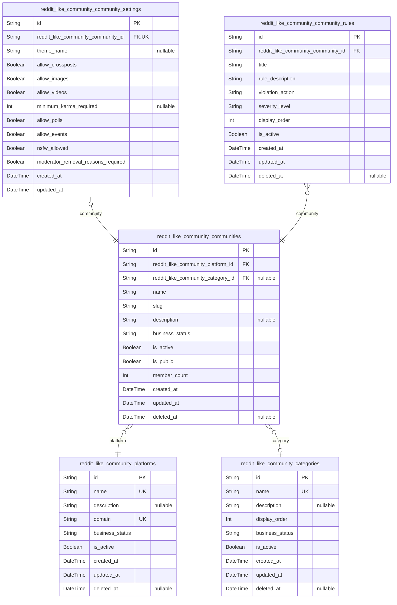
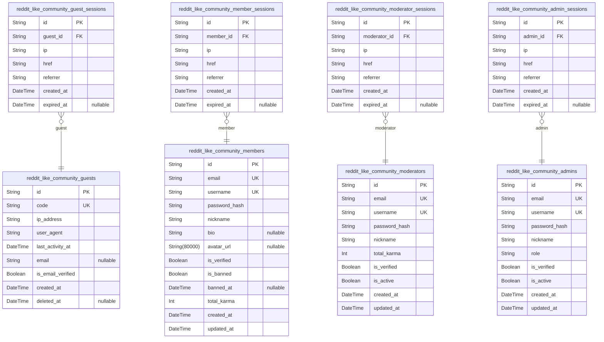
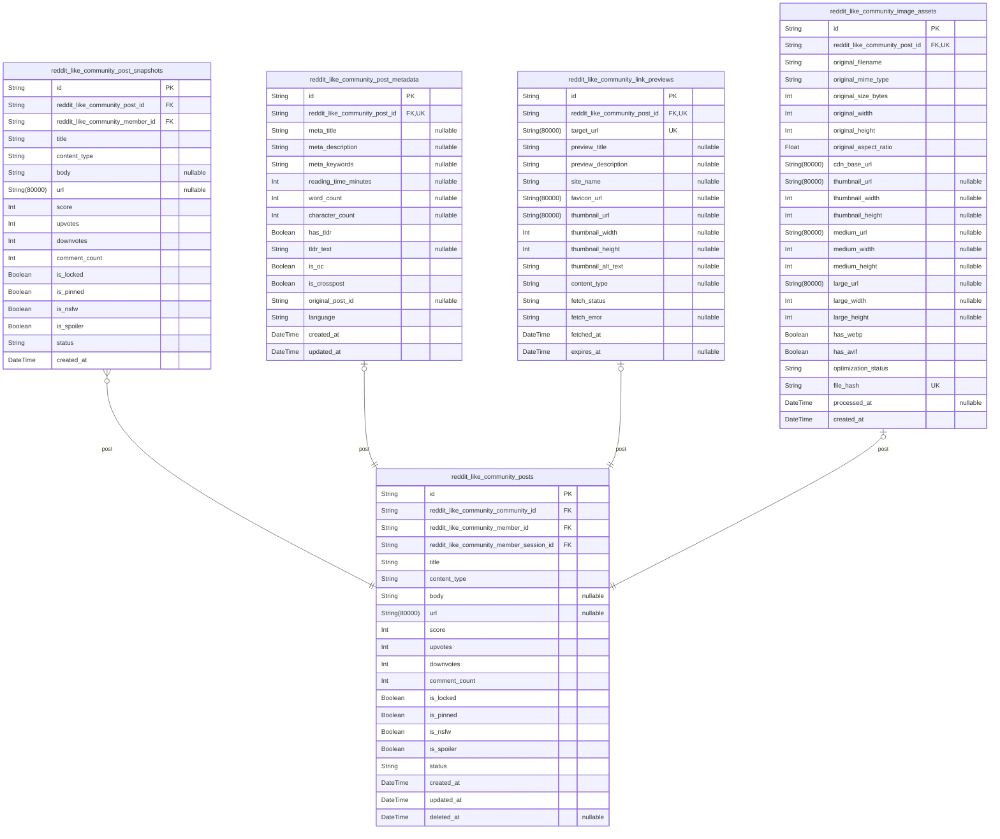
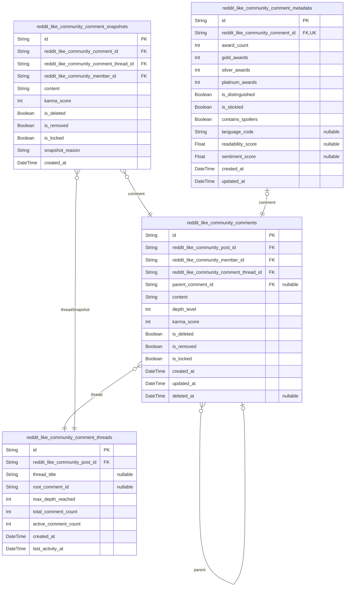
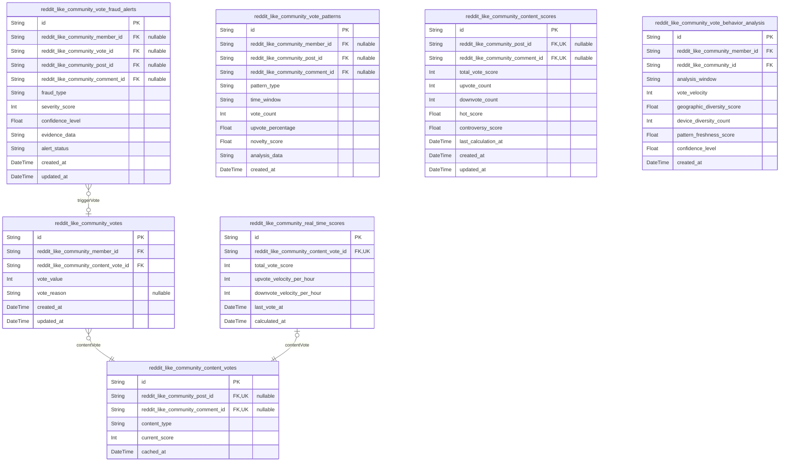
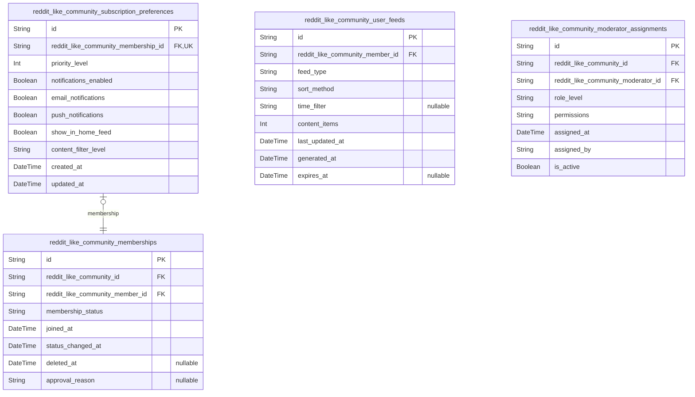
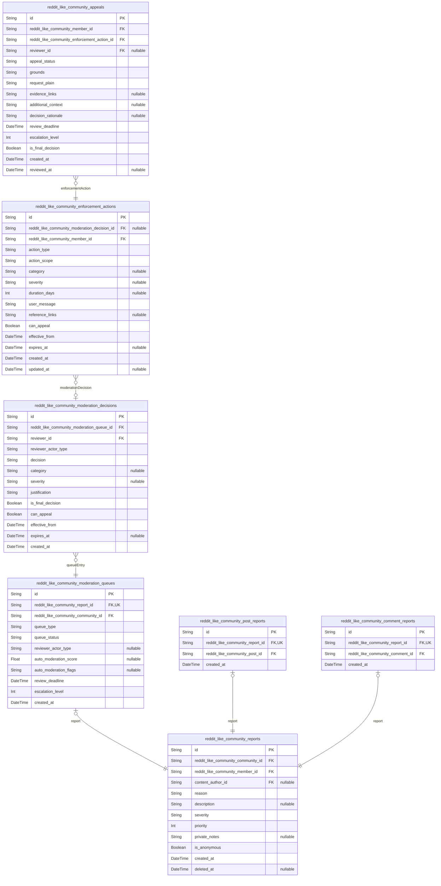
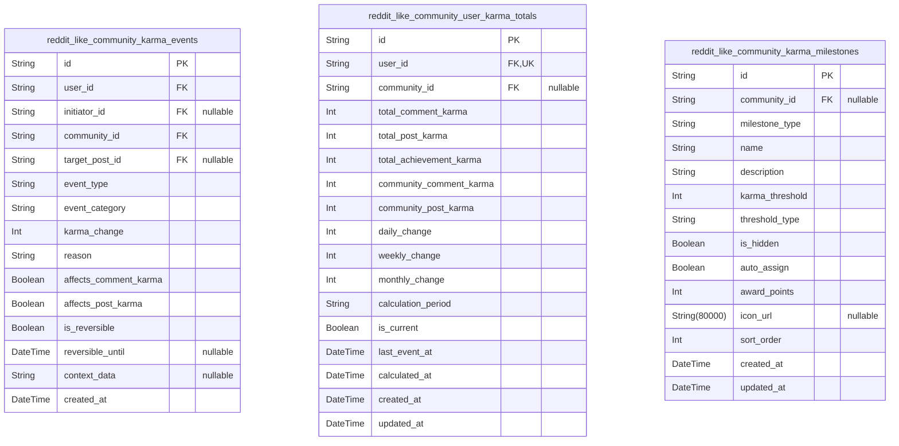
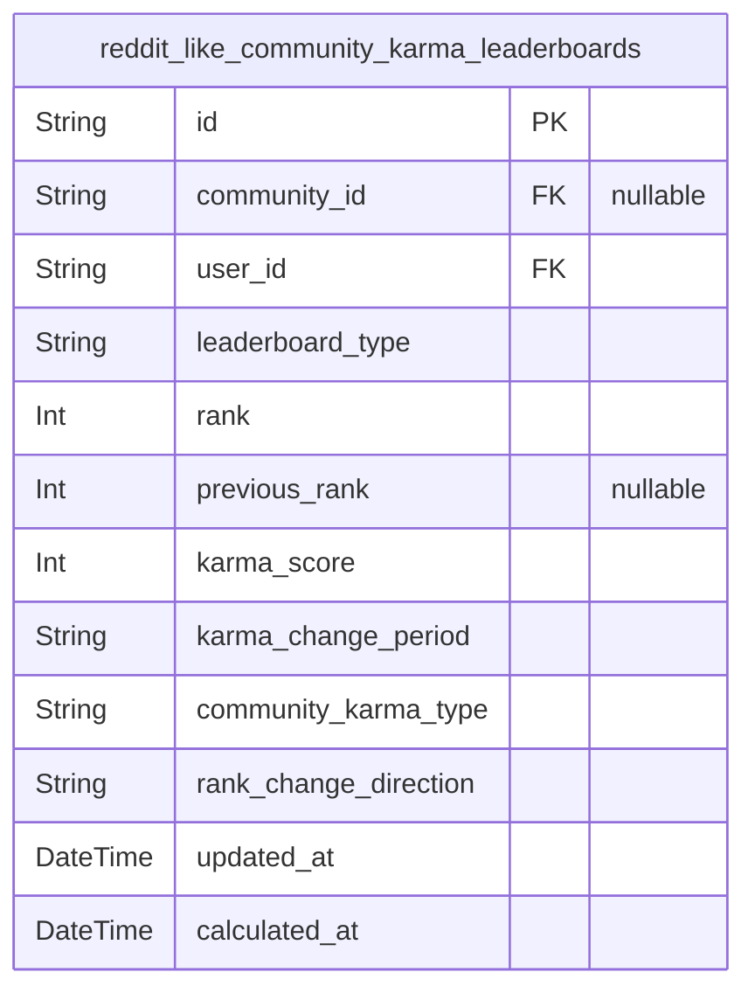

# Prisma Markdown

> Generated by [`prisma-markdown`](https://github.com/samchon/prisma-markdown)

- [Systematic](#systematic)
- [Actors](#actors)
- [Content](#content)
- [Comments](#comments)
- [Voting](#voting)
- [Community](#community)
- [Moderation](#moderation)
- [Karma](#karma)
- [default](#default)

## Systematic

### `reddit_like_community_platforms`

Core platform configuration and settings for the Reddit-like community
platform. This represents the highest level of the system configuration
including platform-wide settings, branding, operational parameters, and
authentication configuration.

Properties as follows:

- `id`: Primary Key.
- `name`: Platform name displayed to users. Must be unique across the platform.
- `description`: Platform description or tagline explaining the platform's purpose.
- `domain`
  > Primary domain for the platform. Used for URLs and branding. Must be
  > unique.
- `business_status`: Platform operational status: active, maintenance, closed, or suspended.
- `is_active`: Whether the platform is active and accessible to users.
- `created_at`: Timestamp when the platform was created.
- `updated_at`: Timestamp when the platform was last updated.
- `deleted_at`
  > Timestamp when the platform was soft deleted for permanent removal
  > capability.

### `reddit_like_community_categories`

Community categorization system for organizing communities into logical
hierarchical groupings. Categories help users discover communities of
interest and provide structure for community discovery while maintaining
platform-wide organization.

Properties as follows:

- `id`: Primary Key.
- `name`: Category name for organizing communities. Must be unique platform-wide.
- `description`
  > Category description explaining its purpose and the types of communities
  > it contains.
- `display_order`
  > Display order for categories when showing multiple categories to users.
  > Higher numbers appear first.
- `business_status`: Category operational status: active, archived, or deprecated.
- `is_active`: Whether the category is active, visible, and discoverable by users.
- `created_at`: Timestamp when the category was created.
- `updated_at`: Timestamp when the category was last updated.
- `deleted_at`: Timestamp when the category was soft deleted for audit trail purposes.

### `reddit_like_community_communities`

Individual community entities where users can share content, engage in
discussions, and build communities around shared interests. Communities
are the foundation of the platform's content organization and support
various content types, membership models, and governance structures.

Properties as follows:

- `id`: Primary Key.
- `reddit_like_community_platform_id`
  > Platform that owns this community. References
  > reddit_like_community_platforms.id for multi-tenant support.
- `reddit_like_community_category_id`
  > Category that this community belongs to for organization and discovery.
  > References reddit_like_community_categories.id.
- `name`
  > Community name displayed to users and used for internal identification.
  > Must be unique within its platform.
- `slug`
  > URL-friendly version of the community name used in URLs and routing. Must
  > be unique within the platform.
- `description`
  > Community description explaining its purpose, topics, and culture.
  > Maximum 1000 characters.
- `business_status`
  > Community lifecycle status: draft, active, restricted, archived, or
  > suspended.
- `is_active`: Whether the community is currently active and accessible to users.
- `is_public`
  > Whether the community is publicly discoverable and joinable without
  > approval.
- `member_count`
  > Current number of approved members in the community. Updated via
  > membership events.
- `created_at`: Timestamp when the community was created by its founder.
- `updated_at`: Timestamp when the community's metadata or status was last updated.
- `deleted_at`
  > Timestamp when the community was soft deleted for policy compliance and
  > audit trails.

### `reddit_like_community_community_settings`

Community-specific configuration and behavior settings that customize the
community experience. This subsidiary table stores individual community
preferences including posting rules, visual themes, moderation settings,
and content restrictions that allow each community to maintain its unique
culture while operating within platform guidelines.

Properties as follows:

- `id`: Primary Key.
- `reddit_like_community_community_id`
  > Community that these settings belong to. References
  > reddit_like_community_communities.id.
- `theme_name`
  > Visual theme name for community customization and branding. Null for
  > default platform theme.
- `allow_crossposts`
  > Whether users are allowed to crosspost content from this community to
  > other communities.
- `allow_images`: Whether image uploads are allowed in posts for this community.
- `allow_videos`: Whether video uploads are allowed in posts for this community.
- `minimum_karma_required`
  > Minimum karma score required for users to post in this community. Null
  > for no restriction.
- `allow_polls`: Whether poll-style posts are enabled in this community.
- `allow_events`: Whether community events and AMA sessions are enabled for this community.
- `nsfw_allowed`: Whether Not Safe For Work content is permitted in this community.
- `moderator_removal_reasons_required`
  > Whether moderators must provide detailed reasons when removing content
  > from this community.
- `created_at`: When this community's settings configuration was created.
- `updated_at`: When these settings were last modified by a moderator.

### `reddit_like_community_community_rules`

Community rules and guidelines that define acceptable behavior, content
standards, and enforcement policies. Rules provide clear community
governance by establishing expectations for member behavior and
consequences for violations while supporting platform-wide safety
standards.

Properties as follows:

- `id`: Primary Key.
- `reddit_like_community_community_id`
  > Community that these rules apply to. References
  > reddit_like_community_communities.id.
- `title`
  > Short, clear title for the community rule displayed to members. Maximum
  > 200 characters.
- `rule_description`
  > Detailed description explaining the rule, its rationale, and specific
  > behaviors it governs.
- `violation_action`
  > Enforcement action taken when rule is violated: warn, remove, ban, or
  > escalate.
- `severity_level`
  > Rule severity classification: low, moderate, high, severe affecting
  > enforcement priority.
- `display_order`
  > Display order for rules when shown to community members. Lower numbers
  > appear first.
- `is_active`: Whether this rule is currently enforced and visible to community members.
- `created_at`: Timestamp when the rule was created by a community moderator.
- `updated_at`: Timestamp when the rule description or severity was last modified.
- `deleted_at`: Timestamp when the rule was deprecated or removed by community leadership.

## Actors

### `reddit_like_community_guests`

Guest users who can browse public content without registration. Guests
represent the entry point of the user journey, allowing content discovery
before requiring commitment to register.

Properties as follows:

- `id`: Primary Key.
- `code`
  > Unique guest identifier used for tracking guest sessions and browsing
  > behavior.
- `ip_address`: IP address for session management and basic analytics tracking.
- `user_agent`: Browser user agent string for analytics and compatibility tracking.
- `last_activity_at`: Timestamp of the last activity from this guest for session management.
- `email`: Optional email address for notifications when provided by guest users.
- `is_email_verified`: Whether the guest email has been verified when provided.
- `created_at`: Timestamp when the guest session was created.
- `deleted_at`: Timestamp when the guest session was soft deleted.

### `reddit_like_community_guest_sessions`

Guest session tracking for anonymous user activity monitoring. Manages
guest authentication sessions through secure cookie-based tracking.

Properties as follows:

- `id`: Primary Key.
- `guest_id`: Guest user's [reddit_like_community_guests.id](#reddit_like_community_guests)
- `ip`: IP address for session management and security tracking.
- `href`: Connection URL for session tracking and auditing.
- `referrer`: Referrer URL for tracking user navigation patterns.
- `created_at`: Session creation timestamp for session management.
- `expired_at`: Session expiration timestamp for security and cleanup.

### `reddit_like_community_members`

Community members who actively participate in communities through
posting, commenting, and voting. Members form the core user base of the
platform.

Properties as follows:

- `id`: Primary Key.
- `email`: Member's email address used for authentication and notifications.
- `username`: Member's unique public username for community participation.
- `password_hash`: Hashed password for authentication security.
- `nickname`: Member's display name for community interactions.
- `bio`: Member's biography for community profile.
- `avatar_url`: URL to member's profile avatar image.
- `is_verified`: Whether the member's email address has been verified.
- `is_banned`: Whether the member is currently banned from the platform.
- `banned_at`: Timestamp when the member was banned, if applicable.
- `total_karma`: Member's total karma score from posts and comments.
- `created_at`: Timestamp when the member registered.
- `updated_at`: Timestamp of the last profile update.

### `reddit_like_community_member_sessions`

Member authentication sessions for tracking user login activity and
maintaining secure access to the platform.

Properties as follows:

- `id`: Primary Key.
- `member_id`: Member's [reddit_like_community_members.id](#reddit_like_community_members)
- `ip`: IP address for session management and security monitoring.
- `href`: Connection URL for session tracking and auditing.
- `referrer`: Referrer URL for tracking user navigation patterns.
- `created_at`: Session creation timestamp for session management.
- `expired_at`: Session expiration timestamp for security.

### `reddit_like_community_moderators`

Community moderators who manage and moderate individual communities.
Moderators have elevated permissions for content management and user
oversight within their assigned communities.

Properties as follows:

- `id`: Primary Key.
- `email`: Moderator's email address used for authentication.
- `username`: Moderator's unique public username for platform visibility.
- `password_hash`: Hashed password for authentication security.
- `nickname`: Moderator's display name for community interactions.
- `total_karma`: Moderator's total karma score from platform activities.
- `is_verified`: Whether the moderator's email has been verified.
- `is_active`: Whether the moderator is currently active and authorized.
- `created_at`: Timestamp when the moderator registered.
- `updated_at`: Timestamp of the last profile update.

### `reddit_like_community_moderator_sessions`

Moderator authentication sessions for tracking admin-level access and
maintaining security for elevated privileges.

Properties as follows:

- `id`: Primary Key.
- `moderator_id`: Moderator's [reddit_like_community_moderators.id](#reddit_like_community_moderators)
- `ip`: IP address for session management and security monitoring.
- `href`: Connection URL for session tracking and auditing.
- `referrer`: Referrer URL for tracking user navigation patterns.
- `created_at`: Session creation timestamp for session management.
- `expired_at`: Session expiration timestamp for security.

### `reddit_like_community_admins`

Platform administrators who have system-wide permissions for managing the
entire platform. Admins oversee community operations, user management,
and platform policies.

Properties as follows:

- `id`: Primary Key.
- `email`: Admin's email address used for authentication and notifications.
- `username`: Admin's unique public username for platform administration.
- `password_hash`: Hashed password for authentication security.
- `nickname`: Admin's display name for platform interactions.
- `role`: Admin role level determining permissions (super_admin, admin, support).
- `is_verified`: Whether the admin's email has been verified.
- `is_active`: Whether the admin is currently active and authorized.
- `created_at`: Timestamp when the admin was added to the system.
- `updated_at`: Timestamp of the last profile update.

### `reddit_like_community_admin_sessions`

Administrator authentication sessions for high-privilege access tracking
and maintaining security oversight for platform management operations.

Properties as follows:

- `id`: Primary Key.
- `admin_id`: Administrator's [reddit_like_community_admins.id](#reddit_like_community_admins)
- `ip`: IP address for session management and security monitoring.
- `href`: Connection URL for session tracking and auditing.
- `referrer`: Referrer URL for tracking user navigation patterns.
- `created_at`: Session creation timestamp for session management.
- `expired_at`: Session expiration timestamp for security.

## Content

### `reddit_like_community_posts`

Primary content entities representing posts created by users in
communities. Posts are the core content type that users interact with
through voting, commenting, and sharing. They support multiple content
types (text, link, image) and are the foundation of the platform's
content ecosystem.

Properties as follows:

- `id`: Primary Key.
- `reddit_like_community_community_id`: Belonged community's [reddit_like_community_communities.id](#reddit_like_community_communities)
- `reddit_like_community_member_id`: Post author's [reddit_like_community_members.id](#reddit_like_community_members)
- `reddit_like_community_member_session_id`
  > Session when post was created {@link
  > reddit_like_community_member_sessions.id}
- `title`: Post title displayed in listings and at the top of the post
- `content_type`: Content type: text, link, or image determining how content is displayed
- `body`: Main content body for text posts, optional for link/image posts
- `url`: External URL for link posts, null for text/image posts
- `score`: Current vote score calculated from upvotes minus downvotes
- `upvotes`: Total number of upvotes received
- `downvotes`: Total number of downvotes received
- `comment_count`: Number of comments on this post
- `is_locked`: Whether commenting is locked on this post
- `is_pinned`: Whether this post is pinned in its community
- `is_nsfw`: Whether this post contains adult content
- `is_spoiler`: Whether this post contains spoilers requiring hidden content
- `status`: Post status: active, removed, deleted, or flagged for moderation
- `created_at`: When the post was created
- `updated_at`: When the post was last modified
- `deleted_at`: When the post was deleted (soft delete)

### `reddit_like_community_post_snapshots`

Historical snapshots of post states for audit trails and content
versioning. These append-only records preserve the state of posts at
specific points in time, supporting moderation review and content
integrity verification.

Properties as follows:

- `id`: Primary Key.
- `reddit_like_community_post_id`: Referenced post's [reddit_like_community_posts.id](#reddit_like_community_posts)
- `reddit_like_community_member_id`: User who created this snapshot [reddit_like_community_members.id](#reddit_like_community_members)
- `title`: Snapshot of post title at time of record creation
- `content_type`: Snapshot of content type
- `body`: Snapshot of post body content
- `url`: Snapshot of external URL if present
- `score`: Snapshot of vote score at creation time
- `upvotes`: Snapshot of upvote count
- `downvotes`: Snapshot of downvote count
- `comment_count`: Snapshot of comment count
- `is_locked`: Snapshot of locked status
- `is_pinned`: Snapshot of pinned status
- `is_nsfw`: Snapshot of NSFW status
- `is_spoiler`: Snapshot of spoiler status
- `status`: Snapshot of post status
- `created_at`: When this snapshot was created

### `reddit_like_community_post_metadata`

Extended metadata attributes for posts including SEO information,
engagement metrics, and content-specific properties. This subsidiary
table supports the main posts table with additional data that may vary by
content type.

Properties as follows:

- `id`: Primary Key.
- `reddit_like_community_post_id`: Associated post's [reddit_like_community_posts.id](#reddit_like_community_posts)
- `meta_title`: SEO-optimized title for search engines and social sharing
- `meta_description`: SEO-optimized description for search engine snippets
- `meta_keywords`: Comma-separated keywords for SEO optimization
- `reading_time_minutes`: Estimated reading time in minutes for text content
- `word_count`: Word count for text posts
- `character_count`: Character count including spaces
- `has_tldr`: Whether the post includes a TL;DR summary
- `tldr_text`: Too long; didn't read summary text
- `is_oc`: Whether this is original content created by the author
- `is_crosspost`: Whether this is a crosspost from another community
- `original_post_id`: Original post ID if this is a crosspost
- `language`: Content language code (ISO 639-1)
- `created_at`: When metadata was created
- `updated_at`: When metadata was last updated

### `reddit_like_community_link_previews`

Pre-fetched link preview data for link posts including title,
description, and thumbnail information. This improves user experience by
displaying rich previews without requiring external fetches on each view.

Properties as follows:

- `id`: Primary Key.
- `reddit_like_community_post_id`: Associated link post's [reddit_like_community_posts.id](#reddit_like_community_posts)
- `target_url`: The original URL that was processed
- `preview_title`: Extracted or generated title for the link preview
- `preview_description`: Extracted or generated description for the link preview
- `site_name`: Name of the website or domain
- `favicon_url`: URL to the site's favicon or logo
- `thumbnail_url`: URL to thumbnail image for the preview
- `thumbnail_width`: Width of thumbnail image in pixels
- `thumbnail_height`: Height of thumbnail image in pixels
- `thumbnail_alt_text`: Alt text for thumbnail image accessibility
- `content_type`: MIME type of the linked content
- `fetch_status`: Status of link preview fetch: success, failed, pending, expired
- `fetch_error`: Error message if fetch failed
- `fetched_at`: When the link preview data was fetched
- `expires_at`: When this preview data expires and should be refetched

### `reddit_like_community_image_assets`

Image processing and storage metadata for image posts including multiple
size variants, optimization settings, and CDN references. Supports
efficient delivery across devices and network conditions.

Properties as follows:

- `id`: Primary Key.
- `reddit_like_community_post_id`: Associated image post's [reddit_like_community_posts.id](#reddit_like_community_posts)
- `original_filename`: Original filename when uploaded
- `original_mime_type`: MIME type of the original uploaded file
- `original_size_bytes`: Size of original file in bytes
- `original_width`: Width of original image in pixels
- `original_height`: Height of original image in pixels
- `original_aspect_ratio`: Aspect ratio of original image (width/height)
- `cdn_base_url`: Base CDN URL for serving image variants
- `thumbnail_url`: URL to thumbnail variant for listings
- `thumbnail_width`: Width of thumbnail in pixels
- `thumbnail_height`: Height of thumbnail in pixels
- `medium_url`: URL to medium-sized variant for content pages
- `medium_width`: Width of medium variant in pixels
- `medium_height`: Height of medium variant in pixels
- `large_url`: URL to large variant for detail views
- `large_width`: Width of large variant in pixels
- `large_height`: Height of large variant in pixels
- `has_webp`: Whether WebP variants are available for better compression
- `has_avif`: Whether AVIF variants are available for modern browsers
- `optimization_status`: Status of image optimization: pending, processing, complete, failed
- `file_hash`: SHA256 hash of the original file for deduplication
- `processed_at`: When image processing was completed
- `created_at`: When the image asset record was created

## Comments

### `reddit_like_community_comments`

Primary comments entity for the Reddit-like community platform supporting
nested threaded discussions up to 10 levels deep. Represents
user-generated comments on posts with full content management, voting
integration, and thread hierarchy management.

Properties as follows:

- `id`: Primary Key.
- `reddit_like_community_post_id`
  > The post this comment belongs to. References {@link
  > reddit_like_community_posts.id}.
- `reddit_like_community_member_id`
  > The member who created this comment. References {@link
  > reddit_like_community_members.id}.
- `reddit_like_community_comment_thread_id`
  > The thread this comment belongs to. References {@link
  > reddit_like_community_comment_threads.id}.
- `parent_comment_id`
  > Reference to parent comment for nested replies. Self-referencing foreign
  > key for threaded discussions.
- `content`
  > The text content of the comment. Supports up to 10,000 characters with
  > basic text formatting.
- `depth_level`
  > The nesting depth of this comment in the thread hierarchy. Ranges from 0
  > to 10 for nested replies.
- `karma_score`
  > Current karma score calculated from upvotes minus downvotes. Used for
  > comment sorting and display.
- `is_deleted`
  > Soft deletion flag. When true, comment content is hidden but thread
  > structure is preserved.
- `is_removed`
  > Moderation removal flag. When true, comment was removed by moderators for
  > policy violations.
- `is_locked`
  > Prevents further replies to this comment. Used by moderators to stop
  > discussion threads.
- `created_at`: Timestamp when the comment was created.
- `updated_at`
  > Timestamp of the last content update. Updated when comment is edited or
  > moderated.
- `deleted_at`
  > Timestamp when the comment was soft deleted. Used for audit and potential
  > recovery.

### `reddit_like_community_comment_snapshots`

Historical snapshots of comments capturing their state at specific points
in time. Enables audit trails, version tracking, and change history for
all comment modifications including content edits and moderation actions.

Properties as follows:

- `id`: Primary Key.
- `reddit_like_community_comment_id`
  > The comment this snapshot represents. References {@link
  > reddit_like_community_comments.id}.
- `reddit_like_community_comment_thread_id`
  > The thread snapshot associated with this comment snapshot. References
  > [reddit_like_community_comment_threads.id](#reddit_like_community_comment_threads).
- `reddit_like_community_member_id`
  > The member who made this change (editing or moderation). References
  > [reddit_like_community_members.id](#reddit_like_community_members).
- `content`
  > The comment content at the time this snapshot was created. Preserves
  > historical text state.
- `karma_score`
  > The karma score at snapshot time. Captures voting state for historical
  > analysis.
- `is_deleted`
  > Deletion state at snapshot time. Tracks when soft deletion occurred
  > historically.
- `is_removed`
  > Moderation removal state at snapshot time. Records moderator actions over
  > time.
- `is_locked`
  > Lock state at snapshot time. Tracks when discussion threads were
  > moderated.
- `snapshot_reason`
  > Reason for creating this snapshot. Values include: 'edit', 'moderation',
  > 'system' etc.
- `created_at`
  > When this snapshot was created. Represents the point-in-time capture
  > moment.

### `reddit_like_community_comment_threads`

Manages comment thread hierarchy and organization for nested discussions
up to 10 levels deep. Provides thread-level metadata and structural
organization for complex comment trees on posts.

Properties as follows:

- `id`: Primary Key.
- `reddit_like_community_post_id`
  > The post this thread belongs to. References {@link
  > reddit_like_community_posts.id}.
- `thread_title`
  > Optional title for the thread root. Can summarize the discussion topic or
  > theme.
- `root_comment_id`
  > Optional reference to the root comment that started this thread. Allows
  > thread organization.
- `max_depth_reached`
  > Maximum nesting depth achieved in this thread. Tracks how deep
  > discussions go beyond limit.
- `total_comment_count`: Total number of comments in this thread including all nested replies.
- `active_comment_count`
  > Count of non-deleted and non-removed comments currently active in the
  > thread.
- `created_at`: When this thread structure was created.
- `last_activity_at`: Timestamp of the most recent comment or update in this thread.

### `reddit_like_community_comment_metadata`

Stores additional metadata and properties for comments that don't belong
in the main comments table. Supports extensible comment features like
awards, extra formatting, and community-specific comment attributes.

Properties as follows:

- `id`: Primary Key.
- `reddit_like_community_comment_id`
  > The comment this metadata belongs to. References {@link
  > reddit_like_community_comments.id}.
- `award_count`: Number of awards this comment has received from other users.
- `gold_awards`
  > Count of gold-tier awards received. Used for community recognition
  > systems.
- `silver_awards`
  > Count of silver-tier awards received. Used for community recognition
  > systems.
- `platinum_awards`
  > Count of platinum-tier awards received. Used for premium recognition
  > systems.
- `is_distinguished`
  > Whether this comment is distinguished by moderators. Highlights official
  > moderator responses.
- `is_stickied`
  > Whether this comment is stickied to the top of threads. Used for
  > important announcements.
- `contains_spoilers`
  > Whether this comment contains spoiler content that should be hidden by
  > default.
- `language_code`
  > ISO 639-1 language code of the comment content. Enables multilingual
  > community support.
- `readability_score`
  > Automated readability score of the comment content. Used for content
  > quality analysis.
- `sentiment_score`
  > Automated sentiment analysis score ranging from -1.0 (negative) to 1.0
  > (positive).
- `created_at`: When this metadata record was created.
- `updated_at`: When this metadata was last updated.

## Voting

### `reddit_like_community_votes`

Core voting records tracking all upvote and downvote actions on posts and
comments. This table maintains the democratic content curation mechanism
of the Reddit-like community platform, recording immediate voting actions
while enabling real-time score updates and historical analysis. Each vote
targets exactly one content type through exclusive-or foreign key
relationships ensuring data integrity.

Properties as follows:

- `id`: Primary Key.
- `reddit_like_community_member_id`: The member who cast this vote. References reddit_like_community_members.id
- `reddit_like_community_content_vote_id`
  > The content (post or comment) being voted on through the content_vote
  > relationship table
- `vote_value`: The voting direction: 1 for upvote, -1 for downvote
- `vote_reason`: Optional reason for vote selection supporting sentiment analysis
- `created_at`
  > Timestamp when the vote was cast for chronological analysis and real-time
  > updates
- `updated_at`
  > Timestamp of the most recent vote change for tracking modifications and
  > audit

### `reddit_like_community_vote_fraud_alerts`

Fraud detection alerts capturing suspicious voting patterns and potential
manipulation attempts. This table maintains an audit trail of unusual
voting behavior detected through pattern analysis, rate limiting
violations, or coordinated voting activities. Alerts are classified by
type and severity to enable graduated response mechanisms and mitigation
strategies.

Properties as follows:

- `id`: Primary Key.
- `reddit_like_community_member_id`
  > The member associated with the fraudulent activity (suspected
  > manipulator). References [reddit_like_community_members.id](#reddit_like_community_members)
- `reddit_like_community_vote_id`
  > The specific vote that triggered the fraud alert. References {@link
  > reddit_like_community_votes.id}
- `reddit_like_community_post_id`
  > The content targeted by suspected manipulation. References {@link
  > reddit_like_community_posts.id}
- `reddit_like_community_comment_id`
  > The comment targeted by suspected manipulation. References {@link
  > reddit_like_community_comments.id}
- `fraud_type`
  > Classification of fraud type: 'rate_violation', 'brigade', 'coordinated',
  > 'self_vote', 'bot_activity', 'ip_cluster'. Enables targeted response
  > strategies and pattern analysis.
- `severity_score`
  > Severity rating from 1-10 indicating manipulation risk level. Higher
  > scores trigger more aggressive mitigation responses and faster
  > investigative timelines.
- `confidence_level`
  > Algorithmic confidence level (0.0-1.0) indicating fraud detection
  > certainty. Used for escalation thresholds and challenge/response
  > mechanisms.
- `evidence_data`
  > Serialized evidence supporting the fraud alert including IP patterns,
  > timing analysis, vote velocity data, and account clustering indicators.
- `alert_status`
  > Current status of fraud investigation: 'open', 'investigating',
  > 'mitigated', 'resolved', 'false_positive'. Tracks investigation lifecycle
  > and response effectiveness.
- `created_at`
  > When the fraud alert was generated by detection algorithms. Used for
  > investigation timelines and escalation procedures.
- `updated_at`
  > Last modification of alert status or evidence. Tracks investigation
  > progress and resolution times.

### `reddit_like_community_vote_patterns`

Statistical pattern analysis for voting behavior providing comprehensive
monitoring capabilities. This table aggregates voting data across time
windows and user segments to identify emerging trends, baseline metrics,
and anomalous deviations that may indicate manipulation attempts.
Patterns are computed via periodic analysis to enable proactive detection
while maintaining system responsiveness.

Properties as follows:

- `id`: Primary Key.
- `reddit_like_community_member_id`
  > The member whose voting patterns are being analyzed. References {@link
  > reddit_like_community_members.id} for user-specific pattern detection.
- `reddit_like_community_post_id`
  > The post being analyzed for voting patterns. References {@link
  > reddit_like_community_posts.id} for content-specific anomaly detection.
- `reddit_like_community_comment_id`
  > The comment being analyzed for voting patterns. References {@link
  > reddit_like_community_comments.id} for comment-specific pattern tracking.
- `pattern_type`
  > Type of pattern being tracked: 'baseline', 'trending', 'baseline_user',
  > 'anomaly'. Defines analysis methodology and alerting thresholds.
- `time_window`
  > Time period for pattern analysis: 'hour', 'day', 'week', 'month'. Enables
  > temporal pattern detection and comparative analysis.
- `vote_count`
  > Total number of votes captured in this pattern analysis window. Used for
  > percentage calculations and baseline establishment.
- `upvote_percentage`
  > Percentage of upvotes within the analysis window (0.0-1.0). Used for
  > trend analysis and anomaly detection.
- `novelty_score`
  > Statistical novelty indicating deviation from expected patterns
  > (0.0=normal, 1.0=highly unusual). Triggers investigation thresholds.
- `analysis_data`
  > Serialized statistical data including velocity metrics, geographic
  > distribution, device diversity, and behavioral indicators for
  > comprehensive analysis.
- `created_at`
  > When this pattern analysis was computed. Used for trend tracking and
  > analysis scheduling.

### `reddit_like_community_content_scores`

Real-time computed scores for posts and comments enabling efficient
content curation and discovery. This table maintains pre-calculated vote
aggregation metrics optimized for high-performance queries supporting
personalized feeds, community sorting, and trending algorithms. Scores
are updated periodically through background processing to balance
accuracy with system performance.

Properties as follows:

- `id`: Primary Key.
- `reddit_like_community_post_id`
  > The post being scored. References [reddit_like_community_posts.id](#reddit_like_community_posts).
  > Unique constraint ensures optimized lookup performance.
- `reddit_like_community_comment_id`
  > The comment being scored. References {@link
  > reddit_like_community_comments.id}. Unique constraint ensures efficient
  > query performance.
- `total_vote_score`
  > Aggregated vote score (upvotes - downvotes) for content. Used as primary
  > sorting metric in content discovery algorithms.
- `upvote_count`
  > Total number of upvotes received. Used for engagement metrics and
  > percentage calculations.
- `downvote_count`
  > Total number of downvotes received. Provides complete vote transparency
  > and supports controversial content identification.
- `hot_score`
  > Reddit-style hotness score factoring in vote velocity and time decay.
  > Enables trending content identification with community-specific
  > algorithms.
- `controversy_score`
  > Metric indicating vote divisiveness (high updown vote variance). Used for
  > identifying discussion-worthy content likely to generate engagement.
- `last_calculation_at`
  > When this score was last updated by aggregation process. Used for
  > freshness validation and recalculation scheduling.
- `created_at`
  > When this score entry was originally computed. Provides audit trail for
  > score computation history.
- `updated_at`
  > Timestamp of the most recent score adjustment. Enables cache invalidation
  > and update notifications.

### `reddit_like_community_content_votes`

Content vote mapping table that resolves the content type (post or
comment) for each vote through polymorphic relationship. This design
maintains proper 3NF normalization by separating the vote content
relationship from vote metadata, enabling efficient aggregation queries
while preventing orphaned vote records.

Properties as follows:

- `id`: Primary Key.
- `reddit_like_community_post_id`: The post being voted on. References reddit_like_community_posts.id
- `reddit_like_community_comment_id`: The comment being voted on. References reddit_like_community_comments.id
- `content_type`: Type of content being voted on: 'post' or 'comment' for validation
- `current_score`: Current vote score maintaining real-time totals after each vote
- `cached_at`: When this score was last updated through vote aggregation process

### `reddit_like_community_vote_behavior_analysis`

Comprehensive behavioral analysis for sophisticated voter behavior
pattern detection. This primary entity stores atomic voter statistics and
temporal patterns supporting machine learning integration for fraud
detection while maintaining audit trails for investigation and trend
analysis.

Properties as follows:

- `id`: Primary Key.
- `reddit_like_community_member_id`: Member whose voting behavior is being analyzed
- `reddit_like_community_id`
  > Community context for behavior analysis supporting community-specific
  > patterns
- `analysis_window`
  > Time period analyzed: 'hour', 'day', 'week', 'month' for temporal pattern
  > detection
- `vote_velocity`: Rate of voting actions per minute enabling spam and bot detection
- `geographic_diversity_score`
  > Geographic distribution score from 0.0 to 1.0 indicating coordinated
  > behavior
- `device_diversity_count`
  > Number of unique devices used for voting supporting authentic behavior
  > detection
- `pattern_freshness_score`
  > Novelty indicator from 0.0 to 1.0 for identifying emerging manipulation
  > patterns
- `confidence_level`: Analysis confidence score helping determine investigation priority
- `created_at`: When this behavior analysis was computed providing audit trail

### `reddit_like_community_real_time_scores`

Real-time computed scores for posts and comments optimized for
high-performance content curation and discovery queries. This subsidiary
table maintains pre-calculated vote aggregation metrics updated through
event-driven architecture supporting personalized feeds, community
sorting algorithms, and trending content identification with sub-500ms
response requirements.

Properties as follows:

- `id`: Primary Key.
- `reddit_like_community_content_vote_id`: The content vote mapping record this score belongs to
- `total_vote_score`: Aggregated vote score from upvotes minus downvotes for content ranking
- `upvote_velocity_per_hour`: Rate of upvotes per hour enabling real-time trending detection
- `downvote_velocity_per_hour`: Rate of downvotes per hour supporting anomaly detection
- `last_vote_at`: Timestamp of the most recent vote affecting this score for freshness
- `calculated_at`: When this score was last recalculated through aggregation process

## Community

### `reddit_like_community_memberships`

User-community relationship management including membership status, join
permissions, and access controls for both public and private communities.
Tracks when users join communities, their current status (active,
pending, banned), and community-specific permissions beyond basic
platform permissions.

Properties as follows:

- `id`: Primary Key.
- `reddit_like_community_id`: Belonged community's [reddit_like_community_communities.id](#reddit_like_community_communities)
- `reddit_like_community_member_id`: Member user's [reddit_like_community_members.id](#reddit_like_community_members)
- `membership_status`
  > Current membership status: active, pending, banned, or left. Pending
  > status is used for private communities requiring approval.
- `joined_at`: Timestamp when the user joined or requested to join the community.
- `status_changed_at`
  > Timestamp of the last status change for audit trail and membership
  > history.
- `deleted_at`
  > Soft delete timestamp for membership removal without losing historical
  > data.
- `approval_reason`
  > Optional reason provided by moderators when approving private community
  > join requests.

### `reddit_like_community_subscription_preferences`

User-specific subscription settings and preferences for each subscribed
community including notification preferences, display settings, and
personalization options. Enables granular control over how community
content appears in feeds and notifications.

Properties as follows:

- `id`: Primary Key.
- `reddit_like_community_membership_id`: Associated membership's [reddit_like_community_memberships.id](#reddit_like_community_memberships)
- `priority_level`
  > Subscription priority level (1-10) affecting feed ranking and
  > notification urgency. Higher numbers indicate higher priority.
- `notifications_enabled`
  > Whether to send notifications for new posts and comments in this
  > community.
- `email_notifications`: Whether to send email notifications for this community's activity.
- `push_notifications`: Whether to send push notifications for this community's activity.
- `show_in_home_feed`: Whether community content appears in the user's main home feed.
- `content_filter_level`: Content filtering preference: all, popular, or recommended content only.
- `created_at`: When these subscription preferences were created.
- `updated_at`: When these subscription preferences were last modified.

### `reddit_like_community_user_feeds`

Personalized content feeds generated for each user based on their
subscriptions, preferences, and platform activity. Stores cached feed
data for performance optimization with automatic updates when new content
is available or user preferences change.

Properties as follows:

- `id`: Primary Key.
- `reddit_like_community_member_id`: Feed owner's [reddit_like_community_members.id](#reddit_like_community_members)
- `feed_type`: Type of feed: home, best, popular, or custom feed identifier.
- `sort_method`: Content sorting method: hot, new, top, rising, or controversial.
- `time_filter`: Time filter for content: hour, day, week, month, year, or all.
- `content_items`: Number of content items currently in this feed view.
- `last_updated_at`: When this feed was last refreshed with new content or preference changes.
- `generated_at`: When this feed version was originally generated for performance tracking.
- `expires_at`: When this cached feed expires and needs regeneration.

### `reddit_like_community_moderator_assignments`

Community moderator appointments including role assignments, permissions,
and community governance structures. Supports multiple moderator levels
and permission hierarchies within individual communities.

Properties as follows:

- `id`: Primary Key.
- `reddit_like_community_id`: Moderated community's [reddit_like_community_communities.id](#reddit_like_community_communities)
- `reddit_like_community_moderator_id`: Assigned moderator's [reddit_like_community_moderators.id](#reddit_like_community_moderators)
- `role_level`
  > Moderator role level: founder, senior, moderator, or junior with
  > different permission sets.
- `permissions`
  > Serialized permissions indicating which moderation actions are allowed
  > for this assignment.
- `assigned_at`: When the moderator was assigned to this community role.
- `assigned_by`
  > ID of the user who assigned this moderator (usually community founder or
  > senior moderator).
- `is_active`
  > Whether this moderator assignment is currently active. Inactive
  > assignments preserve historical records.

## Moderation

### `reddit_like_community_reports`

User-generated content reports with proper polymorphic design pattern.
Reports target specific content entities through a main report record
with subtype tables for different content types.

Properties as follows:

- `id`: Primary Key.
- `reddit_like_community_community_id`: Belonged community's [reddit_like_community_communities.id](#reddit_like_community_communities)
- `reddit_like_community_member_id`: Reporting member's [reddit_like_community_members.id](#reddit_like_community_members)
- `content_author_id`: Content author's [reddit_like_community_members.id](#reddit_like_community_members)
- `reason`
  > Primary report reason including harassment, spam, misinformation,
  > hate_speech, violence, sexual_content, doxing, or other_policy_violations
- `description`: Detailed description of the reported violation up to 2,000 characters
- `severity`
  > Severity classification - minor, moderate, severe, critical based on
  > violation type
- `priority`: Priority score calculated from severity and community factors (1-100)
- `private_notes`: Internal notes visible to moderators up to 1,000 characters
- `is_anonymous`: Whether the reporter's identity is hidden
- `created_at`: Timestamp when the report was submitted
- `deleted_at`: Soft deletion timestamp

### `reddit_like_community_moderation_queues`

Moderation workflow queue management with proper actor assignment
pattern. Uses single reviewer assignment with actor type field to support
community governors and platform administrators.

Properties as follows:

- `id`: Primary Key.
- `reddit_like_community_report_id`: Associated report's [reddit_like_community_reports.id](#reddit_like_community_reports)
- `reddit_like_community_community_id`: Target community's [reddit_like_community_communities.id](#reddit_like_community_communities)
- `queue_type`
  > Queue classification - community_moderation, admin_review, or
  > automated_filtering
- `queue_status`
  > Current queue status - awaiting_review, in_review, needs_second_review,
  > approved, rejected
- `reviewer_actor_type`: Type of reviewer assigned - community_governor or platform_administrator
- `auto_moderation_score`: Confidence score from automated moderation systems (0.0-1.0)
- `auto_moderation_flags`: Comma-separated list of automated detection flags
- `review_deadline`: Mandatory review deadline based on urgency and community size
- `escalation_level`: Current escalation level (0-3) indicating review hierarchy progression
- `created_at`: Timestamp when the report entered the moderation queue

### `reddit_like_community_enforcement_actions`

Platform-wide enforcement actions with improved audit trail support.
Links to moderation decisions and provides graduated consequences with
appeal rights tracking.

Properties as follows:

- `id`: Primary Key.
- `reddit_like_community_moderation_decision_id`
  > Source moderation decision's {@link
  > reddit_like_community_moderation_decisions.id}
- `reddit_like_community_member_id`: Target member's [reddit_like_community_members.id](#reddit_like_community_members)
- `action_type`
  > Type of enforcement action - warning, content_removal, ban_temp,
  > ban_permanent, feature_restriction
- `action_scope`: Scope of action - community_specific, account_wide, or platform_wide
- `category`: Policy violation category
- `severity`: Violation severity - minor, moderate, severe, critical
- `duration_days`: Duration in days for temporary restrictions (0 for permanent actions)
- `user_message`: Plain language explanation provided to affected user
- `reference_links`: Links to policy documentation or appeal procedures
- `can_appeal`: Whether the affected user can file an appeal against this action
- `effective_from`: When the enforcement action begins taking effect
- `expires_at`: When the enforcement action expires for temporary restrictions
- `created_at`: Timestamp when the enforcement action was issued
- `updated_at`: Timestamp when enforcement action was modified through appeal or review

### `reddit_like_community_appeals`

User appeals against moderation decisions with proper multi-stage review
support. Implements graduated appeal hierarchy and escalation paths for
due process.

Properties as follows:

- `id`: Primary Key.
- `reddit_like_community_member_id`: Appealing member's [reddit_like_community_members.id](#reddit_like_community_members)
- `reddit_like_community_enforcement_action_id`
  > Challenged enforcement action's {@link
  > reddit_like_community_enforcement_actions.id}
- `reviewer_id`
  > Reviewing entity ID - either [reddit_like_community_moderators.id](#reddit_like_community_moderators)
  > or [reddit_like_community_admins.id](#reddit_like_community_admins)
- `appeal_status`
  > Current appeal status - submitted, under_review, approved, rejected, or
  > escalated
- `grounds`
  > Basis for appeal - procedural_error, new_evidence, unduly_harsh_penalty,
  > or mistaken_identity
- `request_plain`: User's explanation of why the enforcement should be overturned
- `evidence_links`: Supporting evidence links or references up to 1,000 characters
- `additional_context`: Additional context or mitigating factors up to 2,000 characters
- `decision_rationale`: Official decision rationale provided by reviewer
- `review_deadline`: Deadline by which the appeal must be reviewed
- `escalation_level`: Current escalation level (0-3) indicating appeal hierarchy progression
- `is_final_decision`: Whether this appeal decision is final with no further escalation
- `created_at`: Timestamp when appeal was initially submitted
- `reviewed_at`: Timestamp when appeal was finally reviewed and decided

### `reddit_like_community_post_reports`

Subtype table for reports targeting posts. Links reports to specific post
content with 1:1 relationship to main report record.

Properties as follows:

- `id`: Primary Key.
- `reddit_like_community_report_id`: Parent report's [reddit_like_community_reports.id](#reddit_like_community_reports)
- `reddit_like_community_post_id`: Targeted post's [reddit_like_community_posts.id](#reddit_like_community_posts)
- `created_at`: When this post-specific report record was created

### `reddit_like_community_comment_reports`

Subtype table for reports targeting comments. Links reports to specific
comment content with 1:1 relationship to main report record.

Properties as follows:

- `id`: Primary Key.
- `reddit_like_community_report_id`: Parent report's [reddit_like_community_reports.id](#reddit_like_community_reports)
- `reddit_like_community_comment_id`: Targeted comment's [reddit_like_community_comments.id](#reddit_like_community_comments)
- `created_at`: When this comment-specific report record was created

### `reddit_like_community_moderation_decisions`

Historical record of moderation decisions providing complete audit trail.
Links queue entries to final decisions with categorization and
justification.

Properties as follows:

- `id`: Primary Key.
- `reddit_like_community_moderation_queue_id`: Queue entry's [reddit_like_community_moderation_queues.id](#reddit_like_community_moderation_queues)
- `reviewer_id`
  > Reviewing entity ID - either [reddit_like_community_moderators.id](#reddit_like_community_moderators)
  > or [reddit_like_community_admins.id](#reddit_like_community_admins)
- `reviewer_actor_type`: Reviewer type - community_governor or platform_administrator
- `decision`: Final moderation decision - approved, rejected, or escalated
- `category`: Content violation category if rejected
- `severity`: Determined violation severity - minor, moderate, severe, critical
- `justification`: Detailed reasoning for decision including policy references
- `is_final_decision`: Whether this decision is final and not eligible for appeal
- `can_appeal`: Whether the affected user can file an appeal
- `effective_from`: When the enforcement action begins taking effect
- `expires_at`: When the enforcement action expires for temporary restrictions
- `created_at`: When this decision was made

## Karma

### `reddit_like_community_karma_events`

Comprehensive karma event tracking system that records all karma-changing
activities across the platform. This implementation captures upvotes,
downvotes, milestone achievements, and other karma-altering events with
full audit trail support. The events system uses type-based
categorization to support complex calculation mechanics and historical
analysis for reputation tracking.

Properties as follows:

- `id`: Primary Key.
- `user_id`
  > Target user who received this karma event. References
  > reddit_like_community_members.id
- `initiator_id`
  > User who initiated this karma event (upvoter, downvoter, etc.).
  > References reddit_like_community_members.id
- `community_id`
  > Community where this karma event occurred. References
  > reddit_like_community_communities.id
- `target_post_id`: Target post that was voted on. References reddit_like_community_posts.id
- `event_type`
  > Type of karma event: upvote, downvote, milestone_achievement,
  > system_award, penalty, decay
- `event_category`: Category grouping for similar events: vote, achievement, penalty, system
- `karma_change`
  > Signed integer representing the karma change amount. Can be positive
  > (gain) or negative (loss)
- `reason`
  > Detailed reason for this karma event. Used for audits and user
  > notifications
- `affects_comment_karma`: Whether this event affects comment karma calculation
- `affects_post_karma`: Whether this event affects post karma calculation
- `is_reversible`: Whether this karma event can be reversed (for voting adjustments)
- `reversible_until`: Timestamp until which this event can be reversed. Null if not reversible
- `context_data`
  > Serialized JSON context data for complex events. Contains additional
  > metadata needed for calculations
- `created_at`: When this karma event was recorded

### `reddit_like_community_user_karma_totals`

Real-time aggregated karma totals for platform members with comprehensive
breakdown by karma types and communities. This table provides the current
state of user reputation with support for different calculation periods
and community-specific scoring. The totals are updated through
event-driven architecture and maintain historical snapshots for audit
trails.

Properties as follows:

- `id`: Primary Key.
- `user_id`
  > User whose karma is being tracked. References
  > reddit_like_community_members.id
- `community_id`
  > Community for which these karma totals apply. References
  > reddit_like_community_communities.id
- `total_comment_karma`: Current total comment karma from all comments across the platform
- `total_post_karma`: Current total post karma from all posts across the platform
- `total_achievement_karma`: Karma from milestone achievements and special recognition
- `community_comment_karma`: Comment karma specific to the community when community_id is set
- `community_post_karma`: Post karma specific to the community when community_id is set
- `daily_change`: Net karma change in the last 24 hours for trending calculations
- `weekly_change`: Net karma change in the last 7 days for growth analysis
- `monthly_change`: Net karma change in the last 30 days for seasonal analysis
- `calculation_period`: Period these totals represent: all_time, year, month, week, day
- `is_current`
  > Whether this represents the current active totals. Only one record per
  > user can be current per calculation period
- `last_event_at`: Timestamp of the most recent karma event that affected these totals
- `calculated_at`: When these karma totals were last recalculated
- `created_at`: When these karma totals were created
- `updated_at`: When these karma totals were last updated

### `reddit_like_community_karma_milestones`

Achievement and milestone tracking system for user karma progression.
This table manages community-specific milestones, global platform
achievements, and recognition systems that reward users for reaching
significant karma thresholds. The milestone system supports both
automatic and manual achievement assignment with full customization
capabilities.

Properties as follows:

- `id`: Primary Key.
- `community_id`
  > Community for this milestone. Null for platform-wide achievements.
  > References reddit_like_community_communities.id
- `milestone_type`
  > Type of milestone: comment_karma, post_karma, total_karma,
  > community_specific, special_award
- `name`: Display name for this milestone
- `description`: Detailed description explaining how to achieve this milestone
- `karma_threshold`
  > Karma value needed to achieve this milestone. Can be total or specific
  > type
- `threshold_type`
  > Type of threshold: total_comment, total_post, total_combined,
  > community_comment, community_post
- `is_hidden`: Whether this milestone is hidden from public display
- `auto_assign`: Whether this milestone is automatically assigned when threshold is reached
- `award_points`: Bonus karma points awarded when milestone is achieved
- `icon_url`: URL to milestone badge or icon image
- `sort_order`: Display order for milestones when shown together
- `created_at`: When this milestone was created
- `updated_at`: When this milestone was last updated

## default

### `reddit_like_community_karma_leaderboards`

Materialized view for karma leaderboards with pre-computed rankings for
optimal query performance. This table supports real-time leaderboard
displays, community competitions, and achievement recognition systems by
maintaining cached rankings that are updated through background
processes. The leaderboard system supports multiple categorization and
time-based filtering.

Properties as follows:

- `id`: Primary Key.
- `community_id`
  > Community for this leaderboard entry. Null for platform-wide rankings.
  > References reddit_like_community_communities.id
- `user_id`
  > User featured in this leaderboard entry. References
  > reddit_like_community_members.id
- `leaderboard_type`
  > Type of leaderboard: comment_karma, post_karma, total_karma, growth_rate,
  > community_specific
- `rank`: Current rank position in the leaderboard
- `previous_rank`: Previous rank for change calculation. Null for new entries
- `karma_score`: Current karma score used for ranking
- `karma_change_period`: Time period this ranking covers: day, week, month, year, all_time
- `community_karma_type`: Specific community karma type: post, comment, or combined
- `rank_change_direction`: Direction of rank change since last update: up, down, none
- `updated_at`: When this leaderboard entry was last refreshed
- `calculated_at`: When these rankings were calculated from source data
