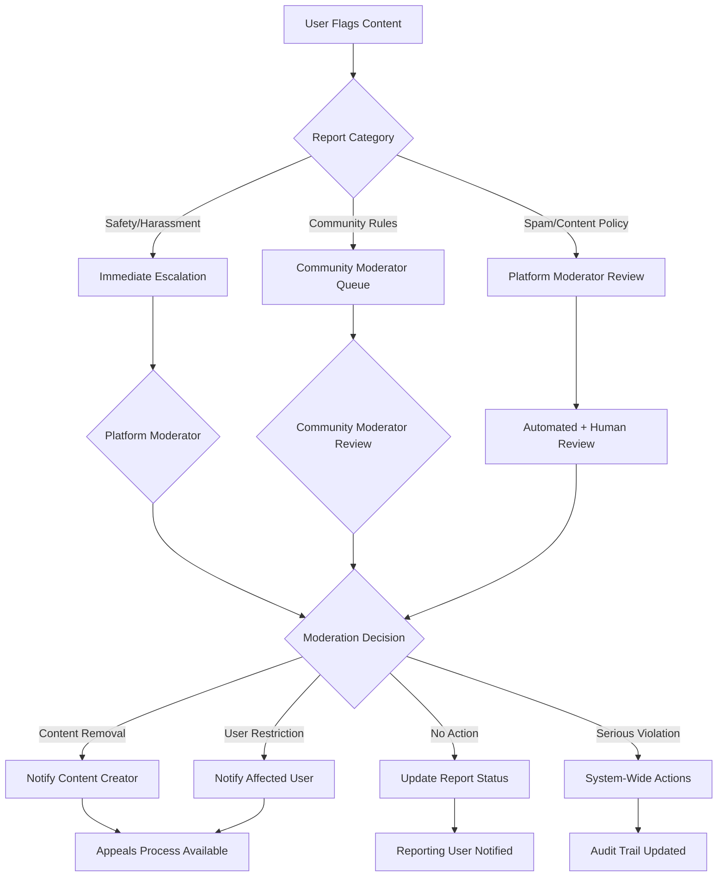

# Content Moderation System Requirements

## Reporting System Overview

THE content moderation system SHALL provide a comprehensive framework for maintaining platform safety through user-driven reporting and administrative oversight. THE system SHALL handle reports for posts, comments, user profiles, and private messages while maintaining transparent workflows that protect both reporting users and those being reported.

WHEN users encounter inappropriate content, THE system SHALL provide intuitive reporting mechanisms accessible through clear interface elements positioned prominently near all user-generated content. THE reporting process SHALL accommodate different user roles including visitors who cannot report but can flag content for member attention, members who can submit detailed reports, communityModerators who can escalate issues, and platformModerators who can access comprehensive reporting data.

THE moderation workflow SHALL integrate seamlessly with existing authentication systems, community management tools, and user notification services. THE system SHALL maintain detailed audit trails for all moderation activities while respecting user privacy requirements and providing appropriate transparency to affected parties.

### Business Process: Content Reporting Workflow

WHEN a member discovers inappropriate content, THEY SHALL click the "Report" button prominently displayed near all user-generated content. THE system SHALL present a reporting interface with categorized report reasons and optional detailed description fields. WHEN the member submits a report, THE system SHALL immediately acknowledge receipt and provide a tracking reference number for follow-up.

THE system SHALL categorize reports automatically based on selected reasons and route them to appropriate moderators. WHEN reports involve safety-related issues or harassment, THE system SHALL prioritize them for immediate review and notify relevant moderators within 15 minutes. THE platform SHALL maintain a comprehensive reporting dashboard allowing users to track the status of their submitted reports.

WHERE community-specific violations are reported, THE system SHALL notify communityModerators through their moderation queue. WHEN reports escalate beyond community boundaries, THE system SHALL automatically involve platformModerators through the centralized moderation system. THE workflow SHALL ensure no report goes unacknowledged while maintaining appropriate escalation paths for serious violations.

## Report Reasons

### Content Policy Violations

THE system SHALL organize report reasons hierarchically with main categories and specific subcategories to ensure accurate classification. WHEN users report content, THEY SHALL select from predefined categories including harassment, hate speech, violence threats, inappropriate content, spam, misinformation, copyright violations, and personal information exposure.

THE harassment category SHALL include subcategories for targeted harassment, bullying, stalking, and sexual harassment with clear definitions for each type. WHEN users report harassment, THE system SHALL collect additional context about the nature of the harassment and any previous incidents involving the same users. THE reporting process SHALL prioritize user safety while gathering sufficient information for effective moderation.

THE spam category SHALL distinguish between commercial spam, repetitive posting, coordinated inauthentic behavior, and vote manipulation attempts. WHEN spam is reported, THE system SHALL analyze reporting patterns to identify potential coordinated campaigns and automatically flag related accounts for investigation. THE system SHALL maintain spam detection algorithms that supplement user reporting.

### Community-Specific Violations

THE system SHALL allow communities to create custom report reasons specific to their guidelines and culture. WHEN communityModerators configure custom report categories, THE system SHALL validate them against platform-wide policies while preserving community autonomy. THE custom categories SHALL integrate seamlessly with the overall reporting system.

THE community-specific reporting SHALL include options for off-topic content, low-effort posts, and community rule violations that don't necessarily violate platform-wide policies. WHEN community reports are submitted, THEY SHALL be routed to communityModerators through their dedicated moderation queue while maintaining compatibility with platformModerator oversight.

## Report Submission

### User Interface Requirements

THE report submission interface SHALL provide clear categorization with accessible descriptions for each report type. WHEN users access the reporting interface, THE system SHALL display the content being reported alongside the report form to maintain context. THE interface SHALL support both detailed reporting for serious violations and quick reporting for obvious policy violations.

THE system SHALL implement progressive disclosure for report submission, requesting basic information first and providing options for detailed descriptions WHEN appropriate. THE reporting form SHALL include character limits (500 characters maximum) for detailed descriptions while encouraging users to provide specific violation references and relevant context.

THE report submission SHALL support optional anonymity for sensitive reports where revealing identity might cause safety concerns. WHEN users choose to report anonymously, THE system SHALL maintain their privacy while preserving their ability to track report status through unique tracking codes. THE anonymous reporting SHALL not compromise the quality of moderation actions.

### Validation and Processing

THE system SHALL validate all required report fields and provide immediate feedback for invalid submissions. WHEN report data fails validation, THE system SHALL preserve user input and highlight specific errors with clear guidance for correction. THE validation SHALL ensure legitimate reports are not rejected due to minor formatting issues.

THE report processing system SHALL prevent abuse through intelligent rate limiting that allows legitimate reporting while preventing spam reporting campaigns. WHEN users exceed reporting rate limits, THE system SHALL temporarily restrict their reporting privileges and provide clear explanation of the restriction. THE rate limiting SHALL differentiate between genuine reporting and harassment campaigns.

THE system SHALL implement duplicate detection to prevent multiple reports of the same content when no new information is provided. WHEN duplicate reports are detected, THE system SHALL update the original report with new information if provided rather than creating redundant reports.

## Moderation Queue

### Queue Management System

THE moderation queue SHALL organize reported content based on severity assessment, community association, and escalation status. WHEN new reports are received, THE system SHALL automatically categorize them by reported reason and assign priority scores based on content type, user history, and community context. THE queue SHALL provide multiple view modes including chronological, priority-based, and community-specific organization.

THE priority scoring system SHALL use multiple factors including user reputation metrics, content flags, community health indicators, and temporal urgency. WHEN urgent content is reported (threats, harassment, safety issues), THE system SHALL automatically escalate it to platform moderators within 5 minutes while notifying appropriate community moderators through their dashboards.

THE queue interface SHALL provide comprehensive information about each report including content preview, user context, community rules, previous moderation history, and related reports. WHEN moderators access the queue, THEY SHALL have all necessary information to make informed decisions without requiring external research or additional tool access.

### Moderator Assignment and Workload Balancing

THE system SHALL automatically assign reports to available moderators based on expertise areas, current workload, and community familiarity. WHEN moderators are assigned reports, THE system SHALL clearly indicate assignment status and provide tools for transferring cases when necessary. THE workload balancing algorithm SHALL ensure fair distribution while respecting moderator specialization.

THE moderation assignment system SHALL allow manual assignment for complex cases while maintaining automatic assignment for routine reports. WHEN moderators have high pending caseloads, THE system SHALL redistribute new reports to maintain reasonable processing timelines. THE assignment algorithm SHALL consider time zones and availability patterns.

THE system SHALL provide workload monitoring tools showing individual and team caseloads, average processing times, and performance metrics. WHEN workload imbalances are detected, THE system SHALL alert moderation supervisors and provide recommendations for redistribution. THE workload tracking SHALL support performance evaluation while avoiding metrics that encourage rushed decisions.

## Content Review Process

### Review Workflow Standards

THE content review process SHALL provide systematic evaluation frameworks with graduated response approaches appropriate to violation severity. WHEN moderators begin reviewing a reported case, THE system SHALL provide standard checklist templates that ensure comprehensive coverage of relevant policies and community guidelines. THE review process SHALL maintain detailed documentation of all decisions and reasoning.

THE review system SHALL incorporate evidence collection automatically including content snapshots, user interaction history, community context, and any supporting documentation. WHEN content is reported, THE system SHALL preserve the current state of the content, prevent editing during review, and collect metadata about the reporting incident.

THE review process SHALL support multiple moderator input for complex cases through collaborative review tools and discussion forums. WHEN cases involve novel policy interpretations or multiple communities, THE system SHALL enable group review processes with appropriate voting and consensus mechanisms. THE collaborative review SHALL maintain individual accountability while enabling collective decision making.

### Decision Documentation and Quality Assurance

THE review process SHALL require documentation of all moderation decisions with clear reasoning that supports accountability and enables appeal processing. WHEN moderators make decisions, THE system SHALL provide structured documentation forms that capture violation type, severity assessment, action taken, and supporting rationale. THE documentation SHALL be publicly accessible in appropriate detail levels.

THE quality assurance system SHALL implement peer review processes for significant moderation decisions including account suspensions, community-wide restrictions, and complex policy interpretations. WHEN serious actions are taken, THE system SHALL automatically flag decisions for supervisory review and require additional validation before finalization.

THE review system SHALL maintain comprehensive audit logs of all decisions including timestamps, moderator identification, action rationale, and any changes made during the review process. WHEN disputes arise, THE system SHALL provide complete audit trails that support transparent investigation and appeals processing.

## Moderation Actions

### Graduated Response System

THE moderation actions SHALL implement graduated response approaches that escalate consequences based on violation severity and user history. WHEN first-time violations occur, THE system SHALL emphasize educational responses including warnings, content guidelines, and improvement suggestions while maintaining appropriate deterrent effects for serious violations.

THE moderation actions SHALL include content-level responses (removal, editing restrictions), user-level restrictions (posting limits, comment blocks), account-level actions (suspensions, feature restrictions), and community-level measures (bans, participation limitations). WHEN actions are taken, THE system SHALL clearly explain the basis and duration while providing appeal pathways and rehabilitation opportunities.

THE escalation framework SHALL automatically consider factors including violation frequency, user acknowledgment of violations, demonstrated behavior changes, and community feedback. WHEN escalation occurs, THE system SHALL provide clear notification of increased restrictions while maintaining opportunities for improvement and reconciliation.

### Enforcement Documentation and Appeals

THE moderation enforcement system SHALL maintain complete records of all actions including timing, basis, duration, and conditions for reversal. WHEN moderation actions are taken, THE system SHALL automatically notify affected users within reasonable timeframes with specific explanations and available appeal options. THE notification system SHALL balance transparency with safety considerations for sensitive cases.

THE appeal process SHALL provide fair opportunities for users to challenge moderation decisions while maintaining community safety standards. WHEN appeals are submitted, THE system SHALL automatically notify relevant moderators and establish review timeframes (typically 72 hours) for response. THE appeal system SHALL support documentation review, additional evidence submission, and neutral third-party assessment where appropriate.

## User Notifications

### Multi-Stakeholder Communication

THE notification system SHALL communicate moderation decisions to all stakeholders including content creators, reporting users, community moderators, and platform administrators while maintaining appropriate detail levels for each audience. WHEN notifications are generated, THE system SHALL adapt content and tone to audience needs while maintaining consistency in core messaging.

THE notification system SHALL provide transparent communication about moderation actions while protecting user privacy and maintaining operational security. WHEN issuing notifications, THE system SHALL include specific policy references, action rationale, and available next steps while avoiding disclosure of sensitive investigation details or reporting user identities.

THE notification delivery system SHALL support multiple communication methods including in-platform messaging, email notifications, and push alerts while respecting user communication preferences and legal requirements for certain types of communications. WHEN notifications fail to deliver, THE system SHALL implement retry mechanisms and alternative delivery methods.

### Transparency and Feedback Integration

THE notification system SHALL incorporate user feedback mechanisms allowing recipients to respond to moderation decisions, request clarification, or provide additional context for consideration. WHEN users respond to moderation notifications, THE system SHALL route their feedback to appropriate moderators and document their responses for future reference.

THE transparency system SHALL provide regular reporting on moderation activities including aggregate statistics, community trends, and outcome success rates. WHEN transparency reports are generated, THE system SHALL protect individual privacy while providing meaningful insights into moderation effectiveness and community health indicators.

THE content moderation system SHALL maintain comprehensive integration with the platform's authentication system, ensuring that all moderation activities respect user roles and permissions as defined in the user actors specification. THE system SHALL implement business rules that scale with community growth while maintaining quality standards for content governance across diverse community types and sizes.

*Developer Note: This document defines business requirements only. All technical implementations (moderation algorithms, database queries, API endpoints, notification systems) are at the discretion of the development team.*