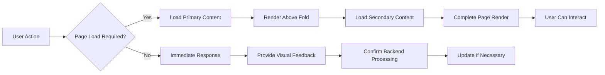

# Performance and Quality Requirements

## Performance Overview

The Reddit-like community platform must deliver optimal user experience through responsive interactions, fast content loading, and reliable system availability. Performance standards directly impact user engagement, community growth, and platform adoption. This document establishes measurable benchmarks that ensure users experience seamless interaction with posts, comments, voting systems, and community features regardless of geographic location, device type, or community size.

Performance requirements focus on creating a responsive, scalable platform that maintains excellent user experience amid growing user bases and increasing content volumes. These standards ensure fast page loads, immediate feedback for user actions, and consistent performance across different usage patterns from casual browsing to active community participation.

## Response Time Requirements

### Page Load Performance Standards
THE platform SHALL load community home pages within 2 seconds for users on standard broadband connections. THE system SHALL prioritize rendering above-the-fold content within 1 second to provide immediate visual feedback while loading remaining page elements progressively. WHEN returning users access the platform, THE system SHALL utilize caching mechanisms to achieve sub-1 second page loads for previously visited communities and posts.

WHILE serving content-heavy pages with numerous posts and comments, THE system SHALL implement lazy loading techniques that display visible content within 1.5 seconds while loading lower-priority elements asynchronously. THE platform SHALL maintain consistent page load times regardless of community size, ensuring that large communities with thousands of posts and comments load within the same performance windows as smaller communities.

### API Response Time Expectations
WHEN users interact with the voting system or save posts, THE system SHALL provide immediate visual feedback within 100 milliseconds and complete the backend processing within 500 milliseconds. THE platform SHALL handle POST requests for content creation within 2 seconds, confirming post submission and redirecting users to the newly created content.

FOR content retrieval operations, THE system SHALL deliver JSON responses containing post lists within 300 milliseconds for standard queries and within 800 milliseconds for complex search operations involving multiple filters or community searches. THE platform SHALL cache frequently accessed content to achieve sub-200 millisecond response times for subsequent requests.

### Database Query Performance Standards
THE database layer SHALL execute single-record queries within 50 milliseconds and complex multi-table joins within 200 milliseconds. WHEN processing user authentication requests, THE system SHALL verify credentials and generate session tokens within 300 milliseconds while maintaining security standards.

FOR comment thread loading operations, THE platform SHALL retrieve nested comment structures within 100 milliseconds per page of 50 comments, ensuring that deeper comment threads maintain consistent performance. THE system SHALL optimize karma calculation queries to update user reputation scores within 100 milliseconds of voting activity.

### Media Content Loading Requirements
THE platform SHALL display thumbnail images within 500 milliseconds and start loading embedded image posts within 1 second of user request. WHEN users access posts containing multiple images, THE system SHALL implement progressive loading that displays initial images immediately while loading additional content based on user scrolling behavior.

FOR image uploads, THE system SHALL confirm successful upload to temporary storage within 3 seconds and complete full processing within 10 seconds for standard image sizes up to 10MB. THE platform SHALL maintain upload progress indicators that update every 100 milliseconds to keep users informed during processing delays.

## Scalability Expectations

### Concurrency Handling Requirements
THE system SHALL support concurrent active users scaling from initial deployment of 10,000 simultaneous users to projected growth of 100,000 concurrent users without performance degradation. THE platform SHALL maintain consistent response times when communities experience sudden traffic spikes from viral content or trending discussions.

WHILE serving multiple simultaneous voting operations on trending posts, THE system SHALL process vote submissions without conflicts or performance impact on other system functions. THE platform SHALL handle peak loads during major community events or discussions with performance maintenance above baseline requirements.

### Content Volume Scaling Standards
THE system SHALL maintain query performance standards when community post volumes reach 1 million posts per community and database sizes exceed 10 million total posts. THE platform SHALL scale horizontally to accommodate projected monthly growth rates of 25% in active communities and 50% in total content volume.

FOR comment threads growing to thousands of nested responses, THE system SHALL maintain consistent loading performance and response times. THE platform SHALL automated scaling mechanisms that activate when resource utilization exceeds 70% of baseline capacity or response times degrade beyond defined thresholds.

### Geographic Distribution Support
THE platform SHALL deliver consistent user experience performance across different geographic regions with maximum latency differences of 200 milliseconds between local and remote access. THE system SHALL implement content delivery optimization that serves media content within 1 second regardless of user location.

FOR international users accessing communities during their local peak hours, THE system SHALL maintain performance standards equivalent to primary market expectations. THE platform SHALL balance loads across geographic regions to prevent any single location from experiencing degraded performance during local high-traffic periods.

### Database Scaling Requirements
THE system SHALL implement read replica strategies that maintain sub-100 millisecond query response times during high-traffic periods. WHEN primary databases approach 80% capacity utilization, THE system SHALL distribute load effectively to maintain consistent performance across all database operations.

FOR comment voting and karma calculations that require frequent database writes, THE system SHALL queue writes intelligently to prevent blocking or slowing read operations. THE platform SHALL maintain ACID compliance while scaling write operations to support projected user activity levels.

## User Experience Standards

### Immediate Feedback Requirements
WHEN users click voting buttons or save posts, THE system SHALL provide immediate visual confirmation within 50 milliseconds regardless of backend processing status. THE platform SHALL update UI elements optimistically while managing background synchronization according to API timing requirements.

FOR interactive elements like sorting toggles, filtering options, or navigation controls, THE system SHALL respond instantly with loading indicators when backend processing prevents immediate content updates. THE platform SHALL maintain responsive user interfaces that never freeze or become unresponsive during data processing operations.

### Progressive Loading Implementation
THE system SHALL implement progressive loading for complex pages that displays essential content within 500 milliseconds while loading secondary elements in background processes. WHEN rendering paginated post listings, THE system SHALL prioritize visible content within the viewport while preloading adjacent content based on user scrolling patterns.

FOR community pages containing sidebar elements, advertisements, or additional content blocks, THE platform SHALL load primary post content first before rendering secondary elements. THE system SHALL provide smooth scrolling experiences that prevent layout shifts as additional content loads.

### Error Handling with Performance Impact
IF the database connection experiences temporary delays exceeding 2 seconds, THEN THE system SHALL serve cached content when available and display graceful error messages without affecting page functionality. WHEN backend services become temporarily unavailable, THE system SHALL maintain user session information and queue actions to process upon service restoration.

FOR performance-related errors that might impact user experience, THE system SHALL provide clear explanatory messages and suggest alternative actions. THE platform SHALL automatically retry failed operations with exponential backoff that doesn't exceed user tolerance for delays.

### Mobile Performance Considerations
THE mobile interface SHALL maintain performance standards equivalent to desktop experiences while accounting for network variability and device capabilities. THE system SHALL optimize data payloads for mobile connections, reducing transferred data volume by 40% compared to desktop versions while maintaining complete functionality.

WHEN mobile users access communities with slower network connections, THE platform SHALL provide data-saving options that further optimize loading performance. THE system SHALL detect connection speeds and adjust content loading strategies automatically to maintain optimal user experience.

## Reliability Requirements

### System Uptime Commitments
THE platform SHALL maintain 99.9% availability measured monthly, equating to maximum downtime of 43.2 minutes per month outside scheduled maintenance windows. THE system SHALL implement redundancy for critical services including user authentication, content delivery, and community access to prevent single points of failure from affecting overall availability.

FOR planned maintenance activities requiring system downtime, THE system SHALL provide advance notice of 24 hours to active communities with significant user bases. THE platform SHALL schedule maintenance windows during low-usage periods based on community analytics and user activity patterns.

### Database Reliability Standards
THE system SHALL implement database replication with automatic failover capabilities ensuring Recovery Time Objectives (RTO) of 5 minutes for database-related outages. THE platform SHALL maintain rolling backups that enable Recovery Point Objectives (RPO) of maximum 15 minutes data loss in failure scenarios.

FOR transaction-processing operations including user registrations, content creation, and voting activities, THE system SHALL guarantee successful completion or rollback to prevent partial state corruption. THE platform SHALL implement database monitoring that detects performance degradation before it impacts user experience.

### Error Rate Tolerances
THE system SHALL maintain error rates below 0.1% for transaction operations including user authentication, content posting, and voting activities. WHILE processing high volumes during peak traffic periods, THE platform SHALL maintain error rates below 0.2% for all user-facing operations.

FOR external integrations including email notifications and media storage services, THE system SHALL implement circuit breaker patterns that prevent cascading failures from affecting core platform functionality. THE platform SHALL queue failed operations with automatic retry mechanisms that maintain data integrity without impacting user experience.

### Backup and Recovery Performance
THE system SHALL complete full database backups within 4-hour windows during low-traffic periods without degrading platform performance. WHEN performing backup operations, THE platform SHALL maintain normal response time requirements and user experience standards.

FOR disaster recovery scenarios requiring full system restoration, THE system SHALL recover complete functionality within 2 hours from backup initiation. THE platform SHALL regularly test backup restoration procedures to ensure recovery processes meet established time requirements.

## Availability Goals

### Targeted Service Availability
THE platform SHALL achieve 99.99% availability for core read operations including community browsing, post viewing, and content consumption. WHEN serving authenticated users, THE system SHALL maintain session availability without timeout or interruption periods exceeding user expectations for platform usage patterns.

FOR content creation operations including posting, commenting, and voting, THE system SHALL maintain 99.95% availability without requiring users to repeat actions due to service unavailability. THE platform SHALL provide clear communication regarding service status during less-than-complete availability periods.

### Geographic Availability Requirements
THE system SHALL provide consistent availability across supported geographic regions with maintenance of defined performance and availability standards worldwide. THE platform SHALL implement content distribution and redundancy across multiple data centers to prevent regional outages from affecting global availability.

FOR real-time features including voting updates, comment threading, and community migration, THE system SHALL synchronize availability across all regions to prevent feature fragmentation based on geographic location. THE platform SHALL maintain consent records and compliance requirements that don't compromise availability targets.

### Peak Traffic Handling Capacity
THE system SHALL maintain performance and availability standards during traffic spikes up to 3x normal daily average without requiring advance scaling preparation. WHEN communities experience sudden popularity increases from viral content, THE platform SHALL scale automatically to accommodate increased load within 5-minute response windows.

FOR coordinated attack scenarios or distributed denial of service attempts, THE system SHALL maintain availability for genuine users through implemented protection mechanisms. THE platform SHALL distinguish between legitimate traffic increases and malicious attack patterns to apply appropriate responses without affecting genuine user experience.

THE platform performance requirements establish clear expectations for user experience while providing flexibility for backend development teams to implement optimal technical solutions. These standards ensure consistent, reliable service delivery that supports community growth and user engagement across diverse usage patterns and geographic distributions.