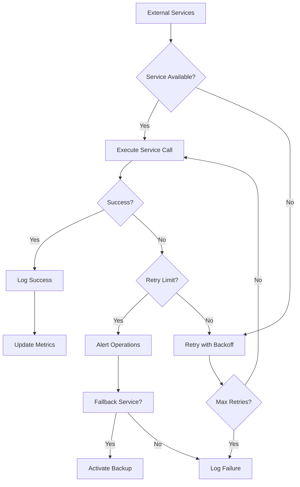

# System Integrations Requirements

## Integration Overview

THE redditCommunity platform SHALL integrate with external services to provide email communication, file storage, analytics tracking, social media connectivity, and API-based functionality. THE system SHALL maintain reliability and security standards while integrating with third-party services to enhance user experience and platform capabilities.

WHEN system integrations fail, THE platform SHALL implement graceful degradation and fallback mechanisms WHERE possible to maintain core functionality. THE system SHALL log all integration events for monitoring and debugging purposes.

WHERE third-party services charge fees, THE system SHALL implement usage tracking and implement cost optimization measures to control operational expenses. THE platform SHALL monitor integration performance and response times to ensure user experience is not negatively impacted.

### Integration Architecture Principles

THE redditCommunity platform SHALL follow a service-oriented architecture for external integrations. WHILE maintaining security standards, THE system SHALL encrypt sensitive data transmitted to external services using industry-standard protocols. WHEN processing user data through third-party services, THE platform SHALL comply with relevant privacy regulations including GDPR and CCPA.

THE system SHALL implement retry mechanisms for transient failures with exponential backoff strategies. THE platform SHALL provide circuit breaker patterns to prevent cascading failures from affecting core functionality. WHEN external service availability drops below 95%, THE system SHALL alert administrators and switch to backup services WHERE available.

## Email Service Integration

### Email Notification System

THE redditCommunity platform SHALL integrate with a reliable email service provider to handle transactional emails, user notifications, and system communications. WHEN users register, THE system SHALL send account verification emails within 30 seconds of registration completion. WHEN users reset passwords, THE system SHALL deliver password reset emails within 60 seconds of request submission.

WHILE users have community subscriptions, THE system SHALL send email notifications for new posts in their subscribed communities at user-configured intervals (immediate, daily, weekly). WHEN posts receive significant engagement (100+ upvotes or 50+ comments within 24 hours), THE system SHALL notify post authors via email if they have enabled such notifications.

THE system SHALL support HTML-formatted emails with responsive design for mobile devices. THE email service SHALL maintain a delivery rate of at least 98% and provide detailed analytics including open rates, click-through rates, and bounce rates. WHEN emails bounce repeatedly, THE system SHALL automatically flag and suspend delivery to invalid email addresses.

### Email Content Templates

THE platform SHALL provide customizable email templates for the following events: new user verification, password reset, new community subscription, post engagement notifications, comment replies, and moderation actions. WHEN community moderators take action on user content, THE system SHALL send notification emails explaining the action and providing appeal options.

THE email templates SHALL include the redditCommunity branding and provide clear unsubscribe options in compliance with CAN-SPAM regulations. WHEN users click unsubscribe links, THE system SHALL immediately process the request and confirm unsubscription within the email interface.

### Email Authentication and Security

THE email service integration SHALL implement SPF, DKIM, and DMARC authentication to ensure email deliverability and prevent spoofing. WHEN sending emails, THE system SHALL authenticate with the email service using secure API keys stored in encrypted configuration files.

THE platform SHALL implement rate limiting for email sending to prevent abuse, with a maximum of 50 emails per user per day for notification preferences. IF a user exceeds this limit, THEN THE system SHALL queue remaining notifications for the next day and notify the user of the delay.

## File Storage Integration

### Image and Media Storage

THE redditCommunity platform SHALL integrate with cloud-based file storage services to handle image uploads, profile pictures, and community headers. WHEN users upload images, THE system SHALL resize and optimize images for web display while maintaining original copies for future processing needs.

THE file storage integration SHALL support multiple image formats including JPEG, PNG, GIF, and WebP. WHEN processing uploaded files, THE system SHALL validate file types and reject potentially harmful content such as executables, scripts, or corrupted files. THE maximum file size SHALL be 10MB for images and 25MB for GIF animations.

THE system SHALL implement content delivery network (CDN) integration to serve images and media files from geographically distributed edge servers. WHEN users access media content, THE system SHALL serve files from the nearest CDN edge location to minimize latency and improve loading times.

### File Organization and Management

THE file storage system SHALL organize content using a hierarchical folder structure based on upload date and content type: `/year/month/content_type/user_id/`. WHEN users delete posts or comments containing media, THE system SHALL mark associated files for deletion and remove them from storage within 30 days to comply with storage policies and user privacy requirements.

THE storage integration SHALL implement versioning for user profile pictures, keeping the current profile picture and up to 5 previous versions. WHEN users update their profile picture, THE system SHALL seamlessly transition to the new image while maintaining access to previous versions for moderation purposes.

### Storage Performance and Reliability

THE file storage integration SHALL maintain 99.9% uptime and provide redundant storage across multiple geographic regions. WHEN storage services experience outages, THE system SHALL display placeholder images and queue uploads for retry when service is restored.

THE platform SHALL implement bandwidth optimization through automatic image compression and progressive loading techniques. WHILE large files are uploading, THE system SHALL display progress indicators and support resumable uploads for files larger than 5MB to handle network interruptions gracefully.

## Analytics Integration

### User Behavior Tracking

THE redditCommunity platform SHALL integrate with analytics services to track user engagement, content performance, and platform usage patterns. WHEN users interact with the platform, THE system SHALL collect anonymized data including page views, time spent, click-through rates, and engagement metrics while respecting user privacy preferences.

THE analytics integration SHALL track community growth metrics including new member registrations, post creation rates, comment activity, and community subscription patterns. WHERE users have consented to data collection, THE system SHALL collect detailed interaction data including voting patterns, content preferences, and navigation behaviors.

THE platform SHALL implement real-time analytics dashboards for community moderators showing current active users, trending posts, and engagement metrics for their communities. WHEN community engagement spikes above normal levels by 300% or more, THE system SHALL alert moderators to potential trending content or unusual activity requiring attention.

### Data Privacy and Compliance

THE analytics integration SHALL comply with privacy regulations by implementing data anonymization and providing user consent management options. WHEN users request data deletion, THE system SHALL remove their analytics data within 30 days as required by GDPR and include analytics data in data export requests.

THE platform SHALL provide users with privacy controls allowing them to opt-out of analytics tracking partially or completely. WHERE users have opted out of tracking, THE system SHALL maintain core platform functionality while disabling behavioral analytics and personalized recommendations based on user behavior.

### Performance Monitoring

THE analytics integration SHALL include application performance monitoring (APM) to track response times, error rates, and system availability. WHEN system performance degrades below acceptable thresholds (response time > 3 seconds or error rate > 1%), THE system SHALL alert operations teams and provide detailed diagnostics for troubleshooting.

THE monitoring system SHALL track third-party integration performance including email delivery times, file upload speeds, and external API response times. WHEN external service performance impacts user experience, THE system SHALL log detailed performance metrics and implement fallback strategies where feasible.

## Social Media Integration

### Authentication and Identity Verification

THE redditCommunity platform SHALL integrate with social media platforms to provide optional authentication and identity verification services. WHEN users choose social media login, THE system SHALL authenticate using OAuth 2.0 protocols while maintaining account security standards and providing password-based fallback options.

THE social media integration SHALL support linking existing redditCommunity accounts with social media profiles for identity verification purposes. WHEN users verify their identity through social media, THE system SHALL display verification badges on their profiles while maintaining privacy of their social media account details.

WHERE social media platforms support it, THE system SHALL enable users to share their redditCommunity content to connected social media accounts at their discretion. WHEN users share content externally, THE system SHALL provide preview formatting and appropriate attribution links to drive traffic back to the platform.

### Content Sharing and Distribution

THE platform SHALL provide social media sharing buttons for posts and communities to facilitate external content distribution. WHEN users click share buttons, THE system SHALL generate appropriate Open Graph metadata and preview images to ensure optimal display on social media platforms.

THE social media integration SHALL respect rate limiting imposed by external platforms and implement queuing mechanisms for bulk sharing operations. WHEN sharing to social media fails due to platform restrictions or outages, THE system SHALL notify users of the failure and provide alternative sharing options.

## API Requirements

### Third-Party API Integration

THE redditCommunity platform SHALL maintain APIs for communication with mobile applications, browser extensions, and third-party services. THE REST API SHALL support JSON-formatted requests and responses with comprehensive error handling and status code compliance according to HTTP standards.

THE API integration SHALL implement rate limiting with tiered access levels: unauthenticated requests limited to 10 requests per minute, authenticated users limited to 100 requests per minute, and premium users limited to 1000 requests per minute. WHEN users exceed rate limits, THE system SHALL return appropriate HTTP 429 responses with retry-after headers indicating when requests can resume.

THE platform SHALL implement comprehensive API documentation using OpenAPI specification standards. WHEN developers integrate with the API, THE system SHALL provide interactive API explorers and code generation tools to simplify integration processes.

### API Security and Authentication

THE API integration SHALL implement JWT-based authentication with refresh token support. WHEN users authenticate via API, THE system SHALL issue access tokens valid for 15 minutes and refresh tokens valid for 7 days, with automatic token refresh capabilities for seamless user experiences.

THE API SHALL implement comprehensive input validation and sanitization to prevent common security vulnerabilities including SQL injection, cross-site scripting, and request forgery attacks. WHEN processing API requests, THE system SHALL validate all input parameters against expected formats and reject requests containing potentially harmful content or malformed data.

### Push Notification Service Integration

WHERE mobile applications are developed, THE redditCommunity platform SHALL integrate with push notification services to provide real-time alerts for user-relevant events. WHEN significant engagement occurs on user content (posts receiving 100+ upvotes, direct replies to comments), THE system SHALL send push notifications respecting user notification preferences and time zone settings.

THE push notification integration SHALL support both iOS and Android platforms with platform-specific message formatting and delivery optimization. WHEN sending notifications, THE system SHALL respect platform-specific limitations including message length restrictions, silent notification capabilities, and batch delivery windows to optimize battery life and user experience.

### Webhook and External Event Handling

THE platform SHALL support webhook integrations enabling external services to receive notifications about platform events in real-time. WHEN users configure webhooks, THE system SHALL authenticate webhook endpoints using secret tokens and verify payload integrity using cryptographic signatures.

THE webhook integration SHALL implement retry mechanisms for failed deliveries with exponential backoff up to 24 hours. WHEN webhook endpoints become consistently unavailable, THE system SHALL disable the webhook and notify the user to check their endpoint configuration.

## Integration Monitoring and Maintenance

### Health Checks and Monitoring

THE redditCommunity platform SHALL implement comprehensive health monitoring for all external integrations. WHEN any integrated service experiences downtime or performance degradation, THE system SHALL immediately detect the issue and alert operations teams through multiple communication channels including email, SMS, and dashboard notifications.

THE monitoring system SHALL track integration-specific metrics including API response times, success rates, and error frequencies. WHEN integration metrics fall below established thresholds (success rate < 95% or average response time > 5 seconds), THE system SHALL automatically generate incident reports and initiate escalation procedures.

### Backup and Disaster Recovery

THE platform SHALL implement backup strategies for data stored in external services including email address lists, uploaded media files, and configuration data. WHEN backing up data, THE system SHALL encrypt sensitive information and store backups in geographically diverse locations to ensure availability during regional outages.

THE disaster recovery plan SHALL include procedures for switching to backup service providers with minimal service disruption. WHEN primary service providers experience extended outages, THE system SHALL seamlessly transition to backup services with complete data synchronization and minimal impact on user experience.

### Cost Management and Optimization

THE redditCommunity platform SHALL implement usage tracking and cost monitoring for all paid external services. WHEN costs approach budget limits (80% of monthly allocation), THE system SHALL alert administrators and provide detailed usage reports to identify optimization opportunities.

THE cost optimization system SHALL implement intelligent caching, request batching, and usage optimization strategies to minimize external service costs while maintaining user experience quality. WHEN implementing cost-saving measures, THE system SHALL prioritize maintaining core functionality over convenience features during high-usage periods.

