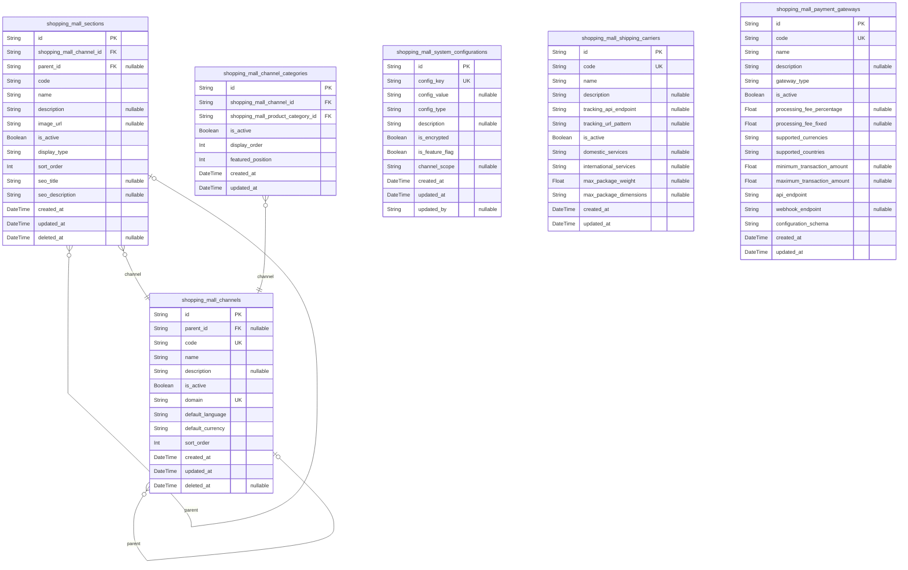
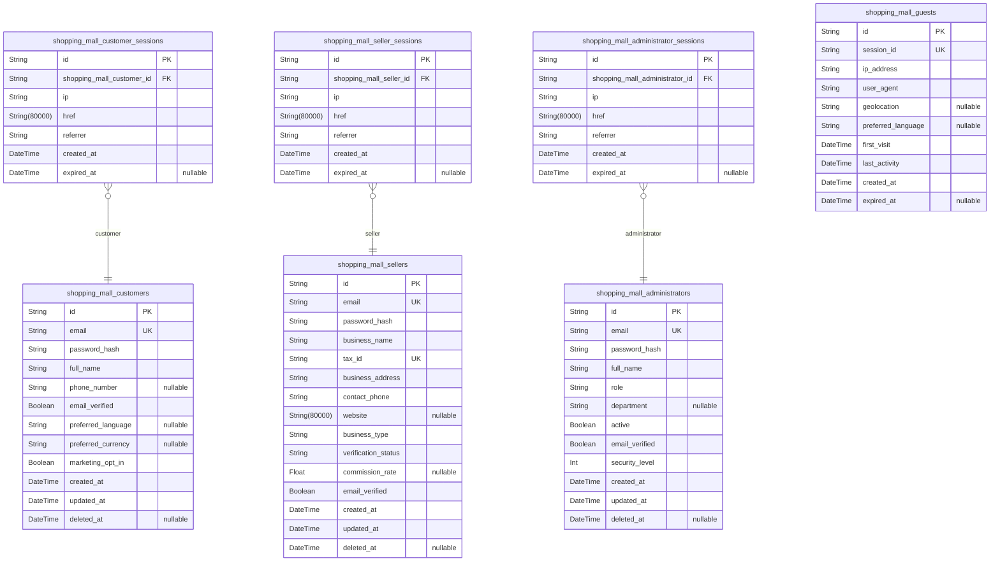
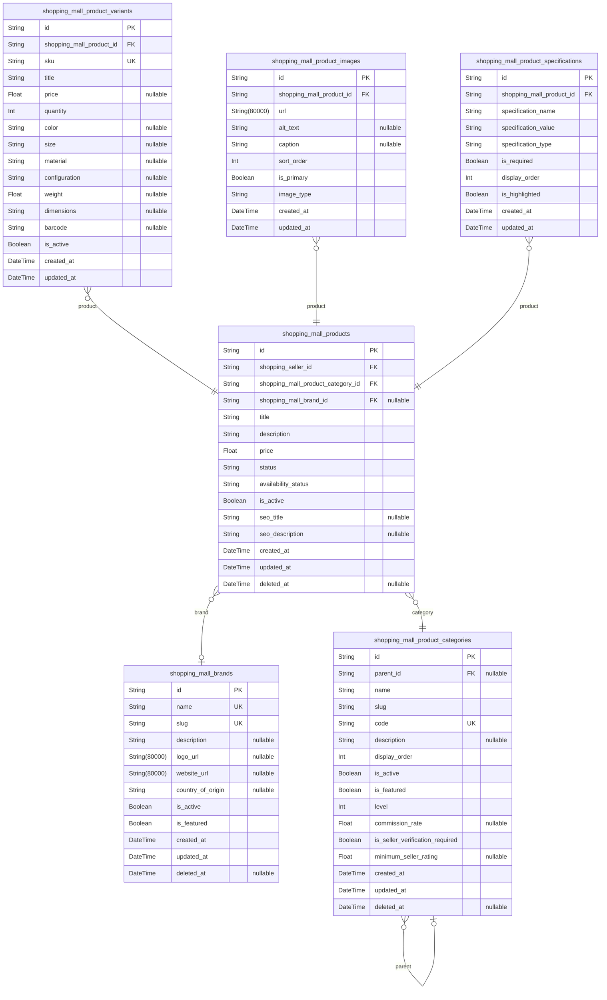
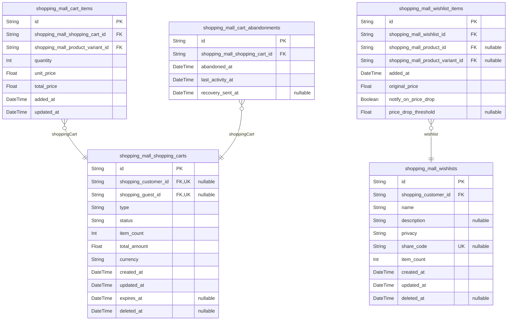
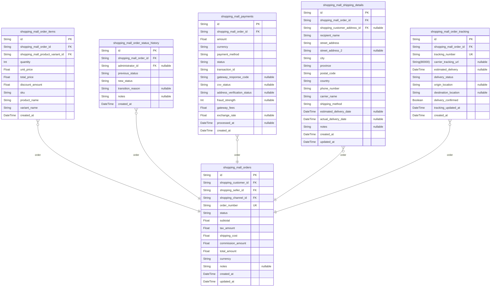
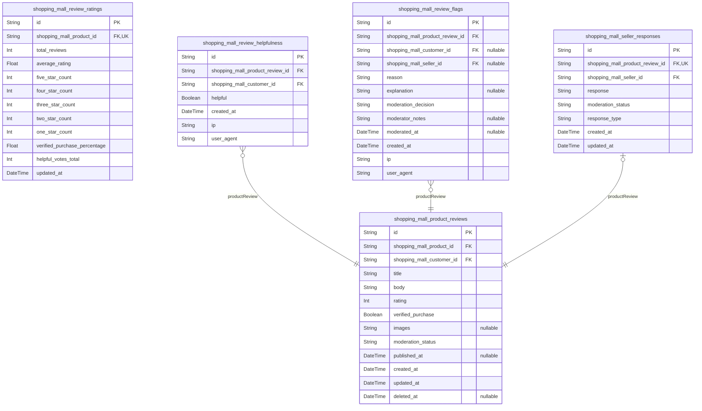
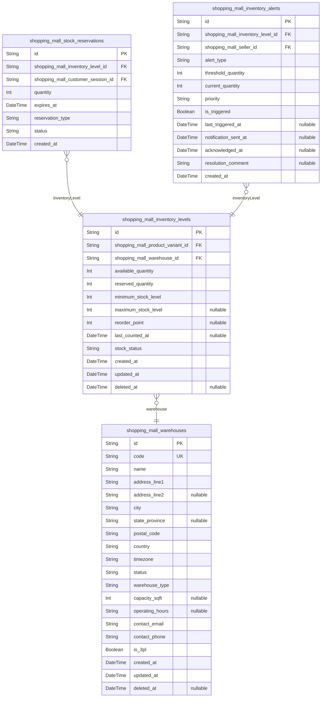
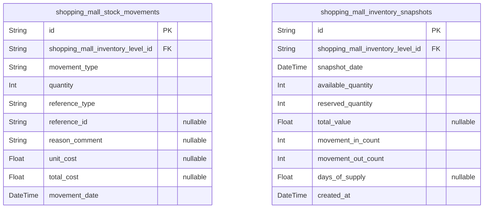

# Prisma Markdown

> Generated by [`prisma-markdown`](https://github.com/samchon/prisma-markdown)

- [Systematic](#systematic)
- [Actors](#actors)
- [Sales](#sales)
- [Carts](#carts)
- [Orders](#orders)
- [Financial](#financial)
- [Reviews](#reviews)
- [Inventory](#inventory)
- [default](#default)

## Systematic

### `shopping_mall_channels`

Shopping mall channels representing different marketplace environments or
regional storefronts that organize the platform's product offerings and
seller operations across different markets or business segments.

Properties as follows:

- `id`: Primary Key.
- `parent_id`
  > Parent channel's [shopping_mall_channels.id](#shopping_mall_channels) for hierarchical
  > channel organization.
- `code`: Unique channel identifier code used for routing and configuration.
- `name`: Channel display name shown to administrators and sellers.
- `description`
  > Detailed channel description explaining business purpose and target
  > audience.
- `is_active`: Whether the channel is currently active and available for operations.
- `domain`: Primary domain or subdomain associated with this channel.
- `default_language`: Default language code for this channel's content and communications.
- `default_currency`: Default currency code used for pricing in this channel.
- `sort_order`: Numeric sort order for channel listing and navigation display.
- `created_at`: Timestamp when the channel was created.
- `updated_at`: Timestamp when the channel was last updated.
- `deleted_at`: Soft delete timestamp. null if channel is active.

### `shopping_mall_sections`

Shopping mall sections representing different functional areas or
departments within channels, organizing content and products into logical
browsing hierarchies for improved customer experience.

Properties as follows:

- `id`: Primary Key.
- `shopping_mall_channel_id`: Parent channel's [shopping_mall_channels.id](#shopping_mall_channels).
- `parent_id`
  > Parent section's [shopping_mall_sections.id](#shopping_mall_sections) for nested section
  > hierarchies.
- `code`: Unique section identifier code used for routing and organization.
- `name`: Section display name shown in navigation and breadcrumbs.
- `description`
  > Detailed section description explaining content scope and featured
  > products.
- `image_url`: URL path to section banner image or thumbnail for visual identification.
- `is_active`: Whether the section is currently active and visible to users.
- `display_type`
  > Display type defining how products are presented in this section (grid,
  > list, featured).
- `sort_order`: Numeric sort order for section arrangement within parent channel.
- `seo_title`: SEO-optimized title for search engine indexing and social sharing.
- `seo_description`: SEO-optimized description for search engine snippets.
- `created_at`: Timestamp when the section was created.
- `updated_at`: Timestamp when the section was last updated.
- `deleted_at`: Soft delete timestamp. null if section is active.

### `shopping_mall_channel_categories`

Junction table establishing many-to-many relationships between channels
and product categories, enabling category-specific content organization
within different marketplace channels.

Properties as follows:

- `id`: Primary Key.
- `shopping_mall_channel_id`: Channel's [shopping_mall_channels.id](#shopping_mall_channels).
- `shopping_mall_product_category_id`: Product category's [shopping_mall_product_categories.id](#shopping_mall_product_categories).
- `is_active`: Whether this channel-category relationship is currently active.
- `display_order`: Order in which this category appears within the channel.
- `featured_position`: Featured positioning priority (0 for regular, 1+ for featured display).
- `created_at`: Timestamp when the relationship was created.
- `updated_at`: Timestamp when the relationship was last updated.

### `shopping_mall_system_configurations`

System-wide configuration settings and feature flags that control
platform behavior, business rules, and operational parameters across all
marketplace channels and seller operations.

Properties as follows:

- `id`: Primary Key.
- `config_key`: Unique configuration key identifier for system-wide settings access.
- `config_value`
  > Configuration value stored as serialized data appropriate for the setting
  > type.
- `config_type`
  > Data type hint for the configuration value (string, number, boolean,
  > json).
- `description`
  > Human-readable description of the configuration setting's purpose and
  > usage.
- `is_encrypted`: Whether this configuration value is encrypted for security purposes.
- `is_feature_flag`: Whether this configuration setting functions as a feature toggle flag.
- `channel_scope`
  > Channel scope: 'global', 'channel:<id>', or 'category:<id>' for targeted
  > settings.
- `created_at`: Timestamp when the configuration was created.
- `updated_at`: Timestamp when the configuration was last updated.
- `updated_by`: Identifier of admin user who last updated this configuration.

### `shopping_mall_shipping_carriers`

Supported shipping carriers and delivery service providers that sellers
and the platform use for order fulfillment with integrated tracking
capabilities and service level definitions.

Properties as follows:

- `id`: Primary Key.
- `code`
  > Unique carrier identifier code for system integration and tracking
  > purposes.
- `name`: Carrier display name for customer and seller interface presentation.
- `description`
  > Detailed carrier information including service areas and special
  > capabilities.
- `tracking_api_endpoint`: API endpoint URL for package tracking integration when available.
- `tracking_url_pattern`
  > URL pattern for customer tracking links with placeholder for tracking
  > number.
- `is_active`: Whether this carrier is currently available for shipping selections.
- `domestic_services`: JSON array of available domestic shipping service codes and names.
- `international_services`: JSON array of available international shipping service codes and names.
- `max_package_weight`: Maximum package weight in kilograms supported by this carrier.
- `max_package_dimensions`: Maximum package dimensions in JSON format (length, width, height).
- `created_at`: Timestamp when the carrier was added to the system.
- `updated_at`: Timestamp when the carrier information was last updated.

### `shopping_mall_payment_gateways`

Integrated payment processing gateways that handle customer payments
across different channels with comprehensive fee structures and security
configurations.

Properties as follows:

- `id`: Primary Key.
- `code`: Unique gateway identifier code for system integration and configuration.
- `name`: Gateway display name for customer and seller interface presentation.
- `description`
  > Detailed gateway information including supported payment methods and
  > features.
- `gateway_type`
  > Gateway type: credit_card, digital_wallet, bank_transfer, crypto, or
  > buy_now_pay_later.
- `is_active`
  > Whether this gateway is currently available for customer payment
  > selection.
- `processing_fee_percentage`: Percentage fee charged by the gateway for each transaction.
- `processing_fee_fixed`: Fixed fee amount charged by the gateway per transaction.
- `supported_currencies`: JSON array of ISO currency codes supported by this gateway.
- `supported_countries`: JSON array of ISO country codes where this gateway operates.
- `minimum_transaction_amount`: Minimum transaction amount allowed by this gateway in platform currency.
- `maximum_transaction_amount`: Maximum transaction amount allowed by this gateway in platform currency.
- `api_endpoint`: API endpoint URL for payment processing integration.
- `webhook_endpoint`: Webhook endpoint URL for payment status notifications.
- `configuration_schema`: JSON schema defining required configuration parameters for this gateway.
- `created_at`: Timestamp when the gateway was integrated into the system.
- `updated_at`: Timestamp when the gateway configuration was last updated.

## Actors

### `shopping_mall_customers`

Customer accounts for the shopping mall platform. Customers are retail
users who browse products, make purchases, and manage their shopping
experience.

Properties as follows:

- `id`: Primary Key.
- `email`: Customer email address for account login and communications.
- `password_hash`: Hashed password for secure authentication.
- `full_name`: Customer's full name for shipping and personalization.
- `phone_number`: Customer phone number for order notifications and verification.
- `email_verified`: Whether the customer has verified their email address.
- `preferred_language`: Customer's preferred language for communications and interface.
- `preferred_currency`: Customer's preferred currency for pricing and transactions.
- `marketing_opt_in`: Customer opt-in status for marketing communications.
- `created_at`: Account creation timestamp.
- `updated_at`: Last account modification timestamp.
- `deleted_at`: Account soft deletion timestamp.

### `shopping_mall_sellers`

Seller accounts who manage product listings, inventory, and order
fulfillment within the marketplace platform. Sellers operate as business
entities.

Properties as follows:

- `id`: Primary Key.
- `email`: Seller business email for account access and communications.
- `password_hash`: Hashed password for secure authentication.
- `business_name`: Registered business name for legal identification.
- `tax_id`: Business tax identification number for regulatory compliance.
- `business_address`: Registered business address for legal correspondence.
- `contact_phone`: Business contact phone number for customer service.
- `website`: Business website URL for customer reference.
- `business_type`: Type of business entity (LLC, Corporation, Sole Proprietorship).
- `verification_status`: Seller verification status for platform access control.
- `commission_rate`: Commission rate percentage applied to seller transactions.
- `email_verified`: Whether seller has verified their email address.
- `created_at`: Account creation timestamp.
- `updated_at`: Last account modification timestamp.
- `deleted_at`: Account soft deletion timestamp.

### `shopping_mall_customer_sessions`

Authentication sessions for customer accounts. Tracks customer login
sessions for security monitoring and audit trails.

Properties as follows:

- `id`: Primary Key.
- `shopping_mall_customer_id`: Reference to shopping_mall_customers.id
- `ip`: IP address of the customer connection.
- `href`: Connection URL or page being accessed.
- `referrer`: Referrer URL tracking the user source.
- `created_at`: Session creation timestamp.
- `expired_at`: Optional session expiration time.

### `shopping_mall_seller_sessions`

Authentication sessions for seller accounts. Tracks seller login sessions
for security monitoring and business operation auditing.

Properties as follows:

- `id`: Primary Key.
- `shopping_mall_seller_id`: Reference to shopping_mall_sellers.id
- `ip`: IP address of the seller connection.
- `href`: Connection URL or page being accessed.
- `referrer`: Referrer URL tracking the seller source.
- `created_at`: Session creation timestamp.
- `expired_at`: Optional session expiration time.

### `shopping_mall_administrators`

Platform administrator accounts responsible for system oversight, user
management, and policy enforcement across the shopping mall platform.

Properties as follows:

- `id`: Primary Key.
- `email`: Administrator email for secure account access.
- `password_hash`: Hashed password for secure authentication.
- `full_name`: Administrator's full name for identification.
- `role`: Administrator role level for permission control.
- `department`: Administrative department for organizational structure.
- `active`: Whether administrator account is active for system access.
- `email_verified`: Whether administrator has verified their email address.
- `security_level`: Security access level for administrative functions.
- `created_at`: Account creation timestamp.
- `updated_at`: Last account modification timestamp.
- `deleted_at`: Account soft deletion timestamp.

### `shopping_mall_administrator_sessions`

Authentication sessions for administrator accounts. Tracks admin login
sessions for security monitoring and administrative audit tracking.

Properties as follows:

- `id`: Primary Key.
- `shopping_mall_administrator_id`: Reference to shopping_mall_administrators.id
- `ip`: IP address of the administrator connection.
- `href`: Connection URL or administrative page accessed.
- `referrer`: Referrer URL tracking the admin source.
- `created_at`: Session creation timestamp.
- `expired_at`: Optional session expiration time.

### `shopping_mall_guests`

Guest users who browse the platform without creating accounts. Provides
limited functionality for anonymous shopping experience.

Properties as follows:

- `id`: Primary Key.
- `session_id`: Anonymous session identifier for guest tracking.
- `ip_address`: IP address for session management and analytics.
- `user_agent`: Browser user agent for guest identification.
- `geolocation`: Approximate geographic location for content optimization.
- `preferred_language`: Detected language preference for interface display.
- `first_visit`: Timestamp of first guest visit to the platform.
- `last_activity`: Timestamp of last guest activity for session management.
- `created_at`: Guest record creation timestamp.
- `expired_at`: Guest session expiration timestamp.

## Sales

### `shopping_mall_products`

Core product catalog entity representing sellable items with seller
ownership. Products contain basic information and belong to sellers and
categories, with support for variants, images, and specifications as
separate entities.

Properties as follows:

- `id`: Primary Key.
- `shopping_seller_id`: Product owner's [shopping_mall_sellers.id](#shopping_mall_sellers).
- `shopping_mall_product_category_id`: Product category's [shopping_mall_product_categories.id](#shopping_mall_product_categories).
- `shopping_mall_brand_id`: Product brand's [shopping_mall_brands.id](#shopping_mall_brands).
- `title`
  > Product title between 10-200 characters with primary product name,
  > avoiding excessive capitalization.
- `description`
  > Comprehensive product description between 100-5000 characters including
  > features, specifications, materials, dimensions, and usage instructions.
- `price`
  > Product price greater than zero, not exceeding 999,999.99 in platform
  > currency with proper decimal formatting.
- `status`
  > Product status including draft, pending_review, published, out_of_stock,
  > or archived to manage product lifecycle.
- `availability_status`
  > Availability status defaulting to out_of_stock when inventory count is
  > zero, preventing overselling.
- `is_active`: Whether the product is currently active and available for sale.
- `seo_title`
  > SEO-optimized title for search engine visibility and category
  > optimization.
- `seo_description`
  > SEO-optimized description for improved product discoverability in search
  > results.
- `created_at`: Product creation timestamp.
- `updated_at`: Product last update timestamp.
- `deleted_at`: Soft delete timestamp for product archival.

### `shopping_mall_product_variants`

Product variant/SKU entity representing specific configurations of
products. Variants represent inventory-level entities like color-size
combinations that customers actually purchase, with individual pricing
and stock tracking.

Properties as follows:

- `id`: Primary Key.
- `shopping_mall_product_id`: Parent product's [shopping_mall_products.id](#shopping_mall_products).
- `sku`
  > Unique Stock Keeping Unit identifier for this specific product variant
  > configuration.
- `title`
  > Variant title showing specific configuration like 'Large Blue' or '32GB
  > Black'.
- `price`
  > Variant-specific price if different from base product price, otherwise
  > inherits from parent product.
- `quantity`: Available inventory quantity for this specific variant configuration.
- `color`: Color variant attribute when applicable for the product category.
- `size`: Size variant attribute when applicable for the product category.
- `material`: Material variant attribute when applicable for the product category.
- `configuration`
  > General configuration attribute for custom variants not covered by
  > standard attributes.
- `weight`: Shipping weight in kilograms for accurate shipping cost calculations.
- `dimensions`
  > Shipping dimensions in format 'LxWxH' in centimeters for accurate
  > shipping calculations.
- `barcode`: Product barcode or UPC code for inventory scanning and retail integration.
- `is_active`: Whether this variant is currently active and available for sale.
- `created_at`: Variant creation timestamp.
- `updated_at`: Variant last update timestamp.

### `shopping_mall_product_images`

Product image assets supporting the product catalog. Images provide
visual representation for products with quality standards and multiple
viewing angles to enhance customer shopping experience.

Properties as follows:

- `id`: Primary Key.
- `shopping_mall_product_id`: Product's [shopping_mall_products.id](#shopping_mall_products).
- `url`
  > Image URL with minimum 500x500 pixel resolution requirement for web
  > display quality.
- `alt_text`: Alternative text description for accessibility and SEO optimization.
- `caption`
  > Optional image caption providing additional product context or feature
  > description.
- `sort_order`: Display order for multiple images with primary image having sort order 0.
- `is_primary`
  > Whether this is the primary product image displayed first in catalog
  > listings.
- `image_type`
  > Image type such as product, lifestyle, detail, or packaging to categorize
  > usage.
- `created_at`: Image upload timestamp.
- `updated_at`: Image last update timestamp.

### `shopping_mall_product_specifications`

Technical specifications and detailed attributes for products.
Specifications provide purchase-critical information such as technical
specs, materials, dimensions, and usage guidelines to enable informed
purchasing decisions.

Properties as follows:

- `id`: Primary Key.
- `shopping_mall_product_id`: Product's [shopping_mall_products.id](#shopping_mall_products).
- `specification_name`
  > Specification name such as 'Material', 'Dimensions', 'Weight', 'Power
  > Requirements', etc.
- `specification_value`
  > Specification value providing the actual measurement or detail
  > information.
- `specification_type`
  > Type of specification: technical, material, dimension, safety, or usage
  > to categorize information.
- `is_required`
  > Whether this specification is required for the product category and must
  > be completed.
- `display_order`
  > Display order for multiple specifications with most important information
  > shown first.
- `is_highlighted`
  > Whether this specification should be prominently displayed for customer
  > visibility.
- `created_at`: Specification creation timestamp.
- `updated_at`: Specification last update timestamp.

### `shopping_mall_brands`

Brand management entity for product categorization and brand-based
product organization. Brands enable customers to browse products by
manufacturer or brand affiliation while supporting SEO and marketing
capabilities.

Properties as follows:

- `id`: Primary Key.
- `name`
  > Brand name for product categorization and customer browsing by
  > manufacturer.
- `slug`: URL-friendly brand identifier for SEO optimization and direct navigation.
- `description`
  > Brand description providing company background and product focus
  > information.
- `logo_url`: Brand logo image URL for visual identification and marketing display.
- `website_url`: Official brand website URL for customer reference and verification.
- `country_of_origin`: Country where the brand is headquartered or primarily operates.
- `is_active`
  > Whether the brand is currently active and available for product
  > assignment.
- `is_featured`
  > Whether the brand is featured for promotional display and customer
  > discovery.
- `created_at`: Brand creation timestamp.
- `updated_at`: Brand last update timestamp.
- `deleted_at`: Soft delete timestamp for brand archival.

### `shopping_mall_product_categories`

Hierarchical product categorization system enabling customers to browse
products by category and subcategory. Categories support unlimited
nesting with SEO optimization and business rule configuration per
category.

Properties as follows:

- `id`: Primary Key.
- `parent_id`
  > Parent category's [shopping_mall_product_categories.id](#shopping_mall_product_categories) for
  > hierarchical structure.
- `name`: Category name for customer navigation and product organization.
- `slug`
  > URL-friendly category identifier for SEO optimization and direct
  > navigation.
- `code`: Unique category code for system integration and API reference consistency.
- `description`
  > Category description providing context for product classification and
  > customer guidance.
- `display_order`: Display order for category navigation with lower numbers appearing first.
- `is_active`
  > Whether the category is currently active and available for product
  > assignment.
- `is_featured`
  > Whether the category is featured for promotional display and customer
  > discovery.
- `level`
  > Hierarchy level (0 for root categories, 1 for subcategories, etc.) for
  > navigation depth.
- `commission_rate`
  > Category-specific commission rate percentage for seller calculations
  > (electronics: 8%, fashion: 15%).
- `is_seller_verification_required`
  > Whether products in this category require seller verification before
  > publication.
- `minimum_seller_rating`
  > Minimum seller rating required to list products in this category, null
  > for no restriction.
- `created_at`: Category creation timestamp.
- `updated_at`: Category last update timestamp.
- `deleted_at`: Soft delete timestamp for category archival.

## Carts

### `shopping_mall_shopping_carts`

Shopping cart containers managing interim shopping state before order
placement. Each cart belongs to either an authenticated customer or guest
user and serves as the primary container for cart items during the
shopping journey.

Properties as follows:

- `id`: Primary Key.
- `shopping_customer_id`: Belonged customer's [shopping_mall_customers.id](#shopping_mall_customers)
- `shopping_guest_id`: Belonged guest user's [shopping_mall_guests.id](#shopping_mall_guests)
- `type`
  > Cart type distinguishing between 'customer' and 'guest' shopping cart
  > with associated ownership model
- `status`
  > Current cart status including 'active', 'abandoned', 'converted'
  > indicating shopping journey progression
- `item_count`
  > Total number of items in the cart for performance optimization and UI
  > display
- `total_amount`
  > Calculated total amount of all cart items including base prices and
  > quantity multiplications
- `currency`
  > Currency code for cart pricing consistency with marketplace regional
  > support
- `created_at`: Cart creation timestamp
- `updated_at`: Last modification timestamp
- `expires_at`: Cart expiration timestamp for automatic cleanup and inventory release
- `deleted_at`: Soft deletion timestamp for cart removal without permanent data deletion

### `shopping_mall_cart_items`

Individual cart items representing products added to shopping carts with
variant-specific information and quantity tracking for purchase
processing.

Properties as follows:

- `id`: Primary Key.
- `shopping_mall_shopping_cart_id`: Belonged shopping cart's [shopping_mall_shopping_carts.id](#shopping_mall_shopping_carts)
- `shopping_mall_product_variant_id`: Referenced product variant's [shopping_mall_product_variants.id](#shopping_mall_product_variants)
- `quantity`: Number of variant units in the cart for accurate quantity tracking
- `unit_price`: Price per unit at time of cart addition for price consistency preservation
- `total_price`: Line item total (quantity * unit_price) for cart summary calculations
- `added_at`: Item addition timestamp for cart analytics and shopping behavior tracking
- `updated_at`: Last modification timestamp for quantity changes or price updates

### `shopping_mall_wishlists`

Wishlist containers allowing customers to save products for future
purchase consideration with category organization and sharing
capabilities for enhanced shopping experience.

Properties as follows:

- `id`: Primary Key.
- `shopping_customer_id`: Belonged customer's [shopping_mall_customers.id](#shopping_mall_customers)
- `name`: Custom wishlist name for personal organization and sharing identification
- `description`: Optional wishlist description for additional context and sharing purposes
- `privacy`
  > Wishlist privacy setting including 'private', 'shared', or 'public'
  > access levels
- `share_code`
  > Unique code for secure sharing without exposing user identity or personal
  > information
- `item_count`
  > Total number of items in the wishlist for display optimization and
  > analytics
- `created_at`: Wishlist creation timestamp
- `updated_at`: Last modification timestamp
- `deleted_at`
  > Soft deletion timestamp for wishlist removal without permanent data
  > deletion

### `shopping_mall_wishlist_items`

Individual wishlist items allowing customers to save specific product
variants or entire products for future consideration with price tracking
and notification capabilities.

Properties as follows:

- `id`: Primary Key.
- `shopping_mall_wishlist_id`: Belonged wishlist's [shopping_mall_wishlists.id](#shopping_mall_wishlists)
- `shopping_mall_product_id`
  > Referenced product's [shopping_mall_products.id](#shopping_mall_products) for general
  > product interest
- `shopping_mall_product_variant_id`
  > Referenced product variant's [shopping_mall_product_variants.id](#shopping_mall_product_variants)
  > for specific item interest
- `added_at`
  > Item addition timestamp for wishlist analytics and price observation
  > tracking
- `original_price`
  > Price at time of wishlist addition for price drop tracking and
  > notification triggers
- `notify_on_price_drop`: Flag to enable notifications when price drops below stored threshold
- `price_drop_threshold`
  > Percentage threshold for price drop notifications such as 10% or 25%
  > decrease

### `shopping_mall_cart_abandonments`

Cart abandonment tracking capturing when customers leave without
completing purchases for marketing recovery emails and analytical
insights into shopping behavior patterns.

Properties as follows:

- `id`: Primary Key.
- `shopping_mall_shopping_cart_id`: Associated cart's [shopping_mall_shopping_carts.id](#shopping_mall_shopping_carts)
- `abandoned_at`: Cart abandonment timestamp for analytics and recovery schedule timing
- `last_activity_at`: Last customer action timestamp for activity pattern analysis
- `recovery_sent_at`: Recovery email sent timestamp for campaign effectiveness tracking

## Orders

### `shopping_mall_orders`

Core order entity representing committed customer purchases with
financial and logistical obligations. Tracks order progression from
placement through final delivery with comprehensive state management.

Properties as follows:

- `id`: Primary Key.
- `shopping_customer_id`: Purchasing customer's [shopping_mall_customers.id](#shopping_mall_customers).
- `shopping_seller_id`
  > Primary seller for order fulfillment. May represent main seller when
  > multiple sellers contribute to order.
- `shopping_channel_id`
  > Order placement [shopping_mall_channels.id](#shopping_mall_channels) for marketplace
  > organization.
- `order_number`
  > Unique human-readable order identifier for customer reference and
  > tracking.
- `status`
  > Order status tracking progression: pending_payment, paid, processing,
  > shipped, delivered, cancelled.
- `subtotal`: Order merchandise subtotal before taxes, shipping, and fees.
- `tax_amount`: Total tax amount calculated based on shipping address jurisdiction.
- `shipping_cost`: Total shipping cost for all items in the order.
- `commission_amount`: Platform commission charged on the order subtotal.
- `total_amount`: Final order total including merchandise, taxes, shipping, and fees.
- `currency`: Currency code for all monetary values (USD, EUR, etc.).
- `notes`: Customer-provided special instructions or gift messages for the order.
- `created_at`: Order creation timestamp when customer placed the order.
- `updated_at`: Last modification timestamp for any order property changes.

### `shopping_mall_order_items`

Individual order line items linking orders to specific product variants
with committed pricing and quantities. Represents snapshot of product
data at order time.

Properties as follows:

- `id`: Primary Key.
- `shopping_mall_order_id`: Parent [shopping_mall_orders.id](#shopping_mall_orders) for this order item.
- `shopping_mall_product_variant_id`
  > Ordered [shopping_mall_product_variants.id](#shopping_mall_product_variants) for inventory
  > fulfillment.
- `quantity`: Number of units ordered for this specific item.
- `unit_price`: Price per unit at time of order placement for pricing integrity.
- `total_price`: Total price for this line item (quantity * unit_price).
- `discount_amount`: Any discount applied to this specific item at order time.
- `sku`: Stock-keeping unit code for variant tracking and fulfillment.
- `product_name`: Product name snapshot at order time for display consistency.
- `variant_name`: Variant specification string at order time for clarity.
- `created_at`: Order item creation timestamp.

### `shopping_mall_order_status_history`

Immutable audit trail capturing all order state transitions for business
intelligence, dispute resolution, and customer transparency. Each status
change creates permanent record for regulatory compliance.

Properties as follows:

- `id`: Primary Key.
- `shopping_mall_order_id`: Related [shopping_mall_orders.id](#shopping_mall_orders) that experienced status change.
- `administrator_id`: Responsible administrator if status change required manual override.
- `previous_status`: Order status before this transition for complete change tracking.
- `new_status`: Updated order status after this state change.
- `transition_reason`
  > Business reason for status change including user actions, system logic,
  > or operational factors.
- `notes`: Additional context or comments about this specific status transition.
- `created_at`: Status transition timestamp for audit trail sequence.

### `shopping_mall_payments`

Payment processing records for all order transactions supporting multiple
payment methods, currencies, and gateway integrations while maintaining
PCI compliance through tokenization patterns.

Properties as follows:

- `id`: Primary Key.
- `shopping_mall_order_id`: Payment's associated [shopping_mall_orders.id](#shopping_mall_orders) for consolidation.
- `amount`: Payment amount processed in the original transaction currency.
- `currency`: Payment currency code (USD, EUR, GBP, etc.) for this specific payment.
- `payment_method`
  > Payment method type: credit_card, debit_card, paypal, bank_transfer,
  > digital_wallet, etc.
- `status`: Payment status: pending, authorized, captured, voided, refunded, failed.
- `transaction_id`: External payment gateway reference number for transaction tracking.
- `gateway_response_code`: Payment processor response code for debugging and audit purposes.
- `cvv_status`: CVV verification credential check results: pass, fail, unavailable.
- `address_verification_status`: AVS verification results: pass, fail, partial, unavailable, not_checked.
- `fraud_strength`: Fraud detection score (0-100) from payment processor risk assessment.
- `gateway_fees`: Payment gateway processing fees charged for this specific payment.
- `exchange_rate`: Currency exchange rate applied for multi-currency transactions.
- `processed_at`: Timestamp when payment was successfully processed by gateway.
- `created_at`: Initial payment record creation timestamp.

### `shopping_mall_shipping_details`

Order shipping information including addresses, carrier selection,
tracking, and delivery details. Supports complex shipping scenarios with
multiple packages and carriers per order.

Properties as follows:

- `id`: Primary Key.
- `shopping_mall_order_id`: Related [shopping_mall_orders.id](#shopping_mall_orders) these shipping details belong to.
- `shopping_customer_address_id`: Linked [shopping_mall_customers.id](#shopping_mall_customers) for address sourcing.
- `recipient_name`: Name of recipient for accurate package delivery.
- `street_address`: Primary delivery street address including apartment/suite numbers.
- `street_address_2`: Secondary address information for apartment numbers or building names.
- `city`: Delivery city for geographical routing and tax calculation purposes.
- `province`: State, province, or region designation for address completion.
- `postal_code`: Zone-based postal code for carrier routing and tax application.
- `country`: Two-letter country code following ISO 3166-1 alpha-2 standards.
- `phone_number`: Recipient contact phone for delivery confirmation and problem resolution.
- `carrier_name`: Selected shipping carrier: ups, fedex, usps, dhl or other providers.
- `shipping_method`: Standard, expedited, express, overnight or other delivery speed options.
- `estimated_delivery_date`: Estimated delivery date calculated from carrier and shipping method.
- `actual_delivery_date`: Actual package delivery date from carrier confirmation.
- `notes`: Special delivery instructions left for carrier or recipient coordination.
- `created_at`: Shipping detail record creation timestamp.
- `updated_at`: Last modification timestamp for shipping details updates.

### `shopping_mall_order_tracking`

External carrier tracking information integration providing real-time
shipment updates and delivery confirmations without maintaining primary
shipping responsibility in platform.

Properties as follows:

- `id`: Primary Key.
- `shopping_mall_order_id`: Related [shopping_mall_orders.id](#shopping_mall_orders) this tracking applies to.
- `tracking_number`
  > External tracking number from shipping carrier for shipment
  > identification.
- `carrier_tracking_url`: Direct link to carrier's tracking page for this specific shipment.
- `estimated_delivery`: Carrier-provided estimated delivery date with service level agreements.
- `delivery_status`
  > Carrier status: pre_transit, in_transit, out_for_delivery, delivered,
  > failed_attempt.
- `origin_location`: Carrier facility or city where package originated for tracking route.
- `destination_location`
  > Carrier facility or city where package will be delivered for route
  > tracking.
- `delivery_confirmed`: Whether carrier has provided confirmed delivery timestamp.
- `tracking_updated_at`: When tracking information was last updated from carrier API.
- `created_at`: Initial tracking record creation timestamp.

## Financial

```mermaid
erDiagram
"shopping_mall_commissions" {
  String id PK
  String shopping_mall_order_item_id FK,UK
  String shopping_mall_seller_id FK
  String shopping_mall_product_category_id FK
  Float commission_rate
  Float order_item_amount
  Float platform_commission
  Float seller_commission
  String commission_status
  DateTime calculated_at
  DateTime paid_at "nullable"
  DateTime created_at
  DateTime updated_at
}
"shopping_mall_commission_rates" {
  String id PK
  String shopping_mall_product_category_id FK,UK
  String category_name
  Float commission_rate
  String seller_tier_discounts "nullable"
  String minimum_seller_tier "nullable"
  Float promotional_rate "nullable"
  DateTime promotion_start_at "nullable"
  DateTime promotion_end_at "nullable"
  Boolean is_active
  DateTime effective_from
  DateTime effective_until "nullable"
  DateTime created_at
  DateTime updated_at
}
"shopping_mall_seller_payouts" {
  String id PK
  String shopping_mall_seller_id FK
  DateTime payout_period_start
  DateTime payout_period_end
  Float gross_sales_amount
  Float platform_commissions
  Float payment_processing_fees
  Float refunds_adjustments
  Float net_payout_amount
  String payout_status
  DateTime hold_until_date
  DateTime paid_at "nullable"
  String transaction_reference "nullable"
  DateTime created_at
  DateTime updated_at
}
"shopping_mall_refunds" {
  String id PK
  String shopping_mall_order_id FK,UK
  String shopping_mall_seller_id FK
  Float refund_amount
  String refund_reason
  Float commission_reversal_amount
  Float seller_refund_amount
  Float platform_refund_amount
  String refund_status
  DateTime requested_at
  DateTime approved_at "nullable"
  DateTime completed_at "nullable"
  DateTime created_at
  DateTime updated_at
}
"shopping_mall_financial_transactions" {
  String id PK
  String shopping_mall_seller_id FK
  String reference_transaction_id FK "nullable"
  String transaction_type
  Float transaction_amount
  String transaction_currency
  String description
  Float running_balance
  String reference_type "nullable"
  String reference_id "nullable"
  DateTime transaction_date
  DateTime processed_at
  String status
  DateTime created_at
  DateTime updated_at
}
"shopping_mall_account_balances" {
  String id PK
  String shopping_mall_seller_id FK,UK
  Float available_balance
  Float held_balance
  Float total_balance
  String currency_code
  String last_transaction_id "nullable"
  DateTime calculated_at
  DateTime created_at
  DateTime updated_at
}
"shopping_mall_financial_transactions" }o--o| "shopping_mall_financial_transactions" : referenceTransaction
```

### `shopping_mall_commissions`

Represents commission calculations for each order item, tracking seller
and platform revenue share based on category rates

Properties as follows:

- `id`: Primary Key.
- `shopping_mall_order_item_id`
  > Commission calculated for this order item. {@link
  > shopping_mall_order_items.id}
- `shopping_mall_seller_id`: Seller who earned this commission. [shopping_mall_sellers.id](#shopping_mall_sellers)
- `shopping_mall_product_category_id`
  > Product category for commission rate application. {@link
  > shopping_mall_product_categories.id}
- `commission_rate`: Percentage rate applied to calculate commission (e.g., 0.08 for 8%)
- `order_item_amount`: Base amount used for commission calculation from order item
- `platform_commission`: Commission amount charged to seller (platform's share)
- `seller_commission`: Net amount seller receives after commission deduction
- `commission_status`: Status: 'pending', 'calculated', 'paid', 'refunded'
- `calculated_at`: When commission was calculated from order
- `paid_at`: When commission was included in payout to seller
- `created_at`: Record creation timestamp
- `updated_at`: Record update timestamp

### `shopping_mall_commission_rates`

Defines commission percentage rates by product category with seller tier
support and promotional adjustments

Properties as follows:

- `id`: Primary Key.
- `shopping_mall_product_category_id`
  > Product category this rate applies to. {@link
  > shopping_mall_product_categories.id}
- `category_name`: Human-readable category name for commission rate identification
- `commission_rate`: Base commission percentage (e.g., 0.08 for 8% electronics category)
- `seller_tier_discounts`
  > JSON configuration for tier-based discounts (bronze, silver, gold,
  > platinum)
- `minimum_seller_tier`
  > Minimum seller tier to qualify for this rate (bronze, silver, gold,
  > platinum)
- `promotional_rate`: Temporary reduced rate during promotional campaigns
- `promotion_start_at`: When promotional rate becomes effective
- `promotion_end_at`: When promotional rate expires
- `is_active`: Whether this commission rate is currently active
- `effective_from`: When commission rate becomes effective
- `effective_until`: When commission rate expires, null if ongoing
- `created_at`: Record creation timestamp
- `updated_at`: Record update timestamp

### `shopping_mall_seller_payouts`

Manages seller payout schedules and settlements with commission hold
periods and transaction reconciliation

Properties as follows:

- `id`: Primary Key.
- `shopping_mall_seller_id`: Seller receiving this payout. [shopping_mall_sellers.id](#shopping_mall_sellers)
- `payout_period_start`: Start of payout period (typically 14-day period)
- `payout_period_end`: End of payout period
- `gross_sales_amount`: Total sales revenue during period before deductions
- `platform_commissions`: Total commissions deducted from sales
- `payment_processing_fees`: Transaction fees charged by payment processors
- `refunds_adjustments`: Amount reversed due to returns/cancellations
- `net_payout_amount`: Final amount paid to seller after all deductions
- `payout_status`: Status: 'calculated', 'held', 'processing', 'paid', 'failed'
- `hold_until_date`: Date when payout becomes eligible (14-day post-delivery hold)
- `paid_at`: When payout was processed and transferred
- `transaction_reference`: Bank transfer or payment gateway reference ID
- `created_at`: Record creation timestamp
- `updated_at`: Record update timestamp

### `shopping_mall_refunds`

Tracks refund requests and processing with commission reversals and
financial adjustments

Properties as follows:

- `id`: Primary Key.
- `shopping_mall_order_id`: Order being refunded. [shopping_mall_orders.id](#shopping_mall_orders)
- `shopping_mall_seller_id`
  > Seller whose commission is being reversed. {@link
  > shopping_mall_sellers.id}
- `refund_amount`: Total refund amount issued to customer
- `refund_reason`
  > Reason for refund: 'customer_request', 'defective', 'not_as_described',
  > 'damaged', 'seller_cancellation'
- `commission_reversal_amount`: Portion of commission reversed from platform to seller
- `seller_refund_amount`: Amount refunded from seller's account
- `platform_refund_amount`: Amount absorbed by platform (if any)
- `refund_status`: Status: 'requested', 'approved', 'processing', 'completed', 'rejected'
- `requested_at`: When refund was requested by customer
- `approved_at`: When refund was approved by admin/seller
- `completed_at`: When refund was processed and funds transferred
- `created_at`: Record creation timestamp
- `updated_at`: Record update timestamp

### `shopping_mall_financial_transactions`

Complete audit trail of all financial movements including commissions,
payouts, refunds, and account adjustments

Properties as follows:

- `id`: Primary Key.
- `shopping_mall_seller_id`
  > Primary party in financial transaction (usually seller). {@link
  > shopping_mall_sellers.id}
- `reference_transaction_id`
  > Related transaction causing reversal/adjustment. {@link
  > shopping_mall_financial_transactions.id}
- `transaction_type`
  > Transaction type: 'commission_earned', 'commission_reversed',
  > 'payout_processed', 'refund_issued', 'account_adjustment',
  > 'platform_adjustment'
- `transaction_amount`: Transaction amount (signed, positive for credits, negative for debits)
- `transaction_currency`: Transaction currency (typically USD or platform default)
- `description`: Human-readable description of the transaction for audit trail
- `running_balance`: Account balance after this transaction (derived from cumulative amounts)
- `reference_type`: External reference type: 'order', 'commission', 'payout', 'refund'
- `reference_id`: External reference ID linking to source transaction
- `transaction_date`: Date when financial impact occurred
- `processed_at`: When transaction was processed and recorded
- `status`: Status: 'posted', 'pending', 'reversed', 'cancelled'
- `created_at`: Record creation timestamp
- `updated_at`: Record update timestamp

### `shopping_mall_account_balances`

Real-time seller account balance tracking with snapshot history for
accurate financial reporting and reconciliation

Properties as follows:

- `id`: Primary Key.
- `shopping_mall_seller_id`
  > Seller whose account balance is being tracked. {@link
  > shopping_mall_sellers.id}
- `available_balance`: Available balance eligible for payout (after hold periods)
- `held_balance`: Balance in holding period awaiting payout eligibility
- `total_balance`: Total account balance (available + held)
- `currency_code`: Account currency code (typically USD)
- `last_transaction_id`
  > Reference to last transaction affecting balance. {@link
  > shopping_mall_financial_transactions.id}
- `calculated_at`: When balance was last recalculated
- `created_at`: Record creation timestamp
- `updated_at`: Record update timestamp

## Reviews

### `shopping_mall_product_reviews`

Customer reviews and feedback for marketplace products. Reviews are
verified against purchase history to ensure authenticity and build
marketplace trust. Each review contains customer opinion, ratings, and
optional images demonstrating real-world usage. The system supports
multiple review formats including text, ratings, photo uploads, and
seller responses. Reviews are essential for product discovery, seller
reputation management, and purchase decision-making support. Prevention
of fake reviews and coordinated review campaigns is maintained through
automated pattern detection and manual moderation workflows.

Properties as follows:

- `id`: Primary Key.
- `shopping_mall_product_id`: Belonged product's [shopping_mall_products.id](#shopping_mall_products).
- `shopping_mall_customer_id`
  > Reviewing customer's [shopping_mall_customers.id](#shopping_mall_customers). Reviews are only
  > verified against purchase history to ensure authenticity.
- `title`: Brief review title summarizing the customer experience.
- `body`
  > Detailed review content describing product usage, quality, and overall
  > satisfaction. Supports rich text formatting and comprehensive feedback.
- `rating`
  > Product rating from 1-5 stars based on customer satisfaction. 1=very
  > dissatisfied, 2=dissatisfied, 3=neutral, 4=satisfied, 5=very satisfied.
- `verified_purchase`
  > Indicates whether the reviewer is a verified purchaser with confirmed
  > order history for this product.
- `images`
  > Comma-separated URLs of review images demonstrating product usage or
  > issues. Images support customer feedback verification.
- `moderation_status`
  > Current moderation status of the review. Values: 'pending', 'approved',
  > 'flagged', 'rejected'.
- `published_at`
  > Timestamp when the review was published and made visible to other
  > customers.
- `created_at`: Record creation timestamp.
- `updated_at`: Record update timestamp.
- `deleted_at`: Soft deletion timestamp for hidden reviews.

### `shopping_mall_review_ratings`

Aggregated rating data and review quality scores for efficient querying
and statistics. This table maintains computed metrics about reviews to
support product catalog sorting, seller performance analysis, and
marketplace trend reporting without requiring complex aggregations on
each query. Ratings are automatically updated when reviews are created,
modified, or deleted to maintain data consistency across the platform.

Properties as follows:

- `id`: Primary Key.
- `shopping_mall_product_id`
  > Related product's [shopping_mall_products.id](#shopping_mall_products) for rating
  > aggregation.
- `total_reviews`
  > Total number of approved reviews for this product. Updated automatically
  > via review lifecycle events.
- `average_rating`
  > Weighted average rating computed from all approved reviews. Calculated
  > automatically from review ratings.
- `five_star_count`
  > Number of 5-star reviews. Used for rating distribution analysis and
  > product quality insights.
- `four_star_count`
  > Number of 4-star reviews. Helps analyze product satisfaction distribution
  > patterns.
- `three_star_count`
  > Number of 3-star reviews. Mid-range ratings often indicate mixed customer
  > experiences.
- `two_star_count`
  > Number of 2-star reviews. Often indicates significant product or service
  > issues.
- `one_star_count`
  > Number of 1-star reviews. Critical for identifying quality issues and
  > potential product improvements.
- `verified_purchase_percentage`
  > Percentage of reviews from verified purchasers. Critical for review
  > authenticity assessment.
- `helpful_votes_total`
  > Total number of helpful votes across all reviews. Indicates review
  > usefulness and engagement.
- `updated_at`: Last update timestamp when rating statistics were recalculated.

### `shopping_mall_review_helpfulness`

Customer feedback on review usefulness with helpfulness voting
functionality. This table tracks which reviews other customers find most
helpful for purchase decision-making, supporting organic content curation
and review quality improvement through community feedback mechanisms.

The system collects votes from authenticated customers on review
helpfulness, with abuse prevention measures including
single-vote-per-customer restrictions, time-based limiting, and pattern
recognition for coordinated manipulation attempts.

Properties as follows:

- `id`: Primary Key.
- `shopping_mall_product_review_id`: Review being voted on. [shopping_mall_product_reviews.id](#shopping_mall_product_reviews)
- `shopping_mall_customer_id`
  > Voting customer's [shopping_mall_customers.id](#shopping_mall_customers). Only customers can
  > vote on review helpfulness.
- `helpful`
  > Whether the customer found this review helpful. True indicates helpful,
  > false indicates not helpful.
- `created_at`
  > Vote creation timestamp. Used for voting pattern analysis and abuse
  > detection.
- `ip`
  > IP address of voting customer for duplicate voting detection and fraud
  > prevention.
- `user_agent`
  > User agent string from voting session for authenticity verification and
  > pattern analysis.

### `shopping_mall_review_flags`

Moderation and content flagging system for inappropriate, fraudulent, or
policy-violating reviews. This table enables community-driven review
quality control through reported content investigation, automated abuse
detection, and moderation workflow management.

Flags support multiple reporting reasons including spam, fraud, offensive
content, fake reviews, and policy violations. The system tracks flagging
patterns to identify coordinated manipulation attempts and reviewer
abuse, with escalated review processes for high-risk content requiring
administrator intervention.

Properties as follows:

- `id`: Primary Key.
- `shopping_mall_product_review_id`
  > Flagged review's [shopping_mall_product_reviews.id](#shopping_mall_product_reviews) for moderation
  > purposes.
- `shopping_mall_customer_id`
  > Flagging customer's [shopping_mall_customers.id](#shopping_mall_customers) for accountability
  > tracking.
- `shopping_mall_seller_id`
  > Flagging seller's [shopping_mall_sellers.id](#shopping_mall_sellers) when sellers flag
  > competitor reviews.
- `reason`
  > Flag reason code. Values: 'spam', 'fraud', 'offensive', 'inappropriate',
  > 'fake_review', 'policy_violation'.
- `explanation`
  > Detailed explanation of flagging decision. Supports investigation and
  > escalation workflows.
- `moderation_decision`
  > Final moderation decision. Values: 'pending', 'approved', 'rejected',
  > 'escalated'.
- `moderator_notes`
  > Internal notes from moderator reviewing the flagged content. Used for
  > quality assurance and training.
- `moderated_at`: Timestamp when moderation decision was made and flag was resolved.
- `created_at`: Flag creation timestamp for tracking response times and pattern analysis.
- `ip`
  > IP address of user submitting flag for abuse pattern detection and
  > coordinated attack prevention.
- `user_agent`: User agent string for authenticity verification and pattern recognition.

### `shopping_mall_seller_responses`

Seller responses to customer reviews enabling two-way communication and
public resolution of customer concerns. This table supports responsive
customer service by allowing sellers to address review feedback, clarify
product information, and demonstrate commitment to customer satisfaction.

Seller responses are subject to moderation to prevent abuse, maintain
professional communication standards, and ensure responses add value to
the review discussion. The system tracks response times and quality
metrics as part of seller performance evaluation.

Properties as follows:

- `id`: Primary Key.
- `shopping_mall_product_review_id`
  > Original review being responded to. {@link
  > shopping_mall_product_reviews.id}
- `shopping_mall_seller_id`
  > Responding seller's [shopping_mall_sellers.id](#shopping_mall_sellers) for response
  > authenticity.
- `response`
  > Official seller response to customer review. Used to address concerns,
  > clarify information, and provide customer service.
- `moderation_status`: Response moderation status. Values: 'pending', 'approved', 'rejected'.
- `response_type`
  > Type of response. Values: 'clarification', 'apology', 'resolution',
  > 'information', 'gratitude'.
- `created_at`: Response creation timestamp for response time analysis.
- `updated_at`: Response update timestamp for modification tracking.

## Inventory

### `shopping_mall_inventory_levels`

Core inventory tracking at the product variant level (SKU) with
multi-warehouse support. Tracks available stock quantities, reserved
amounts, and inventory status across warehouse locations while
maintaining real-time stock availability for the shopping mall platform.

Properties as follows:

- `id`: Primary Key.
- `shopping_mall_product_variant_id`: Variant's [shopping_mall_product_variants.id](#shopping_mall_product_variants).
- `shopping_mall_warehouse_id`: Warehouse's [shopping_mall_warehouses.id](#shopping_mall_warehouses).
- `available_quantity`: Number of units available for sale after accounting for reservations.
- `reserved_quantity`: Number of units currently reserved in active shopping carts.
- `minimum_stock_level`: Threshold quantity that triggers low stock alerts.
- `maximum_stock_level`
  > Maximum storage capacity for this variant in this warehouse. Used for
  > warehouse planning and space optimization.
- `reorder_point`
  > Inventory level at which automatic reorder should be triggered. Helps
  > prevent stockouts through proactive replenishment.
- `last_counted_at`
  > Timestamp of the last physical inventory count. Used for cycle counting
  > and inventory accuracy management.
- `stock_status`
  > Current stock status: 'in_stock', 'low_stock', 'out_of_stock'.
  > Automatically calculated based on available quantity relative to minimum
  > stock level.
- `created_at`: Record creation timestamp for audit trail.
- `updated_at`: Last update timestamp for inventory changes.
- `deleted_at`
  > Soft deletion timestamp. Used to handle warehouse closures or variant
  > discontinuations.

### `shopping_mall_stock_reservations`

Manages temporary inventory holds during the checkout process. Prevents
overselling by reserving stock for customers while they complete payment,
with automatic expiration based on configurable time limits.

Properties as follows:

- `id`: Primary Key.
- `shopping_mall_inventory_level_id`: Inventory level's [shopping_mall_inventory_levels.id](#shopping_mall_inventory_levels).
- `shopping_mall_customer_session_id`
  > Customer session's [shopping_mall_customer_sessions.id](#shopping_mall_customer_sessions). Links
  > reservation to specific shopping session.
- `quantity`: Number of units being reserved.
- `expires_at`
  > Reservation expiration timestamp. Reservations are automatically released
  > after this time to prevent indefinite holds on inventory.
- `reservation_type`
  > Type of reservation: 'checkout' during payment process, 'transfer' for
  > warehouse movements.
- `status`: Current reservation status: 'active', 'expired', 'released'.
- `created_at`: Reservation creation timestamp.

### `shopping_mall_warehouses`

Master data for warehouse locations and management. Centralizes warehouse
configuration including location, capacity, operational status, and
fulfillment capabilities for multi-location inventory management.

Properties as follows:

- `id`: Primary Key.
- `code`
  > Unique warehouse code (e.g., 'WH-USW-01', 'WH-UK-03'). Used for quick
  > identification and internal routing.
- `name`: Human-readable warehouse name (e.g., 'West Coast Distribution Center').
- `address_line1`: Primary address line for warehouse location.
- `address_line2`: Secondary address information (suite, floor, building).
- `city`: Warehouse city location.
- `state_province`: State or province for warehouse location.
- `postal_code`: Postal or ZIP code for warehouse location.
- `country`: Country code where warehouse is located (ISO 3166-1 alpha-2).
- `timezone`
  > Timezone identifier for warehouse operations (e.g.,
  > 'America/Los_Angeles').
- `status`: Operational status: 'active', 'inactive', 'under_maintenance'.
- `warehouse_type`
  > Type of warehouse: 'distribution', 'fulfillment', 'returns',
  > 'bulk_storage'.
- `capacity_sqft`
  > Total warehouse capacity in square feet. Used for space planning and
  > inventory optimization.
- `operating_hours`
  > JSON string with operating hours by day of week. Used for scheduling and
  > delivery time calculations.
- `contact_email`: Primary contact email for warehouse operations and communications.
- `contact_phone`: Primary contact phone number for warehouse operations.
- `is_3pl`
  > Whether this is a third-party logistics provider. Affects integration and
  > operational protocols.
- `created_at`: Warehouse creation timestamp.
- `updated_at`: Last update timestamp for warehouse information changes.
- `deleted_at`: Soft deletion timestamp. Used when warehouses are closed or consolidated.

### `shopping_mall_inventory_alerts`

Low stock notifications and threshold management. Configures alert rules
for inventory levels and manages notification workflow for stock
replenishment needs.

Properties as follows:

- `id`: Primary Key.
- `shopping_mall_inventory_level_id`: Inventory level's [shopping_mall_inventory_levels.id](#shopping_mall_inventory_levels).
- `shopping_mall_seller_id`
  > Seller's [shopping_mall_sellers.id](#shopping_mall_sellers). Links alert to responsible
  > party for action.
- `alert_type`: Type of alert: 'low_stock', 'out_of_stock', 'overstock', 'expiring'.
- `threshold_quantity`
  > Quantity that triggers this alert. When inventory drops to this level,
  > alert is generated.
- `current_quantity`
  > Quantity at the time alert was generated. Snapshot for historical
  > reference.
- `priority`
  > Alert priority: 'low', 'medium', 'high', 'critical'. Determines
  > notification urgency and workflow.
- `is_triggered`
  > Whether the alert condition is currently active. Used for notification
  > status tracking.
- `last_triggered_at`
  > When the alert was last triggered. Used for cooldown periods and
  > frequency limiting.
- `notification_sent_at`
  > When the notification was sent to the seller. Prevents duplicate
  > notifications for same condition.
- `acknowledged_at`
  > When the seller acknowledged the alert. Used for workflow management and
  > response tracking.
- `resolution_comment`
  > Comments from seller about how the alert was resolved. Required when
  > acknowledging alerts.
- `created_at`: Alert creation timestamp.

## default

### `shopping_mall_stock_movements`

Complete audit trail for all inventory changes. Tracks every stock
adjustment, reservation, fulfillment, and transfer with detailed
transaction history for compliance and analysis purposes.

Properties as follows:

- `id`: Primary Key.
- `shopping_mall_inventory_level_id`: Inventory level's [shopping_mall_inventory_levels.id](#shopping_mall_inventory_levels).
- `movement_type`
  > Type of stock movement: 'in' (stock receipt), 'out' (order fulfillment),
  > 'reservation' (checkout hold), 'adjustment' (manual correction),
  > 'transfer' (warehouse movement).
- `quantity`: Quantity moved. Positive for incoming stock, negative for outgoing.
- `reference_type`
  > Type of reference document: 'order', 'return', 'adjustment', 'transfer',
  > 'purchase_order'.
- `reference_id`
  > Reference to the related document (order ID, return ID, PO ID). Maintains
  > audit trail connectivity.
- `reason_comment`
  > Human-readable explanation for the movement. Required for adjustments and
  > transfers.
- `unit_cost`
  > Unit cost for inventory valuation. Used for calculating inventory value
  > changes during movements.
- `total_cost`
  > Total cost impact. Automatically calculated as quantity * unit_cost when
  > both are provided.
- `movement_date`
  > Actual date/time when the movement occurred. May differ from created_at
  > for historical entries.

### `shopping_mall_inventory_snapshots`

Periodic captures of inventory states for reporting and analysis.
Provides historical inventory data for trend analysis, demand
forecasting, and stock level optimization.

Properties as follows:

- `id`: Primary Key.
- `shopping_mall_inventory_level_id`: Inventory level's [shopping_mall_inventory_levels.id](#shopping_mall_inventory_levels).
- `snapshot_date`
  > Date and time when this snapshot was captured. Used for temporal analysis
  > and trend identification.
- `available_quantity`
  > Available quantity at snapshot time. Captures point-in-time stock level
  > for analysis.
- `reserved_quantity`
  > Reserved quantity at snapshot time. Tracks reservation impact on
  > available stock.
- `total_value`
  > Total inventory value at snapshot time. Calculated as quantity * cost
  > basis for financial reporting.
- `movement_in_count`
  > Number of incoming stock movements during snapshot period. Used for flow
  > analysis.
- `movement_out_count`
  > Number of outgoing stock movements during snapshot period. Used for
  > demand analysis.
- `days_of_supply`
  > Estimated days of inventory based on recent sales velocity. Used for
  > replenishment planning.
- `created_at`: Snapshot record creation timestamp.
