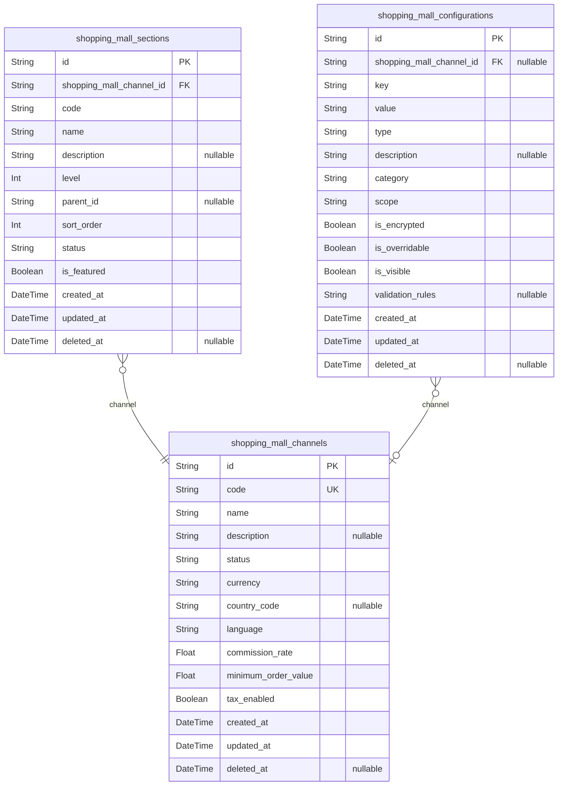
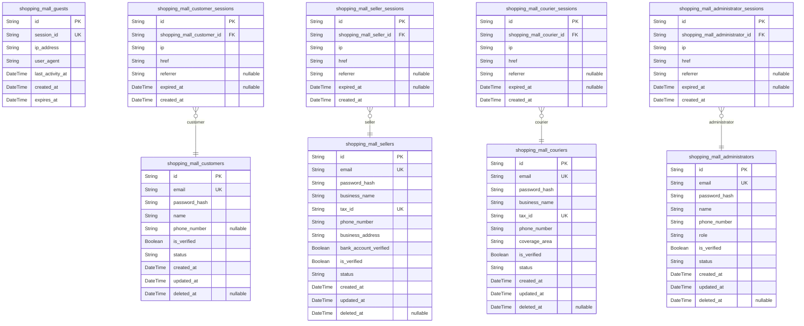
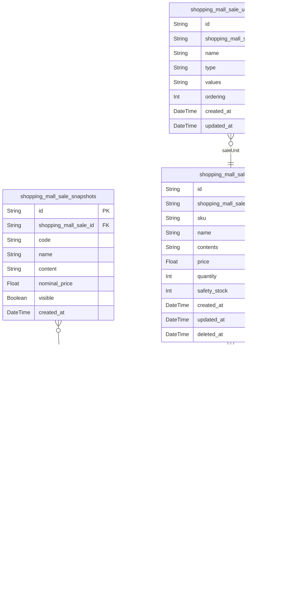
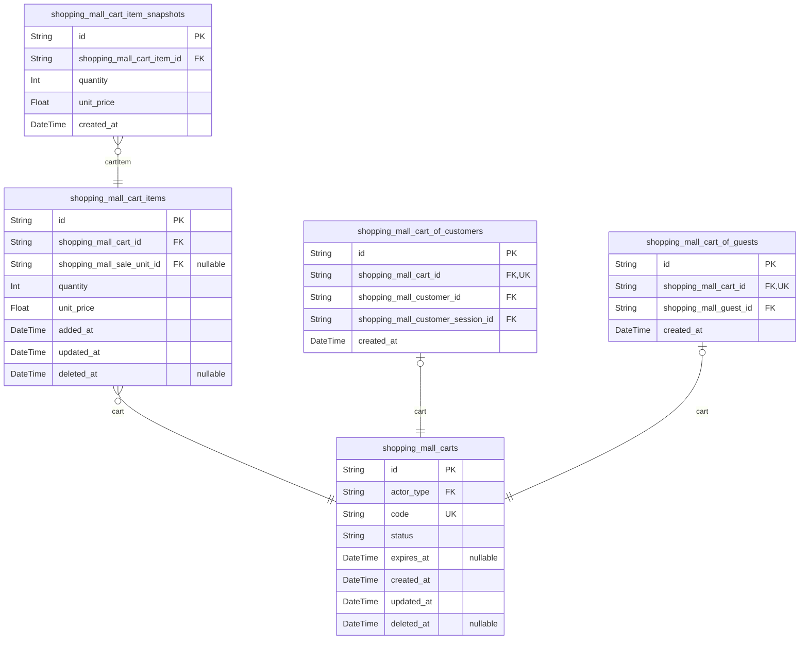
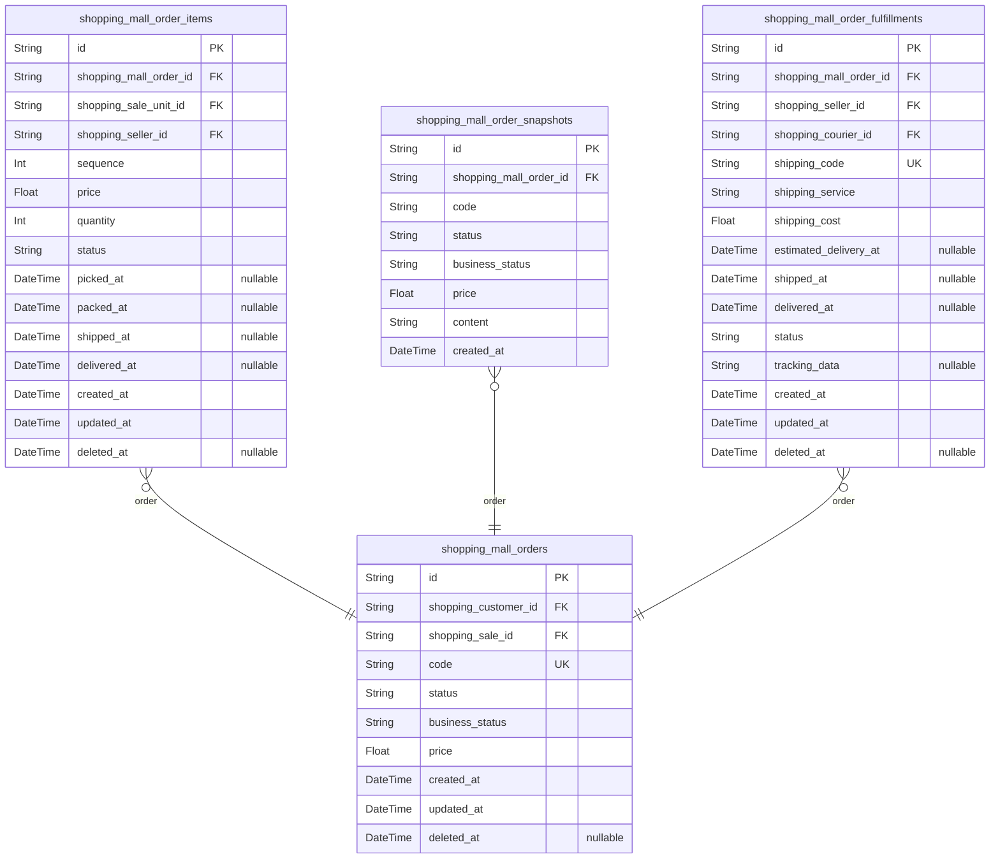
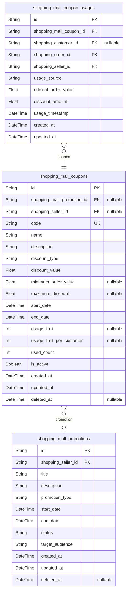
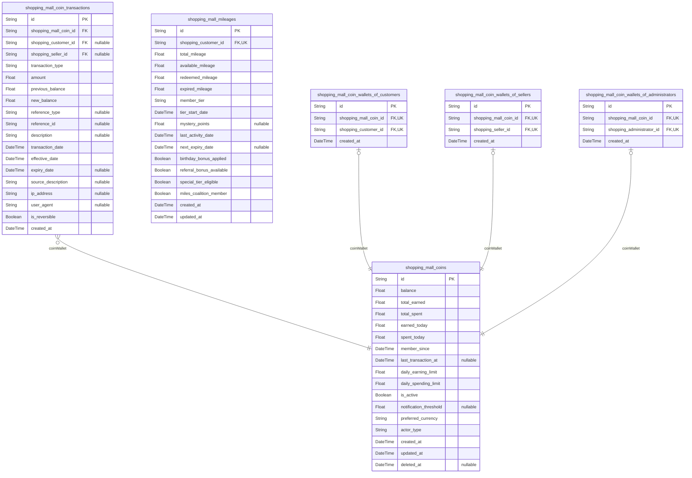
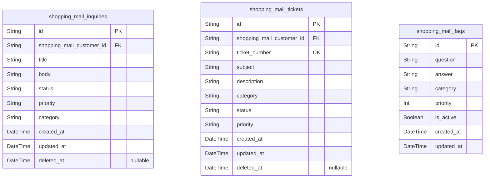
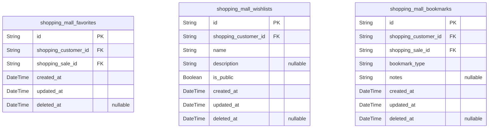
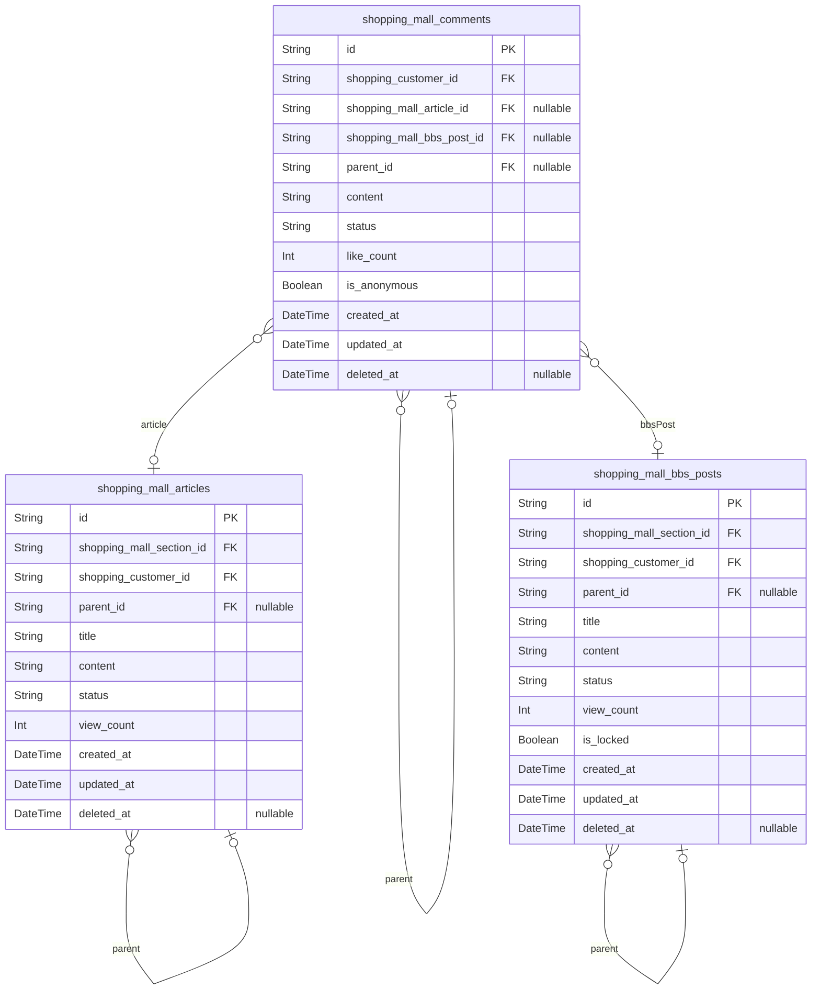

# Prisma Markdown

> Generated by [`prisma-markdown`](https://github.com/samchon/prisma-markdown)

- [Systematic](#systematic)
- [Actors](#actors)
- [Sales](#sales)
- [Carts](#carts)
- [Orders](#orders)
- [Coupons](#coupons)
- [Coins](#coins)
- [Inquiries](#inquiries)
- [Favorites](#favorites)
- [Articles](#articles)

## Systematic

### `shopping_mall_channels`

Platform channel management defining different marketplace environments,
configurations, and business rules.

Channels represent distinct platform instances with unique settings,
policies, and user experiences. Each channel can have different
commission structures, supported countries, and operational
configurations while sharing the same underlying infrastructure.

Properties as follows:

- `id`: Primary Key.
- `code`: Unique channel identifier used for routing and configuration.
- `name`: Channel display name shown to users across the platform.
- `description`: Detailed description of channel purpose and business model.
- `status`: Channel operational status: active, inactive, maintenance, suspended.
- `currency`: Primary currency for transactions in this channel (ISO 4217 code).
- `country_code`: Primary country code for this channel (ISO 3166-1 alpha-2).
- `language`: Primary language for this channel (ISO 639-1).
- `commission_rate`: Default commission percentage charged by platform (0-100%).
- `minimum_order_value`: Minimum order amount required for checkout in this channel.
- `tax_enabled`: Whether tax calculation is enabled for this channel.
- `created_at`: Channel creation timestamp.
- `updated_at`: Last modification timestamp.
- `deleted_at`: Soft deletion timestamp.

### `shopping_mall_sections`

Channel section organization providing hierarchical navigation and
content distribution within marketplace channels.

Sections organize content within channels through hierarchical
categorization, creating intuitive navigation for customers while
enabling flexible merchandising and content management strategies per
channel.

Properties as follows:

- `id`: Primary Key.
- `shopping_mall_channel_id`: Channel's [shopping_mall_channels.id](#shopping_mall_channels)
- `code`: Unique section identifier within the channel.
- `name`: Section display name shown to users.
- `description`: Detailed description of section content and purpose.
- `level`: Hierarchy level for nested sections (0 for top-level).
- `parent_id`: Parent section reference for nested hierarchies.
- `sort_order`: Display order for sections within the same level.
- `status`: Section status: active, inactive, hidden.
- `is_featured`: Whether section appears in featured navigation.
- `created_at`: Section creation timestamp.
- `updated_at`: Last modification timestamp.
- `deleted_at`: Soft deletion timestamp.

### `shopping_mall_configurations`

Platform-wide configuration management providing centralized settings and
parameters for system-wide functionality.

Configuration options control operational behavior, feature toggles,
security settings, and business rules that apply across all marketplace
channels and sections.

Properties as follows:

- `id`: Primary Key.
- `shopping_mall_channel_id`: Channel's [shopping_mall_channels.id](#shopping_mall_channels) (nullable for global configs).
- `key`: Configuration key (namespace.value format).
- `value`: Configuration value (string representing JSON, text, or data).
- `type`: Data type: string, number, boolean, json, text, file.
- `description`: Configuration purpose and usage description.
- `category`: Configuration category: security, features, business, technical.
- `scope`: Scope: global, channel, section, user.
- `is_encrypted`: Whether the value is encrypted at rest.
- `is_overridable`: Whether channel sections can override this setting.
- `is_visible`: Whether configuration appears in admin interfaces.
- `validation_rules`: JSON rules for value validation.
- `created_at`: Configuration creation timestamp.
- `updated_at`: Last modification timestamp.
- `deleted_at`: Soft deletion timestamp.

## Actors

### `shopping_mall_customers`

Customer accounts for the shopping mall platform including personal
information, contact details, and account settings for buyers across the
marketplace.

Customers can browse products, make purchases, manage addresses and
payment methods, track orders, and interact with sellers. Each customer
account is verified through email confirmation and maintains
comprehensive profile information for personalized shopping experiences.

Properties as follows:

- `id`: Primary Key.
- `email`
  > Customer email address used for login and communications. Must be unique
  > across all customer accounts.
- `password_hash`
  > Encrypted password hash for secure authentication using bcrypt with
  > minimum security standards.
- `name`: Customer's full name for account identification and shipping purposes.
- `phone_number`
  > Customer's phone number with international format support for
  > verification and delivery coordination.
- `is_verified`
  > Email verification status. Customers must verify email within 7 days of
  > registration.
- `status`
  > Account status (active|inactive|suspended) for security and business rule
  > enforcement.
- `created_at`: Account creation timestamp for audit trail and time-based analytics.
- `updated_at`
  > Last account update timestamp for tracking account modifications and
  > maintenance.
- `deleted_at`: Soft delete timestamp for account deactivation and potential recovery.

### `shopping_mall_sellers`

Verified business sellers on the shopping mall platform including
business information, tax details, and marketplace settings for vendors
managing their stores.

Sellers undergo a comprehensive verification process including business
registration validation, tax identification verification, and bank
account confirmation. Once approved, sellers can manage product catalogs,
process orders, track performance, and receive platform analytics to
optimize their marketplace operations.

Properties as follows:

- `id`: Primary Key.
- `email`: Seller business email used for login and business communications.
- `password_hash`: Encrypted password hash for secure authentication.
- `business_name`
  > Official registered business name as shown to customers and for tax
  > purposes.
- `tax_id`: Tax identification number (TIN/EIN) verified against government databases.
- `phone_number`: Business contact phone number for customer service and verification.
- `business_address`: Registered business address for verification and correspondence.
- `bank_account_verified`: Bank account verification status for payment processing.
- `is_verified`: Business verification status approved by platform administrators.
- `status`: Account status (active|inactive|suspended|pending_review).
- `created_at`: Verification and account creation timestamp.
- `updated_at`: Last account update for business information changes.
- `deleted_at`: Soft delete timestamp for account management.

### `shopping_mall_couriers`

Delivery courier partners integrated with the shopping mall platform
including business credentials and delivery management capabilities.

Couriers handle package pickup and delivery across the marketplace with
real-time tracking coordination and performance monitoring. Each courier
requires business registration, insurance verification, and vehicle
registration validation before processing delivery orders.

Properties as follows:

- `id`: Primary Key.
- `email`: Courier business email for authentication and communications.
- `password_hash`: Encrypted password hash for secure courier login.
- `business_name`: Registered courier business name for customer communications.
- `tax_id`: Business tax identification number for verification and payouts.
- `phone_number`: Courier control center contact number for delivery coordination.
- `coverage_area`: Geographic region coverage areas for delivery assignment.
- `is_verified`: Business verification status approved by platform administrators.
- `status`: Operational status (active|inactive|suspended|pending_review).
- `created_at`: Courier partner registration timestamp.
- `updated_at`: Last account update for business information.
- `deleted_at`: Soft delete timestamp for courier management.

### `shopping_mall_administrators`

Platform administrative accounts with comprehensive oversight
capabilities for managing all platform operations including seller
verification, dispute resolution, and system administration.

Administrators have unrestricted access to platform-wide analytics, user
management functions, policy enforcement, and operational oversight. Each
administrator undergoes thorough background verification and
role-specific training before platform access is granted.

Properties as follows:

- `id`: Primary Key.
- `email`: Administrator email address for platform management and authentication.
- `password_hash`: Encrypted password hash for secure administrator login.
- `name`: Administrator's full name for identification and audit trail purposes.
- `phone_number`: Admin contact number for two-factor authentication and emergency access.
- `role`: Administrative role (super_admin|support|content_moderator|financial)
- `is_verified`: Administrative verification through two-factor authentication setup.
- `status`: Account status (active|inactive) with immediate effect on platform access.
- `created_at`: Administrator account creation timestamp for audit purposes.
- `updated_at`: Last account update for role or access changes.
- `deleted_at`: Soft delete timestamp for administrative account management.

### `shopping_mall_guests`

Temporary guest accounts for non-authenticated visitors browsing the
shopping mall platform without creating permanent accounts.

Guests can browse products, add items to cart, and view seller
information but cannot complete purchases or access full account
features. Guest sessions are maintained through temporary identifiers and
browser storage mechanisms.

Properties as follows:

- `id`: Primary Key.
- `session_id`
  > Unique session identifier for temporary guest tracking across browser
  > sessions.
- `ip_address`: Visitor IP address for session management and temporary cart storage.
- `user_agent`: Browser user agent information for compatibility and tracking purposes.
- `last_activity_at`
  > Timestamp of the most recent guest activity for session timeout
  > management.
- `created_at`: Guest session creation timestamp.
- `expires_at`
  > Session expiration timestamp - guest sessions auto-expire after 60
  > minutes.

### `shopping_mall_customer_sessions`

Active customer login sessions providing secure authentication
verification and activity tracking for customers accessing the shopping
mall platform.

Sessions enable multi-device management, timeout control, and security
monitoring while maintaining temporary access credentials for seamless
customer experience across different login sessions.

Properties as follows:

- `id`: Primary Key.
- `shopping_mall_customer_id`: Belonged customer's [shopping_mall_customers.id](#shopping_mall_customers)
- `ip`: Customer IP address for session security and geographic information.
- `href`: Login URL or entry point for tracking session initiation context.
- `referrer`: Referring site or source that initiated the session for analytics.
- `expired_at`: Session expiration timestamp for automatic logout and security.
- `created_at`: Session creation timestamp for login duration tracking.

### `shopping_mall_seller_sessions`

Active seller login sessions providing secure authentication verification
and business activity tracking for verified sellers managing their
marketplace operations.

Sessions enable seller dashboard access, order management, product
updates, and account management while maintaining security through
timeout controls and multi-device awareness.

Properties as follows:

- `id`: Primary Key.
- `shopping_mall_seller_id`: Belonged seller's [shopping_mall_sellers.id](#shopping_mall_sellers)
- `ip`
  > Seller IP address for session security verification and activity
  > monitoring.
- `href`: Login URL or entry point for tracking seller session initiation context.
- `referrer`: Referring site or source that initiated the seller session for analytics.
- `expired_at`: Session expiration timestamp for automatic logout from seller dashboard.
- `created_at`
  > Seller session creation timestamp for login duration and activity
  > tracking.

### `shopping_mall_courier_sessions`

Active courier login sessions providing authentication verification and
delivery activity tracking for courier partners managing shipments on the
platform.

Sessions enable delivery route management, pickup scheduling, shipment
tracking updates, and performance monitoring while maintaining security
through session timeout controls.

Properties as follows:

- `id`: Primary Key.
- `shopping_mall_courier_id`: Belonged courier's [shopping_mall_couriers.id](#shopping_mall_couriers)
- `ip`
  > Courier IP address for session security verification and dispatch
  > location tracking.
- `href`: Login URL or entry point for tracking courier session initiation context.
- `referrer`
  > Referring site or source that initiated courier session for delivery
  > analytics.
- `expired_at`: Session expiration timestamp for automatic logout from courier operations.
- `created_at`: Courier session creation timestamp for login duration and route tracking.

### `shopping_mall_administrator_sessions`

Active administrator login sessions providing secure authentication
verification and oversight activity tracking for platform administrators
managing system operations.

Sessions enable comprehensive administrative functions including user
management, seller verification, dispute resolution, platform analytics,
and system configuration while maintaining high security through strict
session controls.

Properties as follows:

- `id`: Primary Key.
- `shopping_mall_administrator_id`: Belonged administrator's [shopping_mall_administrators.id](#shopping_mall_administrators)
- `ip`
  > Administrator IP address for session security verification and access
  > control.
- `href`
  > Login URL or entry point for tracking administrator session initiation
  > context.
- `referrer`
  > Referring site or source that initiated administrative session for
  > security logging.
- `expired_at`
  > Session expiration timestamp for automatic logout from administrative
  > functions.
- `created_at`: Administrator session creation timestamp for access audit and tracking.

## Sales

### `shopping_mall_sales`

Core product catalog entries in the marketplace enabling sellers to list
items for sale with comprehensive product information and multi-seller
support.

Products represent individual SKUs with detailed specifications, pricing,
and catalog information. Each sale entry can be managed by different
types of actors (customers, sellers) through a polymorphic ownership
pattern.

The system tracks product lifecycle from drafting through approval and
sale, maintaining comprehensive history through snapshot functionality
for analytics and compliance.

Properties as follows:

- `id`: Primary Key.
- `shopping_channel_id`
  > The sales channel's [shopping_channels.id](#shopping_channels) where this product is
  > listed.
- `shopping_section_id`: The section's [shopping_sections.id](#shopping_sections) organizing this product.
- `code`: Unique product code used for catalog organization and search.
- `name`: Product display name for customer browsing and search results.
- `actor_type`
  > Creator type: customer, seller, administrator indicating who can manage
  > this product.
- `content`: Detailed product description with specifications and features.
- `nominal_price`: Base price of the product excluding taxes and discounts.
- `visible`: Whether this product is visible to customers in search and categories.
- `opened_at`: When this product was first made available for sale.
- `closed_at`: When this product was closed or discontinued from sale.
- `created_at`: Creation timestamp.
- `updated_at`: Last modification timestamp.
- `deleted_at`: Soft deletion timestamp for historical preservation.

### `shopping_mall_sale_snapshots`

Historical snapshots capturing product state at specific moments for
audit trails and business analytics.

Sale snapshots record complete product information including pricing,
availability, and content state enabling comprehensive analysis of
product lifecycle changes. This supports seller performance analysis,
price tracking, and compliance auditing across the marketplace.

Properties as follows:

- `id`: Primary Key.
- `shopping_mall_sale_id`: Referenced product sale's [shopping_mall_sales.id](#shopping_mall_sales).
- `code`: Snapshot version of the product code at moment of capture.
- `name`: Snapshot version of the product name at moment of capture.
- `content`: Snapshot version of the product content at moment of capture.
- `nominal_price`: Snapshot version of the product price at moment of capture.
- `visible`: Snapshot version of the product visibility at moment of capture.
- `created_at`: Snapshot creation timestamp.

### `shopping_mall_sale_units`

Product variant management providing inventory tracking for different
product options on the marketplace.

Sale units represent specific SKU-level products with individual
inventory counting, pricing, and management. Each unit belongs to a
parent sale product but maintains independent tracking for variants
(size, color, material).

The system enables precise inventory management, variant-specific
pricing, and comprehensive stock level monitoring across the multi-seller
catalog.

Properties as follows:

- `id`: Primary Key.
- `shopping_mall_sale_id`: Parent product sale's [shopping_mall_sales.id](#shopping_mall_sales).
- `sku`: Stock keeping unit identifier unique across the platform.
- `name`: Variant-specific name for this particular product unit.
- `contents`: Variant-specific description for this product unit.
- `price`: Selling price including any variant-specific pricing adjustments.
- `quantity`: Available inventory quantity for this specific unit.
- `safety_stock`: Minimum stock level before restocking alerts.
- `created_at`: Creation timestamp.
- `updated_at`: Last modification timestamp.
- `deleted_at`: Soft deletion timestamp.

### `shopping_mall_sale_unit_options`

Configurable options for product units enabling variant-specific features.

Sale unit options provide detailed configurability for product variants
including size, color, material, or other distinguishing characteristics.
These options enable precise inventory management and customer selection
for complex product configurations.

The system supports multiple option types per unit with value-based
configuration enabling sophisticated product matrix management across the
multi-seller catalog.

Properties as follows:

- `id`: Primary Key.
- `shopping_mall_sale_unit_id`: Parent sale unit's [shopping_mall_sale_units.id](#shopping_mall_sale_units).
- `name`: Option name for customer selection (Size, Color, Material).
- `type`: Option type category (select, checkbox, radio, text).
- `values`: Available option values for customer selection.
- `ordering`: Display order for option selection in customer interface.
- `created_at`: Creation timestamp.
- `updated_at`: Last modification timestamp.

## Carts

### `shopping_mall_carts`

Shopping cart management for customers in multi-vendor marketplace.

Maintains shopping cart state across sessions with proper ownership
tracking through polymorphic design. Supports both customer and guest
ownership while ensuring data integrity and audit trail capabilities.

The cart preserves product selections, quantities, and pricing snapshots
while coordinating inventory availability across multiple sellers. Each
cart maintains creator attribution through actor-specific subtype
entities enabling comprehensive tracking and recovery capabilities.

Properties as follows:

- `id`: Primary Key.
- `actor_type`: Actor type identifier (customer, guest) for cart ownership.
- `code`: Unique cart identifier for customer reference and sharing.
- `status`
  > Cart status (active, abandoned, converted, expired) for lifecycle
  > tracking.
- `expires_at`: Cart expiration timestamp for automatic cleanup of inactive carts.
- `created_at`: Timestamp when the cart was created.
- `updated_at`: Last modification timestamp for cart contents.
- `deleted_at`: Soft deletion timestamp for cart recovery and audit trails.

### `shopping_mall_cart_items`

Individual items within customer's shopping cart with comprehensive audit
tracking.

Represents each product selection in the cart including variant choices,
quantity preferences, pricing snapshots, and inventory tracking. The
system enables sophisticated inventory management with real-time
availability monitoring across multiple sellers.

Items maintain independent tracking for each seller in the cart with
comprehensive audit trail support enabling historical analysis of cart
contents, customer behavior patterns, and business intelligence insights
across the multi-vendor marketplace.

Properties as follows:

- `id`: Primary Key.
- `shopping_mall_cart_id`
  > Parent cart's [shopping_mall_carts.id](#shopping_mall_carts). Each item belongs to
  > exactly one cart.
- `shopping_mall_sale_unit_id`
  > Selected product variant's [shopping_mall_sale_units.id](#shopping_mall_sale_units).
  > Identifies specific variant (size, color, etc.).
- `quantity`: Number of units of this item in the cart for checkout processing.
- `unit_price`: Price per unit of this variant at cart addition time for pricing accuracy.
- `added_at`: Timestamp when this item was added to cart for audit trail.
- `updated_at`: Last modification timestamp for quantity or cart association.
- `deleted_at`: Soft deletion timestamp for item recovery and audit trails.

### `shopping_mall_cart_of_customers`

Customer-owned shopping carts enabling proper attribution and tracking.

Links shopping carts to authenticated customers while maintaining
referential integrity and enabling comprehensive customer behavior
analysis. Supports cart recovery, abandonment tracking, and multi-device
synchronization for registered users.

The subtype entity ensures that customer-owned carts maintain proper data
integrity while enabling sophisticated customer service features and
business intelligence analysis across the multi-vendor marketplace
platform.

Properties as follows:

- `id`: Primary Key.
- `shopping_mall_cart_id`
  > Parent cart's [shopping_mall_carts.id](#shopping_mall_carts). Ensures 1:1 relationship
  > with cart entity.
- `shopping_mall_customer_id`
  > Cart owner's [shopping_mall_customers.id](#shopping_mall_customers). Provides customer
  > attribution for cart analysis.
- `shopping_mall_customer_session_id`
  > Customer session's [shopping_mall_customer_sessions.id](#shopping_mall_customer_sessions). Links cart
  > to specific authenticated session.
- `created_at`: Timestamp when customer-cart relationship was established.

### `shopping_mall_cart_of_guests`

Guest-owned shopping carts enabling temporary cart management.

Links shopping carts to temporary guest accounts while maintaining
session-based tracking and enabling cart persistence across guest
browsing sessions. Supports cart recovery for guest users who later
create accounts.

The subtype entity ensures that guest-owned carts maintain proper data
integrity while enabling multi-session cart persistence and future
customer conversion tracking across the marketplace platform.

Properties as follows:

- `id`: Primary Key.
- `shopping_mall_cart_id`
  > Parent cart's {\link shopping_mall_carts.id}. Ensures 1:1 relationship
  > with cart entity.
- `shopping_mall_guest_id`
  > Cart owner's {\link shopping_mall_guests.id}. Provides temporary guest
  > attribution.
- `created_at`: Timestamp when guest-cart relationship was established.

### `shopping_mall_cart_item_snapshots`

Historical snapshots capturing cart item states for audit trails.

Preserves point-in-time states of cart items to track pricing changes,
inventory availability, and customer behavior patterns. Essential for
cart abandonment analysis, customer service, and business intelligence
reporting.

The snapshot system enables comprehensive tracking of cart contents over
time while maintaining data integrity and supporting sophisticated
analytics for marketplace operations optimization and customer experience
improvement initiatives.

Properties as follows:

- `id`: Primary Key.
- `shopping_mall_cart_item_id`
  > Cart item's [shopping_mall_cart_items.id](#shopping_mall_cart_items). Links snapshot to
  > specific item.
- `quantity`: Captured quantity at snapshot time for historical accuracy.
- `unit_price`: Captured unit price for audit trail and pricing analysis.
- `created_at`: Snapshot creation timestamp.

## Orders

### `shopping_mall_orders`

Core order management system for multi-vendor marketplace transactions.

Stores comprehensive order information including customer details, seller
relationships, payment statuses, and fulfillment tracking across the
entire marketplace ecosystem. Each order represents a complete
transaction that may contain items from multiple sellers, with the system
automatically managing order splitting and individual seller fulfillment
workflows.

Orders maintain complete audit trails of all status changes, payment
processing, and customer communications while supporting complex
scenarios like partial fulfillment, split shipments, and multi-currency
transactions.

Properties as follows:

- `id`: Primary Key.
- `shopping_customer_id`: Belonged customer's [shopping_mall_customers.id](#shopping_mall_customers)
- `shopping_sale_id`: Belonged sale's [shopping_mall_sales.id](#shopping_mall_sales)
- `code`: Unique order identifier for customer reference
- `status`: Current order status: pending, processing, shipped, delivered, cancelled
- `business_status`: Business workflow status based on seller processing requirements
- `price`: Total order amount including all items and shipping costs
- `created_at`: Order creation timestamp
- `updated_at`: Last modification timestamp
- `deleted_at`: Soft deletion timestamp for order lifecycle management

### `shopping_mall_order_items`

Individual items within marketplace orders providing detailed product,
pricing, and fulfillment tracking.

Each order item represents a specific product variant with associated
pricing, quantities, and fulfillment details. The system tracks
item-level status including inventory allocation, picking confirmation,
packing status, and shipping details while supporting partial fulfillment
scenarios.

The tracking system maintains comprehensive item journey records
including warehouse operations, carrier handoffs, delivery confirmations,
and return processing while linking to the specific seller responsible
for fulfillment.

Properties as follows:

- `id`: Primary Key.
- `shopping_mall_order_id`: Belonged order's [shopping_mall_orders.id](#shopping_mall_orders)
- `shopping_sale_unit_id`: Belonged sale unit's [shopping_mall_sale_units.id](#shopping_mall_sale_units)
- `shopping_seller_id`: Belonged seller's [shopping_mall_sellers.id](#shopping_mall_sellers)
- `sequence`: Display order within the order confirmation
- `price`: Item price at time of purchase
- `quantity`: Number of units ordered
- `status`: Item fulfillment status: pending, allocated, packed, shipped, delivered
- `picked_at`: When item was picked from inventory
- `packed_at`: When item was packed for shipment
- `shipped_at`: When item was handed to carrier
- `delivered_at`: When carrier confirmed delivery
- `created_at`: Item creation timestamp
- `updated_at`: Last modification timestamp
- `deleted_at`: Soft deletion timestamp

### `shopping_mall_order_snapshots`

Historical point-in-time captures of order state for audit trails and
compliance.

Order snapshots preserve the exact state of orders including prices,
items, seller information, and customer details at specific moments in
time. This enables accurate reconstruction of order history for dispute
resolution, compliance reporting, and business intelligence analysis.

The system creates snapshots at critical lifecycle events including order
creation, payment completion, shipment confirmation, delivery
confirmation, and order completion while maintaining all relevant data
for regulatory compliance and customer service requirements.

Properties as follows:

- `id`: Primary Key.
- `shopping_mall_order_id`: Belonged order's [shopping_mall_orders.id](#shopping_mall_orders)
- `code`: Snapshot of order code at time of capture
- `status`: Snapshot of order status at time of capture
- `business_status`: Snapshot of business workflow status
- `price`: Snapshot of total order amount at capture time
- `content`: Complete snapshot data as JSON preserving comprehensive order state
- `created_at`: Snapshot creation timestamp

### `shopping_mall_order_fulfillments`

Order fulfillment coordination and tracking across multiple carriers and
shipping partners.

Order fulfillments manage the complex shipping logistics for marketplace
orders including carrier coordination, tracking number management,
delivery scheduling, and exception handling across multiple sellers and
shipping services.

The system supports sophisticated routing logic including optimal carrier
selection, shipment consolidation, delivery scheduling, and exception
management while maintaining real-time tracking visibility for all
stakeholders throughout the fulfillment process.

Properties as follows:

- `id`: Primary Key.
- `shopping_mall_order_id`: Belonged order's [shopping_mall_orders.id](#shopping_mall_orders)
- `shopping_seller_id`: Belonged seller's [shopping_mall_sellers.id](#shopping_mall_sellers)
- `shopping_courier_id`: Belonged courier's [shopping_mall_couriers.id](#shopping_mall_couriers)
- `shipping_code`: Carrier tracking number for package identification
- `shipping_service`: Shipping service level: Ground, Express, Overnight
- `shipping_cost`: Actual shipping cost charged to customer
- `estimated_delivery_at`: Predicted delivery date based on carrier estimates
- `shipped_at`: When package was handed to carrier
- `delivered_at`: When carrier confirmed final delivery
- `status`: Fulfillment status: scheduled, in_transit, delivered, exception
- `tracking_data`: Real-time tracking information from carrier API
- `created_at`: Fulfillment creation timestamp
- `updated_at`: Last modification timestamp
- `deleted_at`: Soft deletion timestamp

## Coupons

### `shopping_mall_coupons`

Core coupon management system for the marketplace enabling sophisticated
discount and promotion logic. Customers can browse available coupons
while sellers create targeted promotional offers with complex eligibility
rules based on customer segments, order values, or specific product
categories.

Properties as follows:

- `id`: Primary Key.
- `shopping_mall_promotion_id`: Associated promotion's [shopping_mall_promotions.id](#shopping_mall_promotions)
- `shopping_seller_id`: Creating seller's [shopping_mall_sellers.id](#shopping_mall_sellers)
- `code`
  > Unique coupon code for customer redemption. Alphanumeric format with
  > maximum 20 characters.
- `name`: Coupon name displayed to customers. Maximum 50 characters.
- `description`: Detailed coupon description explaining usage terms and limitations.
- `discount_type`: Discount type: percentage, fixed_amount, free_shipping.
- `discount_value`: Discount amount or percentage based on discount_type.
- `minimum_order_value`: Minimum order value required to use coupon. Zero for no minimum.
- `maximum_discount`: Maximum discount amount for percentage-based coupons.
- `start_date`: Coupon activation date and time.
- `end_date`: Coupon expiration date and time.
- `usage_limit`: Maximum number of times this coupon can be used by all customers combined.
- `usage_limit_per_customer`: Maximum number of times individual customer can use this coupon.
- `used_count`: Number of times this coupon has been used.
- `is_active`: Whether this coupon is currently active and available for use.
- `created_at`: Record creation timestamp.
- `updated_at`: Record last update timestamp.
- `deleted_at`: Soft delete timestamp for promotional records management.

### `shopping_mall_coupon_usages`

Coupon usage tracking system maintaining complete audit trail of coupon
redemption activities across the marketplace. Enables comprehensive
analysis of coupon performance and protects against fraudulent usage
patterns while maintaining historical records for business intelligence
and customer service.

Properties as follows:

- `id`: Primary Key.
- `shopping_mall_coupon_id`: Coupon used for this activity [shopping_mall_coupons.id](#shopping_mall_coupons)
- `shopping_customer_id`: Customer using the coupon [shopping_mall_customers.id](#shopping_mall_customers)
- `shopping_order_id`: Order where coupon was applied [shopping_mall_orders.id](#shopping_mall_orders)
- `shopping_seller_id`: Coupon issuing seller [shopping_mall_sellers.id](#shopping_mall_sellers)
- `usage_source`: Where coupon was used: website, mobile_app, email_campaign.
- `original_order_value`: Order subtotal before applying coupon discount.
- `discount_amount`: Actual coupon discount applied to this order.
- `usage_timestamp`: Exact time when coupon was applied to the order.
- `created_at`: Record creation timestamp for usage tracking.
- `updated_at`: Record last update timestamp.

### `shopping_mall_promotions`

Promotional management system enabling sellers to create sophisticated
marketing campaigns with customizable rules. Supports multiple campaign
types including seasonal promotions, loyalty programs, and targeted
discount offers with comprehensive analytics tracking campaign
performance across customer segments and time periods.

Properties as follows:

- `id`: Primary Key.
- `shopping_seller_id`: Running seller's [shopping_mall_sellers.id](#shopping_mall_sellers)
- `title`
  > Promotion title displayed to customers and sellers. Maximum 100
  > characters.
- `description`: Detailed promotion description explaining campaign overview and benefits.
- `promotion_type`
  > Promotion type: flash_sale, seasonal_sale, loyalty_program,
  > category_discount.
- `start_date`: Promotion activation start date and time.
- `end_date`: Promotion expiration date and time.
- `status`: Current promotion status: scheduled, active, completed, cancelled.
- `target_audience`
  > Intended audience: all_customers, new_customers, repeat_customers,
  > specific_segment.
- `created_at`: Record creation timestamp for campaign tracking.
- `updated_at`: Record last update timestamp.
- `deleted_at`: Soft delete timestamp for campaign lifecycle management.

## Coins

### `shopping_mall_coins`

Digital coin wallet system for managing customer, seller, and
administrator coin balances with proper temporal audit support.

The coin system provides a unified wallet interface while maintaining
proper referential integrity through subtype entities for each actor
type. Supports real-time balance tracking, daily limits, and
comprehensive transaction history.

Each wallet maintains separate balance counters with activity timestamps
for fraud detection analytics. The system enforces daily earning/spending
limits and supports notification thresholds for engagement campaigns.

Properties as follows:

- `id`: Primary Key.
- `balance`
  > Current coin balance in the wallet. Can be positive or negative for
  > tracking debits and credits with decimal precision.
- `total_earned`: Lifetime total coins earned across all transactions.
- `total_spent`: Lifetime total coins spent across all transactions.
- `earned_today`: Coins earned today with automatic reset at midnight.
- `spent_today`: Coins spent today with automatic reset at midnight.
- `member_since`: Date when the wallet was created for account age tracking.
- `last_transaction_at`: Timestamp of most recent transaction activity.
- `daily_earning_limit`: Maximum coins that can be earned per day for abuse prevention.
- `daily_spending_limit`: Maximum coins that can be spent per day for fraud protection.
- `is_active`: Whether the wallet is active for transactions.
- `notification_threshold`: Balance threshold for promotional notifications.
- `preferred_currency`: Preferred display currency for localized reporting.
- `actor_type`
  > Type of actor that owns this wallet: "customer", "seller", or
  > "administrator".
- `created_at`: Record creation timestamp.
- `updated_at`: Last modification timestamp.
- `deleted_at`: Timestamp when wallet was soft deleted for audit purposes.

### `shopping_mall_coin_transactions`

Complete transaction history for digital coin movements including
earning, spending, refunds, and administrative adjustments.

The transaction system maintains immutable records of all coin movements
within the marketplace ecosystem. Every coin creation or destruction
event is logged with detailed context including the transaction type,
participating parties, business reason, and precise timestamp for
comprehensive audit trail.

Transactions support various earning mechanisms including purchase
rewards, promotional campaigns, referral bonuses, and manual adjustments
while maintaining strict accounting integrity. The system ensures balance
reconciliation through atomic transaction processing and provides
detailed analytics for customer behavior analysis and loyalty program
optimization.

Properties as follows:

- `id`: Primary Key.
- `shopping_mall_coin_id`: Associated coin wallet for the transaction. [shopping_mall_coins.id](#shopping_mall_coins)
- `shopping_customer_id`
  > Customer involved in the transaction (for earning or spending). {@link
  > shopping_mall_customers.id}
- `shopping_seller_id`
  > Seller involved in the transaction (for rewarding or receiving). {@link
  > shopping_mall_sellers.id}
- `transaction_type`
  > Type of coin transaction: "earning" (coins received), "spending" (coins
  > used), "refund" (coins returned), "adjustment" (administrative changes),
  > "expiry" (expired coins), or "conversion" (mileage to coins conversion).
  > Supports comprehensive transaction categorization for loyalty program
  > analytics.
- `amount`
  > Coin amount for the transaction. Positive for earning, negative for
  > spending/refunds. Supports fractional amounts for precise loyalty
  > calculations while maintaining audit trail integrity.
- `previous_balance`
  > Wallet balance before the transaction. Enables balance verification and
  > audit trail reconstruction in case of system issues or dispute
  > resolution.
- `new_balance`
  > Wallet balance after the transaction. Must equal previous_balance +
  > amount for accounting integrity verification and balance reconciliation
  > processes.
- `reference_type`
  > References the business context: "order" (purchase-related), "promotion"
  > (campaign-related), "referral" (referral bonus), "manual"
  > (administrative), "expiry" (automatic expiration), or "conversion"
  > (currency conversion). Provides context for transaction analytics and
  > reporting.
- `reference_id`
  > ID reference to the related business entity. Links to orders, promotions,
  > referrals, or other relevant entities based on reference_type for
  > complete transaction context and audit trail maintenance.
- `description`
  > Detailed explanation of the transaction reason. Provides human-readable
  > context for customer service, dispute resolution, and loyalty program
  > understanding of transaction purposes.
- `transaction_date`
  > Date and time when the transaction was recorded. Maintains precise
  > chronological ordering for audit trail integrity and customer transaction
  > history reporting.
- `effective_date`
  > Date when the transaction takes effect (may differ from transaction_date
  > for batch processing). Supports backdated transactions and end-of-period
  > processing requirements.
- `expiry_date`
  > Date when earned coins expire (applicable for promotional or bonus
  > coins). Enables time-limited loyalty rewards and automatic coin expiry
  > processing for promotional funds.
- `source_description`
  > Source system or process that initiated the transaction. Tracks automatic
  > processes, user actions, administrative overrides, or system integrations
  > for complete audit trail maintenance.
- `ip_address`
  > IP address of the device used for the transaction. Provides additional
  > security context for fraud detection analytics and geographic transaction
  > pattern analysis.
- `user_agent`
  > Browser or app user agent for transaction source tracking. Helps identify
  > device types and geographic patterns for security analytics and customer
  > behavior analysis.
- `is_reversible`
  > Whether this transaction can be reversed or modified. False for final
  > transactions (spending, expiry), true for reversible transactions
  > requiring future adjustments or corrections.
- `created_at`
  > Record creation timestamp for database operation tracking and historical
  > audit trail maintenance within the transaction logging system.

### `shopping_mall_mileages`

Digital mileage points system for loyalty program management including
earning, redemption, and expiration tracking.

The mileage system provides a complete loyalty points framework separate
from the coin system, focusing on purchase-based rewards, tier
progression, and redemption for premium rewards. Mileage points operate
as a separate currency with different earning rates, redemption
schedules, and business rules compared to coins.

The system supports tiered loyalty programs with escalating benefits,
automatic mileage expiry processing, detailed redemption history
tracking, and comprehensive analytics for customer engagement monitoring.
Mileage tracking enables sophisticated loyalty program mechanics
including upgrade pathways, bonus point campaigns, and targeted
promotional offers based on customer activity patterns.

Properties as follows:

- `id`: Primary Key.
- `shopping_customer_id`: Associated customer's mileage account. [shopping_mall_customers.id](#shopping_mall_customers)
- `total_mileage`
  > Total lifetime mileage points earned. Tracks cumulative loyalty point
  > accumulation for tier eligibility calculations and long-term customer
  > engagement analytics.
- `available_mileage`
  > Current available mileage balance for redemption. Deducts
  > already-redeemed points and expired points to show actual redeemable
  > balance for customer benefit calculations.
- `redeemed_mileage`
  > Lifetime mileage points that have been redeemed. Tracks customer reward
  > engagement and redemption patterns for loyalty program effectiveness
  > analysis.
- `expired_mileage`
  > Mileage points that have expired due to inactivity. Enables automatic
  > expiry processing and provides transparency about loyalty point lifecycle
  > management.
- `member_tier`
  > Current loyalty tier: "bronze", "silver", "gold", or "platinum".
  > Determines benefit levels including earning multipliers, special offers,
  > and service privileges based on point accumulation and activity patterns.
- `tier_start_date`
  > Date when current tier level was achieved. Used for tier anniversary
  > rewards, upgrade pathway calculations, and loyalty program progression
  > tracking.
- `mystery_points`
  > Bonus mileage points for surprise rewards or promotional campaigns.
  > Enables flexible loyalty program mechanics and targeted engagement
  > campaigns with customer delight features.
- `last_activity_date`
  > Date of most recent mileage-related activity. Used for activity-based
  > promotions, engagement monitoring, and automatic account maintenance for
  > inactive accounts.
- `next_expiry_date`
  > Date when points will expire if not used. Provides customer transparency
  > about mileage validity and enables proactive redemption campaigns before
  > expiration dates.
- `birthday_bonus_applied`
  > Whether the customer received mileage bonus for their birthday this year.
  > Prevents duplicate birthday rewards and tracks personalized celebration
  > benefits in loyalty program.
- `referral_bonus_available`
  > Whether the customer has unused referral bonus credit available. Enables
  > tracking of friend referral benefits and encourages social sharing for
  > loyalty program growth.
- `special_tier_eligible`
  > Whether the customer is eligible for special tier upgrades. Indicates VIP
  > status or special consideration for targeted loyalty benefits beyond
  > standard tier progression.
- `miles_coalition_member`
  > Whether the customer participates in partner airline or coalition mileage
  > programs. Enables broader loyalty ecosystem integration and
  > cross-platform benefit coordination.
- `created_at`
  > Record creation timestamp for account age tracking and loyalty program
  > analytics including member acquisition trends and retention analysis.
- `updated_at`
  > Last modification timestamp for activity tracking and concurrency control
  > within the loyalty points management system with real-time balance
  > updates.

### `shopping_mall_coin_wallets_of_customers`

Customer-specific coin wallet configuration linking main wallet to
customer entities.

This subtype entity maintains the relationship between the main coin
wallet and customer accounts while ensuring referential integrity. Each
customer can have exactly one coin wallet for unified currency management
across the marketplace.

The connection provides proper normalized structure avoiding the
anti-pattern of multiple nullable foreign keys in the main wallet table.

Properties as follows:

- `id`: Primary Key.
- `shopping_mall_coin_id`: Associated coin wallet. [shopping_mall_coins.id](#shopping_mall_coins)
- `shopping_customer_id`: Associated customer account. [shopping_mall_customers.id](#shopping_mall_customers)
- `created_at`: Connection creation timestamp.

### `shopping_mall_coin_wallets_of_sellers`

Seller-specific coin wallet configuration linking main wallet to seller
entities.

This subtype entity maintains the relationship between the main coin
wallet and verified seller accounts while ensuring referential integrity.
Each seller can have exactly one coin wallet for unified currency
management in their marketplace operations.

The connection provides proper normalized structure and enables
seller-specific coin wallet management.

Properties as follows:

- `id`: Primary Key.
- `shopping_mall_coin_id`: Associated coin wallet. [shopping_mall_coins.id](#shopping_mall_coins)
- `shopping_seller_id`: Associated seller account
- `created_at`: Connection creation timestamp.

### `shopping_mall_coin_wallets_of_administrators`

Administrator-specific coin wallet configuration linking main wallet to
administrator entities.

This subtype entity maintains the relationship between the main coin
wallet and platform administrator accounts while ensuring referential
integrity. Each administrator can have exactly one coin wallet for
system-level currency operations.

The connection provides proper normalized structure and enables
administrator-specific coin wallet management.

Properties as follows:

- `id`: Primary Key.
- `shopping_mall_coin_id`: Associated coin wallet. [shopping_mall_coins.id](#shopping_mall_coins)
- `shopping_administrator_id`: Associated administrator account. [shopping_mall_administrators.id](#shopping_mall_administrators)
- `created_at`: Connection creation timestamp.

## Inquiries

### `shopping_mall_inquiries`

Customer inquiries and communication records supporting the marketplace
support system. Allows customers to submit questions, concerns, or
requests with automated routing to appropriate support channels. Provides
customers with independent inquiry management capabilities including
searching, filtering, and tracking inquiry status across all marketplace
interactions.

Properties as follows:

- `id`: Primary Key.
- `shopping_mall_customer_id`: Customer's [shopping_mall_customers.id](#shopping_mall_customers) who initiated the inquiry
- `title`: Brief summary or subject line of the customer inquiry
- `body`: Detailed description of the customer's question, concern, or request
- `status`: Current state of the inquiry - open, in_progress, resolved, or closed
- `priority`: Urgency level of the inquiry - low, medium, high, or urgent
- `category`
  > Classification of inquiry type - order, product, shipping, return, or
  > general
- `created_at`: Timestamp when the inquiry was created
- `updated_at`: Most recent modification timestamp
- `deleted_at`: Soft deletion timestamp - null if active

### `shopping_mall_tickets`

Support tickets enabling customers to request assistance with marketplace
issues. Customers can create, track, and manage tickets independently
from other marketplace operations. Supports escalation workflows allowing
customers to browse, filter, and search tickets across different
categories, sellers, or order types for comprehensive support history
management.

Properties as follows:

- `id`: Primary Key.
- `shopping_mall_customer_id`: Customer's [shopping_mall_customers.id](#shopping_mall_customers) who created the ticket
- `ticket_number`: Unique ticket identifier for customer reference
- `subject`: Brief summary of the support issue or request
- `description`: Detailed explanation of the issue requiring assistance
- `category`
  > Classification of support issue - technical, account, shipping, product,
  > return, or other
- `status`
  > Current state of the ticket - open, assigned, in_progress, need_info,
  > resolved, or closed
- `priority`: Level of urgency - low, medium, high, critical
- `created_at`: Timestamp when the ticket was created
- `updated_at`: Most recent modification timestamp
- `deleted_at`: Soft deletion timestamp - null if active

### `shopping_mall_faqs`

Knowledge base frequently asked questions enabling customers to find
answers independently. Content is created and managed by platform
administrators as a self-service support resource. Provides customers
with access to common solutions, policies, and platform guidance without
requiring direct support interaction from customer service teams.

Properties as follows:

- `id`: Primary Key.
- `question`: Frequently asked question posed by customers
- `answer`: Detailed answer to the question with comprehensive guidance
- `category`
  > Classification of FAQ - orders, payments, shipping, returns, products, or
  > general
- `priority`: Display order priority - lower numbers appear first
- `is_active`: Whether the FAQ is visible to customers
- `created_at`: Timestamp when the FAQ was created
- `updated_at`: Most recent modification timestamp

## Favorites

### `shopping_mall_favorites`

Customer favorite products across the marketplace, enabling users to save
and track preferred items from multiple sellers.

This system allows customers to build personalized collections of
favorite products, facilitating quick access to items they love and may
wish to purchase later. Favorites are tracked per customer with timestamp
data to enable "recently added" filtering and analytics.

Customers can favorite products from any seller, creating unified
personal collections that span the entire marketplace while maintaining
seller-specific data for business intelligence and product recommendation
systems.

Properties as follows:

- `id`: Primary Key.
- `shopping_customer_id`: Customer's [shopping_mall_customers.id](#shopping_mall_customers) who favorited the product
- `shopping_sale_id`: Favorited product's [shopping_mall_sales.id](#shopping_mall_sales)
- `created_at`: Timestamp when the customer favorited this product
- `updated_at`: Timestamp of last modification to this favorite record
- `deleted_at`: Soft deletion timestamp - used for managing removed favorites

### `shopping_mall_wishlists`

Customer wishlist collections enabling users to create themed groups of
products they desire for future purchase.

Wishlists extend beyond simple favorites by allowing customers to
organize products into themed collections such as "Birthday Gifts," "Home
Decor Ideas," or "Summer Fashion." This enables more sophisticated
product organization and sharing capabilities with friends and family.

The wishlist system supports collaborative shopping where customers can
share curated lists with others while maintaining privacy controls. Each
wishlist can contain products from multiple sellers, providing unified
shopping inspiration across the entire marketplace ecosystem.

Properties as follows:

- `id`: Primary Key.
- `shopping_customer_id`: Wishlist owner's [shopping_mall_customers.id](#shopping_mall_customers)
- `name`: Wishlist name chosen by customer (e.g., 'Birthday Gifts', 'My Style')
- `description`: Optional description of the wishlist's theme or purpose
- `is_public`: Whether the wishlist can be shared with or viewed by others
- `created_at`: Timestamp when the wishlist was created
- `updated_at`: Timestamp of last modification to this wishlist
- `deleted_at`: Soft deletion timestamp for removed wishlists

### `shopping_mall_bookmarks`

Customer bookmarked items for quick access to frequently purchased or
interesting products.

Bookmarks serve as a quick-access tool for customers who regularly
purchase certain products or want to maintain shortcuts to frequently
browsed items. Unlike favorites which represent emotional preference,
bookmarks are pragmatic tools for repeat purchases or ongoing product
research.

The bookmark system enables rapid navigation to specific products,
categories, or sellers while maintaining purchase history context.
Customers can bookmark products for various purposes including
reordering, price monitoring, or maintaining easy access during
decision-making processes across the marketplace.

Properties as follows:

- `id`: Primary Key.
- `shopping_customer_id`: Customer's [shopping_mall_customers.id](#shopping_mall_customers) who bookmarked the item
- `shopping_sale_id`: Bookmarked product's [shopping_mall_sales.id](#shopping_mall_sales)
- `bookmark_type`
  > Type of bookmark: 'product', 'category', or 'seller' to indicate what was
  > bookmarked
- `notes`: Optional customer notes about why this item was bookmarked
- `created_at`: Timestamp when the customer bookmarked this item
- `updated_at`: Timestamp of last modification to this bookmark
- `deleted_at`: Soft deletion timestamp for removed bookmarks

## Articles

### `shopping_mall_articles`

Articles and blog posts published by users on the platform for content
sharing and information dissemination.

This table stores published articles including blog posts, news updates,
and educational content created by platform users. Articles serve as
primary content for customer engagement and SEO benefits while
maintaining publication workflows with draft and published states for
content management quality control.

Properties as follows:

- `id`: Primary Key.
- `shopping_mall_section_id`: Belonged section's [shopping_mall_sections.id](#shopping_mall_sections)
- `shopping_customer_id`: Author customer's [shopping_mall_customers.id](#shopping_mall_customers)
- `parent_id`: Parent article's [shopping_mall_articles.id](#shopping_mall_articles) for article series
- `title`: Article title for display and SEO
- `content`: Main article content in markdown format
- `status`: Publication status: draft, published, archived
- `view_count`: Number of times the article has been viewed
- `created_at`: Record creation timestamp
- `updated_at`: Last modification timestamp
- `deleted_at`: Soft deletion timestamp

### `shopping_mall_bbs_posts`

Forum topics and discussion posts for community interaction and user
engagement.

This table stores BBS (Bulletin Board System) posts including forum
topics, discussion threads, and community content created by users. BBS
posts facilitate structured conversation and community building with
threading support through hierarchical parent-child relationships for
organized discussion management.

Properties as follows:

- `id`: Primary Key.
- `shopping_mall_section_id`: Belonged forum section's [shopping_mall_sections.id](#shopping_mall_sections)
- `shopping_customer_id`: Author customer's [shopping_mall_customers.id](#shopping_mall_customers)
- `parent_id`: Parent forum post's [shopping_mall_bbs_posts.id](#shopping_mall_bbs_posts)
- `title`: Forum topic title or subject
- `content`: Forum post content text
- `status`: Forum post status: active, locked, deleted
- `view_count`: Number of views for this forum post
- `is_locked`: Whether the forum topic is locked for comments
- `created_at`: Record creation timestamp
- `updated_at`: Last modification timestamp
- `deleted_at`: Soft deletion timestamp

### `shopping_mall_comments`

User comments and discussions attached to articles, posts, and other
content for community interaction.

This table stores user-generated comments including article comments,
forum responses, and community discussions created by platform users.
Comments enable user engagement and content interaction while maintaining
moderation capabilities through hierarchical parent-child relationships
for threaded discussion support.

Properties as follows:

- `id`: Primary Key.
- `shopping_customer_id`: Comment author's [shopping_mall_customers.id](#shopping_mall_customers)
- `shopping_mall_article_id`: Article's [shopping_mall_articles.id](#shopping_mall_articles) when applicable
- `shopping_mall_bbs_post_id`: BBS post's [shopping_mall_bbs_posts.id](#shopping_mall_bbs_posts) when applicable
- `parent_id`: Parent comment's [shopping_mall_comments.id](#shopping_mall_comments) for threading
- `content`: Comment content text
- `status`: Comment moderation status: pending, published, rejected
- `like_count`: Number of likes for this comment
- `is_anonymous`: Whether the comment is posted anonymously
- `created_at`: Record creation timestamp
- `updated_at`: Last modification timestamp
- `deleted_at`: Soft deletion timestamp
