# Prisma Markdown

> Generated by [`prisma-markdown`](https://github.com/samchon/prisma-markdown)

- [Systematic](#systematic)
- [Actors](#actors)
- [Sales](#sales)
- [Carts](#carts)
- [Orders](#orders)
- [Payments](#payments)
- [Coins](#coins)
- [Inquiries](#inquiries)
- [Articles](#articles)
- [Reviews](#reviews)
- [Analytics](#analytics)
- [Inventory](#inventory)

## Systematic

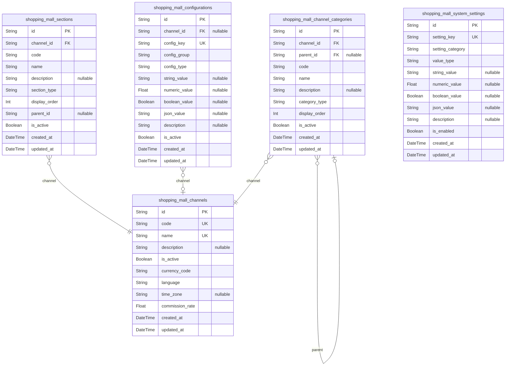

### `shopping_mall_channels`

Marketplace channel configurations defining different selling
environments or regional marketplaces within the platform.

Channels represent distinct marketplace environments that can have
different configurations, policies, and categorization systems. Examples
include country-specific marketplaces, premium seller channels, or
specialized product verticals. Each channel operates with independent
rules and can target specific customer segments.

Channels serve as the primary organizational structure for seller
onboarding, product categorization, and customer experience
customization. They enable multi-marketplace operations while maintaining
centralized platform management and unified customer accounts across all
channels.

Properties as follows:

- `id`: Primary Key.
- `code`
  > Unique channel identifier used for system references and external
  > integrations.
  >
  > Must be URL-safe and follow platform naming conventions for consistency
  > across the system.
- `name`
  > Human-readable channel name for display and user interface purposes.
  >
  > Represents the channel identity to customers, sellers, and administrators
  > with clear descriptive value.
- `description`
  > Detailed explanation of channel purpose, target audience, and specific
  > policies.
  >
  > Provides comprehensive information about channel characteristics and
  > operational requirements.
- `is_active`
  > Active status determining whether the channel is operational and
  > accepting new sellers.
  >
  > Enables channel lifecycle management and temporary suspension of
  > marketplace operations.
- `currency_code`
  > Primary currency used for all transactions within this channel.
  >
  > Standard currency code following ISO 4217 format for consistent financial
  > operations.
- `language`
  > Primary language for channel interface and communications.
  >
  > Supports localized marketplace experiences with language-specific content
  > and support capabilities.
- `time_zone`
  > Default timezone for channel scheduling and time-sensitive operations.
  >
  > Enables appropriate regional time handling for customer support and
  > seller management.
- `commission_rate`
  > Standard commission percentage charged to sellers for channel usage.
  >
  > Commission rate applied to completed transactions as platform revenue,
  > supporting business model sustainability.
- `created_at`
  > Record creation timestamp for audit tracking and system administration.
  >
  > Establishes foundation for business analytics and operational monitoring
  > across all channels.
- `updated_at`
  > Record modification timestamp for change tracking and data integrity.
  >
  > Enables monitoring of channel configuration changes and administrative
  > activities.

### `shopping_mall_sections`

Platform section definitions organizing content hierarchy and navigation
structure within channels.

Sections provide logical content organization across the marketplace,
enabling structured browsing and content management. They represent major
content areas such as product categories, seller verticals, promotional
zones, or functional pages that guide user navigation and content
discovery.

Sections serve as the primary organizational framework for frontend
navigation, content management workflows, and administrative oversight.
They enable consistent user experience design while providing flexibility
for channel-specific customization and targeted content delivery.

Properties as follows:

- `id`: Primary Key.
- `channel_id`
  > Reference to the channel containing this section. {@link
  > shopping_mall_channels.id}
- `code`
  > Unique section identifier used for system references and navigation URLs.
  >
  > Must follow consistent naming patterns for predictable routing and
  > administrative identification.
- `name`
  > Human-readable section name for navigation menus and administrative
  > interfaces.
  >
  > Provides clear identification and intuitive content organization for
  > platform users.
- `description`
  > Comprehensive explanation of section purpose and intended content
  > organization.
  >
  > Details section scope and functional boundaries to guide content
  > management decisions.
- `section_type`
  > Section category indicating functional purpose and content management
  > requirements.
  >
  > Distinguishes between different section types such as product categories,
  > promotional areas, or informational pages.
- `display_order`
  > Numeric sequence determining section order in navigation and listing
  > interfaces.
  >
  > Enables prioritized organization of content sections based on business
  > importance and user frequency.
- `parent_id`
  > Self-referencing field enabling hierarchical section organization with
  > nested content structures.
  >
  > Supports multi-level navigation trees and sub-category organization for
  > complex content hierarchies.
- `is_active`
  > Active status determining section visibility in navigation and content
  > management systems.
  >
  > Controls whether section appears in user interfaces while preserving
  > content organization for administrative purposes.
- `created_at`
  > Record creation timestamp for change tracking and system administration
  > purposes.
  >
  > Establishes baseline for organizational structure development and content
  > timeline management.
- `updated_at`
  > Record modification timestamp documenting section configuration changes
  > and updates.
  >
  > Supports administrative transparency and content management history
  > tracking across platform sections.

### `shopping_mall_channel_categories`

Product category organization within marketplace channels providing
hierarchical classification systems.

Channel categories represent standardized product taxonomies that enable
systematic product organization and customer discovery across different
marketplace environments. They provide the fundamental structure for
product browsing, search refinement, and recommendation generation within
specific channels.

Categories serve as the primary navigation framework for customers while
providing sellers with structured product placement options. The
hierarchical organization enables both broad category browsing and
specific product location while supporting channel-specific
categorization needs and marketplace scalability requirements.

Properties as follows:

- `id`: Primary Key.
- `channel_id`
  > Reference to the channel containing this category. {@link
  > shopping_mall_channels.id}
- `parent_id`
  > Self-referencing field enabling hierarchical category organization with
  > nested product classifications.
  >
  > Supports multi-level category trees and specialized sub-category
  > organization for detailed product classification.
- `code`
  > Unique category identifier used for system references and categorization
  > logic.
  >
  > Must follow channel-specific naming conventions for consistent product
  > organization across marketplace operations.
- `name`
  > Human-readable category name for navigation menus and product discovery
  > interfaces.
  >
  > Provides intuitive product classification enabling efficient customer
  > browsing and seller product organization.
- `description`
  > Comprehensive explanation of category scope and intended product
  > classification boundaries.
  >
  > Guides product placement decisions and helps customers understand
  > category-specific offerings and limitations.
- `category_type`
  > Category classification indicating functional purpose and product
  > organization requirements.
  >
  > Distinguishes between different category types such as primary
  > classifications, seasonal categories, or specialized product segments.
- `display_order`
  > Numeric sequence determining category order in navigation and product
  > browsing interfaces.
  >
  > Enables prioritized organization of categories based on business
  > importance and customer browsing patterns within channels.
- `is_active`
  > Active status controlling category visibility in product browsing and
  > assignment interfaces.
  >
  > Manages category availability for product classification while preserving
  > organizational structure for administrative purposes.
- `created_at`
  > Record creation timestamp for audit tracking and category organization
  > maintenance.
  >
  > Supports marketplace categorization timeline analysis and content
  > development tracking across channel environments.
- `updated_at`
  > Record modification timestamp documenting category hierarchy changes and
  > organizational updates.
  >
  > Enables monitoring of category structure evolution and marketplace
  > organization improvement initiatives.

### `shopping_mall_configurations`

Platform configuration management system defining operational parameters
and feature settings across marketplace environments.

Configuration represents centralized control over platform behavior,
business rules, and operational settings that can be modified without
system downtime or code changes. They provide flexible platform
customization capabilities enabling differentiated marketplace
experiences across different channels and operational contexts.

Configurations serve as the primary mechanism for feature toggles,
business rule management, and operational parameter control. They enable
platform administrators to adjust marketplace behavior dynamically while
maintaining system stability and providing consistent service delivery
standards across all operational domains.

Properties as follows:

- `id`: Primary Key.
- `channel_id`
  > Reference to the channel where this configuration applies. {@link
  > shopping_mall_channels.id}
- `config_key`
  > Unique configuration identifier used as configuration key in application
  > code.
  >
  > Must follow namespace conventions for categorizing related configurations
  > and enabling programmatic access across the platform.
- `config_group`
  > Configuration category organizing related settings for management and
  > administrative purposes.
  >
  > Groups configurations into logical categories such as payment settings,
  > shipping rules, or user interface preferences.
- `config_type`
  > Data type classification indicating configuration value format and
  > validation requirements.
  >
  > Defines accepted value types such as string settings, numeric parameters,
  > boolean flags, or complex JSON configurations.
- `string_value`
  > String value component for text-based configuration parameters and
  > settings.
  >
  > Provides flexible text storage for configuration values that require
  > string representation or human-readable settings.
- `numeric_value`
  > Numeric value component for quantifiable configuration parameters and
  > mathematical settings.
  >
  > Enables numeric configuration management including prices, percentages,
  > time periods, and calculation constants.
- `boolean_value`
  > Boolean value component for toggle-style configuration parameters and
  > on/off settings.
  >
  > Supports feature flags, enable/disable switches, and binary configuration
  > options across platform functionality.
- `json_value`
  > JSON value component for complex configuration parameters requiring
  > structured data representation.
  >
  > Enables advanced configuration options including object mappings, array
  > lists, and hierarchical parameter structures.
- `description`
  > Comprehensive explanation of configuration purpose and expected
  > application behavior.
  >
  > Provides detailed technical documentation helping administrators
  > understand configuration impact and appropriate usage contexts.
- `is_active`
  > Active status controlling whether configuration parameter is applied to
  > system behavior.
  >
  > Enables feature toggle functionality and progressive configuration
  > deployments without system downtime or code modifications.
- `created_at`
  > Record creation timestamp for configuration timeline tracking and system
  > administration.
  >
  > Establishes audit foundation for configuration history and platform
  > behavior modification tracking across operational environments.
- `updated_at`
  > Record modification timestamp documenting configuration changes and
  > setting updates.
  >
  > Supports configuration management processes and provides transparency for
  > system behavior modifications over time.

### `shopping_mall_system_settings`

Global system settings providing core platform parameter management and
operational configuration controls across all marketplace environments.

System settings represent fundamental platform configurations that affect
all channels and user types throughout the marketplace ecosystem. They
define essential operational parameters, feature enablement controls, and
business rule configurations that establish platform-wide behavior
standards and service delivery requirements.

System settings serve as the foundational control layer for platform
operations, encompassing security policies, performance parameters,
business rule enforcement mechanisms, and cross-channel operational
standards. They enable platform administrators to maintain consistent
marketplace behavior while supporting sophisticated configuration
management for different operational contexts and regulatory compliance
requirements across global deployments.

Properties as follows:

- `id`: Primary Key.
- `setting_key`
  > Unique setting identifier serving as configuration key for platform-wide
  > parameter access.
  >
  > Must follow hierarchical naming conventions for organizing related
  > settings and enabling efficient programmatic configuration management
  > across the entire platform ecosystem.
- `setting_category`
  > Setting category organizing related system parameters for management and
  > administrative access.
  >
  > Groups settings into logical categories such as system performance,
  > security policies, user management, or operational parameters for
  > efficient administrative oversight.
- `value_type`
  > Data type specification indicating expected setting value format and
  > validation requirements.
  >
  > Defines acceptable value formats including string parameters, numeric
  > settings, boolean flags, JSON objects, or specialized data structures for
  > platform operations.
- `string_value`
  > String value component for text-based system parameters and configuration
  > strings.
  >
  > Provides comprehensive text storage for platform-wide settings including
  > service URLs, contact information, or human-readable policy definitions.
- `numeric_value`
  > Numeric value component for quantitative system parameters and
  > mathematical configuration options.
  >
  > Enables numeric setting management including timeout periods, cache
  > sizes, processing limits, and performance-related configuration values.
- `boolean_value`
  > Boolean value component for system-wide toggle controls and feature
  > enablement switches.
  >
  > Supports global feature management including security settings,
  > operational modes, and platform-wide enable/disable controls for service
  > functionality.
- `json_value`
  > JSON value component for complex system configurations requiring
  > structured data organization.
  >
  > Enables sophisticated parameter management including configuration
  > objects, permission matrices, and hierarchical setting structures for
  > advanced platform control.
- `description`
  > Detailed explanation of system setting purpose and impact on platform
  > operations.
  >
  > Provides comprehensive technical documentation helping administrators
  > understand setting functionality and appropriate configuration values for
  > platform optimization.
- `is_enabled`
  > Enabled status controlling whether system setting is active and applied
  > to platform operations.
  >
  > Manages platform-wide feature availability and operational parameter
  > enforcement with immediate effect across all marketplace environments.
- `created_at`
  > Record creation timestamp for system setting timeline tracking and
  > administrative auditing.
  >
  > Establishes foundation for system configuration history and platform
  > evolution tracking across all operational environments and deployment
  > contexts.
- `updated_at`
  > Record modification timestamp documenting system setting changes and
  > platform parameter updates.
  >
  > Supports system administration transparency and provides change history
  > for critical platform-wide configuration modifications over time.

## Actors

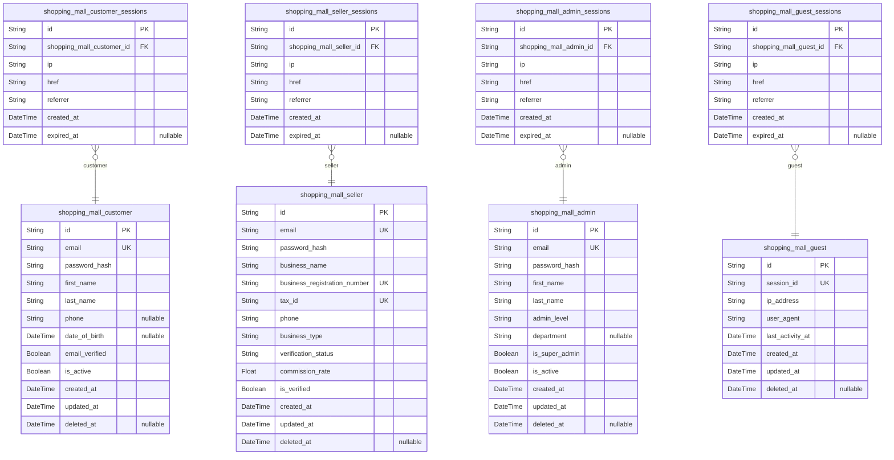

### `shopping_mall_customer`

Customer information and account management for marketplace buyers.
Customers create accounts to shop across multiple sellers, track orders,
write reviews, and manage personal preferences. Each customer maintains
their own profile with shipping addresses, payment methods, and
communication preferences that span the entire marketplace platform.

Properties as follows:

- `id`: Primary Key.
- `email`
  > Customer email address used for authentication and communication. Must be
  > unique across all customers and verified before account activation.
- `password_hash`
  > Encrypted password hash for secure authentication using bcrypt or similar
  > hashing algorithm.
- `first_name`: Customer first name for personalization and shipping address integration.
- `last_name`: Customer last name for account identification and shipping integration.
- `phone`
  > Contact phone number for order notifications and customer service
  > communication.
- `date_of_birth`: Customer birth date for age verification and personalized recommendations.
- `email_verified`
  > Email verification status indicating whether customer has confirmed their
  > email address.
- `is_active`
  > Account active status determining whether customer can access marketplace
  > features.
- `created_at`
  > Account creation timestamp for audit trails and customer lifecycle
  > tracking.
- `updated_at`
  > Last account update timestamp for tracking profile changes and
  > modifications.
- `deleted_at`
  > Account deactivation timestamp for soft delete functionality and recovery
  > options.

### `shopping_mall_customer_sessions`

Session management for customer authentication and audit tracking.
Sessions enable secure access to customer accounts across different
devices while providing comprehensive logging for security monitoring and
activity analysis across shopping activities, order management, and
account preferences.

Properties as follows:

- `id`: Primary Key.
- `shopping_mall_customer_id`
  > Associated customer's [shopping_mall_customer.id](#shopping_mall_customer) for session
  > ownership and authentication tracking.
- `ip`: IP address of the originating device for session origin identification.
- `href`: Connection URL for session tracking and HTTP origin verification.
- `referrer`: Referrer URL for traffic source analysis.
- `created_at`: Session creation timestamp for activity tracking.
- `expired_at`: Session expiration timestamp for automatic logouts.

### `shopping_mall_seller`

Seller information and business account management for marketplace
vendors. Sellers maintain comprehensive business profiles including
company details, tax information, verification status, and performance
metrics. Each seller manages their own storefront, product catalog,
inventory, orders, and customer relationships while operating within
marketplace guidelines and commission structures.

Properties as follows:

- `id`: Primary Key.
- `email`
  > Business email address used for seller authentication and marketplace
  > communications.
- `password_hash`
  > Encrypted password hash for secure seller authentication using
  > industry-standard hashing algorithms.
- `business_name`
  > Official business name for marketplace storefront branding and legal
  > identification.
- `business_registration_number`
  > Official business registration or tax identification number for
  > verification purposes.
- `tax_id`
  > Tax identification number for fiscal reporting and compliance
  > requirements.
- `phone`
  > Primary business contact phone number for customer service and
  > marketplace communications.
- `business_type`
  > Business classification such as sole proprietorship, corporation, or
  > partnership for legal categorization.
- `verification_status`
  > Current verification status including pending, verified, suspended, or
  > rejected for seller authenticity.
- `commission_rate`
  > Commission percentage rate applied to seller sales for marketplace fee
  > calculation.
- `is_verified`
  > Payment verification status indicating whether seller has completed
  > business credential verification.
- `created_at`
  > Account creation timestamp for seller onboarding tracking and business
  > relationship establishment.
- `updated_at`
  > Last account update timestamp for business profile changes and
  > modification tracking.
- `deleted_at`
  > Account deactivation timestamp for seller suspension or removal from
  > marketplace operations.

### `shopping_mall_seller_sessions`

Session management for seller authentication and business activity
tracking. Sessions provide secure access to seller dashboards while
maintaining comprehensive audit trails for product management, order
processing, inventory updates, and financial operations across the
marketplace platform.

Properties as follows:

- `id`: Primary Key.
- `shopping_mall_seller_id`
  > Associated seller's [shopping_mall_seller.id](#shopping_mall_seller) for session ownership
  > and business authentication tracking.
- `ip`: IP address of the originating device for session security monitoring.
- `href`
  > Connection URL for session tracking and HTTP request origin
  > identification.
- `referrer`: Referrer URL for traffic source analysis and business intelligence.
- `created_at`
  > Session creation timestamp for business activity tracking and audit
  > purposes.
- `expired_at`: Session expiration timestamp for automatic logout and security management.

### `shopping_mall_admin`

Administrator account management for platform operations and oversight.
Administrators handle seller verification, user management, content
moderation, dispute resolution, system configuration, and comprehensive
platform monitoring while maintaining appropriate access controls and
audit trails for administrative actions across the entire marketplace
ecosystem.

Properties as follows:

- `id`: Primary Key.
- `email`
  > Administrative email address for secure authentication and platform
  > management access.
- `password_hash`
  > Encrypted password hash for secure administrative authentication with
  > enhanced security requirements.
- `first_name`
  > Administrator first name for identification and professional
  > communication.
- `last_name`
  > Administrator last name for complete identification and authorization
  > records.
- `admin_level`
  > Administrative privilege level including super admin, department admin,
  > or support admin for access control.
- `department`
  > Administrative department assignment for organizational structure and
  > role-based permissions.
- `is_super_admin`
  > Super administrator status indicating highest platform privileges and
  > unrestricted access.
- `is_active`
  > Account active status determining administrative access and system
  > management capabilities.
- `created_at`
  > Account creation timestamp for administrative role assignment and audit
  > trail establishment.
- `updated_at`
  > Last account update timestamp for administrative changes and permission
  > modifications.
- `deleted_at`
  > Account deactivation timestamp for administrative access revocation and
  > security management.

### `shopping_mall_admin_sessions`

Session management for administrative authentication and platform
oversight tracking. Sessions provide secure access to administrative
interfaces while maintaining comprehensive audit logs for seller
management, content moderation, dispute resolution, system configuration,
and platform governance across the marketplace ecosystem.

Properties as follows:

- `id`: Primary Key.
- `shopping_mall_admin_id`
  > Associated administrator's [shopping_mall_admin.id](#shopping_mall_admin) for session
  > ownership and administrative access tracking.
- `ip`
  > IP address of administrative access device for security monitoring and
  > audit tracking.
- `href`
  > Connection URL for administrative session tracking and access origin
  > identification.
- `referrer`: Referrer URL for administrative traffic analysis and platform governance.
- `created_at`
  > Session creation timestamp for administrative activity tracking and audit
  > purposes.
- `expired_at`
  > Session expiration timestamp for automatic logout and administrative
  > security management.

### `shopping_mall_guest`

Guest visitor tracking for analytics and browsing session management.
Guest accounts provide limited marketplace access for product browsing
without registration while enabling personalized experiences, shopping
cart management, and activity tracking across browser sessions without
requiring personal information submission or account creation.

Properties as follows:

- `id`: Primary Key.
- `session_id`
  > Anonymous session identifier for guest tracking and browsing activity
  > correlation.
- `ip_address`: IP address for guest location analysis and traffic source identification.
- `user_agent`: Browser user agent string for device and browser tracking across sessions.
- `last_activity_at`
  > Timestamp of last recorded activity for session expiration and cleanup
  > management.
- `created_at`
  > Guest session creation timestamp for analytics tracking and visitor
  > periodization.
- `updated_at`
  > Last guest session update timestamp for activity tracking and session
  > continuity.
- `deleted_at`
  > Guest session termination timestamp for privacy compliance and data
  > cleanup operations.

### `shopping_mall_guest_sessions`

Session management for guest browsing activities and anonymous user
tracking. Sessions provide continuity for shopping cart management and
browsing behavior analysis while maintaining anonymity and supporting
analytics tracking for market research and user experience optimization
across the platform without requiring registration or personal
information collection.

Properties as follows:

- `id`: Primary Key.
- `shopping_mall_guest_id`
  > Associated guest's [shopping_mall_guest.id](#shopping_mall_guest) for session ownership
  > and anonymous activity tracking.
- `ip`
  > IP address of guest browsing device for session identification and
  > traffic analysis.
- `href`
  > Connection URL for guest session tracking and website interaction
  > monitoring.
- `referrer`: Referrer URL for guest traffic source analysis and marketing attribution.
- `created_at`
  > Session creation timestamp for guest activity tracking and analytics
  > purposes.
- `expired_at`
  > Session expiration timestamp for anonymous session cleanup and privacy
  > management.

## Sales

```mermaid
erDiagram
"shopping_mall_products" {
  String id PK
  String shopping_mall_seller_id FK
  String shopping_mall_product_category_id FK
  String sku UK
  String name
  String description
  Float price
  Float compare_at_price "nullable"
  Float cost "nullable"
  String status
  String condition
  Float weight "nullable"
  String weight_unit "nullable"
  String barcode "nullable"
  Boolean track_quantity
  Boolean allow_backorder
  Boolean is_shipping_required
  Boolean is_taxable
  String seo_title "nullable"
  String seo_description "nullable"
  String tags "nullable"
  String featured_image "nullable"
  String password_hash
  DateTime created_at
  DateTime updated_at
  DateTime published_at "nullable"
  DateTime deleted_at "nullable"
}
"shopping_mall_product_variants" {
  String id PK
  String shopping_mall_product_id FK
  String shopping_mall_product_unit_id FK
  String sku UK
  String title
  Float price_adjustment
  Float cost_adjustment "nullable"
  Float weight_adjustment "nullable"
  String barcode "nullable"
  String image "nullable"
  Int inventory_quantity
  String inventory_policy
  Int position
  Boolean is_active
  DateTime created_at
  DateTime updated_at
  DateTime deleted_at "nullable"
}
"shopping_mall_product_snapshots" {
  String id PK
  String shopping_mall_product_id FK
  String shopping_mall_seller_id FK
  String shopping_mall_product_category_id FK
  String sku
  String name
  String description
  Float price
  Float compare_at_price "nullable"
  Float cost "nullable"
  String status
  String condition
  Float weight "nullable"
  String weight_unit "nullable"
  String barcode "nullable"
  Boolean track_quantity
  Boolean allow_backorder
  Boolean is_shipping_required
  Boolean is_taxable
  String seo_title "nullable"
  String seo_description "nullable"
  String tags "nullable"
  String featured_image "nullable"
  DateTime created_at
}
"shopping_mall_product_categories" {
  String id PK
  String parent_id FK "nullable"
  String code UK
  String name
  String description "nullable"
  String path
  Int level
  Int sort_order
  Boolean is_active
  Boolean is_featured
  String image "nullable"
  String meta_title "nullable"
  String meta_description "nullable"
  String meta_keywords "nullable"
  DateTime created_at
  DateTime updated_at
  DateTime deleted_at "nullable"
}
"shopping_mall_product_units" {
  String id PK
  String shopping_mall_product_id FK
  String name
  String type
  String display_style
  Boolean is_required
  Boolean is_multiple
  Int sort_order
  DateTime created_at
  DateTime updated_at
  DateTime deleted_at "nullable"
}
"shopping_mall_product_unit_options" {
  String id PK
  String shopping_mall_product_unit_id FK
  String name
  String value
  Float price_adjustment
  Float weight_adjustment "nullable"
  String image "nullable"
  String color_hex "nullable"
  Int position
  Boolean is_available
  Boolean is_default
  DateTime created_at
  DateTime updated_at
  DateTime deleted_at "nullable"
}
"shopping_mall_products" }o--|| "shopping_mall_product_categories" : category
"shopping_mall_product_variants" }o--|| "shopping_mall_products" : product
"shopping_mall_product_variants" }o--|| "shopping_mall_product_units" : productUnit
"shopping_mall_product_snapshots" }o--|| "shopping_mall_products" : product
"shopping_mall_product_snapshots" }o--|| "shopping_mall_product_categories" : category
"shopping_mall_product_categories" }o--o| "shopping_mall_product_categories" : parent
"shopping_mall_product_units" }o--|| "shopping_mall_products" : product
"shopping_mall_product_unit_options" }o--|| "shopping_mall_product_units" : productUnit
```

### `shopping_mall_products`

Core product catalog representing items available for sale in the
marketplace.

Products form the foundation of the e-commerce catalog, representing
individual items that sellers can list for sale. Each product belongs to
a specific seller and category, with comprehensive metadata including
pricing, descriptions, and inventory tracking. Products support multiple
variants (different sizes, colors, configurations) and maintain complete
historical records through snapshots for audit trails and change
tracking.

Products serve as the central reference point for all marketplace
activities including search, discovery, recommendations, and order
fulfillment. The product catalog supports advanced features like SEO
optimization, promotional pricing, and multi-media content while
maintaining strict quality standards through approval workflows and
policy compliance checking.

Properties as follows:

- `id`: Primary Key.
- `shopping_mall_seller_id`: The seller who owns this product. [shopping_mall_seller.id](#shopping_mall_seller)
- `shopping_mall_product_category_id`
  > Primary category for this product. {@link
  > shopping_mall_product_categories.id}
- `sku`: Unique stock keeping unit identifier for this product.
- `name`: Product name with clear, descriptive title for customer understanding.
- `description`
  > Comprehensive product description with features, benefits, and
  > specifications.
- `price`: Current selling price of the product in the marketplace currency.
- `compare_at_price`: Original price for discount comparison and promotional display purposes.
- `cost`: Product cost for profit margin calculations and seller analytics.
- `status`
  > Product status (active, draft, archived) controlling visibility in
  > marketplace.
- `condition`: Product condition (new, used, refurbished) for quality transparency.
- `weight`: Product weight in kilograms for shipping calculations and logistics.
- `weight_unit`: Unit of measurement for product weight (kg, g, lb, oz).
- `barcode`: Universal product code or barcode for inventory scanning.
- `track_quantity`: Whether to track inventory levels for this product across all variants.
- `allow_backorder`: Whether to allow orders when inventory reaches zero.
- `is_shipping_required`
  > Whether this product requires physical shipping or is
  > digital/downloadable.
- `is_taxable`: Whether sales tax should be applied to this product.
- `seo_title`: SEO-optimized title for search engine visibility and ranking.
- `seo_description`: SEO meta description for search engine results pages.
- `tags`: Comma-separated tags for product discovery and categorization.
- `featured_image`: URL of the primary product image for catalog display.
- `password_hash`: Hashed password for seller product management access and security.
- `created_at`: Timestamp when the product was first created in the catalog.
- `updated_at`: Timestamp of the most recent modification to product information.
- `published_at`: When the product became visible to customers in the marketplace.
- `deleted_at`: Soft deletion timestamp for catalog cleanup and audit purposes.

### `shopping_mall_product_variants`

Product variants representing different configurations of parent products.

Variants enable sellers to offer products with multiple options such as
different sizes, colors, materials, or configurations while maintaining a
single product listing for discoverability. Each variant has its own SKU,
inventory tracking, pricing adjustments, and unique attributes but
inherits core product information from the parent product.

Variant management is essential for supporting diverse product catalogs
including apparel with size/color combinations, electronics with
different specifications, and configurable products with selectable
features. The variant system maintains inventory accuracy, pricing
flexibility, and ordering convenience while preserving the unified
product identity.

Properties as follows:

- `id`: Primary Key.
- `shopping_mall_product_id`
  > The parent product this variant belongs to. {@link
  > shopping_mall_products.id}
- `shopping_mall_product_unit_id`
  > Primary product unit defining the variant configuration. {@link
  > shopping_mall_product_units.id}
- `sku`: Unique SKU for this specific variant configuration.
- `title`: Variant title showing selected options (e.g., 'Large, Blue').
- `price_adjustment`: Price difference from base product price for this variant.
- `cost_adjustment`: Cost difference from base product cost for this variant.
- `weight_adjustment`: Weight difference from base product weight for shipping.
- `barcode`: Variant-specific barcode for inventory scanning.
- `image`: URL of variant-specific product image showing configuration.
- `inventory_quantity`: Current inventory level for this specific variant.
- `inventory_policy`: How to handle inventory when depleted (deny, continue).
- `position`: Display order position within the product's variant list.
- `is_active`: Whether this variant is available for sale.
- `created_at`: When this variant was first created.
- `updated_at`: When this variant was last modified.
- `deleted_at`: Soft deletion timestamp for variant management.

### `shopping_mall_product_snapshots`

Historical snapshots of product information for audit trails and version
control.

Product snapshots enable transparent tracking of catalog changes
including pricing modifications, description updates, image replacements,
and attribute adjustments over time. This comprehensive audit system
maintains complete historical records of product evolution while
supporting business intelligence, analytics, and regulatory compliance
requirements.

The snapshot system provides sellers with ability to track product
performance across different versions, analyze the impact of catalog
changes, and maintain accountability for pricing and content
modifications. Snapshots also enable customers to understand product
evolution and sellers to demonstrate transparency in their business
practices while supporting platform-level analytics and trend analysis.

Properties as follows:

- `id`: Primary Key.
- `shopping_mall_product_id`: The product this snapshot represents. [shopping_mall_products.id](#shopping_mall_products)
- `shopping_mall_seller_id`
  > The seller who owned this product during this snapshot. {@link
  > shopping_mall_seller.id}
- `shopping_mall_product_category_id`
  > The category assigned to product during this snapshot. {@link
  > shopping_mall_product_categories.id}
- `sku`: SKU of the product at the time this snapshot was created.
- `name`: Product name during this snapshot period.
- `description`: Product description as it existed in this snapshot.
- `price`: Product price recorded in this historical snapshot.
- `compare_at_price`: Original price during this snapshot period.
- `cost`: Product cost at the time of snapshot.
- `status`: Product status during the snapshot period.
- `condition`: Product condition at the time of snapshot.
- `weight`: Product weight as recorded in this snapshot.
- `weight_unit`: Weight unit used during this snapshot period.
- `barcode`: Barcode recorded in this historical snapshot.
- `track_quantity`: Whether inventory tracking was enabled during this period.
- `allow_backorder`: Whether backorders were allowed during this snapshot.
- `is_shipping_required`: Whether shipping requirement was set during this period.
- `is_taxable`: Whether tax was applicable during this snapshot period.
- `seo_title`: SEO title that was active during this snapshot.
- `seo_description`: SEO description recorded in this historical snapshot.
- `tags`: Tags that were associated with product during this period.
- `featured_image`: Featured image URL that was active during this snapshot.
- `created_at`: When this snapshot was created to record the product state.

### `shopping_mall_product_categories`

Hierarchical product categorization system for marketplace organization
and discovery.

Product categories provide the primary organizational structure for the
marketplace catalog, enabling customers to browse and discover products
efficiently while supporting sellers in proper product placement. The
hierarchical system allows for detailed categorization from broad
top-level categories to specific subcategories and specialized product
groups.

Categories serve as the foundation for search functionality, filtering
systems, recommendation algorithms, and merchandising strategies. They
enable drill-down navigation, cross-category browsing, and sophisticated
product discovery while maintaining catalog organization and supporting
catalog management operations across diverse product types and seller
inventories.

Properties as follows:

- `id`: Primary Key.
- `parent_id`
  > Parent category reference for hierarchical structure (null for root
  > categories). [shopping_mall_product_categories.id](#shopping_mall_product_categories)
- `code`: Unique category code for API and system reference.
- `name`: Category name displayed in navigation and search results.
- `description`: Detailed category description for customer information and SEO.
- `path`: Category path showing hierarchy (e.g., 'Electronics/Computers/Laptops').
- `level`: Hierarchy level indicating depth in category tree (0 for root categories).
- `sort_order`: Display order within parent category or top-level category list.
- `is_active`: Whether this category is visible to customers in navigation.
- `is_featured`: Whether this category is featured prominently on the homepage.
- `image`: URL of category image for visual navigation and merchandising.
- `meta_title`: SEO-optimized title for search engine ranking and visibility.
- `meta_description`: SEO meta description for search engine results pages.
- `meta_keywords`: Comma-separated keywords for SEO optimization and search.
- `created_at`: When this category was created in the system.
- `updated_at`: When this category was last modified.
- `deleted_at`: Soft deletion timestamp for category cleanup and audit.

### `shopping_mall_product_units`

Product unit definitions enabling flexible product configuration and
variant creation.

Product units represent different aspects of product variation including
size, color, material, style, or any definable characteristic that
creates distinct product options. The unit system enables sellers to
create comprehensive product configurations while maintaining inventory
control and pricing flexibility for each variation type.

Units serve as the building blocks for product variants, allowing
customers to select specific product configurations that meet their
preferences while enabling sellers to manage different inventory levels,
pricing, and availability for each variation. The system supports
unlimited unit types and combinations to accommodate diverse product
catalogs and complex configuration requirements.

Properties as follows:

- `id`: Primary Key.
- `shopping_mall_product_id`
  > The product this unit configuration applies to. {@link
  > shopping_mall_products.id}
- `name`: Unit type name such as 'Size', 'Color', 'Material', or 'Style'.
- `type`
  > Unit category (size, color, material, style, custom) defining variation
  > type.
- `display_style`: How to display unit options (dropdown, buttons, swatches, text input).
- `is_required`: Whether customers must select an option for this unit before purchase.
- `is_multiple`: Whether customers can select multiple options for this unit.
- `sort_order`: Display order of this unit within product configuration interface.
- `created_at`: When this product unit was configured.
- `updated_at`: When this product unit configuration was last modified.
- `deleted_at`: Soft deletion timestamp for unit management and cleanup.

### `shopping_mall_product_unit_options`

Individual options within product units allowing customers to select
specific variations.

Unit options represent the selectable values within each product unit,
enabling customers to choose specific variations such as 'Large' within a
Size unit, 'Blue' within a Color unit, or specific patterns within a
Style unit. Options provide the granular choices that define product
variants while supporting rich media content, inventory tracking, and
pricing flexibility.

The option system enables unlimited customization possibilities while
maintaining consistent user interfaces and inventory management
capabilities. Sellers can create comprehensive option sets that support
complex product configurations while providing customers with intuitive
selection experiences and clear visibility into available variations,
pricing differences, and availability status for each product
configuration.

Properties as follows:

- `id`: Primary Key.
- `shopping_mall_product_unit_id`
  > The product unit that contains this option. {@link
  > shopping_mall_product_units.id}
- `name`: Option name displayed to customers (e.g., 'Large', 'Blue', 'Silk').
- `value`: Internal value used for variant matching and inventory tracking.
- `price_adjustment`: Price adjustment when this option is selected for a variant.
- `weight_adjustment`: Weight adjustment when this option is selected for shipping calculations.
- `image`: Visual representation of this option (color swatch, size chart, etc.).
- `color_hex`: Hex color code for color options enabling swatch display.
- `position`: Display order within the unit option selection interface.
- `is_available`: Whether this option is currently available for customer selection.
- `is_default`
  > Whether this option should be pre-selected when customers first view the
  > product.
- `created_at`: When this unit option was created.
- `updated_at`: When this unit option was last modified.
- `deleted_at`: Soft deletion timestamp for option management and cleanup.

## Carts

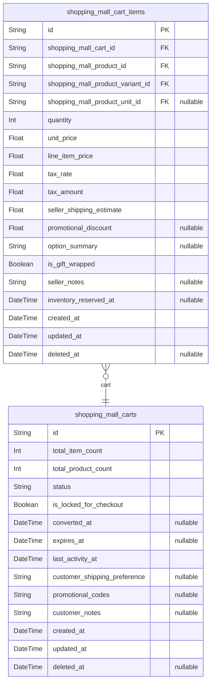

### `shopping_mall_carts`

Shopping cart management for temporary item storage during browsing and
pre-purchase phases.

Tracks customer shopping sessions with comprehensive state management for
conversion tracking and Analytics. Manages cart lifecycle through status
tracking and expiration handling. Supports polymorphic ownership for
guests, authenticated customers, and system scenarios.

The cart system enables seamless multi-seller shopping experiences by
coordinating product selections from different vendors while preserving
cart integrity across sessions. Maintains cart-level configuration
preferences and supports seamless transition to order processing systems.

Carts serve as temporary aggregation points for customer intent,
supporting wishlist conversion, promotional application, and shipping
coordination across multiple marketplace sellers.

Properties as follows:

- `id`: Primary Key.
- `total_item_count`: Total number of individual items across all cart lines.
- `total_product_count`: Total number of distinct products in cart.
- `status`: Cart lifecycle status: active, abandoned, converted.
- `is_locked_for_checkout`: Whether cart is being processed for checkout.
- `converted_at`: When cart converted to order.
- `expires_at`
  > When cart will expire if not converted. Usually 30 days from creation.
  > Used for cleanup processes and abandoned cart analytics. This field
  > enables automated cart lifecycle management while preserving data
  > integrity during status transitions. Timestamp serves as reference for
  > automated cleanup jobs and conversion analysis reporting.
- `last_activity_at`: Last cart modification timestamp.
- `customer_shipping_preference`: Customer's preferred shipping method JSON configuration.
- `promotional_codes`: Applied promotion codes JSON array.
- `customer_notes`: Customer notes or special instructions.
- `created_at`: Cart creation timestamp.
- `updated_at`: Last cart modification timestamp.
- `deleted_at`: Soft delete timestamp for cart removal.

### `shopping_mall_cart_items`

Individual product items within shopping cart with pricing and variant
specifications.

Tracks specific product selections, quantities, variants, and pricing
breaks for each item in a shopping cart. Supports multi-seller cart
compositions with individual seller shipping and tax calculations.
Maintains correc product configuration including color, size, material
and other settings.

The cart items system enables granular shopping cart functionality by
preserving specific details necessary for accurate order conversion while
maintaining cart integrity throughout the browsing session.

Properties as follows:

- `id`: Primary Key.
- `shopping_mall_cart_id`: The shopping cart this item belongs to. [shopping_mall_carts.id](#shopping_mall_carts)
- `shopping_mall_product_id`: Product this item represents. [shopping_mall_products.id](#shopping_mall_products)
- `shopping_mall_product_variant_id`
  > Selected product variant with specific options. {@link
  > shopping_mall_product_variants.id}
- `shopping_mall_product_unit_id`
  > Product unit specification for item quantity. {@link
  > shopping_mall_product_units.id}
- `quantity`: Number of this specific product variant in the cart.
- `unit_price`: Price per individual unit before tax and shipping.
- `line_item_price`: Total price for this line item before add-ons.
- `tax_rate`: Applicable tax rate based on category and location.
- `tax_amount`: Calculated tax for this line item.
- `seller_shipping_estimate`: Seller's shipping cost estimate for this SKU.
- `promotional_discount`: Discount amount applied from promotions.
- `option_summary`: Human-readable summary of selected variant options.
- `is_gift_wrapped`: Whether the item is gift wrapped
- `seller_notes`: Vendor-specific notes or handling instructions
- `inventory_reserved_at`: When inventory was reserved for this item.
- `created_at`: When item was added to cart
- `updated_at`: Last quantity or option update
- `deleted_at`: When item was removed from cart

## Orders

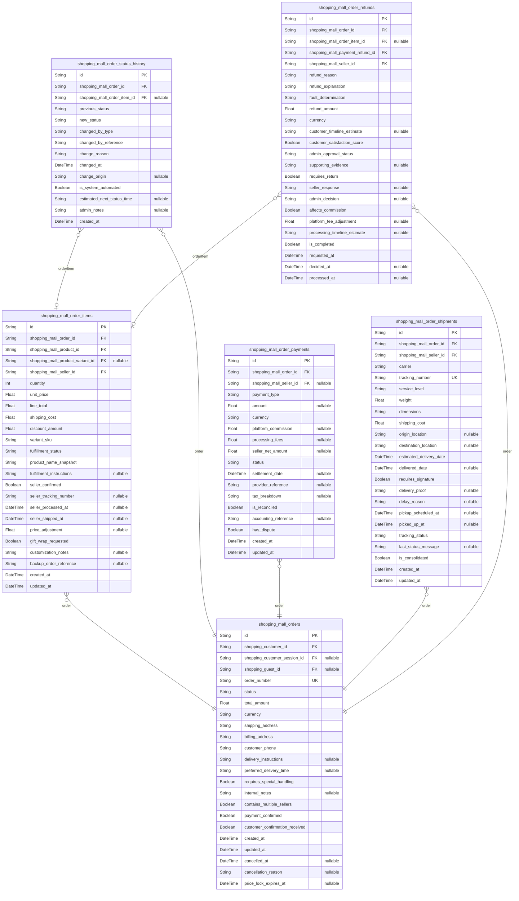

### `shopping_mall_orders`

Primary order entity managing multi-seller transactions and customer
purchases across the marketplace platform. Coordinates complex order
lifecycle from placement through fulfillment while maintaining
comprehensive tracking for all stakeholders including customers, sellers,
and platform administrators.

Properties as follows:

- `id`: Primary Key.
- `shopping_customer_id`: Customer who placed the order. [shopping_mall_customer.id](#shopping_mall_customer)
- `shopping_customer_session_id`
  > Session during which order was placed. {@link
  > shopping_mall_customer_sessions.id}
- `shopping_guest_id`: Guest user who placed the order. [shopping_mall_guest.id](#shopping_mall_guest)
- `order_number`
  > Order number for customer reference and communication. Generated
  > automatically using format ORD-YYYYMMDD-NNNNNN.
- `status`
  > Current status of the order indicating lifecycle stage. Values: pending,
  > confirmed, processing, shipped, delivered, cancelled, refunded.
- `total_amount`: Total amount of the order including all items, shipping, and fees.
- `currency`: Currency code for the transaction following ISO 4217 standards.
- `shipping_address`: Shipping address where order will be delivered to customer.
- `billing_address`: Billing address for payment and invoice purposes.
- `customer_phone`: Customer's phone number for delivery coordination.
- `delivery_instructions`: Additional delivery instructions or special requirements for courier.
- `preferred_delivery_time`: Preferred delivery time or scheduling requests from customer.
- `requires_special_handling`
  > Whether the order requires special handling or fragile item precautions
  > during shipping.
- `internal_notes`
  > Any internal notes or flags about the order for customer service or
  > fulfillment teams.
- `contains_multiple_sellers`
  > Whether the order contains items from multiple sellers requiring
  > coordinated fulfillment.
- `payment_confirmed`: Whether payment has been successfully completed and confirmed in system.
- `customer_confirmation_received`: Customer's email confirmation that they will accept delivery or terms.
- `created_at`: Timestamp when order was first placed by customer.
- `updated_at`: Timestamp when order status was last updated.
- `cancelled_at`: Timestamp when order was cancelled if applicable.
- `cancellation_reason`: Cancellation reason provided by customer or system for audit purposes.
- `price_lock_expires_at`: Price lock expiration for items in multi-step checkout process.

### `shopping_mall_order_items`

Individual items within orders linking products to specific order
transactions. Manages item-level details including quantities, pricing,
seller attribution, and fulfillment tracking while maintaining
referential integrity across multi-seller orders and enabling independent
seller management of their portions.

Properties as follows:

- `id`: Primary Key.
- `shopping_mall_order_id`: Order containing this item. [shopping_mall_orders.id](#shopping_mall_orders)
- `shopping_mall_product_id`: Product being ordered. [shopping_mall_products.id](#shopping_mall_products)
- `shopping_mall_product_variant_id`
  > Specific product variant if applicable. {@link
  > shopping_mall_product_variants.id}
- `shopping_mall_seller_id`: Seller providing the product. [shopping_mall_seller.id](#shopping_mall_seller)
- `quantity`: Quantity of the product being ordered.
- `unit_price`: Price per unit for this item.
- `line_total`: Total price for this item including quantity.
- `shipping_cost`: Shipping cost specific to this item.
- `discount_amount`: Discount amount applied to this specific line item.
- `variant_sku`: SKU (Stock Keeping Unit) code for product variant.
- `fulfillment_status`: Fulfillment status for this item regardless of overall order status.
- `product_name_snapshot`: Product name snapshot at time of order for historical accuracy.
- `fulfillment_instructions`: Special instructions for fulfillment of this specific item.
- `seller_confirmed`: Seller's confirmation that item is available and ready for processing.
- `seller_tracking_number`: Tracking number from seller after shipment departure.
- `seller_processed_at`: Date when seller completed processing for this item.
- `seller_shipped_at`: Date when seller shipped this specific item.
- `price_adjustment`: Updated pricing information if original price became invalid.
- `gift_wrap_requested`: Whether customer requested gift wrapping for this item.
- `customization_notes`: Customization requirements or personalization requests for the item.
- `backup_order_reference`: Backup order reference in case of order splitting or issues.
- `created_at`: Timestamp when line item was added to order.
- `updated_at`: Timestamp when line item details were last updated.

### `shopping_mall_order_status_history`

Comprehensive audit trail capturing all order state transitions
throughout the lifecycle. Records every status change with timestamps,
actors, and justification to provide complete accountability for order
processing while supporting dispute resolution and analytical reporting
across the marketplace.

Properties as follows:

- `id`: Primary Key.
- `shopping_mall_order_id`: Order whose status is being tracked. [shopping_mall_orders.id](#shopping_mall_orders)
- `shopping_mall_order_item_id`
  > Specific line item if status change applies to item level. {@link
  > shopping_mall_order_items.id}
- `previous_status`: Previous status before this change occurred.
- `new_status`: New status after this change was applied.
- `changed_by_type`
  > Type of entity that made the status change. Values: system, customer,
  > seller, admin.
- `changed_by_reference`
  > ID of actor or reference to entity that made the change. {@link
  > customers.id} or [sellers.id](#sellers) or [admins.id](#admins) or system
  > identifier
- `change_reason`
  > Detailed explanation for status change including context and
  > justification.
- `changed_at`: Automatic timestamp capture of status change for audit trail.
- `change_origin`
  > IP address or system identifier where change originated for security
  > tracking.
- `is_system_automated`
  > Whether this change was initiated automatically by system rules or
  > manually by user.
- `estimated_next_status_time`: Estimated duration customer should wait before next status update.
- `admin_notes`: Private administrative notes about status change circumstances.
- `created_at`: Timestamp when history record was created for audit trail.

### `shopping_mall_order_payments`

Financial transaction records coordinating order processing with payment
system integration. Handles payment authorization, processing fees,
seller allocation, and settlement tracking while maintaining
comprehensive audit trail for financial reconciliation and dispute
resolution across marketplace transactions.

Properties as follows:

- `id`: Primary Key.
- `shopping_mall_order_id`
  > Order being paid for through this payment record. {@link
  > shopping_mall_orders.id}
- `shopping_mall_seller_id`
  > Seller receiving this payment portion if multi-seller split. {@link
  > shopping_mall_seller.id}
- `payment_type`
  > Type of payment record. Values: customer_payment, platform_commission,
  > seller_payout, refund.
- `amount`: Amount associated with this payment record component.
- `currency`: Currency code for the payment amounts following ISO 4217 standards.
- `platform_commission`: Platform commission amount deducted from seller portion.
- `processing_fees`: Payment processing fees charged by external providers.
- `seller_net_amount`: Net amount available for payout to seller after all deductions.
- `status`: Status of this payment record within order processing workflow.
- `settlement_date`: Settlement date when funds will be available for payout or processing.
- `provider_reference`: Reference number for payment service provider tracking and reconciliation.
- `tax_breakdown`: Tax calculation details and breakdown information for financial reporting.
- `is_reconciled`
  > Whether this payment component has been reconciled with accounting
  > records.
- `accounting_reference`: Accounting ledger entries or journal references for bookkeeping.
- `has_dispute`: Whether customer disputes or chargebacks affect this payment record.
- `created_at`: Timestamp when payment record was created for audit trail.
- `updated_at`: Timestamp when payment details were last modified.

### `shopping_mall_order_shipments`

Fulfillment tracking records managing the physical delivery process from
sellers to customers. Coordinates multi-seller shipping scenarios,
carrier integrations, tracking information, and delivery confirmation
while maintaining comprehensive logistics documentation for customer
communication and business analytics.

Properties as follows:

- `id`: Primary Key.
- `shopping_mall_order_id`: Order containing items being shipped. [shopping_mall_orders.id](#shopping_mall_orders)
- `shopping_mall_seller_id`: Seller responsible for this shipment. [shopping_mall_seller.id](#shopping_mall_seller)
- `carrier`: Carrier providing shipping service.
- `tracking_number`: Tracking number provided by carrier for customer tracking.
- `service_level`
  > Shipping service level selected by customer. Values: standard, expedited,
  > overnight.
- `weight`: Weight of shipment for shipping cost calculation.
- `dimensions`: Dimensions (LxWxH) of package for shipping calculations.
- `shipping_cost`: Shipping cost charged to customer for this shipment.
- `origin_location`: Origin warehouse or pickup location coordinates.
- `destination_location`: Destination delivery address coordinates for logistics optimization.
- `estimated_delivery_date`: Estimated delivery date provided by carrier or calculated by system.
- `delivered_date`: Actual delivery date when package was delivered to customer.
- `requires_signature`: Whether delivery requires customer signature confirmation.
- `delivery_proof`: Proof of delivery information including signature or photo confirmation.
- `delay_reason`: Shipping delay reasons or explanations if estimated date is extended.
- `pickup_scheduled_at`: When shipment is expected to be picked up from seller's location.
- `picked_up_at`: When package was actually scanned into carrier system.
- `tracking_status`: Current shipment status in carrier's tracking system.
- `last_status_message`: Last activity message from carrier tracking updates.
- `is_consolidated`: Whether shipment contains items from multiple order items consolidated.
- `created_at`: Timestamp when shipment record was created for logistics tracking.
- `updated_at`: Timestamp when shipment details were last updated.

### `shopping_mall_order_refunds`

Financial compensation records managing customer returns, seller credits,
and dispute resolution processes. Handles partial and full refunds while
maintaining transparent accounting across all marketplace participants
and supporting comprehensive financial reconciliation for platform
operations and regulatory compliance.

Properties as follows:

- `id`: Primary Key.
- `shopping_mall_order_id`
  > Original order being partially or fully refunded. {@link
  > shopping_mall_orders.id}
- `shopping_mall_order_item_id`
  > Specific item being refunded if partial refund. {@link
  > shopping_mall_order_items.id}
- `shopping_mall_payment_refund_id`
  > Associated payment refund from payment system. {@link
  > shopping_mall_payment_refunds.id}
- `shopping_mall_seller_id`: Seller responsible for this refund amount. [shopping_mall_seller.id](#shopping_mall_seller)
- `refund_reason`: Reason category for the refund request.
- `refund_explanation`: Detailed explanation of why refund was requested or approved.
- `fault_determination`
  > Whether refund was due to seller issue, customer issue, or platform
  > problem.
- `refund_amount`: Amount being refunded in original transaction currency.
- `currency`: Currency code following ISO 4217 standards for financial transactions.
- `customer_timeline_estimate`: Suggested time frames for customers to receive different refund types.
- `customer_satisfaction_score`: Whether customer is satisfied with the refund resolution.
- `admin_approval_status`: Administrative review status for refunds requiring manual approval.
- `supporting_evidence`: Evidence or documentation supporting refund decision making.
- `requires_return`: Whether original product must be returned before refund is processed.
- `seller_response`: Seller response to refund request including acceptance or dispute details.
- `admin_decision`: Administrative decision and reasoning for complex refund scenarios.
- `affects_commission`: Whether refunded amount affects seller commission calculations.
- `platform_fee_adjustment`: Platform fee refund amount if commission was adjusted.
- `processing_timeline_estimate`
  > Estimated processing time for refund based on payment method and fraud
  > checks.
- `is_completed`: Whether refund has been fully processed and completed in payment system.
- `requested_at`: Timestamp when refund request was initiated by customer or system.
- `decided_at`: Timestamp when refund was approved or rejected by appropriate authority.
- `processed_at`: Timestamp when refund was actually processed in payment system.

## Payments

```mermaid
erDiagram
"shopping_mall_payment_transactions" {
  String id PK
  String shopping_mall_order_payment_id FK
  String shopping_mall_payment_gateway_id FK
  String shopping_mall_payment_method_id FK
  String transaction_id
  Float amount
  String currency
  String transaction_type
  String status
  String gateway_response_code "nullable"
  String gateway_message "nullable"
  Boolean is_successful
  Boolean is_authorized
  Boolean is_captured
  DateTime expires_at "nullable"
  DateTime processed_at "nullable"
  String merchant_reference "nullable"
  Float risk_score "nullable"
  DateTime created_at
  DateTime updated_at
}
"shopping_mall_payment_refunds" {
  String id PK
  String shopping_mall_payment_transaction_id FK
  String reviewing_administrator_id FK "nullable"
  String refund_reference UK
  Float amount
  String currency
  String refund_type
  String reason_code
  String reason_description
  String status
  Boolean is_approved "nullable"
  Boolean is_processed
  String external_refund_id "nullable"
  Float processing_fee "nullable"
  DateTime requested_at
  DateTime processed_at "nullable"
  DateTime created_at
  DateTime updated_at
}
"shopping_mall_payment_gateways" {
  String id PK
  String gateway_code UK
  String gateway_name UK
  String gateway_type
  String supported_currencies
  Boolean is_active
  Boolean is_primary
  Boolean is_available
  String api_endpoint
  String sandbox_endpoint "nullable"
  String webhook_secret "nullable"
  String country_availability
  String processing_fees
  Float max_transaction_amount "nullable"
  String configuration_schema
  Float risk_score_threshold "nullable"
  String retry_configuration
  DateTime created_at
  DateTime updated_at
}
"shopping_mall_payment_methods" {
  String id PK
  String shopping_mall_payment_gateway_id FK
  String method_code
  String method_name
  String method_type
  String method_category
  Int display_order
  Boolean is_active
  Boolean is_visible
  Boolean requires_authorization
  String country_restrictions "nullable"
  String currency_restrictions "nullable"
  Float minimum_amount "nullable"
  Float maximum_amount "nullable"
  String icon_url "nullable"
  String description
  String configuration_options
  String verification_requirements "nullable"
  String processing_instructions "nullable"
  DateTime created_at
  DateTime updated_at
}
"shopping_mall_payment_fees" {
  String id PK
  String shopping_mall_payment_method_id FK "nullable"
  String fee_code UK
  String fee_name
  String fee_type
  String calculation_method
  Float fee_percentage "nullable"
  Float fixed_amount "nullable"
  Float minimum_fee "nullable"
  Float maximum_fee "nullable"
  String currency "nullable"
  Boolean is_active
  DateTime effective_date
  DateTime expiration_date "nullable"
  Boolean apply_to_seller
  Boolean apply_to_customer
  Boolean apply_to_platform
  String tier_configuration "nullable"
  String business_rules "nullable"
  DateTime created_at
  DateTime updated_at
}
"shopping_mall_payment_transaction_snapshots" {
  String id PK
  String shopping_mall_payment_transaction_id FK
  String shopping_mall_order_payment_id FK
  String shopping_mall_payment_gateway_id FK
  String shopping_mall_payment_method_id FK
  String transaction_id
  Float amount
  String currency
  String transaction_type
  String status
  String gateway_response_code "nullable"
  String gateway_message "nullable"
  Boolean is_successful
  Boolean is_authorized
  Boolean is_captured
  DateTime expires_at "nullable"
  DateTime processed_at "nullable"
  String merchant_reference "nullable"
  Float risk_score "nullable"
  String snapshot_reason
  DateTime created_at
}
"shopping_mall_payment_refund_snapshots" {
  String id PK
  String shopping_mall_payment_refund_id FK
  String shopping_mall_payment_transaction_id FK
  String shopping_mall_order_refund_id FK "nullable"
  String refund_reference
  Float amount
  String currency
  String refund_type
  String reason_code
  String reason_description
  String status
  Boolean is_approved "nullable"
  Boolean is_processed
  String external_refund_id "nullable"
  Float processing_fee "nullable"
  DateTime requested_at
  DateTime processed_at "nullable"
  String snapshot_reason
  DateTime created_at
}
"shopping_mall_payment_transactions" }o--|| "shopping_mall_payment_gateways" : paymentGateway
"shopping_mall_payment_transactions" }o--|| "shopping_mall_payment_methods" : paymentMethod
"shopping_mall_payment_refunds" }o--|| "shopping_mall_payment_transactions" : paymentTransaction
"shopping_mall_payment_methods" }o--|| "shopping_mall_payment_gateways" : paymentGateway
"shopping_mall_payment_fees" }o--o| "shopping_mall_payment_methods" : paymentMethod
"shopping_mall_payment_transaction_snapshots" }o--|| "shopping_mall_payment_transactions" : paymentTransaction
"shopping_mall_payment_transaction_snapshots" }o--|| "shopping_mall_payment_gateways" : paymentGateway
"shopping_mall_payment_transaction_snapshots" }o--|| "shopping_mall_payment_methods" : paymentMethod
"shopping_mall_payment_refund_snapshots" }o--|| "shopping_mall_payment_refunds" : paymentRefund
"shopping_mall_payment_refund_snapshots" }o--|| "shopping_mall_payment_transactions" : paymentTransaction
```

### `shopping_mall_payment_transactions`

Financial transaction processing records capturing complete payment
lifecycle from authorization through settlement. Manages multi-party
transactions between customers, sellers, and the platform while
maintaining transaction integrity, security standards, and audit
compliance.

Stores payment authorization requests, transaction processing status,
financial institution responses, and settlement confirmations across
multiple payment gateways. Supports complex transaction scenarios
including split payments, partial authorizations, currency conversions,
and fee calculations while maintaining strict audit trails for regulatory
compliance.

The system handles real-time payment coordination with external gateways,
automatic retry mechanisms for failed transactions, and comprehensive
transaction state management to ensure reliable payment processing for
the marketplace ecosystem.

Properties as follows:

- `id`: Primary Key.
- `shopping_mall_order_payment_id`
  > Associated order payment's [shopping_mall_order_payments.id](#shopping_mall_order_payments) for
  > transaction correlation.
- `shopping_mall_payment_gateway_id`
  > Processing gateway's [shopping_mall_payment_gateways.id](#shopping_mall_payment_gateways) for
  > routing identification.
- `shopping_mall_payment_method_id`
  > Payment method's [shopping_mall_payment_methods.id](#shopping_mall_payment_methods) used for this
  > transaction.
- `transaction_id`
  > External transaction identifier from payment gateway system for reference
  > and reconciliation.
- `amount`
  > Transaction amount in the original currency with precision support for
  > fractional amounts.
- `currency`
  > ISO 4217 currency code for the transaction amount ensuring proper
  > financial tracking.
- `transaction_type`
  > Transaction type distinguishing authorizations, captures, refunds, and
  > voids for proper accounting.
- `status`
  > Current transaction status reflecting processing state from initiation
  > through completion for tracking.
- `gateway_response_code`
  > Raw gateway response code for technical troubleshooting and detailed
  > transaction analysis.
- `gateway_message`
  > Human-readable gateway response message for customer service and user
  > communication purposes.
- `is_successful`
  > Transaction success indicator for quick status assessments and reporting
  > aggregation efficiency.
- `is_authorized`
  > Authorization status flag distinguishing between authorized and completed
  > transaction states.
- `is_captured`
  > Capture completion status indicating whether funds have been transferred
  > for settlement processing.
- `expires_at`
  > Authorization expiration timestamp for pre-authorized transactions
  > requiring completion within time limits.
- `processed_at`
  > Transaction processing timestamp for audit trail and financial reporting
  > compliance requirements.
- `merchant_reference`
  > Internal reference identifier for merchant reconciliation and accounting
  > system integration.
- `risk_score`
  > Fraud detection risk score calculated during transaction processing for
  > security monitoring.
- `created_at`
  > Record creation timestamp for audit trail and transaction sequence
  > tracking.
- `updated_at`
  > Record modification timestamp for change tracking and data integrity
  > maintenance.

### `shopping_mall_payment_refunds`

Refund processing management system handling return of funds from
completed transactions. Supports various refund scenarios including full
refunds, partial refunds, chargebacks, and administrative adjustments
while maintaining complete financial audit trails.

Manages refund authorization workflows, seller approval processes,
customer communication, and settlement coordination across multiple
payment methods and currencies. The system ensures refund transactions
are processed securely while maintaining proper accounting relationships
with original payment transactions.

Provides comprehensive refund tracking capabilities including status
management, approval processes, automated seller notifications, and
detailed refund analytics to support dispute resolution and regulatory
compliance requirements.

Properties as follows:

- `id`: Primary Key.
- `shopping_mall_payment_transaction_id`
  > Original transaction's [shopping_mall_payment_transactions.id](#shopping_mall_payment_transactions) for
  > refund correlation.
- `reviewing_administrator_id`
  > Approving admin's [shopping_mall_admin.id](#shopping_mall_admin) for manual refund
  > authorization processes.
- `refund_reference`
  > Unique refund reference identifier for external communication and
  > financial tracking systems.
- `amount`
  > Refund amount in original currency with precision support for partial
  > refunds and adjustments.
- `currency`
  > ISO 4217 currency code for the refund amount ensuring accurate accounting
  > across currencies.
- `refund_type`
  > Refund category distinguishing merchant refunds, chargebacks, and
  > administrative adjustments for accounting.
- `reason_code`
  > Standardized refund reason code for analytics, reporting, and automated
  > decision-making processes.
- `reason_description`
  > Detailed explanation of refund circumstances for customer service and
  > dispute resolution records.
- `status`
  > Refund processing status from initiation through completion for workflow
  > management and tracking.
- `is_approved`
  > Approval status indicator for refunds requiring manual authorization
  > before processing commences.
- `is_processed`
  > Processing completion flag indicating funds have been returned to the
  > customer successfully.
- `external_refund_id`
  > External system refund identifier from payment gateway for reconciliation
  > and tracking purposes.
- `processing_fee`
  > Refund processing fee retained by the platform to cover operational costs
  > and gateway charges.
- `requested_at`
  > Original refund request timestamp for SLA tracking and customer
  > communication timing.
- `processed_at`
  > Refund completion timestamp for financial reporting and audit trail
  > documentation.
- `created_at`: Record creation timestamp for audit trail and workflow tracking accuracy.
- `updated_at`: Record modification timestamp for change history and status tracking.

### `shopping_mall_payment_gateways`

Payment gateway configuration management system defining integration
parameters, authentication settings, and operational characteristics for
each supported payment provider. Manages gateway-specific settings, API
credentials, service capabilities, and compliance features across
multiple payment processing channels.

Supports diverse payment gateway integrations including credit card
processors, digital wallets, bank transfer systems, and alternative
payment methods while maintaining security standards and regulatory
compliance requirements. The system provides comprehensive gateway
monitoring, performance tracking, and failover capabilities to ensure
reliable payment processing across all supported channels.

Enables flexible payment provider configuration with international
currency support, regional compliance features, and business-specific
customization options while maintaining centralized management and
consistent operational patterns across the marketplace ecosystem.

Properties as follows:

- `id`: Primary Key.
- `gateway_code`
  > Unique gateway identifier code for system references and API routing
  > decisions.
- `gateway_name`
  > Descriptive gateway name for administrative interfaces and user-facing
  > communications.
- `gateway_type`
  > Gateway category distinguishing credit card processors, digital wallets,
  > and alternative payment methods.
- `supported_currencies`
  > Supported currency list in JSON format for multi-currency transaction
  > processing capabilities.
- `is_active`
  > Gateway operational status indicating whether payment processing is
  > currently enabled or disabled.
- `is_primary`
  > Primary gateway designation for preferred routing and default payment
  > method prioritization.
- `is_available`
  > Availability status for new transactions while maintaining existing
  > payment processing capabilities.
- `api_endpoint`
  > Primary API endpoint URL for payment processing requests and integration
  > communication.
- `sandbox_endpoint`
  > Testing environment endpoint for development and integration testing
  > activities.
- `webhook_secret`
  > Webhook authentication secret for secure callback verification and event
  > validation.
- `country_availability`
  > Supported country list in JSON format for geographic processing
  > restrictions and compliance.
- `processing_fees`
  > Fee structure definition in JSON format for transparent cost calculations
  > and pricing models.
- `max_transaction_amount`
  > Maximum transaction amount limit for risk management and regulatory
  > compliance requirements.
- `configuration_schema`
  > Configuration parameter schema definition for gateway-specific settings
  > and capabilities.
- `risk_score_threshold`
  > Maximum acceptable risk score for automatic transaction processing with
  > manual review triggers.
- `retry_configuration`
  > Retry policy configuration for failed transactions with backoff
  > strategies and limits.
- `created_at`
  > Gateway configuration creation timestamp for audit and change tracking
  > purposes.
- `updated_at`
  > Configuration modification timestamp for maintenance and monitoring
  > accuracy.

### `shopping_mall_payment_methods`

Payment method configuration system defining available payment types,
validation rules, and processing characteristics for customer-facing
payment options. Manages configuration for credit cards, digital wallets,
bank transfers, and alternative payment methods while maintaining
security standards and user experience optimization.

Supports comprehensive payment method management including type-specific
validation rules, regional availability settings, user preference
tracking, and integration requirements across all supported payment
gateways. The system provides flexible configuration options supporting
payment method onboarding, deactivation workflows, and capability-based
filtering while maintaining consistent user experience throughout the
payment selection process.

Enables sophisticated payment method logic including payment method
prioritization, conditional availability based on transaction
characteristics, and dynamic fee structure calculations while maintaining
security compliance and regulatory support for diverse payment processing
requirements.

Properties as follows:

- `id`: Primary Key.
- `shopping_mall_payment_gateway_id`
  > Associated gateway's [shopping_mall_payment_gateways.id](#shopping_mall_payment_gateways) for
  > method-to-gateway correlation.
- `method_code`
  > Unique payment method identifier for system referencing and customer
  > interface labeling purposes.
- `method_name`
  > User-friendly method name displayed in payment interfaces for clear
  > customer selection guidance.
- `method_type`
  > Payment method category including credit_cards, digital_wallets,
  > bank_transfers for business logic classification.
- `method_category`
  > Business category grouping for operational reporting and analytics
  > consolidation purposes.
- `display_order`
  > Interface display sequence for payment method prioritization in customer
  > selection interfaces.
- `is_active`
  > Availability status determining whether customers can select this payment
  > method during checkout.
- `is_visible`
  > Customer interface visibility control for phased rollouts or maintenance
  > scenarios affecting method availability.
- `requires_authorization`
  > Authorization requirement flag for payment methods needing real-time
  > approval during transaction processing.
- `country_restrictions`
  > Geographic restrictions in JSON format supporting regional payment method
  > availability management.
- `currency_restrictions`
  > Currency limitations in JSON format defining supported currencies for
  > specific payment method types.
- `minimum_amount`
  > Minimum transaction amount requirement for payment method eligibility and
  > selection validation.
- `maximum_amount`
  > Maximum transaction amount limit for payment method availability based on
  > processing capabilities.
- `icon_url`
  > Payment method icon URL for visual representation in payment selection
  > interfaces.
- `description`
  > Detailed method description providing customers with processing
  > expectations and important feature information.
- `configuration_options`
  > Method-specific configuration schema in JSON format for validation and
  > processing parameter requirements.
- `verification_requirements`
  > Required verification data in JSON format for payment method activation
  > and security compliance.
- `processing_instructions`
  > Special processing instructions or notes for operational teams managing
  > payment method configurations.
- `created_at`
  > Method configuration creation timestamp for configuration management and
  > audit trail maintenance.
- `updated_at`
  > Configuration update timestamp for change tracking and operational
  > monitoring purposes.

### `shopping_mall_payment_fees`

Payment fee structure management system defining commission rates,
processing charges, and fee calculation mechanisms for platform revenue
generation and cost management. Manages complex fee structures including
percentage-based commissions, fixed transaction fees, currency conversion
charges, and platform service fees across diverse payment scenarios and
business arrangements.

Supports tiered fee structures, promotional discounts, volume-based
incentives, and custom fee arrangements while maintaining transparent
pricing and accurate financial calculations throughout transaction
processing. The system provides comprehensive fee analytics, commission
tracking, and revenue reporting capabilities to support business
decision-making and financial optimization strategies.

Enables sophisticated fee management including fee categorization, tax
implications, settlement timing, and allocation rules while maintaining
regulatory compliance and supporting international payment processing
requirements across different jurisdictions and currency environments.

Properties as follows:

- `id`: Primary Key.
- `shopping_mall_payment_method_id`
  > Associated payment method's [shopping_mall_payment_methods.id](#shopping_mall_payment_methods) for
  > method-specific fee structures.
- `fee_code`
  > Unique fee identifier code for system referencing and business logic
  > integration purposes.
- `fee_name`
  > Descriptive fee name for administrative interfaces and financial
  > reporting clarity.
- `fee_type`
  > Fee category distinguishing platform_commissions, gateway_fees,
  > currency_conversion_fees for analytics.
- `calculation_method`
  > Fee computation method specifying percentage-based, fixed-amount, or
  > tiered calculation approaches.
- `fee_percentage`
  > Percentage-based fee rate for commission calculations and
  > percentage-based pricing structures.
- `fixed_amount`
  > Fixed fee amount for transaction-based charges and minimum fee
  > applications.
- `minimum_fee`
  > Minimum fee amount ensuring platform revenue thresholds for small
  > transaction value protection.
- `maximum_fee`
  > Maximum fee cap for rate limitation and regulatory compliance with fee
  > structure guidelines.
- `currency`
  > Fee currency specification for fixed amounts and percentage base
  > calculations.
- `is_active`
  > Fee structure activation status for availability in transaction fee
  > calculation processes.
- `effective_date`
  > Fee structure activation date for time-based fee management and
  > historical rate tracking.
- `expiration_date`
  > Fee structure expiration date for planned obsolescence and policy change
  > management.
- `apply_to_seller`
  > Seller fee application flag determining whether fee is charged to
  > merchants for services.
- `apply_to_customer`
  > Customer fee application flag for direct fee charges on payment
  > transactions.
- `apply_to_platform`
  > Platform fee application flag for internal cost management and
  > profitability tracking.
- `tier_configuration`
  > Tier-based fee configuration in JSON format supporting volume-based
  > pricing and incentives.
- `business_rules`
  > Special business logic configuration in JSON format for conditional fee
  > applications.
- `created_at`
  > Fee structure creation timestamp for configuration management and
  > historical tracking.
- `updated_at`
  > Configuration modification timestamp for change management and audit
  > accuracy.

### `shopping_mall_payment_transaction_snapshots`

Point-in-time financial transaction snapshots preserving complete payment
states for audit trails, regulatory compliance, and historical reporting
requirements. Captures full transaction context including amounts,
currencies, gateway responses, authorization states, and processing
metadata for reconciliation and dispute resolution.

Essential for financial audit compliance, transaction reconciliation
across accounting systems, dispute investigation workflows, and
comprehensive payment analytics with historical trend analysis. Provides
immutable transaction state preservation supporting regulatory
requirements, financial reporting, and business intelligence analysis.

Supports multi-year audit retention requirements, cross-gateway
transaction migration, and comprehensive payment history analysis for
business intelligence and optimization strategies. The snapshot system
ensures transactional integrity for complex payment processing scenarios
while maintaining detailed audit trails required by financial
regulations.

Properties as follows:

- `id`: Primary Key.
- `shopping_mall_payment_transaction_id`
  > Original transaction's [shopping_mall_payment_transactions.id](#shopping_mall_payment_transactions) for
  > snapshot correlation and reference preservation.
- `shopping_mall_order_payment_id`
  > Associated order payment's [shopping_mall_order_payments.id](#shopping_mall_order_payments) for
  > financial reconciliation across systems.
- `shopping_mall_payment_gateway_id`
  > Processing gateway's [shopping_mall_payment_gateways.id](#shopping_mall_payment_gateways) for
  > gateway performance historical tracking.
- `shopping_mall_payment_method_id`
  > Payment method's [shopping_mall_payment_methods.id](#shopping_mall_payment_methods) used at
  > transaction snapshot time for method analysis.
- `transaction_id`
  > External transaction identifier snapshot from payment gateway system for
  > audit reference.
- `amount`
  > Snapshot of transaction amount in original currency for financial
  > reconciliation and reporting.
- `currency`
  > ISO 4217 currency code snapshot for multi-currency transaction analysis
  > and compliance reporting.
- `transaction_type`
  > Transaction type snapshot distinguishing authorizations, captures,
  > refunds, and voids for accounting categorization.
- `status`
  > Transaction status snapshot reflecting processing state at moment of
  > snapshot creation.
- `gateway_response_code`
  > Gateway response code snapshot for historical gateway performance
  > analysis and troubleshooting.
- `gateway_message`
  > Gateway message snapshot preserving customer service and operational
  > information from processing time.
- `is_successful`
  > Transaction success indicator snapshot for historical success rate
  > analysis and reporting.
- `is_authorized`
  > Authorization status snapshot showing whether transaction was authorized
  > at snapshot time.
- `is_captured`
  > Capture completion status snapshot indicating fund settlement state for
  > reconciliation tracking.
- `expires_at`
  > Authorization expiration timestamp snapshot for pre-authorized
  > transaction timeline management.
- `processed_at`
  > Transaction processing timestamp snapshot for audit trail sequence
  > tracking and timeline analysis.
- `merchant_reference`
  > Internal reference identifier snapshot for merchant reconciliation and
  > accounting audit trail.
- `risk_score`
  > Fraud detection risk score snapshot for security analysis and historical
  > fraud pattern detection.
- `snapshot_reason`
  > Automated reason for snapshot creation including status changes, amount
  > modifications, authorization updates.
- `created_at`
  > Snapshot creation timestamp for audit trail and transaction history
  > sequence tracking.

### `shopping_mall_payment_refund_snapshots`

Point-in-time refund transaction snapshots preserving complete refund
states for audit trails, dispute resolution, and regulatory compliance
requirements. Captures refund processing states, approval workflows,
financial calculations, and administrative actions with timestamps for
comprehensive refund history analysis.

Essential for refund dispute investigation, financial reconciliation in
multi-seller environments, regulatory reporting of refund activities, and
comprehensive refund analytics with historical trend tracking. Provides
immutable refund state preservation supporting complex refund scenarios,
chargeback disputes, and business intelligence analysis of seller
performance and customer satisfaction.

Supports multi-year audit retention for financial compliance,
cross-gateway refund migration scenarios, and comprehensive refund
history analysis for seller performance evaluation and customer service
optimization. The snapshot system ensures transactional integrity for
complex refund processing while maintaining complete audit trails
required by payment processing regulations.

Properties as follows:

- `id`: Primary Key.
- `shopping_mall_payment_refund_id`
  > Original refund's [shopping_mall_payment_refunds.id](#shopping_mall_payment_refunds) for refund
  > snapshot correlation and reference preservation.
- `shopping_mall_payment_transaction_id`
  > Original transaction's [shopping_mall_payment_transactions.id](#shopping_mall_payment_transactions) for
  > cross-reference correlation and audit trail linking.
- `shopping_mall_order_refund_id`
  > Related order refund's [shopping_mall_order_refunds.id](#shopping_mall_order_refunds) for
  > order-level refund correlation tracking.
- `refund_reference`
  > Refund reference identifier snapshot for external communication and
  > financial tracking audit trail.
- `amount`
  > Refund amount snapshot in original currency for refund rate analysis and
  > financial reconciliation tracking.
- `currency`
  > ISO 4217 currency code snapshot for multi-currency refund analysis and
  > compliance reporting.
- `refund_type`
  > Refund category snapshot distinguishing merchant refunds, chargebacks for
  > audit trail categorization.
- `reason_code`
  > Refund reason code snapshot for analytics, reporting, and automated
  > refund pattern detection.
- `reason_description`
  > Refund explanation snapshot preserving detailed circumstances for dispute
  > investigation and audit trail.
- `status`
  > Refund processing status snapshot reflecting workflow state at moment of
  > snapshot creation.
- `is_approved`
  > Refund approval status snapshot showing whether refund was manually
  > approved at snapshot time.
- `is_processed`
  > Processing completion status snapshot indicating funds return state for
  > reconciliation tracking.
- `external_refund_id`
  > External system refund identifier snapshot for reconciliation and gateway
  > performance tracking.
- `processing_fee`
  > Processing fee snapshot for platform cost analysis and investor reporting
  > across refund scenarios.
- `requested_at`
  > Original refund request timestamp snapshot for SLA tracking and refund
  > timeline analysis.
- `processed_at`
  > Refund completion timestamp snapshot for refund cycle time analysis and
  > performance metrics.
- `snapshot_reason`
  > Automated reason for refund snapshot creation including status changes,
  > amount adjustments, approval updates.
- `created_at`
  > Snapshot creation timestamp for audit trail and refund history sequence
  > tracking across operations.

## Coins

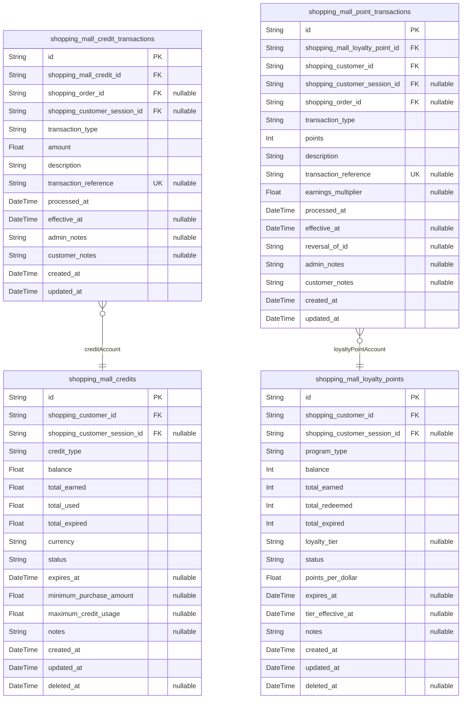

### `shopping_mall_credits`

Customer digital credit accounts for promotional credits, store credits,
and virtual currency management within the shopping mall platform.

These accounts serve as digital wallets where customers can accumulate
promotional credits, receive store credits for returns or compensation,
and manage virtual currency balances. The system tracks credit
acquisition, usage, expiration, and balance management across different
credit types and promotional campaigns.

Credits are denominated in platform currency and may have expiration
dates, usage restrictions, or promotional rules governing their
application to purchases. The system maintains complete audit trails for
all credit transactions and provides customers with transparent balance
tracking and usage history.

Properties as follows:

- `id`: Primary Key.
- `shopping_customer_id`: Customer's [shopping_mall_customer.id](#shopping_mall_customer).
- `shopping_customer_session_id`
  > Session when credit account was created or last modified. {@link
  > shopping_mall_customer_sessions.id}.
- `credit_type`
  > Type of credit account (promotional, store_credit, refund_compensation,
  > refer, birthday, special_campaign). Determines usage rules and expiration
  > policies.
- `balance`
  > Current credit balance in platform currency. Negative values indicate
  > used credits beyond available balance.
- `total_earned`
  > Total credits earned since account creation. Used for lifetime tracking
  > and account analytics.
- `total_used`
  > Total credits used for purchases across all transactions. Helps with
  > usage analytics and campaign effectiveness tracking.
- `total_expired`
  > Total credits that have expired due to time limits or policy changes.
  > Important for financial reporting and liability management.
- `currency`
  > Currency denomination for credits (USD, EUR, etc.). Supports
  > international marketplaces with multiple currencies.
- `status`
  > Account status (active, suspended, expired, closed). Controls
  > availability for earning and using credits.
- `expires_at`
  > When credits in this account expire. Used for promotional credits with
  > time limitations.
- `minimum_purchase_amount`
  > Minimum order value required to use these credits. Common for promotional
  > credits to encourage larger purchases.
- `maximum_credit_usage`
  > Maximum percentage or fixed amount of credit that can be used per
  > purchase. Prevents complete order payment with credits.
- `notes`
  > Administrative notes about credit account for customer service and
  > account management purposes.
- `created_at`: Account creation timestamp.
- `updated_at`: Last modification timestamp.
- `deleted_at`
  > Soft deletion timestamp for account closure while preserving transaction
  > history.

### `shopping_mall_credit_transactions`

Credit transaction ledger documenting all credit movements, redemptions,
expirations, and administrative adjustments for customer credit accounts.

This table serves as the immutable financial audit trail for promotional
credits, store credits, and virtual currency activities. Every credit
earning through promotions, refund compensation, or administrative
adjustments creates a permanent transaction record with detailed
accounting context.

The ledger maintains referential integrity with credit accounts while
preserving complete financial records even when accounts are modified or
closed. This supports regulatory compliance requirements, customer
dispute resolution, and business intelligence analytics for promotional
campaign effectiveness tracking.

Properties as follows:

- `id`: Primary Key.
- `shopping_mall_credit_id`
  > Credit account affected by this transaction. {@link
  > shopping_mall_credits.id}.
- `shopping_order_id`: Order associated with credit usage. [shopping_mall_orders.id](#shopping_mall_orders).
- `shopping_customer_session_id`
  > Session when transaction occurred for audit trail. {@link
  > shopping_mall_customer_sessions.id}.
- `transaction_type`
  > Type of transaction (earning, redemption, expiration, adjustment,
  > reversal, transfer_in, transfer_out). Determines accounting treatment and
  > business rules.
- `amount`
  > Transaction amount in platform currency. Positive values indicate credits
  > added, negative values indicate credits removed.
- `description`
  > Detailed description of the transaction for customer understanding and
  > regulatory audit trail requirements.
- `transaction_reference`
  > External reference number for correlation with payment systems, order
  > numbers, or promotional campaigns.
- `processed_at`: When the transaction was processed and applied to the credit balance.
- `effective_at`
  > When the transaction takes effect (may differ from processing time for
  > scheduled transactions).
- `admin_notes`
  > Internal notes for administrative purposes including reason codes and
  > approval references.
- `customer_notes`
  > Customer-facing explanation of the transaction for transparency and
  > customer service support.
- `created_at`: Transaction creation timestamp.
- `updated_at`: Last modification timestamp for audit purposes.

### `shopping_mall_loyalty_points`

Customer loyalty point accounts for reward programs, point accumulation,
and redemption management within the shopping mall platform.

These accounts serve as loyalty program wallets where customers can
accumulate points through purchases, promotions, referrals, and platform
engagement activities. The system tracks point earning, redemption,
expiration, and balance management across different loyalty programs and
promotional campaigns.

Loyalty points operate on a separate system from credits and may have
different conversion rates, expiration policies, and usage restrictions.
The system supports multiple loyalty program tiers, bonus point
campaigns, and point redemption for discounts, products, or services.
Complete audit trails are maintained for all point transactions to
support customer service and program analytics.

Properties as follows:

- `id`: Primary Key.
- `shopping_customer_id`: Customer's [shopping_mall_customer.id](#shopping_mall_customer).
- `shopping_customer_session_id`
  > Session when loyalty account was created or last modified. {@link
  > shopping_mall_customer_sessions.id}.
- `program_type`
  > Loyalty program type (basic, premium, vip, special_campaign). Determines
  > earning rates, redemption options, and member benefits.
- `balance`
  > Current loyalty points balance. Points are typically integer values for
  > clear redemption calculations.
- `total_earned`
  > Total points earned since account creation. Used for lifetime loyalty
  > tracking and tier advancement calculations.
- `total_redeemed`
  > Total points redeemed for rewards, discounts, or products. Tracks
  > customer redemption behavior and program engagement.
- `total_expired`
  > Total points that have expired due to time limits or program changes.
  > Important for program liability management.
- `loyalty_tier`
  > Current loyalty tier based on point accumulation or spending (bronze,
  > silver, gold, platinum). Determines earning multipliers and benefits.
- `status`
  > Account status (active, suspended, expired, closed). Controls ability to
  > earn and redeem points.
- `points_per_dollar`
  > Earning rate - how many points earned per dollar spent. Supports
  > tier-based earning multipliers and promotional rates.
- `expires_at`
  > When points in this account expire. Used for promotional points or
  > program-specific expiration policies.
- `tier_effective_at`
  > When loyalty tier was achieved or last updated for tier advancement
  > tracking.
- `notes`
  > Administrative notes about loyalty account for customer service and
  > program management.
- `created_at`: Account creation timestamp.
- `updated_at`: Last modification timestamp.
- `deleted_at`
  > Soft deletion timestamp for account closure while preserving transaction
  > history.

### `shopping_mall_point_transactions`

Complete transaction history for customer loyalty point accounts,
tracking all point earning, redemption, and administrative actions within
shopping mall loyalty programs.

This table serves as the immutable ledger for all loyalty point
activities, providing comprehensive audit trails for customer service,
program analytics, and fraud prevention. Every point earning through
purchases, redemption for rewards, point transfers, or administrative
adjustments creates a transaction record with detailed context and
reasoning.

The transaction log maintains referential integrity with loyalty point
accounts while preserving complete historical records for program
evaluation and customer engagement analysis. This supports tier
advancement calculations, reward program effectiveness tracking, and
personalized marketing insights based on customer point earning and
redemption patterns.

Properties as follows:

- `id`: Primary Key.
- `shopping_mall_loyalty_point_id`
  > Loyalty point account affected by this transaction. {@link
  > shopping_mall_loyalty_points.id}.
- `shopping_customer_id`
  > Customer whose loyalty account was affected. {@link
  > shopping_mall_customer.id}.
- `shopping_customer_session_id`
  > Session when transaction occurred for audit trail. {@link
  > shopping_mall_customer_sessions.id}.
- `shopping_order_id`
  > Order associated with point earning or redemption. {@link
  > shopping_mall_orders.id}.
- `transaction_type`
  > Type of transaction (earning, redemption, transfer_in, transfer_out,
  > adjustment, expiration, bonus). Determines business rules and point value
  > calculations.
- `points`
  > Number of points in the transaction. Positive values indicate points
  > earned, negative values indicate points redeemed.
- `description`
  > Detailed description of the transaction for customer understanding and
  > audit trail requirements.
- `transaction_reference`
  > External reference number for correlation with orders, promotional
  > campaigns, or partner program integrations.
- `earnings_multiplier`
  > Multiplier applied to base earnings rate for tier benefits or promotional
  > campaigns. Records actual earning rate for audit trails.
- `processed_at`: When the transaction was processed and applied to the point balance.
- `effective_at`
  > When the transaction takes effect (may differ from processing time for
  > scheduled transactions or campaign activations).
- `reversal_of_id`
  > ID of original transaction if this is a reversal or correction.
  > Self-referential foreign key for audit trail integrity.
- `admin_notes`
  > Internal notes for administrative purposes including reason codes and
  > approval references for point adjustments.
- `customer_notes`
  > Customer-facing explanation of the transaction for transparency and
  > customer service support.
- `created_at`: Transaction creation timestamp.
- `updated_at`: Last modification timestamp.

## Inquiries

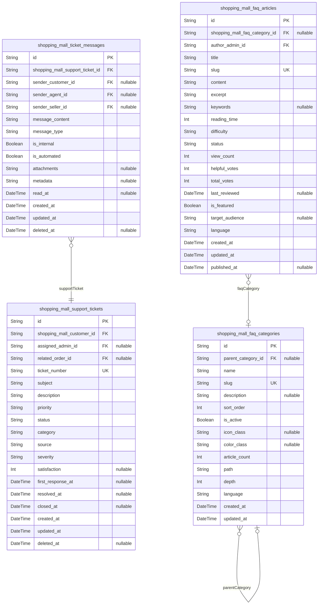

### `shopping_mall_support_tickets`

Customer support tickets managing issue resolution workflows across the
marketplace ecosystem.

The ticket system serves as the primary interface for customers to report
problems, request assistance, and track resolution progress. Each ticket
captures the complete customer service interaction chain from initial
issue reporting through final resolution and follow-up feedback
collection.

Tickets support complex multi-party scenarios where issues may involve
multiple sellers, various platform services, or require coordination
between different support teams. The system maintains detailed audit
trails for quality assurance, performance analytics, and regulatory
compliance requirements.

The workflow engine handles ticket escalation, priority changes,
inter-department transfers, and collaboration workflows that enable
efficient resolution of complex customer issues while maintaining service
level agreements and customer satisfaction standards.

Properties as follows:

- `id`: Primary Key.
- `shopping_mall_customer_id`
  > Customer who created this ticket. References the customer's {@link
  > shopping_mall_customer.id}.
- `assigned_admin_id`
  > Support agent currently assigned to handle this ticket. References the
  > assigned [shopping_mall_admin.id](#shopping_mall_admin) for ticket ownership.
- `related_order_id`
  > Associated order if ticket relates to a specific purchase. References the
  > relevant [shopping_mall_orders.id](#shopping_mall_orders) for order-specific issues.
- `ticket_number`
  > Unique ticket identifier for customer reference and tracking purposes.
  > Generated automatically following format TKT-{year}{sequence}.
- `subject`
  > Brief descriptive title summarizing the customer issue or inquiry.
  > Limited to 200 characters to provide clear issue identification.
- `description`
  > Detailed explanation of the customer issue including symptoms, impact,
  > and any attempted resolutions. Comprehensive documentation helps support
  > agents understand and resolve issues efficiently.
- `priority`
  > Urgency level determining response time and resource allocation. Valid
  > values: low, medium, high, urgent. Higher priority tickets receive faster
  > response times and specialized attention.
- `status`
  > Current stage in ticket resolution workflow. Valid values: new, open,
  > in_progress, pending_customer, pending_internal, resolved, closed. Tracks
  > lifecycle from creation to final resolution.
- `category`
  > Classification grouping tickets by issue type for routing and analytics.
  > Examples: order_issue, product_inquiry, account_problem, payment_dispute,
  > technical_support.
- `source`
  > Channel through which ticket was created. Valid values: email, chat,
  > phone, portal, social_media. Helps track customer preferences and
  > optimize support channel strategies.
- `severity`
  > Impact level on customer experience affecting priority and resource
  > allocation. Valid values: critical, major, minor, cosmetic. Critical
  > issues severely impact customer ability to use platform.
- `satisfaction`
  > Customer satisfaction rating collected after ticket resolution. Valid
  > values: 1-5 with 5 being highest satisfaction. Enables quality
  > measurement and support agent performance evaluation.
- `first_response_at`
  > Timestamp when support agent first responded to customer. Measures
  > response time performance and SLA compliance for service level
  > management.
- `resolved_at`
  > Timestamp when ticket solution was provided and marked as resolved.
  > Measures resolution time performance and tracks customer issue handling
  > efficiency.
- `closed_at`
  > Timestamp when ticket was fully closed after resolution verification and
  > customer follow-up. Represents complete case closure and final status
  > confirmation.
- `created_at`
  > Timestamp when customer initially created the support ticket. Establishes
  > case opening and begins timing for SLA measurement and resolution
  > tracking.
- `updated_at`
  > Timestamp of most recent ticket status change or customer interaction.
  > Tracks activity and helps identify stalled cases requiring attention or
  > escalation.
- `deleted_at`
  > Timestamp of ticket archival for audit purposes. Soft deletion preserves
  > historical records while removing from active management dashboards for
  > data retention compliance.

### `shopping_mall_ticket_messages`

Detailed communication thread within support tickets enabling
comprehensive issue resolution tracking.

The message system provides structured communication channels between
customers and support agents while maintaining complete conversation
history for quality assurance, audit compliance, and service improvement
analytics. Each message captures interaction content, timing, and
participant attribution to support case management and escalation
procedures.

The messaging framework supports rich content types including text, file
attachments, system-generated updates, and automated responses to
accommodate diverse communication needs. Messages include comprehensive
metadata for routing decisions, escalation triggers, and performance
analysis while preserving customer privacy through appropriate data
handling protocols.

Message threading enables complex conversation patterns including
multi-party discussions, internal agent collaboration, external vendor
coordination, and cross-department communication workflows essential for
resolving complex customer issues. The audit trail supports regulatory
compliance, dispute resolution, and quality improvement initiatives
through detailed interaction analysis.

Properties as follows:

- `id`: Primary Key.
- `shopping_mall_support_ticket_id`
  > Parent ticket containing this message. References the specific {@link
  > shopping_mall_support_ticket.id} for message threading and context
  > preservation.
- `sender_customer_id`
  > Customer who sent this message if message originates from customer.
  > References the [shopping_mall_customer.id](#shopping_mall_customer) for customer
  > communication attribution.
- `sender_agent_id`
  > Support agent who sent this message if message originates from support
  > team. References the [shopping_mall_admin.id](#shopping_mall_admin) for agent
  > communication attribution and performance tracking.
- `sender_seller_id`
  > Seller who sent this message if message originates from marketplace
  > seller. References the [shopping_mall_seller.id](#shopping_mall_seller) for seller
  > communication in multi-party ticket scenarios.
- `message_content`
  > Actual message text content including customer questions, support
  > responses, and system communications. Limited to 10,000 characters to
  > accommodate detailed explanations while maintaining readability.
- `message_type`
  > Classification of message format and intent. Valid values: text,
  > email_forward, system_notice, attachment, escalation. Enables appropriate
  > display formatting and routing for different message types.
- `is_internal`
  > Privacy flag indicating whether message is visible to customer or
  > restricted to internal support team. Internal messages enable agent
  > collaboration while maintaining external communication consistency.
- `is_automated`
  > Source indicator identifying whether message was generated by automated
  > system rather than human agent. Helps distinguish between personalized
  > responses and automated workflow notifications.
- `attachments`
  > JSON array of file attachments including images, documents, or other
  > supporting materials relevant to the conversation. Enables comprehensive
  > evidence sharing and documentation support for complex issues.
- `metadata`
  > Additional structured data related to message context including
  > timestamps, system events, or external references. Supports integration
  > with other systems and preserves conversation context across different
  > platforms.
- `read_at`
  > Timestamp when recipient opened and processed the message. Enables read
  > receipt functionality and helps measure response time performance across
  > communication channels.
- `created_at`
  > Timestamp when message was sent or created in the system. Establishes
  > chronological order for conversation threading and supports SLA
  > measurement for response time compliance.
- `updated_at`
  > Timestamp of most recent message modification including content edits or
  > status changes. Tracks modification history and supports audit
  > requirements for conversation accuracy verification.
- `deleted_at`
  > Timestamp of message removal for privacy compliance or content moderation
  > requirements. Soft deletion preserves audit trails while removing
  > sensitive content from user interfaces.

### `shopping_mall_faq_articles`

Comprehensive knowledge base articles providing self-service support
solutions for common customer inquiries and platform guidance.

The FAQ system serves as the primary self-service support resource,
enabling customers to find answers to common questions without requiring
direct support contact. Articles provide detailed explanations,
step-by-step guides, troubleshooting procedures, and platform
functionality documentation needed for independent problem resolution.

The knowledge base supports sophisticated organization through
hierarchical categorization, tagging systems, and cross-referencing
capabilities that enable customers to navigate complex topics
efficiently. Articles include rich formatting options, embedded media
content, and interactive elements that enhance comprehension and provide
comprehensive support solutions.

Content management features enable continuous improvement through usage
analytics, customer feedback integration, and performance tracking that
identifies knowledge gaps and optimization opportunities. The system
supports collaborative authoring with approval workflows, version
control, and quality assurance processes ensuring accuracy and currency
of support information.

Properties as follows:

- `id`: Primary Key.
- `shopping_mall_faq_category_id`
  > Knowledge base category containing this article for organizational
  > hierarchy. References the [shopping_mall_faq_categories.id](#shopping_mall_faq_categories) for
  > content organization and navigation structure.
- `author_admin_id`
  > Support team member who authored or last updated this article. References
  > the [shopping_mall_admin.id](#shopping_mall_admin) for content accountability and
  > expertise attribution.
- `title`
  > Descriptive article title clearly indicating the topic and solution
  > provided. Limited to 200 characters to ensure clarity in search results
  > and category listings while maintaining readability.
- `slug`
  > URL-friendly identifier for SEO optimization and direct article access.
  > Automatically generated from title while ensuring uniqueness and avoiding
  > special characters for web accessibility.
- `content`
  > Comprehensive article body providing detailed instructions, explanations,
  > and guidance for customer support. Supports rich text formatting
  > including headings, lists, images, and embedded media for enhanced
  > comprehension.
- `excerpt`
  > Brief summary of approximately 300 characters describing article content
  > and key solution points. Appears in search results and category listings
  > to help customers identify relevant articles efficiently.
- `keywords`
  > Comma-separated search keywords and phrases improving article
  > discoverability through customer searches. Enables synonyms and
  > alternative phrasings to match varied customer vocabulary and question
  > formats.
- `reading_time`
  > Estimated reading time in minutes based on content word count and
  > complexity assessment. Helps customers gauge time investment required and
  > improves content selection decision making.
- `difficulty`
  > Complexity level classification guiding customers to appropriately
  > challenging content. Valid values: beginner, intermediate, advanced,
  > expert. Helps match article complexity to customer skill level and needs.
- `status`
  > Publication state controlling article visibility and access. Valid
  > values: draft, published, archived, under_review. Enables content
  > workflow management and quality control for knowledge base accuracy.
- `view_count`
  > Total number of times article has been viewed by customers indicating
  > content popularity and usefulness. Enables performance analysis and
  > guides content optimization priorities for high-demand topics.
- `helpful_votes`
  > Count of positive customer feedback indicating article successfully
  > resolved their issue. Measures content effectiveness and guides knowledge
  > base improvement targeting frequently used but ineffective content.
- `total_votes`
  > Total number of customer feedback submissions providing vote statistics.
  > Measures engagement rates and provides context for helpfulness score
  > calculations used in article performance evaluation.
- `last_reviewed`
  > Timestamp of most recent content review ensuring article accuracy and
  > current relevance. Supports content lifecycle management and helps
  > identify articles requiring updates due to platform changes or policy
  > modifications.
- `is_featured`
  > Prominence indicator highlighting important or frequently requested
  > articles in search results and category displays. Featured articles
  > receive enhanced visibility and positioning to improve customer access to
  > critical support information.
- `target_audience`
  > Specific user group that article is designed to assist including
  > customers, sellers, new users, or technical audiences. Enables
  > personalized content delivery and improves relevance matching for
  > different user segments across the platform.
- `language`
  > Content language using ISO 639-1 codes to support multilingual knowledge
  > base functionality. Ensures appropriate language delivery based on user
  > preferences and interface localization settings.
- `created_at`
  > Timestamp when article was initially created in the knowledge base
  > system. Establishes content creation history and supports chronological
  > organization for article management and discovery purposes.
- `updated_at`
  > Timestamp of most recent article content modification or metadata update.
  > Tracks content lifecycle changes and helps identify articles requiring
  > review due to outdated information or platform evolution.
- `published_at`
  > Timestamp when article became publicly visible to customers. Manages
  > content visibility schedules and supports staged publishing workflows for
  > coordinated knowledge base updates and new feature documentation
  > releases.

### `shopping_mall_faq_categories`

Hierarchical category system organizing knowledge base content for
intuitive navigation and efficient content discovery.

The category system provides structured organization for FAQ articles
enabling customers to browse topics systematically and discover relevant
solutions through logical content grouping. Categories support multiple
hierarchical levels allowing for broad to specific topic navigation that
accommodates diverse customer needs and knowledge domains.

The organizational framework includes comprehensive metadata management
with descriptions, icons, and navigation properties that enhance user
experience through visual cues and intuitive information architecture.
Categories support flexible arrangement allowing administrators to adapt
organization structures based on customer behavior patterns, seasonal
requirements, and evolving support needs.

Performance optimization features include search integration, popular
content highlighting, and personalized recommendations that connect
customers with relevant articles efficiently while supporting content
scalability as the knowledge base grows. The system maintains category
performance metrics and customer feedback integration to guide continuous
improvement of content organization and effectiveness.

Properties as follows:

- `id`: Primary Key.
- `parent_category_id`
  > Parent category enabling hierarchical organization with unlimited nesting
  > depth. References another [shopping_mall_faq_categories.id](#shopping_mall_faq_categories) to
  > create category trees and subcategory structures for intuitive content
  > hierarchy.
- `name`
  > Category display name shown to customers for navigation and content
  > discovery. Limited to 100 characters for optimal display across different
  > interface layouts and screen sizes while maintaining clarity.
- `slug`
  > URL-friendly category identifier for SEO optimization and direct category
  > access. Automatically generated from name ensuring uniqueness while
  > excluding special characters for web compatibility and accessibility.
- `description`
  > Comprehensive category explanation providing context and guidance about
  > contained content. Helps customers understand category scope and select
  > appropriate navigation paths for their support needs.
- `sort_order`
  > Numerical position controlling category display sequence within parent
  > category or root level. Lower numbers appear first enabling flexible
  > category arrangement for optimal user experience and important category
  > prioritization.
- `is_active`
  > Visibility flag controlling whether category appears in customer
  > navigation interfaces. Enables category management during content
  > development and supports seasonal category variations without permanent
  > deletion.
- `icon_class`
  > CSS class name for visual icon enhancing category recognition and user
  > interface attractiveness. Enables visual differentiation between
  > categories and supports responsive design across different device types
  > and screen sizes.
- `color_class`
  > CSS class name for category theming enabling consistent visual styling
  > and brand alignment. Supports accessibility requirements and helps create
  > intuitive user interfaces for enhanced customer experience.
- `article_count`
  > Cached count of published articles within this category enabling
  > performance optimization and providing category size indicators to
  > administrates for content management decisions.
- `path`
  > Full hierarchical path representing complete category ancestry including
  > all parent categories. Enables breadcrumb navigation and provides context
  > for category relationships like 'Technical/Account/Password_Issues' or
  > 'Orders/Shipping/Delivery_Tracking'.
- `depth`
  > Numerical level indicating category position within hierarchy starting at
  > 0 for root categories. Enables UI depth-based formatting and supports
  > programmatic category tree traversal for hierarchical display purposes.
- `language`
  > Language code using ISO 639-1 format for multilingual category support.
  > Enables category localization and ensures appropriate content delivery
  > based on user preferences and platform internationalization settings.
- `created_at`
  > Timestamp when category was initially created in the knowledge base
  > organization system. Establishes creation history and supports category
  > lifecycle management throughout organizational evolution.
- `updated_at`
  > Timestamp of most recent category modification including name changes,
  > description updates, or structural adjustments. Tracks organizational
  > changes and helps identify categories requiring review due to content
  > reorganization.

## Articles

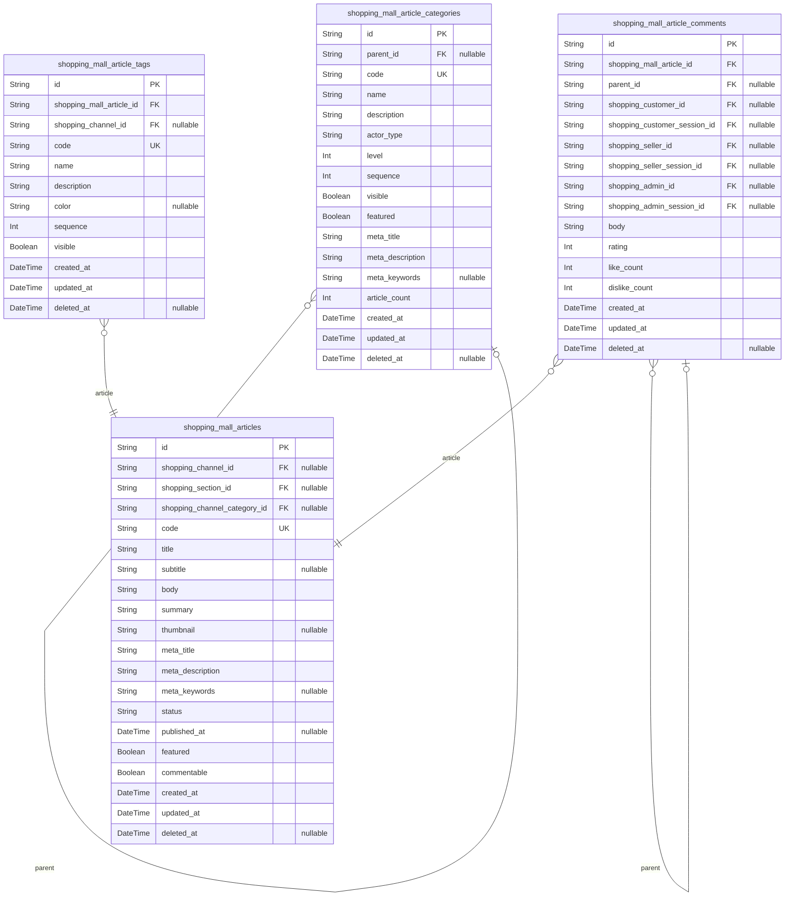

### `shopping_mall_articles`

Platform articles and blog content with comprehensive publishing workflow
support and content management capabilities.

The article system serves as the primary content management foundation
for the platform, supporting blog posts, editorial content, and
user-generated articles. Each article maintains complete publishing
workflow states, SEO optimization metadata, and full content revision
history through integrated snapshot architecture.

Articles support multi-format content including rich text, embedded
media, and dynamic components while maintaining editorial standards
through moderation workflows. The system provides comprehensive content
analytics, engagement tracking, and optimization tools for publishers and
administrators. Articles facilitate content syndication across
marketplace channels with automated categorization and dynamic
publication controls.

Properties as follows:

- `id`: Primary Key.
- `shopping_channel_id`
  > Publication channel for article visibility. {@link
  > shopping_mall_channels.id}
- `shopping_section_id`: Content section for categorization. [shopping_mall_sections.id](#shopping_mall_sections)
- `shopping_channel_category_id`
  > Channel category for refined targeting. {@link
  > shopping_mall_channel_categories.id}
- `code`: Unique article identifier for business purposes
- `title`: Article headline optimized for readability and SEO
- `subtitle`: Optional subheading providing additional context
- `body`: Main article content with rich text formatting support
- `summary`: Brief excerpt for preview and search result display
- `thumbnail`: Featured image URL for social sharing and promotion
- `meta_title`: SEO title optimized for search engine visibility
- `meta_description`: SEO description for search result snippets
- `meta_keywords`: SEO keywords for search relevance optimization
- `status`: Publishing workflow state with enum values: draft,published,archived
- `published_at`: Publication date when article becomes publicly visible
- `featured`: Featured article designation for homepage display
- `commentable`: Whether comments are enabled for reader engagement
- `created_at`: Creation timestamp
- `updated_at`: Last modification timestamp
- `deleted_at`: Soft deletion timestamp

### `shopping_mall_article_categories`

Hierarchical article categorization system enabling organized content
structure and enhanced content discoverability across the platform.

Article categories provide the primary navigation and organizational
framework for platform content, supporting hierarchical nesting,
cross-category relationships, and dynamic categorization rules. The
system enables both automatic categorization based on content analysis
and manual categorization for precise content organization.

Categories support SEO optimization through structured URL hierarchies,
metadata inheritance, and content aggregation while providing
comprehensive analytics for content performance tracking across different
category segments. Categories require independent management for channel
configuration, cross-platform organization, and dynamic content curation
workflows.

Properties as follows:

- `id`: Primary Key.
- `parent_id`
  > Parent category for hierarchical organization. {@link
  > shopping_mall_article_categories.id}
- `code`: Unique category identifier in URL-friendly format
- `name`: Category display name for navigation and organization
- `description`: Comprehensive category description with SEO optimization
- `actor_type`
  > Ownership type indicating who created this category (channel_admin,
  > system, content_manager)
- `level`: Nesting depth level for category hierarchy management
- `sequence`: Display ordering for consistent navigation presentation
- `visible`: Category visibility status for platform navigation
- `featured`: Featured category status for homepage promotion
- `meta_title`: SEO-friendly page title for category optimization
- `meta_description`: SEO description for search result enhancement
- `meta_keywords`: SEO keywords for discoverability improvement
- `article_count`: Article count statistics for category performance tracking
- `created_at`: Category creation timestamp
- `updated_at`: Category modification timestamp
- `deleted_at`: Soft deletion timestamp

### `shopping_mall_article_comments`

Article comment system enabling reader engagement, discussion
facilitation, and community building around platform content through
structured conversation management.

The comment system provides comprehensive engagement capabilities
including threaded discussion support, comment rating mechanisms,
moderation workflows, and author response tools. Comments support rich
text formatting, media embedding, and reputation-based visibility
controls to foster high-quality community discourse while maintaining
civil discussion standards.

Comments require independent management capabilities for cross-article
search functionality, moderation workflows, and community engagement
analytics while providing authors with robust response and moderation
tools for maintaining productive discussion environments.

Properties as follows:

- `id`: Primary Key.
- `shopping_mall_article_id`: Parent article for comment threading. [shopping_mall_articles.id](#shopping_mall_articles)
- `parent_id`
  > Parent comment for nested thread replies. {@link
  > shopping_mall_article_comments.id}
- `shopping_customer_id`: Customer author of the comment. [shopping_mall_customer.id](#shopping_mall_customer)
- `shopping_customer_session_id`
  > Session context for the comment creation. {@link
  > shopping_mall_customer_sessions.id}
- `shopping_seller_id`: Seller author of the comment. [shopping_mall_seller.id](#shopping_mall_seller)
- `shopping_seller_session_id`
  > Session context for seller comment creation. {@link
  > shopping_mall_seller_sessions.id}
- `shopping_admin_id`: Admin author of the comment. [shopping_mall_admin.id](#shopping_mall_admin)
- `shopping_admin_session_id`
  > Session context for admin comment creation. {@link
  > shopping_mall_admin_sessions.id}
- `body`: Comment content with support for rich text formatting
- `rating`: Comment relevance rating for community moderation
- `like_count`: Comment engagement metrics for popularity ranking
- `dislike_count`: Negative engagement tracking for content quality
- `created_at`: Comment creation timestamp
- `updated_at`: Comment modification timestamp
- `deleted_at`: Soft deletion timestamp

### `shopping_mall_article_tags`

Article tag management system enabling flexible content categorization
and cross-content relationship building for enhanced content discovery
and organization.

Article tags provide granular content organization beyond hierarchical
categories, supporting dynamic association linking, trending topic
identification, and SEO optimization through semantic relationship
building. The system enables both automated tag generation based on
content analysis and manual tag application for precise content
classification.

Tags support content discovery optimization, readership targeting, and
engagement analysis while providing flexible categorization that adapts
to changing content themes and reader interests across the platform's
publication ecosystem.

Properties as follows:

- `id`: Primary Key.
- `shopping_mall_article_id`: Associated article for tag relationship. [shopping_mall_articles.id](#shopping_mall_articles)
- `shopping_channel_id`: Channel context for tag organization. [shopping_mall_channels.id](#shopping_mall_channels)
- `code`: Unique tag identifier for system reference
- `name`: Tag display name for user interface and navigation
- `description`: Tag description explaining usage and scope
- `color`: Display color for visual categorization and highlighting
- `sequence`: Display ordering for consistent tag presentation
- `visible`: Tag visibility for public display and content organization
- `created_at`: Tag creation timestamp
- `updated_at`: Tag modification timestamp
- `deleted_at`: Soft deletion timestamp

## Reviews

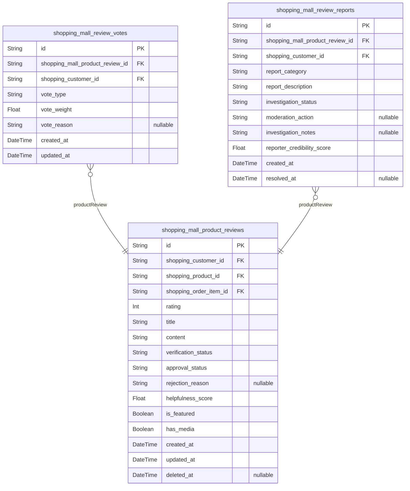

### `shopping_mall_product_reviews`

Product reviews and ratings submitted by customers for purchased products.

This table serves as the core review management system enabling customers
to share their experiences with products. Reviews include comprehensive
rating systems, detailed text content, and visual media to help other
customers make informed purchasing decisions.

The system maintains verified purchase validation by linking to specific
product orders, ensuring review authenticity. Reviews undergo automated
quality checks and potential moderation workflows to maintain community
standards. Each review supports multiple rating criteria and allows
customers to upload photos or videos demonstrating product usage.

Reviews remain attached to products permanently, providing historical
context and trend analysis for customers and sellers alike. The rating
system supports multiple criteria including overall satisfaction, value
for money, quality assessment, and shipping satisfaction where
applicable. Review visibility is controlled through approval statuses and
content standards enforcement.

Properties as follows:

- `id`: Primary Key.
- `shopping_customer_id`: Customer who wrote the review. [shopping_mall_customer.id](#shopping_mall_customer)
- `shopping_product_id`: Product being reviewed. [shopping_mall_products.id](#shopping_mall_products)
- `shopping_order_item_id`
  > Order item validating verified purchase requirement. {@link
  > shopping_mall_order_items.id}
- `rating`
  > Overall product rating on scale of 1-5 stars. Validates customer
  > satisfaction with purchase experience and product quality. Affects
  > product discovery and seller reputation.
- `title`
  > Brief review title summarizing key points. Limited to 100 characters for
  > search optimization and preview displays. Appears in review listings and
  > search results.
- `content`
  > Detailed review content explaining customer experience. Minimum 50
  > characters ensures substantive feedback. Supports rich text formatting
  > including paragraphs and lines breaks for readability.
- `verification_status`
  > Verification status indicating purchase confirmation. Values: 'verified'
  > for confirmed purchases, 'unverified' for direct submissions, 'pending'
  > for validation queue. Affects review credibility and visibility.
- `approval_status`
  > Moderation approval status controlling review visibility. Values:
  > 'pending' for queue review, 'approved' for public display, 'rejected' for
  > policy violations, 'flagged' for content investigation.
- `rejection_reason`
  > Explanation provided when review is rejected or requires modification.
  > Helps educate customers about content guidelines and provides
  > constructive feedback for improvement.
- `helpfulness_score`
  > Aggregate helpfulness score calculated from community votes. Higher
  > scores indicate reviews that provide valuable information to other
  > customers. Influences review ranking and recommendation algorithms.
- `is_featured`
  > Featured review designation highlighting exceptional content. Featured
  > reviews receive priority placement in product listings and may be
  > showcased on category pages or promotional materials.
- `has_media`
  > Indicates presence of uploaded photos or videos in review. Media content
  > enhances review credibility and provides visual proof of product usage or
  > condition.
- `created_at`
  > Timestamp when review was first submitted to the platform. Used for
  > chronological review organization and age-based review weighting in
  > rankings.
- `updated_at`
  > Timestamp of last review modification including content edits or status
  > changes. Tracks review evolution and maintenance activity over time.
- `deleted_at`
  > Soft deletion timestamp for reviews removed from public display. Supports
  > content moderation workflows while preserving historical data for
  > analysis and audit purposes.

### `shopping_mall_review_votes`

Community voting system for review helpfulness and quality assessment
enabling customers to evaluate review value and credibility.

This table implements a community-driven review quality system where
customers can indicate whether reviews were helpful or unhelpful to their
purchase decision process. The voting mechanism provides crowdsourced
review validation, helping identify high-quality feedback that provides
genuine value to other customers shopping for similar products.

The voting system filters out fake or unhelpful reviews through community
participation, reducing the need for extensive manual moderation while
maintaining review quality standards. The design prevents vote
manipulation by limiting voting to authenticated customers and
implementing abuse detection algorithms. Established customers with
voting history receive greater weight in aggregate calculations.

The helpfulness scoring enables sophisticated review ranking algorithms
that prioritize genuinely helpful content over subjective or low-effort
reviews. The voting data supports seller performance analytics by
identifying customers who consistently contribute valuable reviews versus
those whose feedback requires improvement or should be moderated.

Properties as follows:

- `id`: Primary Key.
- `shopping_mall_product_review_id`: Review being voted on. [shopping_mall_product_reviews.id](#shopping_mall_product_reviews)
- `shopping_customer_id`: Customer casting the vote. [shopping_mall_customer.id](#shopping_mall_customer)
- `vote_type`
  > Type of vote cast by community member. Values: 'helpful' for valuable
  > content, 'unhelpful' for generic or irrelevant content, 'inappropriate'
  > for policy violations. Supports community-driven review quality
  > assessment.
- `vote_weight`
  > Voting weight based on voter reputation and history. Varies from 0.1 (new
  > users) to 5.0 (established community members with proven track record).
  > Prevents vote manipulation and ensures quality voting.
- `vote_reason`
  > Optional reason or comment explaining vote rationale. Helps improve
  > review quality by providing constructive feedback to reviewers and
  > supports review ranking algorithm optimizations.
- `created_at`
  > Timestamp when vote was cast. Prevents duplicate voting and enables
  > time-based vote weighting algorithms that may prioritize recent votes
  > over older ones.
- `updated_at`
  > Timestamp of vote modification or reason addition. Supports review and
  > editing capabilities for community voting with audit trail maintenance.

### `shopping_mall_review_reports`

Community reporting system for identifying inappropriate, misleading, or
policy-violating review content through structured investigation
workflows.

This table provides a comprehensive community moderation mechanism
enabling customers to report reviews that violate platform policies,
contain inappropriate content, or provide misleading information to other
shoppers. The reporting system creates structured workflows for
investigating reported content while protecting the review algorithm from
manipulation and ensuring fair treatment of all reviewers.

The reporting mechanism balances community engagement with abuse
prevention by tracking reporter credibility and implementing weighted
assessment algorithms. The system distinguishes between legitimate
content concerns and frivolous or malicious reporting, maintaining review
ecosystem integrity while providing appropriate channels for content
improvement and community standards compliance. Multiple reports on
single reviews trigger expedited investigation processes while preventing
coordinated manipulation attempts.

The investigation workflows support different resolution paths based on
report severity and category, ranging from automated content flagging to
manual moderator review and customer service escalation. The reporting
data provides valuable analytics for identifying systemic review quality
issues, common policy violations, and areas where platform guidelines
require clarification or improvement.

Properties as follows:

- `id`: Primary Key.
- `shopping_mall_product_review_id`
  > Review being reported for policy violations. {@link
  > shopping_mall_product_reviews.id}
- `shopping_customer_id`: Customer submitting the report. [shopping_mall_customer.id](#shopping_mall_customer)
- `report_category`
  > Category of violation being reported. Values: 'inappropriate_content' for
  > offensive material, 'fake_review' for purchased or fabricated reviews,
  > 'spam' for irrelevant or promotional content, 'personal_information' for
  > privacy violations, 'harmful_advice' for dangerous recommendations.
- `report_description`
  > Detailed explanation supporting the report claim. Minimum 50 characters
  > ensures meaningful reporting. Helps moderators understand context and
  > make informed decisions about content actionability.
- `investigation_status`
  > Current status of report investigation process. Values: 'pending' for
  > queue assignment, 'under_review' for active investigation, 'resolved' for
  > completed actions, 'dismissed' for invalid claims
- `moderation_action`
  > Action taken as result of investigation findings. Values: 'no_action' for
  > unsubstantiated claims, 'review_modified' for content update requirement,
  > 'review_removed' for policy violation confirmation, 'reviewer_warned' for
  > education approach, 'reviewer_suspended' for repeat violations
- `investigation_notes`
  > Internal notes and analysis from investigator review. Documents
  > investigation process, evidence consideration, and decision rationale for
  > audit trail and potential appeal review.
- `reporter_credibility_score`
  > Assessment of reporter history and reliability. Varies from 0.0 (frequent
  > false reports) to 1.0 (consistently accurate reporting). Used for
  > priority assessment and reporting weight calculations in investigation
  > algorithms.
- `created_at`
  > Timestamp when report was initially submitted. Used for investigation
  > prioritization and reporting volume analysis to identify trending issues
  > or coordinated reporting campaigns.
- `resolved_at`
  > Timestamp when investigation was completed and final action determined.
  > Used for processing time analysis and workflow efficiency measurement.

## Analytics

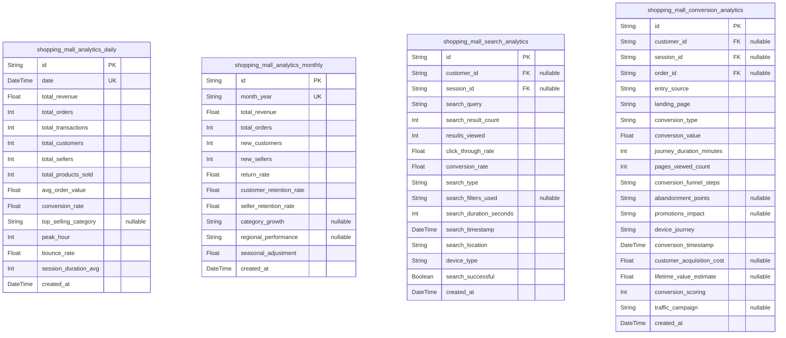

### `shopping_mall_analytics_daily`

Daily aggregated analytics data capturing platform performance metrics,
seller activity, and customer behavior patterns for comprehensive
business intelligence reporting and performance monitoring.

Stores comprehensive daily statistics including transaction volumes,
revenue metrics, user engagement data, and platform performance
indicators to enable data-driven decision making across the marketplace
ecosystem. Each daily snapshot preserves complete performance context for
historical trend analysis and operational optimization.

Properties as follows:

- `id`: Primary Key.
- `date`: Date for which analytics are recorded.
- `total_revenue`
  > Total gross revenue for the day including all transactions across the
  > platform.
- `total_orders`: Total number of orders placed during the day.
- `total_transactions`: Total number of payment transactions processed.
- `total_customers`
  > Number of active customers who performed at least one action during the
  > day.
- `total_sellers`
  > Number of active sellers who had at least one transaction or update
  > during the day.
- `total_products_sold`: Total number of individual products sold across all orders.
- `avg_order_value`: Average order value calculated as total revenue divided by total orders.
- `conversion_rate`
  > Overall platform conversion rate from visits to completed orders for the
  > day.
- `top_selling_category`: The product category with the highest sales volume for the day.
- `peak_hour`: Hour of the day (0-23) with the highest transaction volume.
- `bounce_rate`: Percentage of single-page visits without meaningful engagement.
- `session_duration_avg`: Average session duration in seconds across all platform visitors.
- `created_at`: Timestamp when this daily snapshot was created.

### `shopping_mall_analytics_monthly`

Monthly aggregated analytics providing longer-term trend analysis and
strategic performance metrics for quarterly planning and annual business
reviews.

Captures comprehensive monthly statistics including revenue totals, order
volumes, user acquisition metrics, and seasonal performance patterns to
support executive decision making and strategic planning initiatives.
Monthly snapshots enable year-over-year comparisons and quarterly
performance assessment across all platform business segments.

Properties as follows:

- `id`: Primary Key.
- `month_year`: Calendar month and year in YYYY-MM format for monthly analytics tracking.
- `total_revenue`: Total gross revenue for the month across all sellers and transactions.
- `total_orders`: Total number of orders placed during the month.
- `new_customers`: Number of new customer registrations during the month.
- `new_sellers`: Number of new seller registrations approved during the month.
- `return_rate`: Percentage of orders that resulted in returns or refunds during the month.
- `customer_retention_rate`
  > Percentage of customers from previous month who made purchases in the
  > current month.
- `seller_retention_rate`
  > Percentage of active sellers from previous month who maintained activity
  > in current month.
- `category_growth`: JSON array of fastest-growing product categories with growth percentages.
- `regional_performance`: JSON object with regional performance metrics and geographic insights.
- `seasonal_adjustment`: Adjusted metrics accounting for seasonal fluctuations and holidays.
- `created_at`: Timestamp when this monthly snapshot was created.

### `shopping_mall_search_analytics`

Search analytics tracking comprehensive user search behavior including
query patterns, result engagement, and conversion pathways to optimize
site search functionality and product discovery experiences.

Documents complete search interaction patterns including query terms,
result selection behaviors, refinement actions, and ultimate conversion
outcomes to identify search optimization opportunities and measure search
algorithm effectiveness. The analytics capture both successful searches
leading to purchases and unsuccessful searches indicating content gaps or
discoverability issues.

Properties as follows:

- `id`: Primary Key.
- `customer_id`
  > The customer's [shopping_mall_customer.id](#shopping_mall_customer) who performed the
  > search, if available.
- `session_id`
  > The user's [shopping_mall_customer_sessions.id](#shopping_mall_customer_sessions) for session-based
  > tracking of search patterns.
- `search_query`
  > The original search query entered by the user with exact spelling and
  > terms preserved.
- `search_result_count`: Number of search results returned to the user for the given query.
- `results_viewed`: Number of search results the user actually viewed or engaged with.
- `click_through_rate`: Percentage of search results that received user clicks or interactions.
- `conversion_rate`
  > Percentage of searches that resulted in completed purchases or other
  > desired actions.
- `search_type`: Type of search performed (text, category, filter, autocomplete).
- `search_filters_used`: JSON array of filters and refinements applied during the search process.
- `search_duration_seconds`
  > Time in seconds from search initiation to final search result interaction
  > or abandonment.
- `search_timestamp`
  > When the search was initiated for chronological analysis of search
  > patterns.
- `search_location`
  > Platform location where search was performed (homepage, category page,
  > product page, etc.).
- `device_type`: Device category used for search (desktop, mobile, tablet).
- `search_successful`: Whether the search returned relevant results that led to user engagement.
- `created_at`: Timestamp when search analytics record was created.

### `shopping_mall_conversion_analytics`

Conversion analytics tracking complete user journey from initial site
entry through successful transaction completion to identify optimization
opportunities and measure marketing effectiveness.

Captures comprehensive conversion funnel data including entry points,
navigation patterns, engagement metrics, and successful transaction
completion to analyze the effectiveness of different traffic sources,
page layouts, and promotional campaigns in driving customer conversions.
The analytics focus on identifying barriers to conversion and measuring
the impact of platform optimizations on business outcomes.

Properties as follows:

- `id`: Primary Key.
- `customer_id`
  > The customer's [shopping_mall_customer.id](#shopping_mall_customer) who completed the
  > conversion process.
- `session_id`
  > The user's [shopping_mall_customer_sessions.id](#shopping_mall_customer_sessions) for session-based
  > tracking of conversion pathways.
- `order_id`
  > The successful [shopping_mall_orders.id](#shopping_mall_orders) that represents the
  > completed conversion.
- `entry_source`
  > Traffic source that brought the user to the platform (organic, paid,
  > social, email, direct).
- `landing_page`: First page the user landed on when entering the platform.
- `conversion_type`: Type of conversion completed (purchase, registration, subscription, etc.).
- `conversion_value`: Monetary value of the conversion for revenue calculation and ROI analysis.
- `journey_duration_minutes`
  > Total time from initial entry to successful conversion completion in
  > minutes.
- `pages_viewed_count`: Number of unique pages viewed during the conversion journey.
- `conversion_funnel_steps`: String array of all pages and actions in the conversion journey sequence.
- `abandonment_points`
  > Array of points where user showed hesitation or exited the funnel
  > temporarily.
- `promotions_impact`
  > JSON object detailing promotions, coupons, or discounts that influenced
  > the conversion.
- `device_journey`
  > Device category used throughout the conversion process (mobile, desktop,
  > tablet).
- `conversion_timestamp`: When the successful conversion was completed for chronological analysis.
- `customer_acquisition_cost`
  > Calculated cost to acquire this customer through the specific conversion
  > pathway.
- `lifetime_value_estimate`
  > Projected lifetime value of the customer based on conversion
  > characteristics.
- `conversion_scoring`
  > Quality score for this conversion based on completeness, engagement, and
  > value.
- `traffic_campaign`
  > Specific marketing campaign or traffic source identifier that influenced
  > conversion.
- `created_at`
  > Timestamp when conversion analytics record was created for downstream
  > processing.

## Inventory

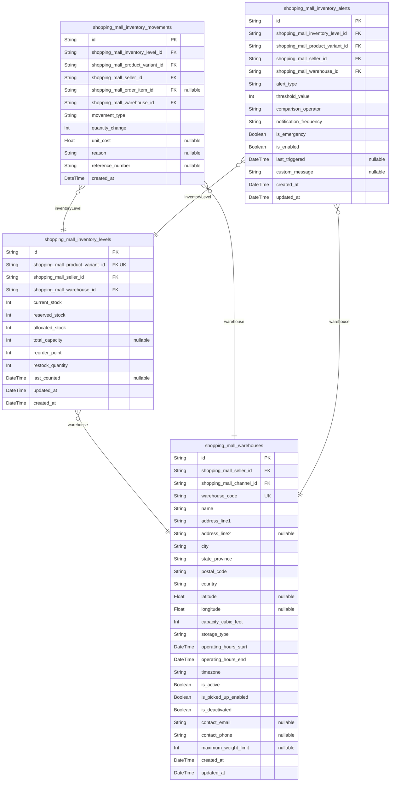

### `shopping_mall_inventory_levels`

Real-time inventory tracking for product variants across warehouse
locations.

Maintains current stock levels, reserved quantities, and availability
status for each product variant and warehouse combination. Supports
sophisticated low-stock monitoring, automatic reordering triggers, and
multi-location inventory distribution. Core component for preventing
overselling while enabling marketplace sellers to manage stock across
multiple fulfillment centers.

Links product variants to specific warehouse locations with precise
SKU-level tracking. Provides granular inventory data for demand
forecasting, stock optimization, and operational efficiency analysis
across the marketplace ecosystem.

Properties as follows:

- `id`: Primary Key.
- `shopping_mall_product_variant_id`: Related product variant's [shopping_mall_product_variants.id](#shopping_mall_product_variants)
- `shopping_mall_seller_id`: Owning seller's [shopping_mall_seller.id](#shopping_mall_seller)
- `shopping_mall_warehouse_id`: Storage location's [shopping_mall_warehouses.id](#shopping_mall_warehouses)
- `current_stock`
  > Available inventory quantity for sale. Represents actual stock level
  > minus any reserved quantities for pending orders. Must be non-negative
  > and updated in real-time.
- `reserved_stock`
  > Quantity reserved for pending orders awaiting payment confirmation.
  > Prevents overselling by temporarily holding inventory for customer
  > checkout processes.
- `allocated_stock`
  > Quantity committed to confirmed orders in processing. Represents
  > inventory that cannot be sold to other customers and is being prepared
  > for shipment.
- `total_capacity`
  > Maximum storage capacity allocated to this SKU in the warehouse. Used for
  > capacity planning and storage optimization calculations.
- `reorder_point`
  > Inventory threshold that triggers automatic low-stock alerts. When
  > current stock drops to this level, sellers are notified to replenish
  > inventory.
- `restock_quantity`
  > Recommended quantity to restock when reorder alerts are triggered. Helps
  > sellers maintain optimal inventory levels based on demand patterns.
- `last_counted`
  > Date and time of last physical inventory count. Used for inventory
  > accuracy validation and audit trail maintenance.
- `updated_at`
  > Last modification timestamp for inventory level changes. Automatically
  > updated when stock levels change due to sales, restocking, or
  > adjustments.
- `created_at`
  > Creation timestamp when inventory record was established. Permanent
  > record of when tracking began for this SKU-warehouse combination.

### `shopping_mall_inventory_movements`

Comprehensive audit trail tracking all inventory changes with detailed
attribution.

Records every inventory adjustment including sales, restocking,
transfers, returns, damages, and manual corrections. Provides complete
transaction history for inventory reconciliation, demand analysis, and
operational auditing. Critical for maintaining inventory accuracy and
detecting discrepancies across warehouse operations.

Supports sophisticated inventory analytics including turnover rates,
seasonality patterns, and demand forecasting while providing complete
accountability for all stock movements within the marketplace ecosystem.

Properties as follows:

- `id`: Primary Key.
- `shopping_mall_inventory_level_id`: Related inventory level record's [shopping_mall_inventory_levels.id](#shopping_mall_inventory_levels)
- `shopping_mall_product_variant_id`: Affected product variant's [shopping_mall_product_variants.id](#shopping_mall_product_variants)
- `shopping_mall_seller_id`: Owning seller's [shopping_mall_seller.id](#shopping_mall_seller)
- `shopping_mall_order_item_id`
  > Related order item's [shopping_mall_order_items.id](#shopping_mall_order_items) when movement
  > is due to sale
- `shopping_mall_warehouse_id`: Storage location's [shopping_mall_warehouses.id](#shopping_mall_warehouses)
- `movement_type`
  > Type of inventory adjustment. Valid values: sale, restock, return,
  > transfer, adjustment, damage, theft. Used for categorization and
  > analytics of inventory changes.
- `quantity_change`
  > Net quantity change for this movement. Positive for restocking, negative
  > for sales and removals. Captures actual inventory impact for
  > reconciliation purposes.
- `unit_cost`
  > Cost per unit for accounting purposes when applicable. Used for inventory
  > valuation and cost of goods sold calculations in financial reporting.
- `reason`
  > Detailed explanation for inventory adjustment. Required for manual
  > corrections and unusual movements to provide accountability and audit
  > trail context.
- `reference_number`
  > External reference number like purchase order or transfer document.
  > Enables linking to external systems and provides traceability for
  > inventory transactions.
- `created_at`
  > Timestamp recording when inventory movement occurred. Immutable record of
  > transaction timing for audit trails and historical analysis.

### `shopping_mall_inventory_alerts`

Automated inventory monitoring and alert system for proactive stock
management.

Manages threshold-based alerting including low-stock warnings, reorder
notifications, and overstock alerts across all warehouse locations.
Enables sellers to maintain optimal inventory levels while preventing
stockouts and minimizing carrying costs. Core component for automated
inventory management and operational efficiency.

Supports sophisticated alert logic including seasonality adjustments,
lead time considerations, and custom threshold configurations. Provides
configurable notification preferences and escalation procedures to ensure
critical inventory situations receive immediate attention from
responsible parties.

Properties as follows:

- `id`: Primary Key.
- `shopping_mall_inventory_level_id`: Related inventory level's [shopping_mall_inventory_levels.id](#shopping_mall_inventory_levels)
- `shopping_mall_product_variant_id`: Affected product variant's [shopping_mall_product_variants.id](#shopping_mall_product_variants)
- `shopping_mall_seller_id`: Owning seller's [shopping_mall_seller.id](#shopping_mall_seller)
- `shopping_mall_warehouse_id`: Storage location's [shopping_mall_warehouses.id](#shopping_mall_warehouses)
- `alert_type`
  > Category of inventory alert. Valid values: low_stock, out_of_stock,
  > overstock, slow_moving, seasonal_demand. Defines the alert purpose and
  > determines notification content and escalation procedures.
- `threshold_value`
  > Inventory level that triggers this alert. Represents stock quantity where
  > notification is generated based on alert type and comparison logic.
- `comparison_operator`
  > Mathematical comparison for alert triggering. Valid values: less_than,
  > greater_than, equals. Determines relationship between current stock and
  > threshold value.
- `notification_frequency`
  > How often to send repeated alerts for the same condition. Valid values:
  > immediate, daily, weekly, monthly, once. Prevents alert spam while
  > ensuring appropriate awareness.
- `is_emergency`
  > High-priority alert requiring immediate attention. Used for situations
  > where stock level critically impacts business operations or customer
  > service levels.
- `is_enabled`
  > Active status determining if alert should be monitored. Allows sellers to
  > disable specific alerts while maintaining configuration for future use.
- `last_triggered`
  > Timestamp when alert was most recently activated. Used for frequency
  > management and to avoid duplicate notifications for same conditions.
- `custom_message`
  > Optional personalized alert message for sellers. Allows customized
  > notification content specific to business requirements or inventory
  > situations.
- `created_at`
  > Alert configuration creation timestamp. Permanent record of when alert
  > monitoring was established for this inventory item.
- `updated_at`
  > Last modification time for alert settings. Automatically updated when
  > alert configuration changes, threshold adjustments, or status
  > modifications occur.

### `shopping_mall_warehouses`

Physical storage locations supporting inventory distribution and
fulfillment operations.

Defines warehouse properties including location, capacity, operational
parameters, and storage capabilities for marketplace sellers. Enables
distributed inventory management with geographic optimization and
capacity planning. Critical component for supporting complex
multi-location inventory operations and fulfillment efficiency.

Provides infrastructure for warehouse-specific inventory tracking,
transfer operations, and logistics coordination while maintaining
operational parameters and performance metrics for supply chain
optimization across the marketplace ecosystem.

Properties as follows:

- `id`: Primary Key.
- `shopping_mall_seller_id`: Owning seller's [shopping_mall_seller.id](#shopping_mall_seller)
- `shopping_mall_channel_id`
  > Associated sales channel's [shopping_mall_channels.id](#shopping_mall_channels) this
  > warehouse supports
- `warehouse_code`
  > Unique identifier code for warehouse operations. Alphanumeric code used
  > for internal references, shipping documentation, and operational tracking
  > across systems and processes.
- `name`
  > Descriptive name for warehouse location. Human-readable identifier used
  > for operational reference, location mapping, and staff communication
  > within the fulfillment network.
- `address_line1`
  > Primary street address for warehouse location. Specifies the building
  > location for shipping, receiving, and operational coordination with
  > carriers and suppliers.
- `address_line2`
  > Secondary address information such as suite or building number. Provides
  > additional location specificity for large facilities with multiple units
  > or sections.
- `city`
  > City name for warehouse location. Critical for shipping rate
  > calculations, delivery zone determination, and geographic service area
  > identification.
- `state_province`
  > State or province for warehouse location. Essential for tax calculations,
  > regional shipping regulations, and jurisdictional compliance
  > requirements.
- `postal_code`
  > Postal or ZIP code for warehouse location. Required for carrier services,
  > rate calculations, and geographic shipping zone determination.
- `country`
  > Country code for warehouse location. Critical for international shipping,
  > customs processing, and cross-border fulfillment operations.
- `latitude`
  > Geographic latitude coordinate for precise location mapping. Used for
  > distance calculations, delivery optimization, and geographic analytics.
- `longitude`
  > Geographic longitude coordinate for precise location mapping. Used with
  > latitude for accurate location plotting and distance-based calculations.
- `capacity_cubic_feet`
  > Total cubic volume storage capacity in feet. Used for capacity planning,
  > storage optimization, and operational metrics for facility management.
- `storage_type`
  > Primary storage methodology. Valid values: general, cold, frozen,
  > hazardous, bulk. Determines operational capabilities and compliance
  > requirements for stored inventory.
- `operating_hours_start`
  > Daily operation start time. Indicates when warehouse staff begin
  > processing operations for receiving, fulfillment, and shipping
  > activities.
- `operating_hours_end`
  > Daily operation end time. Indicates when warehouse processing operations
  > conclude for the business day affecting order cutoff times.
- `timezone`
  > Local timezone for warehouse operations. Critical for accurate
  > scheduling, cutoff times, and coordination with different time zones
  > across the supply chain.
- `is_active`
  > Operational status of warehouse location. Indicates whether the warehouse
  > is accepting inventory, fulfilling orders, and participating in
  > operations.
- `is_picked_up_enabled`
  > Customer pickup availability. Indicates whether customers can collect
  > orders directly from this warehouse location for local fulfillment
  > options.
- `is_deactivated`
  > Soft deletion flag for warehouse. Used for historical tracking while
  > removing location from active operations and assignment pools.
- `contact_email`
  > Primary contact email for warehouse operations. Used for coordination,
  > notifications, and communication regarding inventory transfers and
  > shipping operations.
- `contact_phone`
  > Primary contact phone number for warehouse operations. Used for urgent
  > coordination and real-time communication regarding operational issues.
- `maximum_weight_limit`
  > Maximum weight capacity in pounds. Used for operational planning and to
  > ensure safe storage and handling limits are not exceeded.
- `created_at`
  > Warehouse record creation timestamp. Permanent record of when warehouse
  > location was added to the fulfillment network.
- `updated_at`
  > Last modification timestamp for warehouse details. Automatically updated
  > when operational parameters or configuration settings change.
