# Prisma Markdown

> Generated by [`prisma-markdown`](https://github.com/samchon/prisma-markdown)

- [Systematic](#systematic)
- [Actors](#actors)
- [Catalog](#catalog)
- [Sales](#sales)
- [Carts](#carts)
- [Orders](#orders)
- [Payment](#payment)
- [Coins](#coins)
- [Reviews](#reviews)
- [Administration](#administration)
- [default](#default)

## Systematic

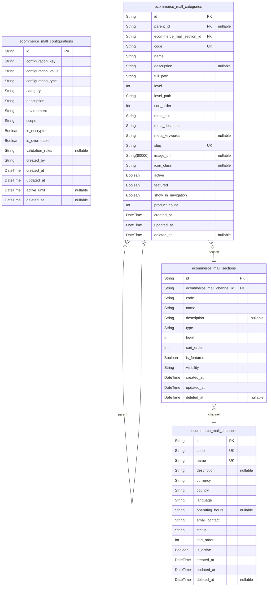

### `ecommerce_mall_channels`

Marketplace channels representing different geographic markets, partner
platforms, or specialized market segments within the e-commerce mall
platform.

Channels enable sellers to organize their presence across different
marketplaces while maintaining centralized management through the
platform.

Properties as follows:

- `id`: Primary Key.
- `code`
  > Unique channel identifier used for API references and configuration
  > settings.
- `name`
  > Display name of the marketplace channel (e.g., "North American Market",
  > "European Premium", "Fashion Outlet").
- `description`
  > Detailed description of the channel's target market, requirements, and
  > value proposition.
- `currency`
  > Primary currency used for transactions in this channel (e.g., USD, EUR,
  > GBP).
- `country`
  > Primary country or region this channel serves following ISO 3166 country
  > codes.
- `language`: Primary language used for customer-facing content in this channel.
- `operating_hours`
  > Business hours for customer service and operations in this channel,
  > formatted as time ranges.
- `email_contact`: Primary customer service email address for this channel.
- `status`
  > Current operational status of the channel (active, maintenance,
  > discontinued).
- `sort_order`
  > Numerical order for sorting channels in user interfaces and
  > administrative dashboards.
- `is_active`
  > Whether this channel is currently available for seller registration and
  > customer use.
- `created_at`: Timestamp when the marketplace channel was established.
- `updated_at`: Timestamp when the channel configuration was last modified.
- `deleted_at`: Timestamp when the channel was soft deleted or discontinued.

### `ecommerce_mall_sections`

Platform sections that organize content and seller presence within
marketplace channels.

Sections provide categorized browsing experiences and enable targeted
marketing strategies across different product categories and customer
segments within each channel.

Properties as follows:

- `id`: Primary Key.
- `ecommerce_mall_channel_id`: Channel where this section belongs to. [ecommerce_mall_channels](#ecommerce_mall_channels)
- `code`: Unique identifier for the section within the channel.
- `name`
  > Display name for platform section (e.g., Fashion, Electronics, Home &
  > Garden).
- `description`: Detailed description of the section's scope and target customer base.
- `type`
  > Section categorization type (product_category, featured, promotional,
  > seasonal).
- `level`: Hierarchical level within channel organization system.
- `sort_order`: Display order priority for section positioning in interfaces.
- `is_featured`: Whether this section is prominently displayed in channel navigation.
- `visibility`: Access control for section visibility (public, channel_only, private).
- `created_at`: When the section was established within the channel.
- `updated_at`: Most recent modification timestamp for section configuration.
- `deleted_at`: Timestamp for soft deletion or section deactivation.

### `ecommerce_mall_configurations`

System-wide configuration settings that control platform behavior,
feature flags, and operational parameters.

Configurations provide a centralized mechanism for platform
administrators to manage system-wide settings without requiring code
deployments or infrastructure changes.

Properties as follows:

- `id`: Primary Key.
- `configuration_key`
  > Unique configuration identifier used to lookup and reference settings
  > (e.g., payment.gateway.timeout, email.notification.template).
- `configuration_value`
  > Serialized configuration data stored as string supporting JSON,
  > encrypted, or plain text values for various configuration types.
- `configuration_type`
  > Data type classification for the configuration value (string, number,
  > boolean, json, encrypted).
- `category`
  > Configuration category for organization and management (payment, email,
  > security, performance, marketing).
- `description`
  > Human-readable description explaining the purpose and impact of this
  > configuration setting.
- `environment`
  > Environment scope for configuration application (development, staging,
  > production, all).
- `scope`: Configuration scope level (global, channel, seller, customer).
- `is_encrypted`
  > Whether the configuration contains sensitive information requiring
  > encryption.
- `is_overridable`
  > Whether sellers or channels can override this configuration for specific
  > cases.
- `validation_rules`
  > JSON schema or validation rules for ensuring configuration values meet
  > business requirements.
- `created_by`: Identifier of administrator who established this configuration entry.
- `created_at`: When this configuration was initially established.
- `updated_at`: Most recent timestamp for configuration modification.
- `active_until`: Optional expiration date for temporary or seasonal configuration settings.
- `deleted_at`: Timestamp for configuration soft deletion for audit trail purposes.

### `ecommerce_mall_categories`

Product category taxonomy providing hierarchical classification system
for organizing products across all marketplace channels and sections.

Categories enable consistent product discovery across multiple sellers
while supporting SEO optimization and marketing campaign targeting
through standardized classification systems.

Properties as follows:

- `id`: Primary Key.
- `parent_id`
  > Reference to parent category for hierarchical structure. {@link
  > ecommerce_mall_categories}
- `ecommerce_mall_section_id`
  > Platform section that contains this category. {@link
  > ecommerce_mall_sections}
- `code`: Unique technical identifier for category in taxonomy hierarchy.
- `name`
  > Display name for the product category following standard taxonomy
  > conventions.
- `description`
  > Comprehensive category description including product scope and typical
  > examples.
- `full_path`
  > Complete hierarchical path representing category ancestry for navigation
  > breadcrumbs.
- `level`
  > Hierarchical level within category tree structure starting from 0 for
  > root categories.
- `level_path`
  > Dot-separated string showing complete category hierarchy (e.g.,
  > 'Fashion.Clothing.Mens').
- `sort_order`
  > Numeric priority for category display order within parent or section
  > grouping.
- `meta_title`: SEO-optimized page title for category landing pages.
- `meta_description`
  > SEO meta description text for search engine optimization and social media
  > sharing.
- `meta_keywords`: Comma-separated list of SEO keywords relevant to the category.
- `slug`
  > URL-friendly category identifier for clean navigation paths and SEO
  > benefits.
- `image_url`: Primary category image URL for navigation and marketing displays.
- `icon_class`
  > CSS icon class for visual representation in navigation and category
  > browsing.
- `active`
  > Whether the category is currently available for product assignment and
  > visible to customers.
- `featured`
  > Featured status for priority placement in navigation and promotional
  > displays.
- `show_in_navigation`: Whether to display this category in primary navigation menus.
- `product_count`
  > Cached count of active products directly assigned to this specific
  > category, updated through triggers or background processes.
- `created_at`: When the category was established in the platform taxonomy.
- `updated_at`
  > Most recent modification timestamp for category properties or
  > relationships.
- `deleted_at`
  > Timestamp for category soft deletion allowing maintenance without
  > permanent data loss.

## Actors

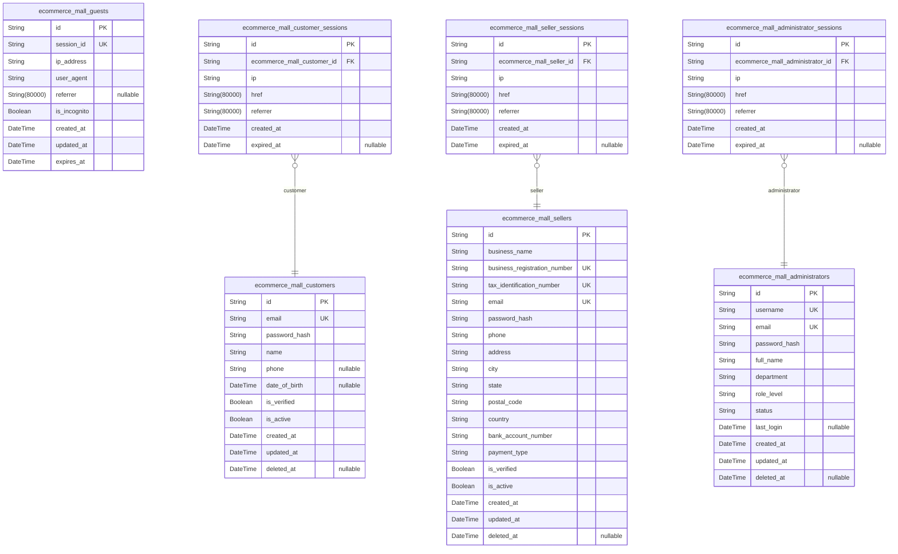

### `ecommerce_mall_customers`

Customer accounts representing registered shoppers with full platform
access including purchasing, order history, and personal profile
management capabilities.

Customers are the primary users who interact with the marketplace to
discover products, make purchases, and leave reviews. Each customer
account maintains personal information, shipping addresses, payment
methods, communication preferences, and shopping history across multiple
sellers.

The customer entity serves as the foundation for all buyer-side
functionality including cart management, wishlist operations, order
tracking, and account preferences. It integrates with payment systems,
shipping services, and loyalty programs while maintaining strict privacy
controls and data protection standards.

Properties as follows:

- `id`: Primary Key.
- `email`
  > Customer email address used for account authentication and communication.
  > Must be unique across all customer accounts and validated for safe email
  > practices.
- `password_hash`
  > Cryptographically hashed password for secure account authentication.
  > Never stores plaintext passwords, uses industry-standard hashing
  > algorithms.
- `name`
  > Customer's full name for order personalization and shipping purposes.
  > Used in all customer-facing communications and delivery addresses.
- `phone`
  > Customer's phone number for order delivery coordination and support
  > communications. Validated for format accuracy and optional field for
  > privacy preferences.
- `date_of_birth`
  > Customer's date of birth for age verification and marketing
  > personalization. Used for birthday promotions and age-restricted product
  > compliance.
- `is_verified`
  > Indicates whether the customer has verified their email address through
  > the confirmation process. Required email verification before full account
  > functionality.
- `is_active`
  > Current account status indicating whether the customer can access
  > platform features. Supports account suspension and restoration
  > functionality as needed.
- `created_at`
  > Timestamp when the customer account was first created in the system. Used
  > for account age verification and analytics tracking.
- `updated_at`
  > Timestamp of the most recent account modification including profile
  > updates, preference changes, or status modifications. Used for data
  > synchronization.
- `deleted_at`
  > Soft deletion timestamp when customer account was deactivated. Enables
  > GDPR compliance and account recovery while maintaining audit trails.

### `ecommerce_mall_sellers`

Seller accounts representing verified merchants who list and sell
products on the platform through the multi-vendor marketplace.

Sellers are business entities that provide product inventory to the
marketplace while managing their own fulfillment processes, customer
service, and marketing activities. Each seller account maintains business
information, tax details, banking details for payments, and operational
metrics.

The seller entity serves as the foundation for all merchant-side
functionality including product listing management, inventory control,
order processing, and customer communication. Sellers can customize their
store branding, set policies, configure shipping options, and access
comprehensive business analytics while adhering to platform quality
standards.

Properties as follows:

- `id`: Primary Key.
- `business_name`
  > Official registered business name for legal and financial purposes. Used
  > in contracts, tax documentation, and customer-facing store branding.
- `business_registration_number`
  > Government-issued business registration identifier for tax compliance and
  > verification. Required for legitimate business operations and regulatory
  > adherence.
- `tax_identification_number`
  > Tax identification number for revenue reporting and tax calculation.
  > Essential for payment processing and compliance with tax regulations in
  > various jurisdictions.
- `email`
  > Primary business email address for official communications and customer
  > service. Must be unique across all seller accounts and monitored for
  > uptime.
- `password_hash`
  > Cryptographically secure password hash for seller account authentication.
  > Protects privileged access to business operations and customer data.
- `phone`
  > Business phone number for order coordination and customer support.
  > Required for legitimate business communications and order fulfillment
  > coordination.
- `address`
  > Business address as registered for tax and legal purposes. Used for
  > commercial agreements and compliance verification procedures.
- `city`
  > City name where the business is registered for geographic and tax
  > purposes. Used in shipping calculations and regional compliance.
- `state`
  > State or regional designation for business location. Important for tax
  > obligations and shipping zone calculation.
- `postal_code`
  > Postal or zip code for business location verification. Essential for
  > shipping zone accuracy and tax rate determination.
- `country`
  > Country code for international business operations. Critical for currency
  > handling, tax calculations, and compliance verification.
- `bank_account_number`
  > Banking routing and account number for payment settlements. Encrypted
  > storage protects financial information with access controls.
- `payment_type`
  > Preferred settlement method for seller payments. Configures how
  > marketplace commissions and sales revenue are distributed.
- `is_verified`
  > Verification status indicating complete business information and
  > compliance review. Determines access to seller functionality and order
  > processing.
- `is_active`
  > Active status controlling seller account operation. Supports temporary
  > suspension for policy violations and restoration after remediation.
- `created_at`
  > Account creation timestamp when seller registration was completed. Used
  > for seller tenure tracking and milestone analysis.
- `updated_at`
  > Most recent seller account modification including profile updates and
  > status changes. Provides audit trail for administrative oversight.
- `deleted_at`
  > Soft deletion timestamp for account deactivation. Enables business
  > closure proceedings and account restoration for compliance auditing.

### `ecommerce_mall_administrators`

Administrator accounts representing platform staff responsible for
overseeing operations, managing users, ensuring policy compliance, and
maintaining system integrity.

Administrators are authorized personnel with elevated privileges to
perform critical platform functions including user account management,
content moderation, dispute resolution, system configuration, and
financial oversight. They maintain platform quality standards while
supporting both customers and sellers.

The administrator entity enables comprehensive platform governance
through role-based access controls, detailed audit logging, and
specialized management interfaces. Administrators ensure regulatory
compliance, handle escalated issues, and maintain operational excellence
across all platform functions.

Properties as follows:

- `id`: Primary Key.
- `username`
  > Administrative username for platform access authentication. Must be
  > unique across all admin accounts and protected with strong password
  > policies for security.
- `email`
  > Official administrative email address for system communications and
  > notifications. Critical for security alerts and operational updates
  > requiring immediate attention.
- `password_hash`
  > Secure password hash for administration access protection. Enforces
  > highest security standards given elevated system privileges.
- `full_name`
  > Complete administrative name for accountability and communication
  > purposes. Used in audit trails and system reports to track administrative
  > actions.
- `department`
  > Administrative department or functional area within platform operations.
  > Determines access scope and responsibilities in role-based access control
  > system.
- `role_level`
  > Administrator hierarchy level determining system access permissions.
  > Controls privilege escalation and limits access to sensitive business
  > functions.
- `status`
  > Current administrative account status controlling access to platform
  > management functions. Supports temporary suspension and process-based
  > admin activity.
- `last_login`
  > Most recent successful administrative login timestamp. Used for security
  > monitoring and audit trail generation for access control purposes.
- `created_at`
  > Admin account creation timestamp when administrator onboarding was
  > completed. Used for employee tenure tracking and security clearance
  > purposes.
- `updated_at`
  > Most recent administrator account modification including role changes and
  > access updates. Maintains personnel records for internal management.
- `deleted_at`
  > Administrative account deactivation timestamp for employee
  > onboarding/offboarding. Supports access revocation and compliance
  > auditing for staff changes.

### `ecommerce_mall_guests`

Guest tracking system for browsing sessions and cart management in the
platform without requiring account registration.

Guest accounts enable unauthenticated users to browse products, add items
to temporary shopping carts, and explore marketplace functionality before
committing to registration. They serve customers evaluating the platform
and provide access without privacy concerns.

The guest entity bridges unauthenticated browsing with customer
conversion by maintaining session continuity. When guests decide to
purchase, their browsing history and cart contents can be transferred to
newly created customer accounts, ensuring seamless user experience during
the conversion process.

Properties as follows:

- `id`: Primary Key.
- `session_id`
  > Browser-based session identifier for tracking guest user activity. Used
  > to maintain browsing continuity across multiple platform interactions
  > without authentication.
- `ip_address`
  > Network address identifier for guest session tracking. Used for
  > analytics, security monitoring, and geographic personalization purposes
  > while respecting privacy regulations.
- `user_agent`
  > Browser and device identifying information for platform optimization.
  > Enables responsive design adaptation and cross-device experience
  > consistency.
- `referrer`
  > Website or campaign source that directed the guest to the platform.
  > Important for marketing attribution and conversion optimization analysis.
- `is_incognito`
  > Indicates whether the guest is using private browsing mode. Affects
  > tracking capabilities and session persistence for privacy-conscious
  > users.
- `created_at`
  > Guest session creation timestamp when browsing activity was first
  > detected. Used for session duration analysis and conversion tracking.
- `updated_at`
  > Most recent guest session activity timestamp before session expiration.
  > Provides freshness testing for mobile browsing patterns and re-engagement
  > triggers.
- `expires_at`
  > Guest session termination time based on cookie and local storage
  > expiration policies. Controls memory and storage allocation while
  > supporting privacy model.

### `ecommerce_mall_customer_sessions`

Customer authentication sessions for secure platform access and activity
tracking while maintaining user login states across multiple device
sessions.

Customer sessions enable persistent login capabilities, track ongoing
activities, and maintain security through session expiration policies.
They bridge authentication events with ongoing platform usage while
supporting access from multiple devices and browsers.

The session management system ensures security through IP monitoring,
session timeout policies, and concurrent session limitations. It works
with the broader authentication framework to prevent unauthorized access
while providing seamless user experiences for legitimate customers across
mobile and web platforms.

Properties as follows:

- `id`: Primary Key.
- `ecommerce_mall_customer_id`
  > Associated customer's [ecommerce_mall_customers.id](#ecommerce_mall_customers) for session
  > verification.
- `ip`
  > Network IP address from which the customer accessed the platform. Used
  > for security monitoring and geographic-based access controls.
- `href`
  > Complete URL of the customer connection location on the platform. Records
  > entry points and navigation paths for analytics and support optimization.
- `referrer`
  > Source URL or external website that directed the customer to this
  > platform session. Important for marketing attribution and conversion
  > optimization analysis.
- `created_at`
  > Session creation timestamp when customer logged into the platform.
  > Establishes session validity period and security tracking baseline.
- `expired_at`
  > Session termination timestamp based on security policies and inactivity
  > timeouts. Controls security posture while balancing user convenience.

### `ecommerce_mall_seller_sessions`

Seller authentication sessions for secure merchant platform access and
business management dashboard functionality across multiple active
sessions.

Seller sessions enable authorized access to complex merchant tools
including product management, inventory control, order processing, and
financial reporting. They maintain privileged access while ensuring
business continuity during extended usage periods with appropriate
security controls.

The seller session system implements enhanced security measures given
elevated business privileges. It supports long-term business operations
while enforcing strict access controls, comprehensive audit logging, and
accelerated session expiration to protect merchant business data and
platform integrity.

Properties as follows:

- `id`: Primary Key.
- `ecommerce_mall_seller_id`
  > Associated seller's [ecommerce_mall_sellers.id](#ecommerce_mall_sellers) for session
  > verification.
- `ip`
  > Network IP address from which the seller accessed the merchant platform.
  > Critical for security monitoring of privileged access to business
  > systems.
- `href`
  > Complete URL of the seller connection location within the merchant
  > dashboard. Tracks administrative access patterns and business function
  > usage.
- `referrer`
  > Source URL directing the seller to the merchant platform session. Records
  > navigation from external resources and previous management activities.
- `created_at`
  > Session creation timestamp when seller authenticated to the merchant
  > platform. Establishes privileged access period and compliance tracking
  > baseline.
- `expired_at`
  > Session termination timestamp based on security policies and business
  > inactivity charging periods. Balances operational efficiency with
  > security requirements.

### `ecommerce_mall_administrator_sessions`

Administrator authentication sessions for secure platform oversight and
critical system management functions across administrative interfaces.

Administrator sessions enable privileged access to platform management
tools including user oversight, financial control, policy enforcement,
and system configuration. Given elevated privileges, these sessions
implement the highest security standards with comprehensive monitoring
and audit practices.

The administrator session system enforces stringent access controls
appropriate for privileged system operations. It prevents unauthorized
administrative access through multiple security layers including IP
verification, concurrent session limits, comprehensive audit logging, and
accelerated session expiration for enhanced platform protection.

Properties as follows:

- `id`: Primary Key.
- `ecommerce_mall_administrator_id`
  > Associated administrator's [ecommerce_mall_administrators.id](#ecommerce_mall_administrators) for
  > session verification.
- `ip`
  > Network IP address from which the administrator accessed the platform
  > management system. Essential for security logging of privileged
  > administrative access activities.
- `href`
  > Complete URL of the administrator connection location within the
  > management interface. Records platform oversight activities and
  > administrative function usage.
- `referrer`
  > Source URL serving as entry point to administrative access. Monitors
  > platform configuration access patterns and administrator workflow
  > analysis.
- `created_at`
  > Session creation timestamp when administrator authenticated to platform
  > management. Critical for audit trail and privileged access monitoring
  > compliance.
- `expired_at`
  > Session termination timestamp with accelerated expiration compared to
  > standard user sessions. Enforces heightened security for administrative
  > privileges.

## Catalog

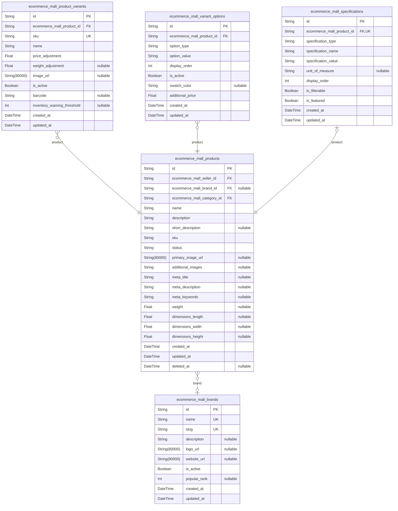

### `ecommerce_mall_products`

Core product catalog representing individual products listed by sellers
on the platform. Each product contains essential information including
name, description, images, and pricing while serving as the foundation
for variant management and inventory tracking across the multi-vendor
marketplace.

Products are the primary entities in the catalog system, enabling sellers
to present their merchandise while customers browse, search, and compare
items. The product structure supports complex variant configurations,
multiple images, SEO optimization, and comprehensive categorization for
enhanced discoverability in the multi-vendor marketplace environment.

Properties as follows:

- `id`: Primary Key.
- `ecommerce_mall_seller_id`: Seller who listed this product. [ecommerce_mall_sellers.id](#ecommerce_mall_sellers)
- `ecommerce_mall_brand_id`: Brand associated with this product. [ecommerce_mall_brands.id](#ecommerce_mall_brands)
- `ecommerce_mall_category_id`: Primary category for this product. [ecommerce_mall_categories.id](#ecommerce_mall_categories)
- `name`
  > Product name displayed to customers. Maximum 200 characters for optimal
  > display across all interfaces.
- `description`
  > Detailed product description supporting rich text formatting up to 5000
  > characters for comprehensive product information.
- `short_description`
  > Brief product summary for search results and category listings. Limited
  > to 500 characters for concise presentation.
- `sku`
  > Unique stock keeping unit identifier for this product. Alphanumeric code
  > up to 50 characters unique per seller.
- `status`
  > Product availability status: active, inactive, draft, or discontinued.
  > Controls product visibility across the platform.
- `primary_image_url`
  > URL of the primary product image used for thumbnails and search results.
  > Must be 800x800 pixels minimum resolution.
- `additional_images`
  > JSON array containing URLs of additional product images for gallery
  > display. Supports up to 20 supplementary images.
- `meta_title`
  > SEO-optimized title for search engines. Auto-generated from product name
  > if not provided, limited to 60 characters.
- `meta_description`
  > SEO meta description for search engines. Auto-generated from short
  > description if not provided, limited to 160 characters.
- `meta_keywords`
  > Comma-separated keywords for SEO optimization. Helps improve product
  > discoverability in search engines.
- `weight`
  > Product weight in kilograms for shipping calculations. Used by carriers
  > to determine shipping costs and delivery options.
- `dimensions_length`
  > Product length in centimeters for shipping and storage specifications.
  > Part of dimensional weight calculations.
- `dimensions_width`
  > Product width in centimeters for shipping and storage specifications.
  > Part of dimensional weight calculations.
- `dimensions_height`
  > Product height in centimeters for shipping and storage specifications.
  > Part of dimensional weight calculations.
- `created_at`
  > Timestamp when the product was first created in the catalog. Used for
  > audit trails and seller activity tracking.
- `updated_at`
  > Timestamp when the product information was last modified. Used for change
  > tracking and synchronization.
- `deleted_at`
  > Soft deletion timestamp. When set, the product is hidden from customer
  > view but remains in database for seller reference.

### `ecommerce_mall_product_variants`

Product variants representing different configurations of base products
such as size, color, material, or style variations. Each variant
maintains separate inventory, pricing, and SKU tracking while linking to
the parent product for unified catalog management across multiple
sellers.

Variants enable sellers to offer products with multiple options while
maintaining individual inventory tracking and pricing flexibility. The
variant system supports complex product configurations, variant-specific
imagery, and comprehensive attribute management for accurate customer
selection and fulfillment processes.

Properties as follows:

- `id`: Primary Key.
- `ecommerce_mall_product_id`: Parent product this variant belongs to. [ecommerce_mall_products.id](#ecommerce_mall_products)
- `sku`
  > Unique SKU for this specific variant combination. Alphanumeric code up to
  > 50 characters unique within product catalog.
- `name`
  > Variant name showing the specific combination (e.g., 'Medium Red
  > Cotton'). Helps customers identify the exact product configuration.
- `price_adjustment`
  > Price difference from base product price. Can be positive or negative to
  > reflect variant-specific pricing.
- `weight_adjustment`
  > Weight difference from base product weight in kilograms. Used for
  > accurate shipping cost calculations.
- `image_url`
  > URL of variant-specific image showing this exact configuration. Used when
  > variants have different visual appearances.
- `is_active`
  > Whether this variant is currently available for sale. Allows sellers to
  > temporarily disable specific configurations.
- `barcode`
  > Universal Product Code or barcode for this variant. Used for inventory
  > scanning and retail integration.
- `inventory_warning_threshold`
  > Low stock alert threshold. When inventory drops below this level, sellers
  > receive notifications to reorder.
- `created_at`
  > Timestamp when the variant was created. Used for audit trails and variant
  > management tracking.
- `updated_at`
  > Timestamp when variant information was last modified. Used for change
  > tracking and synchronization.

### `ecommerce_mall_variant_options`

Individual variant attributes defining specific characteristics like
size, color, material, or style. These options are combined to create
product variants and provide structured product configuration management
for accurate inventory tracking and customer selection across the
multi-vendor marketplace platform.

Variant options represent the building blocks of product variants,
enabling sellers to define customizable product attributes that customers
can select during the purchasing process. The option system supports
visual swatches, pricing adjustments, and display customization for
enhanced user experience and accurate order fulfillment.

Properties as follows:

- `id`: Primary Key.
- `ecommerce_mall_product_id`: Product this variant option belongs to. [ecommerce_mall_products.id](#ecommerce_mall_products)
- `option_type`
  > Type of variant option: size, color, material, style, or custom. Defines
  > the attribute category for variant configuration.
- `option_value`
  > Specific value for this option type (e.g., 'Large', 'Blue', 'Cotton').
  > The actual selectable choice customers make.
- `display_order`
  > Order for displaying this option in variant selectors. Lower numbers
  > appear first in dropdown menus and option lists.
- `is_active`
  > Whether this option is currently available. Allows sellers to temporarily
  > disable specific option values.
- `swatch_color`
  > Hex color code for color options (e.g., #FF0000 for red). Enables color
  > swatch display in variant selectors.
- `additional_price`
  > Additional cost when this option is selected. Enables option-specific
  > pricing like premium materials or sizes.
- `created_at`
  > Timestamp when the variant option was created. Used for audit trails and
  > option management tracking.
- `updated_at`
  > Timestamp when variant option was last modified. Used for change tracking
  > and synchronization.

### `ecommerce_mall_brands`

Product brands enabling customers to filter and discover products by
manufacturer or brand name within the multi-vendor marketplace platform.
Brands provide essential product categorization and help customers
identify products from trusted manufacturers while supporting brand
loyalty and repeat purchasing patterns across diverse seller catalogs.

The brand system supports comprehensive brand management including logo
display, official website linking, popularity ranking, and SEO
optimization features. Brands serve as a key navigation and filtering
mechanism enabling customers to browse products by trusted manufacturers
while providing sellers with brand association opportunities for enhanced
product discoverability and customer confidence.

Properties as follows:

- `id`: Primary Key.
- `name`
  > Brand name displayed to customers. Must be unique across the platform and
  > clearly identifiable (e.g., 'Apple', 'Nike', 'Samsung').
- `slug`
  > URL-friendly version of brand name for SEO optimization. Automatically
  > generated from name with special characters removed.
- `description`
  > Brand description and background information. Helps customers understand
  > brand heritage and product positioning.
- `logo_url`
  > URL of brand logo image. Displayed in brand filters and product pages to
  > enhance brand recognition.
- `website_url`
  > Official brand website URL. Enables customers to access manufacturer
  > information and verification.
- `is_active`
  > Whether the brand is currently available for product assignment. Allows
  > platform to hide discontinued brands.
- `popular_rank`
  > Brand popularity ranking for sorting in filters. Higher ranks appear
  > first in brand selection lists.
- `created_at`
  > Timestamp when the brand was added to platform. Used for audit trails and
  > brand management tracking.
- `updated_at`
  > Timestamp when brand information was last modified. Used for change
  > tracking and synchronization.

### `ecommerce_mall_specifications`

Technical product specifications providing structured product details for
informed customer decision-making within the multi-vendor marketplace
platform. Specifications enable standardized product comparison across
different sellers and brands while supporting detailed filtering and
search capabilities for enhanced product discovery and selection
processes.

The specification system provides comprehensive technical attribute
management including performance metrics, physical dimensions, material
properties, and custom specifications relevant to specific product
categories. Specifications serve as essential product differentiators
enabling customers to make informed purchasing decisions while supporting
advanced filtering and comparison functionality across diverse product
catalogs.

Properties as follows:

- `id`: Primary Key.
- `ecommerce_mall_product_id`: Product these specifications belong to. [ecommerce_mall_products.id](#ecommerce_mall_products)
- `specification_type`
  > Type of specification: technical, physical, performance, or custom.
  > Defines the specification category for organized display.
- `specification_name`
  > Name of the specification (e.g., 'Weight', 'Dimensions', 'Battery Life').
  > Clear label for customer understanding.
- `specification_value`
  > Value of the specification (e.g., '2.5 kg', '15.6 inches', '8 hours').
  > The actual technical detail being specified.
- `unit_of_measure`
  > Unit of measurement for the specification value (e.g., 'kg', 'inches',
  > 'hours'). Provides context for numerical values.
- `display_order`
  > Order for displaying this specification on product pages. Lower numbers
  > appear first in specification lists.
- `is_filterable`
  > Whether this specification can be used for filtering products. Enables
  > faceted search and comparison features.
- `is_featured`
  > Whether this specification should be prominently displayed. Featured
  > specs appear in product summaries and quick views.
- `created_at`
  > Timestamp when the specification was created. Used for audit trails and
  > specification management tracking.
- `updated_at`
  > Timestamp when specification was last modified. Used for change tracking
  > and synchronization.

## Sales

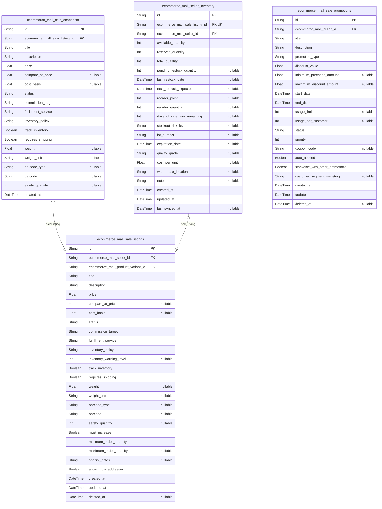

### `ecommerce_mall_sale_listings`

Seller-specific product listings that represent active sales offers in
the marketplace.

These listings connect sellers to individual products or product
variants, establishing the commercial relationship between merchants and
their inventory. Each sale listing represents a specific seller's
offering of a product with their unique pricing, inventory levels, and
business policies.

The listing system enables sellers to maintain separate business
relationships with the same underlying products, supporting competitive
dynamics and market segmentation strategies. Sale listings track the
complete lifecycle from creation through archival, providing audit trails
for business analysis and seller performance evaluation.

Sale listings serve as the primary interface between sellers and the
marketplace, containing all seller-specific business logic including
pricing strategies, inventory management, and promotional activities. The
system supports both active and paused listing states, allowing sellers
to manage their market presence while maintaining historical records.

Properties as follows:

- `id`: Primary Key.
- `ecommerce_mall_seller_id`: The seller's {\@link ecommerce_mall_sellers.id} who owns this listing.
- `ecommerce_mall_product_variant_id`
  > The product variant's {\@link ecommerce_mall_product_variants.id} being
  > listed for sale.
- `title`
  > Seller-specific title for the listing, which may differ from the base
  > product title to highlight key selling points or promotional messaging.
- `description`
  > Seller's detailed description of the listing, including unique selling
  > propositions, warranty information, or special service offerings not
  > covered in the base product description.
- `price`
  > Seller's offering price for this product variant, which may differ from
  > manufacturer suggested retail pricing and reflects the seller's specific
  > pricing strategy.
- `compare_at_price`
  > Optional comparison price showing the original or competitor price,
  > enabling sellers to demonstrate discount value or market competitiveness.
- `cost_basis`
  > Seller's internal cost basis for profitability analysis and margin
  > calculations, used for business intelligence and performance reporting.
- `status`
  > Current status of the sale listing indicating whether it's active,
  > paused, or disabled with business rules governing transitions between
  > states.
- `commission_target`
  > Target percentage used for calculating platform commissions on this
  > listing, which may vary by category or seller agreement.
- `fulfillment_service`
  > Service used for order fulfillment, indicating whether the seller manages
  > fulfillment directly or uses third-party logistics services.
- `inventory_policy`
  > Policy governing inventory tracking for this listing, supporting options
  > for continuous tracking, manual updates, or no inventory management.
- `inventory_warning_level`
  > Threshold at which the seller receives low inventory alerts, enabling
  > proactive restocking and preventing stockout situations.
- `track_inventory`
  > Whether to actively track inventory levels for this listing, supporting
  > sellers who manage their own inventory outside the platform.
- `requires_shipping`
  > Whether this listing requires physical shipping, distinguishing between
  > digital and physical products with different fulfillment workflows.
- `weight`
  > Product weight in relevant units used for shipping cost calculations and
  > carrier rate determinations.
- `weight_unit`
  > Unit of measurement for weight values (kg, g, lb, oz) ensuring consistent
  > shipping calculations across different measurement systems.
- `barcode_type`
  > Type of barcode used for this product variant (UPC, EAN, ISBN, etc.)
  > enabling inventory scanning and product identification systems.
- `barcode`
  > Barcode number for this specific product variant used in inventory
  > management and point-of-sale integration across retail channels.
- `safety_quantity`
  > Quantity of inventory reserved for security stock, preventing the sale
  > listing from showing inventory below this threshold to maintain service
  > levels.
- `must_increase`
  > Whether inventory must increase before sale when drops below minimum
  > threshold, ensuring sellers don't commit to sales with insufficient
  > stock.
- `minimum_order_quantity`
  > Minimum quantity of this product that customers can order, supporting
  > bulk sales requirements and inventory management strategies.
- `maximum_order_quantity`
  > Maximum quantity limits per customer order, helping sellers control
  > inventory exposure and manage large purchase requests appropriately.
- `special_notes`
  > Special business rules or notes regarding this listing that sellers
  > communicate to the platform, supporting unique requirements or
  > constraints.
- `allow_multi_addresses`
  > Whether customers can specify multiple shipping addresses for this
  > listing, supporting gift purchases and splitting order fulfillment.
- `created_at`
  > Timestamp when the listing was created, establishing the audit trail for
  > seller activity tracking and business analysis.
- `updated_at`
  > Timestamp when the listing was last modified, tracking change evolution
  > and version control for seller business logic.
- `deleted_at`
  > Timestamp when the listing was deactivated or removed, supporting soft
  > deletion for audit trail maintenance and historical analysis.

### `ecommerce_mall_sale_snapshots`

Historical snapshots capturing the state of sale listings at specific
points in time for audit trails and business intelligence.

This snapshot system maintains comprehensive records of seller listing
changes over time, providing essential audit trails for business
analysis, seller performance evaluation, and historical data
preservation. The snapshot architecture enables tracking of pricing
changes, inventory adjustments, policy modifications, and other listing
lifecycle events.

Sale snapshots serve multiple critical business functions including trend
analysis for market research, seller performance monitoring for
commission calculations, dispute resolution support with historical
evidence, and marketing analytics for promotional effectiveness
measurement. The system captures complete listing states ensuring no
information is lost during business process evolution.

The snapshots preserve data integrity and support regulatory compliance
requirements while providing rich datasets for machine learning
algorithms and business intelligence reporting. This historical
documentation is essential for understanding market dynamics, seller
behavior patterns, and platform ecosystem performance.

Properties as follows:

- `id`: Primary Key.
- `ecommerce_mall_sale_listing_id`
  > The sale listing's {\@link ecommerce_mall_sale_listings.id} being
  > captured in this historical snapshot.
- `title`
  > Snapshot of the listing title at the time of capture, preserving the
  > seller's specific marketing messaging and promotional positioning.
- `description`
  > Historical record of the listing description, maintaining seller
  > rationale, warranty terms, and service offerings as they existed at
  > snapshot time.
- `price`
  > Preserved price value at time of snapshot, essential for commission
  > calculations, dispute resolution, and business analysis of seller pricing
  > strategies.
- `compare_at_price`
  > Historical comparison price used for discount calculations, showing
  > market positioning and promotional value messaging during the snapshot
  > period.
- `cost_basis`
  > Cost basis information as it existed at snapshot time, supporting
  > business intelligence analysis and seller profitability tracking across
  > time periods.
- `status`
  > Listing status at time of snapshot, documenting the business state
  > including active, paused, or disabled conditions during specific
  > historical periods.
- `commission_target`
  > Commission percentage snapshot for accurate historical business
  > calculation and regulatory compliance documentation across fiscal
  > periods.
- `fulfillment_service`
  > Historical fulfillment service configuration showing how sellers managed
  > order processing during specific periods, supporting business model
  > evolution tracking.
- `inventory_policy`
  > Inventory tracking policy as configured at snapshot time, documenting
  > seller operational preferences and supporting business process evolution
  > analysis.
- `track_inventory`
  > Historical inventory tracking configuration showing whether sellers
  > actively monitored inventory during the snapshot period for business
  > trend analysis.
- `requires_shipping`
  > Physical shipping requirement snapshot showing seller business model
  > classification during specific periods, supporting operational analysis.
- `weight`
  > Product weight information as it existed historically, supporting
  > business analysis of shipping cost changes and operational evolution.
- `weight_unit`
  > Weight measurement unit snapshot maintaining consistency in historical
  > analysis and supporting evolution of measurement standards over time.
- `barcode_type`
  > Barcode configuration snapshot showing product code standards and retail
  > integration requirements during specific historical periods.
- `barcode`
  > Product barcode value preserved historically for audit trail maintenance
  > and regulatory compliance documentation requirements.
- `safety_quantity`
  > Historical safety stock configuration showing inventory management
  > strategies during specific periods for business analysis purposes.
- `created_at`
  > Timestamp when the snapshot was created, establishing the historical
  > record point and enabling chronological analysis of seller business
  > evolution.

### `ecommerce_mall_seller_inventory`

Seller-specific inventory tracking system maintaining real-time stock
levels and availability status for individual sale listings.

This inventory system provides sellers with comprehensive tools for
managing their stock levels across different products and variants while
maintaining accurate availability information for customers. The system
supports various inventory policies including continuous tracking, manual
updates, and no-inventory management modes based on seller business
models.

The inventory tracking enables accurate order processing by preventing
overselling while providing sellers with tools for stock management, low
inventory alerts, and business intelligence reporting. The system
integrates with the broader marketplace infrastructure to maintain
real-time availability across all customer-facing interfaces.

Seller inventory maintains detailed historical records of stock movements
supporting audit trails for dispute resolution, business analysis for
performance optimization, and reporting for financial reconciliation. The
system accommodates different seller operational models including those
managing inventory externally and those requiring comprehensive tracking
capabilities.

Properties as follows:

- `id`: Primary Key.
- `ecommerce_mall_sale_listing_id`
  > The sale listing's {\@link ecommerce_mall_sale_listings.id} that this
  > inventory record supports.
- `ecommerce_mall_seller_id`: The seller's {\@link ecommerce_mall_sellers.id} who owns this inventory.
- `available_quantity`
  > Current available inventory quantity for customer purchase, representing
  > the immediately saleable stock levels.
- `reserved_quantity`
  > Quantity reserved for pending orders that have not yet completed
  > fulfillment, preventing overselling while maintaining accurate
  > availability information.
- `total_quantity`
  > Total inventory quantity including available, reserved, and other stock
  > categories, providing comprehensive view of seller inventory holdings.
- `pending_restock_quantity`
  > Quantity scheduled for restocking or currently in transit to seller,
  > enabling accurate future stock projections and customer availability
  > expectations.
- `last_restock_date`
  > Timestamp of most recent inventory restocking activity, supporting
  > business analysis of inventory turnover and supply chain efficiency
  > metrics.
- `next_restock_expected`
  > Expected delivery date for pending inventory orders, enabling customer
  > communication about restock timelines and supporting seller planning.
- `reorder_point`
  > Inventory level that triggers automatic reorder alerts to sellers,
  > preventing stockouts through proactive inventory management.
- `reorder_quantity`
  > Recommended restocking quantity when reorder alerts are triggered,
  > supporting sellers inventory planning and reducing restocking decision
  > complexity.
- `days_of_inventory_remaining`
  > Calculated estimated days until inventory depletion based on current
  > sales velocity, enabling proactive inventory management.
- `stockout_risk_level`
  > Calculated risk assessment categorizing inventory levels as low, medium,
  > or high risk, supporting seller decision-making and platform
  > recommendations.
- `lot_number`
  > Batch identifier for products requiring tracking for regulatory
  > compliance or quality control, ensuring traceability requirements.
- `expiration_date`
  > Product expiration date for perishable inventory, enabling proper stock
  > rotation and expiration-based removal from availability.
- `quality_grade`
  > Quality classification of inventory such as new, refurbished, or damaged,
  > enabling accurate product condition representation for customers.
- `cost_per_unit`
  > Cost basis per unit for seller financial tracking and profit margin
  > calculations.
- `warehouse_location`
  > Physical warehouse identifier where inventory is maintained, supporting
  > multi-location seller operations.
- `notes`
  > Additional notes regarding inventory status or management for seller
  > reference and operational documentation.
- `created_at`
  > Timestamp when the inventory record was established, creating audit trail
  > for inventory management system.
- `updated_at`
  > Timestamp when the inventory record was last modified, tracking all
  > changes for audit purposes.
- `last_synced_at`
  > Timestamp of most recent synchronization with external inventory systems,
  > ensuring data accuracy.

### `ecommerce_mall_sale_promotions`

Promotional campaigns and special offers managed by sellers to increase
sales performance and customer engagement.

The promotion system enables sellers to create sophisticated marketing
campaigns including percentage discounts, fixed amount reductions, bulk
purchase incentives, and time-limited offers. These promotional tools
support sellers in driving sales velocity, inventory clearance, and
competitive positioning within the marketplace.

Promotions integrate seamlessly with the broader sales ecosystem,
automatically adjusting listing prices while tracking promotional
effectiveness through conversion analytics. The system accommodates
various promotional strategies from simple percentage discounts to
complex multi-tier discount structures.

The promotion management tools provide sellers with comprehensive
campaign control including scheduling, customer targeting, and
performance measurement capabilities. The system maintains historical
records supporting business intelligence analysis and seller performance
evaluation.

Properties as follows:

- `id`: Primary Key.
- `ecommerce_mall_seller_id`
  > The seller's {\@link ecommerce_mall_sellers.id} who created this
  > promotion.
- `title`
  > Promotional campaign title displayed to customers, summarizing the offer
  > terms and creating compelling marketing messaging.
- `description`
  > Detailed promotional description explaining offer terms, eligibility, and
  > customer benefits.
- `promotion_type`
  > Type of promotional discount applied including percentage, fixed amount,
  > or quantity-based offers.
- `discount_value`
  > Numerical discount amount according to promotion type, representing
  > customer savings provided.
- `minimum_purchase_amount`
  > Minimum order value required to qualify for the promotion, enabling
  > sellers to control profitability.
- `maximum_discount_amount`
  > Maximum discount cap regardless of promotion type, allowing sellers to
  > limit liability.
- `start_date`: Date and time when the promotion becomes available to customers.
- `end_date`: Date and time when the promotion expires stopping customer eligibility.
- `usage_limit`: Total number of times the promotion can be used across all customers.
- `usage_per_customer`: Maximum number of times individual customers can redeem the promotion.
- `status`
  > Current promotional campaign status including active, paused, or
  > scheduled states.
- `priority`: Display priority ranking for promotions when multiple offers are active.
- `coupon_code`: Optional promotional code customers enter to activate the discount.
- `auto_applied`: Whether the promotion automatically applies to eligible purchases.
- `stackable_with_other_promotions`: Whether this promotion can combine with other active promotions.
- `customer_segment_targeting`
  > Specific customer segments eligible for the promotion including new or
  > repeat customers.
- `created_at`: Timestamp when the promotion was created for audit trail.
- `updated_at`: Timestamp when the promotion was last modified.
- `deleted_at`: Timestamp when the promotion was deactivated.

## Carts

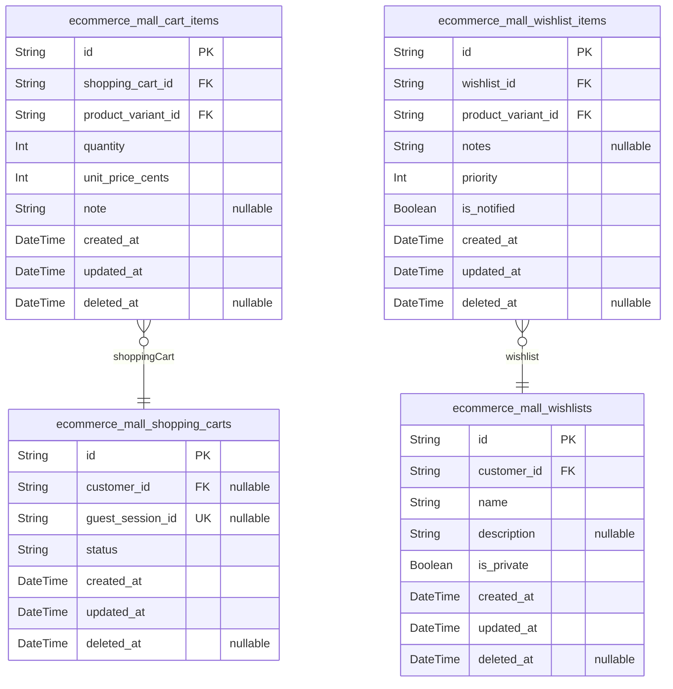

### `ecommerce_mall_shopping_carts`

Shopping cart management for customers and authenticated users.

Manages temporary product collections that users save for potential
future purchases. Handles cart persistence across sessions and supports
both guest and authenticated user scenarios. Each cart represents a
unique collection of items that users can modify before converting to an
order.

Carts maintain inventory reservations while items are actively in the
cart, preventing overselling during the shopping process. The system
tracks cart abandonment patterns and provides analytics for business
intelligence purposes.

Properties as follows:

- `id`: Primary Key.
- `customer_id`
  > Belonged customer's [ecommerce_mall_customers.id](#ecommerce_mall_customers). Required for
  > authenticated user carts.
- `guest_session_id`: Guest session identifier for anonymous shopping cart tracking.
- `status`
  > Current cart status indicating state (active, abandoned, converted).
  > Allows cart lifecycle tracking and business analytics.
- `created_at`
  > Timestamp when cart was first created. Enables cart age tracking and
  > abandonment analysis.
- `updated_at`
  > Last modification timestamp. Tracks when cart contents were last changed
  > for performance optimization.
- `deleted_at`
  > Soft deletion timestamp for inactive carts. Used for data retention
  > policies and analytics.

### `ecommerce_mall_cart_items`

Individual product items within shopping carts.

Represents specific products and quantities that users have added to
their shopping carts. Links to product variants for accurate inventory
and pricing tracking. Enables detailed item-level management including
quantity updates and option selection.

Each cart item maintains the exact variant selected by the user, ensuring
accurate order fulfillment when carts convert to orders. The system
tracks item-level modifications to maintain audit trails and support
business analytics.

Properties as follows:

- `id`: Primary Key.
- `shopping_cart_id`
  > Belonged shopping cart's [ecommerce_mall_shopping_carts.id](#ecommerce_mall_shopping_carts). Links
  > items to their parent cart.
- `product_variant_id`
  > Selected product variant's [ecommerce_mall_product_variants.id](#ecommerce_mall_product_variants).
  > Stores exact product variation chosen by customer.
- `quantity`
  > Number of units of this product variant in the cart. Stores customer
  > selected quantity for order fulfillment.
- `unit_price_cents`
  > Price per unit in cents at time of cart creation. Maintains historical
  > pricing for business analytics.
- `note`
  > Optional customer notes or special instructions for this cart item.
  > Enables customer communication about specific product requirements.
- `created_at`
  > Timestamp when item was added to cart. Enables cart item analysis and
  > historical tracking.
- `updated_at`
  > Last modification timestamp for this cart item. Tracks when quantities or
  > notes were changed.
- `deleted_at`
  > Soft deletion timestamp for removed cart items. Supports cart analytics
  > and recovery processes.

### `ecommerce_mall_wishlists`

User wishlist management for saving favorite products.

Provides persistent storage for products that users are interested in but
haven't purchased yet. Supports multiple wishlists allowing organization
by occasion, category, or personal preference. Enables price monitoring
and notification features for wishlisted items.

Wishlists serve as a valuable data source for personalized product
recommendations and targeted marketing campaigns. The system tracks
wishlist engagement patterns to improve product discovery and user
experience.

Properties as follows:

- `id`: Primary Key.
- `customer_id`
  > Owner customer's [ecommerce_mall_customers.id](#ecommerce_mall_customers). Required for
  > authenticated user wishlists and pricing notifications.
- `name`
  > User-defined wishlist name for organization and identification. Enables
  > multiple wishlists per customer with descriptive titles.
- `description`
  > Optional detailed description or purpose of the wishlist. Allows
  > customers to organize gift lists or specific collection categories.
- `is_private`
  > Privacy setting controlling wishlist visibility and sharing. Enables
  > public wishlist sharing for gift requests.
- `created_at`
  > Wishlist creation timestamp. Enables tracking of wishlist age and
  > engagement analysis.
- `updated_at`
  > Last modification timestamp. Tracks when wishlist contents or settings
  > were last changed.
- `deleted_at`
  > Soft deletion timestamp for removed wishlists. Supports analytics and
  > data retention policies.

### `ecommerce_mall_wishlist_items`

Individual products saved in user wishlists.

Represents specific products that users have saved to their wishlists for
future consideration or purchase. Links to product variants ensuring
accurate product and pricing information. Enables wishlist organization
and sharing functionality.

Each wishlist item captures the exact product variation that the user is
interested in, supporting price tracking and notification features. The
system monitors wishlist item engagement and performs analytics for
product popularity insights.

Properties as follows:

- `id`: Primary Key.
- `wishlist_id`
  > Parent wishlist's [ecommerce_mall_wishlists.id](#ecommerce_mall_wishlists). Links items to
  > their containing wishlist organization.
- `product_variant_id`
  > Selected product variant's [ecommerce_mall_product_variants.id](#ecommerce_mall_product_variants).
  > Stores exact product variation the user wishes to save.
- `notes`
  > Optional customer notes about why this product is desired. Provides
  > context for gift lists and personal preference tracking.
- `priority`
  > User-assigned priority level (1-5) indicating desire level. Higher
  > numbers indicate greater purchase intent.
- `is_notified`
  > Flag indicating if user has been notified of price changes. Prevents
  > duplicate price drop notifications.
- `created_at`
  > Timestamp when item was added to wishlist. Enables wishlist age tracking
  > and engagement analysis.
- `updated_at`
  > Last modification timestamp. Tracks when notes or priority were last
  > modified.
- `deleted_at`
  > Soft deletion timestamp for removed wishlist items. Supports analytics
  > and organization maintenance.

## Orders

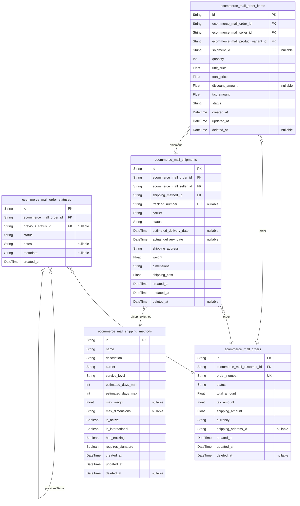

### `ecommerce_mall_orders`

Master order records representing complete customer purchase transactions.

Acts as the central hub for order processing, coordinating multi-seller
purchases through unified order management while maintaining separate
seller fulfillment workflows. Each order may contain products from
multiple sellers, with consolidated customer experience and individual
seller operations.

Properties as follows:

- `id`: Primary Key.
- `ecommerce_mall_customer_id`: Customer who placed the order. [ecommerce_mall_customers.id](#ecommerce_mall_customers)
- `order_number`
  > Unique order identifier displayed to customers. Generated sequence number
  > for easy customer reference.
- `status`
  > Current order status. Values: pending, confirmed, processing, shipped,
  > delivered, cancelled, refunded.
- `total_amount`: Total order amount including all products, taxes, and shipping costs.
- `tax_amount`: Calculated tax amount based on shipping address and applicable tax rates.
- `shipping_amount`: Total shipping costs across all sellers in this order.
- `currency`
  > Currency code for this order (e.g., USD, EUR). Supports multi-currency
  > operations.
- `shipping_address_id`
  > Shipping address identifier for this order. May be null for digital
  > products or in-store pickup.
- `created_at`: Order creation timestamp when customer submitted the order.
- `updated_at`: Last modification timestamp for order state changes.
- `deleted_at`
  > Soft deletion timestamp for cancelled or test orders preserving audit
  > trail.

### `ecommerce_mall_order_items`

Individual line items within orders connecting products to specific
sellers and quantities.

Represents the granular level of order processing where multi-seller
coordination occurs. Each item references specific products, sellers,
pricing, and fulfillment details enabling independent seller operations
within unified customer orders.

Properties as follows:

- `id`: Primary Key.
- `ecommerce_mall_order_id`: Parent order containing this item. [ecommerce_mall_orders.id](#ecommerce_mall_orders)
- `ecommerce_mall_seller_id`: Seller who fulfills this item. Enables multi-seller order management.
- `ecommerce_mall_product_variant_id`: Specific product variant being ordered. Links to product catalog.
- `shipment_id`: Associated shipment for this item. May be null until item is shipped.
- `quantity`: Number of units ordered for this item.
- `unit_price`
  > Price per unit at time of order. Preserves historical pricing for this
  > transaction.
- `total_price`: Total price for this item (quantity × unit_price).
- `discount_amount`: Discount amount applied to this item from promotions or coupons.
- `tax_amount`: Calculated tax amount for this specific item based on seller location.
- `status`
  > Item-specific status for multi-seller fulfillment. Values: pending,
  > allocated, shipped, delivered, returned.
- `created_at`: Item creation timestamp when added to order.
- `updated_at`: Last modification timestamp for item status changes.
- `deleted_at`: Soft deletion timestamp for cancelled items preserving audit trail.

### `ecommerce_mall_order_statuses`

Historical record of order status transitions for complete audit trail.

Tracks all order status changes throughout the fulfillment lifecycle,
providing transparency for customers, sellers, and platform
administrators. Each status change includes contextual information
supporting business intelligence and dispute resolution.

Properties as follows:

- `id`: Primary Key.
- `ecommerce_mall_order_id`: Order whose status is being tracked. [ecommerce_mall_orders.id](#ecommerce_mall_orders)
- `previous_status_id`
  > Previous order status for transition tracking. Null for initial status
  > entries.
- `status`
  > Order status at this point in time. Values: pending, confirmed,
  > processing, shipped, delivered, cancelled, refunded.
- `notes`
  > Optional notes about this status change including reasons or context
  > information.
- `metadata`: Additional status metadata in JSON format for flexible data storage.
- `created_at`: Status change timestamp when transition occurred.

### `ecommerce_mall_shipments`

Shipment tracking records for physical product delivery coordination.

Manages the complex logistics of multi-seller order fulfillment, tracking
individual shipments from sellers to customers. Each shipment represents
a discrete delivery tracking the physical movement of products from
fulfillment location to customer delivery.

Properties as follows:

- `id`: Primary Key.
- `ecommerce_mall_order_id`: Order associated with this shipment. Links shipments to customer orders.
- `ecommerce_mall_seller_id`: Seller responsible for this shipment. Enables multi-seller fulfillment.
- `shipping_method_id`
  > Shipping method selected for this delivery. {@link
  > ecommerce_mall_shipping_methods.id}
- `tracking_number`
  > Carrier tracking number for shipment visibility. May be empty for
  > pre-shipment states.
- `carrier`
  > Shipping carrier company (e.g., FedEx, UPS, USPS, DHL). Supports multiple
  > carrier integrations.
- `status`
  > Current shipment status. Values: pre_shipment, in_transit,
  > out_for_delivery, delivered, failed, returned.
- `estimated_delivery_date`: Estimated delivery date from carrier or seller calculation.
- `actual_delivery_date`: Actual delivery confirmation timestamp when marked as delivered.
- `shipping_address`: Complete shipping address for this delivery supporting split shipments.
- `weight`
  > Shipment weight in pounds or kilograms for accurate shipping cost
  > calculation.
- `dimensions`: Package dimensions in format 'L×W×H' for shipping calculations.
- `shipping_cost`: Actual shipping cost charged by carrier for this shipment.
- `created_at`: Shipment creation timestamp when seller prepared items.
- `updated_at`: Last update timestamp for shipment status changes.
- `deleted_at`: Soft deletion timestamp for cancelled shipments preserving audit trail.

### `ecommerce_mall_shipping_methods`

Available shipping method configurations across different carriers and
services.

Defines the shipping options available to sellers for order fulfillment,
including service levels, pricing structures, and delivery timeframes.
Enables flexible shipping strategies while maintaining consistent
customer experiences across the multi-seller platform.

Properties as follows:

- `id`: Primary Key.
- `name`
  > Shipping method name displayed to sellers and customers (e.g., Standard
  > Shipping, Express Delivery).
- `description`
  > Detailed description of shipping method including features and
  > restrictions.
- `carrier`: Primary carrier company providing this shipping method.
- `service_level`: Service category: standard, expedited, express, overnight, international.
- `estimated_days_min`: Minimum estimated delivery days for this shipping method.
- `estimated_days_max`: Maximum estimated delivery days for this shipping method.
- `max_weight`: Maximum weight limit in pounds for this shipping method.
- `max_dimensions`: Maximum package dimensions in format 'L×W×H' for this shipping method.
- `is_active`: Whether this shipping method is currently available for selection.
- `is_international`: Whether this shipping method supports international destinations.
- `has_tracking`: Whether this shipping method provides tracking information.
- `requires_signature`: Whether this shipping method requires recipient signature upon delivery.
- `created_at`: Creation timestamp when shipping method was configured.
- `updated_at`: Last update timestamp for configuration changes.
- `deleted_at`: Soft deletion timestamp for deprecated shipping methods.

## Payment

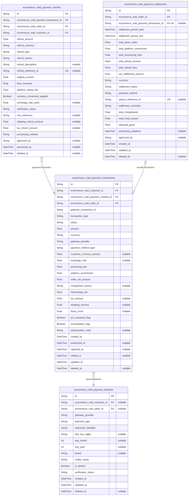

### `ecommerce_mall_payment_methods`

Secure storage of payment method tokens and payment gateway
configurations supporting multiple payment types including credit cards,
digital wallets, and bank transfers while maintaining PCI compliance
through tokenization techniques.

Payment methods represent the actual payment instruments customers use
during checkout, stored as secure tokens rather than sensitive data to
comply with financial industry standards and protect against data
breaches.

Properties as follows:

- `id`: Primary Key.
- `ecommerce_mall_customer_id`
  > Customer's [ecommerce_mall_customers.id](#ecommerce_mall_customers) who owns this payment
  > method.
- `ecommerce_mall_seller_id`
  > Seller's [ecommerce_mall_sellers.id](#ecommerce_mall_sellers) who owns this payment method
  > for receiving funds.
- `gateway_provider`
  > Payment gateway provider name (e.g., 'stripe', 'paypal', 'square').
  > Required for routing payment processing requests to appropriate provider
  > APIs.
- `payment_type`
  > Type of payment method: 'credit_card', 'debit_card', 'digital_wallet',
  > 'bank_transfer', or 'crypto'. Determines processing flows and compliance
  > requirements.
- `tokenized_identifier`
  > Secure token representing payment method, never stores actual card
  > numbers or sensitive data. PCI compliant token used for charging and
  > refund operations.
- `last_four_digits`
  > Last four digits of card number or account for customer recognition.
  > Stored for payment method identification purposes only.
- `exp_month`
  > Expiration month (1-12) for card-based payment methods. Used for card
  > validation and expiration checking.
- `exp_year`
  > Expiration year for card-based payment methods. Used for card validation
  > and expiration checking.
- `brand`
  > Card brand or payment network identifier (e.g., 'Visa', 'Mastercard',
  > 'PayPal'). Displayed for customer convenience and payment verification.
- `holder_name`
  > Name of payment method holder as it appears on card or account. Used for
  > payment verification and customer recognition.
- `is_default`
  > Indicates if this is the customer's default payment method for one-click
  > checkout. Used to pre-select payment methods during subsequent purchases.
- `verification_status`
  > Verification status: 'pending', 'verified', 'failed', or 'expired'.
  > Tracks payment method validation and compatibility with different
  > transaction types.
- `created_at`: Timestamp when the payment method was added to customer account.
- `updated_at`: Timestamp when payment method details were last updated.
- `deleted_at`: Soft deletion timestamp when payment method is removed from account.

### `ecommerce_mall_payment_transactions`

Comprehensive record of all financial transactions processed through the
platform including payment authorizations, captures, failures, and status
transitions supporting PCI compliance auditing and multi-seller
settlement tracking.

Transaction records serve as the definitive audit trail for all monetary
activities while providing settlement breakdowns for multi-seller orders,
chargeback tracking, and financial reporting across the entire platform.
Contains enhanced indexing strategy for high-frequency query patterns and
settlement processing workflows.

Properties as follows:

- `id`: Primary Key.
- `ecommerce_mall_customer_id`: Customer's [ecommerce_mall_customers.id](#ecommerce_mall_customers) who initiated the payment.
- `ecommerce_mall_payment_method_id`
  > Payment method's [ecommerce_mall_payment_methods.id](#ecommerce_mall_payment_methods) used for this
  > transaction.
- `ecommerce_mall_order_id`
  > Order's [ecommerce_mall_orders.id](#ecommerce_mall_orders) this payment transaction relates
  > to.
- `gateway_transaction_id`
  > Payment gateway's transaction ID for cross-reference with payment
  > processor records. Critical for external payment system integration.
- `transaction_type`
  > Transaction type: 'authorization', 'capture', 'refund', 'partial_refund',
  > 'void', or 'chargeback. Drives processing workflows and affects seller
  > settlement calculations.
- `status`
  > Transaction status: 'pending', 'authorized', 'captured', 'failed',
  > 'refunded', 'partially_refunded', or 'charged_back. Tracks payment
  > lifecycle for compliance reporting.
- `amount`
  > Transaction amount in USD to two decimal places. Total payment amount
  > including all seller portions before commissions and fees are calculated.
- `currency`
  > Currency code for transaction (e.g., 'USD', 'EUR', 'GBP'). Enables
  > international transaction processing and foreign exchange calculations.
- `gateway_provider`
  > Payment gateway processor that handled this transaction (e.g., 'stripe',
  > 'paypal', 'square'). Used for audit trail and integration validation.
- `payment_method_type`
  > Payment method used (credit_card, debit_card, digital_wallet,
  > bank_transfer). Maps to the original payment method configuration for
  > processing reference.
- `customer_currency_amount`
  > Amount in customer's original payment currency for international
  > transactions. Enables accurate currency conversion tracking and customer
  > receipt generation.
- `exchange_rate`
  > Exchange rate applied if currency conversion occurred during processing.
  > Critical for multi-currency settlement and accounting reconciliation.
- `processing_fee`
  > Payment processing fee charged by the gateway provider. Deducted from
  > seller settlement amounts for accurate financial tracking.
- `platform_commission`
  > Platform commission percentage applied to this transaction for revenue
  > calculations.
- `seller_net_amount`
  > Net amount sellers receive after platform commission and processing fees
  > are deducted. Critical for multi-seller settlement calculations.
- `chargeback_reason`
  > Reason provided when transaction is marked as charged_back. Used for
  > dispute analysis and seller notification purposes.
- `interchange_fee`
  > Credit card interchange fee charged by payment network. Included in
  > processing fee breakdown for transparent financial reporting.
- `tax_amount`
  > Sales tax amount collected in the transaction. Separated for proper tax
  > reporting and compliance requirements.
- `shipping_amount`
  > Shipping cost portion of the total transaction amount. Tracked separately
  > for seller-specific settlement allocations.
- `fraud_score`
  > Fraud detection score (0.0-1.0) indicating transaction risk level. Higher
  > scores indicate greater fraud risk for investigation purposes.
- `pci_compliant_flag`
  > Indicates if transaction processing maintained PCI compliance standards
  > throughout the payment lifecycle. Critical for regulatory audit trails.
- `reconciliation_flag`
  > Marks transaction as reconciled with payment gateway records for
  > financial audit purposes. Enables settlement verification and dispute
  > resolution.
- `authorization_code`
  > Payment authorization code returned by gateway provider for successful
  > transactions. Required for capture operations and dispute resolution.
- `created_at`: Timestamp when transaction was initiated and submitted for processing.
- `authorized_at`
  > Timestamp when transaction was successfully authorized by payment
  > gateway. Critical for authorization expiry calculations.
- `captured_at`
  > Timestamp when transaction funds were captured and transferred to
  > platform account. Essential for settlement timing calculations.
- `settled_at`
  > Timestamp when transaction was included in seller settlement calculation
  > for fund disbursement.
- `updated_at`
  > Timestamp when transaction status was last updated due to lifecycle
  > changes.
- `deleted_at`
  > Soft deletion timestamp for audit trail purposes and PCI compliance
  > record retention.

### `ecommerce_mall_payment_refunds`

Records of all refund transactions processed through the platform
supporting partial refunds, full refunds, return merchandise
authorization flows while maintaining compliance audit trails and seller
settlement reconciliation.

Refund records provide complete audit trails for financial corrections
including reason tracking, approval workflows, and impact on original
transactions while supporting customer service operations and dispute
resolution processes.

Properties as follows:

- `id`: Primary Key.
- `ecommerce_mall_payment_transaction_id`
  > Original payment transaction's {@link
  > ecommerce_mall_payment_transactions.id} that is being refunded.
- `ecommerce_mall_order_id`
  > Order's [ecommerce_mall_orders.id](#ecommerce_mall_orders) associated with the refund
  > transaction for comprehensive audit tracking.
- `ecommerce_mall_customer_id`
  > Customer's [ecommerce_mall_customers.id](#ecommerce_mall_customers) receiving the refund for
  > payment-tracking purposes.
- `refund_amount`
  > Amount being refunded in USD. Must be less than or equal to the original
  > transaction amount minus any previous partial refunds issued.
- `refund_currency`
  > Currency code for the refund transaction, typically matching original
  > payment currency. Enables cross-border refund processing and currency
  > conversion tracking.
- `refund_type`
  > Refund type: 'full_refund', 'partial_refund', 'product_refund', or
  > 'service_refund. Determines processing logic and affects seller
  > settlement calculations.
- `refund_reason`
  > Reason for refund: 'customer_cancellation', 'product_defect',
  > 'wrong_item_sent', 'delivery_issue', 'quality_issue', 'seller_initiated',
  > or 'other'. Used for customer service analytics and quality improvement.
- `refund_description`
  > Detailed explanation of refund circumstances for customer service
  > records. Supports dispute resolution and quality improvement initiatives.
- `refund_reference_id`
  > External payment gateway's refund reference ID for reconciliation with
  > payment processor systems. Critical for tracking refund processing and
  > dispute resolution.
- `original_amount`
  > Original transaction amount before any refund was processed. Used for
  > refund validation and percentage calculation tracking.
- `fees_reversed`
  > Processing fees that were reversed during refund calculation. Shows the
  > true financial impact on sellers and platform revenue.
- `platform_refund_fee`
  > Platform fee withheld from the refund amount to cover operational costs.
  > Maintains platform revenue sustainability during refund processes.
- `currency_conversion_applied`
  > Indicates if currency conversion occurred due to rate changes between
  > original payment and refund processing dates. Affects refund amount
  > calculation.
- `exchange_rate_used`
  > Exchange rate applied if currency conversion was necessary during refund
  > processing. Critical for international transaction reconciliation.
- `verification_status`
  > Refund verification status: 'pending', 'approved', 'rejected', or
  > 'completed'. Controls refund processing workflow and seller notification
  > timing.
- `rma_reference`
  > Return Merchandise Authorization reference number if return process
  > initiated the refund. Links refund to return authorization for complete
  > audit trail.
- `shipping_refund_amount`
  > Portion of refund allocated to shipping costs if applicable. Enables
  > proportional refund calculations for orders containing multiple
  > components.
- `tax_refund_amount`
  > Sales tax portion refunded to customer for compliance reporting and
  > seller reconciliation purposes.
- `processing_method`
  > Method used for refund processing: 'automatic' or 'manual'. Manual
  > refunds require administrative approval while automatic follow predefined
  > rules.
- `approved_by`
  > Administrator ID who approved manual refunds or 'system' for automatic
  > processing. Provides audit trail for review processes.
- `processed_at`
  > Timestamp when refund was processed and funds were transferred back to
  > customer's payment method.
- `deleted_at`: Soft deletion timestamp for audit trail and refund history maintenance.

### `ecommerce_mall_payment_settlements`

Comprehensive record of seller settlement transactions tracking fund
disbursements, commission calculations, and payment gateway
reconciliation enabling accurate financial reporting and payout
management to multiple sellers across the platform.

Settlement records provide the definitive audit trail for fund
distribution to sellers while handling complex scenarios including split
settlements, multi-currency transactions, and delayed settlement
programs. The settlement process ensures sellers receive net proceeds
after platform commissions and fees are deducted.

Properties as follows:

- `id`: Primary Key.
- `ecommerce_mall_seller_id`
  > Seller's [ecommerce_mall_sellers.id](#ecommerce_mall_sellers) receiving this settlement
  > payment for all eligible transactions within the settlement period.
- `ecommerce_mall_payment_transaction_id`
  > Reference to a sample primary {@link
  > ecommerce_mall_payment_transactions.id} within this settlement group for
  > audit purposes. Actual settlement covers multiple transactions during the
  > period.
- `settlement_period_start`
  > Beginning of the settlement period covered by this payout. Typically
  > covers daily, weekly, or monthly transaction aggregation periods based on
  > seller agreement.
- `settlement_period_end`
  > End of the settlement period covered by this payout. Marks the cutoff
  > date for transactions included in this settlement calculation.
- `total_gross_sales`
  > Total gross sales amount for the settlement period before any deductions
  > including product prices, shipping, and taxes across all included
  > transactions.
- `total_platform_commission`
  > Total platform commission deducted from gross sales during the settlement
  > period. Calculated per seller agreement and varies by product category
  > and volume thresholds.
- `total_processing_fees`
  > Sum of all payment processing fees charged by gateway providers during
  > the settlement period. Includes interchange fees, gateway charges, and
  > per-transaction costs.
- `total_refund_amount`
  > Total amount of refunds issued during the settlement period that reduce
  > the net payout. Includes both full and partial refunds affecting seller
  > revenue.
- `total_refund_fees`
  > Processing fees associated with refund transactions during the settlement
  > period. Refund processing often incurs separate fees that reduce seller
  > net proceeds.
- `net_settlement_amount`
  > Final amount to be paid to the seller after all deductions: gross sales
  > minus commissions minus processing fees minus refund amounts.
- `currency`
  > Currency code for the settlement (USD, EUR, GBP, etc.). Enables
  > multi-currency payout processing and currency-specific financial
  > reporting.
- `settlement_status`
  > Settlement status: 'calculated', 'approved', 'scheduled', 'processed',
  > 'failed', or 'cancelled'. Controls the payout workflow and identifies
  > settlement timing for seller funds.
- `payment_method`
  > Payout method for this settlement: 'bank_transfer', 'digital_wallet',
  > 'check', or 'crypto'. Determines how funds are disbursed to the seller
  > according to their preferred options.
- `payout_reference_id`
  > External payout provider's reference ID for reconciliation between
  > platform settlement records and actual fund transfers. Critical for
  > financial audit trails.
- `settlement_schedule`
  > Schedule type: 'daily', 'weekly', 'bi-weekly', or 'monthly' indicating
  > the frequency of settlement calculations based on seller agreement terms.
- `total_chargebacks`
  > Total amount of chargebacks included in this settlement period affecting
  > seller net proceeds. Chargebacks represent disputed transactions that
  > reduce settlement amounts.
- `total_fraud_losses`
  > Transaction amounts lost to fraud during the settlement period that are
  > deducted from seller proceeds for comprehensive financial reporting.
- `adjusted_gross`
  > Final gross amount after accounting for refunds, chargebacks, and
  > adjustments. Represents the actual revenue base for commission
  > calculations.
- `processing_datetime`
  > Timestamp when settlement was calculated and prepared for payout
  > distribution. Critical for audit trail and fund disbursement timing.
- `approved_by`
  > Administrator ID who approved the settlement for processing to ensure
  > financial controls and approval workflows are maintained.
- `created_at`
  > Timestamp when settlement record was created and added to the payout
  > queue for processing.
- `updated_at`
  > Timestamp when settlement status or calculation details were last updated
  > during the payout workflow.
- `deleted_at`
  > Soft deletion timestamp for settlement audit trail and financial record
  > maintenance during regulatory compliance reviews.

## Coins

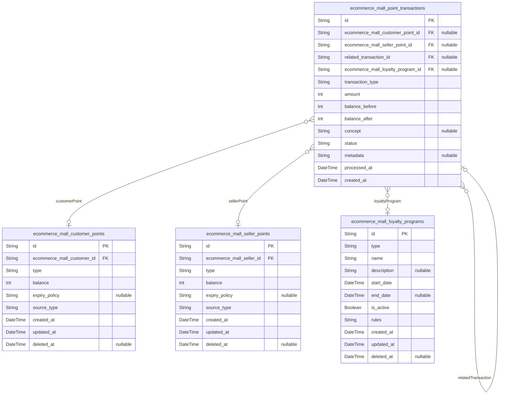

### `ecommerce_mall_customer_points`

Customer loyalty point balances and digital coin balances representing
earned rewards, promotional credits, and greenlight currencies managed
within the platform's loyalty ecosystem. These points operate as
platform-specific financial instruments separate from actual payment
transactions and provide customers with transaction capacity, rewards,
and promotional benefits throughout their shopping experience.

Properties as follows:

- `id`: Primary Key.
- `ecommerce_mall_customer_id`
  > Customer's [ecommerce_mall_customers.id](#ecommerce_mall_customers) who owns these loyalty
  > points.
- `type`
  > Type of customer points including standard loyalty points, promotional
  > coins, referral credits, campaign rewards, and bonus currencies that
  > customers earn through various platform activities and engagement
  > behaviors.
- `balance`
  > Current point balance representing available spendable points for the
  > customer. Positive values indicate available points for redemption while
  > zeros or negative values show depleted or utilized point reserves for
  > loyalty program participation.
- `expiry_policy`
  > Expiry policy governing point validity including rolling expiration,
  > fixed term expiration, lifetime validity, and campaign-specific
  > expiration rules that determine point availability duration and
  > redemption windows.
- `source_type`
  > Source or acquisition method including earn by shopping, referral
  > rewards, promotional credits, level-based bonuses, and administrative
  > allocations that show how citizens obtained their point balances through
  > platform engagement activities.
- `created_at`: Record creation timestamp.
- `updated_at`: Record update timestamp.
- `deleted_at`: Soft deletion timestamp for audit trail maintenance.

### `ecommerce_mall_seller_points`

Seller loyalty point balances and digital coin reserves representing
merchant incentives, performance rewards, promotional credits, and
platform engagement rewards earned through successful seller activities.
These points provide merchants with transaction capacity reductions,
platform fee discounts, and promotional opportunities within the loyalty
ecosystem.

Properties as follows:

- `id`: Primary Key.
- `ecommerce_mall_seller_id`: Seller's [ecommerce_mall_sellers.id](#ecommerce_mall_sellers) who owns these loyalty points.
- `type`
  > Type of seller points including performance bonuses, fee reduction
  > credits, promotional escrows, loyalty rewards, and achievement-based
  > incentives that sellers earn through platform activities and business
  > performance metrics.
- `balance`
  > Current point balance representing available spendable points for the
  > seller. These points can be used for fee reductions, promotional campaign
  > funding, commission discounts, and other merchant-specific loyalty
  > program benefits.
- `expiry_policy`
  > Expiry policy governing point validity including seasonal expiration,
  > performance-based expiry, campaign-specific timing, and rolling validity
  > windows that determine merchant point availability duration for business
  > utilization.
- `source_type`
  > Source or acquisition method including sales performance, customer
  > satisfaction bonuses, promotional campaign participation, and
  > administrative allocations that demonstrate how merchants earned their
  > loyalty point balances.
- `created_at`: Record creation timestamp.
- `updated_at`: Record update timestamp.
- `deleted_at`: Soft deletion timestamp for audit trail maintenance.

### `ecommerce_mall_point_transactions`

Comprehensive ledger recording all point movements, redemption
activities, and balance changes within the digital coin loyalty
ecosystem. This transaction history provides complete audit trails for
point earning, spending, expiration, transfer, and redemption activities
while supporting financial reporting and compliance requirements for the
loyalty management system. Transactions are operational records
supporting active business processes rather than purely historical
snapshots.

Properties as follows:

- `id`: Primary Key.
- `ecommerce_mall_customer_point_id`
  > Related customer point balance's {@link
  > ecommerce_mall_customer_points.id} for customer-side transactions when
  > available.
- `ecommerce_mall_seller_point_id`
  > Related seller point balance's [ecommerce_mall_seller_points.id](#ecommerce_mall_seller_points)
  > for seller-side transactions when available.
- `related_transaction_id`
  > Reference to a related transaction within the same system for linking
  > multiple point movements or redemption chains.
- `ecommerce_mall_loyalty_program_id`
  > Related loyalty program's [ecommerce_mall_loyalty_programs.id](#ecommerce_mall_loyalty_programs) when
  > transaction occurs within loyalty campaign context.
- `transaction_type`
  > Type of point transaction including earn by purchase, redemption for
  > discounts, transfers between accounts, expiry processing, adjustment
  > corrections, and promotional allocation showing the specific point
  > movement activity within the loyalty ecosystem.
- `amount`
  > Positive amount for point additions or negative amount for reductions
  > within the transactions. This field represents the net point change
  > impact on involved point balances and supports both credit and debit
  > transaction types.
- `balance_before`
  > Point balance before this transaction execution showing the account state
  > snapshot prior to current point movement for audit trail accuracy and
  > balance verification.
- `balance_after`
  > Point balance after transaction completion showing the resulting account
  > state following execution of current point movement verification
  > calculations accuracy.
- `concept`
  > Detailed description or reason for the point transaction including
  > purchase references, redemption details, expiration explanations,
  > campaign names, and adjustment justifications that explain transaction
  > business context comprehensively.
- `status`
  > Transaction processing status including pending verification, completed
  > successfully, failed validation, reversed cancellation, and expired
  > processing showing the current state of point movement within processing
  > workflows.
- `metadata`
  > JSON metadata containing additional transaction context including related
  > order IDs, campaign details, expiration dates, reward tiers, promotional
  > criteria, and other relevant transaction attributes supporting complex
  > loyalty program implementations.
- `processed_at`
  > Transaction processing timestamp when the point movement was actually
  > executed and point balance was updated.
- `created_at`: Record creation timestamp for audit trail maintenance.

### `ecommerce_mall_loyalty_programs`

Loyalty program campaigns and promotional drives that govern how points
are earned, spent, and managed within the platform's digital currency
ecosystem. These programs define earning rules, redemption mechanics,
qualification criteria, and campaign-specific policies that orchestrate
point distribution and utilization across customer and seller accounts
throughout promotional periods.

Properties as follows:

- `id`: Primary Key.
- `type`
  > Program type including earning campaigns, redemption drives, promotional
  > events, seasonal programs, and tier-based loyalty initiatives that define
  > specific operational mechanics for how points are distributed and
  > utilized within the ecosystem.
- `name`
  > Descriptive program name showing the loyalty campaign or promotional
  > drive identity for customer and seller recognition throughout platform
  > engagement activities.
- `description`
  > Detailed description explaining program objectives, benefits,
  > qualification requirements, earning mechanics, redemption methods, and
  > campaign duration specifics that help participants understand program
  > value and participation requirements.
- `start_date`
  > Program activation date when loyalty campaign begins accepting
  > participations and point earning activities.
- `end_date`
  > Program conclusion date when loyalty campaign ceases accepting new
  > participations and point earning activities.
- `is_active`
  > Whether the loyalty program is currently active and accepting new
  > participations for point earning and redemption activities.
- `rules`
  > JSON configuration containing detailed program rules including earning
  > rates per transaction, minimum spend thresholds, category restrictions,
  > redemption multipliers, bonus conditions, and qualification criteria
  > defining operational mechanics.
- `created_at`: Record creation timestamp.
- `updated_at`: Record update timestamp.
- `deleted_at`: Soft deletion timestamp for campaign archive management.

## Reviews

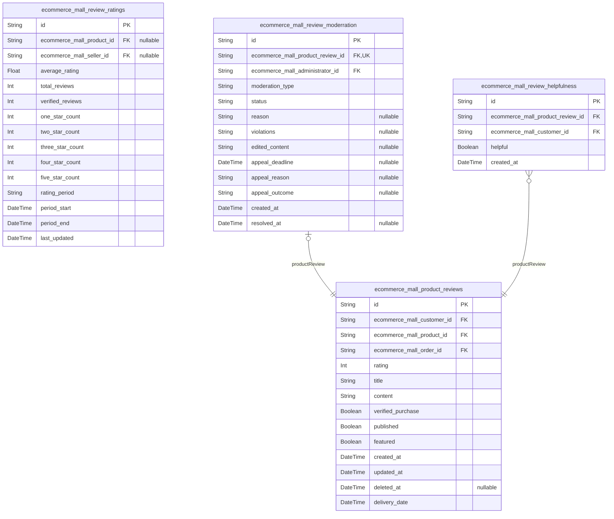

### `ecommerce_mall_product_reviews`

Customer product reviews providing social proof and feedback across the
marketplace platform.

This table stores authentic customer reviews for purchased products,
enabling prospective buyers to make informed decisions while providing
sellers with valuable feedback about their offerings. Each review
captures customer satisfaction through ratings, detailed feedback, and
optional media content.

Reviews undergo automated screening before publication and maintain
transparency through verification badges. The system supports review
updates and comprehensive moderation workflows to ensure content quality
and authenticity.

Properties as follows:

- `id`: Primary Key.
- `ecommerce_mall_customer_id`: Customer who wrote the review. [ecommerce_mall_customers.id](#ecommerce_mall_customers)
- `ecommerce_mall_product_id`: Product being reviewed. [ecommerce_mall_products.id](#ecommerce_mall_products)
- `ecommerce_mall_order_id`: Order containing the purchased product. [ecommerce_mall_orders.id](#ecommerce_mall_orders)
- `rating`: Product rating from 1-5 stars indicating overall satisfaction level.
- `title`: Brief review title summarizing the customer's experience with the product.
- `content`
  > Detailed review text describing the customer's experience with the
  > product.
- `verified_purchase`: Indicates whether this review is from a verified purchaser of the product.
- `published`
  > Publication status indicating whether the review is visible to other
  > customers.
- `featured`
  > Whether this review is featured prominently on the product page for
  > marketing.
- `created_at`: Timestamp when the customer first submitted this review.
- `updated_at`: Timestamp when the customer last updated the review content.
- `deleted_at`: Soft deletion timestamp for removed reviews maintaining audit trail.
- `delivery_date`: Date when the customer's order was delivered before writing the review.

### `ecommerce_mall_review_ratings`

Product rating aggregation statistics for performance optimization and
analytics reporting across the platform.

This table maintains calculated rating statistics for products, sellers,
and platform-wide performance metrics. It provides efficient access to
rating summaries without requiring complex queries across individual
reviews, supporting real-time display of rating information and trend
analysis.

Properties as follows:

- `id`: Primary Key.
- `ecommerce_mall_product_id`
  > Product associated with these rating statistics. {@link
  > ecommerce_mall_products.id}
- `ecommerce_mall_seller_id`
  > Seller associated with these rating statistics. {@link
  > ecommerce_mall_sellers.id}
- `average_rating`
  > Calculated average rating (1-5) from all associated reviews for the
  > period.
- `total_reviews`: Total number of review contributions for the rated entity.
- `verified_reviews`: Number of reviews from verified purchasers of the product or seller.
- `one_star_count`: Number of 1-star reviews contributing to the average calculation.
- `two_star_count`: Number of 2-star reviews contributing to the average calculation.
- `three_star_count`: Number of 3-star reviews contributing to the average calculation.
- `four_star_count`: Number of 4-star reviews contributing to the average calculation.
- `five_star_count`: Number of 5-star reviews contributing to the average calculation.
- `rating_period`: Time period for these statistics - daily, weekly, monthly, or all_time.
- `period_start`: Start date and time for this rating period.
- `period_end`: End date and time for this rating period.
- `last_updated`
  > Last timestamp when these statistics were recalculated from source
  > reviews.

### `ecommerce_mall_review_moderration`

Review moderation workflow system for content quality assurance and
policy compliance across the platform marketplace.

This table tracks review moderation activities including automated
content screening, manual review processes, and administrative
interventions to maintain content quality standards. The system supports
moderator decisions, appeal processes, and maintains comprehensive audit
trails for all moderation activities.

Properties as follows:

- `id`: Primary Key.
- `ecommerce_mall_product_review_id`: Product review being moderated. [ecommerce_mall_product_reviews.id](#ecommerce_mall_product_reviews)
- `ecommerce_mall_administrator_id`
  > Administrator who performed the moderation action. {@link
  > ecommerce_mall_administrators.id}
- `moderation_type`
  > Type of moderation - automated_screening, manual_review, or
  > customer_appeal.
- `status`
  > Current moderation status - pending, approved, approved_with_edits,
  > rejected.
- `reason`
  > Detailed explanation of moderation decision and any policy violations
  > found.
- `violations`: Specific policy violations identified during the moderation process.
- `edited_content`: Modified review content when approved with content edits for compliance.
- `appeal_deadline`: Deadline for submitting appeals to moderation decisions, typically 7 days.
- `appeal_reason`: Reason provided by reviewer when appealing a moderation decision.
- `appeal_outcome`: Final outcome of the appeal process - approved, denied, or reversed.
- `created_at`: Timestamp when the moderation process was initiated for the review.
- `resolved_at`: Timestamp when the moderation decision was finalized and applied.

### `ecommerce_mall_review_helpfulness`

Community-driven helpfulness voting system enabling customers to rate
review usefulness and improve content quality across the platform.

This table captures customer votes on review helpfulness, providing
social proof indicators that enhance review quality visibility. The
system aggregates vote counts in real-time and flags reviews for
additional moderation when consistently rated as unhelpful by the
community.

Properties as follows:

- `id`: Primary Key.
- `ecommerce_mall_product_review_id`
  > Product review being evaluated for helpfulness. {@link
  > ecommerce_mall_product_reviews.id}
- `ecommerce_mall_customer_id`
  > Customer who submitted this helpfulness vote. {@link
  > ecommerce_mall_customers.id}
- `helpful`
  > Whether the customer found this review helpful for their purchase
  > decision.
- `created_at`
  > Timestamp when the customer submitted their helpfulness vote on the
  > review.

## Administration

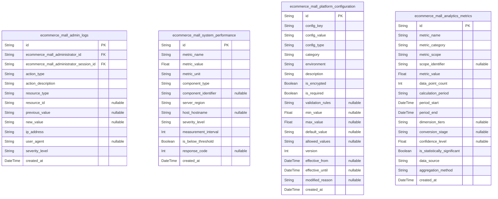

### `ecommerce_mall_admin_logs`

Comprehensive audit trail capturing all administrative actions and system
operations performed by platform administrators.

Maintains detailed records of administrator activities including user
management, configuration changes, order interventions, and system
operations. Each log entry includes complete context about the action
performed, timing, authorization level, and affected resources.

Supports regulatory compliance requirements, security monitoring,
operational troubleshooting, and administrative accountability tracking
across the platform ecosystem.

Properties as follows:

- `id`: Primary Key.
- `ecommerce_mall_administrator_id`
  > Administrator who performed the logged action. {@link
  > ecommerce_mall_administrators.id}
- `ecommerce_mall_administrator_session_id`
  > Administrative session during which the action occurred. {@link
  > ecommerce_mall_administrator_sessions.id}
- `action_type`
  > Category of administrative action performed (user_management,
  > order_intervention, configuration_change, content_moderation,
  > system_operation).
- `action_description`: Detailed description of the specific action taken by the administrator.
- `resource_type`
  > Type of system resource affected by the action (user_account,
  > product_listing, order, payment, configuration).
- `resource_id`
  > Unique identifier of the specific resource affected by the administrative
  > action.
- `previous_value`
  > Value or state of the resource before the administrative change, used for
  > audit trail comparison.
- `new_value`
  > Value or state of the resource after the administrative change,
  > documenting the modification.
- `ip_address`
  > IP address from which the administrative action was performed for
  > security tracking.
- `user_agent`
  > User agent string identifying the browser or client application used for
  > the action.
- `severity_level`
  > Severity classification of the action (info, warning, error, critical)
  > for alert prioritization.
- `created_at`: Timestamp when the administrative action was performed and logged.

### `ecommerce_mall_system_performance`

Comprehensive performance monitoring system capturing real-time system
health metrics and operational statistics.

Tracks critical performance indicators including response times, error
rates, resource utilization, and system availability across all platform
components. Provides administrators with visibility into system health
trends and performance optimization opportunities.

Supports proactive system management, capacity planning, performance
troubleshooting, and SLA compliance monitoring. Maintains historical
performance data for trend analysis and predictive maintenance
scheduling.

Properties as follows:

- `id`: Primary Key.
- `metric_name`
  > Name of the performance metric being tracked (response_time, cpu_usage,
  > memory_usage, disk_io, network_throughput).
- `metric_value`: Numerical value of the performance metric at the time of measurement.
- `metric_unit`
  > Unit of measurement for the metric (milliseconds, percent,
  > bytes_per_second, requests_per_second).
- `component_type`
  > System component generating the metric (database, web_server, cache,
  > api_gateway, order_processor).
- `component_identifier`
  > Specific identifier for the component instance (server_name,
  > database_instance, service_name).
- `server_region`
  > Geographic region where the performance metric was captured for
  > distributed system analysis.
- `host_hostname`
  > Hostname or identifier of the server where the metric was recorded for
  > infrastructure tracking.
- `severity_level`
  > Severity classification based on metric value (normal, warning, critical)
  > for alerting purposes.
- `measurement_interval`
  > Time interval in seconds over which the metric value was measured for
  > rate calculations.
- `is_below_threshold`
  > Flag indicating whether the metric value is below acceptable performance
  > thresholds.
- `response_code`
  > HTTP response code or system error code associated with the performance
  > measurement.
- `created_at`: Timestamp when the performance metric was recorded.

### `ecommerce_mall_platform_configuration`

Comprehensive configuration management system storing platform-wide
settings and business operation parameters.

Maintains all system configuration values covering payment gateways,
shipping providers, tax calculations, email settings, feature flags, and
business rules. Supports multi-environment configuration management with
audit trails for configuration changes.

Enables flexible business rule implementation without code deployment,
supports A/B testing configurations, maintains rollback capabilities for
configuration changes. Provides secure storage for sensitive
configuration values while maintaining clear audit trails.

Properties as follows:

- `id`: Primary Key.
- `config_key`
  > Unique identifier for the configuration setting (domain-specific key
  > name).
- `config_value`
  > Value of the configuration setting (can represent strings, numbers, JSON,
  > or other data types).
- `config_type`
  > Data type of the configuration value (string, number, boolean, json, url,
  > email, array).
- `category`
  > Functional category grouping settings (payment, shipping, email, tax,
  > features, seo, notifications).
- `environment`
  > Target environment for the configuration (development, staging,
  > production).
- `description`
  > Clear description of the configuration purpose and expected outcomes when
  > modified.
- `is_encrypted`
  > Flag indicating whether the configuration value requires encryption for
  > sensitive data protection.
- `is_required`
  > Flag indicating whether this configuration is mandatory for basic
  > platform operation.
- `validation_rules`
  > JSON string containing validation rules that configuration values must
  > satisfy.
- `min_value`
  > Minimum allowable numeric value for number-type configurations or length
  > for string types.
- `max_value`
  > Maximum allowable numeric value for number-type configurations or length
  > for string types.
- `default_value`
  > Default value to use when no configuration value is currently set for the
  > specific key.
- `allowed_values`
  > JSON array of allowed values for configuration settings with predefined
  > value options.
- `version`
  > Version number tracking configuration changes for audit trail and
  > rollback capabilities.
- `effective_from`
  > Date/time when this configuration setting becomes active (NULL means
  > immediately active).
- `effective_until`
  > Date/time when this configuration setting expires (NULL means no
  > expiration).
- `modified_reason`
  > Explanation of why the configuration was changed for documentation and
  > audit purposes.
- `created_at`: Timestamp when this configuration version was created and stored.

### `ecommerce_mall_analytics_metrics`

Comprehensive analytics data warehouse storing platform performance
metrics and business intelligence data.

Collects detailed analytics about sales performance, user behavior,
traffic patterns, conversion rates, and operational efficiency.
Aggregates data from all platform components for executive reporting and
strategic decision making.

Provides trend analysis capabilities, supports complex business
intelligence queries, and enables predictive analytics through historical
data analysis. Maintains data granularity while providing efficient
aggregate storage.

Properties as follows:

- `id`: Primary Key.
- `metric_name`
  > Analytics metric identifier (sales_volume, conversion_rate,
  > customer_acquisition_cost, average_order_value, traffic_volume,
  > cart_abandonment_rate).
- `metric_category`
  > Business category classification (sales, marketing, operations,
  > financials, traffic, user_experience).
- `metric_scope`
  > Scope level of the metric (platform_wide, channel_specific,
  > seller_specific, product_category, geographic_region).
- `scope_identifier`
  > Specific entity identifier when scope is narrower than platform wide
  > (seller_id, channel_id, category_id, region_id).
- `metric_value`
  > Numerical value of the analytics metric being measured (sum, average,
  > rate, count depending on metric type).
- `data_point_count`
  > Number of individual data points aggregated to produce this metric value
  > for statistical accuracy.
- `calculation_period`
  > Time period over which the metric value was calculated (daily, weekly,
  > monthly, quarterly, annually).
- `period_start`: Start date/time of the calculation period for metric timestamp accuracy.
- `period_end`
  > End date/time of the calculation period defining metric measurement
  > boundaries.
- `dimension_tiers`
  > JSON string containing dimensional breakdowns (device_type,
  > traffic_source, customer_segment, geographic_region).
- `conversion_stage`
  > Stage in conversion funnel being measured (awareness, consideration,
  > purchase, retention, advocacy).
- `confidence_level`
  > Statistical confidence level (0-1) indicating metric reliability for
  > decision-making accuracy.
- `is_statistically_significant`
  > Flag indicating whether the metric value meets statistical significance
  > thresholds.
- `data_source`
  > Source system that provided the data for calculation (order_system,
  > traffic_analytics, payment_gateway, crm_system).
- `aggregation_method`
  > Statistical method used to aggregate data (sum, average, median,
  > percentile, count, unique_count).
- `created_at`
  > Timestamp when the analytics metric was calculated and stored in the data
  > warehouse.

## default

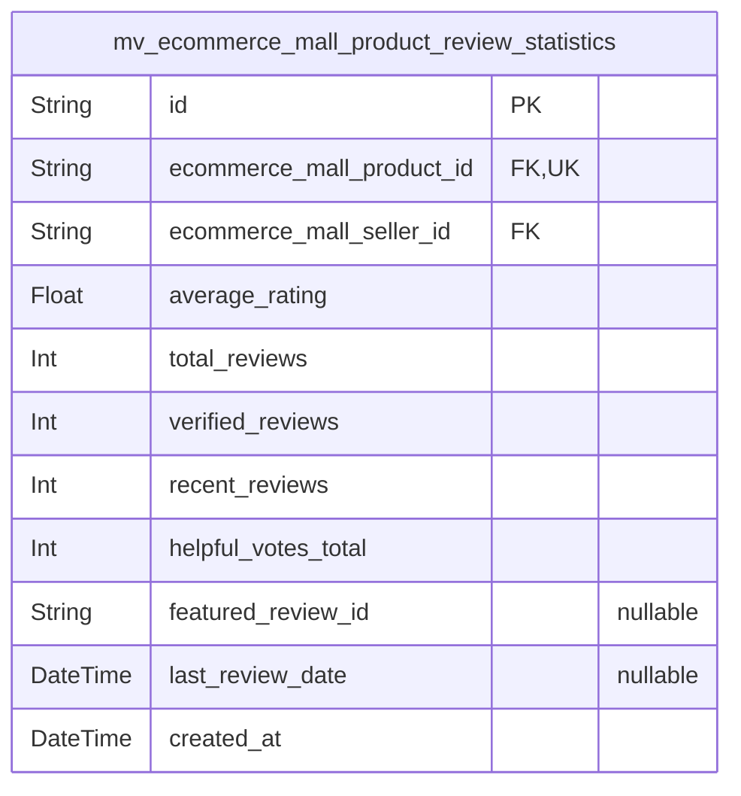

### `mv_ecommerce_mall_product_review_statistics`

Materialized view aggregating product review statistics and performance
metrics for optimized read operations across the platform.

This materialized view provides pre-calculated rating statistics, recent
review summaries, and performance metrics for efficient product display
and analytics reporting. The view is optimized for high-frequency queries
requiring aggregated review data without complex joins or calculations.

Properties as follows:

- `id`: Primary Key.
- `ecommerce_mall_product_id`
  > Product associated with these review statistics. {@link
  > ecommerce_mall_products.id}
- `ecommerce_mall_seller_id`
  > Primary seller for this product in review statistics. {@link
  > ecommerce_mall_sellers.id}
- `average_rating`: Calculated average rating from all verified reviews for this product.
- `total_reviews`: Total number of reviews received for this product.
- `verified_reviews`: Number of verified purchase reviews for authenticity weighting.
- `recent_reviews`: Number of reviews received within the last 30 days for trending analysis.
- `helpful_votes_total`: Total number of helpfulness votes cast on all reviews for this product.
- `featured_review_id`
  > Best review selected for featured display based on helpfulness and
  > quality scoring.
- `last_review_date`: Date of the most recent review publication for activity freshness scoring.
- `created_at`: Timestamp when these statistics were last calculated and refreshed.
