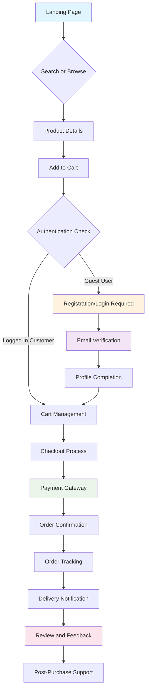
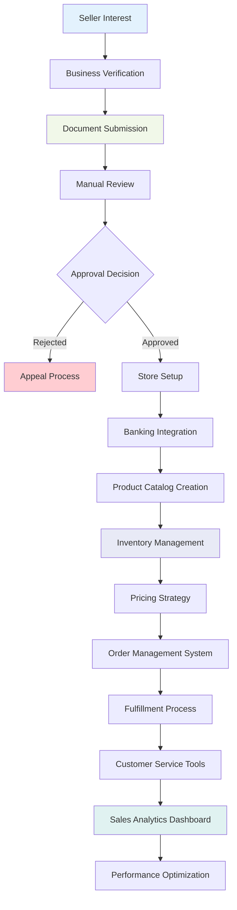
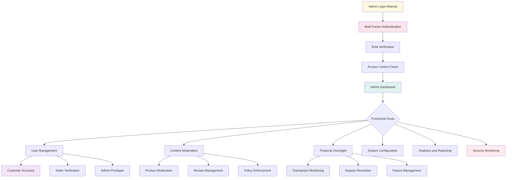
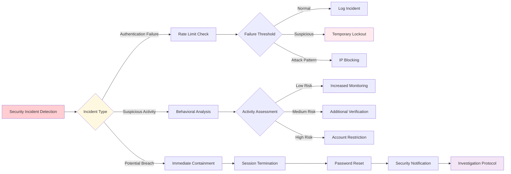

# User Requirements and Authentication Specification

## User Actor Definitions

### 1. Customer Actor

Customers are registered users with standard shopping privileges and personal account management capabilities.

**Core Capabilities:**
- Browse and search products across all seller catalogs
- Add items to shopping cart and manage cart contents
- Place orders and complete checkout process
- Track order status and shipment information
- Write product reviews and ratings
- Manage personal account information and preferences
- Access order history and download receipts
- Create and manage wishlists
- Save shipping addresses and payment methods
- Contact customer support and track tickets

**Repository Access:**
- Read access to all public product listings
- Full CRUD access to own cart, orders, wishlist, and reviews
- Read access to own account data and preferences
- Limited read access to seller information (store name, ratings)

**Authentication Requirements:**
- Email and password registration mandatory
- Email verification required before first purchase
- Two-factor authentication optional but recommended
- Password must meet security requirements (8+ characters, mixed case, numbers, symbols)

### 2. Seller Actor

Sellers are verified merchants with elevated permissions for commercial activities, restricted to their own products and store data.

**Core Capabilities:**
- Create and manage product listings with variants
- Set pricing, inventory levels, and promotional rules
- Process customer orders and update fulfillment status
- Manage store storefront appearance and branding
- Access sales analytics and performance metrics
- Handle customer inquiries related to their products
- Manage shipping profiles and return policies
- Withdraw earnings and manage payout settings
- View and respond to product reviews

**Repository Access:**
- Full CRUD access to own products, inventory, and pricing
- Full access to own orders and customer interactions
- Read access to platform-wide categories and tax rules
- Limited access to customer data (only for order fulfillment)
- Full access to own sales reports and analytics
- Read access to platform policies and guidelines

**Authentication Requirements:**
- Business verification required before account activation
- Enhanced security protocols (mandatory 2FA)
- Regular security audits and compliance checks
- Separate seller dashboard with additional authentication steps

**Performance Requirements:**
WHEN a seller uploads product images, THE system SHALL process and optimize images within 30 seconds for catalog display.

WHERE bulk inventory updates are concerned, THE system SHALL process up to 1,000 SKUs per minute without affecting seller dashboard responsiveness.

WHILE sellers are managing their storefront, THE system SHALL auto-save changes every 30 seconds to prevent data loss.

### 3. Admin Actor

Admins have comprehensive platform oversight with full system access and override capabilities.

**Core Capabilities:**
- Manage all user accounts (customers, sellers, and other admins)
- Moderate platform content and product listings
- Oversee transactions and handle disputes
- Configure system-wide settings and policies
- Access comprehensive platform analytics
- Manage platform content and announcements
- Handle seller verification and approval processes
- Override any seller or customer action when necessary
- Manage platform-wide promotions and campaigns
- Conduct security audits and compliance monitoring

**Repository Access:**
- Full CRUD access to all system data
- Read access to all transactions and user activities
- Override capabilities for any business rule
- System configuration and policy management
- Content moderation tools and enforcement
- Financial oversight and reporting access

**Authentication Requirements:**
- Multi-factor authentication mandatory
- IP whitelisting and access time restrictions
- Regular security clearance reviews
- Activity logging and audit trails for all actions

**Advanced Security Requirements:**
WHEN an admin accesses financial reports, THE system SHALL require secondary authentication and create immutable audit logs.

WHILE an admin exercises override permissions, THE system SHALL require written justification with minimum 50 character explanation.

WHERE content moderation is performed, THE system SHALL retain before/after snapshots for 7 years for regulatory compliance.

### 4. Guest Actor

Guests are unauthenticated visitors with limited browsing capabilities and no transactional access.

**Core Capabilities:**
- Browse public product catalogs and categories
- Search and filter products
- View basic product information and images
- See seller store pages and ratings
- Access platform policies and help content
- Compare products side-by-side
- View public reviews and ratings

**Repository Access:**
- Read access to public product listings
- Read access to public seller information
- Read access to public reviews and ratings
- Read access to platform content and policies
- No access to pricing history or personalized content

**Performance and Privacy Requirements:**
THE system SHALL limit guest page views to 100 pages per hour from a single IP address to prevent abuse.

WHERE guest sessions are concerned, THE system SHALL automatically clear browsing history after 24 hours of inactivity.

WHEN a guest adds items to cart, THE system SHALL persist cart contents for 30 days using secure session tokens.

## Authentication Flow Requirements

### JWT-Based Authentication System

**Token Structure:**
```json
JWT Payload: {
  "sub": "user_id",
  "email": "user@example.com", 
  "role": "customer|seller|admin",
  "permissions": ["permission1", "permission2"],
  "iat": 1234567890,
  "exp": 1234568490,
  "session_id": "session_uuid"
}
```

**Token Expiration Policies:**
- Access tokens expire after 15 minutes
- Refresh tokens expire after 30 days
- Session tokens are device-specific
- Tokens are invalidated on password change or suspicious activity

**Authentication Requirements:**
WHEN a user attempts to log in, THE system SHALL validate credentials and respond within 2 seconds with JWT tokens.

WHEN a user provides invalid login credentials, THE system SHALL return appropriate error message and increment failed login counter.

WHEN failed login attempts exceed 5 within 15 minutes, THE system SHALL temporarily lock the account for 30 minutes and notify the user via email.

WHEN a user successfully logs in from a new device, THE system SHALL send security notification to registered email.

WHILE a user session is active, THE system SHALL validate JWT token on every authenticated request.

IF a JWT token is expired, THEN THE system SHALL reject the request and return authentication error.

WHERE two-factor authentication is enabled, THE system SHALL require second factor verification before granting access.

**Token Refresh and Management:**
WHERE token management is concerned, THE system SHALL refresh access tokens automatically 5 minutes before expiration to ensure seamless user experience.

WHEN refresh token usage is detected, THE system SHALL rotate refresh tokens with 70% probability to enhance security while maintaining usability.

IF a refresh token is used more than 3 times within 5 minutes, THEN THE system SHALL consider it suspicious and require re-authentication.

### Registration and Verification Flow

**Customer Registration:**
WHEN a new customer registers, THE system SHALL require email, password, full name, and phone number (optional).

WHEN registration is submitted, THE system SHALL send verification email within 60 seconds with unique verification link.

WHEN email is verified, THE system SHALL activate the customer account and grant full customer permissions.

IF verification email is not clicked within 24 hours, THEN THE system SHALL mark account as inactive and require new verification.

**Account Naming and Uniqueness Requirements:**
THE system SHALL enforce username uniqueness across all actor types with collision detection and suggested alternatives.

WHERE email addresses are concerned, THE system SHALL support plus addressing (user+tag@domain.com) while maintaining uniqueness of base email.

WHEN a username change is requested, THE system SHALL preserve old username redirect for 90 days to maintain bookmark integrity.

**Seller Registration:**
WHEN a new seller registers, THE system SHALL require business information including business name, tax ID, contact details, and business verification documents.

WHEN seller registration is submitted, THE system SHALL initiate manual verification process within 2 business days.

WHILE verification is pending, THE system SHALL allow seller to set up store profile but not list products for sale.

WHEN verification is completed, THE system SHALL notify seller via email and grant full seller permissions.

**Verification Document Requirements:**
THE system SHALL accept business verification documents in PDF, JPG, or PNG formats with maximum file size of 10MB per document.

WHERE tax identification is required, THE system SHALL validate tax ID format according to country-specific patterns and cross-reference with business registration databases.

WHEN business documents are uploaded, THE system SHALL perform virus scanning and content verification before storage in secure document repository.

**Admin Account Creation:**
WHERE admin accounts are concerned, THE system SHALL only allow creation by existing admins with sufficient privileges.

WHEN an admin account is created, THE system SHALL require extensive identity verification and background checks.

WHILE admin accounts are active, THE system SHALL log all administrative actions with detailed audit trails.

**Admin Privilege Hierarchy:**
THE system SHALL implement three-tier admin system with Super Admin, Department Admin, and Support Admin levels with escalating permissions.

WHERE financial modifications are concerned, THE system SHALL require dual authorization from at least two department-level admins or one super admin.

WHEN admin permissions are modified, THE system SHALL create immutable audit trail with before/after permission snapshots.

## Permission Matrix and Access Control

### Actor Permission Matrix

| Action | Guest | Customer | Seller | Admin |
|--------|-------|----------|---------|-------|
| Browse Products | ✅ | ✅ | ✅ | ✅ |
| Search Products | ✅ | ✅ | ✅ | ✅ |
| View Product Details | ✅ | ✅ | ✅ | ✅ |
| Add to Cart | ❌ | ✅ | ✅ | ✅ |
| Place Orders | ❌ | ✅ | ✅ | ✅ |
| Write Reviews | ❌ | ✅ | ✅ | ✅ |
| Create Wishlist | ❌ | ✅ | ✅ | ✅ |
| Manage Account | ❌ | ✅ Own | ✅ Own | ✅ All |
| View Order History | ❌ | ✅ Own | ✅ Own | ✅ All |
| Track Shipments | ❌ | ✅ Own | ✅ Own | ✅ All |
| Create Product Listings | ❌ | ❌ | ✅ Own | ✅ Any |
| Manage Inventory | ❌ | ❌ | ✅ Own | ✅ Any |
| Set Pricing | ❌ | ❌ | ✅ Own | ✅ Any |
| Process Orders | ❌ | ❌ | ✅ Own | ✅ Any |
| Access Sales Analytics | ❌ | ❌ | ✅ Own | ✅ All |
| Manage Storefront | ❌ | ❌ | ✅ Own | ✅ Any |
| Handle Returns | ❌ | ❌ | ✅ Own | ✅ Any |
| Moderate Content | ❌ | ❌ | ❌ | ✅ |
| Manage Users | ❌ | ❌ | ❌ | ✅ |
| Configure System | ❌ | ❌ | ❌ | ✅ |
| Access Financial Reports | ❌ | ❌ | ❌ | ✅ |

### Resource Ownership Rules

**Customer Resources:**
THE system SHALL ensure customers can only access their own personal data, orders, wishlists, reviews, and payment information.

WHEN a customer attempts to access another customer's data, THE system SHALL deny access and log the unauthorized attempt.

WHILE processing orders, THE system SHALL allow customers to view their orders but not modify them after payment confirmation.

**Data Retention and Privacy:**
WHERE customer personal data is concerned, THE system SHALL maintain comprehensive deletion logs for 7 years to comply with data protection regulations.

WHEN a customer requests account deletion, THE system SHALL provide 30-day grace period with complete data export option before permanent deletion.

THE system SHALL automatically anonymize customer personal data in analytics systems after 2 years of account inactivity.

**Seller Resources:**
THE system SHALL ensure sellers can only manage their own products, inventory, pricing, and order fulfillment for their products.

WHEN a seller attempts to modify another seller's product, THE system SHALL deny access and flag for security review.

WHERE seller analytics are concerned, THE system SHALL only provide data related to their own sales performance.

**Marketplace Competition Protection:**
THE system SHALL prevent sellers from accessing competitor pricing data, sales figures, or customer information beyond their own interactions.

WHEN a seller views a product page, THE system SHALL ensure they cannot see competitor inventory levels, pricing history, or sales performance data.

THE system SHALL implement data isolation so sellers can only view their own order fulfillment requirements and customer contact information necessary for shipping.

**Admin Override Capabilities:**
THE system SHALL allow admins to access and modify any resource for legitimate business purposes.

WHEN admins exercise override permissions, THE system SHALL require justification and create detailed audit logs.

WHILE monitoring platform activities, THE system SHALL provide admins with comprehensive access to all user data and system resources.

## Session Management Requirements

### Token Storage and Security

**Token Storage:**
THE system SHALL store access tokens in localStorage for web applications and secure keychain for mobile applications.

THE system SHALL store refresh tokens in httpOnly cookies for enhanced security against XSS attacks.

WHEN tokens are stored, THE system SHALL encrypt sensitive payload data using industry-standard encryption algorithms.

**Cryptographic Security Standards:**
WHERE token encryption is concerned, THE system SHALL use AES-256-GCM encryption for payload data with rotating encryption keys updated weekly.

WHEN tokens are transmitted, THE system SHALL enforce TLS 1.3 minimum for all communication channels with forward secrecy enabled.

THE system SHALL implement token signing using RS256 algorithm with 2048-bit RSA keys that are rotated every 90 days.

### Multi-Device Session Management

**Concurrent Sessions:**
THE system SHALL support simultaneous sessions across multiple devices for the same user account.

WHEN a user logs in from a new device, THE system SHALL create new session without invalidating existing sessions.

THE system SHALL maintain per-device session tracking with individual session identifiers.

**Device Management Features:**
THE system SHALL provide users with detailed device management dashboard showing all active sessions with device type, location, and last active timestamp.

WHEN suspicious device activity is detected, THE system SHALL provide one-click option to revoke specific device access while maintaining other sessions.

WHERE mobile applications are concerned, THE system SHALL support biometric authentication (fingerprint/Face ID) for session restoration after app backgrounding.

**Session Revocation:**
WHEN a user logs out from any device, THE system SHALL invalidate tokens for that specific session only.

WHERE security concerns exist, THE system SHALL provide option to revoke all active sessions from account settings.

IF suspicious activity is detected, THE system SHALL automatically revoke sessions and notify the user immediately.

## Security Requirements

### Password Requirements

**Password Complexity:**
THE system SHALL require passwords to be minimum 8 characters in length.

THE system SHALL enforce password complexity including uppercase letters, lowercase letters, numbers, and special characters.

WHEN users create passwords, THE system SHALL reject commonly used passwords and dictionary words.

THE system SHALL require passwords to be changed every 90 days for seller and admin accounts.

**Advanced Password Security:**
THE system SHALL implement password strength meter with real-time feedback during registration and password changes.

WHERE password history is concerned, THE system SHALL prevent reuse of previous 5 passwords and maintain secure hash history for 2 years.

WHEN passwords are changed, THE system SHALL automatically revoke all existing sessions except the current one to prevent unauthorized access.

### Account Security Measures

**Account Lockout:**
WHEN failed login attempts exceed 5 within 15 minutes, THE system SHALL lock the account for 30 minutes.

WHILE account is locked, THE system SHALL display appropriate error message without revealing account existence.

WHEN account lockout expires, THE system SHALL automatically restore access without manual intervention.

**Progressive Security Escalation:**
IF failed login attempts reach 15 within 24 hours, THEN THE system SHALL require CAPTCHA verification for additional attempts.

WHERE accounts show repeated suspicious activity, THE system SHALL implement geographic restrictions based on typical user behavior patterns.

THE system SHALL provide account recovery options including email verification, SMS codes, and security questions configured during registration.

**Suspicious Activity Detection:**
THE system SHALL monitor for unusual login patterns including geographic inconsistencies and timing anomalies.

IF suspicious activity is detected, THEN THE system SHALL require additional verification steps before granting access.

WHEN security incidents occur, THE system SHALL immediately notify affected users via email and SMS if configured.

**Machine Learning Detection:**
THE system SHALL implement behavioral analytics to detect unusual patterns including rapid-fire requests, abnormal navigation sequences, and data access patterns.

WHEN potential account takeover is detected, THE system SHALL implement gradual access restrictions starting with requiring re-authentication for sensitive operations.

THE system SHALL analyze device fingerprinting data including browser type, screen resolution, timezone, and installed plugins to detect potential fraudulent access.

### Rate Limiting and Protection

**API Rate Limiting:**
THE system SHALL implement rate limiting on authentication endpoints to prevent brute force attacks.

WHEN authentication requests exceed rate limits, THE system SHALL temporarily block the IP address for escalating time periods.

THE system SHALL maintain separate rate limits for different actor types with higher limits for legitimate users.

**Advanced DDoS Protection:**
WHEN DDoS attacks are detected, THE system SHALL automatically activate enhanced protection measures including IP-based filtering and CDN-level protection.

THE system SHALL implement bot detection using advanced fingerprinting techniques including mouse movement patterns, keystroke dynamics, and navigation behavior analysis.

WHERE automated attacks are detected, THE system SHALL implement progressive delays starting at 1 second and escalating to 60 seconds for repeated violations.

**Geographic and Reputation Filtering:**
THE system SHALL integrate with threat intelligence services to automatically block requests from known malicious IP addresses and domains.

WHEN requests originate from high-risk countries identified in security policies, THE system SHALL require additional verification steps before granting access.

THE system SHALL implement adaptive rate limiting that becomes more restrictive during known attack periods and relaxes during normal operational hours.

## User Journey Mapping

### Customer Journey Flow



### Seller Journey Flow



### Admin Operations Flow



### Error Handling and Security Response



### Authentication Error Handling Scenarios

**Common Error Handling Requirements:**

**Invalid Credentials Response:**
WHEN a user provides incorrect login credentials, THE system SHALL display generic error message saying "Invalid email or password" without revealing which field was incorrect.

WHILE showing login errors, THE system SHALL provide password reset link prominently displayed below the error message.

THE system SHALL implement progressive delay in error message display starting from immediate response and increasing to 2 seconds after 3 failed attempts.

**Account Locked Scenarios:**
WHEN an account is locked due to excessive failed attempts, THE system SHALL display clear message stating account is temporarily locked and provide estimated unlock time.

WHERE account locking is implemented, THE system SHALL send security notification email to registered address within 5 minutes of lockout.

THE system SHALL provide emergency contact option for users who believe their account was compromised during locked period.

**Email Verification Support:**
WHEN a user attempts login with unverified email address, THE system SHALL provide prominent resend verification email option and explain verification requirement.

WHERE email verification is required, THE system SHALL allow 24-hour grace period for verification completion before restricting account functionality.

IF verification email delivery fails, THEN THE system SHALL retry sending up to 3 times with 30-minute intervals before flagging email address as problematic.

**Session Expiration Management:**
WHEN a session expires during user activity, THE system SHALL preserve current state data and redirect to login with return URL functionality.

WHERE sessions expire, THE system SHALL provide clear feedback explaining why re-authentication is required and what actions triggered the expiration.

THE system SHALL implement grace period of 5 minutes for session renewal when user activity is detected within 60 seconds of expiration.

**Permission Denied Handling:**
WHEN access is denied due to insufficient permissions, THE system SHALL display user-friendly error message explaining what permissions are required without revealing system security details.

WHERE permission errors occur, THE system SHALL provide helpful next steps such as contacting support or account upgrade information when appropriate.

IF a permission error occurs frequently from same user, THEN THE system SHALL escalate to security team for investigation of potential privilege escalation attempts.

## Performance and Scalability Requirements

**Authentication Performance Standards:**
THE system SHALL process authentication requests within 2 seconds under normal load conditions with 95th percentile response time under 3 seconds.

THE system SHALL handle concurrent authentication requests for at least 50,000 simultaneous users across all authentication endpoints.

WHEN tokens are validated, THE system SHALL respond within 100ms for optimal user experience with 99.9% fastest verification times under 50ms.

**Session Management Performance:**
THE system SHALL support up to 10 concurrent sessions per user across different devices with immediate synchronization of session state changes.

THE system SHALL clean up expired sessions automatically within 6 hours of expiration using efficient batch processing that doesn't impact active user sessions.

WHERE session data is concerned, THE system SHALL use distributed caching with Redis cluster to ensure sub-millisecond access to session information.

**Token and API Performance:**
WHERE JWT token operations are concerned, THE system SHALL perform token generation, signing, and validation operations within 10ms using optimized cryptographic libraries.

WHEN token validation is performed across system APIs, THE system SHALL maintain throughput of at least 10,000 requests per second with proper caching mechanisms.

THE system SHALL implement intelligent token caching that reduces database lookups by 95% while maintaining complete security integrity.

**Scalability Architecture:**
THE system SHALL implement horizontal scaling capabilities allowing authentication services to scale from 1,000 to 100,000 concurrent users within 5 minutes using auto-scaling groups.

WHERE load balancing is implemented, THE system SHALL use consistent hashing for session affinity while allowing session mobility for maintenance and capacity redistribution.

THE system SHALL implement token blacklisting in distributed cache with less than 1-second propagation delay across all authentication nodes in the cluster.

**Database Performance Optimization:**
WHERE user authentication data is stored, THE system SHALL implement read replicas with automatic query routing to ensure authentication operations never exceed 50ms database access time.

WHEN session data is persisted, THE system SHALL use write-through caching to ensure data consistency while maintaining 99.99% read availability.

THE system SHALL implement connection pooling with at least 1,000 connections available for authentication operations to prevent connection exhaustion during peak loads.

## Internationalization and Localization Requirements

**Multi-Language Authentication Support:**
THE system SHALL support authentication interfaces in minimum 8 languages including English, Spanish, French, German, Japanese, Korean, Chinese (Simplified), and Portuguese.

WHERE error messages are displayed, THE system SHALL provide culturally appropriate and correctly translated messages with proper pluralization rules for each supported language.

WHEN international users authenticate, THE system SHALL automatically detect language preference from browser settings with user override capability.

**Cultural and Legal Compliance:**
THE system SHALL implement date format localization showing dates in local format (MM/DD/YYYY for US, DD/MM/YYYY for UK, etc.) based on user location and preferences.

WHERE currency and pricing are concerned, THE system SHALL display authentication fees or charges in local currency with accurate conversion rates updated every 4 hours.

THE system SHALL comply with regional data protection regulations including GDPR (Europe), CCPA (California), PIPEDA (Canada), and similar regulations depending on user location.

TextDirection Support:
THE system SHALL properly support right-to-left (RTL) languages including Arabic, Hebrew, and Persian with complete interface mirroring for authentication screens.

WHERE RTL support is implemented, THE system SHALL ensure that form layouts, buttons, and navigation elements are properly mirrored and remain fully functional.

THE system SHALL maintain separate language-specific audit logs with proper Unicode support for international character sets in user names and email addresses.

**Regional Security Compliance:**
WHERE authentication data is stored, THE system SHALL maintain data sovereignty by storing EU user data in EU-based servers, US user data in US-based servers, and Asian user data in Asian-based servers.

WHEN cross-border authentication occurs (users logging in from different countries), THE system SHALL implement additional security verification steps and maintain detailed audit trails.

THE system SHALL implement regional password policies that meet specific country requirements such as special character requirements for certain regions and additional complexity rules where mandated.

## Future-Proofing and Extensibility Requirements

**Social Authentication Architecture:**
THE system SHALL be designed with modular authentication architecture allowing future integration of social login providers (Google, Facebook, Apple, Twitter, LinkedIn) without core system modifications.

WHERE social authentication is planned, THE system SHALL maintain backward compatibility with existing JWT token structure while supporting OAuth 2.0 and OpenID Connect protocols.

WHEN social authentication is implemented, THE system SHALL provide account linking capabilities allowing users to connect multiple social accounts to their existing marketplace accounts.

**Biometric Authentication Support:**
THE system SHALL support future implementation of biometric authentication including fingerprint recognition, facial recognition, voice biometric identification, and behavioral biometrics for mobile applications.

WHERE biometric authentication is planned, THE system SHALL implement template-based architecture allowing integration of multiple biometric modalities with fallback authentication mechanisms.

THE system SHALL design account recovery processes that handle scenarios where biometric authentication fails due to device changes, injury, or other circumstances requiring alternative authentication methods.

**Enterprise and SSO Capabilities:**
THE system architecture SHALL accommodate enterprise SSO integration supporting SAML 2.0, OAuth 2.0, and OpenID Connect for B2B marketplace features and corporate partnerships.

WHERE enterprise integration is required, THE system SHALL support custom identity provider configurations, custom claims mapping, and enterprise-specific attribute exchange.

THE system SHALL implement federation capabilities allowing multiple identity providers to be configured with dynamic provider selection based on user email domain or organizational context.

**API and Integration Extensibility:**
THE system SHALL provide comprehensive webhook capabilities allowing external systems to receive real-time notifications for authentication events including login, logout, password changes, and security incidents.

WHERE programmatic access is required, THE system SHALL offer RESTful APIs with consistent versioning strategy that maintains backward compatibility for minimum 3 years.

THE system SHALL implement plugin architecture allowing third-party authentication services, additional verification methods, and custom validation rules to be integrated without affecting core authentication logic.

**Mobile and IoT Considerations:**
THE system SHALL design authentication flows optimized for mobile applications with support for device-specific security features including secure enclaves, hardware-backed keystores, and device attestation.

WHERE IoT device authentication is planned, THE system SHALL implement certificate-based authentication with device provisioning workflows and bulk device enrollment capabilities.

THE system SHALL support wearable device integration allowing authentication through companion devices with proximity-based verification and multi-device authentication flows.

This comprehensive authentication specification provides the foundation for implementing a secure, scalable, and user-friendly authentication system that supports the complex multi-actor marketplace environment while maintaining enterprise-grade security standards and regulatory compliance across global markets.