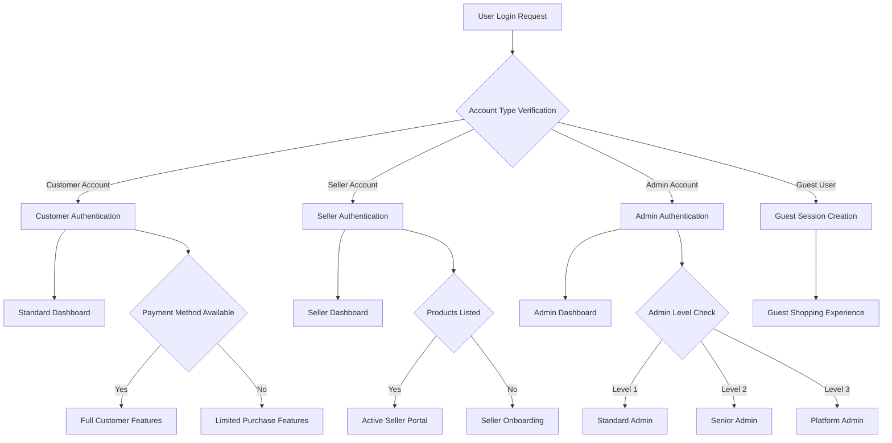
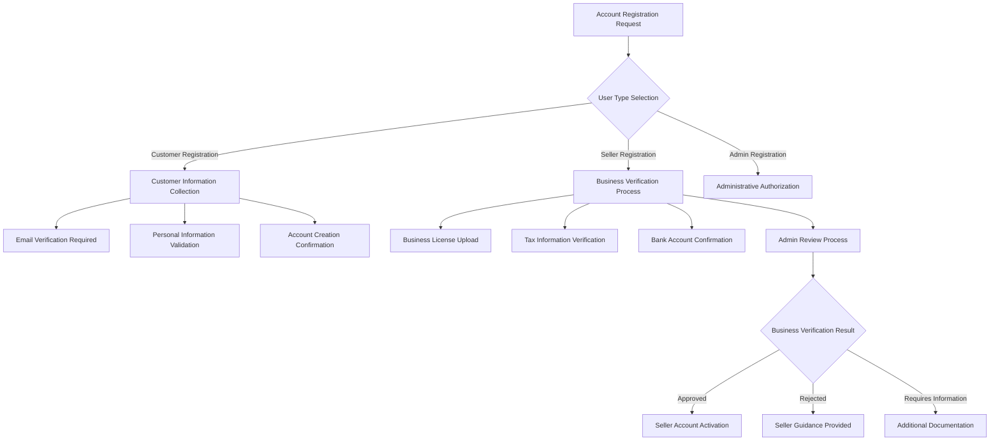
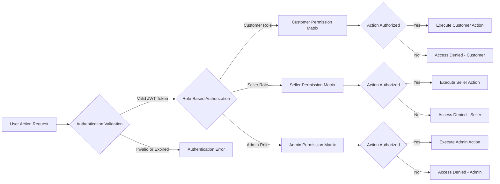

# User Actors and Authentication Requirements
## E-Commerce Shopping Mall Platform

### Executive Summary

This document establishes the complete user management architecture for a sophisticated multi-vendor e-commerce shopping mall platform. The system supports four distinct user types with specific authentication requirements, permission levels, and business process workflows that ensure secure, scalable operations while providing seamless user experiences across all platform functions.

### Business Context

Operating as a comprehensive marketplace connecting multiple sellers with diverse customer bases, this platform requires meticulous user role definition and authentication protocols. The system must balance security requirements with user convenience, enable seamless seller operations while maintaining platform integrity, and provide comprehensive administrative oversight without compromising operational efficiency.

## User Actor Definitions

### Guest Users

**Operational Scope and Limitations**

**THE** guest users **SHALL** represent unauthenticated website visitors who can browse public marketplace content without account creation or login requirements. **WHEN** guests arrive at the platform, **THE** system **SHALL** provide unrestricted access to product catalogs, search functionality, and category navigation while preventing transactional activities that require account verification.

**THE** guest experience **SHALL** maintain session-based cart functionality using browser cookies and local storage mechanisms. **IF** guests attempt to complete purchases, **THE** system **SHALL** redirect them to account creation workflow with clear explanation that registration enables checkout completion. Guest sessions **SHALL** persist for 24 hours unless browser data is cleared, ensuring temporary cart contents remain available for extended browsing periods.

**THE** system **SHALL** track guest browsing behavior for analytics purposes while respecting privacy requirements and providing cookie consent mechanisms that comply with international data protection regulations. Guest tracking **SHALL** exclude personal identification information and focus on aggregated behavioral metrics that inform product recommendation algorithms and marketing strategy development.

**THE** guest interface **SHALL** include persistent calls-to-action encouraging account creation, highlighting benefits including saved wishlists, order history access, and personalized recommendations. **WHEN** guests demonstrate interest by adding multiple products to cart or visiting frequently, **THE** system **SHALL** intensify registration suggestions while maintaining respect for guest user preferences and browsing experience quality.

### Customer Users

**Account Creation and Verification Requirements**

**THE** customer users **SHALL** complete comprehensive registration process requiring email address validation, password creation meeting security standards, and basic personal information collection that enables transactional functionality. **WHEN** customers submit registration information, **THE** system **SHALL** validate email format correctness, password complexity requirements, and phone number format accuracy before activating accounts.

**THE** email verification process **SHALL** generate unique confirmation links with 24-hour expiration periods, requiring customers to verify account ownership before accessing full platform functionality. **IF** customers fail to verify email within specified timeframe, **THE** system **SHALL** send reminder notifications and provide easy account reactivation options while maintaining security standards that prevent unauthorized account access.

**THE** customer account management **SHALL** enable comprehensive profile customization including multiple shipping addresses, payment method storage with tokenization for security, communication preferences for marketing and transactional messages, and privacy settings controlling data sharing with platform partners and third-party service providers.

**THE** customer authentication **SHALL** support multiple login methods including email/password combinations, optional social media integration with major platforms (Google, Facebook, Apple ID), and mobile app authentication through biometric recognition where available. **WHILE** maintaining multiple authentication options, **THE** system **SHALL** ensure consistent account access across different devices and platforms.

**THE** customer dashboard **SHALL** provide comprehensive access to personal order history with detailed tracking information, saved payment methods with secure management tools, communication history with sellers and platform support, wishlist management with ability to create multiple wishlist categories, and personalized product recommendations based on browsing and purchasing patterns.

**WHEN** customers access their accounts across multiple devices, **THE** system **SHALL** maintain synchronized cart contents, updated wishlist items, and recent search history while implementing security measures that detect unusual access patterns and prevent unauthorized account usage.

### Seller Users

**Merchant Account Verification and Management**

**THE** seller users **SHALL** undergo comprehensive verification process including business registration confirmation, tax identification validation, bank account verification for payment processing, and identity verification that confirms authorized business representation. **WHEN** sellers request account creation, **THE** system **SHALL** collect business licenses, tax certificates, and contact information through secure document upload workflows.

**THE** seller verification process **SHALL** include manual review by platform administrators within 2 business days, ensuring business legitimacy, product category appropriateness, and compliance with platform quality standards. **IF** sellers submit incomplete verification information, **THE** system **SHALL** provide detailed guidance about required documents and enable document resubmission without penalty fees or extended delays.

**THE** seller dashboard **SHALL** provide comprehensive business management capabilities including product catalog management for unlimited SKU listings, inventory tracking across multiple warehouse locations, order processing workflows with automated status updates, customer communication tools with professional messaging interfaces, sales analytics and performance reporting with customizable date ranges, and revenue tracking with detailed commission breakdowns.

**THE** seller authentication **SHALL** require enhanced security measures including mandatory password complexity, optional two-factor authentication for financial transactions, IP address monitoring for unusual access patterns, and session timeout configurations that balance security requirements with operational convenience. **WHEN** sellers access administrative functions, **THE** system **SHALL** validate permissions and maintain detailed audit trails of all business actions.

**THE** order management interface **SHALL** enable sellers to efficiently process customer orders including automated inventory validation, shipping label generation with negotiated carrier rates, customer communication management through integrated messaging systems, refund and return processing within platform policy guidelines, and real-time order status updates that keep customers informed throughout fulfillment processes.

**THE** seller support system **SHALL** provide comprehensive on-boarding including product listing assistance, pricing strategy guidance, and marketing optimization recommendations based on platform analytics. **WHEN** sellers encounter operational issues, **THE** platform **SHALL** provide rapid support response through dedicated seller help systems and clear escalation procedures for complex business challenges.

### Administrator Users

**Platform Oversight and Security Management**

**THE** administrator users **SHALL** represent authorized platform staff with comprehensive oversight responsibilities including user account management, content moderation, business analytics access, and system configuration control. **THE** administrator authentication **SHALL** require enhanced security measures including mandatory two-factor authentication, IP address whitelisting for sensitive functions, and session management that requires re-authentication for high-risk operations.

**THE** administrative interface **SHALL** provide comprehensive platform management tools including user account verification and suspension capabilities, dispute resolution management with detailed case tracking, platform-wide analytics and business intelligence dashboards, system configuration management for operational parameters, and financial monitoring with transaction oversight and fraud detection capabilities.

**THE** administrator permission system **SHALL** implement role-based access control enabling different administrative levels including customer service representatives, senior administrators, financial analysts, and system administrators. **WHEN** administrative actions affect user accounts or financial transactions, **THE** system **SHALL** require secondary approval and maintain comprehensive audit trails accessible for compliance reviews and regulatory reporting.

**THE** content moderation system **SHALL** provide administrators with tools for reviewing product listings, customer reviews, seller communications, and user-generated content that violates platform policies. **IF** content requires removal or revision, **THE** system **SHALL** notify affected parties with clear explanations while maintaining appeals processes that protect legitimate business interests.

## Authentication Requirements

### Core Authentication Architecture

**THE** authentication system **SHALL** implement JWT-based session management with access tokens valid for 15 minutes and refresh tokens maintaining validity for 30 days. **WHEN** users authenticate successfully, **THE** system **SHALL** generate tokens containing user identification, role assignment, permission levels, and session metadata enabling authorization verification across all platform functions.

**THE** password security requirements **SHALL** enforce minimum 8-character lengths with mandatory inclusion of uppercase letters, lowercase letters, numbers, and special characters. **THE** system **SHALL** prevent password reuse for previous 10 passwords and require password changes every 90 days for administrative accounts. **IF** users attempt weak passwords, **THE** system **SHALL** provide dynamic strength indicators and specific improvement suggestions.

**THE** authentication interface **SHALL** support multiple login methods including traditional email/password authentication, optional social media login integration, mobile app biometric authentication, and emergency account recovery through verified email addresses. **WHILE** providing multiple authentication options, **THE** system **SHALL** maintain consistent security standards and implement fraud detection measures.

### Multi-Factor Authentication Implementation

**THE** multi-factor authentication system **SHALL** provide optional enhanced security for customer accounts while maintaining mandatory MFA for administrative accounts and seller accounts with financial access privileges. **WHEN** users enable MFA, **THE** system **SHALL** support SMS text verification, authenticator app integration, and email-based backup codes that enable account recovery during authentication process challenges.

**THE** MFA enrollment process **SHALL** provide clear setup instructions, backup code generation and secure storage, device management allowing multiple authentication methods, and user-friendly recovery processes for lost authentication devices. **IF** users lose access to MFA devices, **THE** system **SHALL** implement secure recovery procedures including identity verification through alternative contact methods while preventing social engineering attacks.

### Authentication Security and Monitoring

**THE** authentication monitoring system **SHALL** detect suspicious login patterns including multiple failed attempts, unusual geographic access locations, simultaneous login attempts from different devices, and velocity attacks attempting rapid credential testing. **WHEN** suspicious activity is detected, **THE** system **SHALL** implement progressive security responses including account lockouts, challenge questions, and administrative notifications.

**THE** security incident response system **SHALL** provide clear procedures for handling authentication compromise including immediate account suspension capabilities, all-session invalidation across devices, rapid password reset options, and coordinated communication with affected users. **IF** security breaches affect multiple accounts, **THE** system **SHALL** implement platform-wide password reset requirements and enhanced MFA enforcement.

## Permission Matrix and Access Control

### Comprehensive Permission Framework

**THE** permission system **SHALL** implement granular access control enabling specific function access based on user roles, account types, and business requirements. **THE** system **SHALL** maintain role-based permissions rather than individual user permissions, simplifying management while ensuring consistent access control across similar account types.

**THE** permission validation **SHALL** occur at multiple security layers including application layer, API layer, and data access layer ensuring defense-in-depth security architecture. **WHEN** users attempt operations exceeding their permission level, **THE** system **SHALL** provide clear error messages without revealing security architecture information that could enable additional attack vectors.

## User Journey Maps

### Authentication and Authorization Workflows

### Registration and Verification Process

### Permission and Access Validation

## Business Rules and Validation Requirements

### Authentication Security Standards

**THE** authentication system **SHALL** implement continuous security monitoring that detects anomalous login patterns, unusual geographic locations, high velocity login attempts from single IP addresses, and simultaneous multi-device access that could indicate account compromise. **WHEN** security anomalies are detected, **THE** system **SHALL** implement graduated security responses including temporary account suspension, challenge questions, email verification, and administrative review processes that maintain account security without unnecessarily inconveniencing legitimate users.

**THE** password security enforcement **SHALL** consider common password dictionaries, pattern-based passwords, keyboard walks, and known compromised credentials that appear in security breach databases. **THE** system **SHALL** provide clear guidance about password requirements while enabling customers to create memorable yet secure credentials through recommended password generation strategies and secure password storage tools.

### Session Management Requirements

**THE** session management system **SHALL** implement device fingerprinting enabling detection of suspicious authentication attempts from unknown devices while providing legitimate users with transparent device recognition across multiple platforms. **THE** system **SHALL** support device management dashboards enabling users to view their authenticated devices, revoke access for old or compromised devices, and set security preferences for different device types.

**THE** session timeout parameters **SHALL** balance security requirements with operational convenience implementing shorter timeout periods for accounts with financial access privileges while providing extended sessions for convenient browsing activities that don't involve sensitive information access. Session management **SHALL** consider user risk profiles, account types, and historical usage patterns when determining appropriate timeout intervals and subsequent re-authentication requirements.

### Data Protection and Privacy

**THE** authentication system **SHALL** comply with privacy regulations including GDPR requirements, CCPA standards, and international data protection frameworks that govern how personal information can be collected, processed, stored, and shared with third-party providers. **THE** system **SHALL** provide transparent privacy practices notices, clear consent mechanisms, and user control options that enable customers to manage their personal information according to individual preferences.

**THE** data retention system **SHALL** maintain authentication records only as long as necessary for legitimate business purposes while providing users with account deletion options that properly remove personal information but maintain required legal and financial records for compliance purposes. Data retention **SHALL** consider jurisdiction-specific requirements, business necessity, and industry standards that might require longer retention periods for certain types of operational information.

This comprehensive authentication and user actor specification ensures the E-commerce Shopping Mall platform provides secure, convenient, and scalable user management capabilities that support complex multi-vendor operations while maintaining high standards for security, privacy, and regulatory compliance that modern digital commerce requires.