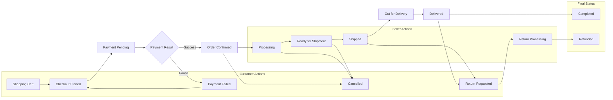

# Order Management Requirements Specification

## Executive Summary

This document defines comprehensive requirements for managing the complete order lifecycle in the shopping mall platform, from cart creation through delivery confirmation. The system must handle complex multi-actor workflows involving customers making purchases, sellers fulfilling orders, and administrators overseeing operations while maintaining inventory synchronization and providing real-time communication throughout the process.

## Order Lifecycle Overview

### Order State Machine

### Core Order Management Requirements

THE system SHALL maintain order state consistency across all actors and prevent unauthorized state transitions. THE platform SHALL support order modifications only within allowable state windows and maintain complete audit trails for all state changes.

WHEN an order is created, THE system SHALL generate a unique order identifier using format "ORD-YYYYMMDD-NNNNNN" and assign sequential order numbers for each seller's storefront. THE system SHALL capture comprehensive order metadata including creation timestamp, customer information, seller details, payment method, and initial order totals.

## Shopping Cart Management Requirements

### Cart Creation and Persistence

WHEN a customer adds a product to their cart, THE system SHALL validate product availability in real-time and prevent overselling through inventory reservation mechanisms. THE system SHALL support multiple cart types including guest carts (session-based) and registered user carts (persisted to user account).

THE shopping cart SHALL support complex product configurations including quantity adjustments, product variants (size, color, style), and bundled products. THE system SHALL calculate and display real-time pricing including base prices, discounts, taxes, and shipping estimates based on customer location and selected delivery options.

WHILE a customer maintains an active session, THE system SHALL persist cart contents for guest users with a minimum retention period of 30 days. THE system SHALL synchronize cart contents across devices for registered users and maintain cart history for analytical purposes.

### Cart Validation and Checkout Preparation

WHEN a customer initiates checkout, THE system SHALL perform comprehensive cart validation including product availability verification, pricing validation, and seller-specific requirements checking. THE system SHALL verify that all products in the cart are available from active sellers and meet minimum order requirements where applicable.

THE cart validation process SHALL include address verification for shipping destinations, payment method validation, and customer eligibility checks for any restricted products or promotions. THE system SHALL provide clear error messaging for validation failures and suggest corrective actions to customers.

## Checkout Process Requirements

### Multi-Step Checkout Flow

THE checkout process SHALL follow a structured multi-step workflow including shipping address collection, delivery method selection, payment method configuration, and order review confirmation. THE system SHALL maintain checkout session state and allow customers to navigate between steps without losing entered information.

WHEN a customer proceeds to checkout, THE system SHALL require authentication for registered users and provide guest checkout options for new customers. THE platform SHALL streamline the checkout process by pre-populating known customer information while allowing modifications for each order.

### Shipping and Delivery Configuration

THE system SHALL support multiple delivery addresses per order and allow customers to specify different shipping addresses for individual products within a single order. THE checkout SHALL provide accurate shipping cost calculations based on product dimensions, weight, delivery location, and selected shipping service levels.

WHEN international shipping is required, THE system SHALL calculate applicable duties, taxes, and customs fees while providing customers with total landed cost estimates. THE platform SHALL validate international shipping restrictions and provide alternative shipping options when products cannot be delivered to specific destinations.

### Payment Method Integration

THE checkout SHALL integrate with multiple payment service providers to support credit cards, debit cards, digital wallets, bank transfers, and buy-now-pay-later options. THE system SHALL implement PCI-compliant payment processing with secure tokenization and never store sensitive payment information in plain text.

WHEN handling payment information, THE system SHALL validate card numbers using Luhn algorithm, verify CVV codes, and implement 3D Secure authentication for applicable transactions. THE platform SHALL support payment method tokenization for repeat customers while maintaining secure cryptographic storage standards.

## Payment Integration Requirements

### Payment Gateway Coordination

THE system SHALL support multiple concurrent payment gateways and implement intelligent routing based on payment method, customer location, transaction amount, and success rate metrics. THE platform SHALL provide failover capabilities to alternative payment providers when primary gateways experience outages or reject transactions.

WHEN processing payments, THE system SHALL implement comprehensive fraud detection including velocity checks, geolocation verification, device fingerprinting, and integration with third-party fraud prevention services. THE platform SHALL maintain detailed transaction logs for audit purposes while ensuring customer payment information remains encrypted and tokenized.

### Transaction State Management

THE payment integration SHALL handle complex transaction states including authorization, capture, void, refund, and chargeback processing. THE system SHALL maintain payment transaction history and provide sellers with detailed reporting on payment status and settlement information.

IF a payment fails during processing, THEN the system SHALL provide specific error codes and customer-friendly messages while suggesting alternative payment methods. THE platform SHALL implement retry logic for temporary payment gateway failures and escalate persistent payment issues to customer service teams.

### Refund and Adjustment Processing

THE system SHALL support partial and full refunds with automatic inventory restocking and seller notification processes. THE payment integration SHALL handle complex refund scenarios including split payments, promotional credits, and multi-currency transactions while maintaining accurate accounting records.

WHEN processing refunds, THE system SHALL validate refund eligibility based on order status, return policies, and seller-specific rules. THE platform SHALL provide estimated refund timelines and automatically notify customers when refunds are processed while updating order status accordingly.

## Order Fulfillment Requirements

### Seller Notification and Processing

WHEN an order is confirmed, THE system SHALL immediately notify sellers through multiple channels including email notifications, dashboard alerts, and API webhooks. THE notification SHALL include complete order details, customer information, shipping requirements, and special instructions while maintaining customer privacy standards.

THE seller interface SHALL provide comprehensive order management tools including order acknowledgment, processing status updates, shipping label generation, and customer communication features. THE system SHALL support bulk order processing for high-volume sellers while maintaining individual order tracking capabilities.

### Inventory Coordination

THE fulfillment process SHALL implement real-time inventory synchronization to prevent overselling and automatically adjust available quantities as orders are processed. THE system SHALL support inventory allocation strategies including first-in-first-out, last-in-first-out, and custom allocation rules based on seller preferences.

WHEN inventory shortages occur, THE system SHALL implement backorder management with customer notification and estimated restocking dates. THE platform SHALL provide sellers with inventory forecasting tools and low-stock alerts while supporting dropshipping integration for third-party fulfillment scenarios.

### Quality Control and Packaging

THE system SHALL support seller-defined quality control checkpoints including order verification, packaging standards, and shipping preparation requirements. THE platform SHALL provide sellers with packaging guidelines and shipping best practices while allowing custom packaging options for brand consistency.

WHEN orders contain fragile, hazardous, or regulated products, THE system SHALL provide specific handling instructions and compliance requirements to sellers. THE platform SHALL integrate with shipping carriers to ensure proper labeling and documentation for restricted items while maintaining regulatory compliance.

## Shipping and Delivery Requirements

### Carrier Integration and Selection

THE system SHALL integrate with multiple shipping carriers including national postal services, private couriers, and regional delivery services to provide comprehensive shipping options. THE platform SHALL implement intelligent carrier selection based on delivery speed, cost, reliability metrics, and package characteristics.

WHEN calculating shipping costs, THE system SHALL consider package dimensions, weight, destination zones, service levels, and negotiated carrier rates while providing customers with accurate delivery estimates. THE platform SHALL support dimensional weight calculations and fuel surcharge adjustments for carrier-specific pricing models.

### Tracking and Visibility

THE shipping integration SHALL provide real-time tracking information with automatic status updates throughout the delivery process. THE system SHALL implement tracking number validation and carrier-specific tracking format support while maintaining tracking history for customer service and dispute resolution purposes.

WHEN packages are shipped, THE system SHALL automatically send tracking information to customers through email and SMS notifications while updating order status to reflect shipment progress. THE platform SHALL provide estimated delivery dates and proactively notify customers of any delays or delivery issues while offering alternative solutions when appropriate.

### Delivery Confirmation and Exceptions

THE system SHALL support multiple delivery confirmation methods including signature confirmation, photo confirmation, and delivery code verification based on service level and customer preferences. THE platform SHALL handle delivery exceptions including failed delivery attempts, address corrections, and package redirection requests while maintaining communication with both customers and sellers.

IF delivery fails due to incorrect addresses, THEN the system SHALL implement address validation and correction workflows with seller and customer notification. THE platform SHALL support package holding at carrier facilities and customer pickup scheduling while providing clear instructions for successful delivery completion.

## Order Tracking and Communication Requirements

### Customer Notification System

THE system SHALL implement comprehensive customer communication including order confirmation, shipping notifications, delivery updates, and satisfaction surveys throughout the order lifecycle. THE notifications SHALL support multiple channels including email, SMS, push notifications, and in-app messages while allowing customers to customize their notification preferences.

WHEN significant order events occur, THE system SHALL send timely notifications with relevant details, expected timelines, and actionable next steps for customers. THE platform SHALL maintain notification history and provide customers with a complete communication timeline while supporting notification rescheduling and delivery preferences.

### Seller Communication Protocols

THE seller notification system SHALL provide real-time updates on order status changes, customer communications, shipping requirements, and fulfillment deadlines while maintaining seller dashboard synchronization. THE system SHALL support seller-customer communication through integrated messaging while preserving privacy and maintaining professional communication standards.

THE platform SHALL implement escalation workflows for delayed orders, customer complaints, and fulfillment issues while providing sellers with tools for proactive customer communication and issue resolution. THE system SHALL maintain communication history and provide analytics on seller response times and customer satisfaction metrics.

### Administrative Oversight

WHEN orders require administrative intervention, THE system SHALL provide administrators with comprehensive order details, customer and seller communication history, and resolution tools for dispute management. THE admin interface SHALL support order modification, refund processing, and manual status updates while maintaining complete audit trails for all administrative actions.

THE system SHALL implement automated monitoring for order anomalies including unusual shipping destinations, high-value orders, frequent returns, and suspicious purchasing patterns while providing administrators with investigation tools and escalation workflows. THE platform SHALL maintain order performance metrics and generate reports for operational analysis and improvement initiatives.

## Error Handling and Recovery Requirements

### Payment Failure Scenarios

IF payment processing fails due to insufficient funds, THEN the system SHALL notify customers immediately with specific error information while offering alternative payment methods and preserving order details for retry attempts. THE platform SHALL implement payment failure logging and provide sellers with payment status updates while maintaining order integrity during payment retry cycles.

WHEN payment gateways experience technical difficulties, THE system SHALL implement automatic failover to alternative payment providers while maintaining customer cart contents and order details. THE platform SHALL provide customers with clear communication about payment processing delays and estimated resolution timelines while offering manual payment processing options when available.

### Inventory Synchronization Errors

IF inventory discrepancies occur during order processing, THEN the system SHALL implement automatic inventory reconciliation while notifying affected sellers and customers about product availability changes. THE platform SHALL provide alternative product suggestions when items become unavailable while preserving promotional pricing for substitute products when appropriate.

THE system SHALL handle overselling scenarios by implementing reservation timeouts and automatic order cancellation with customer notification and refund processing. THE platform SHALL provide sellers with inventory management tools and real-time inventory synchronization while supporting manual inventory adjustments with proper authorization and audit logging.

### Shipping and Delivery Exception Handling

WHEN shipping carriers report delivery exceptions, THE system SHALL automatically notify customers and sellers while providing alternative resolution options including package redirection, delivery rescheduling, and pickup location assignments. THE platform SHALL implement carrier-specific exception handling and provide customers with updated delivery estimates and resolution timelines.

IF packages are lost or damaged during shipping, THEN the system SHALL initiate investigation workflows with carriers while providing customers with immediate replacement options or refund processing. THE platform SHALL maintain shipping insurance records and coordinate claims processing while ensuring minimal customer impact and maintaining satisfaction standards.

## Performance and Scalability Requirements

### Concurrent Order Processing

THE system SHALL support concurrent order processing for thousands of simultaneous transactions while maintaining data integrity and preventing race conditions during inventory updates. THE platform SHALL implement distributed order processing with proper locking mechanisms and transaction isolation levels to ensure consistent order state across all system components.

WHEN processing high-volume sales events, THE system SHALL implement queue management and load balancing to handle traffic spikes while maintaining acceptable response times for all user interactions. THE platform SHALL provide horizontal scaling capabilities and implement caching strategies for frequently accessed order data while ensuring real-time inventory accuracy.

### Response Time Requirements

THE order creation process SHALL complete within 3 seconds for standard orders while providing immediate confirmation feedback to customers. THE checkout process SHALL maintain sub-second response times for individual steps while implementing progressive loading for complex calculations and external service integrations.

THE system SHALL provide order status updates and tracking information within 1 second of customer requests while supporting real-time notifications through push technologies and webhooks. THE platform SHALL implement performance monitoring and alert administrators when response times exceed acceptable thresholds or when system capacity approaches limits.

### Data Integrity and Audit Requirements

THE order management system SHALL maintain complete audit trails for all order modifications, state transitions, and financial transactions while providing tamper-proof logging and compliance reporting capabilities. THE platform SHALL implement data validation at every step of the order lifecycle while preserving historical order information for customer service and dispute resolution purposes.

THE system SHALL implement comprehensive backup and recovery mechanisms for order data while maintaining data consistency across distributed system components. THE platform SHALL provide data export capabilities for regulatory compliance and business intelligence purposes while ensuring customer privacy and data protection standards are maintained throughout the order lifecycle.

## Integration Requirements

### External Service Coordination

THE order management system SHALL integrate with external services including payment gateways, shipping carriers, tax calculation services, and fraud detection systems while implementing circuit breaker patterns and fallback mechanisms for service reliability. THE platform SHALL maintain service-level agreements with external providers while monitoring integration performance and providing alternative service options when available.

WHEN integrating with seller systems, THE platform SHALL support various integration methods including API connections, file-based data exchange, and real-time synchronization protocols while providing sellers with integration testing environments and validation tools. THE system SHALL maintain backward compatibility for seller integrations while implementing version management and migration support for system updates.

### Data Exchange Standards

THE system SHALL implement standardized data formats including ISO standards for country codes, currency codes, and date/time representations while supporting multiple language localizations and regional formatting requirements. THE platform SHALL provide comprehensive API documentation and implement consistent error response formats across all integration endpoints.

THE order management system SHALL support real-time data synchronization through webhooks, message queues, and event streaming while implementing data validation and transformation rules for heterogeneous system integration. THE platform shall maintain data consistency across integration points while providing monitoring and alerting for data synchronization failures or delays that could impact order processing workflows.