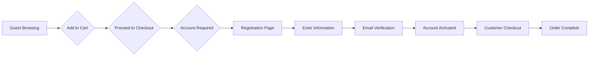
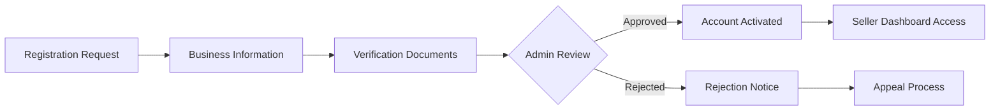
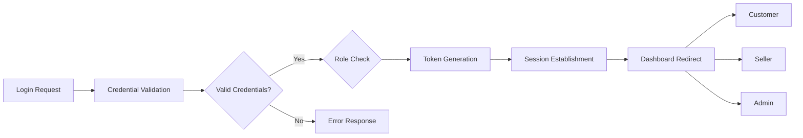
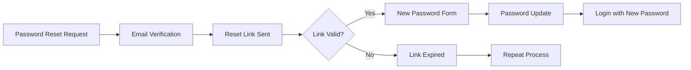

# E-commerce Shopping Mall Platform: User Actors and Authentication Requirements

## Executive Summary

This document defines the comprehensive user management system for a multi-vendor e-commerce shopping mall platform. The platform supports four distinct user types: guests, customers, sellers, and administrators, each with specific authentication requirements and permission levels. The system implements JWT-based authentication with role-based access control to ensure secure operations across all platform functions.

## User Actor Definitions

### Guest Users
**Description**: Unauthenticated visitors who can browse the platform without creating an account.

**Characteristics**:
- No account registration required
- Limited platform access
- Cannot perform transactions
- Browse-only permissions
- Session-based tracking for cart functionality

**Business Rules**:
- THE system SHALL allow guest users to browse all public product catalogs
- THE system SHALL maintain guest shopping cart data for the duration of the browsing session
- THE system SHALL display prices and product information to guest users
- THE system SHALL require account creation before checkout
- THE system SHALL track guest browsing behavior for analytics purposes

### Customer Users
**Description**: Registered shoppers who have created accounts to access full platform functionality.

**Characteristics**:
- Full e-commerce capabilities
- Personal account management
- Order history and tracking
- Payment method storage
- Address book management
- Wishlist functionality
- Product review capabilities

**Business Rules**:
- THE system SHALL require email verification for customer account activation
- THE system SHALL allow customers to manage multiple shipping addresses
- THE system SHALL provide customers with complete order history access
- THE system SHALL enable customers to save payment methods securely
- THE system SHALL allow customers to write product reviews for purchased items
- THE system SHALL provide customers with wishlist and saved items functionality

### Seller Users
**Description**: Merchant accounts representing businesses or individuals who list and sell products on the platform.

**Characteristics**:
- Product catalog management
- Inventory control
- Order processing capabilities
- Revenue tracking
- Customer communication tools
- Performance analytics access

**Business Rules**:
- THE system SHALL require business verification for seller account approval
- THE system SHALL allow sellers to manage their product listings and inventory
- THE system SHALL provide sellers with order management tools
- THE system SHALL enable sellers to communicate with customers regarding orders
- THE system SHALL provide sellers with sales analytics and reporting
- THE system SHALL allow sellers to set shipping policies and return rules

### Administrator Users
**Description**: Platform staff responsible for overseeing operations, managing users, and maintaining system integrity.

**Characteristics**:
- Complete platform oversight
- User account management
- Transaction monitoring
- Dispute resolution
- System configuration
- Content moderation
- Financial reporting access

**Business Rules**:
- THE system SHALL restrict admin access to authorized personnel only
- THE system SHALL provide admins with comprehensive user management tools
- THE system SHALL enable admins to review and moderate platform content
- THE system SHALL allow admins to manage payment disputes and refunds
- THE system SHALL provide admins with platform-wide analytics and reporting
- THE system SHALL enable admins to configure platform settings and policies

## Authentication Requirements

### Core Authentication Functions

**User Registration Process**:
WHEN a user attempts to register, THE system SHALL validate all required information including email, password, and user type selection. IF validation succeeds, THEN THE system SHALL create the user account and send verification email. IF validation fails, THEN THE system SHALL display appropriate error messages.

**Login Authentication**:
WHEN a user submits login credentials, THE system SHALL validate email and password combination. IF credentials are valid, THEN THE system SHALL generate JWT tokens and establish user session. IF credentials are invalid, THEN THE system SHALL deny access and increment failed login counter.

**Password Security Requirements**:
THE system SHALL enforce password complexity requirements including minimum 8 characters, uppercase, lowercase, numbers, and special characters. THE system SHALL hash all passwords using industry-standard encryption. THE system SHALL implement password reset functionality via secure email verification. THE system SHALL maintain password history to prevent reuse of recent passwords.

### JWT Token Management

**Token Structure and Claims**:
THE system SHALL issue JWT access tokens valid for 15 minutes containing user ID, role, permissions, and session data. THE system SHALL issue JWT refresh tokens valid for 30 days for persistent sessions. THE system SHALL include platform-specific claims: userRole, sellerId (for sellers), adminLevel (for admins). THE system SHALL sign all tokens with secure private key and support token validation.

**Token Storage and Security**:
THE system SHALL store tokens securely using httpOnly cookies for web applications. THE system SHALL support localStorage storage for mobile applications with appropriate warnings. THE system SHALL implement token blacklisting for revoked tokens. THE system SHALL provide token refresh mechanism without requiring re-authentication.

### Multi-Factor Authentication (Optional Enhancement)
WHERE enhanced security is required, THE system SHALL support SMS-based two-factor authentication. WHERE enhanced security is required, THE system SHALL support authenticator app integration. WHERE enhanced security is required, THE system SHALL make MFA optional for customers but mandatory for admin users.

## Permission Matrix

### Permission Definitions by Function Area

**Product Catalog Access**:
| Function | Guest | Customer | Seller | Admin |
|----------|-------|----------|---------|-------|
| Browse products | ✅ | ✅ | ✅ | ✅ |
| View product details | ✅ | ✅ | ✅ | ✅ |
| Search products | ✅ | ✅ | ✅ | ✅ |
| Create product listings | ❌ | ❌ | ✅ | ✅ |
| Edit product information | ❌ | ❌ | Own products only | ✅ |
| Delete products | ❌ | ❌ | Own products only | ✅ |
| Manage categories | ❌ | ❌ | ❌ | ✅ |
| View private products | ❌ | ❌ | ✅ | ✅ |

**Shopping and Orders**:
| Function | Guest | Customer | Seller | Admin |
|----------|-------|----------|---------|-------|
| Add to cart | Session only | ✅ | ❌ | ❌ |
| Create wishlist | ❌ | ✅ | ❌ | ❌ |
| Place orders | ❌ | ✅ | ❌ | ❌ |
| View order history | ❌ | Own orders | Own sales | All orders |
| Cancel orders | ❌ | Own orders | Own sales | All orders |
| Process payments | ❌ | For own orders | For own sales | ❌ |
| Handle refunds | ❌ | Own requests | Own sales | All refunds |
| Manage shipping | ❌ | Own addresses | Own products | All shipping |

**Account Management**:
| Function | Guest | Customer | Seller | Admin |
|----------|-------|----------|---------|-------|
| Create account | ✅ | N/A | ✅ | Admin only |
| Edit profile | ❌ | Own profile | Own profile | All profiles |
| Change password | ❌ | Own account | Own account | All accounts |
| Reset password | ❌ | ✅ | ✅ | ✅ |
| Manage addresses | ❌ | ✅ | Business addresses | ❌ |
| Manage payment methods | ❌ | ✅ | Business methods | ❌ |
| View account activity | ❌ | ✅ | ✅ | All activity |
| Suspend account | ❌ | ❌ | ❌ | ✅ |

**Reviews and Ratings**:
| Function | Guest | Customer | Seller | Admin |
|----------|-------|----------|---------|-------|
| Write reviews | ❌ | Own purchases | ❌ | ✅ |
| Rate products | ❌ | Own purchases | ❌ | ✅ |
| Moderate reviews | ❌ | ❌ | Own products | ✅ |
| Respond to reviews | ❌ | ❌ | ✅ | ✅ |
| Report inappropriate content | ❌ | ✅ | ✅ | ✅ |

**Administration**:
| Function | Guest | Customer | Seller | Admin |
|----------|-------|----------|---------|-------|
| View analytics | ❌ | Personal only | Business only | All analytics |
| Manage users | ❌ | ❌ | ❌ | ✅ |
| Handle disputes | ❌ | ❌ | Own disputes | ✅ |
| Configure platform | ❌ | ❌ | ❌ | ✅ |
| Generate reports | ❌ | ❌ | Business only | All reports |

## Access Control Rules

### Authentication Verification
WHEN users attempt to access protected resources, THE system SHALL verify valid JWT token. IF token is missing or invalid, THEN THE system SHALL deny access with authentication error. IF token is expired, THEN THE system SHALL require token refresh or re-authentication.

### Role-Based Authorization
THE system SHALL check user role permissions before allowing access to any protected function. THE system SHALL enforce ownership-based permissions where users can only modify their own data. THE system SHALL implement hierarchical permissions where admin users can access all lower-level functions. THE system SHALL log all authorization attempts for security monitoring.

### Data Access Control
WHEN a user requests access to data, THE system SHALL verify ownership or administrative privileges. THE system SHALL prevent customers from accessing other customers' order information. THE system SHALL prevent sellers from viewing or modifying other sellers' product data. THE system SHALL allow admins to access all platform data with appropriate audit trails.

### Business Rule Validation
THE system SHALL validate that users cannot perform actions outside their role permissions. THE system SHALL prevent sellers from creating fake customer accounts for review manipulation. THE system SHALL ensure customers cannot access wholesale or supplier pricing information. THE system SHALL enforce platform policies through access control mechanisms.

## User Journey Maps

### Guest to Customer Conversion Flow

### Seller Registration Flow

### Login Authentication Sequence

### Password Recovery Process

## Security Requirements

### Password Security Standards
THE system SHALL enforce minimum 8-character passwords with complexity requirements. THE system SHALL hash passwords using bcrypt or stronger encryption with appropriate salt rounds. THE system SHALL lock accounts after 5 consecutive failed login attempts for 30 minutes. THE system SHALL implement CAPTCHA verification after 3 failed login attempts. THE system SHALL never store or log plaintext passwords.

### Session Management
THE system SHALL generate cryptographically secure session tokens. THE system SHALL implement session timeout after 30 minutes of inactivity. THE system SHALL provide secure logout functionality that destroys all session data. THE system SHALL detect concurrent login sessions and provide appropriate controls. THE system SHALL implement session fixation prevention measures.

### API Security
THE system SHALL implement rate limiting on authentication endpoints. THE system SHALL use HTTPS for all authentication communications. THE system SHALL implement CSRF protection for state-changing operations. THE system SHALL validate all input data to prevent injection attacks. THE system SHALL implement appropriate CORS policies for cross-origin requests.

### Data Protection
THE system SHALL encrypt sensitive user data at rest including payment information. THE system SHALL implement field-level encryption for highly sensitive data. THE system SHALL maintain audit logs of all authentication and authorization events. THE system SHALL comply with relevant data protection regulations (GDPR, CCPA). THE system SHALL provide users with data export and deletion capabilities.

### Account Security Features
THE system SHALL notify users of login attempts from new devices or locations. THE system SHALL provide account activity logs to users. THE system SHALL implement device authorization management. THE system SHALL support account recovery through verified email or phone. THE system SHALL provide two-factor authentication options for enhanced security.

## Performance and User Experience Requirements

### Authentication Performance
THE system SHALL complete authentication processes within 2 seconds under normal load conditions. THE system SHALL handle password reset requests within 30 seconds. THE system SHALL support concurrent authentication of at least 10,000 users. THE system SHALL maintain authentication performance during peak shopping periods.

### User Experience Standards
THE system SHALL provide clear error messages that don't reveal system vulnerabilities. THE system SHALL offer password strength indicators during account creation. THE system SHALL remember user preferences for trusted devices. THE system SHALL provide seamless transitions between authentication states. THE system SHALL support social login integration as an optional feature.