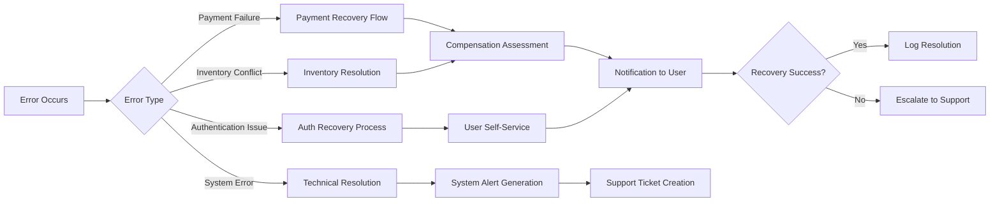

# Error Handling Scenarios for Shopping Mall Platform

## Executive Summary

This document provides comprehensive error handling specifications for the e-commerce shopping mall platform, ensuring seamless user experiences even when technical issues occur. The specifications cover payment failures, inventory conflicts, authentication issues, system errors, and recovery processes with clear business rules for each scenario.

## Payment Failure Handling

### Payment Processing Errors

**WHEN a payment attempt fails due to insufficient funds, THE system SHALL display a user-friendly message explaining the issue and offer alternative payment methods.**

**WHEN a payment gateway experiences connectivity issues, THE system SHALL automatically retry the payment up to 3 times with 2-second intervals before displaying an error message with alternative payment options.**

**WHEN a user's credit card is declined due to suspected fraud detection, THE system SHALL guide the user through card verification steps and offer prepaid payment methods as alternatives.**

**WHEN payment processing exceeds 30 seconds without response, THE system SHALL timeout and automatically cancel the pending transaction while preserving the user's shopping cart contents.**

**WHEN a partial payment failure occurs (authorized but not captured), THE system SHALL immediately void the authorization and notify the user to attempt payment again.**

### Payment Recovery Processes

**WHEN payment fails during checkout, THE system SHALL immediately release any held inventory and restore the user's shopping cart to its pre-payment state.**

**IF a payment fails after inventory has been allocated, THEN THE system SHALL automatically release the inventory allocation within 5 minutes to prevent overselling.**

**WHEN payment recovery is attempted, THE system SHALL verify inventory availability before allowing retry to prevent order conflicts.**

### Refund and Compensation Procedures

**WHEN a refund is requested due to payment processing errors, THE system SHALL process the refund within 24 hours and notify the user with transaction confirmation details.**

**WHERE seller-initiated cancellations occur after payment, THE system SHALL immediately process full refunds including any applied discounts or promotional credits.**

## Inventory Conflicts

### Stock Availability Issues

**WHEN a user attempts to add out-of-stock items to cart, THE system SHALL display current stock status and offer to notify when the item becomes available.**

**WHEN inventory levels change during user's active shopping session, THE system SHALL update cart quantities in real-time and notify users of any unavailable items before checkout.**

**IF inventory becomes insufficient after checkout initiation, THEN THE system SHALL automatically adjust order quantities and request user confirmation of changes before payment processing.**

### Overselling Prevention

**THE system SHALL implement inventory reservation for items in active shopping carts, holding stock for a maximum of 30 minutes before automatic release.**

**WHEN multiple users compete for limited inventory during flash sales, THE system SHALL use first-come-first-served principles with real-time inventory updates.**

**WHERE inventory conflicts occur across multiple seller warehouses, THE system SHALL prioritize the closest warehouse for shipping cost optimization while maintaining stock availability guarantees.**

### Inventory Reconciliation

**WHEN physical inventory deviates from system records, THE system SHALL automatically adjust available quantities and notify relevant sellers for inventory audits.**

**THE system SHALL maintain an inventory history log for all stock movements to support investigation and reconciliation processes.**

## Authentication Failures

### Login and Registration Errors

**WHEN a user enters incorrect login credentials three consecutive times, THE system SHALL impose a 15-minute lockout period and offer password reset assistance.**

**WHEN email verification fails or expires, THE system SHALL allow re-verification requests and maintain limited account functionality for essential operations.**

**WHERE registration attempts encounter existing email addresses, THE system SHALL provide clear account recovery options and prevent duplicate account confusion.**

### Session Management Issues

**WHEN user sessions expire during active shopping, THE system SHALL save cart contents and allow seamless continuation after re-authentication without data loss.**

**THE system SHALL handle concurrent login attempts by forcing logout of previous sessions while preserving any active transaction progress.**

**WHEN authentication tokens are corrupted or invalid, THE system SHALL require fresh login while maintaining user preference persistence.**

### Account Security Threats

**IF suspicious login activity is detected, THEN THE system SHALL prompt for additional verification steps before granting account access.**

**WHEN password reset requests exceed normal patterns, THE system SHALL implement rate limiting and alternative verification methods.**

## System Error Scenarios

### Technical Infrastructure Failures

**WHEN database connection issues prevent user operations, THE system SHALL implement graceful degradation by serving cached content and queueing user actions for later processing.**

**WHEN external service integrations (payment gateways, shipping APIs) become unavailable, THE system SHALL provide alternative service options and maintain core e-commerce functionality.**

**THE system SHALL handle CDN failures by serving media content from backup sources to maintain product catalog availability.**

### Performance Degradation

**WHEN server response times exceed 5 seconds, THE system SHALL display progressive loading indicators and optimize requests to maintain user experience.**

**WHERE traffic spikes threaten system availability, THE system SHALL implement request queuing and priority processing for checkout and payment operations.**

### Data Consistency Issues

**WHEN order data inconsistencies are detected, THE system SHALL alert administrators while maintaining user-facing order status accuracy.**

**THE system SHALL implement data validation checkpoints at critical transitions (cart to order, order to fulfillment) to prevent corruption propagations.**

## User Recovery Processes

### Self-Service Recovery Options

**THE system SHALL provide intuitive error recovery paths that guide users from error displays back to successful task completion.**

**WHERE shopping cart conflicts occur, THE system SHALL offer one-click resolution options that preserve user preferences while resolving technical issues.**

**WHEN checkout processes encounter errors, THE system SHALL maintain form data and allow users to resume from the nearest logical checkpoint.**

### Escalation and Support Integration

**WHEN user errors require manual intervention, THE system SHALL generate support tickets with complete session context including user actions, timestamps, and relevant transaction IDs.**

**THE system SHALL provide live chat integration at critical error points where users need immediate assistance (payment failures, order completion issues).**

**WHERE software defects cause user errors, THE system SHALL automatically log detailed error information for developer analysis while displaying user-appropriate error messages.**

### Communication and Transparency

**THE system SHALL provide proactive email and SMS notifications for errors affecting order status, payment processing, or delivery timelines.**

**WHEN extended system outages impact user orders, THE system SHALL implement status pages with regular updates and estimated resolution times.**

## Compensation Policies

### Refund Processing

**WHEN system errors necessitate order cancellations, THE system SHALL initiate automatic full refunds within one business day including shipping costs and convenience fees.**

**THE system SHALL provide refund status tracking and completion notifications with clear timelines for fund availability.**

### Store Credit Management

**WHERE compensation is provided through store credits, THE system SHALL calculate appropriate credit amounts based on inconvenience factors including delivery delays and error frequency.**

**THE system SHALL maintain clear policies distinguishing between purchase refunds and service inconvenience compensation.**

### Customer Service Integration

**THE system SHALL provide customer service representatives with complete error context including user session logs, transaction history, and system error details.**

**WHERE disputes arise from system errors, THE system SHALL implement automated escalation workflows based on error severity and compensation complexity.**

## Error Logging and Monitoring

### System Health Monitoring

**THE system SHALL maintain comprehensive error logs with timestamps, user identifiers, successful recovery attempts, and resolution outcomes.**

**THE system SHALL generate alerts for error patterns indicating potential system issues before they impact significant user populations.**

### User Experience Tracking

**THE system SHALL track user recovery success rates and identify error handling improvements based on user behavior analytics.**

**WHERE multiple recovery attempts fail, THE system SHALL flag affected users for proactive customer service outreach.**

## Performance Impact Considerations

## Business Continuity Requirements

**THE system SHALL implement circuit breakers for external service integrations to prevent cascading failures across multiple system components.**

**WHEN critical errors affect core business operations (checkout, payment), THE system SHALL switch to backup systems within 30 seconds to maintain service availability.**

**THE system SHALL maintain emergency response protocols for major system failures including communication plans for affected users and administrators.**

## Success Metrics and Monitoring

**THE system SHALL track error recovery success rates, compensation processing times, and customer satisfaction with error handling procedures.**

**THE system SHALL implement error trend analysis to identify systemic issues driving frequent errors for proactive resolution.**

## Implementation Priorities

1. **Immediate** - Payment failure handling and recovery processes
2. **High Priority** - Inventory conflict resolution and overselling prevention
3. **Medium Priority** - Authentication error handling and session management
4. **Ongoing** - System error monitoring and user experience optimization

This comprehensive error handling specification ensures the e-commerce platform maintains user trust and business continuity even during system challenges, with clear recovery paths and appropriate compensation mechanisms for affected users.

> *Developer Note: This document defines business requirements only. All technical implementations (architecture, APIs, database design, etc.) are at the discretion of the development team.*