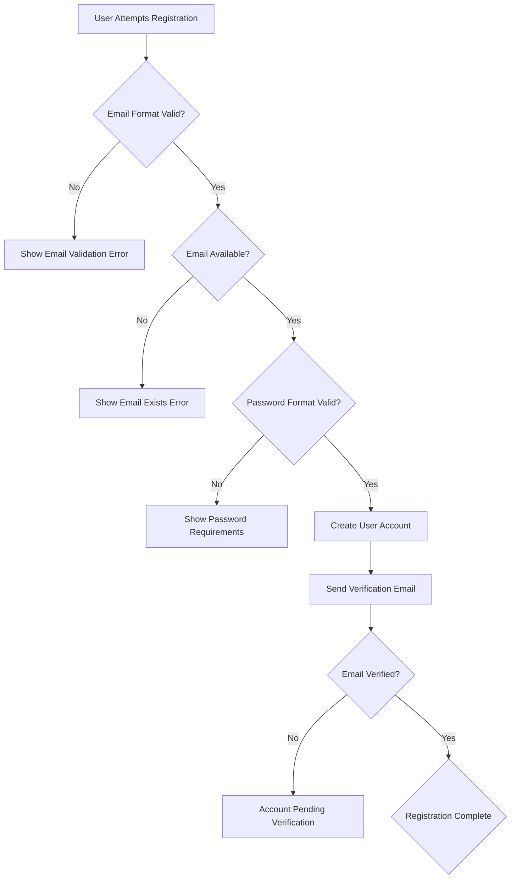
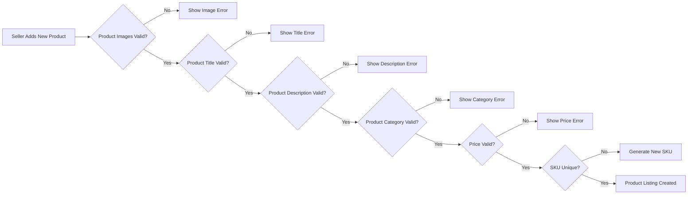
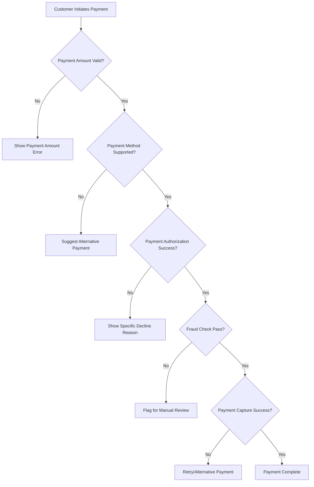

# Business Rules and Validation Framework Requirements Specification

## Executive Summary

This document defines comprehensive business rules, validation requirements, and constraint handling mechanisms for the shopping mall multi-vendor e-commerce platform. These rules ensure data integrity, enforce business logic, maintain regulatory compliance, provide consistent user experience across all platform operations, and create robust error handling processes that maintain system reliability.

## 1. User Management Business Rules

### 1.1 User Registration Validation Framework

**WHEN a user attempts to register, THE system SHALL enforce the following validation rules:**

THE email address SHALL validate format compliance "user@domain.com" and SHALL NOT exceed 100 characters. IF the email address already exists in the system, THEN THE registration attempt SHALL be rejected with a message "This email is already registered. Please use a different email or reset your password."

THE password requirement SHALL enforce minimum 8 characters with at least one uppercase letter, one lowercase letter, one number, and one special character from the approved set: !@#$%^&*()_+-=[]{}|;:,.<>?. Invalid passwords SHALL be rejected with a message "Password must be at least 8 characters and include uppercase, lowercase, numbers, and special characters."

THE system SHALL implement progressive login failure protection. WHEN users enter incorrect passwords 5 consecutive times, THE account SHALL be temporarily locked for 30 minutes with exponentially increasing cool-down periods for subsequent failures. The lockout timer SHALL restart after successful authentication.

### 1.2 Profile Management Validation Rules

**THE user profile management SHALL implement the following validation scenarios:**

THE display name SHALL allow 2-50 characters using only letters, numbers, spaces, and hyphens. Invalid display names SHALL be rejected with a message "Display name must be 2-50 characters and can only contain letters, numbers, spaces, and hyphens."

THE phone number SHALL be required for sellers and SHALL follow international format with country code validation. WHEN users enter phone numbers, THE system SHALL verify uniqueness across the platform and confirm ability to send verification messages within 2 minutes.

THE date of birth validation SHALL ensure customers are minimum 13 years old and SHALL display appropriate age verification messages when restrictions apply. For sellers, additional age verification SHALL be required based on product categories they intend to sell.

WHERE address information is provided, THE postal code format SHALL be validated against the selected country's postal system. WHEN mismatches are detected, THE system SHALL provide suggestions based on the entered address and SHALL NOT accept invalid postal codes.

## 2. Product Catalog Business Logic

### 2.1 Product Listing Validation Framework

**THE product listing system SHALL enforce complex validation rules with immediate feedback:**

WHEN sellers create products, THE system SHALL require minimum one image with resolution of at least 800x800 pixels and SHALL accept only JPEG, PNG, or WebP format files up to 5MB in size. IF the image fails validation, THEN THE upload shall be rejected with explanation "Product images must be at least 800x800 pixels and under 5MB in size"

THE product title SHALL be validated with length constraints of 10-200 characters and SHALL NOT contain promotional text, contact information, or external website references. Invalid titles SHALL be rejected with specific guidance showing what content is prohibited.

THE product description SHALL enforce a minimum of 100 characters and SHALL NOT include external website links, contact information, or prohibited content such as hate speech or discriminatory language. Content violating these rules SHALL be flagged for manual review by platform administrators.

**THE pricing validation SHALL implement business logic:**

THE price value SHALL be positive currency amount accepting maximum 2 decimal places (e.g., $19.99). The system SHALL reject zero, negative, or extremely high values that appear unrealistic for the product category.

WHEN sellers enter prices in foreign currencies, THE system SHALL automatically calculate applicable taxes based on seller location and shall display tax-inclusive pricing as required by the buyer's jurisdiction.

THE system SHALL implement category-specific minimum and maximum price ranges. WHEN products exceed reasonable price ranges for their categories, the listing shall be flagged for manual review with explanation of apparent price discrepancies.

### 2.2 Inventory Management Validation

**THE inventory tracking system SHALL implement business rules:**

WHEN a customer adds an item to cart, THE system SHALL immediately verify inventory availability and SHALL reserve that inventory for exactly 30 minutes during checkout process. IF the checkout is not completed within the reservation period, THEN THE inventory SHALL be automatically released and made available to other customers.

THE inventory count SHALL accept only non-negative whole numbers (0-999,999 maximum). Decimals SHALL NOT be allowed, and zero inventory SHALL automatically mark products as "Out of Stock" across all customer-facing interfaces.

WHHERE products have multiple variants, THE inventory SHALL be tracked at the SKU (Stock Keeping Unit) level with independent counts for each combination (size, color, material). When any variant reaches zero inventory, THAT specific combination SHALL be marked as unavailable while other variants remain purchasable.

THE low stock notification system SHALL automatically alert sellers when inventory drops below their predefined threshold (default threshold set at 5 units). The notification SHALL include suggestions to restock popular items based on recent sales velocity.

**THE SKU (Stock Keeping Unit) system SHALL implement unique constraints:**

THE SKU code SHALL be unique across the entire platform with validation for alphanumeric characters and hyphens only. The format requirement SHALL be 8-20 characters, and duplicates SHALL be rejected immediately with guidance for creating acceptable SKU codes.

WHEN sellers manually enter SKUs, THE system SHALL validate format before acceptance. IF sellers prefer automatic generation, THE system SHALL create SKU codes following predictable patterns based on product and variant attributes.

## 3. Shopping Cart and Checkout Business Rules

### 3.1 Cart Management Validation Framework

**THE shopping cart operations SHALL enforce comprehensive validation rules:**

WHEN customers add items to cart, THE system SHALL verify the seller has sufficient inventory in the selected variant combination within 2 seconds. If insufficient inventory is available, the system SHALL display the message "Only X units available" and prevent adding more than the available quantity.

THE quantity field SHALL accept only positive whole numbers (1-99 maximum). When customers attempt to enter zero, negative values, or values exceeding 99, THE system SHALL reject the input with message "Quantity must be between 1 and 99" and SHALL reset the field to the previous valid value.

WHERE products have variants, THE system SHALL require specific variant selection before allowing "Add to Cart" operation. When customers select unavailable variant combinations, THE system SHALL display "This combination is currently out of stock" and suggest available alternatives.

IF products become unavailable after being added to cart (due to inventory changes or seller deactivation), THE system SHALL immediately notify customers with a banner message and shall provide three resolution options: Remove the unavailable item, Wait if "Back in Stock" notifications are available, or Contact the seller to check current availability.

**THE cart persistence SHALL be managed by business rules:**

WHILE customers are logged in, THE system SHALL preserve cart items for 30 days of inactivity, sending gentle reminder emails on day 25 to encourage purchase completion. For guest users, THE cart SHALL be preserved for only 2 hours using browser local storage.

### 3.2 Order Creation Validation Framework

**THE order creation system SHALL implement minimum value thresholds:**

THE minimum order value SHALL be $10.00 per seller for processing. When checkout attempts fall below this threshold, THE system SHALL display message "Minimum order value of $10.00 required per seller" and suggest adding more items or shopping with that particular seller.

WHEN customers purchase from multiple sellers (the multi-seller shopping cart scenario), THE system SHALL automatically create separate orders for each seller based on their respective cart contents. Each seller's order SHALL maintain unique order numbers with relationships to the master customer transaction for unified customer experience.

**THE shipping address validation SHALL implement geographic constraints:**

THE postal code format SHALL be automatically validated against the selected country's postal system with format checking, existence validation, and geographic region matching to confirm valid delivery locations. When invalid postal codes are entered, THE system SHALL provide correction suggestions based on the entered city and address information.

THE maximum shipping package weight SHALL be 30kg for standard shipping and 150kg for freight shipping services. When orders exceed these limits, THE system SHALL automatically split shipments or recommend freight services with notification "Your order exceeds standard shipping limits - freight service required for delivery".

## 4. Payment System Business Rules

### 4.1 Payment Transaction Validation Framework

**THE payment processing system SHALL enforce transactional limits:**

THE maximum single transaction amount SHALL be $10,000 for credit card payments. Purchases exceeding this threshold SHALL be automatically flagged for manual approval and the customer SHALL be contacted by customer service within 2 hours to verify the legitimate nature of the transaction.

WHERE payment authorization fails, THE system SHALL categorize errors and provide specific guidance messages based on failure type: Insufficient funds ("Your card has insufficient funds. Please try a different payment method") / Declined by bank ("Your bank declined this payment. Contact your bank for assistance") / Technical issues ("We're experiencing a temporary issue processing payments. Please try again later").

THE currency support system SHALL automatically handle conversions with real-time exchange rates updated every 15 minutes. WHEN prices are displayed in customer's local currency, THE system SHALL clearly indicate "Converted from US Dollars" with the original amount shown alongside converted pricing.

### 4.2 Refund Processing Business Rules

**THE refund processing system SHALL implement regulatory compliance:**

THE refund processing SHALL complete within 5-7 business days of approval, with specific timing dependent on the payment method used. During bank holidays or processing delays, THE system SHALL update the expected completion date and notify affected customers.

WHERE partial refunds are processed for multi-seller orders, THE system SHALL recalculate all relevant platform fees, commissions, and taxes based on the proportionate refund amount. The recalculation SHALL be clearly displayed to both customers and affected sellers within their respective transaction histories.

IF customers initiate credit card chargebacks, THE seller SHALL have exactly 10 business days to provide transaction documentation and compelling evidence to dispute the chargeback claim. After this period, THE chargeback SHALL be automatically accepted with appropriate financial adjustments.

## 5. Marketplace Business Rules

### 5.1 Multi-Seller Transaction Framework

**THE multi-seller shopping cart SHALL maintain operational separation:**

WHERE customers initiate purchases from multiple sellers, THE system SHALL create completely independent orders for each seller while maintaining the master customer relationship for unified user experience. Each seller order SHALL have separate order numbers, processing timelines, shipping arrangements, and payment distributions across the respective seller accounts.

THE platform commission calculation SHALL be performed individually per seller based on their specific product categories and seller agreement terms. When commission rates differ between sellers in the same master transaction, THE customer experience SHALL remain unified while the financial processing maintains appropriate percentage deductions.

**THE cross-seller communication SHALL enforce privacy boundaries:**

THE system SHALL prevent sellers from viewing other sellers' product information, pricing strategies, inventory levels, or business performance within the same shared customer transaction. Any attempt to view competitor information SHALL be blocked and logged as potential policy violations.

WHERE disputes arise between customers and sellers in multi-seller transactions, THE platform SHALL provide coordinated dispute resolution while maintaining separate liability for each seller's involvement. The resolution process SHALL keep liability containment while ensuring overall customer satisfaction across the entire shopping experience.

### 5.2 Platform Policy Enforcement

**THE system monitoring SHALL implement automatic compliance detection:**

THE anti-fraud system SHALL monitor for behavioral anomalies including rapid payment attempts from new locations, orders to known high-risk addresses, or account login patterns indicating potential unauthorized access. When fraud indicators are detected, THE system SHALL immediately flag for manual review and suspend further transactions until verification clears.

THE automated sales tax calculation system SHALL determine applicable taxes based on complex factors including buyer location, seller location, product categories, and specific state/local regulations. The tax collection SHALL be automatically calculated with specific rates updated daily based on regulatory database updates.

## 6. Error Handling and Validation User Experience

### 6.1 User-Friendly Error Messages Framework

**THE validation error handling SHALL provide specific guidance:**

WHEN users encounter validation errors, THE system SHALL display exactly what validation requirements failed and provide specific examples of acceptable input formats. Instead of generic messages, customers SHALL receive guidance like "The phone number must be in format: +1 (555) 123-4567".

WHERE complex business rules create validation failures, THE system SHALL suggest alternative actions users can take to achieve their goals. If a product becomes unavailable, the system shall suggest similar available alternatives; If payment methods fail, the system shall suggest alternative payment options.

THE error message language SHALL maintain professional tone using positive language that guides users toward solutions rather than simply rejecting inputs. ALL error messages SHALL be grammatically reviewed and culturally appropriate for international audiences.

**THE input preservation system SHALL prevent data loss:**

IF users encounter validation errors, THE system SHALL preserve all correctly entered form data automatically without requiring users to retype their information. The validation indicators SHALL be displayed inline next to the specific fields requiring attention rather than clearing entire forms.

WHERE users must navigate away from incomplete orders or forms, THE system SHALL preserve progress automatically with clear indication that the incomplete process can be resumed. Customers returning to continue purchases SHALL find all items still in cart with any added personalization information preserved exactly as entered.

This comprehensive business rules specification creates the fundamental framework for maintaining data integrity, enforcing business logic compliance, and ensuring exceptional user experience across the multi-vendor marketplace platform while maintaining regulatory adherence and operational excellence.